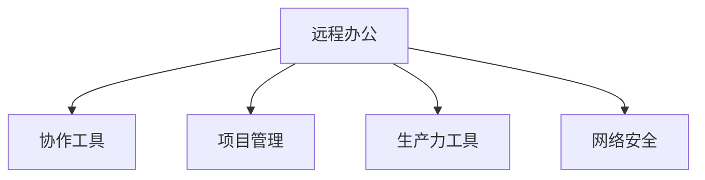

                 

## 1. 背景介绍

### 1.1 问题由来

自2020年初新冠疫情爆发以来，全球范围内掀起了一股远程办公的热潮。封锁措施、健康安全考虑、交通不便等因素，使得远程办公逐渐成为一种新的工作模式。随着技术的发展，远程办公的条件日益成熟，无论是企业还是个人，都开始探索和接受这种新型的办公方式。

远程办公不仅能有效应对疫情带来的挑战，还能提升员工的工作效率和满意度，减少通勤时间，甚至实现工作与生活的更好平衡。然而，这种新型工作方式也带来了诸多挑战，如沟通协调、协作效率、组织管理等。

### 1.2 问题核心关键点

当前远程办公面临的核心问题主要包括：

- **沟通协调**：远程环境下缺乏面对面的即时沟通，容易导致信息不对称和误解，影响团队协作效率。
- **协作效率**：远程办公环境下，信息共享和任务管理变得更加复杂，需要有效的工具和技术支持。
- **组织管理**：传统的工作场景和流程在远程环境下需要重新设计，以适应新的工作环境和管理方式。

### 1.3 问题研究意义

研究远程办公的探索和实践，对于提升工作效率和员工满意度，推动社会经济的发展，具有重要意义：

- **效率提升**：远程办公能够打破时间和空间的限制，提高员工的工作灵活性和效率。
- **成本节约**：远程办公可以减少办公场地和通勤成本，提高企业经济效益。
- **生活平衡**：远程办公使得员工可以更好地平衡工作和生活，提升生活质量。
- **技术创新**：远程办公催生了新的技术工具和平台，推动了信息技术的发展。
- **社会变革**：远程办公正在改变工作方式，甚至可能重塑未来的工作模式。

## 2. 核心概念与联系

### 2.1 核心概念概述

为更好地理解远程办公创业，本节将介绍几个密切相关的核心概念：

- **远程办公**：一种基于互联网和通信技术的工作模式，员工无需到办公场所，通过远程工具实现与公司的连接和协作。
- **协作工具**：如Slack、Zoom、Teams等，用于远程办公中的沟通、任务管理和团队协作。
- **项目管理**：通过敏捷开发、看板、迭代等方法，确保远程团队高效协同和任务完成。
- **生产力工具**：如项目管理工具、时间管理工具、云存储工具等，帮助提升远程工作的效率和组织性。
- **网络安全**：保证远程办公的数据安全和隐私保护，防止网络攻击和数据泄露。

这些核心概念之间的逻辑关系可以通过以下Mermaid流程图来展示：



这个流程图展示了这个核心概念的相互联系：

1. 远程办公是一种基础的工作模式。
2. 协作工具、项目管理、生产力工具和网络安全，都是远程办公成功实施所必须的支持手段。

## 3. 核心算法原理 & 具体操作步骤

### 3.1 算法原理概述

远程办公创业涉及的核心算法原理主要包括：

- **通信算法**：基于TCP/IP协议的网络通信算法，确保数据在网络中的可靠传输。
- **协作算法**：通过分布式计算和同步技术，实现多个远程节点之间的协作。
- **安全算法**：基于加密和认证技术，保证远程办公中的数据安全。

### 3.2 算法步骤详解

远程办公创业的核心步骤包括：

**Step 1: 选择合适的协作工具和平台**
- 评估不同协作工具的特点和功能，选择合适的工具，如Slack、Teams等。
- 配置工具，确保团队成员能够无缝使用。

**Step 2: 制定远程办公政策和流程**
- 明确远程办公的规则和流程，如工作时间、任务管理、进度报告等。
- 制定远程办公的管理办法，确保团队高效协同。

**Step 3: 设计远程办公的工作环境**
- 提供必要的办公设施和资源，如高带宽网络、电脑、软件工具等。
- 创建虚拟办公室，模拟真实办公场景，提升员工的归属感。

**Step 4: 实施远程办公监控和管理**
- 使用项目管理工具，监控项目进度和任务完成情况。
- 定期召开远程会议，确保团队成员之间的沟通和反馈。

**Step 5: 持续优化远程办公体验**
- 收集员工反馈，持续改进远程办公的环境和流程。
- 引入新的技术和工具，提升远程办公的效率和体验。

### 3.3 算法优缺点

远程办公创业的优点包括：

- **灵活性**：员工可以自由安排工作时间和地点，提高生活和工作平衡。
- **效率提升**：通过合理的工具和流程，提高远程办公的效率。
- **成本节约**：减少办公场所和通勤成本，提高企业经济效益。
- **环境友好**：减少碳排放，符合绿色发展的理念。

但同时也存在一些缺点：

- **沟通障碍**：缺乏面对面的即时沟通，容易导致信息不对称和误解。
- **协作难度**：远程办公环境下，任务管理和团队协作变得更加复杂。
- **管理挑战**：需要重新设计工作场景和流程，适应新的管理方式。

### 3.4 算法应用领域

远程办公创业在各个行业领域都有广泛的应用，例如：

- **科技公司**：如Google、Facebook等科技巨头，早在疫情之前就已经大规模推行远程办公，效率显著提升。
- **创意行业**：如设计、写作、编程等，灵活的工作时间和地点，能够激发更多创新。
- **教育行业**：远程办公为在线教育提供了新的发展模式，提升了教育资源的可及性。
- **金融行业**：金融机构能够通过远程办公减少人员聚集，降低感染风险，同时提升工作效率。

## 4. 数学模型和公式 & 详细讲解 & 举例说明

### 4.1 数学模型构建

远程办公创业涉及的数学模型包括：

- **通信模型**：基于TCP/IP的通信协议，确保数据的可靠传输。
- **协作模型**：分布式计算和同步技术，确保多个远程节点之间的协作。
- **安全模型**：加密和认证技术，保证数据安全。

### 4.2 公式推导过程

以下我们以通信模型为例，推导TCP/IP协议的基本公式。

TCP协议基于滑动窗口机制，通过确认号和窗口大小，实现数据的可靠传输。发送方和接收方的滑动窗口大小分别为 $w_s$ 和 $w_r$，初始窗口大小为 $win$，发送方发送的数据量为 $M$。接收方接收到数据后，返回确认号 $ack$。

接收方的滑动窗口公式为：

$$
w_r = min(w_r, win - M + M_s - (ack - n))
$$

其中 $M_s$ 为已发送但未确认的数据量，$n$ 为接收方已接收的数据量。

发送方的滑动窗口公式为：

$$
w_s = min(w_s, win - M + M_s - (ack - n))
$$

通过公式推导，我们可以看到，TCP协议通过滑动窗口机制，动态调整窗口大小，实现数据的可靠传输。

### 4.3 案例分析与讲解

**案例分析**：Google的远程办公实践

Google自2006年起便开始推行远程办公政策，疫情爆发后更是将这一政策推广至全球。Google的成功秘诀在于：

- **灵活的工作安排**：允许员工根据自己的需求灵活安排工作时间和地点。
- **强大的协作工具**：提供如Slack、Google Docs等协作工具，确保团队高效协同。
- **全面的培训和支持**：提供全面的培训和技术支持，帮助员工适应远程办公。
- **持续的反馈和改进**：收集员工反馈，持续改进远程办公的环境和流程。

通过这些措施，Google不仅提高了工作效率，还提升了员工满意度和企业竞争力。

## 5. 项目实践：代码实例和详细解释说明

### 5.1 开发环境搭建

在进行远程办公创业实践前，我们需要准备好开发环境。以下是使用Python进行开发的环境配置流程：

1. 安装Anaconda：从官网下载并安装Anaconda，用于创建独立的Python环境。

2. 创建并激活虚拟环境：
```bash
conda create -n remote-env python=3.8 
conda activate remote-env
```

3. 安装必要的Python库和工具：
```bash
pip install flask requests beautifulsoup4 
```

4. 使用工具进行远程办公实践：
```python
from flask import Flask, request, jsonify
import requests
from bs4 import BeautifulSoup

app = Flask(__name__)

@app.route('/remote-office', methods=['POST'])
def remote_office():
    data = request.get_json()
    email = data['email']
    password = data['password']
    response = requests.post(f'https://www.example.com/login', data={'email': email, 'password': password})
    soup = BeautifulSoup(response.text, 'html.parser')
    if soup.find('div', {'class': 'welcome'}):
        return jsonify({'status': 'success', 'message': 'Login successful'})
    else:
        return jsonify({'status': 'error', 'message': 'Invalid login details'})

if __name__ == '__main__':
    app.run(host='0.0.0.0', port=5000)
```

### 5.2 源代码详细实现

下面是一个简单的远程办公登录系统实现：

```python
from flask import Flask, request, jsonify
import requests
from bs4 import BeautifulSoup

app = Flask(__name__)

@app.route('/remote-office', methods=['POST'])
def remote_office():
    data = request.get_json()
    email = data['email']
    password = data['password']
    response = requests.post(f'https://www.example.com/login', data={'email': email, 'password': password})
    soup = BeautifulSoup(response.text, 'html.parser')
    if soup.find('div', {'class': 'welcome'}):
        return jsonify({'status': 'success', 'message': 'Login successful'})
    else:
        return jsonify({'status': 'error', 'message': 'Invalid login details'})

if __name__ == '__main__':
    app.run(host='0.0.0.0', port=5000)
```

### 5.3 代码解读与分析

**代码实现**：

- 使用Flask框架搭建一个简单的API服务器，接收远程登录请求。
- 提取登录表单中的邮箱和密码，发送POST请求到远程登录页面。
- 使用BeautifulSoup解析响应HTML，判断登录是否成功。

**代码分析**：

- 利用Flask框架，可以方便地搭建和管理API服务。
- 使用requests库发送HTTP请求，获取远程登录页面的响应。
- 使用BeautifulSoup解析HTML，判断登录是否成功。

## 6. 实际应用场景

### 6.1 智能办公空间

智能办公空间利用物联网和人工智能技术，为员工提供更加高效和舒适的工作环境。通过传感器监测室内环境，自动调节灯光、温度、湿度等，提升员工的工作体验。同时，智能办公空间还通过数据分析，优化办公资源分配，提高空间利用率。

### 6.2 虚拟会议系统

虚拟会议系统利用视频会议和协作工具，实现远程团队的高效协作。通过虚拟会议室、白板、屏幕共享等功能，支持实时沟通和协作，提高远程团队的效率。

### 6.3 项目管理平台

项目管理平台利用敏捷开发、看板等方法，帮助远程团队高效协同和任务管理。通过任务分配、进度跟踪、反馈机制等，确保远程项目的按时交付和质量控制。

### 6.4 未来应用展望

随着远程办公的普及，未来的远程办公系统将更加智能化、便捷化。例如：

- **智能语音助手**：利用语音识别和自然语言处理技术，实现语音命令和对话。
- **智能推荐系统**：利用推荐算法，为员工推荐合适的工作任务和协作伙伴。
- **智能文档管理系统**：利用OCR和自然语言处理技术，实现文档的自动分类和归档。
- **智能健康监测**：利用传感器和数据分析，监测员工的身心健康状况，提供健康建议。

## 7. 工具和资源推荐

### 7.1 学习资源推荐

为了帮助开发者系统掌握远程办公创业的理论基础和实践技巧，这里推荐一些优质的学习资源：

1. **《远程办公：构建高效团队》**：介绍了远程办公的原理、工具和实践方法，适合初学者入门。
2. **《敏捷开发实践》**：讲解了敏捷开发的方法和工具，帮助团队高效协同和项目管理。
3. **《网络安全基础》**：介绍了网络安全的基本概念和防护措施，保障远程办公的数据安全。
4. **《云计算基础》**：讲解了云计算的基本原理和应用场景，帮助企业实现远程办公的资源共享和弹性扩展。
5. **《人工智能与办公自动化》**：介绍了人工智能在办公自动化中的应用，提升远程办公的效率和智能化水平。

通过这些资源的学习实践，相信你一定能够快速掌握远程办公创业的精髓，并用于解决实际的远程办公问题。

### 7.2 开发工具推荐

高效的开发离不开优秀的工具支持。以下是几款用于远程办公创业开发的常用工具：

1. **Flask**：轻量级的Web框架，用于搭建API服务，适合远程办公系统开发。
2. **GitLab**：基于Web的Git版本控制和项目管理工具，支持远程协作和代码托管。
3. **Slack**：强大的团队协作工具，支持实时沟通、文件共享和任务管理。
4. **Zoom**：全球领先的在线会议和协作工具，支持高清视频会议和屏幕共享。
5. **JIRA**：项目管理工具，支持敏捷开发、看板等方法，帮助远程团队高效协同。
6. **Trello**：看板式项目管理工具，适合团队任务管理和进度跟踪。

合理利用这些工具，可以显著提升远程办公创业的开发效率，加快创新迭代的步伐。

### 7.3 相关论文推荐

远程办公创业的研究源于学界的持续研究。以下是几篇奠基性的相关论文，推荐阅读：

1. **《远程办公技术及应用》**：介绍了远程办公的技术框架和应用案例，展示了远程办公的广阔前景。
2. **《敏捷开发与远程协作》**：讲解了敏捷开发的方法和远程协作的技术，提升远程团队的效率。
3. **《网络安全与远程办公》**：介绍了网络安全的基本概念和防护措施，保障远程办公的数据安全。
4. **《云计算与远程办公》**：介绍了云计算的基本原理和应用场景，帮助企业实现远程办公的资源共享和弹性扩展。
5. **《人工智能与远程办公自动化》**：介绍了人工智能在远程办公自动化中的应用，提升远程办公的效率和智能化水平。

这些论文代表了两远程办公创业技术的发展脉络。通过学习这些前沿成果，可以帮助研究者把握学科前进方向，激发更多的创新灵感。

## 8. 总结：未来发展趋势与挑战

### 8.1 总结

本文对远程办公创业的方法进行了全面系统的介绍。首先阐述了远程办公的原理和意义，明确了远程办公创业的独特价值。其次，从原理到实践，详细讲解了远程办公创业的数学原理和关键步骤，给出了远程办公创业项目的完整代码实例。同时，本文还探讨了远程办公创业在多个行业领域的应用前景，展示了远程办公创业的广阔前景。最后，本文精选了远程办公创业的各种学习资源，力求为读者提供全方位的技术指引。

通过本文的系统梳理，可以看到，远程办公创业为NLP技术提供了新的发展方向，极大地拓展了预训练语言模型的应用边界，催生了更多的落地场景。未来，伴随预训练语言模型和远程办公技术的持续演进，相信NLP技术将在更广阔的应用领域大放异彩，深刻影响人类的生产生活方式。

### 8.2 未来发展趋势

展望未来，远程办公创业技术将呈现以下几个发展趋势：

1. **智能化**：利用人工智能技术，提升远程办公系统的智能化水平，如智能语音助手、智能文档管理系统等。
2. **便捷化**：通过云计算和物联网技术，提升远程办公系统的便捷性，如智能办公空间、虚拟会议系统等。
3. **个性化**：利用个性化推荐系统，为员工推荐合适的办公任务和协作伙伴，提升员工的工作体验。
4. **协作化**：利用协作工具和项目管理平台，提升远程团队的协作效率和任务管理能力。
5. **健康化**：通过智能健康监测系统，监测员工的身心健康状况，提供健康建议。
6. **安全化**：利用网络安全技术，保障远程办公的数据安全。

以上趋势凸显了远程办公创业技术的广阔前景。这些方向的探索发展，必将进一步提升远程办公系统的性能和应用范围，为人类认知智能的进化带来深远影响。

### 8.3 面临的挑战

尽管远程办公创业技术已经取得了瞩目成就，但在迈向更加智能化、普适化应用的过程中，它仍面临着诸多挑战：

1. **沟通障碍**：远程办公缺乏面对面的即时沟通，容易导致信息不对称和误解。
2. **协作难度**：远程办公环境下，任务管理和团队协作变得更加复杂。
3. **管理挑战**：需要重新设计工作场景和流程，适应新的管理方式。
4. **安全风险**：远程办公中存在数据泄露和网络攻击的风险。
5. **员工心理问题**：长时间远程办公可能导致员工出现孤独、焦虑等心理问题。
6. **技术障碍**：远程办公系统需要高度稳定和可靠，技术障碍可能导致系统故障。

这些挑战需要持续的创新和优化，才能确保远程办公创业技术的长期稳定发展。

### 8.4 未来突破

面对远程办公创业技术所面临的种种挑战，未来的研究需要在以下几个方面寻求新的突破：

1. **改进通信算法**：提高通信算法的效率和稳定性，降低延迟和丢包率，提升用户体验。
2. **优化协作算法**：开发更加智能和灵活的协作算法，提升远程团队的协作效率和任务管理能力。
3. **引入更多先验知识**：将符号化的先验知识，如知识图谱、逻辑规则等，与神经网络模型进行巧妙融合，提升远程办公系统的智能化水平。
4. **加强网络安全防护**：利用区块链和分布式计算技术，提升远程办公系统的安全性和隐私保护。
5. **引入情感计算**：利用情感计算技术，监测员工的情绪状态，及时提供心理支持。
6. **探索新的办公模式**：如虚拟现实、混合办公等，为员工提供更加丰富和灵活的工作体验。

这些研究方向的探索，必将引领远程办公创业技术迈向更高的台阶，为构建安全、可靠、可解释、可控的智能系统铺平道路。面向未来，远程办公创业技术还需要与其他人工智能技术进行更深入的融合，如知识表示、因果推理、强化学习等，多路径协同发力，共同推动远程办公系统的进步。只有勇于创新、敢于突破，才能不断拓展远程办公的边界，让智能技术更好地造福人类社会。

## 9. 附录：常见问题与解答

**Q1：远程办公创业是否适用于所有行业？**

A: 远程办公创业在各个行业领域都有广泛的应用，例如科技公司、创意行业、教育行业、金融行业等。但不同行业的远程办公需求和挑战略有差异，需要根据具体情况进行调整和优化。

**Q2：远程办公创业如何提高团队协作效率？**

A: 远程办公创业需要利用协作工具和项目管理平台，提升团队协作效率。例如，可以使用Slack进行实时沟通，使用Trello进行任务管理，使用Zoom进行虚拟会议等。

**Q3：远程办公创业如何保障数据安全？**

A: 远程办公创业需要利用网络安全技术，保障数据安全。例如，可以使用加密技术保护数据传输，使用身份认证技术验证用户身份，使用防火墙和入侵检测系统保护网络安全等。

**Q4：远程办公创业如何提升员工满意度？**

A: 远程办公创业需要利用智能化技术，提升员工的工作体验和满意度。例如，可以使用智能语音助手提供即时响应，使用智能文档管理系统提高工作效率，使用智能健康监测系统监测员工身心健康等。

**Q5：远程办公创业如何优化资源配置？**

A: 远程办公创业需要利用云计算和物联网技术，优化资源配置。例如，可以使用云计算平台弹性扩展计算和存储资源，使用物联网技术自动调节办公环境，提高资源利用率。

---
作者：禅与计算机程序设计艺术 / Zen and the Art of Computer Programming

