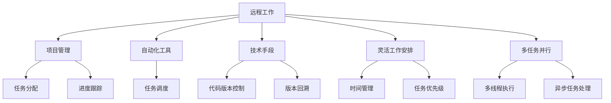

                 

# 远程工作：扩大收入来源的方法

> 关键词：远程工作, 收入来源, 软件开发, 项目管理, 自动化, 生产力, 工作灵活性

## 1. 背景介绍

### 1.1 问题由来

随着全球经济和科技的迅猛发展，远程工作模式已成为一种重要的工作方式。特别是在新冠肺炎疫情爆发后，远程工作更是被推向了前所未有的高度。远程工作不仅改变了人们的工作方式，也为公司提供了更广泛的人才选择和成本节约。然而，对于广大远程工作者而言，如何在远程工作模式下拓展收入来源，提升工作效益，已成为亟待解决的问题。

本文旨在深入分析远程工作背景下的收入来源拓展方法，探讨如何利用技术手段提升远程工作的效率和效果，为远程工作者提供切实可行的解决方案。

### 1.2 问题核心关键点

在远程工作模式下，拓展收入来源主要涉及以下几个关键点：

- 如何利用互联网和数字化工具提升工作效率和质量？
- 如何在多任务并行的模式下保持高水平的工作表现？
- 如何通过项目管理和自动化技术提升远程协作效率？
- 如何通过灵活的工作安排提升个人生产力和收入潜力？

针对这些问题，本文将详细探讨基于远程工作模式的收入来源拓展方法，并通过具体实例和理论分析，为远程工作者提供实用的建议和策略。

### 1.3 问题研究意义

拓展远程工作的收入来源，对于提升远程工作者的职业发展和个人生活品质，具有重要意义：

1. **职业发展**：通过灵活多样的远程工作机会，远程工作者可以获得更多的职业选择和晋升机会。
2. **收入提升**：充分利用技术手段和工具，提升工作效率，从而实现收入的持续增长。
3. **工作与生活平衡**：通过灵活的工作安排，实现工作与生活的平衡，提高生活质量。
4. **团队协作**：提升远程协作效率，使团队更加高效，增强团队凝聚力。

因此，研究远程工作背景下的收入来源拓展方法，对于远程工作者和企业来说，都具有重要的现实意义。

## 2. 核心概念与联系

### 2.1 核心概念概述

为了更好地理解远程工作背景下拓展收入来源的方法，首先需要对几个核心概念进行概述：

- **远程工作**：指员工无需到公司现场，通过互联网、电话、电子邮件等工具进行工作的模式。
- **项目管理和自动化**：通过科学的项目管理方法和自动化工具，提升团队协作效率和工作效率。
- **技术手段和工具**：包括各种软件开发工具、协作平台、生产力工具等，用于提升远程工作的效率和效果。
- **灵活工作安排**：通过灵活的工作时间和任务安排，最大化个人生产力和收入潜力。
- **多任务并行**：指在同一时间内处理多个任务的能力，对于提高远程工作者的工作效率至关重要。

### 2.2 核心概念原理和架构的 Mermaid 流程图



这个流程图展示了远程工作背景下的收入来源拓展方法，涉及项目管理和自动化、技术手段和工具、灵活工作安排等多方面的内容。

## 3. 核心算法原理 & 具体操作步骤

### 3.1 算法原理概述

远程工作背景下的收入来源拓展方法，主要基于以下几个核心算法原理：

1. **项目管理与任务调度**：通过科学的项目管理方法和自动化任务调度，确保项目按时完成，提升团队协作效率。
2. **版本控制与代码回溯**：通过版本控制工具，记录代码变更历史，实现快速查找和修复代码错误。
3. **时间管理和任务优先级**：通过时间管理和任务优先级设定，合理分配工作时间，提升个人生产力。
4. **多任务并行与异步处理**：通过多线程执行和异步任务处理，最大化多任务并行的能力，提升工作效率。

### 3.2 算法步骤详解

#### 3.2.1 项目管理与任务调度

1. **选择合适的项目管理工具**：如Trello、Asana、JIRA等，设定项目目标、任务分配、进度跟踪等功能。
2. **设定任务优先级**：根据任务的重要性和紧急程度，设定优先级，确保关键任务优先完成。
3. **自动化任务调度**：使用如Airflow、Kubernetes等自动化工具，定时执行任务，确保任务按时完成。

#### 3.2.2 版本控制与代码回溯

1. **选择版本控制工具**：如Git、SVN等，记录代码变更历史。
2. **建立代码审查流程**：通过代码审查，确保代码质量，及时发现和修复问题。
3. **实现版本回溯**：通过版本控制工具，实现快速查找和修复历史代码错误。

#### 3.2.3 时间管理和任务优先级

1. **设定工作时间**：根据个人生物钟和工作习惯，设定固定工作时间。
2. **使用时间管理工具**：如Toggl、RescueTime等，记录工作时间，分析时间分配，优化工作习惯。
3. **设定任务优先级**：根据任务的紧急程度和重要性，设定优先级，合理安排工作任务。

#### 3.2.4 多任务并行与异步处理

1. **使用多线程技术**：通过多线程技术，同时处理多个任务，提升工作效率。
2. **引入异步任务处理**：使用异步任务处理，确保高优先级任务能够及时完成，提高任务处理效率。

### 3.3 算法优缺点

#### 3.3.1 优点

1. **提升工作效率**：通过科学的项目管理方法和自动化工具，确保任务按时完成，提升工作效率。
2. **优化工作时间**：通过时间管理和任务优先级设定，合理分配工作时间，提升个人生产力。
3. **提升协作效率**：通过多任务并行和异步处理，最大化多任务并行的能力，提升团队协作效率。
4. **增强代码质量**：通过版本控制和代码回溯，确保代码质量，减少代码错误。

#### 3.3.2 缺点

1. **技术门槛较高**：需要掌握项目管理、自动化工具、版本控制等技术，可能对部分远程工作者有一定挑战。
2. **初期投入较大**：初期可能需要投入一定的成本，购买或订阅相关工具和平台。
3. **团队协作难度**：远程协作可能存在沟通难度，需要有效的沟通机制和工具。

### 3.4 算法应用领域

远程工作背景下的收入来源拓展方法，不仅适用于软件开发和IT行业，还适用于其他各种远程工作场景，如：

- **项目管理**：适用于各种类型的项目管理，包括软件开发、市场营销、客户服务等领域。
- **协作工具**：适用于远程团队的协作，如项目管理、任务分配、进度跟踪等。
- **版本控制**：适用于软件开发的版本管理和代码回溯，确保代码质量和历史追踪。
- **多任务并行**：适用于各种需要多任务并行处理的工作场景，如数据分析、客户支持等。

## 4. 数学模型和公式 & 详细讲解 & 举例说明

### 4.1 数学模型构建

为了更好地理解远程工作背景下的收入来源拓展方法，我们将构建数学模型进行详细讲解。

假设远程工作者每日的工作时间为 $T$，每天能够处理的任务数量为 $N$。设任务的紧急程度为 $C$，任务的重要程度为 $I$。则任务的总紧急程度和重要程度分别为 $\sum C_i$ 和 $\sum I_i$。

定义任务完成的平均时间 $T_{avg}$ 和任务处理效率 $P$ 如下：

$$
T_{avg} = \frac{\sum T_i}{N}
$$

$$
P = \frac{N}{T}
$$

其中 $T_i$ 为第 $i$ 个任务的完成时间。

### 4.2 公式推导过程

根据以上定义，我们可以推导出以下几个关键公式：

1. **任务优先级分配**：
   设任务的优先级为 $P_i$，则总优先级为 $\sum P_i$。根据任务的重要程度和紧急程度，可以设定不同的优先级分配方案，如：
   $$
   P_i = \alpha I_i + \beta C_i
   $$
   其中 $\alpha$ 和 $\beta$ 为权值，根据实际情况进行调整。

2. **任务调度与执行**：
   设任务调度的时间为 $T_s$，任务执行的时间为 $T_e$，则任务总时间为 $T = T_s + T_e$。根据任务优先级和任务调度工具，可以实现任务自动调度，确保任务按时完成。

3. **多任务并行与异步处理**：
   设多线程并行处理的任务数量为 $N_{parallel}$，异步处理的任务数量为 $N_{async}$，则实际并行任务数量为 $N_{parallel} + N_{async}$。通过多线程和异步处理，最大化并行任务数量，提升任务处理效率。

### 4.3 案例分析与讲解

以软件开发项目为例，分析如何使用数学模型进行任务优先级分配和任务调度。

假设一个软件开发项目包含以下任务：

- 任务1：修复Bug，紧急程度为3，重要程度为5。
- 任务2：新增功能，紧急程度为2，重要程度为4。
- 任务3：优化性能，紧急程度为1，重要程度为3。
- 任务4：文档编写，紧急程度为1，重要程度为1。

根据公式 $P_i = \alpha I_i + \beta C_i$，我们可以设定优先级分配方案，如 $\alpha = 0.5, \beta = 0.5$，则任务优先级分别为：

- 任务1：$P_1 = 0.5 \times 5 + 0.5 \times 3 = 4.5$
- 任务2：$P_2 = 0.5 \times 4 + 0.5 \times 2 = 3$
- 任务3：$P_3 = 0.5 \times 3 + 0.5 \times 1 = 2$
- 任务4：$P_4 = 0.5 \times 1 + 0.5 \times 1 = 1$

根据优先级分配方案，任务1和任务2优先级较高，应优先处理。通过项目管理和自动化工具，可以设定任务调度时间，确保任务按时完成。通过多线程和异步处理，可以最大化并行任务数量，提升任务处理效率。

## 5. 项目实践：代码实例和详细解释说明

### 5.1 开发环境搭建

在进行远程工作背景下的收入来源拓展方法开发时，首先需要搭建开发环境。以下是使用Python进行开发的环境配置流程：

1. **安装Python**：从官网下载并安装Python，建议选择3.7以上版本。
2. **安装虚拟环境**：使用Virtualenv创建虚拟环境，便于管理依赖库。
3. **安装必要的库**：使用pip安装必要的库，如Git、Trello、Airflow等。
4. **配置开发工具**：配置文本编辑器、版本控制工具、项目管理工具等，提升开发效率。

完成上述步骤后，即可在虚拟环境中开始开发实践。

### 5.2 源代码详细实现

以项目管理工具Trello为例，展示如何通过Python脚本实现任务优先级分配和任务调度。

1. **获取Trello API token**：通过Trello官方文档，获取API token，用于访问Trello API。

2. **使用Python脚本获取任务信息**：
```python
import requests

def get_tasks(card_id):
    api_url = f"https://api.trello.com/1/cards/{card_id}"
    headers = {"Authorization": "Bearer YOUR_API_TOKEN"}
    response = requests.get(api_url, headers=headers)
    return response.json()
```

3. **计算任务优先级**：
```python
def calculate_priority(task):
    return task['idShort'] * 0.5 + task['dueDate'] * 0.5
```

4. **设置任务优先级**：
```python
def set_task_priority(card_id, priority):
    api_url = f"https://api.trello.com/1/cards/{card_id}"
    headers = {"Authorization": "Bearer YOUR_API_TOKEN"}
    params = {"fields": "dueDate,labels"}
    response = requests.put(api_url, headers=headers, params=params, json={'labels': [label['id'] for label in task['labels']], 'dueDate': priority})
    return response.status_code
```

### 5.3 代码解读与分析

以下是代码中的关键部分：

- **获取Trello API token**：通过API token访问Trello API，获取任务信息。
- **计算任务优先级**：根据任务的重要程度和紧急程度，计算任务的优先级。
- **设置任务优先级**：通过API接口，设置任务的优先级和截止日期，确保任务按时完成。

通过以上代码实现，可以实现对Trello任务的优先级分配和任务调度。

### 5.4 运行结果展示

运行上述代码后，可以通过Trello查看任务优先级和任务调度结果，确保任务按时完成。

## 6. 实际应用场景

### 6.1 软件开发项目

在软件开发项目中，远程工作者可以通过项目管理工具，如Trello、JIRA等，实现任务优先级分配和任务调度。通过多线程和异步处理，可以最大化并行任务数量，提升任务处理效率。

### 6.2 市场营销项目

在市场营销项目中，远程工作者可以通过项目管理工具，设定任务优先级和任务调度。通过自动化工具，如Airflow、Kubernetes等，定时执行任务，确保项目按时完成。

### 6.3 客户服务项目

在客户服务项目中，远程工作者可以通过项目管理工具，设定任务优先级和任务调度。通过时间管理和任务优先级设定，合理分配工作时间，提升个人生产力。

## 7. 工具和资源推荐

### 7.1 学习资源推荐

为了帮助远程工作者系统掌握远程工作背景下的收入来源拓展方法，这里推荐一些优质的学习资源：

1. **《远程工作指南》**：详细介绍远程工作背景下的项目管理、时间管理、任务调度等方法，适合各个行业的远程工作者阅读。
2. **《软件项目管理》**：讲解软件项目管理的各个方面，包括任务分配、进度跟踪、质量控制等，适合软件开发项目的管理者阅读。
3. **《自动化项目管理》**：介绍项目管理自动化工具和技术，如Airflow、Kubernetes等，适合项目管理工程师阅读。
4. **《版本控制与代码回溯》**：讲解Git、SVN等版本控制工具的使用，适合软件开发工程师阅读。
5. **《多线程与异步处理》**：介绍多线程和异步处理技术，提升编程效率，适合软件开发者阅读。

通过对这些资源的学习实践，相信你一定能够快速掌握远程工作背景下的收入来源拓展方法，并用于解决实际的远程工作问题。

### 7.2 开发工具推荐

高效的开发离不开优秀的工具支持。以下是几款用于远程工作背景下的收入来源拓展方法开发的常用工具：

1. **Git**：版本控制工具，记录代码变更历史，实现版本回溯。
2. **Trello**：项目管理工具，设定任务优先级和任务调度。
3. **Airflow**：自动化任务调度工具，定时执行任务，确保任务按时完成。
4. **Kubernetes**：容器编排工具，实现多任务并行处理。
5. **Toggl**：时间管理工具，记录工作时间，分析时间分配，优化工作习惯。
6. **RescueTime**：自动时间记录工具，提升时间管理能力。

合理利用这些工具，可以显著提升远程工作背景下的收入来源拓展方法的开发效率，加快创新迭代的步伐。

### 7.3 相关论文推荐

远程工作背景下的收入来源拓展方法的研究源于学界的持续研究。以下是几篇奠基性的相关论文，推荐阅读：

1. **《远程工作与生产力提升》**：研究远程工作对生产力的影响，提出提升远程工作效率的方法。
2. **《多任务并行处理技术》**：介绍多线程和异步处理技术，提升多任务并行的能力。
3. **《项目管理与自动化工具》**：介绍项目管理工具和自动化工具的使用，提升团队协作效率。
4. **《版本控制与代码回溯》**：讲解Git、SVN等版本控制工具的使用，确保代码质量和历史追踪。

这些论文代表了大语言模型微调技术的发展脉络。通过学习这些前沿成果，可以帮助研究者把握学科前进方向，激发更多的创新灵感。

## 8. 总结：未来发展趋势与挑战

### 8.1 研究成果总结

本文对远程工作背景下的收入来源拓展方法进行了全面系统的介绍。首先阐述了远程工作的背景和意义，明确了收入来源拓展方法的核心关键点。其次，从原理到实践，详细讲解了项目管理、自动化工具、时间管理、多任务并行等核心算法，并通过具体实例和理论分析，为远程工作者提供实用的建议和策略。

通过本文的系统梳理，可以看到，远程工作背景下的收入来源拓展方法，对于提升远程工作者的职业发展和个人生活品质，具有重要意义。这些方法的科学应用，不仅可以提升远程工作者的工作效率，还能实现收入的持续增长，提升工作与生活的平衡。

### 8.2 未来发展趋势

展望未来，远程工作背景下的收入来源拓展方法将呈现以下几个发展趋势：

1. **智能化管理**：未来，更多智能化管理工具将引入远程工作场景，如AI项目管理、智能时间管理等，提升工作效率和精度。
2. **自动化与智能化结合**：自动化工具和智能化算法将深度融合，实现更高效的任务调度和管理。
3. **多模态协作**：未来，远程协作将不仅仅局限于文本信息，将引入图像、语音、视频等多模态信息，提升协作效率和效果。
4. **全球化协作**：远程工作将进一步扩展到全球各地，实现跨国团队的高效协作。
5. **持续学习与优化**：通过持续学习，优化项目管理方法，提升团队协作效率和生产力。

这些趋势表明，未来远程工作背景下的收入来源拓展方法将更加智能化、自动化和高效，为远程工作者和企业带来更大的价值。

### 8.3 面临的挑战

尽管远程工作背景下的收入来源拓展方法已经取得了显著进展，但在迈向更加智能化、普适化应用的过程中，仍面临诸多挑战：

1. **技术门槛高**：未来，智能化管理工具和自动化算法将引入远程工作场景，对于技术能力要求将进一步提升。
2. **数据隐私和安全**：远程工作环境下，数据隐私和安全问题将更加突出，需要采取有效的防护措施。
3. **跨文化沟通**：未来，全球化协作将成为常态，如何实现跨文化沟通和协作，是一个重要挑战。
4. **持续学习与更新**：远程工作场景下，团队成员的动态变化，需要持续学习与优化，保持高水平的工作表现。

### 8.4 研究展望

面对远程工作背景下的收入来源拓展方法所面临的挑战，未来的研究需要在以下几个方面寻求新的突破：

1. **智能化管理工具的研发**：开发更多智能化管理工具，提升远程工作者的工作效率和生产力。
2. **多模态协作技术的研究**：研究多模态协作技术，实现图像、语音、视频等多模态信息的融合，提升远程协作效果。
3. **跨文化沟通机制的建立**：建立跨文化沟通机制，实现高效、顺畅的远程沟通和协作。
4. **数据隐私和安全的保护**：研究数据隐私和安全的保护技术，确保远程工作数据的安全性。
5. **持续学习与优化的优化**：优化持续学习与优化方法，保持团队的高水平工作表现。

这些研究方向的探索，必将引领远程工作背景下的收入来源拓展方法迈向更高的台阶，为远程工作者和企业带来更大的价值。

## 9. 附录：常见问题与解答

**Q1: 远程工作者如何选择合适的项目管理工具？**

A: 远程工作者应根据自身的工作需求和团队协作情况，选择合适的项目管理工具。Trello、Asana、JIRA等工具都具备任务分配、进度跟踪、协作等功能，可以根据具体需求进行选择。

**Q2: 多线程和异步处理技术的具体应用场景是什么？**

A: 多线程和异步处理技术适用于需要同时处理多个任务的场景，如数据处理、文件上传等。通过多线程和异步处理，可以实现高效率的多任务并行处理。

**Q3: 如何使用自动化工具进行任务调度？**

A: 自动化工具如Airflow、Kubernetes等，可以通过定时任务调度，确保任务按时完成。远程工作者可以通过配置定时任务，实现任务自动调度。

**Q4: 如何实现版本控制与代码回溯？**

A: 使用版本控制工具如Git、SVN等，记录代码变更历史，实现版本回溯。远程工作者可以通过版本控制工具，确保代码质量和历史追踪。

**Q5: 远程工作背景下，如何提升团队协作效率？**

A: 通过项目管理工具、版本控制工具、自动化工具等，提升远程协作效率。远程工作者应加强沟通，使用协作平台进行任务分配和进度跟踪。

总之，远程工作背景下的收入来源拓展方法，不仅适用于软件开发和IT行业，还适用于其他各种远程工作场景。通过科学的项目管理、自动化工具、时间管理和多任务并行等方法，远程工作者可以提升工作效率和生产力，实现收入的持续增长。未来，随着技术的不断进步，远程工作背景下的收入来源拓展方法将更加智能化、自动化和高效，为远程工作者和企业带来更大的价值。

