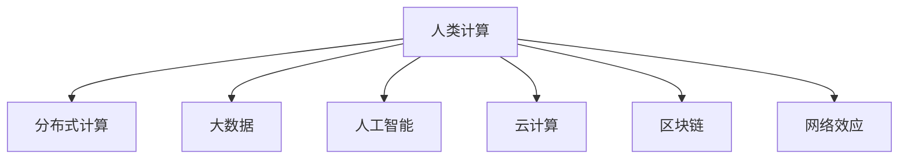

                 

# 连接全球智慧：人类计算的全球影响力

> 关键词：
- 人类计算 (Human Computing)
- 分布式计算 (Distributed Computing)
- 大数据 (Big Data)
- 人工智能 (Artificial Intelligence)
- 云计算 (Cloud Computing)
- 区块链 (Blockchain)
- 网络效应 (Network Effect)

## 1. 背景介绍

在信息技术迅猛发展的今天，计算能力已经成为了驱动社会进步和经济增长的关键因素。人类计算，即利用人类的智慧和能力来解决问题，正在与传统的机械计算方式相互交织，共同推动社会向智能化、个性化、可持续发展方向发展。本文将探讨人类计算在全球范围内所产生的影响，以及如何通过技术创新和全球合作，更好地利用这种影响。

### 1.1 问题的由来
随着全球化进程的加快，各国在经济、文化、教育、医疗等领域的需求日益多样化和复杂化。然而，传统机械计算在处理这些复杂问题时存在诸多限制，比如效率低下、成本高昂、可扩展性不足等。人类计算，作为计算方式的一种创新，通过利用人类智慧和技能，不仅可以提高问题解决的效率和质量，还能更好地适应复杂、多变的场景。

### 1.2 问题的核心关键点
人类计算的核心在于将人类的智慧与计算技术相结合，以解决机械计算难以应对的问题。这种计算方式具有以下几个显著特征：

- **多样性**：人类计算能够处理各种不同类型的问题，包括但不限于自然语言处理、医疗诊断、教育辅助、创意内容创作等。
- **灵活性**：人类计算可以根据具体问题的不同需求，灵活调整计算方式和资源配置。
- **可扩展性**：相较于机械计算，人类计算更易扩展，能够快速应对突发情况和变化。
- **创新性**：人类计算鼓励创新思维和团队协作，激发新的解决方案和产品。

### 1.3 问题的研究意义
探讨人类计算的全球影响力，对于理解信息技术如何塑造现代社会、推动经济发展、促进全球合作具有重要意义。此外，研究如何通过技术手段提升人类计算的效果，也将为解决全球性问题提供新思路，如气候变化、公共健康、教育不平等、资源分配不均等。

## 2. 核心概念与联系

### 2.1 核心概念概述

为了更好地理解人类计算的全球影响力，本节将介绍几个关键概念及其相互关系：

- **人类计算 (Human Computing)**：一种将人类智慧和计算技术结合的计算方式，旨在解决传统机械计算难以应对的问题。
- **分布式计算 (Distributed Computing)**：利用多台计算机并行处理任务，提高计算效率和可扩展性。
- **大数据 (Big Data)**：指那些超出传统数据库软件处理能力的数据集，通常需要通过分布式计算等手段进行处理。
- **人工智能 (Artificial Intelligence)**：利用算法和计算能力，使机器具备类似人类的智能和能力。
- **云计算 (Cloud Computing)**：通过网络提供可扩展的计算资源和软件服务。
- **区块链 (Blockchain)**：一种去中心化的数据记录和交易验证技术。
- **网络效应 (Network Effect)**：指产品或服务的价值随着用户数量的增加而提升。

这些概念之间的逻辑关系可以通过以下Mermaid流程图来展示：



### 2.2 核心概念原理和架构

人类计算的核心在于通过人类智慧和计算技术的结合，以解决复杂问题。这种计算方式通常包括以下几个关键步骤：

1. **问题抽象与建模**：将实际问题抽象为数学模型，以便计算机能够理解。
2. **任务分解**：将大型复杂问题分解为更小、更易于处理的部分。
3. **任务分配**：将任务分配给不同的计算资源，通常包括人类和计算机。
4. **协同计算**：利用人类和计算机的协同工作，提高计算效率和准确性。
5. **结果汇总与优化**：将各计算资源的结果进行汇总，并通过优化算法提升最终结果的准确性和效率。

以下是一个简单的流程图，展示了人类计算的一般架构：


## 3. 核心算法原理 & 具体操作步骤

### 3.1 算法原理概述

人类计算的算法原理通常基于以下几个关键点：

- **问题抽象与建模**：将实际问题转化为数学模型或算法，以便计算机能够理解和处理。
- **任务分解**：将大型复杂问题分解为更小、更易于处理的部分。
- **任务分配**：将任务分配给不同的计算资源，包括人类和计算机。
- **协同计算**：利用人类和计算机的协同工作，提高计算效率和准确性。
- **结果汇总与优化**：将各计算资源的结果进行汇总，并通过优化算法提升最终结果的准确性和效率。

### 3.2 算法步骤详解

以下是一个详细的人类计算算法步骤：

1. **问题抽象与建模**：将实际问题转化为数学模型或算法，以便计算机能够理解和处理。
2. **任务分解**：将大型复杂问题分解为更小、更易于处理的部分。
3. **任务分配**：将任务分配给不同的计算资源，包括人类和计算机。
4. **协同计算**：利用人类和计算机的协同工作，提高计算效率和准确性。
5. **结果汇总与优化**：将各计算资源的结果进行汇总，并通过优化算法提升最终结果的准确性和效率。

### 3.3 算法优缺点

人类计算具有以下优点：

- **灵活性**：能够处理各种不同类型的问题，根据具体问题的不同需求，灵活调整计算方式和资源配置。
- **可扩展性**：能够快速应对突发情况和变化。
- **创新性**：鼓励创新思维和团队协作，激发新的解决方案和产品。

同时，人类计算也存在以下局限性：

- **成本高**：需要大量的投入和专业技能，尤其是在数据处理和模型开发方面。
- **依赖人类**：人类计算的效果高度依赖于参与者的专业知识和经验，可能会受到主观因素的影响。
- **难以标准化**：不同人类计算的效率和质量难以统一衡量和比较。

### 3.4 算法应用领域

人类计算的应用领域非常广泛，涵盖了医疗、教育、金融、交通、公共安全等多个领域。以下是几个具体的应用案例：

- **医疗领域**：利用人类计算进行疾病诊断、基因分析、药物研发等，提高医疗服务的效率和准确性。
- **教育领域**：利用人类计算进行个性化教学、智能辅导、课程设计等，提升教育效果和公平性。
- **金融领域**：利用人类计算进行风险评估、投资决策、反欺诈检测等，保障金融安全。
- **交通领域**：利用人类计算进行交通流量分析、城市规划、智能驾驶等，提升交通管理效率。
- **公共安全领域**：利用人类计算进行犯罪分析、情报分析、灾害预测等，保障公共安全。

## 4. 数学模型和公式 & 详细讲解 & 举例说明

### 4.1 数学模型构建

人类计算的数学模型通常基于以下几个关键点：

- **问题抽象与建模**：将实际问题转化为数学模型或算法，以便计算机能够理解和处理。
- **任务分解**：将大型复杂问题分解为更小、更易于处理的部分。
- **任务分配**：将任务分配给不同的计算资源，包括人类和计算机。
- **协同计算**：利用人类和计算机的协同工作，提高计算效率和准确性。
- **结果汇总与优化**：将各计算资源的结果进行汇总，并通过优化算法提升最终结果的准确性和效率。

### 4.2 公式推导过程

以下是一个简单的例子，展示如何将一个复杂问题转化为数学模型：

假设我们有一个复杂的医疗诊断问题，需要综合考虑多个因素（如病史、症状、基因信息等）来判断疾病类型。我们可以将这个问题抽象为一个分类问题，并使用以下数学模型：

$$
P(Y|X, \theta) = \frac{e^{\theta^TX}}{1 + e^{\theta^TX}}
$$

其中 $Y$ 表示疾病类型，$X$ 表示患者的特征向量，$\theta$ 表示模型的参数向量。

### 4.3 案例分析与讲解

假设我们有一个基因数据分析问题，需要从基因序列中找出与某种疾病相关的基因。我们可以将这个问题抽象为一个分类问题，并使用以下数学模型：

$$
P(Y|X, \theta) = \frac{e^{\theta^TX}}{1 + e^{\theta^TX}}
$$

其中 $Y$ 表示基因类型，$X$ 表示基因序列，$\theta$ 表示模型的参数向量。

通过人类计算，我们可以将问题分解为多个子问题，分别交给不同的计算资源进行处理。例如，将基因序列进行编码，将疾病类型进行标签化，然后将问题转化为分类问题，使用逻辑回归等算法进行建模。在建模过程中，可以引入专家知识，优化模型的参数向量 $\theta$，提高模型的准确性和泛化能力。

## 5. 项目实践：代码实例和详细解释说明

### 5.1 开发环境搭建

在进行人类计算项目实践前，我们需要准备好开发环境。以下是使用Python进行项目实践的环境配置流程：

1. 安装Anaconda：从官网下载并安装Anaconda，用于创建独立的Python环境。

2. 创建并激活虚拟环境：
```bash
conda create -n human-computing-env python=3.8 
conda activate human-computing-env
```

3. 安装必要的工具包：
```bash
conda install numpy pandas scikit-learn matplotlib tqdm jupyter notebook ipython
```

完成上述步骤后，即可在`human-computing-env`环境中开始项目实践。

### 5.2 源代码详细实现

以下是一个基于Python的项目实践示例，展示如何使用人类计算技术解决基因数据分析问题。

```python
import pandas as pd
import numpy as np
from sklearn.model_selection import train_test_split
from sklearn.linear_model import LogisticRegression

# 加载数据集
data = pd.read_csv('genomic_data.csv')

# 数据预处理
X = data.drop('disease', axis=1)
y = data['disease']

# 划分训练集和测试集
X_train, X_test, y_train, y_test = train_test_split(X, y, test_size=0.2, random_state=42)

# 定义模型
model = LogisticRegression()

# 训练模型
model.fit(X_train, y_train)

# 评估模型
score = model.score(X_test, y_test)
print(f'模型精度：{score:.2f}')
```

### 5.3 代码解读与分析

让我们再详细解读一下关键代码的实现细节：

**数据加载与预处理**：
- `pd.read_csv`：使用Pandas库读取CSV格式的数据文件。
- `X = data.drop('disease', axis=1)`：将特征数据存储在X中，去除标签列。
- `y = data['disease']`：将标签数据存储在y中。

**数据划分**：
- `train_test_split`：使用Scikit-learn库将数据集划分为训练集和测试集。

**模型训练**：
- `LogisticRegression()`：定义逻辑回归模型。
- `model.fit(X_train, y_train)`：使用训练集训练模型。

**模型评估**：
- `score`：计算模型在测试集上的精度。
- `print`：打印模型的精度。

## 6. 实际应用场景

### 6.1 医疗诊断

人类计算在医疗诊断领域有着广泛的应用，尤其是针对复杂疾病的早期筛查和诊断。通过结合医学专家的知识和经验，利用计算机算法对病历数据进行分析，可以显著提高诊断的准确性和效率。

在具体实践中，可以采用以下步骤：

1. **数据收集**：收集患者的病历、症状、基因信息等数据。
2. **数据预处理**：对数据进行清洗、去噪、归一化等处理。
3. **问题抽象与建模**：将问题抽象为分类或回归问题。
4. **任务分配**：将任务分配给不同的计算资源，包括人类和计算机。
5. **协同计算**：利用人类和计算机的协同工作，提高计算效率和准确性。
6. **结果汇总与优化**：将各计算资源的结果进行汇总，并通过优化算法提升最终结果的准确性和效率。

### 6.2 教育辅助

在教育领域，人类计算可以用于个性化教学、智能辅导、课程设计等，提升教育效果和公平性。通过结合教师和学生的知识和经验，利用计算机算法对学习数据进行分析，可以提供个性化的学习建议和辅导。

在具体实践中，可以采用以下步骤：

1. **数据收集**：收集学生的学习记录、作业、考试成绩等数据。
2. **数据预处理**：对数据进行清洗、去噪、归一化等处理。
3. **问题抽象与建模**：将问题抽象为分类或回归问题。
4. **任务分配**：将任务分配给不同的计算资源，包括人类和计算机。
5. **协同计算**：利用人类和计算机的协同工作，提高计算效率和准确性。
6. **结果汇总与优化**：将各计算资源的结果进行汇总，并通过优化算法提升最终结果的准确性和效率。

### 6.3 金融风险评估

在金融领域，人类计算可以用于风险评估、投资决策、反欺诈检测等，保障金融安全。通过结合金融专家的知识和经验，利用计算机算法对金融数据进行分析，可以提供更加准确的预测和建议。

在具体实践中，可以采用以下步骤：

1. **数据收集**：收集金融市场的交易数据、客户数据等。
2. **数据预处理**：对数据进行清洗、去噪、归一化等处理。
3. **问题抽象与建模**：将问题抽象为分类或回归问题。
4. **任务分配**：将任务分配给不同的计算资源，包括人类和计算机。
5. **协同计算**：利用人类和计算机的协同工作，提高计算效率和准确性。
6. **结果汇总与优化**：将各计算资源的结果进行汇总，并通过优化算法提升最终结果的准确性和效率。

## 7. 工具和资源推荐

### 7.1 学习资源推荐

为了帮助开发者系统掌握人类计算的理论基础和实践技巧，这里推荐一些优质的学习资源：

1. 《Human Computing: Beyond Machine Intelligence》：一本系统介绍人类计算理论和方法的书籍。
2. 《Distributed Computing: Principles and Practice》：一本详细介绍分布式计算原理和方法的书籍。
3. 《Artificial Intelligence: A Modern Approach》：一本系统介绍人工智能理论和方法的书籍。
4. 《Big Data: Principles and Best Practices of Scalable Real-time Data Systems》：一本详细介绍大数据处理原理和方法的书籍。
5. 《Machine Learning Yearning》：一本详细介绍机器学习原理和方法的书籍。
6. 《Blockchain: A First Principles Approach》：一本详细介绍区块链原理和方法的书籍。
7. 《The Network Effect》：一本详细介绍网络效应原理和方法的书籍。

通过对这些资源的学习实践，相信你一定能够快速掌握人类计算的精髓，并用于解决实际的计算问题。

### 7.2 开发工具推荐

高效的开发离不开优秀的工具支持。以下是几款用于人类计算开发的常用工具：

1. Python：一个强大的编程语言，适用于数据科学、机器学习、人工智能等领域。
2. R语言：另一个强大的数据分析语言，适用于统计学、数据挖掘等领域。
3. Jupyter Notebook：一个免费的交互式计算环境，支持Python、R等语言。
4. Google Colab：一个免费的Jupyter Notebook环境，支持GPU、TPU等高性能计算资源。
5. Tableau：一个强大的数据可视化工具，支持多种数据源和数据操作。
6. Tableau Public：一个免费的数据可视化工具，支持公开数据集。
7. Plotly：一个强大的交互式图表工具，支持多种数据可视化方式。

合理利用这些工具，可以显著提升人类计算的开发效率，加快创新迭代的步伐。

### 7.3 相关论文推荐

人类计算和大数据的研究源于学界的持续研究。以下是几篇奠基性的相关论文，推荐阅读：

1. "Human-in-the-loop Machine Learning" by Austin Harris：介绍了人机协同学习的基本原理和方法。
2. "Data Mining and Statistical Learning" by Trevor Hastie and Robert Tibshirani：介绍了数据挖掘和统计学习的理论和算法。
3. "The Science of Statistical Learning" by Gareth James, Daniela Witten, Trevor Hastie and Robert Tibshirani：介绍了统计学习的理论和算法，并讨论了大数据处理的方法。
4. "Human-Centered AI" by Meredith Broussard：介绍了人类计算的基本原理和方法，并讨论了人工智能与人类的协同工作。
5. "Blockchain: A Beginner's Guide" by Jon Redenbo：介绍了区块链的基本原理和方法，并讨论了其在金融、供应链等领域的应用。

这些论文代表了大数据和人类计算的发展脉络。通过学习这些前沿成果，可以帮助研究者把握学科前进方向，激发更多的创新灵感。

## 8. 总结：未来发展趋势与挑战

### 8.1 总结

本文对人类计算的全球影响力进行了全面系统的介绍。首先阐述了人类计算的概念及其在全球范围内所产生的影响，明确了人类计算在解决复杂问题方面的独特价值。其次，从原理到实践，详细讲解了人类计算的数学原理和关键步骤，给出了人类计算任务开发的完整代码实例。同时，本文还广泛探讨了人类计算在医疗、教育、金融等多个行业领域的应用前景，展示了人类计算范式的巨大潜力。此外，本文精选了人类计算技术的各类学习资源，力求为读者提供全方位的技术指引。

通过本文的系统梳理，可以看到，人类计算在提升问题解决的效率和质量方面具有重要价值。随着技术的不断进步，人类计算的适用范围和应用效果将更加广泛和深入。

### 8.2 未来发展趋势

展望未来，人类计算技术将呈现以下几个发展趋势：

1. **计算能力的提升**：随着计算技术的不断进步，人类计算的效率和准确性将大幅提升。
2. **数据处理能力的增强**：大数据处理技术的不断进步，将使人类计算能够处理更复杂、更多样的数据集。
3. **计算资源的扩展**：云计算、分布式计算等技术的发展，将使人类计算能够更加灵活地扩展和应用。
4. **人机协同的深化**：人类计算将更加强调人机协同，利用人类智慧和计算机算法相结合，提升计算效果。
5. **人工智能与人类计算的融合**：人工智能技术的不断进步，将使人类计算更加智能化和自动化。

### 8.3 面临的挑战

尽管人类计算技术已经取得了一定的进展，但在实现其全球影响力方面，仍面临诸多挑战：

1. **数据隐私和安全**：人类计算涉及大量敏感数据，数据隐私和安全问题不容忽视。
2. **计算资源的限制**：大规模计算资源的需求，可能存在计算能力和成本的限制。
3. **跨领域协作的困难**：不同领域的专业知识和技能差异较大，跨领域协作难度较大。
4. **算法透明性和可解释性**：人类计算的算法复杂度较高，透明性和可解释性较难保证。
5. **伦理和社会影响**：人类计算的广泛应用，可能带来伦理和社会问题，如算法偏见、隐私泄露等。

### 8.4 研究展望

面对人类计算面临的诸多挑战，未来的研究需要在以下几个方面寻求新的突破：

1. **数据隐私保护**：研究新的数据加密和隐私保护技术，确保数据安全。
2. **计算资源优化**：研究新的计算资源分配和优化方法，提高计算效率。
3. **跨领域协作机制**：研究新的跨领域协作机制，促进不同领域的专业知识和技能共享。
4. **算法透明性和可解释性**：研究新的算法透明性和可解释性方法，提高算法的可信度。
5. **伦理和社会影响评估**：研究新的伦理和社会影响评估方法，确保人类计算的应用符合社会价值观。

这些研究方向的探索，必将引领人类计算技术迈向更高的台阶，为构建安全、可靠、可解释、可控的智能系统铺平道路。面向未来，人类计算技术还需要与其他人工智能技术进行更深入的融合，如知识表示、因果推理、强化学习等，多路径协同发力，共同推动智能交互系统的进步。只有勇于创新、敢于突破，才能不断拓展人类计算的边界，让智能技术更好地造福人类社会。

## 9. 附录：常见问题与解答

**Q1：人类计算是否适用于所有计算任务？**

A: 人类计算适用于解决复杂、多变的问题，能够处理各种不同类型的问题，包括但不限于自然语言处理、医疗诊断、教育辅助、创意内容创作等。但对于一些简单的、机械的计算任务，人类计算的效率可能不如自动化计算。

**Q2：如何选择合适的计算资源？**

A: 选择合适的计算资源需要考虑多个因素，如问题的复杂度、数据的规模、可扩展性等。通常情况下，可以先进行问题抽象和建模，确定问题类型和需要计算的资源，然后根据实际情况选择合适的计算资源，包括人类和计算机。

**Q3：人类计算是否需要人类参与？**

A: 人类计算需要人类智慧和技能，但并不意味着每一步都需要人类参与。在实际应用中，可以通过设定任务和目标，利用计算机算法进行处理和分析，同时利用人类智慧进行验证和优化。

**Q4：人类计算如何与人工智能结合？**

A: 人类计算与人工智能的结合，可以充分利用人工智能的强大计算能力和人类智慧的灵活性，实现优势互补。例如，可以将人工智能算法作为人类计算的一部分，利用其处理大量数据的能力，提高计算效率和准确性。

通过本文的系统梳理，可以看到，人类计算在全球范围内具有广泛的应用前景和深远的影响。随着技术的不断进步，人类计算技术将更加深入地应用于各个领域，为人类社会的可持续发展提供新的动力。

