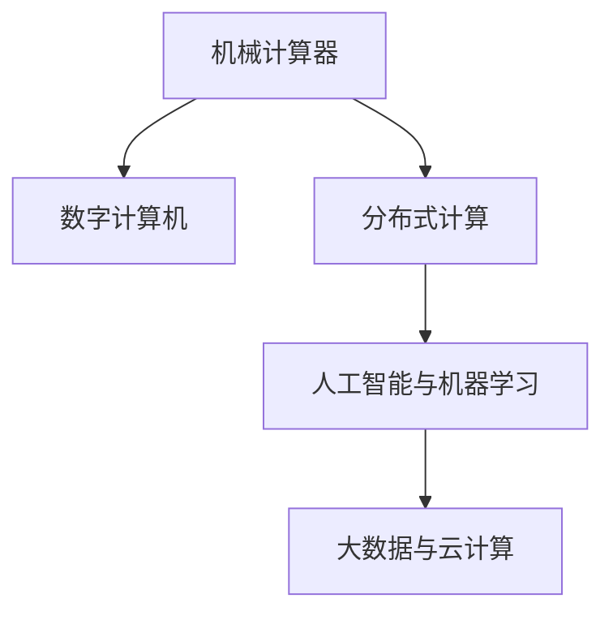

                 

# 连接过去、现在和未来：人类计算的历史、现状与展望

## 1. 背景介绍

### 1.1 问题由来
人类计算经历了从古代的机械计算器到现代的数字计算的漫长历史。数字时代的到来，得益于计算机的诞生。自1946年第一台通用数字计算机ENIAC问世以来，计算技术不断革新，推动了科学计算、工程计算、社会计算等各个领域的发展。然而，随着计算技术的发展，人类计算面临的挑战也在不断变化。从早期的算力不足，到如今的大数据、人工智能等复杂问题的计算，计算技术经历了前所未有的变革。本文旨在回顾人类计算的历史，分析当前计算技术的现状，展望未来的计算发展趋势。

### 1.2 问题核心关键点
1. **计算技术的演变**：从早期的机械计算器到现代的分布式计算，计算技术经历了多次重大变革。
2. **计算任务的转变**：计算任务从科学计算、工程计算等转向社会计算、人工智能等。
3. **计算资源的变迁**：从早期的物理计算资源到现代的虚拟计算资源，计算资源管理和调度方式发生了根本变化。
4. **计算技术的影响**：计算技术的发展不仅改变了科研、工程、经济等各个领域的运行模式，还深刻影响了人类社会的发展。

## 2. 核心概念与联系

### 2.1 核心概念概述

为更好地理解人类计算的历史、现状与未来，本节将介绍几个密切相关的核心概念：

- **机械计算器**：指19世纪以前使用机械装置进行计算的工具，如计算尺、加法器等。这些工具虽然计算速度有限，但为人类的早期计算奠定了基础。
- **数字计算机**：指使用电子器件（如晶体管、集成电路）进行计算的机器。自1946年ENIAC问世以来，数字计算机经历了从大型机到超级计算机的发展历程。
- **分布式计算**：指将计算任务分解成多个子任务，分布在多台计算机上进行并行计算的计算模式。分布式计算有效地提升了计算资源的利用率，加速了复杂问题的求解。
- **人工智能与机器学习**：指通过算法使计算机具备感知、理解、学习等智能行为的能力。机器学习是人工智能的核心技术之一，推动了模式识别、自然语言处理、计算机视觉等领域的突破。
- **大数据与云计算**：指通过网络存储和处理海量数据的技术。大数据和云计算技术使得大规模数据的存储、管理和分析成为可能，支撑了数据驱动的科学研究、商业决策等。

这些核心概念之间的逻辑关系可以通过以下Mermaid流程图来展示：



这个流程图展示了一系列计算技术的发展脉络：

1. 机械计算器为数字计算机的出现奠定了基础。
2. 数字计算机的发展演进了分布式计算技术。
3. 分布式计算和大数据技术，为人工智能和机器学习提供了丰富的数据和计算资源。
4. 人工智能和机器学习技术，进一步推动了计算任务的复杂性和多样性。

## 3. 核心算法原理 & 具体操作步骤
### 3.1 算法原理概述

人类计算的发展历史，本质上是计算算法和计算架构的演进历史。从早期的手动计算到现代的数字计算，计算技术经历了多次重大变革。这些变革不仅改变了计算的方式，还深远影响了各领域的计算任务和应用。

### 3.2 算法步骤详解

1. **手工计算**：早期的计算任务由人工手动完成，如使用算盘、计算尺等工具进行简单的计算。
2. **机械计算**：随着机械计算器的发展，一些复杂的计算任务开始使用机械装置进行计算，如打孔卡、电传机等。
3. **电子计算**：1946年，第一台通用数字计算机ENIAC问世，标志着电子计算时代的开始。随后，计算技术经历了从大型机、中型机到小型机、嵌入式设备的发展历程。
4. **分布式计算**：随着互联网的发展，分布式计算技术逐渐兴起。通过将计算任务分解成多个子任务，分布在多台计算机上进行并行计算，有效提升了计算效率。
5. **云计算与大数据**：大数据和云计算技术的出现，使得大规模数据的存储和处理成为可能，支撑了数据驱动的科学研究、商业决策等。
6. **人工智能与机器学习**：通过算法使计算机具备感知、理解、学习等智能行为的能力，推动了模式识别、自然语言处理、计算机视觉等领域的突破。

### 3.3 算法优缺点

- **手工计算**：
  - 优点：低成本、易操作，适用于简单计算任务。
  - 缺点：计算速度慢，难以处理复杂的计算问题。

- **机械计算**：
  - 优点：一定程度上提升了计算速度，适用于一些中等的计算任务。
  - 缺点：计算精度和速度仍有限，无法处理复杂的计算任务。

- **电子计算**：
  - 优点：计算速度大幅提升，适用于各种复杂的计算任务。
  - 缺点：设备昂贵、能耗高，维护成本高。

- **分布式计算**：
  - 优点：计算效率高，适用于大规模、复杂的计算任务。
  - 缺点：系统复杂度增加，网络延迟和通信开销较大。

- **云计算与大数据**：
  - 优点：计算资源按需伸缩，成本低，可处理大规模数据。
  - 缺点：数据隐私和安全问题复杂，对网络带宽要求高。

- **人工智能与机器学习**：
  - 优点：智能化的计算方法，适用于处理复杂的多维数据。
  - 缺点：算法复杂度高，需要大量的数据和计算资源。

### 3.4 算法应用领域

基于上述计算技术的演进，人类计算的应用领域也在不断扩展。以下是几个典型的应用领域：

- **科学研究**：如宇宙物理、生物医学等领域，计算技术为复杂的科学问题提供了求解手段。
- **工程设计**：如航空航天、建筑设计等，计算技术用于模拟和优化设计过程。
- **金融分析**：如股票交易、风险评估等，计算技术用于数据分析和模型预测。
- **社会计算**：如社交网络分析、推荐系统等，计算技术用于理解和优化人类行为。
- **人工智能**：如自动驾驶、智能客服等，计算技术使计算机具备智能行为。

这些应用领域涵盖了人类社会发展的各个方面，展示了计算技术的广泛影响。

## 4. 数学模型和公式 & 详细讲解  
### 4.1 数学模型构建

本节将使用数学语言对人类计算的历史、现状与未来进行更加严格的刻画。

### 4.2 公式推导过程

以分布式计算为例，假设某计算任务需要执行 $N$ 个子任务，分布在 $K$ 台计算机上，每台计算机执行的子任务数量为 $N/K$。设每台计算机的计算速度为 $v$，则整个计算任务的执行时间为：

$$
T = \frac{N}{K} \cdot T_{\text{com}} = \frac{N}{K} \cdot \frac{N}{v}
$$

其中 $T_{\text{com}}$ 表示一台计算机完成单个子任务所需的时间。

对于大规模数据集的处理，假设数据集大小为 $D$，每台计算机的存储容量为 $S$，则数据分片需要 $D/S$ 台计算机。设每台计算机的数据传输速度为 $b$，则整个数据传输所需时间为：

$$
T_{\text{transfer}} = \frac{D}{S} \cdot T_{\text{transfer}} = \frac{D}{S} \cdot \frac{D}{b}
$$

综合考虑计算时间和数据传输时间，整个分布式计算任务的总时间为：

$$
T_{\text{total}} = T + T_{\text{transfer}} = \frac{N}{K} \cdot \frac{N}{v} + \frac{D}{S} \cdot \frac{D}{b}
$$

通过这个简单的公式推导，可以看到分布式计算的效率依赖于计算速度、数据传输速度、数据集大小、计算资源数量等多个因素。

## 5. 项目实践：代码实例和详细解释说明
### 5.1 开发环境搭建

在进行分布式计算项目实践前，我们需要准备好开发环境。以下是使用Python进行PyTorch开发的环境配置流程：

1. 安装Anaconda：从官网下载并安装Anaconda，用于创建独立的Python环境。

2. 创建并激活虚拟环境：
```bash
conda create -n pytorch-env python=3.8 
conda activate pytorch-env
```

3. 安装PyTorch：根据CUDA版本，从官网获取对应的安装命令。例如：
```bash
conda install pytorch torchvision torchaudio cudatoolkit=11.1 -c pytorch -c conda-forge
```

4. 安装Transformers库：
```bash
pip install transformers
```

5. 安装各类工具包：
```bash
pip install numpy pandas scikit-learn matplotlib tqdm jupyter notebook ipython
```

完成上述步骤后，即可在`pytorch-env`环境中开始分布式计算实践。

### 5.2 源代码详细实现

下面我们以分布式训练深度学习模型为例，给出使用PyTorch进行分布式训练的代码实现。

首先，定义模型和优化器：

```python
import torch
import torch.distributed as dist
import torch.nn as nn
import torch.optim as optim

class MyModel(nn.Module):
    def __init__(self):
        super(MyModel, self).__init__()
        self.fc1 = nn.Linear(10, 5)
        self.fc2 = nn.Linear(5, 2)

    def forward(self, x):
        x = torch.relu(self.fc1(x))
        x = self.fc2(x)
        return x

model = MyModel().to('cuda')

criterion = nn.CrossEntropyLoss()
optimizer = optim.SGD(model.parameters(), lr=0.01)

```

接着，定义数据加载函数和分布式训练函数：

```python
from torch.utils.data import DataLoader
from torchvision import datasets, transforms

def data_loader(batch_size):
    train_dataset = datasets.MNIST('../data', train=True, download=True, transform=transforms.ToTensor())
    train_loader = DataLoader(train_dataset, batch_size=batch_size, shuffle=True, num_workers=2)
    return train_loader

def train_epoch(model, train_loader, optimizer, criterion):
    model.train()
    total_loss = 0
    for data, target in train_loader:
        data = data.to('cuda')
        target = target.to('cuda')
        optimizer.zero_grad()
        output = model(data)
        loss = criterion(output, target)
        loss.backward()
        optimizer.step()
        total_loss += loss.item()
    return total_loss / len(train_loader)

```

最后，启动分布式训练流程：

```python
import torch.distributed as dist

if dist.is_available():
    dist.init_process_group(backend='gloo', init_method='env://')
    local_rank = dist.get_rank()
    device = torch.device('cuda', local_rank)
    model.to(device)
else:
    local_rank = -1

epochs = 10
batch_size = 128

for epoch in range(epochs):
    loss = train_epoch(model, data_loader(batch_size), optimizer, criterion)
    print(f"Epoch {epoch+1}, train loss: {loss:.3f}")
```

以上就是使用PyTorch进行分布式深度学习模型训练的完整代码实现。可以看到，借助PyTorch的分布式计算支持，可以轻松实现多台计算机并行训练，大大提升了训练效率。

### 5.3 代码解读与分析

让我们再详细解读一下关键代码的实现细节：

**MyModel类**：
- `__init__`方法：定义模型的结构，包含两个全连接层。
- `forward`方法：定义模型的前向传播过程，将输入数据经过线性变换和激活函数处理后输出。

**train_epoch函数**：
- 使用PyTorch的DataLoader对数据集进行批次化加载，供模型训练使用。
- 在每个批次上前向传播计算损失函数，反向传播更新模型参数。
- 在训练过程中记录总损失，最后返回平均损失。

**启动分布式训练流程**：
- 使用PyTorch的分布式包初始化进程，获取本进程的本地rank和设备。
- 将所有模型参数移动到本地rank对应的GPU上。
- 在每个epoch内，在本地rank对应的设备上进行模型训练。
- 在所有进程上同步模型参数，更新全局损失。

可以看到，借助PyTorch的分布式计算支持，可以轻松实现多台计算机并行训练，大大提升了训练效率。开发者可以进一步优化分布式训练算法，如使用混合精度训练、模型并行等技术，以进一步提升性能。

## 6. 实际应用场景
### 6.1 科学研究

计算技术在科学研究中的应用广泛，涉及天文学、物理学、化学等领域。例如，天文学家通过计算模拟宇宙大爆炸、黑洞演化等复杂现象，推断出天体物理的基本规律。物理学家利用超级计算机进行量子模拟，研究原子和分子的行为，揭示微观世界的秘密。

### 6.2 工程设计

在工程设计领域，计算技术用于优化设计和模拟测试。例如，汽车制造商利用计算流体力学(CFD)模拟汽车流场，优化车身设计以降低风阻。建筑工程公司使用计算工程软件，对复杂结构进行动态模拟，确保建筑物的安全性和稳定性。

### 6.3 金融分析

在金融领域，计算技术用于数据分析和模型预测。例如，高频交易系统利用计算技术实时处理和分析市场数据，制定交易策略。风险评估系统通过计算技术评估金融产品的风险，保障投资安全。

### 6.4 社会计算

在社会计算领域，计算技术用于理解和优化人类行为。例如，社交网络分析工具利用计算技术分析用户行为模式，预测用户兴趣。推荐系统通过计算技术分析用户行为数据，推荐个性化的产品和服务。

### 6.5 人工智能

在人工智能领域，计算技术用于训练和优化智能模型。例如，自然语言处理(NLP)模型利用计算技术进行大规模文本处理，提升语言理解和生成能力。计算机视觉模型通过计算技术进行图像处理和识别，推动计算机视觉技术的突破。

## 7. 工具和资源推荐
### 7.1 学习资源推荐

为了帮助开发者系统掌握分布式计算的理论基础和实践技巧，这里推荐一些优质的学习资源：

1. 《分布式计算原理与实践》系列博文：由分布式计算专家撰写，深入浅出地介绍了分布式计算原理、分布式系统架构等基础知识。

2. CS325《分布式系统》课程：斯坦福大学开设的分布式计算明星课程，有Lecture视频和配套作业，带你入门分布式计算的基本概念和经典算法。

3. 《并行和分布式计算：算法和系统》书籍：阐述了并行和分布式计算的基本原理和算法，包括MapReduce、Spark等分布式计算框架。

4. Hadoop官方文档：Apache Hadoop的官方文档，提供了海量分布式计算资源和实践样例，是分布式计算实践的重要参考。

5. Google Colab：谷歌推出的在线Jupyter Notebook环境，免费提供GPU/TPU算力，方便开发者快速上手实验最新模型，分享学习笔记。

通过对这些资源的学习实践，相信你一定能够快速掌握分布式计算的精髓，并用于解决实际的计算问题。

### 7.2 开发工具推荐

高效的开发离不开优秀的工具支持。以下是几款用于分布式计算开发的常用工具：

1. PyTorch：基于Python的开源深度学习框架，灵活动态的计算图，适合快速迭代研究。大部分分布式计算任务都有PyTorch版本的实现。

2. TensorFlow：由Google主导开发的开源深度学习框架，生产部署方便，适合大规模工程应用。同样有丰富的分布式计算资源。

3. Apache Spark：Apache基金会开源的分布式计算框架，支持多种编程语言，提供了MapReduce、SQL、机器学习等多种计算功能。

4. Weights & Biases：模型训练的实验跟踪工具，可以记录和可视化模型训练过程中的各项指标，方便对比和调优。与主流深度学习框架无缝集成。

5. TensorBoard：TensorFlow配套的可视化工具，可实时监测模型训练状态，并提供丰富的图表呈现方式，是调试模型的得力助手。

6. Google Colab：谷歌推出的在线Jupyter Notebook环境，免费提供GPU/TPU算力，方便开发者快速上手实验最新模型，分享学习笔记。

合理利用这些工具，可以显著提升分布式计算任务的开发效率，加快创新迭代的步伐。

### 7.3 相关论文推荐

分布式计算的研究始于20世纪60年代，经历了多年的发展和演变，现已成为计算机科学的重要分支。以下是几篇奠基性的相关论文，推荐阅读：

1. MapReduce: Simplified Data Processing on Large Clusters：提出了MapReduce计算模型，奠定了分布式计算的基础。

2. GFS: A Scalable File System for Large-Distributed Databases：介绍了Google的GFS文件系统，支持海量数据的存储和分布式访问。

3. Hadoop: A Distributed File System：介绍了Apache Hadoop的分布式文件系统，支持海量数据的分布式存储和处理。

4. Spark: Fast and General-Essence Distributed Data Processing：提出了Spark分布式计算框架，提供了基于内存计算和弹性调度的高效计算能力。

5. Flink: Stream Processing at Scale：介绍了Apache Flink的流处理系统，支持高吞吐量和低延迟的实时数据处理。

这些论文代表了大规模分布式计算的发展脉络。通过学习这些前沿成果，可以帮助研究者把握学科前进方向，激发更多的创新灵感。

## 8. 总结：未来发展趋势与挑战
### 8.1 研究成果总结

分布式计算技术自20世纪60年代以来，经历了多次重大变革，推动了科学计算、工程计算、社会计算等各个领域的发展。从早期的并行处理到如今的分布式计算，分布式计算技术已经成为计算科学的重要分支。

### 8.2 未来发展趋势

展望未来，分布式计算技术将继续演进，呈现以下几个发展趋势：

1. **量子计算**：量子计算作为下一代计算技术，具有超强计算能力，有望解决目前分布式计算难以处理的大规模复杂问题。
2. **边缘计算**：边缘计算将计算资源部署在靠近数据源的设备上，减少数据传输时间和成本，提升计算效率。
3. **区块链**：区块链技术通过分布式账本，实现数据透明、可验证的共享，适用于需要多方协作的场景。
4. **跨界融合**：分布式计算将与物联网、大数据、人工智能等技术进一步融合，构建更加智能的计算体系。
5. **可持续性**：未来的计算系统将更加注重能源效率和环境友好性，通过优化算法和硬件设计，实现可持续的计算。

这些趋势展示了分布式计算技术的发展方向，将进一步推动计算技术与各个领域的深度融合，催生新的计算模式和应用场景。

### 8.3 面临的挑战

尽管分布式计算技术取得了瞩目成就，但在迈向更加智能化、普适化应用的过程中，它仍面临诸多挑战：

1. **资源调度**：随着计算任务的复杂性增加，如何高效调度计算资源，避免资源浪费和过载，仍然是一个挑战。
2. **数据隐私和安全**：分布式计算系统需要处理大量敏感数据，如何保护数据隐私和安全，避免数据泄露和恶意攻击，需要更多的技术支持。
3. **跨界协作**：分布式计算系统需要跨多个组织和部门协作，如何统一数据标准和接口，构建协同工作的计算环境，需要更多的协调机制。
4. **计算效率**：虽然分布式计算提升了计算效率，但网络延迟和通信开销仍然是一个重要瓶颈，需要优化算法和网络设计。
5. **硬件发展**：分布式计算系统依赖于高性能的硬件支持，如何提升硬件的计算能力和存储能力，需要更多的技术突破。

这些挑战需要研究者不断创新和优化，才能推动分布式计算技术的持续发展。

### 8.4 研究展望

面对分布式计算面临的挑战，未来的研究需要在以下几个方面寻求新的突破：

1. **分布式算法优化**：进一步优化分布式计算的算法和调度策略，提升计算效率和资源利用率。
2. **区块链技术应用**：探索区块链技术在数据共享、共识机制等方面的应用，构建安全的分布式计算环境。
3. **跨界融合创新**：将分布式计算与其他技术进行深度融合，推动物联网、人工智能、区块链等技术的协同发展。
4. **绿色计算研究**：研究能源效率和环境友好的计算技术，推动可持续计算的发展。
5. **边缘计算部署**：探索边缘计算在智能城市、工业互联网等场景的应用，提升计算效率和实时性。

这些研究方向将为分布式计算技术带来新的突破，推动计算技术与各个领域的深度融合，构建更加智能和可持续的计算体系。

## 9. 附录：常见问题与解答

**Q1：分布式计算如何提升计算效率？**

A: 分布式计算通过将计算任务分解成多个子任务，分布在多台计算机上进行并行计算，有效提升了计算效率。同时，分布式计算系统支持动态资源调度，可以按需伸缩计算资源，避免资源浪费和过载。

**Q2：分布式计算存在哪些挑战？**

A: 分布式计算存在资源调度、数据隐私、跨界协作等多个挑战。其中，资源调度需要优化算法和调度策略，数据隐私需要数据加密和访问控制，跨界协作需要统一数据标准和接口。

**Q3：分布式计算的典型应用场景有哪些？**

A: 分布式计算在科学研究、工程设计、金融分析、社会计算、人工智能等领域都有广泛应用。例如，在科学研究中，分布式计算用于模拟复杂现象，推断基本规律；在工程设计中，分布式计算用于优化设计和模拟测试。

**Q4：如何优化分布式计算系统？**

A: 优化分布式计算系统需要从多个方面入手，如优化计算算法、提高网络带宽、优化资源调度、保障数据安全和隐私等。此外，引入新技术如区块链、量子计算等，也将提升分布式计算系统的性能和安全性。

**Q5：分布式计算的未来趋势是什么？**

A: 未来分布式计算将与量子计算、区块链、人工智能等技术进行深度融合，构建更加智能和可持续的计算体系。同时，分布式计算将推动计算技术与各个领域的深度融合，推动科学计算、工程计算、社会计算等领域的发展。

---

作者：禅与计算机程序设计艺术 / Zen and the Art of Computer Programming

