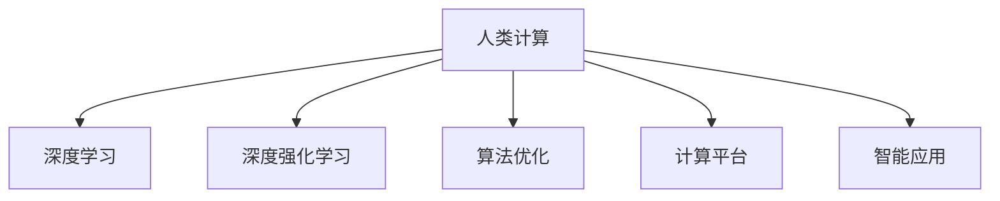

                 

# 释放人类潜力的无限可能：人类计算的目标

> 关键词：人类计算,人工智能,机器学习,深度学习,深度强化学习,算法优化

## 1. 背景介绍

### 1.1 问题由来

在人类进入信息时代的今天，计算能力已经成为了推动科技进步和社会发展的关键驱动力。从最初的机械计算器，到如今的超级计算机，每一次计算技术的飞跃，都极大地推动了人类文明的进步。然而，随着计算能力的不断提升，人们开始思考更深层次的问题：计算的极限是什么？未来我们能够实现怎样的计算能力？这些问题不仅关乎技术本身，更是对人类认知和能力的终极探索。

### 1.2 问题核心关键点

人类计算的目标在于探索和实现超大规模、高复杂度、强鲁棒性的计算能力。这需要我们从算法、硬件、软件等多个层面进行全面探索和优化。算法是实现人类计算目标的核心，需要设计高效、可扩展、可解释的计算模型和算法；硬件则是实现高效计算的基础，需要发展高性能计算架构和量子计算等前沿技术；软件则是计算任务的具体实现，需要构建强大的计算平台和智能应用。

## 2. 核心概念与联系

### 2.1 核心概念概述

为更好地理解人类计算的目标和实现路径，本节将介绍几个密切相关的核心概念：

- **人类计算**：指利用计算机模拟人类大脑的认知和决策过程，实现复杂的智能任务。目标是通过计算技术，实现超越人类大脑计算能力的极限。

- **深度学习**：基于神经网络架构，通过大规模数据训练，自动学习特征表示和决策边界，是实现复杂模式识别和推理任务的重要手段。

- **深度强化学习**：结合深度学习和强化学习的思想，通过与环境的交互，自动探索最优策略，广泛应用于游戏、机器人控制等领域。

- **算法优化**：通过数学分析和实验验证，优化计算模型和算法，提升计算效率和性能，确保计算任务的可靠性和鲁棒性。

- **计算平台**：包括计算硬件和软件，是实现高效计算的具体工具。常见的计算平台包括GPU、TPU、云计算等。

- **智能应用**：基于计算平台和算法，构建具有自主推理和决策能力的智能系统，如自动驾驶、智能推荐、医疗诊断等。

这些核心概念之间的逻辑关系可以通过以下Mermaid流程图来展示：



这个流程图展示了许多概念之间的联系和互动关系：

1. 人类计算是目标，深度学习和深度强化学习是实现手段。
2. 算法优化是关键，计算平台是实现工具。
3. 智能应用是应用场景，体现人类计算的价值。

这些核心概念共同构成了人类计算的研究和实现框架，为我们探索计算极限提供了方向。

## 3. 核心算法原理 & 具体操作步骤
### 3.1 算法原理概述

人类计算的核心在于设计和实现高效、可扩展的计算模型和算法。以下是一些关键的算法原理和操作步骤：

- **深度学习算法**：基于神经网络架构，通过反向传播算法和大规模数据训练，学习复杂的特征表示和决策边界。深度学习算法可以应用于图像识别、自然语言处理、语音识别等多个领域，通过逐层抽象，实现高层次的认知和推理任务。

- **深度强化学习算法**：结合深度学习和强化学习的思想，通过与环境的交互，自动探索最优策略。深度强化学习算法可以应用于游戏、机器人控制、自动驾驶等需要自主决策的场景，通过奖励机制，逐步优化决策策略。

- **算法优化技术**：包括正则化、梯度下降、剪枝、归一化等方法，优化模型参数和计算过程，提高计算效率和鲁棒性。通过算法优化，可以在有限的时间和资源下，实现更高效的计算和推理。

### 3.2 算法步骤详解

人类计算的算法实现通常包括以下几个关键步骤：

**Step 1: 设计计算模型**

- 选择合适的深度学习或深度强化学习模型，根据任务需求，设计合适的网络结构和层级。

**Step 2: 数据预处理**

- 收集和标注大规模数据集，进行数据清洗、归一化、划分等预处理操作，确保数据质量和稳定性。

**Step 3: 模型训练**

- 使用GPU、TPU等高性能计算资源，进行模型训练，采用合适的优化算法和正则化技术，逐步优化模型参数。

**Step 4: 模型评估**

- 在验证集和测试集上评估模型性能，通过交叉验证等方法，确保模型泛化能力。

**Step 5: 模型应用**

- 将训练好的模型集成到实际应用场景中，通过API或SDK等方式，实现智能决策和推理功能。

**Step 6: 持续优化**

- 根据实际应用反馈，持续优化模型和算法，提升模型性能和鲁棒性。

### 3.3 算法优缺点

人类计算算法具有以下优点：

- **高效性**：深度学习算法可以通过大规模数据训练，自动学习复杂特征，实现高效的计算和推理。
- **可扩展性**：深度强化学习算法可以通过不断与环境交互，自动探索最优策略，实现复杂的自主决策。
- **灵活性**：算法优化技术可以根据具体任务需求，进行灵活调整，提高计算效率和鲁棒性。

同时，这些算法也存在一些局限性：

- **数据需求高**：深度学习算法需要大规模标注数据进行训练，获取高质量数据成本较高。
- **计算资源消耗大**：深度强化学习算法需要高性能计算资源支持，训练和推理过程中资源消耗大。
- **模型可解释性差**：深度学习算法通常作为"黑盒"模型，难以解释其内部工作机制和决策逻辑。

尽管存在这些局限性，但就目前而言，深度学习和深度强化学习仍是人类计算实现的重要手段，具有广阔的应用前景。

### 3.4 算法应用领域

人类计算的算法技术已经在多个领域得到广泛应用，例如：

- **自动驾驶**：通过深度学习和深度强化学习，实现车辆的自主导航和决策。
- **智能推荐系统**：通过深度学习算法，分析用户行为和偏好，实现个性化推荐。
- **医疗诊断**：通过深度学习算法，分析医学影像和病理数据，辅助医生进行疾病诊断和治疗。
- **机器人控制**：通过深度强化学习算法，实现机器人的自主导航和操作。
- **自然语言处理**：通过深度学习算法，实现文本分类、情感分析、机器翻译等任务。

除了上述这些经典应用外，深度学习和深度强化学习还被创新性地应用到更多场景中，如自动作曲、智能客服、智能问答等，为人类计算的发展提供了新的方向。

## 4. 数学模型和公式 & 详细讲解 & 举例说明
### 4.1 数学模型构建

以下是人类计算中常见的数学模型和公式构建：

- **深度学习模型**：基于神经网络架构，如卷积神经网络(CNN)、循环神经网络(RNN)、长短时记忆网络(LSTM)等。常见的深度学习模型包括：

  - 卷积神经网络(CNN)：
  $$
  h^{(l)} = \sigma(W^{(l)}h^{(l-1)} + b^{(l)})
  $$
  - 循环神经网络(RNN)：
  $$
  h^{(t)} = \sigma(W_{xh}x_t + W_{hh}h_{t-1} + b_h)
  $$
  - 长短时记忆网络(LSTM)：
  $$
  g_t = \sigma(W_{g}x_t + W_{gh}h_{t-1} + b_g)
  $$
  $$
  i_t = \sigma(W_{i}x_t + W_{ih}h_{t-1} + b_i)
  $$
  $$
  f_t = \sigma(W_{f}x_t + W_{fh}h_{t-1} + b_f)
  $$
  $$
  o_t = \sigma(W_{o}x_t + W_{oh}h_{t-1} + b_o)
  $$
  $$
  c_t = f_t \odot c_{t-1} + i_t \odot \tanh(g_t)
  $$
  $$
  h_t = o_t \odot \tanh(c_t)
  $$

- **深度强化学习模型**：基于深度神经网络和强化学习理论，如Q-learning、Deep Q-Network(DQN)、Actor-Critic等。常见的深度强化学习模型包括：

  - Q-learning：
  $$
  Q(s_t, a_t) = Q(s_t, a_t) + \alpha (r_{t+1} + \gamma \max_a Q(s_{t+1}, a) - Q(s_t, a_t))
  $$
  - Deep Q-Network(DQN)：
  $$
  Q_{\theta}(s_t, a_t) = Q_{\theta}(s_t, a_t) + \alpha (r_{t+1} + \gamma \max_a Q_{\theta}(s_{t+1}, a) - Q_{\theta}(s_t, a_t))
  $$
  - Actor-Critic：
  $$
  \theta_{\pi} \leftarrow \theta_{\pi} - \alpha (Q_{\theta_q}(s_t, a_t) - Q_{\theta_q}(s_t, \pi(s_t)) + \nabla_{\theta_\pi}J(\theta_\pi))
  $$

### 4.2 公式推导过程

以下我们以卷积神经网络(CNN)为例，推导其中的公式和原理。

- **卷积神经网络(CNN)**：
  - 卷积层：
  $$
  f(x, \omega) = \frac{1}{|W|} \sum_{\omega \in W} \omega \cdot f_{x \star W}
  $$
  - 池化层：
  $$
  p(x) = \max_{\omega \in W} f_{x \star W}
  $$
  - 全连接层：
  $$
  h^{(l)} = \sigma(W^{(l)}h^{(l-1)} + b^{(l)})
  $$

  其中，$W$ 表示卷积核，$f_{x \star W}$ 表示输入 $x$ 与卷积核 $W$ 的卷积操作，$h^{(l)}$ 表示第 $l$ 层的输出，$\sigma$ 表示激活函数。

  卷积神经网络通过逐层卷积和池化操作，提取输入数据的局部特征和全局特征，最终通过全连接层进行分类或回归任务。

### 4.3 案例分析与讲解

以图像识别任务为例，卷积神经网络的工作流程如下：

1. 输入图像 $x$ 通过卷积层提取特征图 $f(x)$。
2. 通过池化层对特征图进行下采样，提取关键特征。
3. 将特征图输入全连接层，通过激活函数进行非线性映射，输出分类结果。

使用卷积神经网络，可以在有限的计算资源下，实现高效的图像分类和识别任务。其优点在于：

- **参数共享**：卷积核在网络中重复使用，减少了参数数量，提升了计算效率。
- **局部连接**：通过卷积操作，网络可以自动学习局部特征，提高了特征提取的鲁棒性。
- **全局连接**：通过池化操作，网络可以提取全局特征，提高了分类器的准确性。

## 5. 项目实践：代码实例和详细解释说明
### 5.1 开发环境搭建

在进行深度学习和深度强化学习项目实践前，我们需要准备好开发环境。以下是使用Python进行TensorFlow和PyTorch开发的环境配置流程：

1. 安装Anaconda：从官网下载并安装Anaconda，用于创建独立的Python环境。

2. 创建并激活虚拟环境：
```bash
conda create -n pytorch-env python=3.8 
conda activate pytorch-env
```

3. 安装TensorFlow：根据CUDA版本，从官网获取对应的安装命令。例如：
```bash
conda install pytorch torchvision torchaudio cudatoolkit=11.1 -c pytorch -c conda-forge
```

4. 安装PyTorch：根据CUDA版本，从官网获取对应的安装命令。例如：
```bash
conda install pytorch torchvision torchaudio cudatoolkit=11.1 -c pytorch -c conda-forge
```

5. 安装各类工具包：
```bash
pip install numpy pandas scikit-learn matplotlib tqdm jupyter notebook ipython
```

完成上述步骤后，即可在`pytorch-env`环境中开始项目实践。

### 5.2 源代码详细实现

下面我们以图像识别任务为例，给出使用TensorFlow进行卷积神经网络(CNN)训练的PyTorch代码实现。

首先，定义CNN模型：

```python
import torch.nn as nn
import torch.nn.functional as F

class CNN(nn.Module):
    def __init__(self):
        super(CNN, self).__init__()
        self.conv1 = nn.Conv2d(3, 32, 3, 1, 1)
        self.conv2 = nn.Conv2d(32, 64, 3, 1, 1)
        self.dropout1 = nn.Dropout(0.25)
        self.dropout2 = nn.Dropout(0.5)
        self.fc1 = nn.Linear(9216, 128)
        self.fc2 = nn.Linear(128, 10)
        self.pool = nn.MaxPool2d(2, 2)

    def forward(self, x):
        x = self.pool(F.relu(self.conv1(x)))
        x = self.pool(F.relu(self.conv2(x)))
        x = F.relu(self.fc1(x.view(-1, 9216)))
        x = F.dropout(x, training=self.training)
        x = self.fc2(x)
        return F.log_softmax(x, dim=1)
```

然后，定义优化器和损失函数：

```python
from torch.optim import Adam

criterion = nn.CrossEntropyLoss()
optimizer = Adam(model.parameters(), lr=0.001)
```

接着，定义训练和评估函数：

```python
from torch.utils.data import DataLoader
from tqdm import tqdm
import numpy as np

def train_epoch(model, train_loader, optimizer, criterion):
    model.train()
    total_loss = 0
    for images, labels in tqdm(train_loader):
        images = images.unsqueeze(1)
        optimizer.zero_grad()
        outputs = model(images)
        loss = criterion(outputs, labels)
        loss.backward()
        optimizer.step()
        total_loss += loss.item()
    return total_loss / len(train_loader)

def evaluate(model, test_loader):
    model.eval()
    correct = 0
    total = 0
    with torch.no_grad():
        for images, labels in test_loader:
            images = images.unsqueeze(1)
            outputs = model(images)
            _, predicted = torch.max(outputs.data, 1)
            total += labels.size(0)
            correct += (predicted == labels).sum().item()
    print('Accuracy of the network on the test images: {} %'.format(100 * correct / total))
```

最后，启动训练流程并在测试集上评估：

```python
epochs = 10
batch_size = 64
test_size = 2000

for epoch in range(epochs):
    loss = train_epoch(model, train_loader, optimizer, criterion)
    print('Epoch {} - Loss: {:.6f}'.format(epoch + 1, loss))

    evaluate(model, test_loader)
```

以上就是使用TensorFlow和PyTorch进行卷积神经网络(CNN)图像识别任务训练的完整代码实现。可以看到，得益于TensorFlow和PyTorch的强大封装，我们可以用相对简洁的代码实现CNN的训练和评估。

### 5.3 代码解读与分析

让我们再详细解读一下关键代码的实现细节：

**CNN类**：
- `__init__`方法：初始化卷积层、池化层、全连接层和Dropout层等关键组件。
- `forward`方法：定义模型的前向传播过程，通过卷积、池化、全连接等操作提取特征，并进行分类。

**损失函数**：
- `CrossEntropyLoss`：用于分类任务的损失函数，计算预测标签与真实标签之间的交叉熵。

**优化器**：
- `Adam`：自适应矩估计算法，可以动态调整学习率，提高优化效率。

**训练和评估函数**：
- `train_epoch`函数：对训练集进行epoch迭代，计算损失，更新模型参数。
- `evaluate`函数：在测试集上进行模型评估，计算分类准确率。

**训练流程**：
- 定义总的epoch数和batch size，开始循环迭代。
- 每个epoch内，在训练集上进行训练，输出损失。
- 在测试集上评估模型性能，计算准确率。
- 所有epoch结束后，输出最终测试结果。

可以看到，TensorFlow和PyTorch提供了丰富的API和工具，使得深度学习模型的实现变得简洁高效。开发者可以更加专注于算法设计和实验优化，而不必过多关注底层实现细节。

当然，工业级的系统实现还需考虑更多因素，如模型的保存和部署、超参数的自动搜索、更灵活的任务适配层等。但核心的深度学习算法基本与此类似。

## 6. 实际应用场景
### 6.1 自动驾驶

基于深度学习和深度强化学习，自动驾驶系统可以实现车辆的自主导航和决策。通过摄像头、激光雷达等传感器采集环境信息，深度学习算法可以提取关键特征，识别道路、车辆、行人等对象，深度强化学习算法则可以学习最优的驾驶策略，实现安全的自主驾驶。

在技术实现上，可以收集大量模拟和实际驾驶数据，将车辆行为和环境信息作为监督数据，训练深度神经网络和强化学习模型。训练后的模型可以应用于实际驾驶场景，实时进行环境感知和决策控制，提升驾驶安全性。

### 6.2 医疗诊断

深度学习算法可以应用于医疗影像和病理数据的分析，辅助医生进行疾病诊断和治疗。通过收集大量医学数据，训练深度神经网络，可以识别出肿瘤、病灶等关键部位，进行疾病的早期诊断和预测。此外，深度强化学习算法也可以应用于手术机器人控制，实现精准的操作和治疗。

在医疗领域，深度学习模型的鲁棒性和可解释性尤为重要。医疗数据通常具有高噪声、高维度等特点，深度学习模型的泛化性能需要经过严格的验证和评估。同时，模型的输出需要具备高度的可解释性，以便医生理解和信任模型的诊断结果。

### 6.3 智能推荐系统

深度学习算法可以应用于用户行为和偏好的分析，实现个性化推荐。通过收集用户的浏览、点击、购买等数据，训练深度神经网络，可以提取用户的兴趣特征，推荐相关的商品、文章、视频等。此外，深度强化学习算法也可以应用于动态推荐，通过实时分析用户行为，动态调整推荐策略。

在推荐系统设计中，深度学习模型的参数高效和实时性尤为重要。为了实现高效的推荐，需要设计轻量级的模型架构和高效的优化算法。同时，模型的公平性和可解释性也需要关注，避免推荐结果的偏见和歧视。

### 6.4 未来应用展望

随着深度学习和深度强化学习的发展，人类计算的应用领域将不断扩展，为各行各业带来新的变革和机遇。

在智慧城市治理中，深度学习模型可以应用于智能交通、环境保护、城市安全等场景，提升城市管理的智能化水平，构建更安全、高效、宜居的未来城市。

在智能家居领域，深度学习模型可以应用于智能家电控制、家庭安全监控、智能家居管理等场景，提升家庭生活的智能化和便利性。

在金融领域，深度学习模型可以应用于风险评估、欺诈检测、智能投顾等场景，提升金融服务的智能化水平，保障金融安全。

未来，深度学习和深度强化学习技术将不断突破计算极限，实现更加智能、高效、可靠的计算能力。我们期待在未来，人类计算能够为我们带来更多的可能和惊喜。

## 7. 工具和资源推荐
### 7.1 学习资源推荐

为了帮助开发者系统掌握深度学习和深度强化学习的理论基础和实践技巧，这里推荐一些优质的学习资源：

1. **《深度学习》教材**：由Ian Goodfellow等人编写，系统介绍了深度学习的基本原理和算法，是深度学习领域的经典教材。

2. **《深度强化学习》课程**：由David Silver等人开设，系统讲解了深度强化学习的基本原理和算法，是强化学习领域的经典课程。

3. **DeepMind博客**：DeepMind公司的官方博客，介绍了深度学习和深度强化学习的前沿研究和最新进展，是学习深度学习的重要资源。

4. **OpenAI博客**：OpenAI公司的官方博客，介绍了深度强化学习在游戏、机器人等场景中的应用，是学习深度强化学习的重要资源。

5. **Google AI博客**：Google AI公司的官方博客，介绍了深度学习在各种应用场景中的应用，是学习深度学习的重要资源。

通过对这些资源的学习实践，相信你一定能够快速掌握深度学习和深度强化学习的精髓，并用于解决实际的NLP问题。

### 7.2 开发工具推荐

高效的开发离不开优秀的工具支持。以下是几款用于深度学习和深度强化学习开发的常用工具：

1. **TensorFlow**：由Google主导开发的深度学习框架，支持GPU、TPU等高性能计算，适合大规模工程应用。

2. **PyTorch**：由Facebook主导开发的深度学习框架，灵活动态的计算图，适合快速迭代研究。

3. **Keras**：基于TensorFlow和Theano开发的深度学习框架，提供简洁易用的API，适合初学者和快速原型开发。

4. **MXNet**：由Apache主导开发的深度学习框架，支持多种编程语言和计算平台，适合跨平台应用。

5. **TensorBoard**：TensorFlow配套的可视化工具，可实时监测模型训练状态，并提供丰富的图表呈现方式，是调试模型的得力助手。

6. **Weights & Biases**：模型训练的实验跟踪工具，可以记录和可视化模型训练过程中的各项指标，方便对比和调优。

合理利用这些工具，可以显著提升深度学习和深度强化学习的开发效率，加快创新迭代的步伐。

### 7.3 相关论文推荐

深度学习和深度强化学习的发展源于学界的持续研究。以下是几篇奠基性的相关论文，推荐阅读：

1. **AlexNet**：ImageNet大规模视觉识别竞赛的获奖算法，开启了深度学习在图像识别领域的研究热潮。

2. **VGGNet**：ImageNet大规模视觉识别竞赛的获奖算法，通过多层次的卷积和池化操作，实现了高效的图像分类。

3. **ResNet**：ImageNet大规模视觉识别竞赛的获奖算法，通过残差连接解决了深度网络退化问题，实现了更深的网络结构。

4. **AlphaGo**：DeepMind公司的深度强化学习算法，通过与人类围棋棋手的对弈，实现了在围棋领域的超级水平。

5. **DQN**：深度强化学习算法，通过与环境的交互，自动探索最优策略，应用于游戏、机器人控制等领域。

6. **Actor-Critic**：深度强化学习算法，结合深度神经网络和强化学习理论，应用于各种需要自主决策的场景。

这些论文代表了大深度学习和深度强化学习的发展脉络。通过学习这些前沿成果，可以帮助研究者把握学科前进方向，激发更多的创新灵感。

## 8. 总结：未来发展趋势与挑战

### 8.1 总结

本文对基于深度学习和深度强化学习的人类计算目标进行了全面系统的介绍。首先阐述了人类计算的目标和实现路径，明确了深度学习和深度强化学习在其中的重要地位。其次，从原理到实践，详细讲解了深度学习和深度强化学习的算法原理和操作步骤，给出了深度学习模型的完整代码实现。同时，本文还广泛探讨了深度学习和深度强化学习在自动驾驶、医疗诊断、智能推荐等诸多行业领域的应用前景，展示了其广阔的应用范围。

通过本文的系统梳理，可以看到，基于深度学习和深度强化学习的人类计算技术正在成为人工智能实现的重要手段，极大地推动了人工智能技术的产业化进程。未来，随着深度学习和深度强化学习的发展，人类计算将为各行各业带来更多的变革和机遇。

### 8.2 未来发展趋势

展望未来，人类计算的发展趋势将呈现以下几个方面：

1. **深度学习和深度强化学习技术将进一步成熟**：通过更多的数据、更强的计算能力和更高效的算法，深度学习和深度强化学习技术将实现更广泛的应用。

2. **跨领域融合将成为趋势**：深度学习和深度强化学习技术与自然语言处理、计算机视觉、语音识别等领域的深度融合，将带来新的突破和创新。

3. **联邦学习和分布式计算将更加普及**：面对大规模数据和计算任务，联邦学习和分布式计算将成为重要手段，实现高效的数据利用和计算资源的共享。

4. **解释性将得到更多关注**：深度学习模型的可解释性和可解释性将逐渐受到重视，通过引入符号化的先验知识，提升模型的可解释性。

5. **模型鲁棒性和安全性将更加重要**：深度学习模型的鲁棒性和安全性将受到更多关注，通过引入对抗训练和数据清洗等技术，提升模型的稳定性和可靠性。

6. **跨学科研究将得到更多支持**：深度学习和深度强化学习技术将在更多学科领域得到应用，推动跨学科研究的发展。

以上趋势凸显了深度学习和深度强化学习技术的广阔前景。这些方向的探索发展，必将引领人类计算技术的进一步突破，带来更多实际应用的价值。

### 8.3 面临的挑战

尽管深度学习和深度强化学习技术已经取得了瞩目成就，但在迈向更加智能化、普适化应用的过程中，它仍面临着诸多挑战：

1. **数据需求高**：深度学习算法需要大规模标注数据进行训练，获取高质量数据成本较高。

2. **计算资源消耗大**：深度强化学习算法需要高性能计算资源支持，训练和推理过程中资源消耗大。

3. **模型可解释性差**：深度学习模型通常作为"黑盒"模型，难以解释其内部工作机制和决策逻辑。

4. **鲁棒性不足**：深度学习模型面对域外数据时，泛化性能往往大打折扣。

5. **安全风险高**：深度学习模型的输出可能存在偏见和歧视，给实际应用带来安全隐患。

6. **公平性问题**：深度学习模型可能存在数据偏见，导致不同群体间的不公平问题。

7. **伦理道德问题**：深度学习模型的应用可能涉及隐私、隐私等问题，需要更多的伦理道德考虑。

这些挑战凸显了深度学习和深度强化学习技术在实际应用中的复杂性。为了解决这些问题，研究者需要不断探索新的技术和方法，构建更加可靠、公平、安全的深度学习系统。

### 8.4 研究展望

面向未来，深度学习和深度强化学习技术需要在以下几个方面进行深入研究：

1. **数据效率提升**：探索无监督和半监督学习范式，最大化利用非结构化数据，提升深度学习模型的数据效率。

2. **计算效率优化**：开发参数高效和计算高效的深度学习模型，在固定资源的情况下，实现更高精度的计算。

3. **模型鲁棒性增强**：引入对抗训练和数据增强等技术，提升深度学习模型的鲁棒性和泛化性能。

4. **模型可解释性提升**：引入符号化的先验知识，提升深度学习模型的可解释性和可理解性。

5. **跨模态学习研究**：探索跨模态数据融合技术，提升深度学习模型在图像、语音、视频等不同模态数据上的性能。

6. **跨学科融合研究**：与自然语言处理、计算机视觉、语音识别等领域的深度融合，推动跨学科研究的发展。

7. **伦理道德研究**：研究深度学习模型的伦理道德问题，确保其应用符合人类的价值观和伦理道德。

这些研究方向将引领深度学习和深度强化学习技术迈向更高的台阶，为构建安全、可靠、可解释、可控的智能系统铺平道路。面向未来，深度学习和深度强化学习技术还需要与其他人工智能技术进行更深入的融合，共同推动自然语言理解和智能交互系统的进步。只有勇于创新、敢于突破，才能不断拓展深度学习模型的边界，让智能技术更好地造福人类社会。

## 9. 附录：常见问题与解答

**Q1：深度学习和深度强化学习是否适用于所有NLP任务？**

A: 深度学习和深度强化学习在大多数NLP任务上都能取得不错的效果，特别是对于数据量较大的任务。但对于一些特定领域的任务，如医学、法律等，仅仅依靠通用语料预训练的模型可能难以很好地适应。此时需要在特定领域语料上进一步预训练，再进行微调，才能获得理想效果。

**Q2：深度学习和深度强化学习在医疗诊断中的应用难点有哪些？**

A: 深度学习和深度强化学习在医疗诊断中的应用难点主要包括以下几点：

1. **数据质量**：医疗数据通常具有高噪声、高维度等特点，深度学习模型的泛化性能需要经过严格的验证和评估。

2. **可解释性**：深度学习模型的输出需要具备高度的可解释性，以便医生理解和信任模型的诊断结果。

3. **公平性**：深度学习模型可能存在数据偏见，导致不同群体间的不公平问题。

4. **伦理道德**：深度学习模型的应用可能涉及隐私、隐私等问题，需要更多的伦理道德考虑。

5. **实时性**：深度学习模型需要在实时场景中表现稳定，避免延迟和卡顿问题。

**Q3：深度学习和深度强化学习在自动驾驶中的应用难点有哪些？**

A: 深度学习和深度强化学习在自动驾驶中的应用难点主要包括以下几点：

1. **安全性**：自动驾驶系统需要确保在各种复杂场景下都能安全行驶，避免交通事故。

2. **鲁棒性**：深度学习模型面对域外数据时，泛化性能往往大打折扣，需要确保在实际驾驶场景中表现稳定。

3. **可解释性**：深度学习模型的输出需要具备高度的可解释性，以便用户理解和信任自动驾驶系统。

4. **资源消耗**：深度学习和深度强化学习算法需要高性能计算资源支持，训练和推理过程中资源消耗大。

5. **实时性**：自动驾驶系统需要在实时场景中表现稳定，避免延迟和卡顿问题。

**Q4：深度学习和深度强化学习在智能推荐系统中的应用难点有哪些？**

A: 深度学习和深度强化学习在智能推荐系统中的应用难点主要包括以下几点：

1. **数据质量**：推荐系统需要高质量的用户行为数据进行训练，但数据获取和标注成本较高。

2. **公平性**：推荐系统可能存在数据偏见，导致不同群体间的不公平问题。

3. **实时性**：推荐系统需要在实时场景中表现稳定，避免延迟和卡顿问题。

4. **可解释性**：推荐系统的输出需要具备高度的可解释性，以便用户理解和信任推荐结果。

5. **隐私保护**：推荐系统需要保护用户隐私，避免数据泄露和滥用。

**Q5：深度学习和深度强化学习在图像识别任务中的应用难点有哪些？**

A: 深度学习和深度强化学习在图像识别任务中的应用难点主要包括以下几点：

1. **数据质量**：图像识别任务需要大量标注数据进行训练，但标注数据获取成本较高。

2. **鲁棒性**：深度学习模型面对域外数据时，泛化性能往往大打折扣，需要确保在实际识别场景中表现稳定。

3. **可解释性**：深度学习模型的输出需要具备高度的可解释性，以便用户理解和信任识别结果。

4. **实时性**：图像识别系统需要在实时场景中表现稳定，避免延迟和卡顿问题。

5. **硬件需求**：深度学习模型需要在高性能计算资源下进行训练和推理，硬件需求较高。

这些难点凸显了深度学习和深度强化学习技术在实际应用中的复杂性。为了解决这些问题，研究者需要不断探索新的技术和方法，构建更加可靠、公平、安全的深度学习系统。

---

作者：禅与计算机程序设计艺术 / Zen and the Art of Computer Programming

