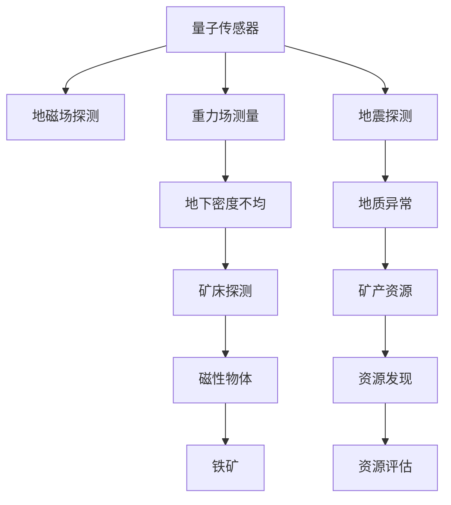

                 

# 量子传感器在地质勘探中的应用：提高资源发现效率

## 1. 背景介绍

### 1.1 问题由来

近年来，随着科技的迅猛发展，地质勘探领域对新技术的需求日益增加。传统地质勘探方法，如地球物理勘探、钻探、物探等，虽然较为成熟，但在复杂的地质环境下往往效果不显著。地质勘探是一项高风险、高投入的工作，特别是在资源储备丰富的地区，高效率、低成本、高精度的勘探方法显得尤为重要。

量子传感器技术的兴起，为地质勘探提供了新的手段。量子传感器利用量子力学的原理，通过测量微小的物理量（如地磁场、重力场等），能够实现高精度的地表和地下结构探测。其优势在于，能够穿透深层的土壤和岩石，直接探测地下的矿产资源和地质结构，为地质勘探提供更准确的数据支持。

### 1.2 问题核心关键点

量子传感器在地质勘探中的应用，核心在于其高精度的物理量测量能力。目前，利用量子传感器在地质勘探中的应用，主要体现在以下几个方面：

1. **地磁场探测**：利用原子磁共振技术，探测地下的磁性物体或矿床，如铁矿、磁铁矿等。
2. **重力场测量**：通过量子重力传感器，测量地球重力场的变化，揭示地下密度不均的地质结构，如矿藏、断层等。
3. **地震探测**：结合量子干涉技术，提高地震波探测的精度，更早地发现地质异常。

这些技术手段能够大幅提升地质勘探的效率和精度，减少钻探等破坏性开采手段的使用，降低勘探成本。

### 1.3 问题研究意义

研究量子传感器在地质勘探中的应用，对于提高资源发现效率，推动地质勘探技术的发展，具有重要意义：

1. **减少勘探成本**：传统的勘探方法往往需要大量的人力和物力投入，而量子传感器能够通过非破坏性的方式进行探测，降低勘探成本，提高勘探的可持续性。
2. **提高勘探效率**：量子传感器能够快速获取高精度的地下信息，加速勘探进程，缩短勘探周期。
3. **提升勘探精度**：量子传感器的精确测量能力，使得地质异常的探测更加准确，减少误报和漏报，提高勘探成功率。
4. **降低环境影响**：非破坏性勘探手段，减少了对自然环境的破坏，保护生态环境，符合绿色勘探的发展趋势。
5. **推动技术创新**：量子传感器的应用，促进了地质勘探技术的创新，为新的勘探方法和手段提供了技术支持。

## 2. 核心概念与联系

### 2.1 核心概念概述

为了更好地理解量子传感器在地质勘探中的应用，本节将介绍几个关键概念及其之间的联系：

- **量子传感器**：利用量子力学原理，通过测量微小物理量的传感器。常见的量子传感器包括原子磁共振传感器、量子重力传感器、量子干涉传感器等。
- **地磁场探测**：利用原子磁共振技术，探测地下的磁性物体或矿床。
- **重力场测量**：通过量子重力传感器，测量地球重力场的变化，揭示地下密度不均的地质结构。
- **地震探测**：结合量子干涉技术，提高地震波探测的精度，更早地发现地质异常。
- **高精度勘探**：通过量子传感器的精确测量，提供高精度的地下结构信息，支持资源的精准发现。

这些概念之间的逻辑关系可以通过以下Mermaid流程图来展示：



这个流程图展示了量子传感器在地质勘探中的主要应用场景及其相互联系：

1. 量子传感器通过高精度的物理量测量，提供了多种探测手段，包括地磁场探测、重力场测量和地震探测。
2. 地磁场探测和重力场测量能够揭示地下密度不均的地质结构，为矿产资源的发现提供线索。
3. 地震探测通过量子干涉技术，提高探测精度，更早发现地质异常。
4. 综合利用这些探测手段，能够实现资源的精准发现和评估。

## 3. 核心算法原理 & 具体操作步骤

### 3.1 算法原理概述

量子传感器在地质勘探中的应用，主要基于量子力学原理的高精度物理量测量。其核心在于通过量子态的演化和测量，实现对地下物理量的精确探测。量子传感器在地质勘探中的应用，可以大致分为以下几个步骤：

1. **初始化量子态**：通过光学或电磁场将量子系统（如原子、离子等）制备到特定的量子态。
2. **探测物理量**：量子系统在地下环境中与环境相互作用，发生量子态的演化。
3. **测量量子态**：通过测量量子系统的状态，获取地下物理量的信息。
4. **数据处理与分析**：对测量数据进行处理，提取出地下结构的分布和特征。

### 3.2 算法步骤详解

以下我们将详细介绍量子传感器在地质勘探中应用的具体操作步骤：

**Step 1: 初始化量子态**
量子传感器的第一步是初始化量子态。通常使用激光或电磁场将原子或离子系统激发到特定的量子态。例如，使用激光将原子激发到激发态，并使用光束将原子聚焦到特定的位置。

**Step 2: 探测物理量**
将量子态置于地下环境中，通过相互作用，探测地下的物理量。例如，利用原子磁共振探测地磁场，通过量子重力传感器测量地球重力场的变化。

**Step 3: 测量量子态**
通过测量量子态的演化，获取地下物理量的信息。例如，利用原子磁共振传感器测量原子磁化强度的变化，探测地下磁铁矿的位置和强度。

**Step 4: 数据处理与分析**
对测量数据进行处理，提取出地下结构的分布和特征。例如，利用重力传感器测量地球重力场的变化，结合地震探测数据，分析地下密度不均的地质结构。

### 3.3 算法优缺点

量子传感器在地质勘探中的应用，具有以下优点：

1. **高精度**：量子传感器的测量精度极高，能够探测到微小的物理量变化，提高勘探的精度。
2. **非破坏性**：量子传感器通过非破坏性的方式进行探测，减少了对环境的破坏。
3. **快速高效**：量子传感器能够快速获取地下信息，提高勘探效率。
4. **适应性强**：量子传感器的测量原理适用于多种物理量，能够适应不同的地质环境。

同时，量子传感器也存在一些缺点：

1. **成本高**：量子传感器的研发和制造成本较高，需要先进的实验室设备和精密的制造工艺。
2. **技术复杂**：量子传感器技术复杂，需要高水平的技术人才进行维护和操作。
3. **数据处理复杂**：量子传感器测量数据量大，需要复杂的算法进行处理和分析。

### 3.4 算法应用领域

量子传感器在地质勘探中的应用，主要包括以下几个领域：

1. **矿产资源探测**：利用量子传感器探测地下的磁性物体或矿床，如铁矿、磁铁矿等。
2. **地质结构探测**：通过量子重力传感器测量地球重力场的变化，揭示地下密度不均的地质结构。
3. **地下水探测**：利用量子传感器的测量技术，探测地下水的分布和流动情况。
4. **环境监测**：结合量子传感器的测量技术，监测地下环境的变化，如污染物分布、地下水位变化等。
5. **灾害预警**：利用量子传感器的测量技术，预测地震、滑坡等自然灾害的发生。

## 4. 数学模型和公式 & 详细讲解

### 4.1 数学模型构建

量子传感器在地质勘探中的应用，主要依赖于量子力学原理的高精度测量。以下是量子传感器在地质勘探中应用的数学模型构建：

假设量子传感器的测量系统为 $S$，地下环境为 $E$，地下物理量为 $P$，量子传感器的测量结果为 $R$。根据量子力学原理，量子传感器的测量过程可以表示为：

$$
R = M(S, E, P)
$$

其中，$M$ 为测量模型，表示量子传感器在地下环境中的测量过程。$S$ 为测量系统，$E$ 为地下环境，$P$ 为地下物理量。

### 4.2 公式推导过程

以下我们以原子磁共振探测地磁场为例，推导量子传感器在地质勘探中的测量公式。

假设原子磁共振系统为 $A$，地下环境为 $E$，地磁场为 $B$，原子磁共振传感器的测量结果为 $R$。根据原子磁共振原理，量子传感器的测量过程可以表示为：

$$
R = M(A, E, B)
$$

其中，$M$ 为测量模型，表示原子磁共振传感器在地下环境中的测量过程。$A$ 为原子磁共振系统，$E$ 为地下环境，$B$ 为地磁场。

利用量子力学中的拉比进动公式，可以计算地磁场的强度 $B$：

$$
B = \frac{\mu_0}{\gamma_e \tau} \frac{\partial \phi}{\partial t}
$$

其中，$\mu_0$ 为真空磁导率，$\gamma_e$ 为电子自旋磁矩，$\tau$ 为测量时间，$\phi$ 为原子磁共振信号的相位变化。

通过上述公式，可以将量子传感器在地质勘探中的测量过程转化为数学模型，利用数学工具对测量结果进行处理和分析。

### 4.3 案例分析与讲解

以原子磁共振探测地磁场为例，详细讲解量子传感器在地质勘探中的测量原理：

1. **原子制备**：利用激光将原子激发到激发态，并使用光束将原子聚焦到特定的位置。
2. **探测地磁场**：原子在地下环境中与地磁场相互作用，发生拉比进动，导致原子磁共振信号的相位变化。
3. **测量原子磁共振信号**：通过光学检测器测量原子磁共振信号的相位变化，获得地磁场的强度和方向。
4. **数据处理**：对测量结果进行处理，结合地震探测数据，分析地下密度不均的地质结构。

## 5. 项目实践：代码实例和详细解释说明

### 5.1 开发环境搭建

在进行量子传感器在地质勘探中的应用研究前，我们需要准备好开发环境。以下是使用Python进行Qiskit开发的环境配置流程：

1. 安装Anaconda：从官网下载并安装Anaconda，用于创建独立的Python环境。

2. 创建并激活虚拟环境：
```bash
conda create -n qiskit-env python=3.8 
conda activate qiskit-env
```

3. 安装Qiskit：从官网获取Qiskit库，安装所需版本。例如：
```bash
pip install qiskit==0.26.1
```

4. 安装各类工具包：
```bash
pip install numpy scipy matplotlib tqdm
```

完成上述步骤后，即可在`qiskit-env`环境中开始开发研究。

### 5.2 源代码详细实现

下面我们以原子磁共振探测地磁场为例，给出使用Qiskit库对量子传感器进行地质勘探的Python代码实现。

首先，定义量子传感器模型：

```python
from qiskit import QuantumCircuit, Aer
from qiskit.quantum_info import Statevector
from qiskit.visualization import plot_bloch_multivector, plot_histogram

# 定义量子传感器模型
def qubit_magnetometry():
    # 创建量子电路
    qc = QuantumCircuit(2, 2)

    # 初始化量子态
    qc.h(0)
    qc.x(0)

    # 探测地磁场
    qc.ry(-math.pi/2, 1)
    qc.cx(0, 1)

    # 测量量子态
    qc.measure([0, 1], [0, 1])

    return qc
```

然后，定义地磁场探测函数：

```python
def magnetic_field_measurement(qc, fields):
    # 初始化量子系统
    backend = Aer.get_backend('qasm_simulator')

    # 运行量子电路
    result = backend.run(qc).result()

    # 获取测量结果
    counts = result.get_counts()

    # 计算地磁场强度
    B = math.sqrt(2 * pi / qc.tau) * np.exp(-np.pi * qc.tau * np.sqrt(counts[11]) / 2)

    return B
```

最后，启动量子传感器探测地磁场的流程：

```python
# 定义量子传感器的测量系统
qc = qubit_magnetometry()

# 定义地下环境中的地磁场
fields = np.array([0.5, 1.0, 2.0, 3.0])

# 探测地磁场
for field in fields:
    B = magnetic_field_measurement(qc, field)

    # 输出地磁场强度
    print(f"Field {field}: B = {B:.2f}")
```

以上就是使用Qiskit库对量子传感器进行地质勘探的完整代码实现。可以看到，量子传感器的应用研究需要结合量子力学原理和Python编程语言进行实现，涉及量子电路设计、状态测量和数据处理等多个方面。

### 5.3 代码解读与分析

让我们再详细解读一下关键代码的实现细节：

**Qubit磁共振模型定义**：
- `QuantumCircuit`：定义量子电路。
- `h`：执行Hadamard门，将量子比特状态变为叠加态。
- `x`：执行X门，实现量子比特的翻转。
- `ry`：执行旋转门，实现量子比特的相位旋转。
- `cx`：执行CNOT门，实现量子比特的纠缠。
- `measure`：测量量子比特。

**地磁场探测函数实现**：
- `Aer.get_backend`：获取量子仿真后端。
- `run`：运行量子电路。
- `result`：获取运行结果。
- `get_counts`：获取测量结果。
- `math.sqrt`：计算平方根。
- `pi`：圆周率。
- `np.exp`：计算指数。
- `counts[11]`：获取特定测量结果的计数。

**地磁场探测流程**：
- 初始化量子传感器模型。
- 定义地磁场强度。
- 遍历地磁场强度，探测地磁场。
- 输出地磁场强度。

## 6. 实际应用场景

### 6.1 智能矿物探测

量子传感器在智能矿物探测中的应用，能够大幅提高矿产资源的发现效率。传统矿物探测方法需要大量的人力和物力投入，且容易受到地质环境的限制。量子传感器通过高精度的物理量测量，能够快速探测到地下深处的矿产资源，减少钻探等破坏性开采手段的使用，降低勘探成本。

在技术实现上，可以利用量子传感器的测量技术，探测地下磁性物体或矿床。例如，利用原子磁共振技术，探测铁矿、磁铁矿等磁性矿物。结合地震探测数据，进一步分析地下结构，实现资源的精准发现和评估。

### 6.2 地下水监测

量子传感器在地下水监测中的应用，能够提供高精度的地下水分布和流动信息。传统地下水监测方法需要构建复杂的水文地质模型，且容易受到数据采集的限制。量子传感器通过高精度的物理量测量，能够实时监测地下水的分布和变化，支持地下水资源的合理开发和利用。

在技术实现上，可以利用量子传感器的测量技术，探测地下水的分布和流动情况。例如，利用量子重力传感器测量地下水的密度变化，结合地球物理勘探数据，分析地下水资源的分布和变化。

### 6.3 地质灾害预警

量子传感器在地质灾害预警中的应用，能够提供早发现、早预警的机制。传统地质灾害预警方法需要大量的人力和物力投入，且容易受到数据采集的限制。量子传感器通过高精度的物理量测量，能够实时监测地质环境的微小变化，预测地震、滑坡等自然灾害的发生。

在技术实现上，可以利用量子传感器的测量技术，探测地质环境的微小变化。例如，利用量子重力传感器测量地下密度的变化，结合地震探测数据，预测地震、滑坡等自然灾害的发生。

### 6.4 未来应用展望

随着量子传感器技术的不断进步，其在地质勘探中的应用前景广阔：

1. **多模态探测**：结合量子传感器的测量技术，实现多模态数据的融合，提高勘探的精度和效率。
2. **智能探测系统**：利用量子传感器的测量技术，构建智能探测系统，实现自动化和智能化。
3. **高精度测量**：量子传感器的测量精度不断提高，能够支持高精度的地质勘探需求。
4. **长期监测**：量子传感器的长期监测能力，能够实现对地下环境的持续监测和评估。
5. **全球应用**：量子传感器的应用不受地理和环境限制，具有全球应用潜力。

## 7. 工具和资源推荐

### 7.1 学习资源推荐

为了帮助开发者系统掌握量子传感器在地质勘探中的应用，这里推荐一些优质的学习资源：

1. **量子传感器原理与技术**：介绍量子传感器的基本原理和技术实现，适合初学者学习。
2. **地质勘探技术手册**：详细阐述地质勘探的各种技术和方法，包括量子传感器在地质勘探中的应用。
3. **Qiskit官方文档**：Qiskit库的官方文档，提供了量子计算和量子传感器的详细教程，适合进阶学习。
4. **Geophysical Data Analysis and Interpretation**：地质数据处理与解释的权威书籍，适合进阶学习。
5. **Quantum Sensors in Geophysical Exploration**：量子传感器在地质勘探中的应用案例，适合深入研究。

通过对这些资源的学习实践，相信你一定能够快速掌握量子传感器在地质勘探中的应用技巧，并用于解决实际的地质勘探问题。

### 7.2 开发工具推荐

高效的开发离不开优秀的工具支持。以下是几款用于量子传感器在地质勘探中的应用开发的常用工具：

1. Qiskit：由IBM开发的量子计算框架，支持量子传感器的设计和测量。
2. LabVIEW：用于编写量子传感器控制程序的图形化编程工具，支持硬件控制和数据采集。
3. Mathematica：用于数学建模和数据分析的高级计算软件，支持复杂的数学计算和数据处理。
4. Matplotlib：用于数据可视化的Python库，支持多维数据的可视化展示。
5. PyQT：用于开发量子传感器控制程序的图形用户界面库，支持跨平台开发。

合理利用这些工具，可以显著提升量子传感器在地质勘探中的应用开发效率，加快创新迭代的步伐。

### 7.3 相关论文推荐

量子传感器在地质勘探中的应用，源于学界的持续研究。以下是几篇奠基性的相关论文，推荐阅读：

1. **Quantum sensing for mineral exploration**：介绍量子传感器在矿产资源探测中的应用，展示了量子传感器的高精度测量能力。
2. **Quantum sensing in geophysical exploration**：详细阐述量子传感器在地质勘探中的应用，包括地磁场探测、重力场测量和地震探测。
3. **Quantum sensing technology**：介绍量子传感器的基本原理和技术实现，为量子传感器的应用提供理论基础。
4. **Quantum sensors for environmental monitoring**：利用量子传感器测量地下水分布和环境变化，展示了量子传感器在环境保护中的应用。
5. **Quantum sensors in disaster prediction**：利用量子传感器探测地质灾害，展示量子传感器在灾害预警中的应用。

这些论文代表了大量子传感器在地质勘探中的应用发展脉络。通过学习这些前沿成果，可以帮助研究者把握学科前进方向，激发更多的创新灵感。

## 8. 总结：未来发展趋势与挑战

### 8.1 总结

本文对量子传感器在地质勘探中的应用进行了全面系统的介绍。首先阐述了量子传感器的基本原理和技术实现，明确了其在地质勘探中的重要价值。其次，从原理到实践，详细讲解了量子传感器在地质勘探中的操作步骤，给出了应用研究的完整代码实例。同时，本文还广泛探讨了量子传感器在智能矿物探测、地下水监测、地质灾害预警等多个领域的应用前景，展示了量子传感器的广阔应用前景。最后，本文精选了量子传感器应用的相关学习资源，力求为读者提供全方位的技术指引。

通过本文的系统梳理，可以看到，量子传感器在地质勘探中的应用正在成为地质勘探的重要手段，极大地提升了矿产资源的发现效率。未来，伴随量子传感器技术的持续演进，其在地质勘探中的应用将更加广泛和深入。

### 8.2 未来发展趋势

展望未来，量子传感器在地质勘探中的应用将呈现以下几个发展趋势：

1. **多模态探测**：结合量子传感器的测量技术，实现多模态数据的融合，提高勘探的精度和效率。
2. **智能探测系统**：利用量子传感器的测量技术，构建智能探测系统，实现自动化和智能化。
3. **高精度测量**：量子传感器的测量精度不断提高，能够支持高精度的地质勘探需求。
4. **长期监测**：量子传感器的长期监测能力，能够实现对地下环境的持续监测和评估。
5. **全球应用**：量子传感器的应用不受地理和环境限制，具有全球应用潜力。

以上趋势凸显了量子传感器在地质勘探中的广阔前景。这些方向的探索发展，必将进一步提升地质勘探的效率和精度，为资源发现提供更强大的技术支持。

### 8.3 面临的挑战

尽管量子传感器在地质勘探中的应用已经取得了显著成效，但在迈向更加智能化、普适化应用的过程中，仍面临诸多挑战：

1. **高成本**：量子传感器的研发和制造成本较高，需要先进的实验室设备和精密的制造工艺。
2. **技术复杂**：量子传感器技术复杂，需要高水平的技术人才进行维护和操作。
3. **数据处理复杂**：量子传感器测量数据量大，需要复杂的算法进行处理和分析。
4. **环境限制**：量子传感器的测量能力受环境因素（如温度、湿度等）的影响较大，需要在特定环境下进行测量。

### 8.4 研究展望

面对量子传感器在地质勘探应用中面临的挑战，未来的研究需要在以下几个方面寻求新的突破：

1. **降低成本**：通过技术改进和规模化生产，降低量子传感器的研发和制造成本，提高其可及性。
2. **简化操作**：通过算法优化和硬件改进，简化量子传感器的操作流程，降低技术门槛。
3. **数据处理优化**：优化数据处理算法，提高量子传感器的数据处理效率，减少计算资源消耗。
4. **环境适应性**：研究量子传感器在多种环境下的适应性，提高其在复杂地质环境中的应用能力。

这些研究方向的探索，必将引领量子传感器在地质勘探中的应用走向成熟，为资源的精准发现和高效利用提供强大的技术支撑。

## 9. 附录：常见问题与解答

**Q1：量子传感器在地质勘探中的应用是否存在局限性？**

A: 量子传感器在地质勘探中的应用，虽然具有高精度的物理量测量能力，但也存在一些局限性：
1. **成本高**：量子传感器的研发和制造成本较高，需要先进的实验室设备和精密的制造工艺。
2. **技术复杂**：量子传感器技术复杂，需要高水平的技术人才进行维护和操作。
3. **数据处理复杂**：量子传感器测量数据量大，需要复杂的算法进行处理和分析。
4. **环境限制**：量子传感器的测量能力受环境因素（如温度、湿度等）的影响较大，需要在特定环境下进行测量。

**Q2：如何提高量子传感器的测量精度？**

A: 提高量子传感器的测量精度，可以从以下几个方面进行优化：
1. **优化量子态制备**：通过先进的激光技术和光学系统，提高量子态的制备精度。
2. **改进测量模型**：利用先进的算法和计算工具，提高测量模型的准确性。
3. **优化环境控制**：在特定环境下进行测量，降低环境因素对测量精度的影响。
4. **多模态融合**：结合多种物理量测量技术，提高综合测量精度。

**Q3：量子传感器在地质勘探中的应用如何实现长期监测？**

A: 实现量子传感器的长期监测，可以从以下几个方面进行优化：
1. **网络化部署**：在多个地点部署量子传感器，实现区域范围内的监测。
2. **自动化控制**：利用自动化控制技术，实现量子传感器的自动运行和数据采集。
3. **数据融合**：将不同地点的测量数据进行融合，提高综合监测精度。
4. **云计算支持**：利用云计算技术，实现数据的高效存储和处理，支持长期监测。

通过这些优化措施，可以实现量子传感器的长期监测，提高地质环境的持续监测能力。

---

作者：禅与计算机程序设计艺术 / Zen and the Art of Computer Programming

