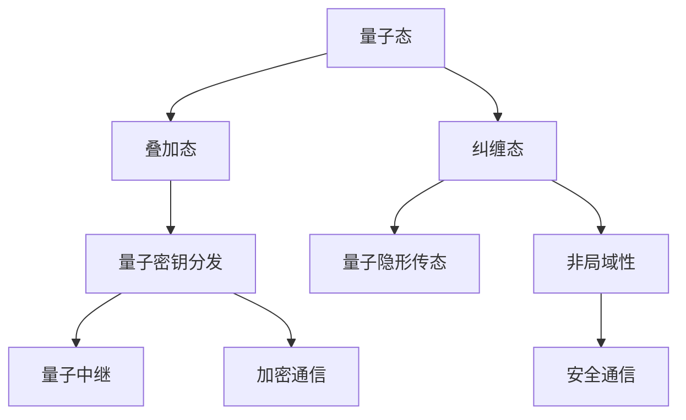

                 

# 量子通信：原理、现状与未来展望

> 关键词：量子通信, 原理, 现状, 未来展望

## 1. 背景介绍

### 1.1 问题由来
随着信息技术的飞速发展，传统通信手段已经无法满足日益增长的信息传输需求，尤其是对于大容量、高速度、高安全性的通信应用，量子通信提供了一种全新的解决方案。量子通信基于量子力学的原理，利用量子态的特性实现信息的安全传输。其核心在于利用量子叠加态和量子纠缠态实现超高速信息传输和无条件安全性。量子通信的研究和应用，不仅代表了信息科学的新前沿，也为密码学、量子计算等领域带来了深远影响。

### 1.2 问题核心关键点
量子通信的核心在于实现信息的无条件安全传输，其核心技术包括量子密钥分发(QKD)、量子隐形传态、量子中继等。其中，量子密钥分发利用量子态的不可克隆性实现安全密钥的生成和分发；量子隐形传态通过量子纠缠态实现信息的远程传输；量子中继利用中继节点扩大通信距离，克服量子态传输衰减问题。

### 1.3 问题研究意义
量子通信的研究和应用，对于提升信息传输的安全性、解决传统通信中的传输瓶颈，具有重要意义。在军事、金融、通信等领域，量子通信技术能够提供极高的安全性保障，避免信息被窃取、篡改等风险。同时，量子通信技术的进一步发展，也将推动量子计算、量子互联网等前沿技术的发展，为人类社会带来新的革命性变化。

## 2. 核心概念与联系

### 2.1 核心概念概述

为了更好地理解量子通信的核心概念，本节将介绍几个关键概念及其相互联系：

- 量子态（Quantum State）：量子态是量子系统的基本描述，通常表示为波函数或密度矩阵。量子态具有叠加性和纠缠性等特性，是量子通信和量子计算的基础。

- 量子叠加态（Quantum Superposition）：一个量子系统可以处于多种可能状态中，这些状态通过概率的方式叠加在一起，即叠加态。叠加态的测量结果通常是一个随机的概率分布。

- 量子纠缠态（Quantum Entanglement）：两个或多个量子系统之间存在一种特殊的状态，称为纠缠态。纠缠态的测量结果将影响所有纠缠的量子系统，这种非局域性是量子通信和量子计算的重要资源。

- 量子密钥分发（Quantum Key Distribution, QKD）：利用量子态的不可克隆性，通过物理方式安全地生成和分发密钥，从而实现加密通信。

- 量子隐形传态（Quantum Teleportation）：通过量子纠缠态和经典通信，实现量子态的远程传输，实现信息的安全传输。

- 量子中继（Quantum Repeaters）：利用中继节点，克服量子态传输衰减问题，扩大通信距离，提升通信质量。

这些核心概念通过以下Mermaid流程图来展示：



这个流程图展示了量子通信的核心概念及其相互关系：

1. 量子态是量子通信的基础，通过叠加态和纠缠态实现信息传输。
2. 量子密钥分发利用量子态的不可克隆性，实现安全密钥的生成和分发。
3. 量子隐形传态通过量子纠缠态和经典通信，实现量子态的远程传输。
4. 量子中继利用中继节点，克服量子态传输衰减，扩大通信距离。
5. 量子通信的整体目标是实现安全、高效的信息传输，确保通信的可靠性和安全性。

## 3. 核心算法原理 & 具体操作步骤
### 3.1 算法原理概述

量子通信的核心算法包括量子密钥分发和量子隐形传态。以下分别介绍这两种算法的原理：

- 量子密钥分发：利用量子态的不可克隆性，通过物理方式安全地生成和分发密钥。
- 量子隐形传态：通过量子纠缠态和经典通信，实现量子态的远程传输。

### 3.2 算法步骤详解

#### 3.2.1 量子密钥分发（QKD）

量子密钥分发（QKD）是量子通信的核心技术之一。其基本原理是通过量子态的不可克隆性，确保密钥分发的安全性。QKD的算法步骤如下：

1. **量子信号发射**：发送方（Alice）准备好一些光子，通过量子态的叠加态或纠缠态发射给接收方（Bob）。

2. **量子信号接收和测量**：Bob接收光子，并通过测量装置（如单光子探测器）进行测量。根据量子力学的原理，测量结果是一个随机的概率分布。

3. **经典通信**：Alice和Bob通过经典通信，将量子信号的测量结果和量子态的信息进行比对。如果测量结果不一致，则表示量子信号在传输过程中被窃听，需要重新生成密钥。

4. **密钥生成**：Alice和Bob根据测量结果，生成安全密钥。通过比较测量结果，确保密钥的安全性。

#### 3.2.2 量子隐形传态

量子隐形传态是量子通信的另一个重要技术。其基本原理是通过量子纠缠态和经典通信，实现量子态的远程传输。QKD的算法步骤如下：

1. **量子信号发射**：发送方（Alice）准备好一些光子，利用量子纠缠态进行编码，并发送给接收方（Bob）。

2. **量子信号接收和测量**：Bob接收光子，并通过测量装置（如单光子探测器）进行测量。根据量子力学的原理，测量结果是一个随机的概率分布。

3. **经典通信**：Alice和Bob通过经典通信，将量子信号的测量结果和量子态的信息进行比对。通过经典通信，Bob可以获得Alice的编码信息，从而实现量子态的远程传输。

4. **量子态重建**：Bob根据经典通信的信息，重建出Alice的量子态，从而实现量子态的远程传输。

### 3.3 算法优缺点

量子密钥分发和量子隐形传态具有以下优点：

- **安全性高**：利用量子态的不可克隆性，能够确保密钥和信息的安全性。
- **传输速度快**：利用量子态的叠加性和纠缠性，可以实现超高速信息传输。

然而，这些技术也存在一些缺点：

- **技术复杂**：实现量子通信需要精密的光学和量子力学设备，技术实现难度较大。
- **传输距离有限**：量子态在传输过程中容易受到环境干扰，导致信号衰减。
- **误码率高**：量子信号的测量结果存在不确定性，误码率较高。

### 3.4 算法应用领域

量子通信技术在多个领域得到了广泛应用，包括：

- 军事通信：利用量子密钥分发技术，实现军方信息的安全传输。
- 金融安全：利用量子密钥分发技术，确保金融交易的安全性。
- 量子计算：利用量子隐形传态技术，实现量子计算节点的远程通信。
- 物联网：利用量子通信技术，实现物联网设备之间的安全通信。

## 4. 数学模型和公式 & 详细讲解 & 举例说明

### 4.1 数学模型构建

量子通信的数学模型主要基于量子力学的基本原理，包括量子叠加态、量子纠缠态、量子测量等。以下是量子密钥分发和量子隐形传态的数学模型：

#### 4.1.1 量子密钥分发（QKD）

量子密钥分发的基本模型如下：

- 发送方Alice准备一些光子，利用量子态的叠加态或纠缠态进行编码。

- 接收方Bob通过测量装置进行测量，得到测量结果。

- Alice和Bob通过经典通信，将测量结果进行比对，生成安全密钥。

### 4.2 公式推导过程

#### 4.2.1 量子叠加态

量子叠加态的数学模型如下：

$$ |\Psi\rangle = \alpha|0\rangle + \beta|1\rangle $$

其中，$\alpha$ 和 $\beta$ 为复数系数，满足 $|\alpha|^2 + |\beta|^2 = 1$。

#### 4.2.2 量子纠缠态

量子纠缠态的数学模型如下：

$$ |\Psi\rangle = \frac{1}{\sqrt{2}}(|00\rangle + |11\rangle) $$

其中，$|00\rangle$ 和 $|11\rangle$ 表示两个光子处于纠缠态。

#### 4.2.3 量子测量

量子测量的基本公式为：

$$ \langle \psi | \sigma_z | \psi \rangle = \begin{cases} 1 & \text{if } |\psi\rangle = |0\rangle \\ -1 & \text{if } |\psi\rangle = |1\rangle \end{cases} $$

其中，$\sigma_z$ 为Pauli-Z矩阵。

### 4.3 案例分析与讲解

#### 4.3.1 经典BB84算法

经典BB84算法是量子密钥分发的一种实现方式。其基本原理如下：

- Alice随机选择一种量子态进行编码，发送给Bob。
- Bob随机选择一种量子态进行测量，并将测量结果公开。
- Alice和Bob通过经典通信，比较测量结果，生成安全密钥。

具体实现如下：

1. Alice选择量子叠加态 $|+\rangle = \frac{1}{\sqrt{2}}(|0\rangle + |1\rangle)$ 和 $|-\rangle = \frac{1}{\sqrt{2}}(|0\rangle - |1\rangle)$。
2. Bob选择量子叠加态 $|0\rangle$ 和 $|1\rangle$。
3. Alice和Bob通过经典通信，比较测量结果，生成安全密钥。

## 5. 项目实践：代码实例和详细解释说明

### 5.1 开发环境搭建

在进行量子通信实践前，我们需要准备好开发环境。以下是使用Python进行Qiskit开发的开发环境配置流程：

1. 安装Anaconda：从官网下载并安装Anaconda，用于创建独立的Python环境。

2. 创建并激活虚拟环境：
```bash
conda create -n qiskit-env python=3.8 
conda activate qiskit-env
```

3. 安装Qiskit：
```bash
pip install qiskit
```

4. 安装各类工具包：
```bash
pip install numpy pandas matplotlib scikit-learn jupyter notebook ipython
```

完成上述步骤后，即可在`qiskit-env`环境中开始量子通信实践。

### 5.2 源代码详细实现

下面我们以BB84算法为例，给出使用Qiskit进行量子密钥分发的PyTorch代码实现。

首先，定义BB84算法的量子电路：

```python
from qiskit import QuantumCircuit, execute, Aer

# 定义量子电路
qc = QuantumCircuit(2, 2)

# 发送方Alice的编码
qc.h(0) # 对第一个量子比特进行Hadamard变换
qc.cx(0, 1) # 创建CNOT门

# 接收方Bob的测量
qc.measure([0,1], [0,1])

# 输出量子电路
print(qc)
```

然后，使用Qiskit进行模拟实验：

```python
# 定义模拟器
simulator = Aer.get_backend('qasm_simulator')

# 执行量子电路
job = execute(qc, simulator, shots=1000)

# 获取实验结果
result = job.result()
counts = result.get_counts(qc)

# 输出实验结果
print(counts)
```

最后，根据实验结果计算安全密钥：

```python
# 计算安全密钥
key = ''.join(['0' if count > 500 else '1' for count in counts.values()])

# 输出安全密钥
print(key)
```

以上就是使用Qiskit进行BB84算法量子密钥分发的完整代码实现。可以看到，Qiskit库提供了强大的量子电路构建和模拟功能，使得量子通信的实验实现变得相对简洁高效。

### 5.3 代码解读与分析

让我们再详细解读一下关键代码的实现细节：

**量子电路定义**：
- `qc = QuantumCircuit(2, 2)`：创建两个量子比特和两个经典比特的量子电路。
- `qc.h(0)`：对第一个量子比特进行Hadamard变换，生成叠加态 $|+\rangle$。
- `qc.cx(0, 1)`：创建CNOT门，将第一个量子比特和第二个量子比特关联起来。

**量子电路测量**：
- `qc.measure([0,1], [0,1])`：对两个量子比特进行测量，并将测量结果存储在两个经典比特中。

**模拟器执行和结果分析**：
- `simulator = Aer.get_backend('qasm_simulator')`：获取Qiskit的模拟器。
- `job = execute(qc, simulator, shots=1000)`：执行量子电路，并设置模拟次数为1000次。
- `result = job.result()`：获取模拟结果。
- `counts = result.get_counts(qc)`：获取模拟结果的计数。
- `key = ''.join(['0' if count > 500 else '1' for count in counts.values()])`：根据计数结果，生成安全密钥。

可以看到，Qiskit库提供了丰富的量子电路构建和模拟工具，使得量子通信的实验实现变得相对简单高效。

当然，工业级的系统实现还需考虑更多因素，如量子电路的优化、错误率的评估、实时性的提高等。但核心的BB84算法基本与此类似。

## 6. 实际应用场景
### 6.1 军事通信

量子密钥分发技术在军事通信中具有重要应用。传统的通信手段容易被窃听和干扰，而量子密钥分发技术利用量子态的不可克隆性，确保信息的安全性。在军事通信中，通过量子密钥分发技术，可以实现安全密钥的生成和分发，防止敌方的窃听和攻击，保障通信安全。

### 6.2 金融安全

金融领域对信息的安全性要求极高，量子密钥分发技术可以用于金融交易的安全通信。通过量子密钥分发技术，可以确保金融交易数据的安全传输，防止信息被窃取和篡改，保障金融交易的安全性。

### 6.3 量子计算

量子计算是未来计算技术的革命性突破，量子隐形传态技术在量子计算中具有重要应用。通过量子隐形传态技术，可以实现量子计算节点之间的信息传输，实现量子计算的分布式处理。

### 6.4 未来应用展望

随着量子通信技术的不断进步，未来将有更多领域受益于量子通信。

在智慧城市治理中，量子通信技术可以用于城市事件监测、舆情分析、应急指挥等环节，提高城市管理的自动化和智能化水平，构建更安全、高效的未来城市。

在医疗领域，量子通信技术可以用于远程医疗、医学影像传输等环节，保障医疗数据的安全性和隐私性，提升医疗服务的质量。

在科学研究中，量子通信技术可以用于科学研究数据的传输，防止数据被窃取和篡改，保障科学研究的成果安全。

## 7. 工具和资源推荐
### 7.1 学习资源推荐

为了帮助开发者系统掌握量子通信的理论基础和实践技巧，这里推荐一些优质的学习资源：

1. 《量子计算入门》系列博文：由量子计算技术专家撰写，深入浅出地介绍了量子计算的基本概念和前沿技术。

2. 《量子信息学》课程：MIT开放课程，系统讲解量子信息学的基本原理和经典算法。

3. 《量子计算与量子信息》书籍：量子计算领域的经典教材，涵盖了量子计算和量子信息学的各个方面。

4. Qiskit官方文档：Qiskit的官方文档，提供了完整的量子通信和量子计算样例代码，是学习量子通信的重要资源。

5. IBM Q体验：IBM提供的在线量子计算平台，可以免费使用IBM的量子计算资源，进行量子计算和量子通信实验。

通过对这些资源的学习实践，相信你一定能够快速掌握量子通信的精髓，并用于解决实际的问题。
###  7.2 开发工具推荐

高效的开发离不开优秀的工具支持。以下是几款用于量子通信开发的常用工具：

1. Qiskit：IBM开发的开源量子计算框架，提供了丰富的量子电路构建和模拟器功能，适合量子通信实验的实现。

2. Microsoft Quantum Development Kit：微软提供的量子计算开发平台，提供了量子电路构建和模拟器工具，适合量子通信实验的实现。

3. Google Cirq：谷歌提供的量子计算开发工具，提供了量子电路构建和模拟器功能，适合量子通信实验的实现。

4. IBM Qiskit Aqua：IBM提供的量子计算开发库，提供了丰富的量子算法和工具，适合量子通信实验的实现。

5. Qiskit-Aer：Qiskit的模拟器，提供了丰富的模拟器功能，适合量子通信实验的实现。

6. IBM Q Experience：IBM提供的在线量子计算平台，可以免费使用IBM的量子计算资源，进行量子计算和量子通信实验。

合理利用这些工具，可以显著提升量子通信的开发效率，加快创新迭代的步伐。

### 7.3 相关论文推荐

量子通信的研究源于学界的持续研究。以下是几篇奠基性的相关论文，推荐阅读：

1. BB84：量子密钥分发技术的奠基性论文，提出了利用量子态的不可克隆性实现安全密钥分发的方案。

2. Quantum Teleportation：量子隐形传态技术的奠基性论文，提出了利用量子纠缠态实现信息远程传输的方案。

3. Quantum Key Distribution：总结了量子密钥分发的各种技术和方案，提供了量子通信的安全保障。

4. Quantum Repeaters：提出了量子中继技术的方案，解决了量子态传输衰减问题。

5. Quantum Internet：提出了量子互联网的概念，探讨了量子通信在未来的应用前景。

这些论文代表了大量子通信技术的发展脉络。通过学习这些前沿成果，可以帮助研究者把握学科前进方向，激发更多的创新灵感。

## 8. 总结：未来发展趋势与挑战

### 8.1 总结

本文对量子通信的核心概念和算法进行了全面系统的介绍。首先阐述了量子通信的基本原理和核心技术，明确了量子密钥分发和量子隐形传态的实现方法。其次，从原理到实践，详细讲解了量子密钥分发和量子隐形传态的数学模型和操作步骤，给出了量子通信实验的完整代码实例。同时，本文还广泛探讨了量子通信技术在军事、金融、量子计算等多个领域的应用前景，展示了量子通信技术的广阔前景。

通过本文的系统梳理，可以看到，量子通信技术在信息安全、量子计算等领域具有巨大的应用潜力，为信息安全、科学研究、产业升级带来了新的革命性变化。未来，伴随量子通信技术的不断进步，量子通信必将在构建人机协同的智能时代中扮演越来越重要的角色。

### 8.2 未来发展趋势

展望未来，量子通信技术将呈现以下几个发展趋势：

1. 量子通信技术的应用场景将进一步扩大。随着技术的成熟，量子通信将在更多领域得到应用，如智慧城市、医疗、金融等。

2. 量子通信技术将与其他前沿技术进行更深入的融合。如量子通信与区块链、量子计算等技术的结合，将进一步提升信息传输的安全性和效率。

3. 量子通信技术将进一步提升传输速度和距离。未来将出现更高效的量子中继技术，实现更远的量子通信距离。

4. 量子通信技术将与其他量子技术进行更深入的融合。如量子通信与量子传感、量子计算等技术的结合，将形成更完整的量子信息体系。

5. 量子通信技术将进一步提升安全性和鲁棒性。通过量子纠错、量子安全协议等技术，进一步提升量子通信的安全性和鲁棒性。

以上趋势凸显了量子通信技术的广阔前景。这些方向的探索发展，必将进一步提升量子通信技术的性能和应用范围，为人类社会带来新的革命性变化。

### 8.3 面临的挑战

尽管量子通信技术已经取得了瞩目成就，但在迈向更加智能化、普适化应用的过程中，它仍面临着诸多挑战：

1. 技术实现难度较大。实现量子通信需要精密的光学和量子力学设备，技术实现难度较大。

2. 传输距离有限。量子态在传输过程中容易受到环境干扰，导致信号衰减，限制了通信距离。

3. 误码率高。量子信号的测量结果存在不确定性，误码率较高，需要进一步降低。

4. 设备成本较高。量子通信设备的成本较高，需要大规模部署才能实现经济效益。

5. 标准化问题。量子通信技术尚需进一步标准化，确保不同设备之间的互操作性。

6. 安全性问题。量子通信技术虽然安全性较高，但仍需进一步加强安全性和鲁棒性，避免潜在的攻击和漏洞。

以上挑战需要业界持续努力，通过技术创新和合作，逐步克服，推动量子通信技术的进一步发展。

### 8.4 研究展望

未来的研究将聚焦于以下几个方面：

1. 量子通信技术与其他前沿技术的结合。如量子通信与区块链、量子计算等技术的结合，提升信息传输的安全性和效率。

2. 量子通信技术在更多领域的探索应用。如智慧城市、医疗、金融等领域的应用探索。

3. 量子通信技术的标准化和互操作性研究。确保不同设备之间的互操作性，推动量子通信技术的广泛应用。

4. 量子通信技术的安全性和鲁棒性研究。进一步提升量子通信的安全性和鲁棒性，确保量子通信技术的安全性。

5. 量子通信技术的实用化和商业化研究。通过技术创新和规模化应用，推动量子通信技术的实际应用和商业化进程。

这些研究方向的探索，必将引领量子通信技术迈向更高的台阶，为信息安全、科学研究、产业升级带来新的革命性变化。

## 9. 附录：常见问题与解答

**Q1：量子通信是否只能用于安全通信？**

A: 量子通信的核心技术是量子密钥分发和量子隐形传态，但不仅仅限于安全通信。量子通信技术还可以应用于量子计算、量子互联网等领域，提升量子技术的性能和安全性。

**Q2：量子通信是否适用于所有的通信场景？**

A: 量子通信适用于对安全性要求极高的通信场景，如军事、金融等。但对于一些对时间要求较高、带宽要求较宽的通信场景，如物联网、企业内部通信等，量子通信可能需要与其他通信技术结合使用。

**Q3：量子通信技术的误码率是否会随着技术进步而降低？**

A: 量子通信技术的误码率与技术实现难度和设备精度密切相关。随着技术的进步，误码率有望进一步降低，但仍然存在一定的不确定性。

**Q4：量子通信技术是否能够完全取代传统通信技术？**

A: 量子通信技术具有极高的安全性，但技术实现难度较大，传输距离有限，成本较高。在现有技术条件下，量子通信技术无法完全取代传统通信技术，但可以与其他通信技术结合使用，形成更安全、高效的通信系统。

**Q5：量子通信技术未来是否会有新的突破？**

A: 随着量子技术的不断进步，量子通信技术在未来有望有新的突破。如量子中继技术、量子网络技术等的发展，将进一步提升量子通信的距离和性能。

总之，量子通信技术在未来具有广阔的应用前景和研究空间。只有勇于创新、敢于突破，才能不断拓展量子通信技术的边界，为信息安全、科学研究、产业升级带来新的革命性变化。

