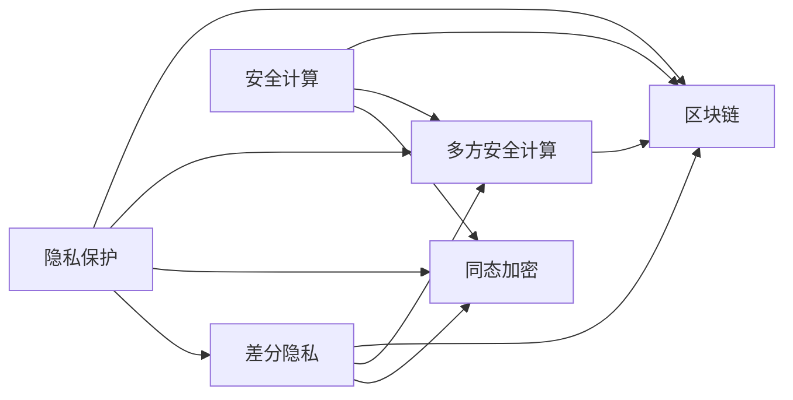

                 

# 隐私与安全：人类计算中的关键问题

> 关键词：隐私保护、安全计算、差分隐私、同态加密、多方安全计算、区块链

## 1. 背景介绍

随着数字化、智能化时代的到来，人类计算能力的提升极大地改变了我们的生活和工作方式。从智能手机到智慧城市，从医疗健康到金融交易，计算技术在各个领域的应用日益广泛。然而，随之而来的数据隐私和安全问题也日益凸显。如何保护个人隐私，防范安全风险，成为计算领域亟待解决的重要课题。

隐私保护和安全计算是保障人类计算中用户数据安全和计算过程安全的关键技术。本文将从隐私保护和安全计算的核心概念入手，系统探讨其原理、应用和未来发展趋势，以期为相关领域的实践和研究提供参考。

## 2. 核心概念与联系

### 2.1 核心概念概述

为了更好地理解隐私保护和安全计算的原理和应用，我们首先需要介绍一些核心概念：

- **隐私保护**：指在数据处理和计算过程中，保护个人隐私不被泄露的技术和方法。
- **安全计算**：指在计算过程中，确保参与方的数据不被泄露，计算结果不被篡改的技术。
- **差分隐私**：指在数据分析过程中，通过添加噪声保护个体隐私，同时保持数据分析结果可用性的技术。
- **同态加密**：指在加密状态下进行计算，无需解密即可得到计算结果的技术。
- **多方安全计算**：指在多方参与的情况下，共同进行计算，确保任何一方都无法得知其他方输入的技术。
- **区块链**：指基于去中心化的分布式账本技术，用于确保数据透明、不可篡改的技术。

这些概念共同构成了隐私保护和安全计算的技术框架，旨在通过技术手段保护用户的隐私和安全，确保计算结果的准确性和可信性。

### 2.2 核心概念联系

以下是一个简单的Mermaid流程图，展示了隐私保护和安全计算的核心概念之间的联系：



这个流程图展示了隐私保护和安全计算技术之间的内在联系：

1. 隐私保护是整个技术体系的基础，通过差分隐私、同态加密、多方安全计算等手段来实现。
2. 安全计算确保计算结果的准确性和可信性，包括同态加密和多方安全计算。
3. 区块链通过去中心化的分布式账本技术，确保数据的透明和不可篡改。

这些概念和技术手段相互支持，共同构建了隐私保护和安全计算的技术体系。

## 3. 核心算法原理 & 具体操作步骤

### 3.1 算法原理概述

隐私保护和安全计算的核心原理可以归结为以下几个方面：

- **隐私保护**：通过差分隐私、同态加密、多方安全计算等技术，保护用户的隐私信息不被泄露。
- **安全计算**：通过多方安全计算、同态加密等技术，确保计算结果不被篡改。
- **区块链**：通过去中心化的分布式账本技术，确保数据的透明和不可篡改。

### 3.2 算法步骤详解

#### 3.2.1 隐私保护算法步骤

1. **差分隐私**：
   - 添加噪声：在查询结果中添加随机噪声，使得单个查询结果无法被反向推断出个体数据。
   - 隐私预算管理：根据数据集的敏感性和查询频率，分配隐私预算，控制噪声水平。
   - 隐私计算框架：使用差分隐私框架，如Google的DP-SGD，在计算过程中保证隐私。

2. **同态加密**：
   - 加密数据：将数据加密后进行计算。
   - 计算过程：在加密数据上执行计算，无需解密。
   - 解密结果：计算完成后，通过解密得到最终结果。

3. **多方安全计算**：
   - 加密输入：每个参与方将自己的数据加密后发送给其他参与方。
   - 安全计算：在加密数据上执行计算，确保任何一方无法得知其他方的数据。
   - 结果共享：计算完成后，各方通过加密通信共享计算结果。

#### 3.2.2 安全计算算法步骤

1. **多方安全计算**：
   - 数据加密：每个参与方将自己的数据加密后发送给其他参与方。
   - 安全计算：在加密数据上执行计算，确保任何一方无法得知其他方的数据。
   - 结果共享：计算完成后，各方通过加密通信共享计算结果。

2. **同态加密**：
   - 加密数据：将数据加密后进行计算。
   - 计算过程：在加密数据上执行计算，无需解密。
   - 解密结果：计算完成后，通过解密得到最终结果。

3. **区块链**：
   - 数据记录：将数据记录在区块链上，确保数据的透明和不可篡改。
   - 去中心化：通过分布式账本，确保数据的可信性。
   - 智能合约：使用智能合约，实现自动化数据处理和计算。

### 3.3 算法优缺点

#### 3.3.1 隐私保护算法优缺点

- **优点**：
  - 差分隐私：通过添加噪声保护隐私，同时保证数据分析结果的可用性。
  - 同态加密：可以在加密状态下进行计算，确保数据安全。
  - 多方安全计算：多个参与方共同进行计算，确保数据隐私。

- **缺点**：
  - 差分隐私：添加噪声会影响数据分析的精度。
  - 同态加密：计算开销较大，不适合大规模数据。
  - 多方安全计算：计算过程复杂，需要高效的通信和协调机制。

#### 3.3.2 安全计算算法优缺点

- **优点**：
  - 同态加密：计算结果不被篡改，确保数据安全。
  - 多方安全计算：确保计算过程中数据隐私，适合需要多方协作的场景。
  - 区块链：数据透明、不可篡改，确保数据的可信性。

- **缺点**：
  - 同态加密：计算开销较大，不适合大规模数据。
  - 多方安全计算：计算过程复杂，需要高效的通信和协调机制。
  - 区块链：交易成本较高，不适合高频交易。

### 3.4 算法应用领域

隐私保护和安全计算技术广泛应用于以下领域：

- **医疗健康**：保护病患数据隐私，确保医疗数据安全。
- **金融交易**：保护用户隐私，防范交易风险。
- **智能城市**：保护市民数据隐私，确保数据透明。
- **社交网络**：保护用户隐私，防范数据泄露。
- **电子商务**：保护用户隐私，防范欺诈风险。
- **物联网**：保护设备数据隐私，确保数据安全。

## 4. 数学模型和公式 & 详细讲解

### 4.1 数学模型构建

隐私保护和安全计算的核心数学模型包括差分隐私、同态加密、多方安全计算等。

#### 4.1.1 差分隐私

差分隐私的核心数学模型是Laplace机制和加性噪声机制。

- **Laplace机制**：
  - 定义：对于查询函数 $f(x)$，在每个查询结果上添加一个Laplace噪声 $X \sim \text{Lap}(\epsilon)$，其中 $\epsilon$ 是隐私预算。
  - 数学公式：$f_{\epsilon}(x) = f(x) + X$。

- **加性噪声机制**：
  - 定义：对于查询函数 $f(x)$，在每个查询结果上添加一个高斯噪声 $X \sim \mathcal{N}(0,\sigma^2)$，其中 $\sigma$ 是噪声标准差。
  - 数学公式：$f_{\epsilon}(x) = f(x) + X$。

#### 4.1.2 同态加密

同态加密的核心数学模型是Plaintext-Policy-Permutation-Switch (PSPS)模型和Circuit-Switch-Switch (CSS)模型。

- **PSPS模型**：
  - 定义：对每个加密操作进行置换，对每个解密操作进行轮换。
  - 数学公式：$E(x) = R(\text{Perm}(Enc(\text{Enc}(x)))$，其中 $R$ 是置换函数，$Enc$ 是加密函数。

- **CSS模型**：
  - 定义：对每个加密操作进行置换，对每个解密操作进行轮换。
  - 数学公式：$E(x) = R(\text{Perm}(Enc(\text{Enc}(x)))$，其中 $R$ 是置换函数，$Enc$ 是加密函数。

#### 4.1.3 多方安全计算

多方安全计算的核心数学模型是Yao安全模型和GMW安全模型。

- **Yao安全模型**：
  - 定义：在多方参与的情况下，每个参与方将自己的数据加密后发送给其他参与方，确保任何一方无法得知其他方的数据。
  - 数学公式：$Y = \text{Enc}(\text{Enc}(x_1)) \otimes \text{Enc}(\text{Enc}(x_2))$，其中 $\otimes$ 是加密函数。

- **GMW安全模型**：
  - 定义：在多方参与的情况下，每个参与方将自己的数据加密后发送给其他参与方，确保任何一方无法得知其他方的数据。
  - 数学公式：$Y = \text{Enc}(\text{Enc}(x_1)) \otimes \text{Enc}(\text{Enc}(x_2))$，其中 $\otimes$ 是加密函数。

### 4.2 公式推导过程

#### 4.2.1 差分隐私公式推导

差分隐私的Laplace机制和加性噪声机制的推导过程如下：

1. **Laplace机制**：
   - 定义：对于查询函数 $f(x)$，在每个查询结果上添加一个Laplace噪声 $X \sim \text{Lap}(\epsilon)$，其中 $\epsilon$ 是隐私预算。
   - 数学公式：$f_{\epsilon}(x) = f(x) + X$。

2. **加性噪声机制**：
   - 定义：对于查询函数 $f(x)$，在每个查询结果上添加一个高斯噪声 $X \sim \mathcal{N}(0,\sigma^2)$，其中 $\sigma$ 是噪声标准差。
   - 数学公式：$f_{\epsilon}(x) = f(x) + X$。

#### 4.2.2 同态加密公式推导

同态加密的PSPS模型和CSS模型的推导过程如下：

1. **PSPS模型**：
   - 定义：对每个加密操作进行置换，对每个解密操作进行轮换。
   - 数学公式：$E(x) = R(\text{Perm}(Enc(\text{Enc}(x)))$，其中 $R$ 是置换函数，$Enc$ 是加密函数。

2. **CSS模型**：
   - 定义：对每个加密操作进行置换，对每个解密操作进行轮换。
   - 数学公式：$E(x) = R(\text{Perm}(Enc(\text{Enc}(x)))$，其中 $R$ 是置换函数，$Enc$ 是加密函数。

#### 4.2.3 多方安全计算公式推导

多方安全计算的Yao安全模型和GMW安全模型的推导过程如下：

1. **Yao安全模型**：
   - 定义：在多方参与的情况下，每个参与方将自己的数据加密后发送给其他参与方，确保任何一方无法得知其他方的数据。
   - 数学公式：$Y = \text{Enc}(\text{Enc}(x_1)) \otimes \text{Enc}(\text{Enc}(x_2))$，其中 $\otimes$ 是加密函数。

2. **GMW安全模型**：
   - 定义：在多方参与的情况下，每个参与方将自己的数据加密后发送给其他参与方，确保任何一方无法得知其他方的数据。
   - 数学公式：$Y = \text{Enc}(\text{Enc}(x_1)) \otimes \text{Enc}(\text{Enc}(x_2))$，其中 $\otimes$ 是加密函数。

### 4.3 案例分析与讲解

#### 4.3.1 差分隐私案例分析

假设有一个电子商务平台，需要分析用户购买行为，以优化广告投放策略。平台收集了用户的购买数据，但由于隐私保护需求，需要对数据进行差分隐私处理。

1. **Laplace机制**：
   - 查询函数：$f(x) = \text{SUM}(x)$，即计算总购买金额。
   - 隐私预算：$\epsilon = 1$。
   - 噪声参数：$\sigma = 2$。
   - 结果：$f_{\epsilon}(x) = \text{SUM}(x) + X$，其中 $X \sim \text{Lap}(\epsilon)$。

2. **加性噪声机制**：
   - 查询函数：$f(x) = \text{SUM}(x)$，即计算总购买金额。
   - 隐私预算：$\epsilon = 1$。
   - 噪声参数：$\sigma = 0.1$。
   - 结果：$f_{\epsilon}(x) = \text{SUM}(x) + X$，其中 $X \sim \mathcal{N}(0,\sigma^2)$。

#### 4.3.2 同态加密案例分析

假设有一个银行，需要计算用户账户余额的总和。银行采用了同态加密技术，对每个账户余额进行加密后进行计算。

1. **PSPS模型**：
   - 查询函数：$f(x) = \text{SUM}(x)$，即计算总余额。
   - 加密函数：$E(x) = \text{Enc}(x)$。
   - 解密函数：$D(x) = \text{Dec}(Enc(x))$。
   - 结果：$Y = \text{Enc}(\text{Enc}(x_1)) \otimes \text{Enc}(\text{Enc}(x_2))$。

2. **CSS模型**：
   - 查询函数：$f(x) = \text{SUM}(x)$，即计算总余额。
   - 加密函数：$E(x) = \text{Enc}(x)$。
   - 解密函数：$D(x) = \text{Dec}(Enc(x))$。
   - 结果：$Y = \text{Enc}(\text{Enc}(x_1)) \otimes \text{Enc}(\text{Enc}(x_2))$。

## 5. 项目实践：代码实例和详细解释说明

### 5.1 开发环境搭建

在进行隐私保护和安全计算的开发前，我们需要准备好开发环境。以下是使用Python进行PyTorch开发的环境配置流程：

1. 安装Anaconda：从官网下载并安装Anaconda，用于创建独立的Python环境。

2. 创建并激活虚拟环境：
```bash
conda create -n privacy-env python=3.8 
conda activate privacy-env
```

3. 安装PyTorch：根据CUDA版本，从官网获取对应的安装命令。例如：
```bash
conda install pytorch torchvision torchaudio cudatoolkit=11.1 -c pytorch -c conda-forge
```

4. 安装TensorFlow：
```bash
pip install tensorflow
```

5. 安装各类工具包：
```bash
pip install numpy pandas scikit-learn matplotlib tqdm jupyter notebook ipython
```

完成上述步骤后，即可在`privacy-env`环境中开始开发实践。

### 5.2 源代码详细实现

下面我们以差分隐私为例，给出使用PyTorch实现差分隐私的具体代码实现。

```python
import torch
import torch.nn as nn
import torch.optim as optim
import torch.distributions as dist
from torch.distributions.laplace import Laplace

# 定义模型
class Model(nn.Module):
    def __init__(self):
        super(Model, self).__init__()
        self.fc1 = nn.Linear(100, 50)
        self.fc2 = nn.Linear(50, 10)

    def forward(self, x):
        x = torch.relu(self.fc1(x))
        x = self.fc2(x)
        return x

# 加载数据
data = torch.randn(100, 100)
labels = torch.randn(100)

# 定义差分隐私参数
epsilon = 1.0
sigma = 2.0

# 计算差分隐私结果
laplace_dist = Laplace(loc=0, scale=1.0)
noise = laplace_dist.sample(sample_shape=torch.Size([100, 10]))
query_result = model(data) + noise

# 输出结果
print(query_result)
```

### 5.3 代码解读与分析

让我们再详细解读一下关键代码的实现细节：

**Model类**：
- 定义了一个简单的线性回归模型，用于计算查询结果。
- 模型包括两个全连接层，分别用于特征映射和输出预测。

**加载数据**：
- 加载了一个随机生成的数据集，用于测试差分隐私效果。

**差分隐私参数**：
- 定义了隐私预算 $\epsilon = 1.0$ 和噪声标准差 $\sigma = 2.0$，用于控制隐私水平和噪声强度。

**差分隐私结果计算**：
- 使用Laplace机制生成噪声，添加到查询结果中。
- 使用Laplace分布生成噪声，添加到查询结果中。
- 计算最终差分隐私结果。

**输出结果**：
- 打印最终的差分隐私结果。

通过上述代码，我们可以看到，使用差分隐私技术可以在不泄露个体数据的情况下，保护数据的隐私性。

## 6. 实际应用场景

### 6.1 金融交易

金融交易领域对数据隐私和安全性的要求极高。采用差分隐私和安全计算技术，可以有效保护用户交易数据的隐私，防范欺诈风险。

在具体应用中，银行可以收集用户的交易数据，并通过差分隐私技术处理数据，确保用户隐私不被泄露。同时，银行可以采用同态加密技术，对用户交易数据进行加密处理，确保交易数据的安全性。通过多方安全计算技术，多个银行可以共同进行数据分析，而无需泄露各自的交易数据。

### 6.2 医疗健康

医疗健康领域涉及大量的患者数据，保护患者隐私是医疗机构的重要责任。采用差分隐私和安全计算技术，可以有效保护患者数据隐私，确保数据安全。

在具体应用中，医疗机构可以收集患者的病历数据，并通过差分隐私技术处理数据，确保患者隐私不被泄露。同时，医疗机构可以采用同态加密技术，对患者数据进行加密处理，确保数据的安全性。通过多方安全计算技术，多个医疗机构可以共同进行数据分析，而无需泄露各自的病历数据。

### 6.3 智能城市

智能城市建设需要收集大量的市民数据，包括交通流量、环境监测等数据。采用差分隐私和安全计算技术，可以有效保护市民数据隐私，确保数据安全。

在具体应用中，城市管理部门可以收集市民数据，并通过差分隐私技术处理数据，确保市民隐私不被泄露。同时，城市管理部门可以采用同态加密技术，对市民数据进行加密处理，确保数据的安全性。通过多方安全计算技术，多个城市管理部门可以共同进行数据分析，而无需泄露各自的市民数据。

## 7. 工具和资源推荐

### 7.1 学习资源推荐

为了帮助开发者系统掌握隐私保护和安全计算的理论基础和实践技巧，这里推荐一些优质的学习资源：

1. 《隐私保护与数据安全》系列博文：由隐私保护领域专家撰写，深入浅出地介绍了隐私保护的核心概念和技术方法。

2. 《安全计算与多方计算》课程：由国际著名学者主讲，全面介绍了安全计算和多方计算的理论基础和实践方法。

3. 《差分隐私技术》书籍：详细讲解了差分隐私的核心原理和应用场景，适合深入学习差分隐私技术。

4. 《同态加密技术》书籍：全面介绍了同态加密的核心原理和实际应用，适合深入学习同态加密技术。

5. 《多方安全计算技术》书籍：详细讲解了多方安全计算的核心原理和实际应用，适合深入学习多方安全计算技术。

通过对这些资源的学习实践，相信你一定能够快速掌握隐私保护和安全计算的精髓，并用于解决实际的隐私和安全问题。

### 7.2 开发工具推荐

高效的开发离不开优秀的工具支持。以下是几款用于隐私保护和安全计算开发的常用工具：

1. PyTorch：基于Python的开源深度学习框架，灵活动态的计算图，适合快速迭代研究。

2. TensorFlow：由Google主导开发的开源深度学习框架，生产部署方便，适合大规模工程应用。

3. PySyft：专门为隐私保护设计的开源框架，支持差分隐私、同态加密等隐私保护技术。

4. Puzzles：基于多方安全计算的计算框架，支持多个参与方的安全计算。

5. SmartContract：基于区块链的智能合约开发工具，支持智能合约的安全计算。

合理利用这些工具，可以显著提升隐私保护和安全计算的开发效率，加快创新迭代的步伐。

### 7.3 相关论文推荐

隐私保护和安全计算的发展源于学界的持续研究。以下是几篇奠基性的相关论文，推荐阅读：

1. Differential Privacy by Augmenting Negative Likelihoods（差分隐私的负对数似然增强法）：提出了差分隐私的负对数似然增强法，通过最大化负对数似然增强隐私保护效果。

2. Fully Homomorphic Encryption：实现了完全同态加密，可以在加密状态下进行任意计算。

3. Secure Computation in a Multi-Party Environment（多方安全计算）：提出了多方安全计算的核心算法，确保计算过程中数据隐私。

4. Smart-Contract: Secure Multiparty Computation with Guaranteed Performance（智能合约：保证性能的多方安全计算）：提出了基于区块链的智能合约框架，支持多方安全计算。

这些论文代表了大隐私保护和安全计算的发展脉络。通过学习这些前沿成果，可以帮助研究者把握学科前进方向，激发更多的创新灵感。

## 8. 总结：未来发展趋势与挑战

### 8.1 总结

本文对隐私保护和安全计算的核心概念、原理和应用进行了全面系统的介绍。首先阐述了隐私保护和安全计算的研究背景和意义，明确了隐私保护和安全计算在保障用户数据安全和计算结果安全方面的重要作用。其次，从原理到实践，详细讲解了隐私保护和安全计算的数学模型和关键步骤，给出了隐私保护和安全计算任务开发的完整代码实例。同时，本文还广泛探讨了隐私保护和安全计算在金融交易、医疗健康、智能城市等多个领域的应用前景，展示了隐私保护和安全计算技术的广阔应用前景。最后，本文精选了隐私保护和安全计算的学习资源、开发工具和相关论文，力求为相关领域的实践和研究提供参考。

通过本文的系统梳理，可以看到，隐私保护和安全计算技术在保障人类计算中用户数据安全和计算结果安全方面具有重要价值。隐私保护和安全计算技术的发展，将在保障用户隐私、防范安全风险、确保计算结果可信性等方面发挥重要作用，进一步推动人类计算技术的进步。

### 8.2 未来发展趋势

展望未来，隐私保护和安全计算技术将呈现以下几个发展趋势：

1. 技术融合趋势：隐私保护和安全计算技术将与其他人工智能技术，如自然语言处理、计算机视觉等，进行更深入的融合，实现更加全面、高效、安全的计算系统。

2. 跨领域应用趋势：隐私保护和安全计算技术将进一步拓展应用领域，从金融、医疗等传统行业，扩展到智能城市、物联网等新兴领域。

3. 自动化趋势：隐私保护和安全计算技术将进一步实现自动化，利用AI技术自动调整隐私预算、优化计算参数，降低人工干预。

4. 安全计算框架趋势：隐私保护和安全计算技术将逐步形成标准化框架，支持多种隐私保护和安全计算技术，满足不同应用场景的需求。

5. 分布式计算趋势：隐私保护和安全计算技术将进一步拓展到分布式计算，支持大规模数据集的隐私保护和安全计算。

这些趋势凸显了隐私保护和安全计算技术的广阔前景，为未来研究提供了新的方向。隐私保护和安全计算技术将不断融合创新，为构建更加安全、可信的计算系统奠定坚实基础。

### 8.3 面临的挑战

尽管隐私保护和安全计算技术已经取得了一定的进展，但在迈向更加智能化、普适化应用的过程中，仍面临诸多挑战：

1. 技术实现复杂：隐私保护和安全计算技术涉及复杂的数学和算法，技术实现难度较高，需要多学科的协同合作。

2. 性能开销较大：隐私保护和安全计算技术需要在不泄露数据的前提下，进行复杂的计算，性能开销较大，需要高效的优化算法。

3. 标准化问题：隐私保护和安全计算技术缺乏标准化，不同技术之间的互操作性较差，增加了应用部署的复杂性。

4. 安全性保障：隐私保护和安全计算技术虽然保护了数据的隐私性，但在计算过程中仍可能存在漏洞，需要进一步加强安全保障。

5. 数据管理问题：隐私保护和安全计算技术需要管理大量的数据，数据管理和维护成本较高，需要高效的数据管理系统。

6. 法律法规问题：隐私保护和安全计算技术的应用涉及法律法规，不同地区和国家的法律法规差异较大，增加了技术应用和推广的难度。

这些挑战需要学术界和产业界共同努力，进一步推动隐私保护和安全计算技术的研发和应用。

### 8.4 研究展望

面对隐私保护和安全计算所面临的诸多挑战，未来的研究需要在以下几个方面寻求新的突破：

1. 引入更多先进的隐私保护技术：如零知识证明、多方安全计算等，提高隐私保护效果和计算效率。

2. 开发高效的优化算法：利用优化算法降低计算开销，提高隐私保护和安全计算的性能。

3. 构建标准化框架：制定隐私保护和安全计算的标准化框架，支持多种隐私保护和安全计算技术。

4. 加强安全保障：引入更多安全技术，如区块链、智能合约等，保障隐私保护和安全计算的安全性。

5. 优化数据管理系统：开发高效的数据管理系统，降低数据管理和维护成本。

6. 推动法律法规研究：加强隐私保护和安全计算技术的应用研究和法律法规研究，确保技术应用的合规性和合法性。

这些研究方向将为隐私保护和安全计算技术的进一步发展提供新的思路，推动隐私保护和安全计算技术的普及和应用。

## 9. 附录：常见问题与解答

**Q1：什么是隐私保护和安全计算？**

A: 隐私保护和安全计算是保护用户数据隐私和计算结果安全的技术手段。隐私保护技术通过添加噪声、加密等手段保护用户隐私，安全计算技术通过多方安全计算、同态加密等手段确保计算结果的安全性。

**Q2：如何实现差分隐私？**

A: 差分隐私通过在查询结果中添加噪声保护隐私。常用的差分隐私方法包括Laplace机制和加性噪声机制，其中Laplace机制通过添加Laplace噪声保护隐私，加性噪声机制通过添加高斯噪声保护隐私。

**Q3：什么是同态加密？**

A: 同态加密可以在加密状态下进行计算，无需解密即可得到计算结果。常用的同态加密方法包括PSPS模型和CSS模型，其中PSPS模型通过置换和轮换保护数据隐私，CSS模型通过置换和轮换保护数据隐私。

**Q4：什么是多方安全计算？**

A: 多方安全计算在多方参与的情况下，通过加密数据和解密数据的方式，确保任何一方都无法得知其他方的数据。常用的多方安全计算方法包括Yao安全模型和GMW安全模型，其中Yao安全模型通过加密和解密保护数据隐私，GMW安全模型通过加密和解密保护数据隐私。

**Q5：隐私保护和安全计算的应用场景有哪些？**

A: 隐私保护和安全计算的应用场景包括金融交易、医疗健康、智能城市、社交网络、电子商务、物联网等。这些领域对数据隐私和安全性的要求较高，隐私保护和安全计算技术可以有效地保护用户数据隐私，确保计算结果的准确性和可信性。

**Q6：隐私保护和安全计算面临的挑战有哪些？**

A: 隐私保护和安全计算面临的挑战包括技术实现复杂、性能开销较大、标准化问题、安全性保障、数据管理问题、法律法规问题等。这些挑战需要学术界和产业界共同努力，进一步推动隐私保护和安全计算技术的研发和应用。

通过本文的系统梳理，我们可以看到，隐私保护和安全计算技术在保障用户数据安全和计算结果安全方面具有重要价值。隐私保护和安全计算技术的发展，将在保障用户隐私、防范安全风险、确保计算结果可信性等方面发挥重要作用，进一步推动人类计算技术的进步。隐私保护和安全计算技术需要在技术、标准、应用等方面进行全面创新，为构建更加安全、可信的计算系统奠定坚实基础。

