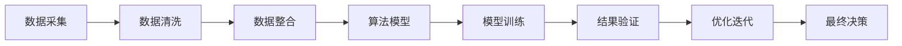

                 

## 1. 背景介绍

### 1.1 问题由来

随着科技的快速发展，现代社会面临的问题越来越复杂和多样化。从气候变化到全球疫情，从资源匮乏到社会不公，无一不需要集体智慧的助力才能解决。集体智慧（Collective Intelligence）是指通过整合多元化的知识、技能和资源，利用技术手段，形成强有力的解决问题的合力。在这一过程中，计算技术和人工智能（AI）发挥着至关重要的作用。

### 1.2 问题核心关键点

集体智慧的核心在于如何有效整合和利用分散的知识、数据和资源，形成决策支持和问题解决的最佳方案。这涉及到以下几个关键点：

- **数据采集与整合**：收集和整理来自不同来源的大量数据，消除数据孤岛。
- **算法模型构建**：设计高效的算法模型，以处理复杂问题。
- **人机协同**：将人类专家与AI算法结合起来，充分发挥各自优势。
- **结果验证与优化**：通过不断的验证和优化，确保最终决策的有效性和可靠性。

## 2. 核心概念与联系

### 2.1 核心概念概述

集体智慧的力量来源于数据的聚合、算法的融合和人的智慧。本文将重点介绍以下几个核心概念：

- **数据聚合**：通过各种技术和工具，从不同渠道收集、清洗、整合数据。
- **算法融合**：将多种算法模型结合，形成更强大的解决方案。
- **人机协同**：利用AI技术增强人类专家的决策能力。
- **结果验证与优化**：通过实验验证和持续优化，提升决策效果。

这些概念之间存在紧密的联系，共同构成了集体智慧的实施框架。

### 2.2 核心概念原理和架构的 Mermaid 流程图



这个流程图展示了从数据采集到最终决策的完整流程。其中，数据采集是基础，数据清洗和整合是前提，算法模型是核心，模型训练是过程，结果验证是关键，优化迭代是保障。最终决策则是对所有过程的集成和提升。

## 3. 核心算法原理 & 具体操作步骤

### 3.1 算法原理概述

集体智慧的算法构建通常基于以下三个步骤：

1. **数据预处理**：清洗和整合数据，消除噪声，提高数据质量。
2. **算法模型设计**：选择合适的算法模型，构建数据驱动的解决方案。
3. **模型训练与优化**：使用数据训练模型，通过优化提升模型效果。

### 3.2 算法步骤详解

#### 3.2.1 数据预处理

数据预处理是确保算法模型有效性的关键步骤。其主要任务包括：

- **数据清洗**：去除重复、缺失、错误的数据，确保数据质量。
- **特征工程**：提取有意义的特征，提高模型表现。
- **数据标准化**：将数据转换为统一的格式，便于算法处理。

#### 3.2.2 算法模型设计

算法模型设计是集体智慧的核心环节。常用的算法模型包括：

- **统计分析**：如回归分析、聚类分析等，用于揭示数据中的规律和模式。
- **机器学习**：如分类、回归、聚类、关联规则挖掘等，用于发现数据之间的关联。
- **深度学习**：如神经网络、卷积神经网络、循环神经网络等，用于处理复杂的非线性问题。

#### 3.2.3 模型训练与优化

模型训练与优化是提升算法效果的关键步骤。其流程通常包括：

- **模型选择**：根据问题特性选择合适的模型。
- **数据划分**：将数据分为训练集、验证集和测试集。
- **训练过程**：使用训练集训练模型，通过验证集调整模型参数。
- **模型评估**：在测试集上评估模型性能，选择最佳模型。

### 3.3 算法优缺点

#### 3.3.1 优点

- **自动化和高效性**：算法自动化处理数据和模型，提高效率。
- **可扩展性**：算法可以处理大规模数据和复杂问题。
- **结果可靠性**：通过模型训练和验证，保证结果的可靠性。

#### 3.3.2 缺点

- **数据依赖性**：算法的有效性依赖于数据的质量和数量。
- **模型复杂性**：复杂的算法模型可能需要较长的训练时间。
- **解释性不足**：部分算法模型的决策过程难以解释。

### 3.4 算法应用领域

集体智慧的算法广泛应用于多个领域，包括但不限于：

- **金融**：利用算法模型进行风险评估、投资分析等。
- **医疗**：利用算法模型进行疾病诊断、治疗方案推荐等。
- **能源**：利用算法模型进行能源消耗预测、优化调度等。
- **交通**：利用算法模型进行交通流量预测、优化路线等。

## 4. 数学模型和公式 & 详细讲解 & 举例说明

### 4.1 数学模型构建

集体智慧的数学模型构建通常基于数据驱动和统计学方法。以下以线性回归模型为例，介绍模型的构建过程：

设有一组数据集 $(x_i, y_i)$，其中 $x_i$ 为自变量，$y_i$ 为因变量。目标是找到线性回归模型 $y = \theta_0 + \theta_1 x$，使得模型能够最小化预测值与真实值之间的差距。

### 4.2 公式推导过程

线性回归模型的最小二乘法优化目标为：

$$
\min_{\theta} \sum_{i=1}^n (y_i - \theta_0 - \theta_1 x_i)^2
$$

使用梯度下降法求解上述优化问题，得到参数 $\theta$ 的更新公式为：

$$
\theta_0 \leftarrow \theta_0 - \frac{\alpha}{n} \sum_{i=1}^n (y_i - \theta_0 - \theta_1 x_i)
$$

$$
\theta_1 \leftarrow \theta_1 - \frac{\alpha}{n} \sum_{i=1}^n (y_i - \theta_0 - \theta_1 x_i)x_i
$$

其中 $\alpha$ 为学习率，控制参数更新的步长。

### 4.3 案例分析与讲解

假设有一组房屋销售数据，其中包含房屋面积 $x$ 和销售价格 $y$。通过线性回归模型，可以预测未来房屋的销售价格。具体步骤如下：

1. **数据收集**：收集历史房屋销售数据，包括房屋面积和销售价格。
2. **数据清洗**：去除异常值和缺失值，确保数据质量。
3. **特征提取**：提取房屋面积作为自变量 $x$。
4. **模型训练**：使用最小二乘法训练线性回归模型，得到模型参数 $\theta_0$ 和 $\theta_1$。
5. **结果预测**：使用训练好的模型对新房屋的面积进行预测，得到销售价格。

## 5. 项目实践：代码实例和详细解释说明

### 5.1 开发环境搭建

在开始项目实践前，需要搭建好开发环境。以下以Python和Pandas为例，介绍环境搭建流程：

1. 安装Python：从官网下载并安装Python，选择最新稳定的版本。
2. 安装Pandas：使用pip安装Pandas库，命令为 `pip install pandas`。
3. 配置环境变量：将Pandas库路径添加到系统环境变量中。
4. 测试安装：使用Python命令 `python -c "import pandas; print(pandas.__version__)"` 测试Pandas库的安装是否成功。

### 5.2 源代码详细实现

以下是一个简单的线性回归模型示例代码，展示数据处理和模型训练的过程：

```python
import pandas as pd
import numpy as np

# 读取数据集
data = pd.read_csv('house_prices.csv')

# 数据清洗
data = data.dropna()

# 特征提取
data['area'] = np.log(data['area'])

# 模型训练
from sklearn.linear_model import LinearRegression
model = LinearRegression()
X = data[['area']]
y = data['sale_price']
model.fit(X, y)

# 结果预测
new_data = pd.DataFrame({'area': [1200]})
new_data['area'] = np.log(new_data['area'])
prediction = model.predict(new_data)
print(prediction)
```

### 5.3 代码解读与分析

**数据处理**

- `data.read_csv('house_prices.csv')`：读取CSV格式的数据集。
- `data.dropna()`：删除包含缺失值的行，确保数据完整性。
- `data['area'] = np.log(data['area'])`：对房屋面积进行对数变换，提高模型性能。

**模型训练**

- `from sklearn.linear_model import LinearRegression`：导入线性回归模型。
- `model = LinearRegression()`：创建线性回归模型实例。
- `X = data[['area']]`：提取房屋面积作为自变量。
- `y = data['sale_price']`：提取销售价格作为因变量。
- `model.fit(X, y)`：使用最小二乘法训练模型。

**结果预测**

- `new_data = pd.DataFrame({'area': [1200]})`：创建新数据样本。
- `new_data['area'] = np.log(new_data['area'])`：对新数据进行对数变换。
- `prediction = model.predict(new_data)`：使用模型预测新数据。

## 6. 实际应用场景

### 6.1 智能交通管理

智能交通管理是集体智慧在实际应用中的典型案例。通过利用传感器数据、GPS数据、交通流量数据等，可以构建实时交通流量预测模型，优化交通信号灯控制，提高道路通行效率。

**具体实施步骤：**

1. **数据收集**：收集历史交通流量数据、车辆GPS数据、道路传感器数据等。
2. **数据清洗**：处理数据中的异常值和噪声。
3. **特征工程**：提取交通流量、时间、天气等特征。
4. **模型训练**：使用神经网络模型或时间序列模型训练交通流量预测模型。
5. **结果应用**：根据预测结果，动态调整交通信号灯，优化交通流量。

### 6.2 能源消耗预测

能源消耗预测是集体智慧在能源领域的重要应用。通过利用电力数据、气象数据、用户行为数据等，可以构建能源消耗预测模型，优化能源使用，降低能源浪费。

**具体实施步骤：**

1. **数据收集**：收集历史能源消耗数据、气象数据、用户行为数据等。
2. **数据清洗**：处理数据中的异常值和噪声。
3. **特征工程**：提取能源消耗、温度、湿度、用户行为等特征。
4. **模型训练**：使用时间序列模型或深度学习模型训练能源消耗预测模型。
5. **结果应用**：根据预测结果，调整能源使用策略，优化能源消耗。

### 6.3 疾病预测与防治

疾病预测与防治是集体智慧在医疗领域的重要应用。通过利用患者健康数据、环境数据、基因数据等，可以构建疾病预测模型，提前预警疾病风险，提供个性化治疗方案。

**具体实施步骤：**

1. **数据收集**：收集患者健康数据、环境数据、基因数据等。
2. **数据清洗**：处理数据中的异常值和噪声。
3. **特征工程**：提取患者健康指标、基因特征、环境因素等特征。
4. **模型训练**：使用机器学习模型或深度学习模型训练疾病预测模型。
5. **结果应用**：根据预测结果，提前预警疾病风险，提供个性化治疗方案。

## 7. 工具和资源推荐

### 7.1 学习资源推荐

为了帮助开发者系统掌握集体智慧的理论基础和实践技巧，这里推荐一些优质的学习资源：

1. **《集体智慧：协同创造》**：介绍集体智慧的概念、方法和应用案例。
2. **《Python数据科学手册》**：详细介绍Python在数据科学中的应用，包括数据处理、分析、可视化等。
3. **《机器学习实战》**：通过实际案例，讲解机器学习的基本原理和应用。
4. **Coursera课程《数据科学与机器学习》**：由斯坦福大学教授主讲，系统介绍数据科学和机器学习的基本概念和实践技巧。
5. **Kaggle竞赛**：参加数据科学和机器学习竞赛，通过实战提升技能。

通过对这些资源的学习实践，相信你一定能够快速掌握集体智慧的技术要点，并用于解决实际的复杂问题。

### 7.2 开发工具推荐

高效的开发离不开优秀的工具支持。以下是几款用于集体智慧项目开发的常用工具：

1. **Jupyter Notebook**：支持Python、R等多种编程语言，提供交互式编程环境，方便数据处理和模型训练。
2. **TensorFlow**：由Google主导开发的开源深度学习框架，生产部署方便，适合大规模工程应用。
3. **PyTorch**：基于Python的开源深度学习框架，灵活动态的计算图，适合快速迭代研究。
4. **Scikit-learn**：Python科学计算库，包含多种机器学习算法和工具。
5. **Pandas**：Python数据分析库，支持数据清洗、处理、分析等。
6. **Keras**：高层次的神经网络API，简单易用，适合快速搭建模型。

合理利用这些工具，可以显著提升集体智慧项目的开发效率，加快创新迭代的步伐。

### 7.3 相关论文推荐

集体智慧的研究源于学界的持续研究。以下是几篇奠基性的相关论文，推荐阅读：

1. **《集体智慧：协同创造的科学》**：Russell和Norvig的经典著作，介绍了集体智慧的基本概念和方法。
2. **《分布式人工智能》**：MIT教授Russell提出的分布式人工智能概念，探讨了多智能体系统在集体智慧中的应用。
3. **《机器学习：模型、算法与实践》**：Tom Mitchell的经典著作，介绍了机器学习的基本原理和应用案例。
4. **《深度学习》**：Goodfellow等人的经典著作，全面介绍了深度学习的基本原理和实践技巧。
5. **《分布式数据处理框架Hadoop》**：涉及大规模数据处理和分布式计算，为集体智慧的数据处理提供了技术基础。

这些论文代表了大规模人工智能与集体智慧的研究脉络。通过学习这些前沿成果，可以帮助研究者把握学科前进方向，激发更多的创新灵感。

## 8. 总结：未来发展趋势与挑战

### 8.1 总结

本文对集体智慧的概念、核心原理和实际应用进行了全面系统的介绍。首先阐述了集体智慧在解决复杂问题中的重要性，明确了数据、算法和人机协同在集体智慧中的关键作用。其次，从原理到实践，详细讲解了集体智慧的数学模型构建、算法步骤和代码实现，展示了集体智慧的落地应用。同时，本文还探讨了集体智慧在智能交通、能源消耗、疾病预测等实际场景中的应用前景，展示了其广阔的应用潜力。最后，本文精选了集体智慧的学习资源、开发工具和相关论文，力求为读者提供全方位的技术指引。

通过本文的系统梳理，可以看到，集体智慧在现代社会的应用前景广阔，能够有效地整合和利用分散的知识、数据和资源，形成强大的问题解决能力。未来，伴随技术的不断进步，集体智慧必将在更多领域发挥重要作用，为社会带来深刻的变革。

### 8.2 未来发展趋势

展望未来，集体智慧的发展趋势主要体现在以下几个方面：

1. **技术融合**：集体智慧将与其他人工智能技术（如自然语言处理、计算机视觉、深度学习等）进行更深入的融合，形成更强大的综合解决方案。
2. **数据驱动**：随着数据量的不断增长和数据处理技术的进步，数据驱动的决策和问题解决能力将进一步提升。
3. **人机协同**：人机协同的智能系统将变得更加智能和高效，能够更好地发挥人类专家的知识和AI算法的能力。
4. **边缘计算**：随着物联网的发展，边缘计算将成为集体智慧的重要基础设施，提升实时数据处理和决策能力。
5. **安全保障**：随着数据量的增加和应用场景的复杂化，数据隐私和安全问题将更加重要，需要更多的技术手段保障数据安全。

### 8.3 面临的挑战

尽管集体智慧技术已经取得了一定的成果，但在实际应用中仍面临诸多挑战：

1. **数据质量**：数据的质量直接影响集体智慧的效果，数据收集和清洗是重要的前置步骤。
2. **算法复杂性**：部分算法模型的复杂性较高，需要更多的计算资源和时间。
3. **结果解释性**：部分集体智慧的决策过程难以解释，影响用户信任度。
4. **隐私保护**：在数据驱动的决策过程中，隐私保护问题日益凸显，需要更多的技术手段保障数据安全。
5. **模型鲁棒性**：模型需要具备更好的鲁棒性，能够在不同的数据分布和应用场景中保持稳定表现。

### 8.4 研究展望

未来的研究需要在以下几个方面进行深入探索：

1. **数据治理**：探索如何有效地管理和治理数据，确保数据质量和安全。
2. **算法优化**：开发更高效、更可解释的算法模型，提升集体智慧的效果和用户信任度。
3. **人机协同**：探索如何更好地结合人类专家的知识和AI算法，提升决策的科学性和准确性。
4. **跨领域应用**：探索集体智慧在不同领域的应用，推动其向更广阔的领域扩展。
5. **伦理道德**：研究如何在集体智慧中融入伦理道德约束，确保其应用的公平性和透明性。

这些研究方向将引领集体智慧技术的发展，为解决复杂的社会问题提供更强大的技术支持。面向未来，集体智慧的研究需要跨学科的协同合作，形成更加全面和系统的解决方案。

## 9. 附录：常见问题与解答

**Q1: 集体智慧是否只适用于大型企业和研究机构？**

A: 集体智慧不仅适用于大型企业和研究机构，中小企业和个人开发者也可以利用其解决实际问题。只要有数据和问题，就可以构建集体智慧系统，提升问题解决能力。

**Q2: 数据预处理的重要性体现在哪些方面？**

A: 数据预处理是确保算法模型效果的重要环节，主要体现在：

1. **数据质量提升**：通过清洗和标准化，去除噪声和异常值，提高数据质量。
2. **特征工程优化**：通过特征提取和变换，提取有意义的特征，提高模型性能。
3. **数据一致性保障**：通过统一数据格式，确保数据一致性，便于算法处理。

**Q3: 为什么选择Pandas进行数据处理？**

A: Pandas是一个高效、易用的Python数据分析库，具有以下优势：

1. **数据处理能力强**：支持数据清洗、处理、分析和可视化等操作，方便数据预处理。
2. **易用性强**：API简单易用，适合初学者和经验丰富的开发者。
3. **扩展性强**：社区活跃，有丰富的扩展模块和工具，方便扩展和定制。

**Q4: 如何确保数据隐私和安全？**

A: 数据隐私和安全是集体智慧应用中的重要问题，可以采取以下措施：

1. **数据脱敏**：对敏感数据进行脱敏处理，保护用户隐私。
2. **访问控制**：设置严格的访问控制机制，确保数据安全。
3. **加密传输**：使用加密技术保护数据在传输过程中的安全。
4. **审计和监控**：建立数据审计和监控机制，实时检测数据安全问题。

**Q5: 如何评估集体智慧模型的效果？**

A: 评估集体智慧模型的效果可以从以下几个方面进行：

1. **准确率**：模型预测结果与真实结果的一致性。
2. **召回率**：模型能够发现真实结果的能力。
3. **F1分数**：综合准确率和召回率，评估模型整体性能。
4. **AUC曲线**：绘制模型在不同阈值下的ROC曲线，评估模型区分度。
5. **时间效率**：模型训练和推理的时间成本。

---

作者：禅与计算机程序设计艺术 / Zen and the Art of Computer Programming

