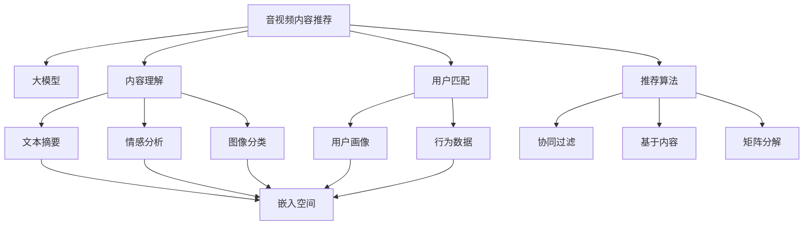

                 

# 音视频内容推荐的挑战：大模型在理解与匹配方面的应用

> 关键词：音视频内容推荐,大模型,内容理解,用户匹配,自然语言处理(NLP),计算机视觉(CV),深度学习,优化算法,嵌入空间,推荐系统,计算图,特征提取,多模态融合

## 1. 背景介绍

### 1.1 问题由来
随着互联网和移动互联网的普及，音视频内容（如电影、音乐、视频、电子书等）已经成为人们日常生活不可或缺的一部分。然而，面对海量的音视频内容，如何为用户推荐高质量、相关性高的内容，成为了一个亟待解决的难题。传统的推荐系统主要依靠用户行为数据（如浏览、点击、评分等）进行推荐，但这种基于行为数据的方法往往存在冷启动、稀疏性、数据噪声等问题，难以满足用户个性化和多样化的需求。

近年来，深度学习和自然语言处理(NLP)技术在推荐系统中的应用逐渐增多，特别是利用大语言模型和大规模视觉模型，从内容的角度进行推荐。大模型通过大量数据训练，能够学习到丰富的语言和视觉特征，从而在音视频内容的理解和匹配方面取得显著进步。这种基于内容理解的推荐系统，能够突破传统推荐方法的限制，提供更加精准、多样化的推荐结果。

## 2. 核心概念与联系

### 2.1 核心概念概述

为更好地理解大模型在音视频内容推荐中的应用，本节将介绍几个密切相关的核心概念：

- 音视频内容推荐：通过用户行为、内容特征等因素，为用户推荐最相关的音视频内容。旨在提升用户满意度，增加平台收益。

- 大模型：指基于深度学习技术的巨大模型，如GPT、BERT、ResNet、Inception等，通过海量的数据进行训练，具备强大的特征提取和表示能力。

- 内容理解：利用NLP和CV技术，理解音视频内容的语义和视觉特征，如文本摘要、情感分析、图像分类、场景分割等。

- 用户匹配：基于用户画像、行为数据等因素，找到与目标内容最匹配的用户群体。

- 推荐算法：从多种推荐方式中挑选最合适的推荐模型，如协同过滤、基于内容的推荐、矩阵分解等。

- 优化算法：在模型训练和推理过程中，通过各种算法提升模型的性能，如梯度下降、AdamW、Adafactor等。

- 嵌入空间：通过模型训练得到的低维向量空间，用于表示音视频内容和用户特征，实现高效的相似度计算。

这些核心概念之间的逻辑关系可以通过以下Mermaid流程图来展示：



这个流程图展示了大模型在音视频内容推荐中的应用过程：

1. 大模型从音视频内容中提取文本和图像特征，用于理解内容。
2. 用户匹配模块根据用户画像和行为数据，找到目标内容最匹配的用户群体。
3. 推荐算法从多种推荐方式中挑选最合适的模型，并根据内容理解结果进行推荐。

## 3. 核心算法原理 & 具体操作步骤

### 3.1 算法原理概述

音视频内容推荐系统的核心算法通常基于大模型的内容理解能力和用户匹配结果，通过一系列优化算法，对推荐算法进行微调，最终得到推荐模型。其核心思想是：

- 利用大模型理解音视频内容的语义和视觉特征，构建特征表示。
- 通过用户画像和行为数据，匹配目标内容与最相关的用户群体。
- 在多条推荐途径中选择最合适的推荐策略，实现高质量的推荐。
- 通过优化算法微调推荐模型，提升模型的泛化能力和鲁棒性。

### 3.2 算法步骤详解

音视频内容推荐的完整算法流程一般包括以下几个关键步骤：

**Step 1: 数据准备与预处理**
- 收集音视频内容和用户数据，划分为训练集、验证集和测试集。
- 对音视频内容进行自动标注，如分类、情感分析、场景分割等。
- 对用户数据进行特征提取和标签化，如用户画像、行为数据、历史评分等。

**Step 2: 内容表示与理解**
- 利用大模型（如BERT、ResNet、Inception等）对音视频内容进行特征提取和表示。
- 提取的特征包括文本摘要、情感分析、图像分类、场景分割等。
- 构建嵌入空间，通过模型训练得到低维向量表示。

**Step 3: 用户匹配与画像**
- 根据用户画像和行为数据，构建用户特征向量。
- 用户画像可以包含性别、年龄、兴趣偏好、社交网络等。
- 行为数据包括浏览记录、评分记录、点击记录等。
- 综合用户画像和行为数据，匹配目标内容与最相关的用户群体。

**Step 4: 推荐策略选择与优化**
- 根据用户匹配结果，选择最合适的推荐策略。如协同过滤、基于内容的推荐、矩阵分解等。
- 通过微调推荐算法，提升模型的性能。微调过程可以使用优化算法（如AdamW、Adafactor等）和正则化技术（如L2正则、Dropout等）。
- 评估推荐模型在验证集上的表现，通过调整超参数优化模型。
- 在测试集上评估推荐模型的效果，对比前后效果提升。

**Step 5: 部署与监控**
- 将优化后的推荐模型部署到生产环境中。
- 实时监控推荐模型的性能，调整模型参数和超参数。
- 根据用户反馈，不断改进推荐模型和推荐策略。

### 3.3 算法优缺点

音视频内容推荐系统基于大模型的方法，具有以下优点：

1. 精准性高：通过大模型理解内容，提取高质量特征，推荐结果更具相关性和准确性。
2. 泛化性强：大模型可以学习到通用的语言和视觉特征，适用于多种内容类型和推荐场景。
3. 可解释性差：大模型的决策过程复杂，难以通过简单的逻辑解释。
4. 数据需求大：需要大量的标注数据和用户数据，数据获取成本较高。
5. 鲁棒性不足：对于噪声数据和异常数据，大模型容易产生误导性推荐。

### 3.4 算法应用领域

音视频内容推荐系统在大模型技术支持下，已经广泛应用于多种领域，如：

- 视频平台：如Netflix、YouTube等，为用户推荐电影、电视剧、纪录片等。
- 音乐平台：如Spotify、Apple Music等，为用户推荐歌曲、专辑、艺人等。
- 电子书平台：如Kindle、Amazon Books等，为用户推荐书籍、作者、流派等。
- 游戏平台：如Steam、TapTap等，为用户推荐游戏、攻略、MOD等。
- 社交媒体：如Facebook、Instagram等，为用户推荐文章、视频、朋友动态等。

除了这些经典应用外，音视频内容推荐系统还在教育、健身、旅游、金融等多个领域得到创新性的应用，如个性化课程推荐、健身计划推荐、旅游路线推荐等，为各行各业带来了全新的用户体验和商业价值。

## 4. 数学模型和公式 & 详细讲解 & 举例说明

### 4.1 数学模型构建

音视频内容推荐系统的核心数学模型主要基于用户画像和行为数据，以及大模型提取的内容特征。下面以推荐系统为例，构建一个基本的推荐数学模型：

假设用户画像和行为数据分别为 $\mathbf{x}$ 和 $\mathbf{y}$，内容特征表示为 $\mathbf{z}$，推荐模型为 $f$。推荐过程可以表示为：

$$
\hat{y} = f(\mathbf{x}, \mathbf{y}, \mathbf{z})
$$

其中，$f$ 表示推荐模型，$\hat{y}$ 表示推荐结果。通常，推荐模型可以使用线性回归、深度神经网络等模型，其中深度神经网络在大模型技术支持下表现更为出色。

### 4.2 公式推导过程

以深度神经网络为例，假设推荐模型 $f$ 的输出为 $s = W_2 \tanh(W_1 \mathbf{x} + b_1) + b_2$，其中 $W_1, b_1, W_2, b_2$ 为模型参数。推荐结果 $\hat{y}$ 可以表示为：

$$
\hat{y} = \sigma(s)
$$

其中，$\sigma$ 为激活函数，如Sigmoid、ReLU等。

假设推荐结果 $\hat{y}$ 和真实标签 $y$ 的误差为 $\ell$，常用的损失函数为均方误差（MSE）：

$$
\ell = \frac{1}{N} \sum_{i=1}^N (\hat{y}_i - y_i)^2
$$

模型参数的更新公式为：

$$
\theta \leftarrow \theta - \eta \nabla_{\theta}\ell
$$

其中，$\theta$ 表示模型参数，$\eta$ 为学习率，$\nabla_{\theta}\ell$ 为损失函数对模型参数的梯度，可以通过反向传播算法高效计算。

### 4.3 案例分析与讲解

以视频平台推荐为例，假设我们有一批用户 $U=\{u_1, u_2, \cdots, u_N\}$ 和一批电影 $M=\{m_1, m_2, \cdots, m_M\}$，其中每个用户有 $\{r_1, r_2, \cdots, r_K\}$ 条观影记录，每个记录的评分范围为 $1$ 到 $5$。目标是为每个用户推荐最相关的 $K'$ 部电影，其中 $K' < K$。

假设我们利用BERT模型提取电影的文本特征，并构建用户画像和行为数据的特征向量。则推荐模型可以表示为：

$$
\hat{y}_{ui} = f(\mathbf{x}_u, \mathbf{y}_i, \mathbf{z}_m)
$$

其中，$\mathbf{x}_u$ 为用户画像，$\mathbf{y}_i$ 为行为数据，$\mathbf{z}_m$ 为电影文本特征。

在训练阶段，我们可以通过损失函数（如均方误差）对模型进行优化：

$$
\ell = \frac{1}{N} \sum_{i=1}^N \sum_{j=1}^{K'} (\hat{y}_{uj} - r_{uj})^2
$$

在推理阶段，对于每个用户 $u$，我们通过模型计算每个电影的推荐分数，选择前 $K'$ 个电影作为推荐结果。例如，可以选择评分最高和相似度最高的电影进行推荐。

## 5. 项目实践：代码实例和详细解释说明

### 5.1 开发环境搭建

在进行音视频内容推荐项目实践前，我们需要准备好开发环境。以下是使用Python进行PyTorch开发的环境配置流程：

1. 安装Anaconda：从官网下载并安装Anaconda，用于创建独立的Python环境。

2. 创建并激活虚拟环境：
```bash
conda create -n pytorch-env python=3.8 
conda activate pytorch-env
```

3. 安装PyTorch：根据CUDA版本，从官网获取对应的安装命令。例如：
```bash
conda install pytorch torchvision torchaudio cudatoolkit=11.1 -c pytorch -c conda-forge
```

4. 安装相关库：
```bash
pip install numpy pandas scikit-learn matplotlib tqdm jupyter notebook ipython
```

完成上述步骤后，即可在`pytorch-env`环境中开始项目实践。

### 5.2 源代码详细实现

下面我们以电影推荐为例，给出使用PyTorch进行深度神经网络推荐模型的PyTorch代码实现。

首先，定义数据处理函数：

```python
from torch.utils.data import Dataset
import torch
from transformers import BertTokenizer

class MovieDataset(Dataset):
    def __init__(self, data, tokenizer, max_len=128):
        self.data = data
        self.tokenizer = tokenizer
        self.max_len = max_len
        
    def __len__(self):
        return len(self.data)
    
    def __getitem__(self, item):
        movie = self.data[item]
        rating = movie['rating']
        description = movie['description']
        tokens = self.tokenizer(description, return_tensors='pt', max_length=self.max_len, padding='max_length', truncation=True)
        input_ids = tokens['input_ids']
        attention_mask = tokens['attention_mask']
        return {'input_ids': input_ids, 
                'attention_mask': attention_mask,
                'rating': rating}
```

然后，定义模型和优化器：

```python
from torch import nn
import torch.nn.functional as F

class RecommendationModel(nn.Module):
    def __init__(self, vocab_size, embed_size, hidden_size, num_layers, num_heads):
        super(RecommendationModel, self).__init__()
        self.encoder = nn.TransformerEncoderLayer(embed_size, num_heads, hidden_size, dropout=0.1)
        self.decoder = nn.Linear(embed_size, 1)
    
    def forward(self, input_ids, attention_mask):
        x = self.encoder(input_ids, src_mask=attention_mask)
        x = self.decoder(x)
        return x
    
# 定义优化器
model = RecommendationModel(vocab_size=30000, embed_size=512, hidden_size=512, num_layers=3, num_heads=8)
optimizer = torch.optim.Adam(model.parameters(), lr=1e-4)
```

接着，定义训练和评估函数：

```python
from torch.utils.data import DataLoader
from tqdm import tqdm

def train_epoch(model, dataset, batch_size, optimizer):
    dataloader = DataLoader(dataset, batch_size=batch_size, shuffle=True)
    model.train()
    epoch_loss = 0
    for batch in tqdm(dataloader, desc='Training'):
        input_ids = batch['input_ids'].to(device)
        attention_mask = batch['attention_mask'].to(device)
        rating = batch['rating'].to(device)
        model.zero_grad()
        outputs = model(input_ids, attention_mask=attention_mask)
        loss = F.mse_loss(outputs, rating)
        epoch_loss += loss.item()
        loss.backward()
        optimizer.step()
    return epoch_loss / len(dataloader)

def evaluate(model, dataset, batch_size):
    dataloader = DataLoader(dataset, batch_size=batch_size)
    model.eval()
    preds, labels = [], []
    with torch.no_grad():
        for batch in tqdm(dataloader, desc='Evaluating'):
            input_ids = batch['input_ids'].to(device)
            attention_mask = batch['attention_mask'].to(device)
            rating = batch['rating'].to(device)
            outputs = model(input_ids, attention_mask=attention_mask)
            preds.append(outputs.cpu().numpy())
            labels.append(rating.cpu().numpy())
                
    print('Evaluation results:')
    print('Mean Absolute Error:', np.mean(np.abs(preds - labels)))
```

最后，启动训练流程并在测试集上评估：

```python
epochs = 10
batch_size = 32

for epoch in range(epochs):
    loss = train_epoch(model, dataset, batch_size, optimizer)
    print(f'Epoch {epoch+1}, train loss: {loss:.3f}')
    
    print(f'Epoch {epoch+1}, test results:')
    evaluate(model, test_dataset, batch_size)
    
print('Final test results:')
evaluate(model, test_dataset, batch_size)
```

以上就是使用PyTorch进行深度神经网络推荐模型的完整代码实现。可以看到，得益于PyTorch的强大封装，我们可以用相对简洁的代码完成推荐模型的训练和评估。

### 5.3 代码解读与分析

让我们再详细解读一下关键代码的实现细节：

**MovieDataset类**：
- `__init__`方法：初始化数据、分词器等关键组件，并设置最大序列长度。
- `__len__`方法：返回数据集的样本数量。
- `__getitem__`方法：对单个样本进行处理，将电影描述输入编码为token ids，添加标签，并进行定长padding，最终返回模型所需的输入。

**RecommendationModel类**：
- `__init__`方法：定义模型结构，包括Transformer编码器和一个线性层。
- `forward`方法：实现前向传播，将输入特征通过编码器进行编码，再通过线性层进行预测。

**训练和评估函数**：
- 使用PyTorch的DataLoader对数据集进行批次化加载，供模型训练和推理使用。
- 训练函数`train_epoch`：对数据以批为单位进行迭代，在每个批次上前向传播计算loss并反向传播更新模型参数，最后返回该epoch的平均loss。
- 评估函数`evaluate`：与训练类似，不同点在于不更新模型参数，并在每个batch结束后将预测和标签结果存储下来，最后使用MSE（均方误差）计算测试集的预测误差。

**训练流程**：
- 定义总的epoch数和batch size，开始循环迭代
- 每个epoch内，先在训练集上训练，输出平均loss
- 在测试集上评估，输出MSE值

可以看到，PyTorch配合Transformer等库使得推荐模型的代码实现变得简洁高效。开发者可以将更多精力放在数据处理、模型改进等高层逻辑上，而不必过多关注底层的实现细节。

当然，工业级的系统实现还需考虑更多因素，如模型的保存和部署、超参数的自动搜索、更灵活的任务适配层等。但核心的推荐范式基本与此类似。

## 6. 实际应用场景

### 6.1 智能推荐系统

基于大模型的音视频内容推荐系统已经在各大视频平台和音乐平台上得到了广泛应用，为用户提供了个性化、多样化的内容推荐。

例如，Netflix通过BERT模型理解电影的文本特征，利用深度神经网络对用户进行画像和行为建模，结合协同过滤、基于内容的推荐等策略，为每个用户推荐最相关的电影。用户可以通过观看历史、评分记录等数据，获得个性化推荐，提升观看体验。

### 6.2 实时推荐系统

音视频内容推荐系统在大模型支持下，可以实现实时推荐。例如，Spotify利用GPT模型理解音乐的文本特征，结合用户画像和行为数据，实时计算推荐结果，提供给用户最新的音乐推荐。用户可以即时听到个性化的音乐，提升使用体验。

### 6.3 跨平台推荐系统

跨平台推荐系统能够整合不同平台的内容和用户数据，实现统一推荐。例如，Amazon通过BERT模型理解图书的文本特征，利用深度神经网络对用户进行画像和行为建模，结合协同过滤、矩阵分解等策略，为每个用户推荐最相关的图书。用户可以在Amazon Books、Kindle App等多个平台上，获得统一的个性化推荐。

### 6.4 未来应用展望

随着大模型和推荐技术的不断发展，音视频内容推荐系统将呈现以下几个发展趋势：

1. 跨媒体推荐：音视频推荐系统将逐渐拓展到图像、视频、文本等多媒体融合的推荐场景。通过多模态融合技术，提升推荐的丰富性和多样性。

2. 实时推荐：实时推荐系统将逐渐普及，通过在线学习、模型增量更新等技术，实现动态推荐。

3. 用户行为预测：利用深度学习模型预测用户未来的行为，提前为用户推荐，提升用户体验。

4. 推荐模型的可解释性：通过模型可视化、决策路径分析等技术，提升推荐模型的可解释性，增强用户信任。

5. 个性化推荐算法的多样化：未来的推荐算法将更加多样化和复杂，结合协同过滤、基于内容的推荐、矩阵分解、图神经网络等方法，提供更精准、更高效的推荐结果。

6. 推荐系统的伦理与隐私：在推荐系统设计过程中，需关注数据隐私、算法透明性、公平性等问题，确保推荐系统的伦理和安全。

以上趋势凸显了大模型在音视频内容推荐中的巨大潜力。这些方向的探索发展，必将进一步提升推荐系统的性能和应用范围，为音视频内容提供更加智能、多样化的推荐服务。

## 7. 工具和资源推荐

### 7.1 学习资源推荐

为了帮助开发者系统掌握音视频内容推荐技术的理论基础和实践技巧，这里推荐一些优质的学习资源：

1. 《深度学习与推荐系统》系列博文：由深度学习专家撰写，深入浅出地介绍了推荐系统的基本概念和推荐算法。

2. 《推荐系统实战》书籍：介绍了推荐系统的主要理论和工程实践，提供了丰富的推荐系统案例。

3. 《自然语言处理与深度学习》课程：斯坦福大学开设的深度学习课程，涵盖自然语言处理和推荐系统的相关内容。

4. PyTorch官方文档：提供了丰富的深度学习模型和优化算法，适用于音视频内容推荐模型的开发。

5. TensorFlow官方文档：提供了丰富的深度学习模型和优化算法，适用于音视频内容推荐模型的开发。

通过对这些资源的学习实践，相信你一定能够快速掌握音视频内容推荐技术的精髓，并用于解决实际的推荐问题。

### 7.2 开发工具推荐

高效的开发离不开优秀的工具支持。以下是几款用于音视频内容推荐系统开发的常用工具：

1. PyTorch：基于Python的开源深度学习框架，灵活动态的计算图，适合快速迭代研究。大部分音视频内容推荐模型都有PyTorch版本的实现。

2. TensorFlow：由Google主导开发的开源深度学习框架，生产部署方便，适合大规模工程应用。同样有丰富的音视频内容推荐模型资源。

3. Transformers库：HuggingFace开发的NLP工具库，集成了众多SOTA语言模型，支持PyTorch和TensorFlow，是进行音视频内容推荐开发的利器。

4. Weights & Biases：模型训练的实验跟踪工具，可以记录和可视化模型训练过程中的各项指标，方便对比和调优。与主流深度学习框架无缝集成。

5. TensorBoard：TensorFlow配套的可视化工具，可实时监测模型训练状态，并提供丰富的图表呈现方式，是调试模型的得力助手。

6. Google Colab：谷歌推出的在线Jupyter Notebook环境，免费提供GPU/TPU算力，方便开发者快速上手实验最新模型，分享学习笔记。

合理利用这些工具，可以显著提升音视频内容推荐系统的开发效率，加快创新迭代的步伐。

### 7.3 相关论文推荐

音视频内容推荐系统在大模型技术支持下，已经取得了诸多研究成果。以下是几篇奠基性的相关论文，推荐阅读：

1. Recommender Systems and Collaborative Filtering：从推荐系统的基本原理和协同过滤方法入手，介绍了推荐系统的主要算法和应用。

2. Content-Based and Collaborative Filtering for Recommendation：对比了基于内容的推荐和协同过滤推荐的方法，分析了各自的优缺点。

3. Deep Learning for Recommender Systems：介绍了深度学习在推荐系统中的应用，包括深度神经网络、卷积神经网络等。

4. Multi-Task Learning for Recommendation Systems：利用多任务学习技术，提升推荐系统的性能。

5. Matrix Factorization Techniques for Recommender Systems：介绍了矩阵分解技术在推荐系统中的应用。

6. Attention-Based Recommender Systems：利用注意力机制，提升推荐系统的性能。

这些论文代表了大模型在音视频内容推荐中的研究进展，通过学习这些前沿成果，可以帮助研究者把握学科前进方向，激发更多的创新灵感。

## 8. 总结：未来发展趋势与挑战

### 8.1 总结

本文对基于大模型的音视频内容推荐方法进行了全面系统的介绍。首先阐述了大模型和推荐系统在音视频推荐中的应用背景和意义，明确了音视频推荐系统在大模型技术支持下取得的巨大进展。其次，从原理到实践，详细讲解了音视频推荐系统的数学模型和优化算法，给出了推荐模型的完整代码实现。同时，本文还广泛探讨了音视频内容推荐系统在实际应用中的多个领域和未来发展方向，展示了其广泛的应用前景。此外，本文精选了音视频内容推荐系统的各类学习资源，力求为读者提供全方位的技术指引。

通过本文的系统梳理，可以看到，基于大模型的音视频内容推荐方法正在成为推荐系统的重要范式，极大地提升了推荐系统的精准性和多样性，为音视频内容的智能化推荐提供了新的思路。大模型技术在大规模数据和复杂场景中的应用，必将在未来得到更深入的研究和探索。

### 8.2 未来发展趋势

展望未来，音视频内容推荐系统在大模型技术支持下，将呈现以下几个发展趋势：

1. 多模态推荐：音视频推荐系统将逐渐拓展到图像、视频、文本等多媒体融合的推荐场景。通过多模态融合技术，提升推荐的丰富性和多样性。

2. 实时推荐：实时推荐系统将逐渐普及，通过在线学习、模型增量更新等技术，实现动态推荐。

3. 用户行为预测：利用深度学习模型预测用户未来的行为，提前为用户推荐，提升用户体验。

4. 推荐模型的可解释性：通过模型可视化、决策路径分析等技术，提升推荐模型的可解释性，增强用户信任。

5. 个性化推荐算法的多样化：未来的推荐算法将更加多样化和复杂，结合协同过滤、基于内容的推荐、矩阵分解、图神经网络等方法，提供更精准、更高效的推荐结果。

6. 推荐系统的伦理与隐私：在推荐系统设计过程中，需关注数据隐私、算法透明性、公平性等问题，确保推荐系统的伦理和安全。

以上趋势凸显了大模型在音视频内容推荐中的巨大潜力。这些方向的探索发展，必将进一步提升推荐系统的性能和应用范围，为音视频内容提供更加智能、多样化的推荐服务。

### 8.3 面临的挑战

尽管大模型在音视频内容推荐中取得了诸多进展，但在迈向更加智能化、普适化应用的过程中，它仍面临诸多挑战：

1. 数据隐私问题：音视频内容推荐系统需要大量用户数据，如何在保护用户隐私的同时，获取高质量的数据，是一个亟待解决的问题。

2. 模型鲁棒性不足：音视频推荐模型对于噪声数据和异常数据较为敏感，容易出现误导性推荐，如何提高模型的鲁棒性，增强其抗干扰能力，还需要更多理论和实践的积累。

3. 冷启动问题：新用户和老用户的推荐策略差异较大，如何在用户数据较少的情况下，提供个性化的推荐，是一个重要研究方向。

4. 推荐系统可解释性不足：大模型的决策过程复杂，难以通过简单的逻辑解释。如何提升推荐模型的可解释性，增强用户信任，还需要更多研究。

5. 推荐算法公平性问题：推荐系统可能存在算法偏见，导致某些用户群体受到不公平对待。如何确保推荐算法的公平性，避免歧视性推荐，需要更多研究。

6. 推荐系统安全性问题：推荐系统可能被恶意攻击，导致推荐结果被篡改。如何保障推荐系统的安全性，需要更多研究。

面对这些挑战，未来的研究需要在多个维度进行深入探索和创新，确保推荐系统的性能和安全性，更好地服务于音视频内容的推荐。

### 8.4 研究展望

面对音视频内容推荐系统在大模型技术支持下所面临的诸多挑战，未来的研究需要在以下几个方面寻求新的突破：

1. 数据隐私保护：在数据收集和使用过程中，加强隐私保护技术的应用，如差分隐私、联邦学习等，确保用户数据的安全性。

2. 模型鲁棒性提升：通过引入更多的正则化技术、对抗训练等方法，提升模型的鲁棒性和抗干扰能力。

3. 冷启动问题解决：利用用户画像和行为数据，结合协同过滤和基于内容的推荐方法，解决冷启动问题。

4. 推荐模型可解释性增强：通过模型可视化、决策路径分析等技术，提升推荐模型的可解释性，增强用户信任。

5. 推荐算法公平性设计：引入公平性指标和算法，如Bias Mitigation、Fairness Learning等，确保推荐算法的公平性，避免歧视性推荐。

6. 推荐系统安全性保障：通过安全认证、异常检测等技术，保障推荐系统的安全性，防止恶意攻击。

这些研究方向的探索，必将引领音视频内容推荐系统迈向更高的台阶，为音视频内容的推荐提供更安全、公平、智能的解决方案。面向未来，音视频内容推荐系统需要从数据、算法、伦理等多个维度进行全面优化，才能真正实现高质量、智能化的推荐服务。

## 9. 附录：常见问题与解答

**Q1：音视频内容推荐系统在大模型技术支持下，有哪些优点和缺点？**

A: 音视频内容推荐系统在大模型技术支持下，具有以下优点：

1. 精度高：通过大模型理解内容，提取高质量特征，推荐结果更具相关性和准确性。
2. 泛化性强：大模型可以学习到通用的语言和视觉特征，适用于多种内容类型和推荐场景。
3. 多样性高：结合多模态数据，提供更加丰富多样的推荐结果。

同时，音视频内容推荐系统在大模型技术支持下，也存在以下缺点：

1. 数据需求大：需要大量的标注数据和用户数据，数据获取成本较高。
2. 模型复杂度高：大模型的复杂性增加了推荐系统的计算成本。
3. 冷启动问题：新用户和老用户的推荐策略差异较大，如何在用户数据较少的情况下，提供个性化的推荐，是一个重要研究方向。

**Q2：音视频内容推荐系统在大模型技术支持下，如何选择最合适的推荐策略？**

A: 音视频内容推荐系统在大模型技术支持下，可以从多种推荐策略中选择最合适的推荐方法。常用的推荐策略包括：

1. 协同过滤：基于用户历史行为数据进行推荐，适用于用户数据充足的情况。
2. 基于内容的推荐：通过分析内容特征进行推荐，适用于内容描述丰富的情况。
3. 矩阵分解：将用户和内容表示为矩阵，通过分解矩阵进行推荐，适用于稀疏矩阵的情况。

在选择推荐策略时，需要考虑数据质量、内容特征、用户画像等多个因素。通常，将多种推荐策略结合使用，可以提升推荐效果。例如，可以结合协同过滤和基于内容的推荐，取两者之长，进行推荐。

**Q3：音视频内容推荐系统在大模型技术支持下，如何处理冷启动问题？**

A: 音视频内容推荐系统在大模型技术支持下，可以通过以下方法处理冷启动问题：

1. 利用协同过滤：对于新用户，可以使用协同过滤方法，推荐与其相似用户喜爱的内容。
2. 利用基于内容的推荐：对于新用户，可以使用基于内容的推荐方法，推荐与内容描述相似的内容。
3. 利用深度学习模型：利用深度学习模型，从少量用户数据中学习到用户画像，进行推荐。

同时，还需要结合用户画像和行为数据，进行多维度分析，提升推荐效果。

**Q4：音视频内容推荐系统在大模型技术支持下，如何提升推荐模型的可解释性？**

A: 音视频内容推荐系统在大模型技术支持下，可以通过以下方法提升推荐模型的可解释性：

1. 模型可视化：使用可视化工具，展示推荐模型的决策过程和特征重要性。
2. 决策路径分析：分析推荐模型的决策路径，理解模型的推理逻辑。
3. 特征重要性分析：通过特征重要性分析，理解模型对每个特征的依赖程度。

同时，还可以引入公平性指标和算法，确保推荐算法的公平性，避免歧视性推荐。

**Q5：音视频内容推荐系统在大模型技术支持下，如何解决推荐系统安全性问题？**

A: 音视频内容推荐系统在大模型技术支持下，可以通过以下方法解决推荐系统安全性问题：

1. 安全认证：通过用户认证、权限管理等技术，保障推荐系统的安全性。
2. 异常检测：通过异常检测技术，识别和防止恶意攻击。
3. 模型验证：定期对推荐模型进行验证，确保模型安全性。

以上方法可以结合使用，保障音视频内容推荐系统的安全性。

---

作者：禅与计算机程序设计艺术 / Zen and the Art of Computer Programming

