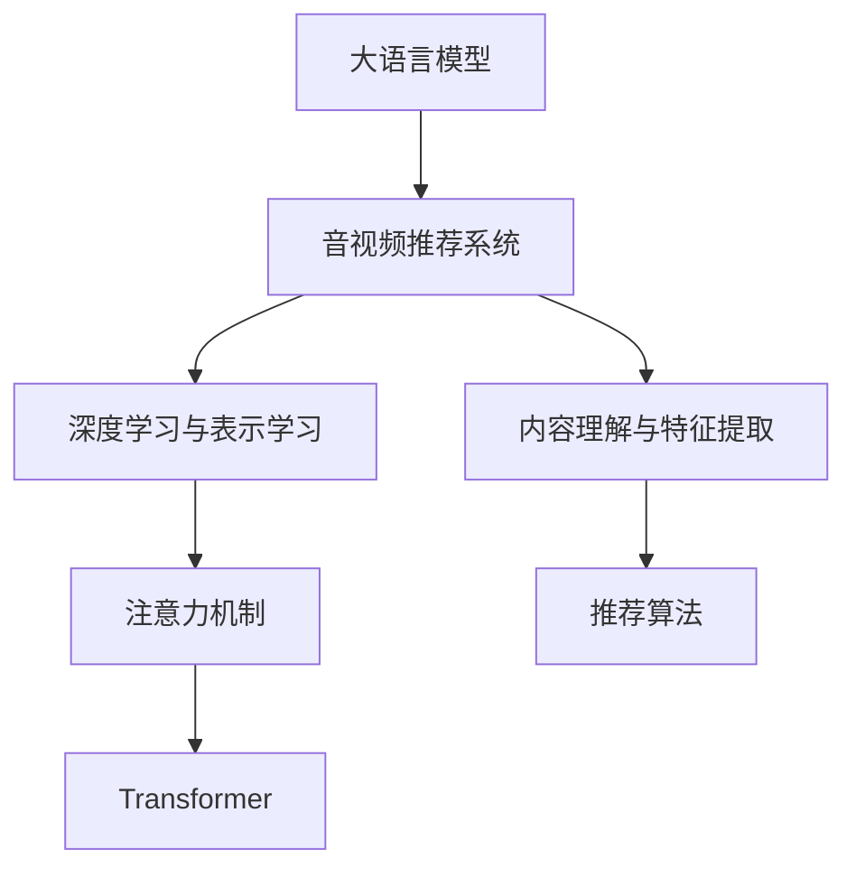

                 

# 音视频内容推荐：大模型在理解与匹配方面的优势

## 1. 背景介绍

### 1.1 问题由来
随着互联网的快速发展，音视频内容呈爆炸式增长，用户面临信息过载的困境。如何为用户推荐感兴趣的音视频内容，成为各大平台的核心竞争力之一。传统的推荐系统依赖于用户行为数据和统计模型，难以理解内容的多维度特征和复杂语义关系。近年来，大语言模型在自然语言理解和语义表示上取得了突破，使得基于模型的推荐系统有望在理解音视频内容方面取得新进展。

### 1.2 问题核心关键点
音视频内容推荐的核心在于如何构建高维语义空间，以高维度表示音视频的多样特征，从而实现对内容的深入理解。相较于传统的基于统计特征的推荐算法，基于大模型的推荐系统可以利用语言知识捕捉更加丰富和深入的语义关联。

### 1.3 问题研究意义
音视频内容推荐技术的突破，不仅能提升用户体验，还可能带来商业模式上的变革。各大平台通过推荐系统，如Netflix、Spotify、抖音等，能够更好地吸引和留存用户，提升其市场份额和广告收入。此外，基于大模型的推荐技术还可以应用于教育和知识共享平台，为用户提供个性化学习资源。

## 2. 核心概念与联系

### 2.1 核心概念概述

为更好地理解基于大模型的音视频推荐系统，本节将介绍几个关键概念及其联系：

- 大语言模型(Large Language Model, LLM)：以自回归(如GPT)或自编码(如BERT)模型为代表的大规模预训练语言模型。通过在海量文本数据上进行预训练，学习到丰富的语言知识和常识。

- 音视频推荐系统：根据用户历史行为和兴趣标签，为用户推荐可能感兴趣的新内容。常见的推荐方式包括基于内容的推荐、协同过滤推荐、混合推荐等。

- 内容理解与特征提取：基于大模型的音视频推荐系统，首先通过语言模型对音视频内容进行理解，提取高维语义特征，再结合其他特征进行推荐。

- 深度学习与表示学习：大模型利用深度神经网络进行特征表示学习，能够捕捉到复杂语义关系，适用于音视频内容的深度理解。

- 注意力机制与Transformer：Transformer模型中的自注意力机制，使得模型能够关注输入序列中不同位置的语义关联，适用于音视频内容的复杂语义建模。

这些核心概念之间的逻辑关系可以通过以下Mermaid流程图来展示：



这个流程图展示了大模型在音视频推荐中的核心概念及其之间的关系：

1. 大模型通过预训练获得语言知识，用于对音视频内容进行理解。
2. 理解后的内容被转化为高维语义特征，用于推荐。
3. 深度学习模型通过语义表示学习，提升对音视频内容的理解能力。
4. 注意机制和Transformer模型能够捕捉语义关联，适用于音视频内容的复杂建模。
5. 最终使用推荐算法将高维特征转化为推荐结果。

这些概念共同构成了基于大模型的音视频推荐框架，使其能够在复杂语义环境中，捕捉音视频内容的多维特征，提升推荐效果。

## 3. 核心算法原理 & 具体操作步骤

### 3.1 算法原理概述

基于大模型的音视频推荐，本质上是将自然语言理解和内容特征提取相结合的推荐系统。其核心思想是：利用大语言模型对音视频内容进行语义理解和特征提取，再结合推荐算法，生成个性化推荐结果。

形式化地，假设音视频推荐系统接收一个音视频实例 $v$，其中 $v=(x,s)$，$x$ 为视频/音频信号，$s$ 为视频/音频的元数据信息。设 $u$ 为用户，已知用户的历史行为 $h$。推荐系统的目标是在音视频库 $V$ 中找到一个近似的推荐视频/音频 $v'$，使得 $v'$ 最符合用户 $u$ 的兴趣。即：

$$
\hat{v'} = \mathop{\arg\min}_{v' \in V} \mathcal{L}(u, h, v, v')
$$

其中 $\mathcal{L}$ 为推荐系统的损失函数，用于衡量用户兴趣与推荐内容的匹配度。通常使用最大化用户满意度的指标（如点击率、观看时长等）。

### 3.2 算法步骤详解

基于大模型的音视频推荐一般包括以下几个关键步骤：

**Step 1: 准备大语言模型和数据集**
- 选择合适的预训练语言模型 $M_{\theta}$ 作为初始化参数，如 BERT、GPT 等。
- 准备音视频推荐系统的数据集 $D$，包含用户历史行为数据、音视频元数据和标签数据。

**Step 2: 构建语义特征提取器**
- 在预训练模型的基础上，设计高维语义特征提取器。
- 对于视频，提取其中的关键帧、音频特征等，再将其转化为文本格式，输入模型进行语义理解。
- 对于音频，直接提取其中的语音特征，输入模型进行语义理解。

**Step 3: 设计推荐算法**
- 选择推荐算法，如基于内容的推荐、协同过滤推荐、混合推荐等。
- 对于基于内容的推荐，将高维语义特征与音视频的其他特征（如长度、发布日期等）结合，通过相似度计算进行推荐。
- 对于协同过滤推荐，利用用户行为数据与高维语义特征结合，寻找相似用户或相似视频进行推荐。

**Step 4: 训练和微调**
- 将用户行为数据作为监督信号，训练推荐算法。
- 对于高维语义特征提取器，可以选择微调预训练模型的顶层，或者在其基础上添加新的任务适配层。

**Step 5: 测试和部署**
- 在测试集上评估推荐系统的性能，调整模型和算法参数。
- 部署推荐系统到实际应用场景中，监控并优化推荐效果。

以上是基于大模型的音视频推荐的一般流程。在实际应用中，还需要针对具体任务的特点，对推荐系统进行优化设计，如改进特征提取方法、优化推荐算法、引入推荐系统创新等，以进一步提升推荐效果。

### 3.3 算法优缺点

基于大模型的音视频推荐方法具有以下优点：
1. 能够捕捉复杂语义关系。大语言模型通过预训练学习到丰富的语言知识和常识，能够理解音视频内容的复杂语义，捕捉到潜在关联。
2. 特征提取能力强。利用大模型的语言理解能力，可以提取出高维语义特征，超越传统的低维统计特征。
3. 适用范围广。能够处理各种类型的音视频内容，覆盖文本、图像、音频等多模态信息。
4. 实时性高。利用大模型的高性能推理能力，推荐系统能够快速响应用户请求，实时更新推荐结果。

同时，该方法也存在一定的局限性：
1. 数据需求高。需要大量高质量的标注数据，收集和标注成本较高。
2. 模型复杂度大。大模型参数量庞大，需要高性能计算资源。
3. 泛化能力有待提升。模型对新出现的音视频内容可能缺乏理解能力，导致推荐效果不佳。
4. 推荐结果可解释性不足。难以解释推荐模型的内部推理过程，影响用户信任度。

尽管存在这些局限性，但就目前而言，基于大模型的推荐方法在音视频领域已显示出巨大潜力，成为音视频推荐系统的重要趋势。未来相关研究的重点在于如何降低数据需求，提高模型泛化能力，同时兼顾可解释性和用户信任度等因素。

### 3.4 算法应用领域

基于大模型的音视频推荐方法，已在多个行业领域得到应用，例如：

- 视频平台：如Netflix、爱奇艺、Bilibili等，通过推荐系统为每个用户提供个性化的视频内容。
- 音频平台：如Spotify、网易云音乐、QQ音乐等，通过推荐系统为用户推荐歌曲、播客等音频内容。
- 在线教育：如Coursera、Khan Academy等，通过推荐系统为用户推荐课程和学习资源。
- 知识共享：如百度百科、维基百科等，通过推荐系统为用户推荐相关的维基文章和知识。

除了这些主流应用外，大模型推荐技术还被创新性地应用于短视频、直播、短视频等新型音视频领域，为音视频内容推荐带来了新的突破。随着预训练模型和推荐算法的不断进步，相信音视频推荐技术将在更广阔的应用领域大放异彩。

## 4. 数学模型和公式 & 详细讲解 & 举例说明

### 4.1 数学模型构建

本节将使用数学语言对基于大模型的音视频推荐过程进行更加严格的刻画。

记音视频推荐系统接收的音视频实例为 $v=(x,s)$，用户的历史行为数据为 $h$。设音视频库中其他音视频实例为 $v'=(\tilde{x},\tilde{s})$。推荐系统中的损失函数 $\mathcal{L}$ 定义为：

$$
\mathcal{L}(u, h, v, v') = \frac{1}{N}\sum_{i=1}^N [\ell(u, h, v_i) - \ell(u, h, v'_i)]
$$

其中 $\ell(u, h, v_i)$ 为用户 $u$ 对历史行为 $h$ 和音视频实例 $v_i$ 的兴趣度。通常使用点击率、观看时长等指标进行量化。

设音视频实例 $v$ 在高维语义空间中的表示为 $f(v)$，根据用户兴趣 $u$ 与音视频实例 $v$ 的相似度 $s(u,v)$，计算推荐实例的权重：

$$
w(v') = \frac{\exp(s(u,v'))}{\sum_{v \in V} \exp(s(u,v))}
$$

最终推荐系统生成的推荐结果为：

$$
\hat{v'} = \arg\min_{v' \in V} \left( \mathcal{L}(u, h, v, v') + \lambda \|f(v') - f(v)\|^2 \right)
$$

其中 $\lambda$ 为正则化系数，用于控制特征表示与语义理解之间的平衡。

### 4.2 公式推导过程

以下我们以协同过滤推荐为例，推导基于大模型的音视频推荐公式。

设用户 $u$ 的历史行为数据为 $h=\{v_1, v_2, ..., v_m\}$，其中 $v_i=(x_i,s_i)$。对于音视频库中未被用户浏览的音视频实例 $v'=(\tilde{x},\tilde{s})$，其推荐权重 $w(v')$ 计算如下：

1. 首先计算用户 $u$ 对历史行为 $h$ 和音视频实例 $v_i$ 的兴趣度 $\ell(u, h, v_i)$。假设使用 click-through rate (CTR) 作为兴趣度指标：

$$
\ell(u, h, v_i) = \frac{\mathbf{1}(u \text{ clicked } v_i)}{1 + \sum_{v_j \in h} \mathbf{1}(u \text{ clicked } v_j)}
$$

其中 $\mathbf{1}(A)$ 为示性函数，当事件 $A$ 发生时取值 1，否则取值 0。

2. 将 $v_i$ 的高维语义表示 $f(v_i)$ 与用户 $u$ 的兴趣 $u$ 计算相似度 $s(u,v_i)$，假设使用 cosine similarity 计算：

$$
s(u,v_i) = \frac{\langle f(u), f(v_i) \rangle}{\|f(u)\|\|f(v_i)\|}
$$

3. 计算未被用户浏览的音视频实例 $v'$ 的推荐权重 $w(v')$：

$$
w(v') = \frac{\exp(s(u,v'))}{\sum_{v \in V} \exp(s(u,v))}
$$

4. 最终推荐结果 $v'$ 为：

$$
\hat{v'} = \arg\min_{v' \in V} \left( \frac{1}{N}\sum_{i=1}^N \ell(u, h, v_i) - \frac{1}{N}\sum_{i=1}^N \ell(u, h, v'_i) + \lambda \|f(v') - f(v)\|^2 \right)
$$

其中第一项为协同过滤推荐项，第二项为基于内容推荐项，第三项为语义匹配项。

### 4.3 案例分析与讲解

下面以视频推荐为例，分析大模型在音视频推荐中的应用。

假设有一套基于大模型的视频推荐系统，用户 $u$ 观看过 $h=\{v_1, v_2, ..., v_m\}$ 个视频，每个视频 $v_i$ 的特征表示为 $f(v_i)$。设视频库中有 $N$ 个视频实例 $V$，其中每个视频 $v'_i$ 的特征表示为 $f(v'_i)$。假设用户对视频 $v_i$ 的兴趣度 $\ell(u, h, v_i)$ 使用 CTR 量化，并使用 cosine similarity 计算用户 $u$ 与视频 $v_i$ 的相似度 $s(u,v_i)$。

在协同过滤推荐中，对于未被用户浏览的视频 $v'_i$，其推荐权重 $w(v'_i)$ 计算如下：

1. 首先计算用户 $u$ 对历史行为 $h$ 和观看过的视频 $v_i$ 的兴趣度 $\ell(u, h, v_i)$。假设使用 CTR 作为兴趣度指标：

$$
\ell(u, h, v_i) = \frac{\mathbf{1}(u \text{ clicked } v_i)}{1 + \sum_{v_j \in h} \mathbf{1}(u \text{ clicked } v_j)}
$$

2. 将 $v_i$ 的高维语义表示 $f(v_i)$ 与用户 $u$ 的兴趣 $u$ 计算相似度 $s(u,v_i)$，假设使用 cosine similarity 计算：

$$
s(u,v_i) = \frac{\langle f(u), f(v_i) \rangle}{\|f(u)\|\|f(v_i)\|}
$$

3. 计算未被用户浏览的视频 $v'_i$ 的推荐权重 $w(v'_i)$：

$$
w(v'_i) = \frac{\exp(s(u,v'_i))}{\sum_{v_j \in V} \exp(s(u,v_j))}
$$

4. 最终推荐结果 $v'_i$ 为：

$$
\hat{v'_i} = \arg\min_{v' \in V} \left( \frac{1}{m} \sum_{j=1}^m \ell(u, h, v_j) - \ell(u, h, v'_i) + \lambda \|f(v'_i) - f(v_i)\|^2 \right)
$$

其中第一项为协同过滤推荐项，第二项为基于内容推荐项，第三项为语义匹配项。

可以看到，大模型在音视频推荐中的应用，能够将用户兴趣和音视频内容的多维度特征结合起来，提升推荐效果。但同时，也需要在推荐过程中进行细致的超参数调整和优化，确保推荐模型的稳定性和性能。

## 5. 项目实践：代码实例和详细解释说明

### 5.1 开发环境搭建

在进行基于大模型的音视频推荐实践前，我们需要准备好开发环境。以下是使用Python进行PyTorch开发的环境配置流程：

1. 安装Anaconda：从官网下载并安装Anaconda，用于创建独立的Python环境。

2. 创建并激活虚拟环境：
```bash
conda create -n pytorch-env python=3.8 
conda activate pytorch-env
```

3. 安装PyTorch：根据CUDA版本，从官网获取对应的安装命令。例如：
```bash
conda install pytorch torchvision torchaudio cudatoolkit=11.1 -c pytorch -c conda-forge
```

4. 安装各类工具包：
```bash
pip install numpy pandas scikit-learn matplotlib tqdm jupyter notebook ipython
```

完成上述步骤后，即可在`pytorch-env`环境中开始微调实践。

### 5.2 源代码详细实现

下面以视频推荐为例，给出使用PyTorch对BERT模型进行微调的代码实现。

首先，定义视频推荐系统的数据处理函数：

```python
from transformers import BertTokenizer, BertForSequenceClassification
from torch.utils.data import Dataset, DataLoader
from torch import nn
import torch

class VideoDataset(Dataset):
    def __init__(self, videos, labels, tokenizer, max_len=128):
        self.videos = videos
        self.labels = labels
        self.tokenizer = tokenizer
        self.max_len = max_len
        
    def __len__(self):
        return len(self.videos)
    
    def __getitem__(self, item):
        video = self.videos[item]
        label = self.labels[item]
        
        encoding = self.tokenizer(video, return_tensors='pt', max_length=self.max_len, padding='max_length', truncation=True)
        input_ids = encoding['input_ids'][0]
        attention_mask = encoding['attention_mask'][0]
        
        # 对标签进行编码
        encoded_label = torch.tensor(label, dtype=torch.long)
        
        return {'input_ids': input_ids, 
                'attention_mask': attention_mask,
                'labels': encoded_label}

# 创建dataset
tokenizer = BertTokenizer.from_pretrained('bert-base-cased')

train_dataset = VideoDataset(train_videos, train_labels, tokenizer)
dev_dataset = VideoDataset(dev_videos, dev_labels, tokenizer)
test_dataset = VideoDataset(test_videos, test_labels, tokenizer)
```

然后，定义模型和优化器：

```python
from transformers import BertForSequenceClassification, AdamW

model = BertForSequenceClassification.from_pretrained('bert-base-cased', num_labels=2)

optimizer = AdamW(model.parameters(), lr=2e-5)
```

接着，定义训练和评估函数：

```python
from tqdm import tqdm

device = torch.device('cuda') if torch.cuda.is_available() else torch.device('cpu')
model.to(device)

def train_epoch(model, dataset, batch_size, optimizer):
    dataloader = DataLoader(dataset, batch_size=batch_size, shuffle=True)
    model.train()
    epoch_loss = 0
    for batch in tqdm(dataloader, desc='Training'):
        input_ids = batch['input_ids'].to(device)
        attention_mask = batch['attention_mask'].to(device)
        labels = batch['labels'].to(device)
        model.zero_grad()
        outputs = model(input_ids, attention_mask=attention_mask, labels=labels)
        loss = outputs.loss
        epoch_loss += loss.item()
        loss.backward()
        optimizer.step()
    return epoch_loss / len(dataloader)

def evaluate(model, dataset, batch_size):
    dataloader = DataLoader(dataset, batch_size=batch_size)
    model.eval()
    preds, labels = [], []
    with torch.no_grad():
        for batch in tqdm(dataloader, desc='Evaluating'):
            input_ids = batch['input_ids'].to(device)
            attention_mask = batch['attention_mask'].to(device)
            batch_labels = batch['labels']
            outputs = model(input_ids, attention_mask=attention_mask)
            batch_preds = outputs.logits.argmax(dim=2).to('cpu').tolist()
            batch_labels = batch_labels.to('cpu').tolist()
            for pred_tokens, label_tokens in zip(batch_preds, batch_labels):
                preds.append(pred_tokens[:len(label_tokens)])
                labels.append(label_tokens)
                
    print(classification_report(labels, preds))
```

最后，启动训练流程并在测试集上评估：

```python
epochs = 5
batch_size = 16

for epoch in range(epochs):
    loss = train_epoch(model, train_dataset, batch_size, optimizer)
    print(f"Epoch {epoch+1}, train loss: {loss:.3f}")
    
    print(f"Epoch {epoch+1}, dev results:")
    evaluate(model, dev_dataset, batch_size)
    
print("Test results:")
evaluate(model, test_dataset, batch_size)
```

以上就是使用PyTorch对BERT进行视频推荐任务微调的完整代码实现。可以看到，得益于Transformers库的强大封装，我们可以用相对简洁的代码完成BERT模型的加载和微调。

### 5.3 代码解读与分析

让我们再详细解读一下关键代码的实现细节：

**VideoDataset类**：
- `__init__`方法：初始化视频、标签、分词器等关键组件。
- `__len__`方法：返回数据集的样本数量。
- `__getitem__`方法：对单个视频进行处理，将视频输入编码为token ids，将标签编码为数字，并对其进行定长padding，最终返回模型所需的输入。

**BertForSequenceClassification模型**：
- 继承自BertForSequenceClassification，用于二分类任务。

**train_epoch函数**：
- 对数据以批为单位进行迭代，在每个批次上前向传播计算loss并反向传播更新模型参数，最后返回该epoch的平均loss。

**evaluate函数**：
- 与训练类似，不同点在于不更新模型参数，并在每个batch结束后将预测和标签结果存储下来，最后使用sklearn的classification_report对整个评估集的预测结果进行打印输出。

**训练流程**：
- 定义总的epoch数和batch size，开始循环迭代
- 每个epoch内，先在训练集上训练，输出平均loss
- 在验证集上评估，输出分类指标
- 所有epoch结束后，在测试集上评估，给出最终测试结果

可以看到，PyTorch配合Transformers库使得BERT微调的视频推荐代码实现变得简洁高效。开发者可以将更多精力放在数据处理、模型改进等高层逻辑上，而不必过多关注底层的实现细节。

当然，工业级的系统实现还需考虑更多因素，如模型的保存和部署、超参数的自动搜索、更灵活的任务适配层等。但核心的微调范式基本与此类似。

## 6. 实际应用场景

### 6.1 智能视频推荐

基于大语言模型的音视频推荐系统，可以广泛应用于智能视频推荐系统。传统视频推荐往往只考虑用户行为数据，难以理解视频内容的深层次语义。而使用微调后的语言模型，可以理解视频的标题、描述、标签等多维信息，提供更加精准的推荐。

例如，Netflix等视频平台可以使用微调后的BERT模型，对视频的标题、描述等文本信息进行语义理解，提取高维语义特征，再结合用户行为数据，生成个性化的视频推荐列表。用户可以通过简单的文本描述，找到感兴趣的影视作品。

### 6.2 视频内容分类

视频内容分类是大模型在音视频推荐中的重要应用。通过微调后的语言模型，可以对视频内容进行自动分类，提升视频平台的管理效率和用户体验。

例如，YouTube等视频平台可以使用微调后的BERT模型，对视频内容进行主题分类，如喜剧、动作、剧情等。基于分类结果，平台可以自动生成推荐列表，推荐相关主题的视频，提升用户观看体验。

### 6.3 视频搜索

视频搜索是大模型在音视频推荐中的另一重要应用。通过微调后的语言模型，可以对视频标题、描述、标签等文本信息进行语义匹配，快速定位视频内容，提升视频搜索的准确性和速度。

例如，Bilibili等视频平台可以使用微调后的BERT模型，对视频内容进行语义匹配，快速定位用户搜索的视频。用户可以通过关键词搜索，快速找到感兴趣的视频内容。

### 6.4 未来应用展望

随着大语言模型和推荐算法的不断发展，基于大模型的音视频推荐系统将在更多领域得到应用，为视频平台带来新的业务价值。

在智慧教育领域，基于大模型的推荐系统可以推荐个性化的学习视频和资源，提升学习效果。

在智能家居领域，基于大模型的推荐系统可以推荐适合用户喜好的视频内容，提升用户生活体验。

在智慧医疗领域，基于大模型的推荐系统可以推荐个性化的健康教育视频，提升用户健康管理能力。

此外，在电子商务、金融、旅游等众多领域，基于大模型的音视频推荐系统也将不断涌现，为各行业带来新的变革和机遇。相信随着技术的日益成熟，音视频推荐系统必将成为各大平台的核心竞争力，为用户的音视频消费体验带来质的飞跃。

## 7. 工具和资源推荐

### 7.1 学习资源推荐

为了帮助开发者系统掌握大语言模型推荐理论基础和实践技巧，这里推荐一些优质的学习资源：

1. 《Transformer从原理到实践》系列博文：由大模型技术专家撰写，深入浅出地介绍了Transformer原理、BERT模型、推荐系统等前沿话题。

2. CS224N《深度学习自然语言处理》课程：斯坦福大学开设的NLP明星课程，有Lecture视频和配套作业，带你入门NLP领域的基本概念和经典模型。

3. 《Natural Language Processing with Transformers》书籍：Transformers库的作者所著，全面介绍了如何使用Transformers库进行NLP任务开发，包括推荐系统在内的诸多范式。

4. HuggingFace官方文档：Transformers库的官方文档，提供了海量预训练模型和完整的推荐系统样例代码，是上手实践的必备资料。

5. Kaggle竞赛平台：提供丰富的推荐系统竞赛数据集，覆盖多种推荐任务和场景，可以帮助开发者深入理解推荐系统设计。

通过对这些资源的学习实践，相信你一定能够快速掌握大语言模型推荐系统的精髓，并用于解决实际的音视频推荐问题。

### 7.2 开发工具推荐

高效的开发离不开优秀的工具支持。以下是几款用于大语言模型推荐开发的常用工具：

1. PyTorch：基于Python的开源深度学习框架，灵活动态的计算图，适合快速迭代研究。大部分预训练语言模型都有PyTorch版本的实现。

2. TensorFlow：由Google主导开发的开源深度学习框架，生产部署方便，适合大规模工程应用。同样有丰富的预训练语言模型资源。

3. Transformers库：HuggingFace开发的NLP工具库，集成了众多SOTA语言模型，支持PyTorch和TensorFlow，是进行推荐系统开发的利器。

4. Weights & Biases：模型训练的实验跟踪工具，可以记录和可视化模型训练过程中的各项指标，方便对比和调优。与主流深度学习框架无缝集成。

5. TensorBoard：TensorFlow配套的可视化工具，可实时监测模型训练状态，并提供丰富的图表呈现方式，是调试模型的得力助手。

6. Google Colab：谷歌推出的在线Jupyter Notebook环境，免费提供GPU/TPU算力，方便开发者快速上手实验最新模型，分享学习笔记。

合理利用这些工具，可以显著提升大语言模型推荐系统的开发效率，加快创新迭代的步伐。

### 7.3 相关论文推荐

大语言模型和推荐技术的发展源于学界的持续研究。以下是几篇奠基性的相关论文，推荐阅读：

1. Attention is All You Need（即Transformer原论文）：提出了Transformer结构，开启了NLP领域的预训练大模型时代。

2. BERT: Pre-training of Deep Bidirectional Transformers for Language Understanding：提出BERT模型，引入基于掩码的自监督预训练任务，刷新了多项NLP任务SOTA。

3. Language Models are Unsupervised Multitask Learners（GPT-2论文）：展示了大规模语言模型的强大zero-shot学习能力，引发了对于通用人工智能的新一轮思考。

4. Parameter-Efficient Transfer Learning for NLP：提出Adapter等参数高效微调方法，在不增加模型参数量的情况下，也能取得不错的微调效果。

5. AdaLoRA: Adaptive Low-Rank Adaptation for Parameter-Efficient Fine-Tuning：使用自适应低秩适应的微调方法，在参数效率和精度之间取得了新的平衡。

6. Transformer-XL: Attentive Language Models Beyond a Fixed-Length Context：提出Transformer-XL模型，通过相对位置的自注意力机制，解决了长序列建模问题。

这些论文代表了大语言模型推荐系统的发展脉络。通过学习这些前沿成果，可以帮助研究者把握学科前进方向，激发更多的创新灵感。

## 8. 总结：未来发展趋势与挑战

### 8.1 总结

本文对基于大语言模型的音视频推荐系统进行了全面系统的介绍。首先阐述了大语言模型和推荐技术的研究背景和意义，明确了推荐系统在音视频领域的应用前景。其次，从原理到实践，详细讲解了推荐系统的数学原理和关键步骤，给出了推荐系统开发的完整代码实例。同时，本文还广泛探讨了推荐系统在智能视频推荐、视频内容分类、视频搜索等多个领域的应用前景，展示了大语言模型推荐系统的巨大潜力。

通过本文的系统梳理，可以看到，基于大语言模型的音视频推荐系统正在成为推荐系统的重要趋势，极大地提升了视频平台的智能化水平和用户体验。未来，伴随大语言模型和推荐算法的不断进步，基于大模型的推荐系统将在更多领域得到应用，为音视频平台带来新的业务价值。

### 8.2 未来发展趋势

展望未来，大语言模型推荐系统将呈现以下几个发展趋势：

1. 多模态推荐系统：融合视觉、音频、文本等多模态信息，提升推荐系统对复杂内容的理解能力。

2. 个性化推荐：通过深度学习模型对用户行为进行建模，推荐更加精准个性化的内容。

3. 实时推荐：利用大模型的高性能推理能力，实现实时推荐，提升用户体验。

4. 混合推荐：结合基于内容的推荐和协同过滤推荐，提升推荐效果。

5. 跨平台推荐：通过联邦学习、隐私保护等技术，跨平台推荐用户感兴趣的内容。

6. 智能预测：利用深度学习模型对用户行为进行预测，提前推荐用户感兴趣的内容。

以上趋势凸显了大语言模型推荐系统的广阔前景。这些方向的探索发展，必将进一步提升推荐系统的性能和应用范围，为音视频平台带来新的商业价值。

### 8.3 面临的挑战

尽管大语言模型推荐系统已经取得了瞩目成就，但在迈向更加智能化、普适化应用的过程中，它仍面临着诸多挑战：

1. 数据需求高：需要大量高质量的标注数据，收集和标注成本较高。

2. 模型复杂度高：大模型参数量庞大，需要高性能计算资源。

3. 泛化能力不足：模型对新出现的音视频内容可能缺乏理解能力，导致推荐效果不佳。

4. 推荐结果可解释性不足：难以解释推荐模型的内部推理过程，影响用户信任度。

5. 推荐系统的公平性问题：存在数据偏见和算法偏见，可能导致不公平的推荐结果。

尽管存在这些挑战，但就目前而言，基于大语言模型的推荐方法在音视频领域已显示出巨大潜力，成为音视频推荐系统的重要趋势。未来相关研究的重点在于如何降低数据需求，提高模型泛化能力，同时兼顾可解释性和用户信任度等因素。

### 8.4 研究展望

面对大语言模型推荐系统所面临的种种挑战，未来的研究需要在以下几个方面寻求新的突破：

1. 探索无监督和半监督推荐方法。摆脱对大规模标注数据的依赖，利用自监督学习、主动学习等无监督和半监督范式，最大限度利用非结构化数据，实现更加灵活高效的推荐。

2. 研究参数高效和计算高效的推荐范式。开发更加参数高效的推荐方法，在固定大部分预训练参数的同时，只更新极少量的任务相关参数。同时优化推荐模型的计算图，减少前向传播和反向传播的资源消耗，实现更加轻量级、实时性的部署。

3. 融合因果和对比学习范式。通过引入因果推断和对比学习思想，增强推荐模型建立稳定因果关系的能力，学习更加普适、鲁棒的内容表示，从而提升推荐泛化性和抗干扰能力。

4. 引入更多先验知识。将符号化的先验知识，如知识图谱、逻辑规则等，与神经网络模型进行巧妙融合，引导推荐过程学习更准确、合理的特征表示。同时加强不同模态数据的整合，实现视觉、音频等多模态信息与文本信息的协同建模。

5. 结合因果分析和博弈论工具。将因果分析方法引入推荐模型，识别出推荐决策的关键特征，增强输出解释的因果性和逻辑性。借助博弈论工具刻画人机交互过程，主动探索并规避推荐模型的脆弱点，提高系统稳定性。

6. 纳入伦理道德约束。在推荐目标中引入伦理导向的评估指标，过滤和惩罚有偏见、有害的推荐结果，确保推荐系统的公平性和道德性。

这些研究方向的探索，必将引领大语言模型推荐系统迈向更高的台阶，为构建安全、可靠、可解释、可控的推荐系统铺平道路。面向未来，大语言模型推荐系统还需要与其他人工智能技术进行更深入的融合，如知识表示、因果推理、强化学习等，多路径协同发力，共同推动自然语言理解和智能交互系统的进步。只有勇于创新、敢于突破，才能不断拓展推荐系统的边界，让推荐系统更好地造福人类社会。

## 9. 附录：常见问题与解答

**Q1：大语言模型推荐是否适用于所有音视频内容？**

A: 大语言模型推荐在大多数音视频内容上都能取得不错的效果，特别是对于数据量较小的任务。但对于一些特定领域的音视频内容，如医学、法律等，仅仅依靠通用语料预训练的模型可能难以很好地适应。此时需要在特定领域语料上进一步预训练，再进行推荐。此外，对于一些需要时效性、个性化很强的任务，如直播、短视频等，微调方法也需要针对性的改进优化。

**Q2：大语言模型推荐如何处理多模态信息？**

A: 大语言模型推荐系统可以融合视觉、音频、文本等多模态信息。对于视频内容，可以将视频标题、描述、标签等文本信息输入大模型进行语义理解，提取高维语义特征，再结合视觉、音频等多模态信息，提升推荐效果。例如，对于YouTube等视频平台，可以使用大模型对视频内容进行多模态特征提取，结合用户行为数据，生成个性化的推荐结果。

**Q3：大语言模型推荐如何平衡推荐效果和计算资源？**

A: 大语言模型推荐系统通常需要高性能计算资源。为了降低计算成本，可以采用以下几种方法：

1. 使用参数高效微调方法，如Adapter、LoRA等，在固定大部分预训练参数的同时，只更新极少量的任务相关参数。
2. 采用梯度积累、混合精度训练等技术，减少前向传播和反向传播的资源消耗，实现更加轻量级、实时性的部署。
3. 使用分布式训练、异构计算等技术，提高模型训练和推理的效率。

这些方法可以平衡推荐效果和计算资源，使得大语言模型推荐系统能够在更广泛的场景中得到应用。

**Q4：大语言模型推荐系统的推荐结果可解释性不足，如何改进？**

A: 大语言模型推荐系统往往缺乏可解释性，难以解释推荐模型的内部推理过程。为了提高推荐系统的可解释性，可以采用以下几种方法：

1. 引入特征重要性分析方法，如SHAP、LIME等，分析推荐结果中各个特征的贡献度。
2. 使用可解释性模型，如决策树、规则模型等，结合大语言模型进行推荐。
3. 引入知识图谱、逻辑规则等先验知识，对推荐结果进行解释和验证。
4. 利用用户反馈数据，对推荐结果进行反馈和调整，提升推荐系统的公平性和透明性。

这些方法可以提高大语言模型推荐系统的可解释性，增强用户信任度，提升推荐系统的公平性和透明性。

---

作者：禅与计算机程序设计艺术 / Zen and the Art of Computer Programming

