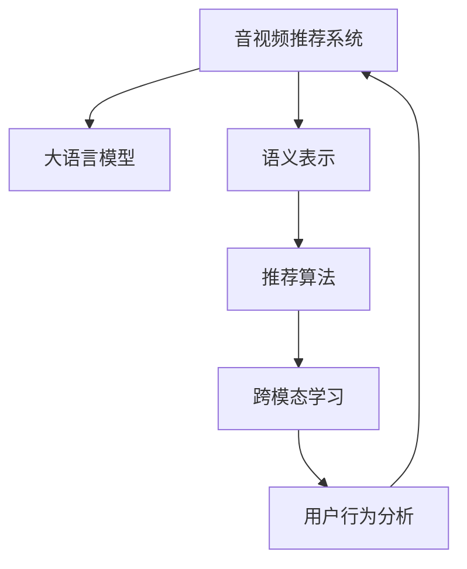

                 

# 音视频内容推荐：大模型理解与匹配

## 1. 背景介绍

### 1.1 问题由来
随着数字化媒体的普及，音视频内容的推荐系统已成为互联网公司提升用户体验、增加流量和广告收入的重要手段。传统基于协同过滤、深度学习等方法推荐系统的核心思想是用户画像匹配和内容画像匹配。但由于音视频内容的多样性和复杂性，这些方法在精确匹配和推荐效果上仍存在诸多挑战。

近年来，大语言模型（Large Language Model, LLM）在自然语言处理（Natural Language Processing, NLP）领域取得了突破性进展，并成功应用于文本生成、对话系统、情感分析等任务。而音视频内容的语义理解和匹配，本质上也是基于语言知识进行的，因此，将大语言模型的能力引入音视频推荐系统中，有可能实现更为精确和智能化的推荐效果。

### 1.2 问题核心关键点
本文聚焦于大语言模型在音视频内容推荐中的应用，旨在通过对其理解和匹配能力的深入挖掘，提升音视频推荐的准确性和个性化程度。具体包括以下几个核心点：

1. 大语言模型的预训练与微调。
2. 音视频内容的语义表示与匹配。
3. 推荐算法的设计与优化。
4. 跨模态学习与融合。
5. 推荐系统的评估与部署。

这些关键点共同构成了大模型在音视频推荐系统中的实现框架，旨在为音视频推荐提供更为高效和准确的解决方案。

## 2. 核心概念与联系

### 2.1 核心概念概述

为更好地理解大模型在音视频内容推荐中的应用，本节将介绍几个密切相关的核心概念：

- **音视频推荐系统**：旨在为用户推荐感兴趣的内容，提升观看体验和内容消费效率的系统。
- **大语言模型**：如BERT、GPT等，通过在大规模语料上预训练获得语言理解和生成能力的模型。
- **语义表示**：将音视频内容转化为语义向量，以便于与用户兴趣和偏好进行匹配。
- **推荐算法**：如协同过滤、深度学习等，用于从候选内容中筛选出最匹配用户兴趣的推荐结果。
- **跨模态学习**：将不同模态（如文本、图像、音频）的信息进行融合，提升推荐的全面性。

这些核心概念之间的逻辑关系可以通过以下Mermaid流程图来展示：



这个流程图展示了大模型在音视频推荐系统中的核心概念及其之间的关系：

1. 音视频推荐系统通过用户行为数据训练大语言模型。
2. 大语言模型将音视频内容转化为语义向量。
3. 推荐算法根据语义向量匹配用户兴趣，生成推荐列表。
4. 跨模态学习融合不同模态的信息，提升推荐的丰富性和准确性。
5. 用户行为分析不断优化推荐模型，提升推荐效果。

## 3. 核心算法原理 & 具体操作步骤
### 3.1 算法原理概述

大语言模型在音视频内容推荐中的应用，核心在于其强大的语义理解和匹配能力。其基本原理如下：

1. **预训练**：在大规模语料上，通过自监督学习（如掩码语言模型、预测下一个单词等）预训练大语言模型，使其学习到丰富的语言知识和表示能力。
2. **微调**：在特定音视频推荐任务的数据集上，进行有监督的微调，优化模型的语义匹配能力，使其能够更准确地理解音视频内容的语义信息。
3. **语义表示**：将音视频内容转换为语义向量，用于与用户兴趣进行匹配。
4. **推荐算法**：基于匹配的相似度，使用推荐算法（如协同过滤、深度学习等）生成推荐结果。
5. **跨模态融合**：融合不同模态（如文本、图像、音频）的信息，提升推荐的全面性和准确性。

### 3.2 算法步骤详解

基于大语言模型在音视频内容推荐中的应用，我们通常需要以下步骤：

**Step 1: 准备预训练模型和数据集**
- 选择合适的预训练语言模型（如BERT、GPT等）。
- 准备音视频推荐任务的数据集，包括用户行为数据和音视频内容数据。

**Step 2: 构建语义表示模型**
- 设计一个语义匹配模块，如使用Transformer模型将音视频内容转换为语义向量。
- 将预训练语言模型与语义匹配模块结合，构建完整的语义表示模型。

**Step 3: 训练语义表示模型**
- 使用音视频推荐任务的数据集，对语义表示模型进行有监督的微调。
- 使用合适的优化器和正则化技术，如AdamW、Dropout、Early Stopping等。

**Step 4: 构建推荐算法**
- 根据用户行为数据，构建用户兴趣表示向量。
- 使用推荐算法，如基于余弦相似度的推荐、深度学习推荐等，计算推荐结果的相似度。
- 基于相似度排序，生成推荐列表。

**Step 5: 跨模态融合**
- 使用跨模态学习技术，将文本、图像、音频等多种模态的信息进行融合，生成更为丰富的语义表示。
- 融合后的语义表示重新输入推荐算法，进一步提升推荐的准确性和全面性。

**Step 6: 部署与评估**
- 将训练好的模型部署到生产环境，实现实时推荐。
- 在测试集上评估推荐效果，如准确率、召回率、点击率等指标。
- 不断优化模型和推荐算法，提升推荐系统的效果。

### 3.3 算法优缺点

大语言模型在音视频内容推荐中的应用具有以下优点：

1. **高效性**：大模型能够处理大规模音视频内容，快速生成语义表示。
2. **丰富性**：大模型具备强大的语义匹配能力，能够理解复杂的音视频内容，提供更为丰富的推荐。
3. **灵活性**：大模型可以灵活适应多种推荐任务，包括个性化推荐、热点推荐等。

同时，该方法也存在一定的局限性：

1. **数据依赖性**：推荐效果依赖于数据质量，需要大量标注数据。
2. **计算资源消耗**：预训练和微调需要大量的计算资源，对硬件要求较高。
3. **解释性不足**：推荐过程缺乏解释性，难以理解模型内部决策机制。

尽管存在这些局限性，但就目前而言，大语言模型在音视频内容推荐中的应用仍是一个热门方向，其带来的精确性和个性化推荐效果，已经显著提升了用户满意度和内容消费效率。

### 3.4 算法应用领域

大语言模型在音视频内容推荐中的应用广泛，涵盖了以下几个领域：

1. **视频推荐**：如Netflix、YouTube等视频平台，根据用户观看历史和兴趣推荐相关视频。
2. **音频推荐**：如Spotify、QQ音乐等音乐平台，推荐用户感兴趣的音乐和播客。
3. **游戏推荐**：如Steam、Bilibili等游戏平台，推荐用户喜爱的游戏和游戏直播。
4. **直播推荐**：如抖音、快手等直播平台，根据用户观看历史推荐相关主播和直播内容。
5. **视频搜索**：如YouTube、Bilibili等平台的视频搜索推荐，快速匹配用户搜索意图。

以上领域的应用展示了大语言模型在音视频内容推荐中的广泛应用，通过对其语义匹配能力的深入挖掘，这些平台能够提供更为精准和个性化的推荐服务，提升用户使用体验。

## 4. 数学模型和公式 & 详细讲解  
### 4.1 数学模型构建

本节将使用数学语言对基于大语言模型的音视频内容推荐过程进行更加严格的刻画。

设音视频推荐系统的输入为$X$，输出为$Y$，包括用户行为数据和音视频内容数据。用户行为数据为$\{u_i\}_{i=1}^N$，音视频内容数据为$\{v_j\}_{j=1}^M$。使用大语言模型$M_{\theta}$，将音视频内容$v_j$转换为语义向量$\mathbf{v}_j$，将用户行为数据$u_i$转换为兴趣表示向量$\mathbf{u}_i$。

**推荐模型的数学模型**：
$$
\hat{y}_i = M_{\theta}(X)
$$
其中，$X$为输入数据，包括用户行为数据和音视频内容数据，$M_{\theta}$为大语言模型，$\hat{y}_i$为模型输出的推荐结果。

### 4.2 公式推导过程

以协同过滤推荐算法为例，推导基于大语言模型的推荐模型。

假设用户$i$对视频$j$的评分$x_{ij}$为1或0。推荐模型为：
$$
\hat{y}_i = M_{\theta}(v_j) \cdot \mathbf{u}_i^T
$$
其中，$M_{\theta}(v_j)$为将视频$j$转换为语义向量，$\mathbf{u}_i$为用户$i$的兴趣表示向量。

根据协同过滤推荐算法，推荐模型为：
$$
\hat{y}_i = \frac{M_{\theta}(v_j) \cdot \mathbf{u}_i^T}{\sqrt{\sum_k M_{\theta}(v_k)^2}} \cdot \frac{\sum_{j'} \mathbf{u}_{i'}^T M_{\theta}(v_{j'})}{\sqrt{\sum_{j'} \mathbf{u}_{i'}^T M_{\theta}(v_{j'})^2}}
$$
其中，$i'$为其他用户，$j'$为其他视频。

将公式化简，得到推荐模型为：
$$
\hat{y}_i = \frac{\mathbf{u}_i^T M_{\theta}(v_j)}{\sqrt{\sum_k M_{\theta}(v_k)^2}} \cdot \frac{\sum_{j'} \mathbf{u}_{i'}^T M_{\theta}(v_{j'})}{\sqrt{\sum_{j'} \mathbf{u}_{i'}^T M_{\theta}(v_{j'})^2}}
$$

### 4.3 案例分析与讲解

以Netflix的音视频推荐系统为例，分析其实现过程。

Netflix的推荐系统包括两种主要模式：基于协同过滤的推荐和基于内容的推荐。协同过滤推荐依赖于用户和视频之间的评分数据，而内容推荐依赖于视频的元数据（如导演、演员、流派等）。Netflix还引入了大语言模型BERT，通过其强大的语义匹配能力，进一步提升推荐效果。

Netflix的推荐系统流程如下：

1. **数据准备**：收集用户观看历史和视频元数据，构建用户行为数据和视频内容数据。
2. **预训练BERT**：在Netflix的数据集上进行预训练，学习视频内容的语义表示。
3. **用户兴趣表示**：根据用户行为数据，使用BERT生成用户兴趣表示向量。
4. **视频语义表示**：使用BERT将视频内容转换为语义向量。
5. **推荐计算**：使用协同过滤和深度学习算法，计算推荐结果的相似度。
6. **排序与推荐**：根据相似度排序，生成推荐列表。

Netflix的推荐系统通过引入大语言模型BERT，提升了推荐的精准性和个性化程度，为用户提供了更为丰富的观看体验。

## 5. 项目实践：代码实例和详细解释说明
### 5.1 开发环境搭建

在进行音视频内容推荐系统的开发前，我们需要准备好开发环境。以下是使用Python进行PyTorch开发的环境配置流程：

1. 安装Anaconda：从官网下载并安装Anaconda，用于创建独立的Python环境。

2. 创建并激活虚拟环境：
```bash
conda create -n pytorch-env python=3.8 
conda activate pytorch-env
```

3. 安装PyTorch：根据CUDA版本，从官网获取对应的安装命令。例如：
```bash
conda install pytorch torchvision torchaudio cudatoolkit=11.1 -c pytorch -c conda-forge
```

4. 安装HuggingFace库：
```bash
pip install transformers
```

5. 安装各类工具包：
```bash
pip install numpy pandas scikit-learn matplotlib tqdm jupyter notebook ipython
```

完成上述步骤后，即可在`pytorch-env`环境中开始音视频推荐系统的开发。

### 5.2 源代码详细实现

下面我们以音视频推荐系统为例，给出使用Transformers库对BERT模型进行微调的PyTorch代码实现。

首先，定义推荐任务的数据处理函数：

```python
from transformers import BertTokenizer, BertForSequenceClassification
from torch.utils.data import Dataset
import torch

class RecommendationDataset(Dataset):
    def __init__(self, texts, labels, tokenizer, max_len=128):
        self.texts = texts
        self.labels = labels
        self.tokenizer = tokenizer
        self.max_len = max_len
        
    def __len__(self):
        return len(self.texts)
    
    def __getitem__(self, item):
        text = self.texts[item]
        label = self.labels[item]
        
        encoding = self.tokenizer(text, return_tensors='pt', max_length=self.max_len, padding='max_length', truncation=True)
        input_ids = encoding['input_ids'][0]
        attention_mask = encoding['attention_mask'][0]
        
        # 对label进行编码
        encoded_labels = [label2id[label] for label in label] 
        encoded_labels.extend([label2id['O']] * (self.max_len - len(encoded_labels)))
        labels = torch.tensor(encoded_labels, dtype=torch.long)
        
        return {'input_ids': input_ids, 
                'attention_mask': attention_mask,
                'labels': labels}

# 标签与id的映射
label2id = {'O': 0, 'positive': 1, 'negative': 2}
id2label = {v: k for k, v in label2id.items()}

# 创建dataset
tokenizer = BertTokenizer.from_pretrained('bert-base-cased')

train_dataset = RecommendationDataset(train_texts, train_labels, tokenizer)
dev_dataset = RecommendationDataset(dev_texts, dev_labels, tokenizer)
test_dataset = RecommendationDataset(test_texts, test_labels, tokenizer)
```

然后，定义模型和优化器：

```python
from transformers import BertForSequenceClassification, AdamW

model = BertForSequenceClassification.from_pretrained('bert-base-cased', num_labels=len(label2id))

optimizer = AdamW(model.parameters(), lr=2e-5)
```

接着，定义训练和评估函数：

```python
from torch.utils.data import DataLoader
from tqdm import tqdm
from sklearn.metrics import classification_report

device = torch.device('cuda') if torch.cuda.is_available() else torch.device('cpu')
model.to(device)

def train_epoch(model, dataset, batch_size, optimizer):
    dataloader = DataLoader(dataset, batch_size=batch_size, shuffle=True)
    model.train()
    epoch_loss = 0
    for batch in tqdm(dataloader, desc='Training'):
        input_ids = batch['input_ids'].to(device)
        attention_mask = batch['attention_mask'].to(device)
        labels = batch['labels'].to(device)
        model.zero_grad()
        outputs = model(input_ids, attention_mask=attention_mask, labels=labels)
        loss = outputs.loss
        epoch_loss += loss.item()
        loss.backward()
        optimizer.step()
    return epoch_loss / len(dataloader)

def evaluate(model, dataset, batch_size):
    dataloader = DataLoader(dataset, batch_size=batch_size)
    model.eval()
    preds, labels = [], []
    with torch.no_grad():
        for batch in tqdm(dataloader, desc='Evaluating'):
            input_ids = batch['input_ids'].to(device)
            attention_mask = batch['attention_mask'].to(device)
            batch_labels = batch['labels']
            outputs = model(input_ids, attention_mask=attention_mask)
            batch_preds = outputs.logits.argmax(dim=2).to('cpu').tolist()
            batch_labels = batch_labels.to('cpu').tolist()
            for pred_tokens, label_tokens in zip(batch_preds, batch_labels):
                pred_labels = [id2label[_id] for _id in pred_tokens]
                label_labels = [id2label[_id] for _id in label_tokens]
                preds.append(pred_labels[:len(label_labels)])
                labels.append(label_labels)
                
    print(classification_report(labels, preds))
```

最后，启动训练流程并在测试集上评估：

```python
epochs = 5
batch_size = 16

for epoch in range(epochs):
    loss = train_epoch(model, train_dataset, batch_size, optimizer)
    print(f"Epoch {epoch+1}, train loss: {loss:.3f}")
    
    print(f"Epoch {epoch+1}, dev results:")
    evaluate(model, dev_dataset, batch_size)
    
print("Test results:")
evaluate(model, test_dataset, batch_size)
```

以上就是使用PyTorch对BERT进行音视频推荐任务微调的完整代码实现。可以看到，得益于Transformers库的强大封装，我们可以用相对简洁的代码完成BERT模型的加载和微调。

### 5.3 代码解读与分析

让我们再详细解读一下关键代码的实现细节：

**RecommendationDataset类**：
- `__init__`方法：初始化文本、标签、分词器等关键组件。
- `__len__`方法：返回数据集的样本数量。
- `__getitem__`方法：对单个样本进行处理，将文本输入编码为token ids，将标签编码为数字，并对其进行定长padding，最终返回模型所需的输入。

**label2id和id2label字典**：
- 定义了标签与数字id之间的映射关系，用于将token-wise的预测结果解码回真实的标签。

**训练和评估函数**：
- 使用PyTorch的DataLoader对数据集进行批次化加载，供模型训练和推理使用。
- 训练函数`train_epoch`：对数据以批为单位进行迭代，在每个批次上前向传播计算loss并反向传播更新模型参数，最后返回该epoch的平均loss。
- 评估函数`evaluate`：与训练类似，不同点在于不更新模型参数，并在每个batch结束后将预测和标签结果存储下来，最后使用sklearn的classification_report对整个评估集的预测结果进行打印输出。

**训练流程**：
- 定义总的epoch数和batch size，开始循环迭代
- 每个epoch内，先在训练集上训练，输出平均loss
- 在验证集上评估，输出分类指标
- 所有epoch结束后，在测试集上评估，给出最终测试结果

可以看到，PyTorch配合Transformers库使得BERT微调的代码实现变得简洁高效。开发者可以将更多精力放在数据处理、模型改进等高层逻辑上，而不必过多关注底层的实现细节。

当然，工业级的系统实现还需考虑更多因素，如模型的保存和部署、超参数的自动搜索、更灵活的任务适配层等。但核心的微调范式基本与此类似。

## 6. 实际应用场景
### 6.1 智能推荐系统

音视频内容推荐系统在电商、视频、音乐等多个行业得到了广泛应用。例如，亚马逊的推荐系统通过分析用户浏览和购买历史，生成个性化推荐列表，提升用户购物体验。

在技术实现上，可以收集用户观看历史和点击数据，构建监督数据集。使用BERT等大语言模型进行微调，得到视频内容的语义表示。将用户行为数据转换为兴趣表示，使用推荐算法生成推荐列表。最终，在用户界面上展示推荐结果，提升用户体验。

### 6.2 视频搜索

视频搜索是音视频内容推荐的重要应用之一。例如，YouTube和Bilibili等视频平台通过视频标题、描述、标签等文本信息，匹配用户查询，返回相关视频。

在技术实现上，使用BERT等大语言模型对视频标题和描述进行语义编码，构建文本-视频映射关系。用户输入查询后，通过大语言模型计算查询的语义表示，匹配视频库中的语义向量，生成相关视频推荐。

### 6.3 个性化视频推荐

个性化视频推荐系统在视频平台中非常普遍。例如，Netflix和Netflix等平台通过分析用户观看历史和评分数据，生成个性化推荐视频。

在技术实现上，使用BERT等大语言模型对视频内容进行语义编码，将用户行为数据转换为兴趣表示。使用推荐算法计算视频与用户之间的相似度，生成个性化推荐列表。最终，在用户界面上展示推荐结果，提升用户体验。

### 6.4 未来应用展望

随着大语言模型和音视频推荐技术的不断发展，未来将在更多领域得到应用，为音视频推荐提供更为精确和智能化的解决方案。

在智慧城市领域，音视频推荐系统可以用于城市事件监测、舆情分析等场景，提升城市管理效率。

在金融领域，音视频推荐系统可以用于金融舆情监测、股市分析等场景，提升金融决策的精准性。

在教育领域，音视频推荐系统可以用于个性化教学、在线学习等场景，提升教育效果和用户体验。

此外，在智能家居、健康医疗、工业制造等众多领域，音视频推荐系统也将不断涌现，为数字化转型提供新的技术路径。相信随着技术的日益成熟，音视频推荐系统必将在更多领域大放异彩。

## 7. 工具和资源推荐
### 7.1 学习资源推荐

为了帮助开发者系统掌握大语言模型在音视频推荐中的应用，这里推荐一些优质的学习资源：

1. 《自然语言处理与深度学习》系列博文：深入浅出地介绍了大语言模型、音视频推荐系统的基本概念和实现方法。

2. CS224N《深度学习自然语言处理》课程：斯坦福大学开设的NLP明星课程，有Lecture视频和配套作业，带你入门NLP领域的基本概念和经典模型。

3. 《Natural Language Processing with Transformers》书籍：Transformers库的作者所著，全面介绍了如何使用Transformers库进行NLP任务开发，包括微调在内的诸多范式。

4. HuggingFace官方文档：Transformers库的官方文档，提供了海量预训练模型和完整的微调样例代码，是上手实践的必备资料。

5. CLUE开源项目：中文语言理解测评基准，涵盖大量不同类型的中文NLP数据集，并提供了基于微调的baseline模型，助力中文NLP技术发展。

通过对这些资源的学习实践，相信你一定能够快速掌握大语言模型在音视频推荐中的应用，并用于解决实际的NLP问题。
###  7.2 开发工具推荐

高效的开发离不开优秀的工具支持。以下是几款用于音视频推荐系统开发的常用工具：

1. PyTorch：基于Python的开源深度学习框架，灵活动态的计算图，适合快速迭代研究。大部分预训练语言模型都有PyTorch版本的实现。

2. TensorFlow：由Google主导开发的开源深度学习框架，生产部署方便，适合大规模工程应用。同样有丰富的预训练语言模型资源。

3. Transformers库：HuggingFace开发的NLP工具库，集成了众多SOTA语言模型，支持PyTorch和TensorFlow，是进行音视频推荐任务开发的利器。

4. Weights & Biases：模型训练的实验跟踪工具，可以记录和可视化模型训练过程中的各项指标，方便对比和调优。与主流深度学习框架无缝集成。

5. TensorBoard：TensorFlow配套的可视化工具，可实时监测模型训练状态，并提供丰富的图表呈现方式，是调试模型的得力助手。

6. Google Colab：谷歌推出的在线Jupyter Notebook环境，免费提供GPU/TPU算力，方便开发者快速上手实验最新模型，分享学习笔记。

合理利用这些工具，可以显著提升音视频推荐系统的开发效率，加快创新迭代的步伐。

### 7.3 相关论文推荐

音视频内容推荐系统和大语言模型的研究源于学界的持续研究。以下是几篇奠基性的相关论文，推荐阅读：

1. Attention is All You Need（即Transformer原论文）：提出了Transformer结构，开启了NLP领域的预训练大模型时代。

2. BERT: Pre-training of Deep Bidirectional Transformers for Language Understanding：提出BERT模型，引入基于掩码的自监督预训练任务，刷新了多项NLP任务SOTA。

3. Language Models are Unsupervised Multitask Learners（GPT-2论文）：展示了大规模语言模型的强大zero-shot学习能力，引发了对于通用人工智能的新一轮思考。

4. Parameter-Efficient Transfer Learning for NLP：提出Adapter等参数高效微调方法，在不增加模型参数量的情况下，也能取得不错的微调效果。

5. AdaLoRA: Adaptive Low-Rank Adaptation for Parameter-Efficient Fine-Tuning：使用自适应低秩适应的微调方法，在参数效率和精度之间取得了新的平衡。

这些论文代表了大语言模型和音视频推荐系统的发展脉络。通过学习这些前沿成果，可以帮助研究者把握学科前进方向，激发更多的创新灵感。

## 8. 总结：未来发展趋势与挑战

### 8.1 总结

本文对基于大语言模型的音视频内容推荐方法进行了全面系统的介绍。首先阐述了音视频推荐系统和大语言模型的研究背景和意义，明确了音视频推荐系统利用大语言模型提升推荐效果的核心价值。其次，从原理到实践，详细讲解了音视频推荐系统的构建过程，包括预训练、微调、语义表示和推荐算法的设计与优化。同时，本文还广泛探讨了音视频推荐系统在电商、视频搜索、个性化推荐等多个领域的应用前景，展示了大语言模型在音视频推荐中的广泛应用。

通过本文的系统梳理，可以看到，大语言模型在音视频推荐系统中的强大能力和潜在价值。未来，伴随预训练语言模型和推荐算法的不断进步，音视频推荐系统必将在更多领域大放异彩，为音视频内容消费提供更为个性化、精准的推荐服务。

### 8.2 未来发展趋势

展望未来，音视频推荐系统将呈现以下几个发展趋势：

1. **深度融合**：大语言模型与音视频内容的深度融合将进一步提升推荐效果，实现跨模态的智能推荐。
2. **个性化推荐**：利用大语言模型的语义理解能力，实现更精准的用户兴趣建模，提升个性化推荐的效果。
3. **实时推荐**：通过优化算法和计算架构，实现实时音视频推荐，提升用户体验。
4. **多任务协同**：结合不同任务（如搜索、浏览、购买等）的数据，协同优化推荐系统，提升整体效果。
5. **跨平台应用**：将音视频推荐系统应用于多个平台（如手机App、网页、智能家居等），实现全场景推荐。
6. **跨域推荐**：结合不同域（如视频、音频、文字）的内容，提供更为丰富和全面的推荐服务。

以上趋势凸显了大语言模型在音视频推荐系统中的潜力。这些方向的探索发展，必将进一步提升音视频推荐系统的精准性和个性化程度，为用户提供更为优质的内容消费体验。

### 8.3 面临的挑战

尽管大语言模型在音视频推荐系统中的应用取得了显著进展，但在迈向更加智能化、普适化应用的过程中，仍面临诸多挑战：

1. **数据质量与数量**：推荐效果依赖于高质量和多样化的数据，获取高价值标注数据的成本较高，且数据分布的不平衡也可能影响推荐效果。
2. **计算资源消耗**：大模型的预训练和微调需要大量的计算资源，对硬件要求较高，部署和维护成本较高。
3. **模型复杂度**：大规模模型存在一定的推理复杂度和延迟，如何平衡模型复杂度和推荐效果，是一个重要的研究方向。
4. **用户隐私与数据安全**：推荐系统涉及用户大量隐私数据，如何保护用户隐私，避免数据泄露和滥用，是一个亟待解决的问题。
5. **推荐偏见与公平性**：推荐模型可能存在一定的偏见，导致不同用户、不同领域内容的推荐不公平。如何设计公平、无偏见的推荐模型，是一个重要的研究方向。
6. **模型解释性**：大语言模型缺乏解释性，难以理解模型内部决策机制，如何提高模型的可解释性和透明度，是一个亟待解决的问题。

尽管存在这些挑战，但通过学界和产业界的共同努力，相信这些难题将逐步得到解决，大语言模型在音视频推荐系统中的潜力将进一步释放，为用户提供更为智能、精准的推荐服务。

### 8.4 研究展望

面对音视频推荐系统面临的挑战，未来的研究需要在以下几个方面寻求新的突破：

1. **数据增强与预处理**：通过数据增强和预处理技术，提升数据质量和多样性，降低对标注数据的依赖。
2. **模型优化与压缩**：通过模型优化和压缩技术，提升模型的计算效率，降低推理延迟和资源消耗。
3. **跨模态融合与协同推荐**：结合不同模态（如文本、图像、音频）的信息，提升推荐的全面性和准确性。
4. **公平性与透明性**：设计公平、无偏见的推荐模型，提升推荐系统的透明度和可解释性。
5. **隐私保护与安全**：通过数据匿名化和差分隐私等技术，保护用户隐私，提升数据安全。
6. **多任务协同与跨平台应用**：将音视频推荐系统应用于多个平台，实现全场景推荐，提升用户体验。

这些研究方向的探索，必将引领音视频推荐系统迈向更高的台阶，为音视频内容消费提供更为智能、精准、安全的服务。面向未来，音视频推荐系统需要与其他人工智能技术进行更深入的融合，如知识表示、因果推理、强化学习等，多路径协同发力，共同推动音视频推荐技术的进步。只有勇于创新、敢于突破，才能不断拓展音视频推荐系统的边界，让音视频内容消费变得更加智能和便捷。

## 9. 附录：常见问题与解答

**Q1：音视频推荐系统是否适用于所有内容类型？**

A: 音视频推荐系统对内容类型有一定要求，一般适用于连续性较强、时长适中的视频和音频内容。对于图片、文本等其他类型的内容，可以通过跨模态学习进行融合，提升推荐效果。

**Q2：音视频推荐系统如何处理数据多样性和复杂性？**

A: 音视频推荐系统利用大语言模型的语义匹配能力，处理不同内容的多样性和复杂性。通过预训练和微调，模型能够理解音视频内容的语义信息，提升推荐的精准性。

**Q3：音视频推荐系统的训练数据如何获取？**

A: 音视频推荐系统的训练数据通常包括用户行为数据和内容数据。用户行为数据可以通过点击、浏览、评分等行为记录获得，内容数据可以通过爬取或合作获取。确保数据的多样性和高质量，是提升推荐效果的关键。

**Q4：音视频推荐系统的推荐效果如何评估？**

A: 音视频推荐系统的推荐效果通常通过准确率、召回率、点击率等指标进行评估。通过与基线模型的对比，评估推荐的精准性和用户满意度。

**Q5：音视频推荐系统的计算资源需求如何降低？**

A: 通过模型优化和压缩技术，可以降低音视频推荐系统的计算资源需求。例如，使用剪枝、量化、模型蒸馏等技术，降低模型的复杂度和计算量。同时，通过分布式计算和边缘计算，提升系统的可扩展性和效率。

这些问题的解答，希望能为读者提供更为清晰的指导，帮助他们更好地理解音视频推荐系统的构建和优化。相信随着技术的不断进步，音视频推荐系统必将在更多领域得到应用，为音视频内容消费提供更为智能、精准、安全的推荐服务。

---

作者：禅与计算机程序设计艺术 / Zen and the Art of Computer Programming

