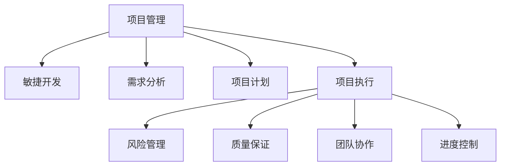

                 

# 项目管理：从构思到交付的全过程指南

> 关键词：项目管理,敏捷开发,需求分析,项目计划,项目执行,风险管理,质量保证,团队协作,软件开发生命周期

## 1. 背景介绍

### 1.1 问题由来

在当今快速变化的商业环境中，项目管理的角色和重要性日益凸显。面对市场需求多变、竞争激烈、客户期望不断提升的挑战，企业需要高效、灵活、可控的项目管理手段来确保项目能够按期、按质、按量交付。然而，传统的项目管理方式，如瀑布模型，已经无法适应这一要求。

### 1.2 问题核心关键点

项目管理的核心关键点在于：

- **需求分析**：明确项目目标和需求，制定清晰的项目计划。
- **资源分配**：合理配置项目所需的人力、物资、资金等资源。
- **风险管理**：识别、评估和应对项目过程中可能遇到的风险。
- **质量保证**：确保项目交付的产品或服务达到预定的质量标准。
- **团队协作**：提升团队成员之间的沟通和协作效率。
- **进度控制**：实时监控项目进度，及时调整项目计划。

### 1.3 问题研究意义

有效的项目管理能够显著提升项目成功率，减少成本和资源浪费，提高企业竞争力。

- **提升效率**：通过科学的规划和执行，确保项目按时交付。
- **降低成本**：避免不必要的重复劳动和资源浪费，优化成本控制。
- **增强质量**：确保项目成果满足用户需求，提升客户满意度。
- **促进创新**：通过敏捷管理，鼓励团队创新和快速迭代。
- **加强协作**：改善团队沟通和协作，提升整体效率。

## 2. 核心概念与联系

### 2.1 核心概念概述

为更好地理解项目管理的核心概念，本节将介绍几个密切相关的核心概念：

- **项目管理**：指在项目实施过程中，通过计划、执行、监控和控制，确保项目目标和质量得以实现的综合性管理活动。
- **敏捷开发**：一种以客户为中心，快速迭代、持续交付、高度协作的项目管理方法。
- **需求分析**：通过与利益相关者沟通，明确项目目标、需求和期望，制定详细的项目计划。
- **项目计划**：定义项目的范围、时间、成本、质量等关键要素，指导项目实施。
- **项目执行**：按照项目计划，分配资源、协调团队、执行任务，确保项目顺利进行。
- **风险管理**：识别、评估和应对项目实施过程中可能遇到的风险，减少不确定性。
- **质量保证**：确保项目交付的成果达到预定的质量标准，提升客户满意度。
- **团队协作**：通过有效的沟通和协作，提升团队成员之间的合作效率。
- **进度控制**：实时监控项目进度，及时调整项目计划，确保项目按时完成。

这些核心概念之间的逻辑关系可以通过以下Mermaid流程图来展示：



这个流程图展示了的项目管理的关键要素及其相互关系：

1. **项目管理**是整个流程的核心，指导敏捷开发、需求分析、项目计划等各个环节。
2. **敏捷开发**强调快速迭代和客户反馈，与需求分析和项目计划紧密关联。
3. **需求分析**是项目管理的起点，明确项目目标和需求，影响后续的计划和执行。
4. **项目计划**定义项目的关键要素，包括时间、成本、质量等，是项目管理的重要工具。
5. **项目执行**根据计划分配资源、协调团队，是项目管理的主要活动。
6. **风险管理**识别和应对项目风险，确保项目顺利进行。
7. **质量保证**确保项目成果满足质量标准，提升客户满意度。
8. **团队协作**提升团队沟通和协作效率，是项目成功的基础。
9. **进度控制**实时监控项目进度，确保项目按时完成。

## 3. 核心算法原理 & 具体操作步骤
### 3.1 算法原理概述

项目管理主要基于以下几个核心算法原理：

- **敏捷方法论**：强调快速迭代、客户反馈、持续交付等原则，通过迭代开发和反馈循环不断优化项目。
- **需求工程**：通过系统化的需求分析，明确项目目标和需求，制定详细的项目计划。
- **计划和调度**：使用甘特图、关键路径分析等工具，制定和调整项目计划，确保按时交付。
- **风险管理**：通过风险评估矩阵、事件树等方法，识别和应对项目风险。
- **质量保证**：通过测试、审计、持续集成等方法，确保项目成果的质量。
- **团队协作**：通过敏捷框架、Scrum、Kanban等工具，提升团队协作效率。
- **进度控制**：通过看板、燃尽图等工具，实时监控项目进度，及时调整计划。

### 3.2 算法步骤详解

基于敏捷开发方法，项目管理一般包括以下几个关键步骤：

**Step 1: 需求分析与规划**
- 通过与利益相关者沟通，明确项目目标、需求和期望，制定详细的项目计划。
- 使用用户故事、需求优先级、需求追踪等工具，记录和管理需求。
- 进行需求验证，确保需求文档和计划符合用户期望。

**Step 2: 敏捷迭代与开发**
- 将项目分解为多个迭代周期，每个迭代持续1-4周，专注于特定功能的开发和验证。
- 每个迭代开始前，制定迭代计划，明确任务分配和目标。
- 团队成员进行持续开发、测试和反馈，确保任务按时完成。
- 每个迭代结束时，进行功能演示和评审，收集反馈意见。

**Step 3: 风险管理与应对**
- 识别项目可能遇到的各种风险，如技术、资源、市场等风险。
- 评估风险的概率和影响，制定应对策略。
- 在项目实施过程中，实时监控风险状态，及时采取措施。
- 记录风险处理情况，为后续项目提供经验教训。

**Step 4: 质量保证与测试**
- 通过单元测试、集成测试、系统测试等方法，确保代码质量和系统稳定性。
- 使用持续集成和自动化测试工具，提高测试效率。
- 定期进行代码审计和系统评审，发现和修复潜在问题。
- 收集用户反馈，不断优化产品质量。

**Step 5: 团队协作与沟通**
- 使用敏捷框架如Scrum、Kanban，制定任务分配和进度跟踪。
- 使用沟通工具如Slack、JIRA、Confluence等，保持团队成员之间的有效沟通。
- 定期召开站会、回顾会等会议，促进团队协作和知识共享。
- 鼓励跨职能团队合作，提升整体效率和创新能力。

**Step 6: 进度控制与监控**
- 使用看板、燃尽图等工具，实时监控项目进度。
- 根据项目进度调整迭代计划和资源分配，确保项目按时完成。
- 定期进行进度报告，向利益相关者汇报项目状态和进展。
- 及时识别和解决进度偏差，避免项目延误。

### 3.3 算法优缺点

敏捷项目管理方法具有以下优点：

- **快速响应**：通过快速迭代和客户反馈，及时调整项目方向，减少不必要的变更和延迟。
- **高度灵活**：能够应对市场变化和需求调整，提升项目适应性。
- **高效协作**：通过团队协作和持续反馈，提升整体效率和质量。
- **持续改进**：通过回顾会、持续集成等机制，不断优化项目流程和成果。

同时，敏捷项目管理也存在一些局限性：

- **复杂度高**：需要团队具备高度的自律和协作能力，管理难度较大。
- **资源分配困难**：项目需要频繁变更，资源调整和重新分配较多。
- **质量保证挑战**：快速迭代可能导致测试不充分，质量保证难度较大。
- **文档复杂**：需求变更频繁，需要维护大量文档和记录。

尽管存在这些局限性，但就目前而言，敏捷项目管理方法已成为项目管理的主流范式，适用于快速变化、需求不确定的项目场景。

### 3.4 算法应用领域

敏捷项目管理在多个领域得到了广泛的应用，例如：

- **软件开发**：通过敏捷开发框架如Scrum、Kanban，提高软件交付速度和质量。
- **产品管理**：通过敏捷方法，快速迭代产品功能，提升用户体验。
- **项目管理**：通过敏捷工具，提升项目计划、执行和监控效率。
- **运营管理**：通过敏捷思维，优化运营流程，提升业务响应速度。
- **市场推广**：通过敏捷市场策略，快速调整市场反应，提升营销效果。

除了这些经典应用外，敏捷项目管理也被创新性地应用到更多场景中，如供应链管理、用户需求分析、品牌建设等，为企业带来新的价值。

## 4. 数学模型和公式 & 详细讲解
### 4.1 数学模型构建

项目管理的数学模型通常包括：

- **进度模型**：如CPM(关键路径法)、PERT(计划评审技术)等，用于计算项目所需时间。
- **成本模型**：如COCOMO(软件成本估算法)、PERT等，用于计算项目所需成本。
- **质量模型**：如故障率模型、可靠性模型等，用于评估项目成果的质量。

以关键路径法CPM为例，构建数学模型：

假设项目包含 $n$ 个任务，每个任务有 $d$ 个先后依赖关系，任务持续时间分别为 $T_1, T_2, ..., T_n$。任务依赖关系如下：

$$
A_i \rightarrow B_i \rightarrow C_i
$$

则项目总工期为：

$$
T_{\text{total}} = \max\{T_1 + T_2, T_2 + T_3, T_3 + T_4, ...\}
$$

其中，$A_i$ 为起始任务，$C_i$ 为终止任务。

### 4.2 公式推导过程

关键路径法的推导过程如下：

1. **绘制依赖图**：使用节点和箭头表示任务和依赖关系，绘制出项目依赖图。
2. **确定关键路径**：从起点开始，沿着最长路径到达终点，即为关键路径。
3. **计算关键路径长度**：关键路径上各任务持续时间的和，即为项目总工期。

以两个任务的例子进行说明：

假设项目包含两个任务，分别为任务 $A$ 和任务 $B$，其持续时间分别为 $T_A=3$ 天和 $T_B=5$ 天，任务依赖关系为 $A \rightarrow B$。则关键路径为 $A \rightarrow B$，关键路径长度为 $T_A + T_B = 8$ 天。

### 4.3 案例分析与讲解

**案例1: 软件开发项目进度管理**

某软件开发项目包含10个任务，各任务依赖关系如下：

$$
A_1 \rightarrow A_2 \rightarrow A_3, A_2 \rightarrow A_4 \rightarrow A_5
$$

各任务持续时间为：$T_{A_1}=5$ 天，$T_{A_2}=8$ 天，$T_{A_3}=10$ 天，$T_{A_4}=6$ 天，$T_{A_5}=3$ 天。

绘制依赖图如下：

```
A1
|
A2
|  \
A3  A4
  |
A5
```

根据CPM模型，计算关键路径长度：

1. 计算各任务的最早开始时间(EST)和最晚完成时间(LFT)：
   - $A_1$: EST=0，LFT=5
   - $A_2$: EST=5，LFT=13
   - $A_3$: EST=13，LFT=23
   - $A_4$: EST=8，LFT=23
   - $A_5$: EST=8，LFT=21

2. 确定关键路径：$A_1 \rightarrow A_2 \rightarrow A_3$，关键路径长度为 $T_{A_1} + T_{A_2} + T_{A_3} = 23$ 天。

**案例2: 风险管理**

某项目在执行过程中，遇到以下风险事件：

- 风险A：可能导致项目延期2天，概率为0.2。
- 风险B：可能导致项目成本增加5000元，概率为0.3。

风险管理步骤如下：

1. 评估风险概率和影响：
   - 风险A：概率0.2，影响2天。
   - 风险B：概率0.3，影响5000元。

2. 计算风险期望值和标准差：
   - 风险A期望值：$E_A = 2 \times 0.2 = 0.4$ 天
   - 风险B期望值：$E_B = 5000 \times 0.3 = 1500$ 元

   风险标准差：
   - 风险A标准差：$\sigma_A = \sqrt{(2-0.4)^2 \times 0.2} = 1.12$ 天
   - 风险B标准差：$\sigma_B = \sqrt{(5000-1500)^2 \times 0.3} = 3075.46$ 元

3. 绘制风险分布图：

```
|       |        |      |      |      |      |      |
|-------|--------|------|------|------|------|------|
| 4.0   | 3.9    | 3.8  | 3.7  | 3.6  | 3.5  | 3.4  |
|-------|--------|------|------|------|------|------|
| 3.3   | 3.2    | 3.1  | 3.0  | 2.9  | 2.8  | 2.7  |
|-------|--------|------|------|------|------|------|
| 2.6   | 2.5    | 2.4  | 2.3  | 2.2  | 2.1  | 2.0  |
|-------|--------|------|------|------|------|------|
| 1.9   | 1.8    | 1.7  | 1.6  | 1.5  | 1.4  | 1.3  |
|-------|--------|------|------|------|------|------|
| 1.2   | 1.1    | 1.0  | 0.9  | 0.8  | 0.7  | 0.6  |
|-------|--------|------|------|------|------|------|
| 0.9   | 0.8    | 0.7  | 0.6  | 0.5  | 0.4  | 0.3  |
|-------|--------|------|------|------|------|------|
| 0.2   | 0.1    | 0.0  |     |      |      |      |
|-------|--------|------|------|------|------|------|
```

风险A的概率密度函数如下：

```
|         |        |        |      |      |      |      |
|----------|--------|--------|------|------|------|------|
| 2.5      | 2.4    | 2.3    | 2.2  | 2.1  | 2.0  | 1.9  |
|----------|--------|--------|------|------|------|------|
| 1.8      | 1.7    | 1.6    | 1.5  | 1.4  | 1.3  | 1.2  |
|----------|--------|--------|------|------|------|------|
| 0.9      | 0.8    | 0.7    | 0.6  | 0.5  | 0.4  | 0.3  |
|----------|--------|--------|------|------|------|------|
| 0.2      | 0.1    | 0.0    |     |      |      |      |
|----------|--------|--------|------|------|------|------|
```

**案例3: 质量保证**

某项目在执行过程中，进行持续集成和测试。项目测试结果如下：

- 单元测试：通过率90%，缺陷数量10个。
- 集成测试：通过率80%，缺陷数量20个。
- 系统测试：通过率70%，缺陷数量30个。

质量保证步骤如下：

1. 计算测试覆盖率：
   - 单元测试覆盖率：$90\%$
   - 集成测试覆盖率：$80\%$
   - 系统测试覆盖率：$70\%$

2. 评估缺陷严重性：
   - 低严重性：$50\%$
   - 中严重性：$30\%$
   - 高严重性：$20\%$

3. 计算缺陷密度：
   - 单元测试缺陷密度：$\frac{10}{100} = 0.1$
   - 集成测试缺陷密度：$\frac{20}{100} = 0.2$
   - 系统测试缺陷密度：$\frac{30}{100} = 0.3$

4. 绘制质量保证图：

```
|         |        |        |      |      |      |      |
|----------|--------|--------|------|------|------|------|
| 0.8      | 0.7    | 0.6    | 0.5  | 0.4  | 0.3  | 0.2  |
|----------|--------|--------|------|------|------|------|
| 0.1      | 0.0    |     |      |      |      |      |
|----------|--------|------|------|------|------|------|
```

## 5. 项目实践：代码实例和详细解释说明
### 5.1 开发环境搭建

在进行项目管理实践前，我们需要准备好开发环境。以下是使用JIRA和Confluence搭建敏捷开发环境的流程：

1. 安装JIRA和Confluence：从官网下载并安装JIRA和Confluence，用于敏捷开发和项目管理。

2. 配置环境：
   - 创建JIRA和Confluence的用户账号，并进行必要的权限配置。
   - 配置JIRA中的敏捷板、自定义字段、工作流等。
   - 配置Confluence中的知识库、空间、页面等。

3. 连接工具：
   - 将JIRA和Confluence与版本控制系统（如Git）连接，方便代码管理和版本控制。
   - 集成自动化测试工具（如Jenkins、Travis CI等），实现持续集成和自动化测试。

4. 数据准备：
   - 收集项目需求、任务、进度、风险、质量等信息，上传到JIRA和Confluence。
   - 准备敏捷迭代计划、团队角色、会议安排等信息，建立敏捷开发流程。

完成上述步骤后，即可在JIRA和Confluence中开始敏捷开发实践。

### 5.2 源代码详细实现

下面我们以敏捷开发中的用户故事（User Story）管理为例，给出JIRA中的代码实现。

首先，定义用户故事的类：

```python
class UserStory:
    def __init__(self, title, description, acceptance_criteria):
        self.title = title
        self.description = description
        self.acceptance_criteria = acceptance_criteria
        self.status = 'To Do'
        self.priority = 3
        self.tags = ['UI', 'User Stories']
```

然后，定义敏捷板的类：

```python
class AgileBoard:
    def __init__(self):
        self.backlog = []
        self.active = []
        self.done = []
    
    def add_user_story(self, user_story):
        self.backlog.append(user_story)
    
    def move_to_backlog(self, user_story):
        self.backlog.remove(user_story)
        self.done.append(user_story)
    
    def move_to_active(self, user_story):
        self.active.append(user_story)
        self.done.remove(user_story)
    
    def move_to_done(self, user_story):
        self.done.remove(user_story)
```

最后，编写JIRA界面：

```html
<html>
<head>
    <title>Agile Board</title>
    <script src="https://code.jquery.com/jquery-3.5.1.min.js"></script>
    <script>
        function move_to_backlog(story_id) {
            var board = agleBoard.board;
            var user_story = board.find_story_by_id(story_id);
            board.move_to_backlog(user_story);
            update_board();
        }
        
        function move_to_active(story_id) {
            var board = agleBoard.board;
            var user_story = board.find_story_by_id(story_id);
            board.move_to_active(user_story);
            update_board();
        }
        
        function move_to_done(story_id) {
            var board = agleBoard.board;
            var user_story = board.find_story_by_id(story_id);
            board.move_to_done(user_story);
            update_board();
        }
    </script>
</head>
<body>
    <h1>Agile Board</h1>
    <ul>
        <li id="backlog">
            <h3>Backlog</h3>
            
            <li id="{{ user_story.id }}" onclick="move_to_backlog({{ user_story.id }})">
                {{ user_story.title }}
                <p>{{ user_story.description }}</p>
                <p>{{ user_story.acceptance_criteria }}</p>
                <p>Status: {{ user_story.status }}</p>
                <p>Priority: {{ user_story.priority }}</p>
                <p>Tags: {{ user_story.tags }}</p>
            </li>
            
        </li>
        <li id="active">
            <h3>Active</h3>
            
            <li id="{{ user_story.id }}" onclick="move_to_done({{ user_story.id }})">
                {{ user_story.title }}
                <p>{{ user_story.description }}</p>
                <p>{{ user_story.acceptance_criteria }}</p>
                <p>Status: {{ user_story.status }}</p>
                <p>Priority: {{ user_story.priority }}</p>
                <p>Tags: {{ user_story.tags }}</p>
            </li>
            
        </li>
        <li id="done">
            <h3>Done</h3>
            
            <li id="{{ user_story.id }}" onclick="move_to_active({{ user_story.id }})">
                {{ user_story.title }}
                <p>{{ user_story.description }}</p>
                <p>{{ user_story.acceptance_criteria }}</p>
                <p>Status: {{ user_story.status }}</p>
                <p>Priority: {{ user_story.priority }}</p>
                <p>Tags: {{ user_story.tags }}</p>
            </li>
            
        </li>
    </ul>
    <script>
        function update_board() {
            // 更新JIRA板面
        }
    </script>
</body>
</html>
```

完成上述步骤后，即可在JIRA中实现用户故事的添加和状态切换，为敏捷开发提供支持。

### 5.3 代码解读与分析

让我们再详细解读一下关键代码的实现细节：

**UserStory类**：
- 定义了用户故事的基本属性和状态，如标题、描述、验收标准、当前状态、优先级和标签等。

**AgileBoard类**：
- 定义了敏捷板的三个状态：待办、活跃、完成，以及相关的操作函数。
- 实现了添加、移动、更新敏捷板上的用户故事。

**JIRA界面**：
- 使用HTML和JavaScript实现JIRA界面，包含待办、活跃、完成三个板块。
- 通过事件绑定，实现用户故事的添加和状态切换。

通过JIRA和Confluence的代码实现，可以看到敏捷项目管理工具的有效性，大大简化了项目管理流程，提升了团队协作效率。

## 6. 实际应用场景

### 6.1 智能制造

敏捷项目管理在智能制造领域得到了广泛应用。传统的制造企业在生产过程中，往往面临订单需求多变、生产流程复杂、资源调配困难等问题。通过敏捷项目管理方法，可以实现快速响应市场需求，优化生产流程，提升资源利用率。

具体而言，智能制造企业可以：

1. **快速响应市场需求**：通过敏捷开发，快速迭代产品设计和生产流程，缩短上市时间。
2. **优化生产流程**：通过敏捷方法，及时识别和调整生产中的瓶颈，提升生产效率。
3. **提升资源利用率**：通过敏捷管理，合理分配生产资源，减少浪费。
4. **强化质量保证**：通过持续集成和测试，提高产品质量，提升客户满意度。
5. **促进团队协作**：通过敏捷框架，提升团队沟通和协作效率，增强团队凝聚力。

### 6.2 数字营销

敏捷项目管理在数字营销领域也得到了创新应用。数字营销需要快速响应用户需求，频繁调整营销策略，敏捷项目管理方法能够有效支持这一需求。

具体而言，数字营销企业可以：

1. **快速迭代营销策略**：通过敏捷方法，快速响应用户反馈，调整营销策略。
2. **实时监控效果**：通过敏捷工具，实时监控营销效果，及时调整优化。
3. **提升用户体验**：通过敏捷管理，提升用户互动体验，增强用户粘性。
4. **增强团队协作**：通过敏捷框架，提升团队协作效率，确保营销活动顺利进行。
5. **强化数据驱动**：通过敏捷方法，实时收集和分析数据，驱动营销决策。

### 6.3 电子商务

敏捷项目管理在电子商务领域也得到了广泛应用。电子商务企业需要快速响应市场变化，提升用户体验，敏捷项目管理方法能够有效支持这一需求。

具体而言，电子商务企业可以：

1. **快速迭代产品功能**：通过敏捷方法，快速迭代产品功能，提升用户体验。
2. **优化库存管理**：通过敏捷管理，优化库存和物流管理，提升供应链效率。
3. **提升客户满意度**：通过敏捷方法，快速响应用户反馈，提升客户满意度。
4. **增强团队协作**：通过敏捷框架，提升团队沟通和协作效率，确保项目顺利进行。
5. **强化质量保证**：通过持续集成和测试，提高产品质量，提升用户体验。

## 7. 工具和资源推荐
### 7.1 学习资源推荐

为了帮助开发者系统掌握敏捷项目管理的方法，这里推荐一些优质的学习资源：

1. 《敏捷项目管理》（第3版）：Ken Schwaber和Mike Beedle著，深入浅出地介绍了敏捷项目管理的基本原理和实践方法。
2. 《Scrum敏捷项目管理指南》：Ken Schwaber著，详细介绍了Scrum敏捷框架的实践应用。
3. 《精益开发》（第2版）：Mary Poppendieck和Tom Poppendieck著，介绍了精益开发和敏捷项目管理的基本原则和实践。
4. Coursera《敏捷项目管理》课程：由密歇根大学提供，系统讲解了敏捷项目管理的方法和工具。
5. Udemy《Scrum敏捷项目管理》课程：详细介绍了Scrum敏捷框架的实践应用。

通过对这些资源的学习实践，相信你一定能够系统掌握敏捷项目管理的方法，提升项目管理效率。

### 7.2 开发工具推荐

高效的开发离不开优秀的工具支持。以下是几款用于敏捷项目管理开发的常用工具：

1. JIRA：一款流行的敏捷项目管理工具，支持敏捷开发、缺陷跟踪、需求管理等。
2. Confluence：一款协作文档工具，支持团队协作、知识共享、文档管理等。
3. GitHub：一款流行的版本控制系统，支持代码管理和版本控制。
4. Jenkins：一款持续集成和自动化测试工具，支持构建、测试、部署等。
5. Docker：一款容器化平台，支持应用部署和微服务管理。
6. Kubernetes：一款容器编排平台，支持应用部署、扩展和监控。

合理利用这些工具，可以显著提升敏捷项目管理任务的开发效率，加快创新迭代的步伐。

### 7.3 相关论文推荐

敏捷项目管理在过去几十年的发展过程中，积累了丰富的研究成果。以下是几篇奠基性的相关论文，推荐阅读：

1. "A Manifesto for Agile Software Development"：敏捷宣言，提出敏捷开发的12条核心价值观和原则。
2. "The Agile Manifesto - Agile Alliance"：敏捷宣言，详细阐述了敏捷开发的基本理念和方法。
3. "Agile Software Development: Principles, Patterns, and Practices"：Martin Fowler著，系统介绍了敏捷开发的原则和实践。
4. "Scrum: The Art of Doing Twice the Work in Half the Time"：Ken Schwaber著，详细介绍了Scrum敏捷框架的实践应用。
5. "Extreme Programming Explained: Embrace Change"：Kent Beck著，介绍了极端的编程方法和敏捷管理实践。

这些论文代表了大语言模型微调技术的发展脉络。通过学习这些前沿成果，可以帮助研究者把握学科前进方向，激发更多的创新灵感。

## 8. 总结：未来发展趋势与挑战

### 8.1 总结

本文对敏捷项目管理的方法进行了全面系统的介绍。首先阐述了敏捷项目管理的研究背景和意义，明确了敏捷项目管理在提升项目效率、降低成本、提升质量等方面的重要作用。其次，从原理到实践，详细讲解了敏捷项目管理的方法和步骤，给出了敏捷开发实践的完整代码实例。同时，本文还广泛探讨了敏捷项目管理在智能制造、数字营销、电子商务等多个领域的应用前景，展示了敏捷管理方法的广阔应用空间。

通过本文的系统梳理，可以看到，敏捷项目管理在快速变化、需求不确定的商业环境中，已经成为了企业项目管理的主流范式，显著提升了项目的成功率和效率。未来，伴随敏捷项目管理技术的不断演进，敏捷管理方法必将在更多领域得到应用，为企业的数字化转型升级提供新的技术路径。

### 8.2 未来发展趋势

展望未来，敏捷项目管理将呈现以下几个发展趋势：

1. **更加灵活**：敏捷管理方法将更加灵活多样，支持更多定制化的项目管理需求。
2. **更加高效**：通过引入AI和机器学习技术，优化项目规划、风险管理、质量保证等环节，提升项目管理效率。
3. **更加智能化**：通过引入大数据和智能算法，优化资源分配、任务调度等环节，提升项目管理智能化水平。
4. **更加协同**：通过引入云平台和协作工具，实现跨职能、跨团队的协同管理，提升项目管理协作效率。
5. **更加透明**：通过引入可视化工具和数据驱动管理，提升项目管理的透明度和可控性。
6. **更加全面**：从传统的敏捷开发，向全生命周期项目管理（包括需求分析、设计、开发、测试、运维等环节）扩展。

以上趋势凸显了敏捷项目管理方法的广阔前景。这些方向的探索发展，必将进一步提升项目管理的技术水平，为企业的数字化转型升级提供新的技术路径。

### 8.3 面临的挑战

尽管敏捷项目管理方法已经取得了瞩目成就，但在迈向更加智能化、普适化应用的过程中，它仍面临着诸多挑战：

1. **复杂度提升**：敏捷项目管理涉及的环节和工具越来越多，管理和协调难度增加。
2. **资源压力**：敏捷管理需要频繁变更和调整，资源调配和管理难度较大。
3. **质量保证挑战**：快速迭代可能导致测试不充分，质量保证难度较大。
4. **团队协作困难**：跨职能团队协作需要高水平的管理和协调能力。
5. **文化障碍**：敏捷管理需要团队高度自律和协作，文化障碍可能影响推广应用。
6. **风险管理不足**：敏捷管理风险识别和管理不足，可能影响项目顺利进行。

尽管存在这些挑战，但通过不断优化和改进，敏捷项目管理技术仍然具有广阔的发展前景。未来，敏捷项目管理将不断融合新的技术和方法，如大数据、AI、区块链等，提升管理效率和质量。相信伴随技术的不断演进，敏捷项目管理必将在更多领域得到应用，为企业的数字化转型升级提供新的技术路径。

### 8.4 研究展望

面对敏捷项目管理所面临的种种挑战，未来的研究需要在以下几个方面寻求新的突破：

1. **引入大数据和AI**：通过大数据和AI技术，优化项目规划、风险管理、质量保证等环节，提升项目管理效率和质量。
2. **发展全生命周期项目管理**：从传统的敏捷开发，向全生命周期项目管理（包括需求分析、设计、开发、测试、运维等环节）扩展，提升项目管理全面性和系统性。
3. **优化资源管理**：通过引入智能算法和优化模型，优化资源分配和任务调度，提升项目管理智能化水平。
4. **强化团队协作**：通过引入云平台和协作工具，实现跨职能、跨团队的协同管理，提升项目管理协作效率。
5. **增强透明度和可控性**：通过引入可视化工具和数据驱动管理，提升项目管理的透明度和可控性，增强风险应对能力。

这些研究方向的探索，必将引领敏捷项目管理技术迈向更高的台阶，为构建安全、可靠、可控的智能系统铺平道路。面向未来，敏捷项目管理技术还需要与其他人工智能技术进行更深入的融合，如知识表示、因果推理、强化学习等，多路径协同发力，共同推动项目管理系统的进步。只有勇于创新、敢于突破，才能不断拓展项目管理技术的边界，让项目管理技术更好地服务企业数字化转型。

## 9. 附录：常见问题与解答

**Q1：敏捷项目管理是否适用于所有项目类型？**

A: 敏捷项目管理适用于快速变化、需求不确定的项目类型，如软件开发、产品开发、市场推广等。但对于一些特定领域，如科研、工艺、基建等，敏捷管理可能不适用。

**Q2：敏捷项目管理的关键成功因素是什么？**

A: 敏捷项目管理的关键成功因素包括：
1. 团队自律和协作能力：敏捷管理需要高度自律和协作能力，团队成员需具备较强的沟通和协作能力。
2. 项目经理的领导力：项目经理需具备良好的领导力和决策能力，能够有效引导团队。
3. 持续改进的文化：敏捷管理强调持续改进，团队需具备不断学习、不断优化的文化。
4. 跨职能团队协作：敏捷管理需要跨职能团队协作，提升整体效率和创新能力。
5. 高效的工具和流程：敏捷管理需要高效的工具和流程支持，如JIRA、Confluence、持续集成等。

**Q3：敏捷项目管理与传统项目管理有什么区别？**

A: 敏捷项目管理与传统项目管理的区别主要体现在：
1. 项目规划方式：敏捷项目管理强调迭代开发和客户反馈，传统项目管理强调详细规划和执行。
2. 任务管理方式：敏捷项目管理强调任务细化和灵活调整，传统项目管理强调任务分配和固定不变。
3. 风险管理方式：敏捷项目管理强调实时监控和快速应对，传统项目管理强调详细风险评估和预防。
4. 团队协作方式：敏捷项目管理强调跨职能团队协作，传统项目管理强调职能部门分工。
5. 项目交付方式：敏捷项目管理强调持续交付和快速迭代，传统项目管理强调一次性交付和固定时间周期。

**Q4：敏捷项目管理与Scrum、Kanban等框架的关系是什么？**

A: Scrum、Kanban等敏捷框架是敏捷项目管理的重要工具和实践方法，主要用于指导敏捷开发过程和任务管理。Scrum和Kanban都是敏捷方法的一部分，通过不同的敏捷框架，可以实现敏捷项目管理的具体实践。

**Q5：敏捷项目管理与DevOps的关系是什么？**

A: DevOps是敏捷项目管理的重要补充，主要用于提升持续集成、持续交付和自动化运维的效率。DevOps与敏捷项目管理结合，可以提升项目的整体效率和质量。

总之，敏捷项目管理技术正在不断发展和完善，通过不断引入新的技术和方法，提升管理效率和质量，为企业的数字化转型升级提供新的技术路径。相信伴随技术的不断演进，敏捷项目管理必将在更多领域得到应用，为企业的数字化转型升级提供新的技术路径。

