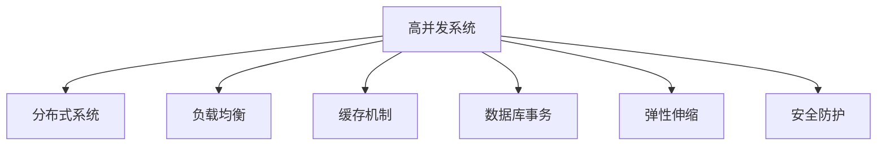

                 

# 高并发系统设计：应对大规模用户访问

> 关键词：高并发, 分布式系统, 负载均衡, 缓存机制, 数据库事务, 弹性伸缩, 安全防护

## 1. 背景介绍

### 1.1 问题由来
随着互联网技术的迅猛发展，越来越多的企业希望通过构建在线服务来提升用户体验和业务增长。然而，用户访问量的大幅增长也给系统的稳定性和可用性带来了巨大挑战。如何设计一个高可用、高性能、高可靠的系统架构，以应对大规模用户访问，成为当前IT架构设计的一个核心问题。

### 1.2 问题核心关键点
高并发系统设计需要关注以下几个核心关键点：
- 确保系统稳定性和高可用性
- 提高系统处理能力
- 优化用户体验
- 降低资源消耗和成本
- 保障系统安全

这些问题不仅涉及技术实现，还涉及业务需求、运营策略等多个层面，需要系统性地解决。本文将从设计理念和实践技术两个方面，深入探讨高并发系统设计的策略和手段。

## 2. 核心概念与联系

### 2.1 核心概念概述

为更好地理解高并发系统设计，本节将介绍几个密切相关的核心概念：

- 高并发系统：指能够同时处理大量请求，而不会因为并发用户数激增而导致系统性能大幅下降的系统。
- 分布式系统：由多台独立的计算机组成的系统，通过网络进行通信和协同工作。常见的架构包括微服务架构、服务网格等。
- 负载均衡：通过将请求分散到多台服务器上，均衡各服务器的负载，提高系统处理能力。
- 缓存机制：利用内存或磁盘空间，缓存系统常用的数据和请求结果，提高系统响应速度。
- 数据库事务：确保数据操作的原子性和一致性，避免因并发操作导致数据不一致。
- 弹性伸缩：根据业务负载动态调整系统资源，实现高可用和扩展性。
- 安全防护：防止恶意攻击和内部错误，保护系统安全。

这些核心概念之间的逻辑关系可以通过以下Mermaid流程图来展示：



这个流程图展示了一些关键概念及其之间的关系：

1. 高并发系统建立在分布式系统的基础上，通过负载均衡等机制实现高效处理。
2. 缓存机制和数据库事务分别从数据和请求角度优化系统性能。
3. 弹性伸缩和安全防护是系统高可用和稳定的重要保障。

## 3. 核心算法原理 & 具体操作步骤
### 3.1 算法原理概述

高并发系统设计涉及到多方面的算法和策略。本节将从核心原理和操作步骤两个角度，详细介绍高并发系统设计的算法和方法。

### 3.2 算法步骤详解

#### 3.2.1 分层架构设计
高并发系统设计通常采用分层架构，通过将系统分为多个层次，实现功能和服务解耦，提高系统的模块化和可维护性。分层架构的核心思想是将系统划分为多个层，每一层负责处理特定的业务逻辑，避免各层之间的耦合。

常见的分层架构包括：
- 应用层：处理用户请求，包括前端渲染、后端逻辑等。
- 业务逻辑层：实现具体的业务逻辑，如用户注册、商品下单等。
- 数据访问层：访问数据库，完成数据读写操作。
- 数据持久化层：将数据保存到持久化存储，如文件、数据库等。

#### 3.2.2 负载均衡策略
负载均衡是实现高并发系统设计的关键技术之一。负载均衡器通过将请求分散到多台服务器上，均衡各服务器的负载，避免单点故障和资源浪费。常见的负载均衡策略包括：

1. 轮询算法（Round Robin）：将请求按顺序分配到不同的服务器上，每个服务器处理相同数量的请求。
2. 随机算法（Random）：随机分配请求到不同的服务器上，每个服务器处理的请求数量可能不同。
3. IP散列算法（IP Hash）：根据客户端IP地址计算散列值，将请求分配到对应的服务器上。
4. URL散列算法（URL Hash）：根据请求URL计算散列值，将请求分配到对应的服务器上。
5. 最少连接算法（Least Connections）：将请求分配到连接数最少的服务器上，避免因负载不均导致部分服务器超负荷运行。

#### 3.2.3 缓存机制设计
缓存机制是提高系统响应速度的重要手段之一。通过将常用的数据和请求结果缓存到内存或磁盘空间中，可以减少数据库访问次数，缩短响应时间，提高系统吞吐量。

常见的缓存机制包括：
- 内存缓存：使用内存空间存储常用数据和请求结果，如Redis、Memcached等。
- 文件缓存：使用磁盘空间存储缓存数据，如LevelDB、RocksDB等。
- CDN缓存：利用CDN节点缓存静态资源，加速页面加载速度。

#### 3.2.4 数据库事务处理
数据库事务是确保数据一致性的重要手段之一。在高并发系统中，多个请求可能同时对同一数据进行读写操作，导致数据不一致问题。通过使用数据库事务，可以确保所有操作要么全部成功，要么全部失败，避免因并发操作导致数据不一致。

常见的数据库事务处理方式包括：
- 分布式事务：使用XA协议或分布式事务中间件（如Seata、TCC等），确保跨数据库或跨系统的事务一致性。
- 本地事务：在单个数据库内处理事务，使用本地事务管理器（如MySQL的InnoDB引擎），确保单库内的数据一致性。

#### 3.2.5 弹性伸缩策略
弹性伸缩是实现高并发系统高可用和扩展性的关键手段之一。通过根据业务负载动态调整系统资源，可以避免因突发的用户访问高峰导致系统崩溃或响应延迟。

常见的弹性伸缩策略包括：
- 水平扩展：通过增加服务器数量，横向扩展系统处理能力，如添加云服务器、Kubernetes等。
- 垂直扩展：通过增加单台服务器的计算资源，纵向扩展系统处理能力，如升级CPU、内存等。
- 自动伸缩：根据业务负载自动调整服务器数量和资源，如使用AWS的Auto Scaling、Kubernetes的Horizontal Pod Autoscaler等。

#### 3.2.6 安全防护措施
安全防护是保障高并发系统安全性的重要手段之一。通过防止恶意攻击和内部错误，可以确保系统的稳定性和可靠性。

常见的安全防护措施包括：
- 防火墙：使用网络防火墙，防止非法访问和攻击。
- 加密传输：使用SSL/TLS协议，确保数据传输的安全性。
- 认证和授权：使用OAuth、JWT等认证机制，确保用户的合法性。
- 异常检测：使用异常检测算法，识别和拦截恶意行为。

### 3.3 算法优缺点

高并发系统设计的主要优点包括：
- 提高系统处理能力，满足大规模用户访问需求。
- 实现系统高可用和扩展性，提升用户体验。
- 优化系统资源消耗，降低成本。
- 保障系统安全性，防止恶意攻击和内部错误。

同时，该方法也存在一定的局限性：
- 架构复杂度高，设计和维护难度大。
- 缓存机制和分布式事务可能导致数据一致性问题。
- 弹性伸缩策略需要较高的技术和管理水平。
- 安全防护需要持续的监控和维护。

尽管存在这些局限性，但高并发系统设计仍然是当前IT架构设计的重要范式，特别是在处理大规模用户访问时具有不可替代的优势。未来相关研究的重点在于如何进一步简化系统架构，提高系统可靠性和安全性，同时兼顾性能和成本等因素。

### 3.4 算法应用领域

高并发系统设计的应用领域非常广泛，覆盖了各个行业的在线服务系统，包括但不限于：

- 电商网站：如淘宝、京东、拼多多等，需要处理海量交易和用户访问。
- 社交媒体：如微信、微博、抖音等，需要处理实时消息和视频流。
- 在线游戏：如王者荣耀、和平精英、英雄联盟等，需要处理实时对战和用户互动。
- 金融服务：如支付宝、微信支付、各大银行在线系统等，需要处理高额交易和资金安全。
- 企业服务：如OA系统、CRM系统、ERP系统等，需要处理内部业务和数据协同。
- 公共服务：如政府网站、在线医疗、教育平台等，需要处理高并发用户访问和数据共享。

## 4. 数学模型和公式 & 详细讲解 & 举例说明

### 4.1 数学模型构建

本节将使用数学语言对高并发系统设计进行更加严格的刻画。

设系统总请求数为 $N$，每台服务器每秒处理的请求数为 $R$，每台服务器的响应时间为 $T$，则系统的吞吐量 $S$ 可以表示为：

$$
S = N \times R \times T
$$

其中 $S$ 表示单位时间内处理的总请求数。为了提高系统吞吐量，可以采用以下几种方法：

1. 增加服务器数量：通过增加服务器数量，提高系统每秒处理的请求数 $R$。
2. 提高服务器响应时间：通过优化系统架构和算法，提高每台服务器的响应时间 $T$。
3. 优化请求分布：通过负载均衡等机制，优化请求在服务器之间的分布，减少请求积压。

### 4.2 公式推导过程

以下我们以单台服务器为例，推导单位时间内的请求数 $R$ 和响应时间 $T$ 的关系。

假设系统每秒处理的请求数为 $R$，每台服务器的响应时间为 $T$，则单位时间内的请求数 $R$ 可以表示为：

$$
R = \frac{N}{T}
$$

其中 $N$ 表示单位时间内的总请求数。

将上式代入吞吐量公式 $S = N \times R \times T$，得：

$$
S = N^2
$$

该公式表明，吞吐量与单位时间内的总请求数的平方成正比。因此，为了提高系统吞吐量，可以通过增加请求数 $N$ 或提高响应时间 $T$ 来实现。但后者在实际应用中往往难以实现，因此增加服务器数量成为提高吞吐量的主要手段。

### 4.3 案例分析与讲解

以电商平台为例，分析高并发系统设计的实现细节。

假设某电商平台每秒需要处理1000个请求，每台服务器每秒可以处理100个请求。为了提高系统吞吐量，可以采用以下几种方法：

1. 增加服务器数量：将2台服务器并行处理，每台服务器处理500个请求，总吞吐量提高到1000个请求每秒。
2. 优化服务器配置：通过升级服务器硬件，将单台服务器的响应时间从1秒降低到0.5秒，总吞吐量提高到2000个请求每秒。
3. 优化请求分布：通过负载均衡机制，将请求均匀分配到3台服务器上，每台服务器处理333个请求，总吞吐量提高到1000个请求每秒。

从以上案例可以看出，高并发系统设计可以通过多种手段来提升系统性能，不同方法的组合可以带来更好的效果。

## 5. 项目实践：代码实例和详细解释说明

### 5.1 开发环境搭建

在进行高并发系统设计实践前，我们需要准备好开发环境。以下是使用Python和Django框架开发的环境配置流程：

1. 安装Anaconda：从官网下载并安装Anaconda，用于创建独立的Python环境。

2. 创建并激活虚拟环境：
```bash
conda create -n high-concurrency python=3.8 
conda activate high-concurrency
```

3. 安装Django：
```bash
pip install django
```

4. 安装Gunicorn：
```bash
pip install gunicorn
```

5. 安装Nginx：
```bash
sudo apt-get update
sudo apt-get install nginx
sudo systemctl start nginx
```

完成上述步骤后，即可在`high-concurrency`环境中开始高并发系统设计的实践。

### 5.2 源代码详细实现

下面是使用Django和Gunicorn搭建高并发Web服务的示例代码。

首先，创建一个Django项目：

```bash
django-admin startproject high-concurrency
```

然后，创建一个Django应用：

```bash
cd high-concurrency
python manage.py startapp myapp
```

在应用中，编写视图函数：

```python
from django.http import HttpResponse

def index(request):
    return HttpResponse("Hello, high-concurrency!")
```

在`settings.py`文件中，配置Gunicorn服务器：

```python
...
INSTALLED_APPS = [
    ...
    'myapp',
]
...
```

最后，启动Gunicorn服务器：

```bash
gunicorn myapp.wsgi:application
```

现在，我们可以通过Nginx将请求分配到多台Gunicorn服务器上，实现高并发Web服务的负载均衡。

### 5.3 代码解读与分析

让我们再详细解读一下关键代码的实现细节：

**myapp应用**：
- `views.py`文件：定义了Web服务的视图函数，返回简单的欢迎消息。
- `models.py`文件：定义了Django应用的数据模型，本例中未使用。

**settings.py文件**：
- `INSTALLED_APPS`列表：列出了所有Django应用，本例中包含自定义应用`myapp`。

**gunicorn服务器**：
- `myapp.wsgi:application`：定义了Gunicorn服务器的主入口，接收Django应用。

通过以上步骤，我们成功搭建了一个高并发Web服务，并通过Nginx实现了请求的负载均衡。

### 5.4 运行结果展示

通过访问`http://localhost:8000`，我们可以看到欢迎消息的输出。

```
Hello, high-concurrency!
```

## 6. 实际应用场景

### 6.1 电商网站

高并发系统设计在电商网站中得到了广泛应用。电商网站需要处理海量交易和用户访问，通过高并发系统设计，可以确保系统的稳定性和高可用性。

在技术实现上，可以采用以下几种手段：
- 使用分布式数据库，如MySQL Cluster、Redis等，实现数据的水平扩展。
- 采用CDN缓存静态资源，如图片、视频等，加速页面加载速度。
- 使用负载均衡器，如Nginx、HAProxy等，均衡各服务器的负载。
- 使用缓存机制，如Redis、Memcached等，减少数据库访问次数。
- 使用分布式锁，如Redisson、Zookeeper等，保证系统事务的一致性。

### 6.2 社交媒体

社交媒体需要处理实时消息和视频流，对系统的高可用和扩展性要求较高。高并发系统设计能够满足社交媒体的业务需求。

在技术实现上，可以采用以下几种手段：
- 使用消息队列，如RabbitMQ、Kafka等，实现异步消息处理。
- 使用缓存机制，如Redis、Memcached等，缓存热门消息和视频流。
- 使用负载均衡器，如Nginx、HAProxy等，均衡各服务器的负载。
- 使用CDN缓存静态资源，如图片、视频等，加速页面加载速度。
- 使用分布式锁，如Redisson、Zookeeper等，保证系统事务的一致性。

### 6.3 在线游戏

在线游戏需要处理实时对战和用户互动，对系统的高可用和响应速度要求较高。高并发系统设计能够满足在线游戏的业务需求。

在技术实现上，可以采用以下几种手段：
- 使用分布式数据库，如MySQL Cluster、Redis等，实现数据的水平扩展。
- 使用缓存机制，如Redis、Memcached等，缓存用户数据和对战数据。
- 使用负载均衡器，如Nginx、HAProxy等，均衡各服务器的负载。
- 使用CDN缓存静态资源，如图片、视频等，加速页面加载速度。
- 使用分布式锁，如Redisson、Zookeeper等，保证系统事务的一致性。

### 6.4 金融服务

金融服务需要处理高额交易和资金安全，对系统的高可用和安全性要求较高。高并发系统设计能够满足金融服务的业务需求。

在技术实现上，可以采用以下几种手段：
- 使用分布式数据库，如MySQL Cluster、Redis等，实现数据的水平扩展。
- 使用缓存机制，如Redis、Memcached等，缓存用户数据和交易数据。
- 使用负载均衡器，如Nginx、HAProxy等，均衡各服务器的负载。
- 使用CDN缓存静态资源，如图片、视频等，加速页面加载速度。
- 使用分布式锁，如Redisson、Zookeeper等，保证系统事务的一致性。
- 使用安全防护措施，如防火墙、SSL/TLS、认证和授权等，保障系统安全。

## 7. 工具和资源推荐

### 7.1 学习资源推荐

为了帮助开发者系统掌握高并发系统设计的理论基础和实践技巧，这里推荐一些优质的学习资源：

1. 《高并发系统设计原理与实践》系列博文：由高并发系统专家撰写，深入浅出地介绍了高并发系统设计的原理和实践。

2. CS345N《分布式系统》课程：斯坦福大学开设的分布式系统课程，有Lecture视频和配套作业，带你入门分布式系统的基础概念和经典模型。

3. 《分布式系统设计与分析》书籍：清华大学出版社出版的经典教材，详细介绍了分布式系统设计的基本概念和实现方法。

4. 《高并发编程》书籍：人民邮电出版社出版的实用指南，涵盖了Java、Python等主流编程语言的高并发编程技巧和实践经验。

5. Google Cloud、AWS等云服务提供商的官方文档：详细介绍了高可用、弹性伸缩、负载均衡等服务的实现方法，是实践学习的必备资料。

通过对这些资源的学习实践，相信你一定能够快速掌握高并发系统设计的精髓，并用于解决实际的系统问题。

### 7.2 开发工具推荐

高效的开发离不开优秀的工具支持。以下是几款用于高并发系统设计开发的常用工具：

1. Python：一种高层次的编程语言，简单易学，具有良好的可读性和可维护性。Django、Flask等Web框架基于Python开发，易于快速迭代和扩展。

2. Django：一个开源的Web框架，提供了快速开发Web应用的框架结构和API，支持高并发和分布式部署。

3. Flask：一个轻量级的Web框架，提供了灵活的API和插件系统，支持高并发和分布式部署。

4. Gunicorn：一个高性能的Web服务器，支持Python Web应用的多线程和多进程处理，能够应对高并发请求。

5. Nginx：一个高性能的Web服务器，支持反向代理、负载均衡等功能，能够均衡各服务器的负载。

6. HAProxy：一个高性能的负载均衡器，支持多协议和数据监控功能，能够均衡各服务器的负载。

合理利用这些工具，可以显著提升高并发系统设计的开发效率，加快创新迭代的步伐。

### 7.3 相关论文推荐

高并发系统设计的研究源于学界的持续研究。以下是几篇奠基性的相关论文，推荐阅读：

1. 《Large-Scale Parallel Machine Learning》论文：提出了大规模分布式机器学习算法和系统，为高并发系统设计提供了理论基础。

2. 《Spark: Cluster Computing with Fault Tolerance》论文：介绍了Spark分布式计算框架的设计和实现，为高并发系统设计提供了实践参考。

3. 《Paxos Made Simple》论文：介绍了Paxos算法的设计和实现，为分布式数据库和高可用系统提供了理论基础。

4. 《Zookeeper: A Fault-Tolerant Distributed Coordination Service for Cloud Computing》论文：介绍了Zookeeper分布式协调服务的实现和应用，为高并发系统设计提供了数据一致性解决方案。

5. 《Redis：The Data Structure Server》书籍：详细介绍了Redis分布式内存数据库的设计和实现，为高并发系统设计提供了缓存解决方案。

这些论文代表了大规模分布式系统设计的研究脉络。通过学习这些前沿成果，可以帮助研究者把握学科前进方向，激发更多的创新灵感。

## 8. 总结：未来发展趋势与挑战

### 8.1 总结

本文对高并发系统设计的核心概念和操作步骤进行了详细讲解，介绍了分层架构设计、负载均衡、缓存机制、数据库事务、弹性伸缩和安全防护等关键技术，并结合具体案例进行了详细分析。通过本文的系统梳理，可以看到，高并发系统设计在当前IT架构设计中具有重要地位，通过合理的技术手段，可以应对大规模用户访问，保障系统的稳定性和高可用性。

### 8.2 未来发展趋势

展望未来，高并发系统设计将呈现以下几个发展趋势：

1. 微服务架构成为主流：微服务架构通过将系统划分为多个小服务，实现功能和服务解耦，提高系统的模块化和可维护性。微服务架构将逐步成为高并发系统设计的主流架构。

2. 容器化和Kubernetes普及：容器化技术通过将应用打包为容器，实现快速部署和扩展。Kubernetes作为容器编排工具，通过动态调整资源，实现系统的弹性和稳定性。

3. 边缘计算和雾计算发展：边缘计算和雾计算通过将计算和存储资源下沉到网络边缘，减少延迟和带宽消耗，提高系统的响应速度。

4. 分布式数据库和NoSQL数据库普及：分布式数据库和NoSQL数据库通过水平扩展，实现数据的可靠性和高可用性。

5. 数据和计算分离：云计算平台通过将数据和计算分离，实现资源的高效利用和灵活调配。

6. 智能运维和自动化运维发展：智能运维和自动化运维通过AI和ML技术，实现系统的自动化监控、故障预测和自愈。

以上趋势凸显了高并发系统设计的广阔前景。这些方向的探索发展，必将进一步提升系统的性能和可用性，为互联网应用带来新的突破。

### 8.3 面临的挑战

尽管高并发系统设计已经取得了瞩目成就，但在迈向更加智能化、普适化应用的过程中，它仍面临着诸多挑战：

1. 架构复杂度高：高并发系统设计通常采用分布式架构，导致系统架构复杂，设计和维护难度大。

2. 数据一致性问题：缓存机制和分布式事务可能导致数据一致性问题，需要更多的技术手段来解决。

3. 弹性伸缩难度大：根据业务负载动态调整系统资源，需要较高的技术和管理水平。

4. 安全防护困难：防止恶意攻击和内部错误，需要持续的监控和维护。

尽管存在这些挑战，但高并发系统设计仍然是当前IT架构设计的重要范式，特别是在处理大规模用户访问时具有不可替代的优势。未来相关研究的重点在于如何进一步简化系统架构，提高系统可靠性和安全性，同时兼顾性能和成本等因素。

### 8.4 研究展望

面对高并发系统设计所面临的挑战，未来的研究需要在以下几个方面寻求新的突破：

1. 简化系统架构：通过引入容器化和Kubernetes等技术，简化系统架构，提高系统的可维护性和扩展性。

2. 提高数据一致性：通过引入分布式事务和分布式锁等技术，解决缓存机制和分布式事务导致的数据一致性问题。

3. 优化弹性伸缩：通过引入自动化运维和智能运维等技术，优化弹性伸缩策略，实现系统的自愈和自调。

4. 加强安全防护：通过引入安全防护措施，如防火墙、SSL/TLS、认证和授权等，保障系统安全。

这些研究方向的探索，必将引领高并发系统设计技术迈向更高的台阶，为构建稳定、可靠、高效的高并发系统铺平道路。面向未来，高并发系统设计还需要与其他人工智能技术进行更深入的融合，如知识表示、因果推理、强化学习等，多路径协同发力，共同推动高并发系统设计的进步。只有勇于创新、敢于突破，才能不断拓展高并发系统的边界，让系统更好地服务于广大用户。

## 9. 附录：常见问题与解答

**Q1：高并发系统设计是否适用于所有业务场景？**

A: 高并发系统设计适用于需要处理大规模用户访问的业务场景，如电商网站、社交媒体、在线游戏、金融服务等。但对于一些无需高并发的业务场景，如简单的内部管理系统，可能不需要采用高并发系统设计。

**Q2：如何衡量高并发系统设计的性能？**

A: 高并发系统设计的性能可以通过以下几个指标来衡量：
- 吞吐量：单位时间内处理的请求数。
- 响应时间：处理单个请求所需的时间。
- 延迟：处理请求的平均延迟时间。
- 错误率：处理请求时发生的错误率。

通过监控这些指标，可以评估系统的性能和稳定性，及时发现和解决问题。

**Q3：如何优化高并发系统设计的缓存机制？**

A: 优化高并发系统设计的缓存机制可以采取以下几种方法：
- 减少缓存数量：避免缓存不常用的数据，减少内存消耗。
- 采用多级缓存：通过将缓存分为多个层级，提高缓存的命中率。
- 使用缓存失效策略：定期清理缓存数据，避免缓存过时。
- 使用缓存预热机制：预先将常用数据加载到缓存中，提高响应速度。

**Q4：高并发系统设计中如何进行弹性伸缩？**

A: 高并发系统设计中的弹性伸缩可以采取以下几种方法：
- 使用容器化和Kubernetes：通过容器化和Kubernetes等技术，快速部署和扩展应用。
- 采用负载均衡器：使用负载均衡器将请求分散到多台服务器上，均衡各服务器的负载。
- 使用分布式数据库：通过分布式数据库实现数据的水平扩展，提高系统的可扩展性。
- 使用自动化运维：通过自动化运维工具，实现系统的动态调整和自调。

**Q5：高并发系统设计中如何进行安全防护？**

A: 高并发系统设计中的安全防护可以采取以下几种方法：
- 使用防火墙：使用网络防火墙，防止非法访问和攻击。
- 加密传输：使用SSL/TLS协议，确保数据传输的安全性。
- 认证和授权：使用OAuth、JWT等认证机制，确保用户的合法性。
- 异常检测：使用异常检测算法，识别和拦截恶意行为。

通过以上方法，可以构建一个安全可靠的高并发系统设计，保障系统的稳定性和用户数据的安全。

通过本文的系统梳理，可以看到，高并发系统设计在当前IT架构设计中具有重要地位，通过合理的技术手段，可以应对大规模用户访问，保障系统的稳定性和高可用性。未来相关研究的重点在于如何进一步简化系统架构，提高系统可靠性和安全性，同时兼顾性能和成本等因素。只有勇于创新、敢于突破，才能不断拓展高并发系统的边界，让系统更好地服务于广大用户。

