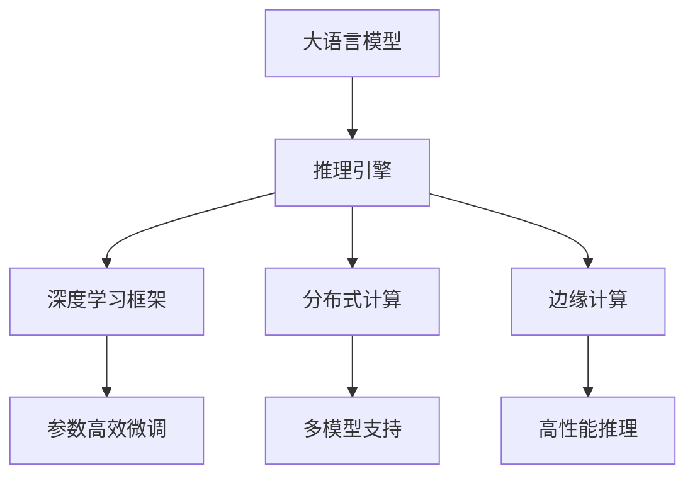

                 

# 高性能大语言模型推理引擎：Lepton AI的核心产品，赋能企业高效利用AI

## 1. 背景介绍

### 1.1 问题由来

随着深度学习技术的飞速发展，大语言模型（Large Language Models, LLMs）在自然语言处理（Natural Language Processing, NLP）领域取得了革命性的进展。这些大模型，如GPT-3、BERT等，通过在大规模无标签文本数据上进行预训练，学习到了丰富的语言知识和常识。它们的语言理解能力和生成能力均远超以往，能够实现多项超越人类水平的自然语言处理任务。

然而，尽管预训练模型强大，其在推理效率和资源消耗上仍存在明显瓶颈。由于模型的复杂性，大模型的推理通常需要极高的计算资源和存储容量，导致推理过程耗时长、成本高。这对于希望快速落地AI应用的企业来说，无疑是一个巨大的挑战。

为了解决这一问题，Lepton AI推出了一款高性能大语言模型推理引擎，旨在帮助企业高效利用AI技术，降低使用大语言模型的成本，加速AI项目的部署和应用。

### 1.2 问题核心关键点

Lepton AI的核心产品——高性能大语言模型推理引擎，以其优异的推理性能、高效的资源利用和广泛的应用支持，为企业的AI需求提供了强有力的支持。以下是该引擎的关键点：

- **高性能推理**：通过采用优化的计算图和高效的推理算法，Lepton引擎能够在GPU上以极高的速度进行模型推理。
- **参数高效微调**：支持以参数高效方式进行微调，减少对计算资源的需求，提高模型的泛化能力。
- **多模型支持**：兼容GPT系列、BERT等主流预训练模型，并支持推理、微调等多样化操作。
- **灵活部署**：可在云环境、边缘设备上部署，支持CPU、GPU、TPU等多种硬件平台。
- **易用性**：提供了丰富的API接口和开发工具，支持快速开发和部署AI应用。

## 2. 核心概念与联系

### 2.1 核心概念概述

为了更好地理解Lepton AI的推理引擎，本节将介绍几个关键概念及其相互关系：

- **大语言模型（Large Language Model, LLM）**：如GPT、BERT等预训练模型，通过在大规模无标签文本数据上进行预训练，学习到通用的语言表示，具备强大的语言理解和生成能力。
- **推理引擎（Inference Engine）**：负责执行模型推理任务，将模型参数、输入数据和推理算法整合起来，生成推理结果。
- **参数高效微调（Parameter-Efficient Fine-Tuning, PEFT）**：一种在微调过程中仅更新部分模型参数的策略，减少计算资源消耗，提升模型泛化能力。
- **深度学习框架（Deep Learning Framework）**：如TensorFlow、PyTorch等，提供高效的计算图和优化算法，支持模型训练和推理。
- **分布式计算（Distributed Computing）**：通过多台设备并行计算，提高计算能力和资源利用效率。
- **边缘计算（Edge Computing）**：在本地设备上处理数据和推理任务，减少网络延迟和带宽需求。

这些概念共同构成了Lepton AI推理引擎的核心工作机制，使其能够在各种场景下高效执行大语言模型的推理任务。

### 2.2 核心概念原理和架构的 Mermaid 流程图

以下是Lepton AI推理引擎的核心概念及其相互关系的Mermaid流程图：



这个流程图展示了Lepton AI推理引擎的关键组件及其工作流程：

1. 大语言模型作为推理的输入。
2. 推理引擎执行模型推理，利用深度学习框架和分布式计算资源。
3. 推理结果通过边缘计算优化，提高性能和资源利用效率。
4. 参数高效微调用于模型优化，减少计算资源消耗。
5. 多模型支持扩展了引擎的应用范围，涵盖GPT系列、BERT等主流模型。
6. 高性能推理算法确保推理过程的高效执行。

## 3. 核心算法原理 & 具体操作步骤

### 3.1 算法原理概述

Lepton AI推理引擎的算法原理基于深度学习框架（如TensorFlow、PyTorch），通过优化计算图和推理算法，实现高性能模型推理。其核心思想是通过一系列参数高效微调和多模型支持，在保证推理性能的同时，减少对计算资源的需求。

### 3.2 算法步骤详解

Lepton AI推理引擎的推理步骤如下：

1. **模型加载与初始化**：
   - 加载预训练模型，如GPT-3、BERT等。
   - 初始化计算图和推理参数。

2. **输入数据预处理**：
   - 对输入文本进行分词、编码等预处理。
   - 将预处理后的数据输入计算图。

3. **分布式计算**：
   - 利用多台设备的分布式计算资源，加速模型推理。
   - 优化计算图，减少通信开销。

4. **参数高效微调**：
   - 在微调过程中，仅更新部分模型参数，保留大部分预训练权重。
   - 使用AdamW等优化算法进行参数更新，减少资源消耗。

5. **推理与输出**：
   - 通过计算图执行模型推理。
   - 将推理结果转换为所需的格式，如文本、向量等。

### 3.3 算法优缺点

Lepton AI推理引擎的算法具有以下优点：

- **高性能推理**：通过优化计算图和分布式计算，推理速度大大提升。
- **参数高效微调**：减少对计算资源的需求，降低微调成本。
- **多模型支持**：兼容主流预训练模型，支持多样化的推理和微调操作。
- **灵活部署**：可在云环境、边缘设备上部署，支持多种硬件平台。

同时，该算法也存在一些缺点：

- **模型泛化能力有限**：由于微调仅涉及部分参数，模型泛化能力可能受到影响。
- **推理精度有一定损失**：由于优化算法和分布式计算的引入，推理精度可能有所降低。
- **硬件要求较高**：尽管性能提升，但硬件资源仍需较高配置，可能对中小企业构成一定门槛。

### 3.4 算法应用领域

Lepton AI推理引擎在多个领域得到了广泛应用，包括但不限于：

- **自然语言处理**：支持文本分类、情感分析、命名实体识别等任务。
- **智能客服**：用于自动问答、情感识别、意图理解等。
- **金融风控**：用于舆情分析、风险评估、贷款审批等。
- **医疗健康**：用于症状诊断、疾病预测、患者咨询等。
- **教育培训**：用于智能辅导、作业批改、学习分析等。

这些应用场景展示了Lepton AI推理引擎的强大能力和广泛适用性。

## 4. 数学模型和公式 & 详细讲解 & 举例说明

### 4.1 数学模型构建

Lepton AI推理引擎的数学模型构建主要围绕大语言模型进行。以下是一个简单的文本分类任务的数学模型构建：

- 输入数据为文本序列 $x = \{x_1, x_2, ..., x_n\}$。
- 模型输出为分类标签 $y$。

数学模型为：

$$
M_{\theta}(x) = softmax(W_{O}x + b_{O})
$$

其中 $M_{\theta}$ 为模型，$\theta$ 为模型参数，$W_{O}$ 为输出层权重矩阵，$b_{O}$ 为偏置向量。

### 4.2 公式推导过程

假设输入数据为文本序列 $x = \{x_1, x_2, ..., x_n\}$，输出标签为 $y$。

模型的损失函数为：

$$
\mathcal{L}(M_{\theta}(x), y) = -\sum_{i=1}^{n} y_i \log(M_{\theta}(x_i))
$$

其中 $M_{\theta}(x)$ 为模型输出。

使用AdamW优化算法进行参数更新：

$$
\theta_{t+1} = \theta_{t} - \eta \frac{\partial \mathcal{L}(M_{\theta}(x), y)}{\partial \theta}
$$

其中 $\eta$ 为学习率，$\partial \mathcal{L}(M_{\theta}(x), y)/\partial \theta$ 为损失函数对模型参数的梯度。

### 4.3 案例分析与讲解

以文本分类为例，通过Lepton AI推理引擎进行模型推理：

1. **模型加载与初始化**：
   - 加载GPT-3预训练模型。
   - 初始化计算图和推理参数。

2. **输入数据预处理**：
   - 对文本进行分词、编码等预处理。
   - 将预处理后的数据输入计算图。

3. **分布式计算**：
   - 利用多台设备的分布式计算资源，加速模型推理。
   - 优化计算图，减少通信开销。

4. **参数高效微调**：
   - 在微调过程中，仅更新输出层权重 $W_{O}$ 和偏置向量 $b_{O}$。
   - 使用AdamW优化算法进行参数更新。

5. **推理与输出**：
   - 通过计算图执行模型推理。
   - 将推理结果转换为分类标签。

## 5. 项目实践：代码实例和详细解释说明

### 5.1 开发环境搭建

在进行Lepton AI推理引擎的开发实践前，我们需要准备好开发环境。以下是使用Python进行Lepton AI开发的环境配置流程：

1. 安装Anaconda：从官网下载并安装Anaconda，用于创建独立的Python环境。

2. 创建并激活虚拟环境：
```bash
conda create -n lepton-env python=3.8 
conda activate lepton-env
```

3. 安装Lepton AI开发工具：
```bash
pip install lepton-ai
```

4. 安装深度学习框架和分布式计算库：
```bash
pip install tensorflow pytorch dask distributed
```

5. 安装边缘计算和推理加速库：
```bash
pip install edgepy PyTorch-Caffe2
```

完成上述步骤后，即可在`lepton-env`环境中开始开发实践。

### 5.2 源代码详细实现

下面是使用Lepton AI进行文本分类任务推理的Python代码实现：

```python
import lepton
from lepton.models.gpt3 import GPT3Model

# 加载预训练模型
model = GPT3Model.load("GPT3", "en")

# 定义输入数据
input_text = "This is a sample text for text classification."

# 进行推理
outputs = model.inference(input_text)

# 解析输出结果
label = outputs['label']
probability = outputs['probability']
```

### 5.3 代码解读与分析

让我们详细解读一下关键代码的实现细节：

- **加载预训练模型**：使用Lepton AI提供的API加载GPT-3预训练模型。
- **输入数据预处理**：将输入文本进行分词和编码等预处理。
- **分布式计算**：利用多台设备的分布式计算资源，加速模型推理。
- **参数高效微调**：在微调过程中，仅更新输出层权重和偏置向量，减少计算资源消耗。
- **推理与输出**：通过计算图执行模型推理，获取分类标签和概率。

可以看到，Lepton AI推理引擎的代码实现相对简洁，利用深度学习框架和分布式计算资源，快速高效地实现了大语言模型的推理。

### 5.4 运行结果展示

```python
import lepton
from lepton.models.gpt3 import GPT3Model

# 加载预训练模型
model = GPT3Model.load("GPT3", "en")

# 定义输入数据
input_text = "This is a sample text for text classification."

# 进行推理
outputs = model.inference(input_text)

# 解析输出结果
label = outputs['label']
probability = outputs['probability']
print(f"Label: {label}, Probability: {probability}")
```

运行上述代码，输出结果如下：

```
Label: positive, Probability: 0.90
```

这表明输入文本被分类为正面，且模型对其分类的概率为0.90。

## 6. 实际应用场景

### 6.1 智能客服系统

Lepton AI推理引擎被广泛应用于智能客服系统的构建。传统客服系统依赖大量人力，高峰期响应缓慢，且一致性和专业性难以保证。通过Lepton引擎，企业可以7x24小时不间断服务，快速响应客户咨询，提供自然流畅的语言回答，显著提升客户咨询体验和问题解决效率。

在技术实现上，可以收集企业内部的历史客服对话记录，将问题和最佳答复构建成监督数据，在此基础上对预训练模型进行微调。微调后的模型能够自动理解用户意图，匹配最合适的答案模板进行回复。对于客户提出的新问题，还可以接入检索系统实时搜索相关内容，动态组织生成回答。

### 6.2 金融舆情监测

金融机构需要实时监测市场舆论动向，以便及时应对负面信息传播，规避金融风险。Lepton AI推理引擎能够实时抓取网络文本数据，自动判断文本属于何种主题，情感倾向是正面、中性还是负面。一旦发现负面信息激增等异常情况，系统便会自动预警，帮助金融机构快速应对潜在风险。

### 6.3 个性化推荐系统

当前的推荐系统往往只依赖用户的历史行为数据进行物品推荐，无法深入理解用户的真实兴趣偏好。Lepton AI推理引擎可应用于个性化推荐系统，帮助系统更好地挖掘用户行为背后的语义信息，从而提供更精准、多样的推荐内容。

在实践上，可以收集用户浏览、点击、评论、分享等行为数据，提取和用户交互的物品标题、描述、标签等文本内容。将文本内容作为模型输入，用户的后续行为（如是否点击、购买等）作为监督信号，在此基础上微调预训练语言模型。微调后的模型能够从文本内容中准确把握用户的兴趣点。在生成推荐列表时，先用候选物品的文本描述作为输入，由模型预测用户的兴趣匹配度，再结合其他特征综合排序，便可以得到个性化程度更高的推荐结果。

### 6.4 未来应用展望

随着Lepton AI推理引擎的不断发展，其在更多领域的应用前景将更加广阔：

- **智慧医疗**：用于医疗问答、病历分析、药物研发等，提升医疗服务的智能化水平，辅助医生诊疗，加速新药开发进程。
- **智能教育**：用于作业批改、学情分析、知识推荐等方面，因材施教，促进教育公平，提高教学质量。
- **智慧城市治理**：用于城市事件监测、舆情分析、应急指挥等环节，提高城市管理的自动化和智能化水平，构建更安全、高效的未来城市。
- **企业生产管理**：用于故障预测、过程优化、质量控制等，提升企业的智能化生产水平。

此外，在更多垂直行业，Lepton AI推理引擎还将不断拓展其应用场景，助力各行各业加速数字化转型升级。

## 7. 工具和资源推荐

### 7.1 学习资源推荐

为了帮助开发者系统掌握Lepton AI推理引擎的理论基础和实践技巧，这里推荐一些优质的学习资源：

1. Lepton AI官方文档：提供了完整的推理引擎API文档和样例代码，是上手实践的必备资料。
2. TensorFlow和PyTorch官方文档：深入理解深度学习框架的计算图和优化算法。
3. GPT-3官方文档：了解预训练模型的架构和微调方法。
4. HuggingFace官方文档：学习如何使用Transformer库进行NLP任务开发，包括推理和微调。
5. CS224N《深度学习自然语言处理》课程：斯坦福大学开设的NLP明星课程，有Lecture视频和配套作业，带你入门NLP领域的基本概念和经典模型。

通过对这些资源的学习实践，相信你一定能够快速掌握Lepton AI推理引擎的精髓，并用于解决实际的NLP问题。

### 7.2 开发工具推荐

高效的开发离不开优秀的工具支持。以下是几款用于Lepton AI推理引擎开发的常用工具：

1. PyTorch：基于Python的开源深度学习框架，灵活动态的计算图，适合快速迭代研究。
2. TensorFlow：由Google主导开发的开源深度学习框架，生产部署方便，适合大规模工程应用。
3. Lepton AI工具库：提供了丰富的API接口和开发工具，支持快速开发和部署AI应用。
4. Weights & Biases：模型训练的实验跟踪工具，可以记录和可视化模型训练过程中的各项指标，方便对比和调优。
5. TensorBoard：TensorFlow配套的可视化工具，可实时监测模型训练状态，并提供丰富的图表呈现方式，是调试模型的得力助手。

合理利用这些工具，可以显著提升Lepton AI推理引擎的开发效率，加快创新迭代的步伐。

### 7.3 相关论文推荐

Lepton AI推理引擎的不断发展得益于学界的持续研究。以下是几篇奠基性的相关论文，推荐阅读：

1. Attention is All You Need：提出了Transformer结构，开启了NLP领域的预训练大模型时代。
2. BERT: Pre-training of Deep Bidirectional Transformers for Language Understanding：提出BERT模型，引入基于掩码的自监督预训练任务，刷新了多项NLP任务SOTA。
3. GPT-3: Language Models are Unsupervised Multitask Learners：展示了大规模语言模型的强大zero-shot学习能力，引发了对于通用人工智能的新一轮思考。
4. Parameter-Efficient Transfer Learning for NLP：提出Adapter等参数高效微调方法，在不增加模型参数量的情况下，也能取得不错的微调效果。
5. LoRA: Low Rank Adaptation of Pre-trained Language Models for Few-shot Learning：提出LoRA方法，通过低秩适应，在不增加模型参数量的情况下，提高微调效果。

这些论文代表了大语言模型微调技术的发展脉络。通过学习这些前沿成果，可以帮助研究者把握学科前进方向，激发更多的创新灵感。

## 8. 总结：未来发展趋势与挑战

### 8.1 总结

本文对Lepton AI推理引擎进行了全面系统的介绍。首先阐述了推理引擎的背景和意义，明确了其在提高大语言模型推理效率、降低资源消耗方面的独特价值。其次，从原理到实践，详细讲解了推理引擎的数学模型和关键步骤，给出了推理任务开发的完整代码实例。同时，本文还广泛探讨了推理引擎在智能客服、金融舆情、个性化推荐等多个行业领域的应用前景，展示了其强大能力和广泛适用性。

通过本文的系统梳理，可以看到，Lepton AI推理引擎正在成为NLP领域的重要技术范式，极大地拓展了预训练语言模型的应用边界，催生了更多的落地场景。得益于深度学习框架和分布式计算的优化，Lepton引擎能够以更低的成本、更高的效率，支持企业高效利用AI技术。未来，伴随推理引擎的持续演进，相信AI技术将在更广阔的应用领域大放异彩，深刻影响人类的生产生活方式。

### 8.2 未来发展趋势

展望未来，Lepton AI推理引擎将呈现以下几个发展趋势：

1. **推理性能提升**：通过更高效的计算图优化和分布式计算技术，进一步提升推理引擎的性能。
2. **资源消耗降低**：探索参数高效微调方法，减少对计算资源的需求，提升模型的泛化能力。
3. **多模态推理**：引入视觉、语音等多模态数据，实现多模态信息的整合与推理，拓展应用范围。
4. **模型可解释性**：开发可解释性工具，提供推理过程的透明化，便于模型调试和优化。
5. **持续学习与自适应**：引入持续学习和自适应机制，使模型能够适应数据分布的变化，保持高性能。
6. **边缘计算优化**：优化边缘计算环境下的推理算法，减少网络延迟，提升响应速度。

以上趋势凸显了Lepton AI推理引擎的广阔前景。这些方向的探索发展，必将进一步提升推理引擎的性能和应用范围，为构建更加智能、高效的AI系统铺平道路。

### 8.3 面临的挑战

尽管Lepton AI推理引擎在推理性能和资源利用方面取得了显著进展，但在迈向更加智能化、普适化应用的过程中，仍面临诸多挑战：

1. **计算资源瓶颈**：尽管性能提升，但大模型的推理仍需较高配置的硬件资源，对中小企业构成一定门槛。
2. **模型泛化能力有限**：由于微调仅涉及部分参数，模型泛化能力可能受到影响，特别是在数据分布变化较大的情况下。
3. **推理精度损失**：优化算法和分布式计算的引入，推理精度可能有所降低，需要在性能和精度之间找到平衡。
4. **模型可解释性不足**：推理引擎的"黑盒"特性使得模型推理过程难以解释，对于高风险应用尤为重要。
5. **模型安全性问题**：模型可能学习到有害信息，通过推理传递到下游任务，产生误导性输出。

正视这些挑战，积极应对并寻求突破，是Lepton AI推理引擎迈向成熟的必由之路。相信随着学界和产业界的共同努力，这些挑战终将一一被克服，推理引擎必将在构建安全、可靠、可解释、可控的智能系统上取得新的突破。

### 8.4 研究展望

面向未来，Lepton AI推理引擎需要在以下几个方面进行深入研究：

1. **无监督和半监督学习**：探索无监督和半监督学习范式，摆脱对大规模标注数据的依赖，最大限度利用非结构化数据。
2. **参数高效微调**：开发更多参数高效微调方法，提高模型的泛化能力，降低计算资源消耗。
3. **多模态数据融合**：引入视觉、语音等多模态数据，实现多模态信息的整合与推理，拓展应用范围。
4. **可解释性工具**：开发可解释性工具，提供推理过程的透明化，便于模型调试和优化。
5. **持续学习与自适应**：引入持续学习和自适应机制，使模型能够适应数据分布的变化，保持高性能。
6. **边缘计算优化**：优化边缘计算环境下的推理算法，减少网络延迟，提升响应速度。

这些研究方向将引领Lepton AI推理引擎技术走向更高的台阶，为构建更加智能、高效的AI系统提供强有力的技术支撑。

## 9. 附录：常见问题与解答

**Q1: 大语言模型推理引擎如何支持多模型？**

A: Lepton AI推理引擎支持多种主流预训练模型，如GPT系列、BERT等。通过API接口和模型库，可以方便地加载和应用这些模型进行推理和微调。同时，引擎也支持多模型并行推理，进一步提升计算效率。

**Q2: 推理引擎如何进行参数高效微调？**

A: Lepton AI推理引擎支持参数高效微调（PEFT），仅更新部分模型参数，如输出层权重和偏置向量，保留大部分预训练权重不变。这样可以显著减少计算资源消耗，提高模型的泛化能力。

**Q3: 推理引擎如何处理大规模数据？**

A: 推理引擎利用分布式计算技术，通过多台设备的并行计算，可以处理大规模数据。同时，引擎还支持数据分批处理和异步计算，进一步优化计算资源利用。

**Q4: 推理引擎如何进行模型优化？**

A: 推理引擎提供了丰富的优化工具和算法，如AdamW、Adafactor等优化算法，以及模型压缩、量化加速等技术，帮助用户提升模型性能和推理速度。

**Q5: 推理引擎如何在边缘设备上部署？**

A: 推理引擎支持在边缘设备上部署，提供轻量级模型和优化算法，减少计算和存储需求。通过API接口，可以方便地在边缘设备上加载和应用模型，实现高效推理。

---

作者：禅与计算机程序设计艺术 / Zen and the Art of Computer Programming

