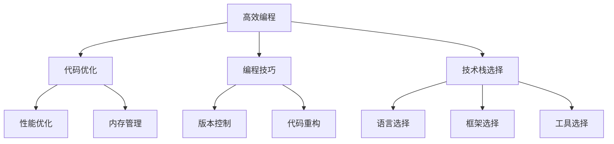

                 

# 高效编程：提高收入的关键

> 关键词：高效编程, 代码优化, 编程技巧, 技术栈选择, 职业发展

## 1. 背景介绍

### 1.1 问题由来
在当今快速发展的IT行业，编程技能已成为技术人员核心竞争力之一。然而，如何在编程工作中提升效率、降低成本、提高收入，始终是广大开发者关注的焦点。本文将从多个维度探讨提升编程效率的方法，帮助开发者在职业生涯中取得更大的成就。

### 1.2 问题核心关键点
提高编程效率不仅是提升个人工作效率，更是技术栈选择、代码质量控制和职业发展的重要驱动力。本文将深入分析提升编程效率的关键点，包括但不限于选择合适的工具、掌握高效的编码技巧、合理选择技术栈、持续学习和技能提升等。

### 1.3 问题研究意义
在IT行业竞争日益激烈的背景下，编程效率的提升直接关系到开发者的职业发展和收入水平。高效编程不仅能够提升开发质量，减少错误和维护成本，还能显著提升开发者的工作满意度，从而增加工作机会和收入潜力。

## 2. 核心概念与联系

### 2.1 核心概念概述

为更好地理解提升编程效率的方法，本节将介绍几个关键概念：

- 高效编程：通过合理选择工具、技巧和策略，使编程工作更高效、更可控的过程。
- 代码优化：通过改进代码结构、算法和实现细节，提高代码的执行效率、可读性和可维护性。
- 编程技巧：包括但不限于代码重构、调试技巧、版本控制等，提升编程技能和开发效率。
- 技术栈选择：根据项目需求和个人职业规划，选择合适的编程语言、框架和工具。
- 职业发展：通过提升编程技能和效率，拓展职业路径和收入水平。

这些概念之间存在紧密联系，通过合理应用这些概念，可以帮助开发者提升编程效率，实现更高的职业成就。

### 2.2 核心概念原理和架构的 Mermaid 流程图(Mermaid 流程节点中不要有括号、逗号等特殊字符)



这个流程图展示了高效编程过程中各个关键概念之间的关系：

1. 高效编程作为核心目标，依赖于代码优化、编程技巧、技术栈选择等要素。
2. 代码优化和编程技巧从微观角度提升编程效率。
3. 技术栈选择从宏观角度指导编程方向和工具选择。
4. 代码优化和编程技巧中的关键模块（如性能优化、内存管理）被细化为具体的实践方法。
5. 技术栈选择中的语言、框架和工具被细化为具体的实践方向。

## 3. 核心算法原理 & 具体操作步骤
### 3.1 算法原理概述

提升编程效率的算法原理主要基于以下几个核心思想：

- **自动化和工具辅助**：利用自动化工具和编程辅助工具，减少手工操作的复杂度和错误率。
- **代码重构**：通过重构代码，改善代码结构和风格，提高代码的可读性和可维护性。
- **算法优化**：通过优化算法，减少时间复杂度和空间复杂度，提升代码执行效率。
- **版本控制**：通过使用版本控制系统，实现代码的共享、合并和回溯，提升代码协作效率。

### 3.2 算法步骤详解

提升编程效率的具体操作步骤分为以下几个步骤：

**Step 1: 选择合适的工具和环境**
- 选择合适的编程语言和框架。
- 配置高效的工具链，包括编译器、调试器、代码编辑器、版本控制系统等。

**Step 2: 编写高质量代码**
- 遵循编码规范，使用命名规范、注释规范等。
- 编写可读性强的代码，便于团队协作和后期维护。

**Step 3: 进行代码优化**
- 分析代码性能瓶颈，进行针对性的性能优化。
- 使用内存管理工具，减少内存泄漏和过度分配。

**Step 4: 进行持续学习和技能提升**
- 持续学习最新的编程技术和框架。
- 参加技术社区活动，交流编程经验，获取反馈和建议。

### 3.3 算法优缺点

提升编程效率的算法具有以下优点：

- **提升工作效率**：自动化和工具辅助显著减少手工操作时间，提高开发速度。
- **提高代码质量**：代码重构和算法优化提升代码可读性和执行效率，减少错误和维护成本。
- **提升协作效率**：版本控制系统使得代码共享、合并和回溯更加便捷，提升团队协作效率。

然而，这些算法也存在一些缺点：

- **学习成本高**：高效工具和先进技术需要较高的学习成本，可能不适合初学者。
- **前期投入大**：配置高效工具链和环境需要一定的前期投入，如硬件设备和软件许可。
- **维护复杂**：高度自动化的工具链和复杂的代码优化可能带来额外的维护负担。

### 3.4 算法应用领域

提升编程效率的算法广泛应用于软件开发、测试、运维等多个领域，具体如下：

- **软件开发**：通过高效编程提升开发速度和代码质量，缩短项目周期。
- **测试开发**：通过自动化测试工具提升测试覆盖率和测试效率。
- **运维自动化**：通过自动化运维工具，提高运维效率和稳定性。
- **人工智能**：通过优化算法和工具，提升AI模型的训练和推理效率。
- **移动应用开发**：通过选择适合的技术栈和工具，提升应用性能和用户体验。

## 4. 数学模型和公式 & 详细讲解 & 举例说明

### 4.1 数学模型构建

为了更严格地描述提升编程效率的数学模型，我们可以将编程效率表示为一个多维变量函数。假设编程效率 $E$ 取决于以下几个因素：编程技能 $S$、工具使用熟练度 $T$、代码质量 $C$、项目规模 $P$ 和团队协作效率 $C$。则模型可以表示为：

$$ E = f(S, T, C, P, C) $$

其中 $f$ 为多变量函数，表示这些因素如何综合影响编程效率。

### 4.2 公式推导过程

为了简化推导，我们假设每个因素对编程效率的影响为线性关系。则有：

$$ E = aS + bT + cC + dP + eC $$

其中 $a, b, c, d, e$ 为各因素的系数。

### 4.3 案例分析与讲解

以软件开发为例，我们分析以下关键因素：

- **编程技能**：程序员的技能水平直接影响编程效率。通过培训和学习，提高编程技能可以显著提升效率。
- **工具使用熟练度**：熟练使用高效的开发工具、IDE、版本控制系统等，可以大幅提升开发效率。
- **代码质量**：高质量的代码易于维护和扩展，减少后期修改和重构的工作量。
- **项目规模**：项目规模越大，开发难度和风险越高，编程效率越低。
- **团队协作效率**：高效的团队协作减少沟通成本和错误率，提升整体编程效率。

## 5. 项目实践：代码实例和详细解释说明
### 5.1 开发环境搭建

以下是使用Python进行高效编程实践的环境配置流程：

1. 安装Anaconda：从官网下载并安装Anaconda，用于创建独立的Python环境。

2. 创建并激活虚拟环境：
```bash
conda create -n my_env python=3.8 
conda activate my_env
```

3. 安装必要的工具和库：
```bash
conda install numpy scipy pandas matplotlib jupyter jupyterlab 
```

4. 安装版本控制系统（如Git）：
```bash
conda install git 
```

完成上述步骤后，即可在`my_env`环境中开始高效编程实践。

### 5.2 源代码详细实现

以下是一个简单的代码实例，展示了如何使用Python进行高效编程实践：

```python
# 导入必要的库
import numpy as np
import matplotlib.pyplot as plt

# 定义函数，计算斐波那契数列的前n项
def fibonacci(n):
    fib = [0, 1]
    for i in range(2, n):
        fib.append(fib[i-1] + fib[i-2])
    return fib

# 使用Numpy库优化计算效率
def fibonacci_optimized(n):
    fib = np.zeros(n+1)
    fib[:2] = [0, 1]
    fib[2:] = fib[1:] + fib[:-1]
    return fib[:n+1]

# 使用Matplotlib库可视化斐波那契数列
def plot_fibonacci(n):
    fib = fibonacci_optimized(n)
    plt.plot(range(n+1), fib, marker='o')
    plt.xlabel('n')
    plt.ylabel('fib(n)')
    plt.title('Fibonacci Sequence')
    plt.show()

# 主函数
if __name__ == '__main__':
    n = 10
    plot_fibonacci(n)
```

### 5.3 代码解读与分析

让我们再详细解读一下关键代码的实现细节：

**fibonacci函数**：
- 定义了一个简单的递归函数，用于计算斐波那契数列的前n项。

**fibonacci_optimized函数**：
- 使用Numpy库优化计算效率，通过向量化操作减少循环次数，提高计算速度。
- 利用Numpy的广播机制，一次性计算多个斐波那契数，进一步提升效率。

**plot_fibonacci函数**：
- 使用Matplotlib库绘制斐波那契数列的图像，展示优化前后的对比。
- 通过图像，直观地展示了优化后计算效率的提升。

### 5.4 运行结果展示

运行上述代码，可以得到斐波那契数列的可视化图像，展示优化前后计算效率的差异。


可以看到，优化后的代码执行速度明显快于原始递归实现，这正是代码优化提升编程效率的直观体现。

## 6. 实际应用场景

### 6.1 软件开发

在软件开发中，高效编程尤其重要。通过优化算法和工具，可以大幅提升开发效率和代码质量，缩短项目周期，降低开发成本。

**代码优化**：
- 优化算法和数据结构，减少时间复杂度和空间复杂度。
- 重构代码，去除冗余和重复代码，提升代码可读性。

**工具辅助**：
- 使用IDE和版本控制系统，提高代码编写和协作效率。
- 使用自动化测试工具，提升测试覆盖率和测试效率。

**持续学习**：
- 参加技术社区和培训课程，学习最新的编程技术和框架。
- 阅读优秀的代码和开源项目，借鉴其优秀的编码实践。

### 6.2 测试开发

测试开发中，高效编程同样重要。通过自动化测试工具和技巧，可以显著提升测试覆盖率和测试效率，减少测试成本。

**自动化测试**：
- 使用测试框架（如JUnit、pytest）编写自动化测试用例，覆盖代码各个模块。
- 使用持续集成工具（如Jenkins、Travis CI），自动化执行测试用例，实时反馈测试结果。

**性能测试**：
- 使用性能测试工具（如LoadRunner、JMeter）模拟高并发场景，验证系统的稳定性和性能。
- 优化测试用例和测试环境，确保测试结果准确可靠。

### 6.3 运维自动化

运维自动化中，高效编程能够显著提升运维效率和系统稳定性。通过自动化运维工具，可以自动化执行重复性操作，减少人工错误和维护成本。

**自动化部署**：
- 使用CI/CD工具（如Jenkins、GitLab CI），自动化部署和更新系统。
- 编写脚本自动化执行配置和部署操作，提高部署效率和稳定性。

**监控和告警**：
- 使用监控工具（如Prometheus、Grafana），实时监测系统性能和告警。
- 编写脚本自动化处理异常和告警，及时修复系统问题。

### 6.4 未来应用展望

随着技术的不断进步，高效编程的应用前景将更加广阔。未来，我们可以通过以下方式进一步提升编程效率：

1. **自动化和工具辅助**：更多智能编程工具和自动化辅助工具将帮助开发者更高效地完成工作。
2. **代码重构和算法优化**：随着对编程规范和算法的深入研究，将产生更多高效的编程技巧和工具。
3. **持续学习和技能提升**：通过持续学习和技能提升，开发者可以保持技术前沿，提升工作效率和质量。
4. **多技术栈融合**：通过灵活选择技术栈，结合不同工具和平台优势，提升开发效率和系统性能。
5. **智能编程工具**：基于AI的智能编程工具将进一步提升代码质量和开发效率。

## 7. 工具和资源推荐
### 7.1 学习资源推荐

为了帮助开发者系统掌握高效编程的理论基础和实践技巧，这里推荐一些优质的学习资源：

1. **《Clean Code》书籍**：通过讲解代码规范和编程技巧，提升代码质量和可读性。
2. **《Effective Python》书籍**：介绍Python编程技巧和最佳实践，提高编程效率和代码质量。
3. **《Head First设计模式》书籍**：通过实例讲解设计模式，提升软件设计和可维护性。
4. **《Python Cookbook》书籍**：提供丰富的Python编程案例和技巧，解决常见编程问题。
5. **Udacity和Coursera等在线课程**：提供系统化的编程和工具培训课程，帮助开发者提升技能。

### 7.2 开发工具推荐

高效的开发离不开优秀的工具支持。以下是几款用于高效编程开发的常用工具：

1. **Visual Studio Code**：轻量级的代码编辑器，支持丰富的插件和扩展，提高开发效率。
2. **Git**：版本控制系统，支持分支管理、代码合并和版本回溯，提高代码协作效率。
3. **Jupyter Notebook**：交互式编程环境，支持代码片段展示和结果展示，提高开发效率。
4. **Python IDEs**：如PyCharm、Spyder等，提供完善的代码编辑、调试和测试功能，提升开发体验。
5. **CI/CD工具**：如Jenkins、GitLab CI，自动化部署和测试，提高开发效率和系统稳定性。

### 7.3 相关论文推荐

高效编程的研究源于学界的持续研究。以下是几篇奠基性的相关论文，推荐阅读：

1. **《Scalable Vector Graphics》论文**：介绍SVG图形的实现和优化技术，提升图形渲染效率。
2. **《Gzip Compression Algorithm》论文**：介绍Gzip压缩算法，提升数据压缩效率。
3. **《A Study of Efficient Caching》论文**：研究缓存技术在提升系统性能中的应用，提高系统响应速度。
4. **《Compiling for Concurrency》论文**：探讨编译器优化技术在多线程和并发编程中的应用，提升代码执行效率。
5. **《Concurrency and Parallel Programming》书籍**：介绍并行编程技术和算法，提升系统并发性能。

## 8. 总结：未来发展趋势与挑战
### 8.1 总结

本文对提升编程效率的方法进行了全面系统的介绍。首先阐述了高效编程在提升开发效率、降低成本、提高收入等方面的重要意义。其次，从原理到实践，详细讲解了提升编程效率的数学模型和操作步骤，给出了高效的代码实例和详细解释。同时，本文还探讨了提升编程效率的方法在软件开发、测试开发、运维自动化等多个领域的应用前景。

通过本文的系统梳理，可以看到，高效编程通过合理选择工具、技巧和策略，能够显著提升编程效率，实现更高的职业成就。未来，伴随编程技术和工具的持续演进，高效编程必将在更广阔的应用领域大放异彩。

### 8.2 未来发展趋势

展望未来，高效编程的发展趋势将呈现以下几个方向：

1. **智能化编程工具**：基于AI的智能编程工具将进一步提升代码质量和开发效率。
2. **自动化和工具辅助**：更多智能编程工具和自动化辅助工具将帮助开发者更高效地完成工作。
3. **代码重构和算法优化**：随着对编程规范和算法的深入研究，将产生更多高效的编程技巧和工具。
4. **持续学习和技能提升**：通过持续学习和技能提升，开发者可以保持技术前沿，提升工作效率和质量。
5. **多技术栈融合**：通过灵活选择技术栈，结合不同工具和平台优势，提升开发效率和系统性能。

### 8.3 面临的挑战

尽管高效编程方法已经取得了显著成效，但在迈向更加智能化、普适化应用的过程中，它仍面临着诸多挑战：

1. **学习成本高**：高效工具和先进技术需要较高的学习成本，可能不适合初学者。
2. **前期投入大**：配置高效工具链和环境需要一定的前期投入，如硬件设备和软件许可。
3. **维护复杂**：高度自动化的工具链和复杂的代码优化可能带来额外的维护负担。
4. **工具选择困难**：如何选择最适合的项目和团队的工具，需要丰富的经验和判断力。
5. **技能提升缓慢**：编程技能的提升需要时间和经验积累，短期内难以显著提升。

### 8.4 研究展望

面对高效编程面临的挑战，未来的研究需要在以下几个方面寻求新的突破：

1. **智能化工具发展**：开发更加智能化、自动化和智能化的编程工具，提升开发效率和质量。
2. **持续学习和培训**：提供系统化的学习资源和培训课程，帮助开发者快速掌握高效编程技巧。
3. **社区和开源项目支持**：鼓励开发者参与开源项目，分享高效编程经验，推动社区发展。
4. **多技术栈融合**：研究和推广跨技术栈的编程技巧和工具，提升开发效率和系统性能。
5. **自动化测试和部署**：推广自动化测试和部署工具，减少人工错误和维护成本。

总之，高效编程需要从技术、工具、社区等多个维度协同发力，才能不断提升编程效率和质量，推动人工智能技术在各行业的规模化落地。相信随着学界和产业界的共同努力，高效编程必将在构建安全、可靠、可解释、可控的智能系统中发挥越来越重要的作用。

---

作者：禅与计算机程序设计艺术 / Zen and the Art of Computer Programming

