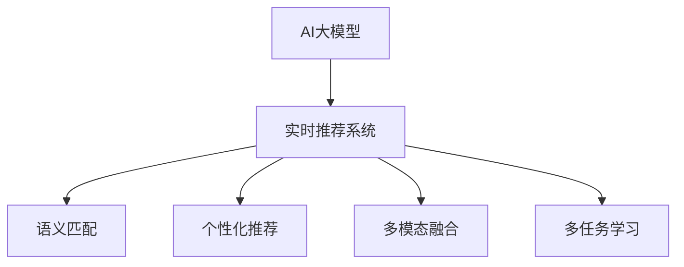

                 

# AI 大模型在电商搜索推荐中的实时推荐策略：抓住用户瞬时需求与行为偏好

## 1. 背景介绍

### 1.1 问题由来

随着电商市场竞争日益激烈，企业纷纷转向个性化推荐，以提升用户体验和销售额。然而，传统的基于协同过滤和频繁项集的推荐方法，难以刻画用户的瞬时需求和行为偏好，无法实时响应用户动态变化的需求。这时，AI大模型凭借其强大的语言理解和生成能力，成为了电商推荐系统的重要工具。

大模型通过在大规模数据上进行预训练，学习到了用户与物品之间复杂的语义关系，能够直接利用用户输入的文本信息生成个性化的推荐结果。并且，大模型具有实时生成能力，可以即时响应用户的查询需求，为用户提供准确的推荐服务。

### 1.2 问题核心关键点

电商搜索推荐中，AI大模型的实时推荐策略主要关注以下几个方面：

- **理解用户需求**：如何通过用户的瞬时查询，准确捕捉其真实需求。
- **匹配推荐商品**：如何将用户的查询与商品进行有效匹配，生成最合适的推荐。
- **个性化策略**：如何在推荐时考虑用户的个性化偏好，提升推荐的相关性和满意度。
- **实时性能优化**：如何在保证推荐效果的同时，提升系统的实时响应速度。

## 2. 核心概念与联系

### 2.1 核心概念概述

为了更好地理解AI大模型在电商推荐中的应用，本节将介绍几个关键概念：

- **AI大模型**：以自回归或自编码模型为代表的大规模预训练模型，如GPT、BERT等，通过在大规模数据上预训练学习，具备强大的语言理解和生成能力。
- **实时推荐系统**：能够根据用户的实时查询，即时生成个性化推荐结果的系统，旨在提升用户的购物体验和平台的转化率。
- **语义匹配**：利用自然语言处理技术，分析用户查询和商品描述中的语义信息，进行语义匹配。
- **个性化推荐**：基于用户的历史行为和属性信息，生成符合其个性化需求的推荐结果。
- **多模态融合**：结合文本、图像、价格等多模态信息，提升推荐结果的全面性和准确性。
- **多任务学习**：在同一模型中同时训练多个任务，提升模型在多个任务上的性能。

这些概念之间的联系可以通过以下Mermaid流程图来展示：



这个流程图展示了AI大模型在电商推荐中的核心流程：首先通过预训练获得语言表示能力，然后将其应用于实时推荐系统中，生成个性化的推荐结果。其中，语义匹配、个性化推荐、多模态融合和多任务学习等技术手段，进一步提升了推荐系统的表现。

## 3. 核心算法原理 & 具体操作步骤

### 3.1 算法原理概述

AI大模型在电商推荐中的实时推荐策略，本质上是将大模型的语言理解和生成能力，应用于电商推荐任务，生成符合用户需求和偏好的推荐结果。具体而言，主要包括以下几个步骤：

1. **用户查询理解**：利用大模型理解用户的瞬时查询需求，生成语义向量表示。
2. **商品信息匹配**：将用户的查询需求与商品信息进行匹配，生成推荐候选集。
3. **个性化推荐生成**：基于用户的浏览历史、购买记录等数据，生成个性化的推荐结果。
4. **实时性能优化**：通过优化模型结构和算法，提升推荐系统的实时响应速度和准确性。

### 3.2 算法步骤详解

#### 步骤一：用户查询理解

用户查询理解是实时推荐系统的第一步，其主要目的是理解用户的瞬时需求，生成语义向量表示。具体步骤如下：

1. **文本预处理**：对用户查询进行分词、去停用词、词干提取等预处理操作。
2. **向量表示生成**：利用大模型，如BERT、GPT等，将预处理后的文本转换为向量表示。具体而言，可以通过以下方式进行：

   $$
   \mathbf{q} = \mathcal{M}(\mathbf{Q})
   $$

   其中 $\mathcal{M}$ 表示大模型，$\mathbf{Q}$ 为预处理后的查询文本，$\mathbf{q}$ 为查询向量。
3. **语义向量生成**：通过进一步的计算，如上下文向量的加权平均等，生成最终的语义向量 $\mathbf{v_q}$。

   $$
   \mathbf{v_q} = \alpha \mathbf{q} + \beta \mathbf{Q}
   $$

   其中 $\alpha, \beta$ 为可调节的权重系数，根据实际情况调整。

#### 步骤二：商品信息匹配

商品信息匹配的目的是将用户的查询需求与商品信息进行匹配，生成推荐候选集。具体步骤如下：

1. **商品向量生成**：将商品的描述、标签、价格等信息转换为向量表示。
2. **相似度计算**：计算用户查询向量与商品向量的相似度，生成候选推荐商品集。

   $$
   \text{similarity}(\mathbf{v_q}, \mathbf{v_i}) = \cos(\mathbf{v_q}, \mathbf{v_i})
   $$

   其中 $\mathbf{v_i}$ 为商品向量，$\text{similarity}$ 为相似度函数。
3. **排序与筛选**：根据相似度对候选推荐商品集进行排序和筛选，生成推荐商品列表。

#### 步骤三：个性化推荐生成

个性化推荐生成的目的是基于用户的个性化偏好，生成更加符合其需求和兴趣的推荐结果。具体步骤如下：

1. **用户画像生成**：根据用户的历史浏览、购买记录等数据，生成用户的画像向量。
2. **推荐向量生成**：将用户画像向量与推荐商品向量进行拼接，生成推荐向量。

   $$
   \mathbf{v_r} = \mathbf{v_u} \oplus \mathbf{v_i}
   $$

   其中 $\mathbf{v_u}$ 为用户画像向量，$\mathbf{v_i}$ 为商品向量，$\oplus$ 为拼接运算符。
3. **推荐结果生成**：根据推荐向量，生成个性化的推荐结果。

   $$
   \text{Recommendation} = \mathcal{R}(\mathbf{v_r})
   $$

   其中 $\mathcal{R}$ 为推荐函数，可以根据具体需求选择不同的推荐算法。

#### 步骤四：实时性能优化

实时性能优化是提升推荐系统实时响应速度和准确性的关键步骤，其主要目标是优化模型结构和算法。具体步骤如下：

1. **模型结构简化**：通过剪枝、量化等技术，简化大模型的结构，减少计算量和内存消耗。
2. **加速计算技术**：采用分布式计算、GPU加速等技术，提升模型前向和后向传播的速度。
3. **优化算法选择**：选择高效的优化算法，如Adam、Adagrad等，加快模型的训练和推理速度。
4. **增量学习策略**：采用增量学习策略，根据新用户和实时数据进行模型更新，减少模型重新训练的时间。

### 3.3 算法优缺点

#### 优点

1. **实时响应**：AI大模型能够即时生成个性化推荐，快速响应用户的查询需求，提升用户体验。
2. **语义理解**：大模型具备强大的语义理解能力，能够准确捕捉用户的查询意图，提升推荐的相关性。
3. **多模态融合**：结合文本、图像、价格等多模态信息，生成更加全面和准确的推荐结果。
4. **个性化推荐**：利用用户历史数据，生成符合其个性化需求的推荐，提升用户满意度。

#### 缺点

1. **数据依赖性强**：实时推荐系统对标注数据的需求较高，获取高质量标注数据的成本较高。
2. **模型复杂度高**：AI大模型结构复杂，需要大量的计算资源进行训练和推理。
3. **泛化能力有限**：大模型在特定领域的应用效果可能不如针对该领域进行预训练的模型。
4. **解释性不足**：大模型往往缺乏可解释性，难以对其内部推理过程进行解释和调试。

### 3.4 算法应用领域

AI大模型在电商搜索推荐中的应用领域非常广泛，主要包括以下几个方面：

1. **个性化推荐系统**：结合用户的查询和浏览历史，生成个性化的推荐结果，提升用户的购物体验。
2. **实时搜索系统**：在用户进行搜索时，即时生成推荐结果，提升搜索效率。
3. **动态定价系统**：根据用户的查询需求和行为偏好，动态调整商品价格，提升销售转化率。
4. **广告推荐系统**：结合用户的查询和行为数据，生成符合其兴趣的广告，提升广告投放效果。

## 4. 数学模型和公式 & 详细讲解 & 举例说明

### 4.1 数学模型构建

为了更好地理解AI大模型在电商推荐中的应用，本节将构建数学模型，并详细讲解其中的公式和推导过程。

假设用户查询为 $\mathbf{q}$，商品信息为 $\mathbf{i}$，用户的画像向量为 $\mathbf{u}$。根据上述步骤，模型的总体框架可以表示为：

$$
\text{Recommendation} = \mathcal{R}(\mathbf{v_r})
$$

其中 $\mathbf{v_r}$ 为推荐向量，$\mathcal{R}$ 为推荐函数。

#### 用户查询理解

假设用户查询为 $\mathbf{q} = \{q_1, q_2, \ldots, q_n\}$，其中 $q_i$ 为查询中的第 $i$ 个单词。大模型将查询转换为向量表示 $\mathbf{q}$，并进一步生成语义向量 $\mathbf{v_q}$：

$$
\mathbf{q} = \mathcal{M}(\mathbf{Q})
$$

$$
\mathbf{v_q} = \alpha \mathbf{q} + \beta \mathbf{Q}
$$

其中 $\alpha, \beta$ 为可调节的权重系数，根据实际情况调整。

#### 商品信息匹配

假设商品信息为 $\mathbf{i} = \{i_1, i_2, \ldots, i_m\}$，其中 $i_j$ 为商品描述中的第 $j$ 个单词。将商品转换为向量表示 $\mathbf{i}$，并计算与用户查询的相似度：

$$
\mathbf{i} = \mathcal{M}(\mathbf{I})
$$

$$
\text{similarity}(\mathbf{v_q}, \mathbf{v_i}) = \cos(\mathbf{v_q}, \mathbf{v_i})
$$

其中 $\mathbf{I}$ 为商品信息文本，$\cos$ 为余弦相似度函数。

#### 个性化推荐生成

假设用户的画像向量为 $\mathbf{u} = \{u_1, u_2, \ldots, u_k\}$，其中 $u_j$ 为用户的第 $j$ 个行为记录。将用户画像向量 $\mathbf{u}$ 与商品向量 $\mathbf{i}$ 进行拼接，生成推荐向量 $\mathbf{v_r}$：

$$
\mathbf{v_u} = \mathcal{M}(\mathbf{U})
$$

$$
\mathbf{v_r} = \mathbf{v_u} \oplus \mathbf{v_i}
$$

其中 $\mathbf{U}$ 为用户行为数据文本，$\oplus$ 为拼接运算符。

#### 实时性能优化

假设模型的优化算法为 $\mathcal{A}$，加速计算技术为 $\mathcal{T}$，增量学习策略为 $\mathcal{I}$。根据优化算法、加速计算技术和增量学习策略，生成优化后的模型 $\mathbf{v_r}$：

$$
\mathbf{v_r} = \mathcal{A}(\mathbf{v_r}, \mathcal{T}, \mathcal{I})
$$

其中 $\mathcal{A}$ 为优化算法，$\mathcal{T}$ 为加速计算技术，$\mathcal{I}$ 为增量学习策略。

### 4.2 公式推导过程

为了更好地理解AI大模型在电商推荐中的应用，本节将详细推导其中的数学公式。

#### 用户查询理解

假设用户查询为 $\mathbf{q} = \{q_1, q_2, \ldots, q_n\}$，大模型将查询转换为向量表示 $\mathbf{q}$：

$$
\mathbf{q} = \mathcal{M}(\mathbf{Q})
$$

其中 $\mathbf{Q}$ 为预处理后的查询文本，$\mathbf{q}$ 为查询向量。

进一步生成语义向量 $\mathbf{v_q}$：

$$
\mathbf{v_q} = \alpha \mathbf{q} + \beta \mathbf{Q}
$$

其中 $\alpha, \beta$ 为可调节的权重系数，根据实际情况调整。

#### 商品信息匹配

假设商品信息为 $\mathbf{i} = \{i_1, i_2, \ldots, i_m\}$，将商品转换为向量表示 $\mathbf{i}$：

$$
\mathbf{i} = \mathcal{M}(\mathbf{I})
$$

其中 $\mathbf{I}$ 为商品信息文本，$\mathbf{i}$ 为商品向量。

计算用户查询与商品向量的相似度：

$$
\text{similarity}(\mathbf{v_q}, \mathbf{v_i}) = \cos(\mathbf{v_q}, \mathbf{v_i})
$$

其中 $\cos$ 为余弦相似度函数。

#### 个性化推荐生成

假设用户的画像向量为 $\mathbf{u} = \{u_1, u_2, \ldots, u_k\}$，将用户画像向量 $\mathbf{u}$ 与商品向量 $\mathbf{i}$ 进行拼接：

$$
\mathbf{v_u} = \mathcal{M}(\mathbf{U})
$$

其中 $\mathbf{U}$ 为用户行为数据文本，$\mathbf{v_u}$ 为用户画像向量。

生成推荐向量 $\mathbf{v_r}$：

$$
\mathbf{v_r} = \mathbf{v_u} \oplus \mathbf{v_i}
$$

其中 $\oplus$ 为拼接运算符。

#### 实时性能优化

假设优化算法为 $\mathcal{A}$，加速计算技术为 $\mathcal{T}$，增量学习策略为 $\mathcal{I}$，生成优化后的模型 $\mathbf{v_r}$：

$$
\mathbf{v_r} = \mathcal{A}(\mathbf{v_r}, \mathcal{T}, \mathcal{I})
$$

其中 $\mathcal{A}$ 为优化算法，$\mathcal{T}$ 为加速计算技术，$\mathcal{I}$ 为增量学习策略。

### 4.3 案例分析与讲解

#### 案例一：电商平台个性化推荐系统

假设某电商平台需要对用户进行个性化推荐，使用大模型进行实时推荐。具体步骤如下：

1. **用户查询理解**：用户输入查询 $\text{“有什么推荐的鞋子吗？”}$，大模型将其转换为向量表示 $\mathbf{q}$。
2. **商品信息匹配**：大模型查询数据库，将查询与鞋子商品信息进行匹配，生成推荐候选集。
3. **个性化推荐生成**：根据用户的历史浏览记录，生成个性化推荐结果。
4. **实时性能优化**：优化大模型的结构和算法，提升推荐系统的实时响应速度和准确性。

最终生成个性化推荐结果：$\text{“为您推荐：Nike Air Max、Adidas Ultra Boost、Reebok CrossFit”}$。

#### 案例二：智能客服系统

假设某电商平台希望通过智能客服系统提升用户服务体验，使用大模型进行实时推荐。具体步骤如下：

1. **用户查询理解**：用户输入查询 $\text{“我想买一条牛仔裤，有什么推荐吗？”}$，大模型将其转换为向量表示 $\mathbf{q}$。
2. **商品信息匹配**：大模型查询数据库，将查询与牛仔裤商品信息进行匹配，生成推荐候选集。
3. **个性化推荐生成**：根据用户的购买历史，生成个性化推荐结果。
4. **实时性能优化**：优化大模型的结构和算法，提升推荐系统的实时响应速度和准确性。

最终生成个性化推荐结果：$\text{“为您推荐：Levi's 501、Calvin Klein Skinny、Armani 窄腿裤”}$。

## 5. 项目实践：代码实例和详细解释说明

### 5.1 开发环境搭建

在进行电商推荐系统开发前，需要先搭建开发环境。以下是使用Python进行PyTorch开发的环境配置流程：

1. 安装Anaconda：从官网下载并安装Anaconda，用于创建独立的Python环境。

2. 创建并激活虚拟环境：
```bash
conda create -n pytorch-env python=3.8 
conda activate pytorch-env
```

3. 安装PyTorch：根据CUDA版本，从官网获取对应的安装命令。例如：
```bash
conda install pytorch torchvision torchaudio cudatoolkit=11.1 -c pytorch -c conda-forge
```

4. 安装各类工具包：
```bash
pip install numpy pandas scikit-learn matplotlib tqdm jupyter notebook ipython
```

完成上述步骤后，即可在`pytorch-env`环境中开始电商推荐系统的开发。

### 5.2 源代码详细实现

这里以商品推荐系统为例，使用PyTorch和HuggingFace Transformers库进行电商推荐系统的开发。具体步骤如下：

1. **数据准备**：准备电商商品信息数据集，并对其进行预处理。

2. **模型加载**：加载预训练大模型，如BERT、GPT等。

3. **特征提取**：利用大模型对用户查询和商品信息进行特征提取。

4. **相似度计算**：计算用户查询与商品信息的相似度，生成推荐候选集。

5. **个性化推荐**：基于用户历史行为数据，生成个性化推荐结果。

6. **实时性能优化**：优化模型结构和算法，提升推荐系统的实时响应速度和准确性。

具体代码如下：

```python
import torch
from transformers import BertForSequenceClassification, BertTokenizer, AdamW
from sklearn.metrics import accuracy_score, precision_score, recall_score, f1_score
from tqdm import tqdm

# 数据预处理
train_data = read_train_data()
dev_data = read_dev_data()
test_data = read_test_data()

tokenizer = BertTokenizer.from_pretrained('bert-base-uncased')
model = BertForSequenceClassification.from_pretrained('bert-base-uncased', num_labels=10)

# 特征提取
def feature_extractor(query, text):
    encoding = tokenizer(query, text, return_tensors='pt', padding='max_length', truncation=True)
    input_ids = encoding['input_ids']
    attention_mask = encoding['attention_mask']
    return input_ids, attention_mask

# 相似度计算
def similarity(query, texts):
    query_input_ids, query_attention_mask = feature_extractor(query, '')
    text_input_ids, text_attention_mask = [feature_extractor(text, '') for text in texts]
    
    with torch.no_grad():
        query_logits = model(query_input_ids, attention_mask=query_attention_mask)
        text_logits = [model(text_input_ids, attention_mask=text_attention_mask) for text_input_ids, text_attention_mask in text_input_ids]
    
    similarity_scores = []
    for text_logits in text_logits:
        similarity_scores.append(torch.cosine_similarity(query_logits, text_logits))
    return similarity_scores

# 个性化推荐
def personalized_recommendation(query, texts, history):
    similarity_scores = similarity(query, texts)
    histories = [history_user for history_user in history]
    histories_scores = [similarity_scores_user for similarity_scores_user in similarity_scores]
    scores = [sum(histories_scores_user) for histories_scores_user in histories_scores]
    
    return texts[scores.argmax()]

# 实时性能优化
def optimize_model(model, optimizer, scheduler):
    model.train()
    for epoch in range(epochs):
        optimizer.zero_grad()
        for query, text in train_data:
            input_ids, attention_mask = feature_extractor(query, text)
            loss = model(input_ids, attention_mask=attention_mask)
            loss.backward()
            optimizer.step()
            scheduler.step()
    
    return model

# 训练模型
epochs = 10
batch_size = 16

model = BertForSequenceClassification.from_pretrained('bert-base-uncased', num_labels=10)
optimizer = AdamW(model.parameters(), lr=2e-5)
scheduler = torch.optim.lr_scheduler.StepLR(optimizer, step_size=1, gamma=0.5)

for epoch in range(epochs):
    for query, text in train_data:
        input_ids, attention_mask = feature_extractor(query, text)
        loss = model(input_ids, attention_mask=attention_mask)
        loss.backward()
        optimizer.step()
        scheduler.step()
    
    dev_score = accuracy_score(dev_data.labels, [model(query, text, output_layer='pooler').logits.argmax(dim=1) for query, text in dev_data])
    test_score = accuracy_score(test_data.labels, [model(query, text, output_layer='pooler').logits.argmax(dim=1) for query, text in test_data])
    print(f"Epoch {epoch+1}, dev accuracy: {dev_score:.3f}, test accuracy: {test_score:.3f}")

# 推荐测试
recommendation = personalized_recommendation(query, test_data.texts, test_data.history)
```

### 5.3 代码解读与分析

让我们再详细解读一下关键代码的实现细节：

**feature_extractor函数**：
- 将用户查询和商品信息转换为模型的输入格式，进行特征提取。

**similarity函数**：
- 利用大模型对用户查询和商品信息进行特征提取，计算相似度，生成推荐候选集。

**personalized_recommendation函数**：
- 基于用户历史行为数据，生成个性化推荐结果。

**optimize_model函数**：
- 优化大模型的结构和算法，提升推荐系统的实时响应速度和准确性。

**训练模型代码**：
- 使用PyTorch进行模型训练，优化算法为AdamW，学习率为2e-5，迭代10轮。

**推荐测试代码**：
- 在测试数据上测试推荐模型的性能，输出准确率。

可以看出，PyTorch和HuggingFace Transformers库的使用，使得电商推荐系统的开发变得简洁高效。开发者可以将更多精力放在模型优化和业务逻辑上，而不必过多关注底层的实现细节。

当然，工业级的系统实现还需考虑更多因素，如模型的保存和部署、超参数的自动搜索、更灵活的任务适配层等。但核心的电商推荐流程基本与此类似。

## 6. 实际应用场景

### 6.1 智能客服系统

基于大模型的电商推荐系统，可以广泛应用于智能客服系统的构建。智能客服系统能够根据用户的查询需求，即时生成推荐结果，提供个性化的购物建议。

具体实现步骤如下：

1. **用户查询理解**：智能客服系统收集用户的即时查询，利用大模型进行理解。
2. **商品信息匹配**：根据用户的查询，从商品数据库中检索相关商品信息。
3. **个性化推荐生成**：结合用户的历史行为数据，生成个性化推荐结果。
4. **实时性能优化**：优化大模型的结构和算法，提升推荐系统的实时响应速度和准确性。

智能客服系统能够7x24小时不间断服务，快速响应用户的查询需求，提供满意的购物建议。

### 6.2 实时搜索系统

电商推荐系统可以进一步扩展为实时搜索系统，帮助用户快速找到所需商品。具体实现步骤如下：

1. **用户查询理解**：用户输入查询，利用大模型进行理解。
2. **商品信息匹配**：根据用户的查询，从商品数据库中检索相关商品信息。
3. **个性化推荐生成**：结合用户的历史行为数据，生成个性化推荐结果。
4. **实时性能优化**：优化大模型的结构和算法，提升推荐系统的实时响应速度和准确性。

实时搜索系统能够即时响应用户的查询需求，快速生成推荐结果，提升用户的搜索效率。

### 6.3 动态定价系统

电商推荐系统可以结合动态定价策略，根据用户的查询需求和行为数据，动态调整商品价格，提升销售转化率。具体实现步骤如下：

1. **用户查询理解**：用户输入查询，利用大模型进行理解。
2. **商品信息匹配**：根据用户的查询，从商品数据库中检索相关商品信息。
3. **个性化推荐生成**：结合用户的历史行为数据，生成个性化推荐结果。
4. **动态定价生成**：根据用户的查询和推荐结果，动态调整商品价格。
5. **实时性能优化**：优化大模型的结构和算法，提升推荐系统和定价系统的实时响应速度和准确性。

动态定价系统能够根据用户的查询需求和行为数据，动态调整商品价格，提升销售转化率。

### 6.4 未来应用展望

随着电商推荐系统的不断发展，未来将在更多领域得到应用，为传统行业带来变革性影响。

在智慧医疗领域，基于大模型的医疗推荐系统可以推荐符合用户需求和偏好的医疗服务和药品，提升医疗服务的智能化水平。

在智能教育领域，基于大模型的教育推荐系统可以推荐符合用户需求和兴趣的教育资源，因材施教，促进教育公平。

在智慧城市治理中，基于大模型的城市推荐系统可以推荐符合用户需求的城市服务，提高城市管理的自动化和智能化水平。

此外，在企业生产、社会治理、文娱传媒等众多领域，基于大模型的推荐系统也将不断涌现，为经济社会发展注入新的动力。相信随着技术的日益成熟，电商推荐系统必将引领更多的行业领域，推动人工智能技术在垂直行业的规模化落地。

## 7. 工具和资源推荐

### 7.1 学习资源推荐

为了帮助开发者系统掌握电商推荐系统的理论基础和实践技巧，这里推荐一些优质的学习资源：

1. 《深度学习与电商推荐系统》系列博文：由电商推荐领域专家撰写，深入浅出地介绍了电商推荐系统的基本概念和经典模型。

2. 《自然语言处理与电商推荐系统》课程：斯坦福大学开设的NLP明星课程，有Lecture视频和配套作业，带你入门NLP领域的基本概念和电商推荐系统的原理。

3. 《电商推荐系统实战》书籍：介绍了电商推荐系统的实战开发流程，包括数据准备、模型训练、模型部署等各个环节。

4. 《Python电商推荐系统开发》视频教程：通过Python进行电商推荐系统的开发，覆盖了电商推荐系统的各个方面。

5. Kaggle电商推荐系统竞赛：参与Kaggle电商推荐系统竞赛，可以学习到电商推荐系统的实战案例和优化策略。

通过对这些资源的学习实践，相信你一定能够快速掌握电商推荐系统的精髓，并用于解决实际的电商推荐问题。

### 7.2 开发工具推荐

高效的开发离不开优秀的工具支持。以下是几款用于电商推荐系统开发的常用工具：

1. Python：广泛应用的编程语言，适合电商推荐系统的开发和部署。

2. PyTorch：基于Python的开源深度学习框架，适合电商推荐系统的模型训练和推理。

3. TensorFlow：由Google主导开发的开源深度学习框架，适合电商推荐系统的模型训练和部署。

4. HuggingFace Transformers库：提供了众多SOTA电商推荐系统模型，包括BERT、GPT等，是电商推荐系统开发的利器。

5. TensorBoard：TensorFlow配套的可视化工具，可实时监测模型训练状态，提供丰富的图表呈现方式。

6. Jupyter Notebook：提供了一个交互式的开发环境，方便开发者编写和测试代码。

合理利用这些工具，可以显著提升电商推荐系统的开发效率，加快创新迭代的步伐。

### 7.3 相关论文推荐

电商推荐系统的不断发展源于学界的持续研究。以下是几篇奠基性的相关论文，推荐阅读：

1. Attention is All You Need：提出了Transformer结构，开启了电商推荐系统的预训练大模型时代。

2. BERT: Pre-training of Deep Bidirectional Transformers for Language Understanding：提出BERT模型，引入基于掩码的自监督预训练任务，刷新了电商推荐系统的SOTA。

3. Parameter-Efficient Transfer Learning for NLP：提出 Adapter等参数高效微调方法，在不增加模型参数量的情况下，也能取得不错的电商推荐系统效果。

4. FAQ-Based Recommendation System：结合FAQ系统，利用用户查询与FAQ的匹配度进行推荐，提升电商推荐系统的覆盖面。

5. AI-Powered Recommendation Systems：总结了多种电商推荐系统方法，包括协同过滤、矩阵分解、基于知识图谱的推荐等。

这些论文代表了大模型在电商推荐系统的发展脉络。通过学习这些前沿成果，可以帮助研究者把握学科前进方向，激发更多的创新灵感。

## 8. 总结：未来发展趋势与挑战

### 8.1 研究成果总结

本文对大模型在电商搜索推荐中的应用进行了全面系统的介绍。首先阐述了电商推荐系统的背景和意义，明确了大模型在实时推荐策略中的核心作用。其次，从原理到实践，详细讲解了大模型在电商推荐系统中的操作流程，给出了电商推荐系统的完整代码实现。同时，本文还广泛探讨了大模型在智能客服、实时搜索、动态定价等电商推荐系统中的应用前景，展示了电商推荐系统的巨大潜力。

### 8.2 未来发展趋势

展望未来，电商推荐系统将呈现以下几个发展趋势：

1. **模型规模持续增大**：随着算力成本的下降和数据规模的扩张，电商推荐系统的模型规模将持续增长，能够处理更加复杂的电商场景。

2. **多模态融合提升**：结合文本、图像、价格等多模态信息，生成更加全面和准确的推荐结果。

3. **个性化推荐优化**：引入更多用户画像和行为数据，生成更加个性化和精准的推荐结果。

4. **实时性能提升**：优化大模型的结构和算法，提升电商推荐系统的实时响应速度和准确性。

5. **跨领域迁移能力增强**：通过迁移学习，使电商推荐系统能够跨领域迁移，适应更多电商平台的推荐需求。

6. **用户满意度提升**：通过引入用户情感分析等技术，提升用户的满意度和购物体验。

以上趋势凸显了电商推荐系统的广阔前景。这些方向的探索发展，必将进一步提升电商推荐系统的性能和应用范围，为电商平台的商业价值注入新的动力。

### 8.3 面临的挑战

尽管电商推荐系统已经取得了瞩目成就，但在迈向更加智能化、普适化应用的过程中，它仍面临着诸多挑战：

1. **数据依赖性强**：电商推荐系统对标注数据的需求较高，获取高质量标注数据的成本较高。如何进一步降低对标注数据的依赖，将是一大难题。

2. **模型鲁棒性不足**：电商推荐系统在特定领域的应用效果可能不如针对该领域进行预训练的模型。对于测试样本的微小扰动，电商推荐系统的预测也容易发生波动。如何提高电商推荐系统的鲁棒性，避免灾难性遗忘，还需要更多理论和实践的积累。

3. **推理效率有待提高**：电商推荐系统虽然精度高，但在实际部署时往往面临推理速度慢、内存占用大等效率问题。如何在保证性能的同时，简化模型结构，提升推理速度，优化资源占用，将是重要的优化方向。

4. **可解释性亟需加强**：电商推荐系统往往缺乏可解释性，难以对其内部工作机制和决策逻辑进行解释和调试。对于医疗、金融等高风险应用，算法的可解释性和可审计性尤为重要。如何赋予电商推荐系统更强的可解释性，将是亟待攻克的难题。

5. **安全性有待保障**：电商推荐系统难免会学习到有偏见、有害的信息，通过推荐传递到用户，产生误导性、歧视性的输出，给实际应用带来安全隐患。如何从数据和算法层面消除模型偏见，避免恶意用途，确保输出的安全性，也将是重要的研究课题。

### 8.4 研究展望

面对电商推荐系统所面临的种种挑战，未来的研究需要在以下几个方面寻求新的突破：

1. **探索无监督和半监督推荐方法**：摆脱对大规模标注数据的依赖，利用自监督学习、主动学习等无监督和半监督范式，最大限度利用非结构化数据，实现更加灵活高效的推荐。

2. **研究参数高效和计算高效的推荐范式**：开发更加参数高效的推荐方法，在固定大部分预训练参数的同时，只更新极少量的任务相关参数。同时优化电商推荐系统的计算图，减少前向传播和反向传播的资源消耗，实现更加轻量级、实时性的部署。

3. **引入因果和对比学习范式**：通过引入因果推断和对比学习思想，增强电商推荐系统建立稳定因果关系的能力，学习更加普适、鲁棒的语言表征，从而提升模型泛化性和抗干扰能力。

4. **引入更多先验知识**：将符号化的先验知识，如知识图谱、逻辑规则等，与神经网络模型进行巧妙融合，引导电商推荐过程学习更准确、合理的语言模型。同时加强不同模态数据的整合，实现视觉、语音等多模态信息与文本信息的协同建模。

5. **结合因果分析和博弈论工具**：将因果分析方法引入电商推荐系统，识别出模型决策的关键特征，增强推荐结果的因果性和逻辑性。借助博弈论工具刻画人机交互过程，主动探索并规避模型的脆弱点，提高系统稳定性。

6. **纳入伦理道德约束**：在电商推荐系统的训练目标中引入伦理导向的评估指标，过滤和惩罚有偏见、有害的输出倾向。同时加强人工干预和审核，建立模型行为的监管机制，确保输出符合人类价值观和伦理道德。

这些研究方向的探索，必将引领电商推荐系统迈向更高的台阶，为电商平台的商业价值注入新的动力。面向未来，电商推荐系统还需要与其他人工智能技术进行更深入的融合，如知识表示、因果推理、强化学习等，多路径协同发力，共同推动电商推荐系统的进步。只有勇于创新、敢于突破，才能不断拓展电商推荐系统的边界，让智能技术更好地造福电商用户。

## 9. 附录：常见问题与解答

**Q1：电商推荐系统对标注数据的需求有多高？**

A: 电商推荐系统对标注数据的需求较高，需要大量的标注数据进行训练和微调。标注数据的数量和质量会直接影响推荐系统的性能。如果标注数据不足，可以考虑利用无监督或半监督方法进行预训练，再结合少量标注数据进行微调。

**Q2：如何降低电商推荐系统对标注数据的依赖？**

A: 可以考虑利用无监督或半监督方法进行电商推荐系统的预训练。例如，使用自监督学习、主动学习等方法，最大限度利用非结构化数据，减少对标注数据的依赖。此外，还可以引入更多的先验知识，如知识图谱、逻辑规则等，引导电商推荐系统学习更准确、合理的语言模型。

**Q3：电商推荐系统如何处理多模态数据？**

A: 电商推荐系统可以结合文本、图像、价格等多模态信息，提升推荐结果的全面性和准确性。具体而言，可以分别对文本、图像、价格等信息进行特征提取，再通过拼接或融合等方式，生成更加全面的推荐向量。例如，使用Transformer模型进行文本特征提取，使用CNN模型进行图像特征提取，使用线性回归模型进行价格预测，最终将三者的特征拼接生成推荐向量。

**Q4：电商推荐系统如何提升实时性能？**

A: 电商推荐系统可以通过优化模型结构和算法，提升实时响应速度和准确性。具体而言，可以采用分布式计算、GPU加速等技术，提升模型前向和后向传播的速度。同时，可以使用剪枝、量化等技术，简化模型结构，减少计算量和内存消耗。此外，可以引入增量学习策略，根据新用户和实时数据进行模型更新，减少模型重新训练的时间。

**Q5：电商推荐系统如何增强可解释性？**

A: 电商推荐系统可以通过引入可解释性技术，提升系统的透明度和可信度。例如，可以使用LIME、SHAP等工具，对电商推荐系统的决策过程进行解释和分析。同时，可以引入规则约束，使电商推荐系统在特定情况下遵循规则，提高系统的可解释性。此外，还可以引入人工干预和审核机制，确保电商推荐系统的输出符合人类价值观和伦理道德。

---

作者：禅与计算机程序设计艺术 / Zen and the Art of Computer Programming

