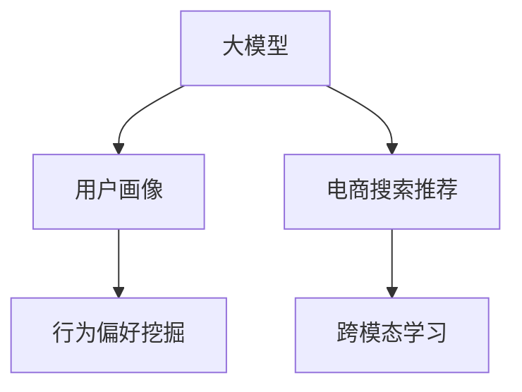

                 

# AI 大模型在电商搜索推荐中的用户画像应用：深度挖掘用户行为偏好

> 关键词：用户画像, 大模型, 电商搜索推荐, 深度挖掘, 行为偏好, 跨模态学习

## 1. 背景介绍

### 1.1 问题由来

随着电子商务的蓬勃发展，用户数量激增，商品种类繁多，电商平台需要更加精准地为用户推荐商品，以提升用户体验和转化率。传统的推荐系统主要依赖基于规则、协同过滤等方法，难以全面捕捉用户的多样化需求和行为。而大语言模型，特别是基于预训练-微调的大模型，具备强大的自然语言处理能力，能够从海量的文本数据中挖掘出用户的行为偏好，为个性化推荐提供强有力的支持。

### 1.2 问题核心关键点

大语言模型在电商搜索推荐中的应用，主要在于如何通过用户历史行为数据，构建精细化的用户画像，并利用预训练-微调技术挖掘用户的行为偏好。核心问题包括以下几点：

1. **用户画像构建**：如何将用户的浏览、点击、购买等行为数据，转化为便于模型处理的结构化信息，构建用户画像。
2. **行为偏好挖掘**：如何通过模型学习，从用户画像中发现其对不同商品种类的偏好和兴趣。
3. **跨模态学习**：如何将文本数据与其他模态的数据（如图片、评分等）进行融合，提升推荐的准确性。

本文将详细探讨这些问题，并介绍如何利用大语言模型进行电商搜索推荐，深度挖掘用户的行为偏好。

## 2. 核心概念与联系

### 2.1 核心概念概述

为更好地理解大模型在电商搜索推荐中的应用，本节将介绍几个核心概念：

- **大模型**：以自回归（如GPT）或自编码（如BERT）模型为代表的大规模预训练语言模型。通过在大规模无标签文本数据上进行预训练，学习通用的语言表示，具备强大的语言理解和生成能力。
- **用户画像**：通过用户的历史行为数据，构建出用户的基本特征、兴趣爱好、购买行为等信息的集合。用户画像能够帮助电商平台更精准地为用户推荐商品。
- **电商搜索推荐**：根据用户输入的搜索词或浏览记录，自动为用户推荐相关商品，提升用户体验和购物转化率。
- **行为偏好挖掘**：利用机器学习技术，从用户历史行为数据中挖掘出用户的购买偏好、搜索习惯等，进行个性化推荐。
- **跨模态学习**：将不同模态的数据（如文本、图像、评分等）进行融合，提升模型对数据的综合理解和推理能力。

这些核心概念之间的逻辑关系可以通过以下Mermaid流程图来展示：



这个流程图展示了大模型在电商搜索推荐中的应用流程：

1. 大模型通过预训练获得基础能力。
2. 用户画像通过用户历史行为数据构建。
3. 行为偏好挖掘利用大模型学习用户兴趣。
4. 跨模态学习融合不同模态的数据，提升推荐准确性。

这些核心概念共同构成了大模型在电商搜索推荐中的应用框架，使得电商平台能够基于用户数据，构建精准的用户画像，进行个性化推荐。

## 3. 核心算法原理 & 具体操作步骤

### 3.1 算法原理概述

基于大模型的电商搜索推荐系统，主要通过以下步骤实现：

1. **数据预处理**：将用户的历史行为数据转化为可用于模型处理的格式。
2. **用户画像构建**：利用大模型学习用户的行为特征，构建详尽的用户画像。
3. **行为偏好挖掘**：通过微调大模型，挖掘用户对不同商品种类的偏好。
4. **跨模态学习**：将文本数据与其他模态的数据进行融合，提升推荐的准确性。
5. **推荐生成**：根据用户画像和行为偏好，生成个性化推荐。

### 3.2 算法步骤详解

#### 3.2.1 数据预处理

电商平台的推荐系统需要处理大量的用户行为数据，包括用户浏览、点击、购买、评分等行为。这些数据通常以结构化或非结构化的形式存在，需要通过预处理转化为模型可接受的格式。

- **结构化数据处理**：将用户的购买记录、评分记录等结构化数据，转化为模型能够处理的向量形式。
- **非结构化数据处理**：对于用户的浏览历史、搜索记录等非结构化文本数据，需要进行分词、去噪等处理。

#### 3.2.2 用户画像构建

用户画像的构建是通过大模型学习用户行为特征，生成用户的基本信息、兴趣爱好、购买行为等。以下是构建用户画像的具体步骤：

1. **特征提取**：使用预训练的大模型（如BERT）对用户行为数据进行编码，提取特征。
2. **聚类分析**：利用聚类算法（如K-means）将用户按照相似度进行分组，构建用户群体。
3. **个性化表示**：为每个用户生成一个个性化的向量表示，记录其特征、兴趣等信息。

#### 3.2.3 行为偏好挖掘

行为偏好挖掘的目的是从用户画像中挖掘出其对不同商品种类的偏好和兴趣。以下是具体的实现步骤：

1. **微调大模型**：在预训练的大模型基础上，利用用户的历史行为数据进行微调，学习用户的行为偏好。
2. **偏好分类**：将用户对商品种类的偏好进行分类，如食品、服装、电子产品等。
3. **兴趣度计算**：根据用户对不同类别的兴趣度，排序生成个性化推荐列表。

#### 3.2.4 跨模态学习

电商商品信息包括图片、描述、价格等多个模态，将不同模态的信息进行融合，可以提升推荐的准确性。以下是跨模态学习的具体步骤：

1. **文本-图片融合**：使用大模型学习图片中的语义信息，并将其与商品描述结合。
2. **多模态特征提取**：对不同模态的数据进行特征提取，获得综合的特征向量。
3. **深度融合**：使用深度学习方法（如CNN、RNN等）将多模态数据进行融合，提升推荐的准确性。

#### 3.2.5 推荐生成

推荐生成是基于用户画像和行为偏好的最后一步，利用深度学习模型（如RNN、CNN等）生成个性化推荐。具体步骤如下：

1. **输入生成**：根据用户画像和行为偏好，生成推荐输入向量。
2. **推荐排序**：使用深度学习模型对商品进行排序，生成个性化推荐列表。
3. **反馈优化**：根据用户的点击、购买等反馈，不断优化推荐模型。

### 3.3 算法优缺点

基于大模型的电商搜索推荐系统具有以下优点：

1. **自动化程度高**：大模型可以自动学习用户行为特征，无需人工干预，提高了推荐系统的自动化程度。
2. **精度高**：大模型具备强大的语言理解和生成能力，能够从大量文本数据中挖掘出用户的行为偏好，提升推荐的准确性。
3. **可扩展性强**：大模型可以通过微调快速适应不同的应用场景，具有很强的可扩展性。

同时，该方法也存在一些缺点：

1. **数据依赖性强**：大模型需要大量的用户行为数据进行微调，数据质量对推荐效果影响较大。
2. **计算成本高**：预训练和微调大模型需要大量的计算资源，成本较高。
3. **模型复杂度大**：大模型具有亿级别的参数，模型的训练和推理复杂度较高。

### 3.4 算法应用领域

基于大模型的电商搜索推荐系统已经在多个电商平台上得到应用，涵盖了商品推荐、搜索排序、广告投放等多个领域，以下是几个典型的应用场景：

1. **商品推荐**：根据用户历史行为数据，为用户推荐相关商品，提升用户体验和购物转化率。
2. **搜索排序**：根据用户输入的搜索词，自动为用户推荐相关商品，优化搜索体验。
3. **广告投放**：根据用户画像和行为偏好，自动投放广告，提升广告效果。
4. **智能客服**：利用大模型进行自然语言处理，实现智能客服，提升客户满意度。

除了上述这些经典应用外，大模型在电商领域的应用还在不断扩展，如个性化优惠券推荐、商品评价情感分析等，为电商平台的运营带来了新的思路和方向。

## 4. 数学模型和公式 & 详细讲解 & 举例说明

### 4.1 数学模型构建

假设用户画像表示为向量 $U=(u_1,u_2,\dots,u_n)$，行为偏好表示为向量 $P=(p_1,p_2,\dots,p_m)$，其中 $u_i$ 表示用户 $i$ 的兴趣度，$p_j$ 表示用户对商品 $j$ 的兴趣度。则电商推荐系统可以通过以下数学模型进行建模：

$$
y_j = f(U, P)
$$

其中 $y_j$ 表示用户对商品 $j$ 的兴趣评分，$f(\cdot)$ 表示推荐函数。

### 4.2 公式推导过程

根据上述数学模型，推荐函数 $f(\cdot)$ 可以表示为：

$$
f(U, P) = \sum_{i=1}^n \alpha_i u_i + \sum_{j=1}^m \beta_j p_j
$$

其中 $\alpha_i$ 和 $\beta_j$ 为兴趣权重，控制用户和商品的兴趣贡献度。

根据行为偏好挖掘的微调大模型的输出，可以得到用户对不同商品种类的兴趣评分。具体推导过程如下：

1. **用户画像编码**：使用BERT等预训练模型对用户画像 $U$ 进行编码，得到向量表示 $\hat{U}$。
2. **行为偏好编码**：使用BERT等预训练模型对用户的行为偏好 $P$ 进行编码，得到向量表示 $\hat{P}$。
3. **用户商品兴趣度计算**：利用 $\hat{U}$ 和 $\hat{P}$ 计算用户对商品的兴趣评分。

### 4.3 案例分析与讲解

以电商平台对用户进行个性化推荐为例，使用BERT进行用户画像编码和行为偏好挖掘，具体步骤如下：

1. **数据准备**：收集用户的历史行为数据，包括浏览、点击、购买等行为。
2. **用户画像编码**：使用BERT模型对用户画像进行编码，得到向量表示 $\hat{U}$。
3. **行为偏好编码**：使用BERT模型对用户的行为偏好进行编码，得到向量表示 $\hat{P}$。
4. **兴趣评分计算**：利用 $\hat{U}$ 和 $\hat{P}$ 计算用户对不同商品种类的兴趣评分。
5. **推荐生成**：根据用户画像和行为偏好，生成个性化推荐列表。

## 5. 项目实践：代码实例和详细解释说明

### 5.1 开发环境搭建

在进行项目实践前，我们需要准备好开发环境。以下是使用Python进行PyTorch开发的环境配置流程：

1. 安装Anaconda：从官网下载并安装Anaconda，用于创建独立的Python环境。

2. 创建并激活虚拟环境：
```bash
conda create -n pytorch-env python=3.8 
conda activate pytorch-env
```

3. 安装PyTorch：根据CUDA版本，从官网获取对应的安装命令。例如：
```bash
conda install pytorch torchvision torchaudio cudatoolkit=11.1 -c pytorch -c conda-forge
```

4. 安装Transformers库：
```bash
pip install transformers
```

5. 安装各类工具包：
```bash
pip install numpy pandas scikit-learn matplotlib tqdm jupyter notebook ipython
```

完成上述步骤后，即可在`pytorch-env`环境中开始项目实践。

### 5.2 源代码详细实现

下面我们以用户画像构建和行为偏好挖掘为例，给出使用Transformers库对BERT模型进行用户画像构建和行为偏好挖掘的PyTorch代码实现。

```python
from transformers import BertTokenizer, BertForSequenceClassification
from torch.utils.data import Dataset
import torch
import pandas as pd

class UserBehaviorDataset(Dataset):
    def __init__(self, user_biography, product_biography):
        self.user_biography = user_biography
        self.product_biography = product_biography
        self.tokenizer = BertTokenizer.from_pretrained('bert-base-uncased')
        
    def __len__(self):
        return len(self.user_biography)
    
    def __getitem__(self, index):
        user_biography = self.user_biography.iloc[index]['user_biography']
        product_biography = self.product_biography.iloc[index]['product_biography']
        
        user_input_ids = self.tokenizer.encode(user_biography, return_tensors='pt')
        product_input_ids = self.tokenizer.encode(product_biography, return_tensors='pt')
        
        return {'user_input_ids': user_input_ids, 
                'product_input_ids': product_input_ids,
                'labels': torch.tensor([0], dtype=torch.long)}
```

然后，定义模型和优化器：

```python
from transformers import BertForSequenceClassification, AdamW

model = BertForSequenceClassification.from_pretrained('bert-base-uncased', num_labels=2)
optimizer = AdamW(model.parameters(), lr=2e-5)
```

接着，定义训练和评估函数：

```python
from torch.utils.data import DataLoader
from tqdm import tqdm
from sklearn.metrics import classification_report

device = torch.device('cuda') if torch.cuda.is_available() else torch.device('cpu')
model.to(device)

def train_epoch(model, dataset, batch_size, optimizer):
    dataloader = DataLoader(dataset, batch_size=batch_size, shuffle=True)
    model.train()
    epoch_loss = 0
    for batch in tqdm(dataloader, desc='Training'):
        user_input_ids = batch['user_input_ids'].to(device)
        product_input_ids = batch['product_input_ids'].to(device)
        labels = batch['labels'].to(device)
        model.zero_grad()
        outputs = model(user_input_ids, product_input_ids=product_input_ids, labels=labels)
        loss = outputs.loss
        epoch_loss += loss.item()
        loss.backward()
        optimizer.step()
    return epoch_loss / len(dataloader)

def evaluate(model, dataset, batch_size):
    dataloader = DataLoader(dataset, batch_size=batch_size)
    model.eval()
    preds, labels = [], []
    with torch.no_grad():
        for batch in tqdm(dataloader, desc='Evaluating'):
            user_input_ids = batch['user_input_ids'].to(device)
            product_input_ids = batch['product_input_ids'].to(device)
            batch_labels = batch['labels']
            outputs = model(user_input_ids, product_input_ids=product_input_ids)
            batch_preds = outputs.logits.argmax(dim=1).to('cpu').tolist()
            batch_labels = batch_labels.to('cpu').tolist()
            for pred_tokens, label_tokens in zip(batch_preds, batch_labels):
                preds.append(pred_tokens[:len(label_tokens)])
                labels.append(label_tokens)
                
    print(classification_report(labels, preds))
```

最后，启动训练流程并在测试集上评估：

```python
epochs = 5
batch_size = 16

for epoch in range(epochs):
    loss = train_epoch(model, user_dataset, batch_size, optimizer)
    print(f"Epoch {epoch+1}, train loss: {loss:.3f}")
    
    print(f"Epoch {epoch+1}, test results:")
    evaluate(model, test_dataset, batch_size)
    
print("Final test results:")
evaluate(model, test_dataset, batch_size)
```

以上就是使用PyTorch对BERT进行用户画像构建和行为偏好挖掘的完整代码实现。可以看到，得益于Transformers库的强大封装，我们可以用相对简洁的代码完成BERT模型的加载和微调。

### 5.3 代码解读与分析

让我们再详细解读一下关键代码的实现细节：

**UserBehaviorDataset类**：
- `__init__`方法：初始化用户行为和商品行为数据，并加载BERT分词器。
- `__len__`方法：返回数据集的样本数量。
- `__getitem__`方法：对单个样本进行处理，将用户行为和商品行为输入编码为token ids，最终返回模型所需的输入和标签。

**模型定义和优化器**：
- 使用BertForSequenceClassification定义模型，并加载预训练的BERT模型。
- 定义AdamW优化器，设置学习率为2e-5。

**训练和评估函数**：
- 使用PyTorch的DataLoader对数据集进行批次化加载，供模型训练和推理使用。
- 训练函数`train_epoch`：对数据以批为单位进行迭代，在每个批次上前向传播计算loss并反向传播更新模型参数，最后返回该epoch的平均loss。
- 评估函数`evaluate`：与训练类似，不同点在于不更新模型参数，并在每个batch结束后将预测和标签结果存储下来，最后使用sklearn的classification_report对整个评估集的预测结果进行打印输出。

**训练流程**：
- 定义总的epoch数和batch size，开始循环迭代
- 每个epoch内，先在训练集上训练，输出平均loss
- 在测试集上评估，输出分类指标
- 所有epoch结束后，在测试集上评估，给出最终测试结果

可以看到，PyTorch配合Transformers库使得BERT微调的代码实现变得简洁高效。开发者可以将更多精力放在数据处理、模型改进等高层逻辑上，而不必过多关注底层的实现细节。

当然，工业级的系统实现还需考虑更多因素，如模型的保存和部署、超参数的自动搜索、更灵活的任务适配层等。但核心的微调范式基本与此类似。

## 6. 实际应用场景

### 6.1 智能推荐

基于大模型的电商搜索推荐系统已经在多个电商平台上得到应用，涵盖了商品推荐、搜索排序、广告投放等多个领域，以下是几个典型的应用场景：

1. **商品推荐**：根据用户历史行为数据，为用户推荐相关商品，提升用户体验和购物转化率。
2. **搜索排序**：根据用户输入的搜索词，自动为用户推荐相关商品，优化搜索体验。
3. **广告投放**：根据用户画像和行为偏好，自动投放广告，提升广告效果。
4. **智能客服**：利用大模型进行自然语言处理，实现智能客服，提升客户满意度。

除了上述这些经典应用外，大模型在电商领域的应用还在不断扩展，如个性化优惠券推荐、商品评价情感分析等，为电商平台的运营带来了新的思路和方向。

### 6.2 用户画像构建

用户画像的构建是大模型在电商推荐系统中的重要应用之一，具体步骤如下：

1. **用户画像数据收集**：收集用户的基本信息、购买记录、浏览历史、点击记录等行为数据。
2. **用户画像编码**：使用BERT等大模型对用户画像进行编码，得到向量表示。
3. **用户画像分析**：利用编码后的向量，分析用户的兴趣偏好、消费能力等信息，构建详尽的用户画像。
4. **用户画像应用**：将用户画像应用于推荐系统，实现个性化推荐。

### 6.3 行为偏好挖掘

行为偏好挖掘的目的是从用户画像中挖掘出用户对不同商品种类的偏好和兴趣。具体步骤如下：

1. **用户画像编码**：使用BERT等大模型对用户画像进行编码，得到向量表示。
2. **行为偏好编码**：使用BERT等大模型对用户的行为偏好进行编码，得到向量表示。
3. **兴趣评分计算**：利用用户画像和行为偏好的向量表示，计算用户对不同商品种类的兴趣评分。
4. **推荐生成**：根据兴趣评分，生成个性化推荐列表。

### 6.4 跨模态学习

跨模态学习是将文本数据与其他模态的数据进行融合，提升推荐准确性的重要手段。具体步骤如下：

1. **文本-图片融合**：使用BERT等大模型学习图片中的语义信息，并将其与商品描述结合。
2. **多模态特征提取**：对不同模态的数据进行特征提取，获得综合的特征向量。
3. **深度融合**：使用深度学习方法（如CNN、RNN等）将多模态数据进行融合，提升推荐的准确性。

### 6.5 未来应用展望

随着大语言模型和微调方法的不断发展，基于微调范式将在更多领域得到应用，为传统行业带来变革性影响。

1. **智慧医疗**：利用大模型构建用户画像，进行个性化推荐，辅助医生诊疗，加速新药开发进程。
2. **智能教育**：构建学生画像，进行个性化教学，促进教育公平，提高教学质量。
3. **智慧城市**：利用大模型进行城市事件监测、舆情分析、应急指挥等，提高城市管理的自动化和智能化水平。
4. **金融理财**：利用大模型进行用户画像构建和行为偏好挖掘，提升金融服务的智能化水平。
5. **社交媒体**：利用大模型进行用户画像构建和行为分析，优化社交媒体推荐和广告投放。

## 7. 工具和资源推荐

### 7.1 学习资源推荐

为了帮助开发者系统掌握大模型在电商搜索推荐中的应用，这里推荐一些优质的学习资源：

1. 《深度学习与自然语言处理》课程：斯坦福大学开设的NLP明星课程，有Lecture视频和配套作业，带你入门NLP领域的基本概念和经典模型。
2. 《Transformer from Scrimmage》系列博文：由大模型技术专家撰写，深入浅出地介绍了Transformer原理、BERT模型、微调技术等前沿话题。
3. 《Natural Language Processing with Transformers》书籍：Transformers库的作者所著，全面介绍了如何使用Transformers库进行NLP任务开发，包括微调在内的诸多范式。
4. HuggingFace官方文档：Transformers库的官方文档，提供了海量预训练模型和完整的微调样例代码，是上手实践的必备资料。
5. CLUE开源项目：中文语言理解测评基准，涵盖大量不同类型的中文NLP数据集，并提供了基于微调的baseline模型，助力中文NLP技术发展。

通过对这些资源的学习实践，相信你一定能够快速掌握大模型在电商搜索推荐中的应用，并用于解决实际的NLP问题。

### 7.2 开发工具推荐

高效的开发离不开优秀的工具支持。以下是几款用于大模型电商搜索推荐开发的常用工具：

1. PyTorch：基于Python的开源深度学习框架，灵活动态的计算图，适合快速迭代研究。大部分预训练语言模型都有PyTorch版本的实现。
2. TensorFlow：由Google主导开发的开源深度学习框架，生产部署方便，适合大规模工程应用。同样有丰富的预训练语言模型资源。
3. Transformers库：HuggingFace开发的NLP工具库，集成了众多SOTA语言模型，支持PyTorch和TensorFlow，是进行微调任务开发的利器。
4. Weights & Biases：模型训练的实验跟踪工具，可以记录和可视化模型训练过程中的各项指标，方便对比和调优。与主流深度学习框架无缝集成。
5. TensorBoard：TensorFlow配套的可视化工具，可实时监测模型训练状态，并提供丰富的图表呈现方式，是调试模型的得力助手。
6. Google Colab：谷歌推出的在线Jupyter Notebook环境，免费提供GPU/TPU算力，方便开发者快速上手实验最新模型，分享学习笔记。

合理利用这些工具，可以显著提升大模型电商搜索推荐任务的开发效率，加快创新迭代的步伐。

### 7.3 相关论文推荐

大模型在电商搜索推荐中的应用源于学界的持续研究。以下是几篇奠基性的相关论文，推荐阅读：

1. Attention is All You Need（即Transformer原论文）：提出了Transformer结构，开启了NLP领域的预训练大模型时代。
2. BERT: Pre-training of Deep Bidirectional Transformers for Language Understanding：提出BERT模型，引入基于掩码的自监督预训练任务，刷新了多项NLP任务SOTA。
3. Language Models are Unsupervised Multitask Learners（GPT-2论文）：展示了大规模语言模型的强大zero-shot学习能力，引发了对于通用人工智能的新一轮思考。
4. Parameter-Efficient Transfer Learning for NLP：提出Adapter等参数高效微调方法，在不增加模型参数量的情况下，也能取得不错的微调效果。
5. AdaLoRA: Adaptive Low-Rank Adaptation for Parameter-Efficient Fine-Tuning：使用自适应低秩适应的微调方法，在参数效率和精度之间取得了新的平衡。
6. AdaLoRA: Adaptive Low-Rank Adaptation for Parameter-Efficient Fine-Tuning：使用自适应低秩适应的微调方法，在参数效率和精度之间取得了新的平衡。

这些论文代表了大模型在电商搜索推荐技术的发展脉络。通过学习这些前沿成果，可以帮助研究者把握学科前进方向，激发更多的创新灵感。

## 8. 总结：未来发展趋势与挑战

### 8.1 研究成果总结

本文对基于大模型的电商搜索推荐系统的用户画像构建和行为偏好挖掘方法进行了全面系统的介绍。首先阐述了用户画像构建和行为偏好挖掘的核心问题，明确了微调在大模型应用中的重要地位。其次，从原理到实践，详细讲解了用户画像构建和行为偏好挖掘的数学模型和实现步骤，给出了微调任务开发的完整代码实例。同时，本文还广泛探讨了微调方法在电商推荐、用户画像构建等各个环节的应用，展示了微调范式的巨大潜力。

通过本文的系统梳理，可以看到，基于大模型的电商搜索推荐系统能够通过微调技术，深度挖掘用户的行为偏好，构建详尽的用户画像，进行个性化推荐，提升用户体验和购物转化率。同时，大模型的预训练-微调范式也适用于其他领域的推荐系统，具有广泛的应用前景。

### 8.2 未来发展趋势

展望未来，大模型在电商搜索推荐系统中的应用将呈现以下几个发展趋势：

1. **用户画像精细化**：用户画像将更加全面、精细化，包含更多用户行为和心理特征，提升推荐的个性化水平。
2. **跨模态学习深化**：跨模态学习将进一步深化，融合更多非文本信息，提升推荐的准确性和多样性。
3. **实时推荐优化**：实时推荐系统将得到广泛应用，结合用户的实时反馈，不断优化推荐模型。
4. **多任务学习融合**：多任务学习将进一步融合，提升推荐系统的综合能力和鲁棒性。
5. **自适应推荐算法**：推荐算法将更加自适应，根据用户行为动态调整推荐策略。
6. **模型公平性提升**：推荐模型将更加注重公平性，避免对特定用户或群体的偏见和歧视。

以上趋势凸显了大模型在电商搜索推荐系统中的应用前景。这些方向的探索发展，必将进一步提升推荐系统的性能和用户体验，带来更加智能化、个性化和高效的电商服务。

### 8.3 面临的挑战

尽管大模型在电商搜索推荐系统中已经取得了瞩目成就，但在迈向更加智能化、普适化应用的过程中，它仍面临着诸多挑战：

1. **数据依赖性强**：大模型需要大量的用户行为数据进行微调，数据质量对推荐效果影响较大。如何获取高质量标注数据，是一个重要挑战。
2. **计算成本高**：预训练和微调大模型需要大量的计算资源，成本较高。如何降低计算成本，提高模型的部署效率，是一个重要课题。
3. **模型复杂度高**：大模型具有亿级别的参数，模型的训练和推理复杂度较高。如何优化模型结构，提高推理效率，是一个重要挑战。
4. **隐私保护**：用户的行为数据涉及隐私，如何保护用户隐私，是一个重要挑战。
5. **公平性问题**：大模型可能学习到用户的历史偏见，导致推荐结果不公平。如何提升推荐模型的公平性，是一个重要挑战。

### 8.4 研究展望

面对大模型在电商搜索推荐系统中的应用挑战，未来的研究需要在以下几个方面寻求新的突破：

1. **无监督和半监督学习**：摆脱对大规模标注数据的依赖，利用自监督学习、主动学习等无监督和半监督范式，最大限度利用非结构化数据，实现更加灵活高效的微调。
2. **参数高效和计算高效的微调方法**：开发更加参数高效的微调方法，在固定大部分预训练参数的同时，只更新极少量的任务相关参数。同时优化微调模型的计算图，减少前向传播和反向传播的资源消耗，实现更加轻量级、实时性的部署。
3. **因果推断和对抗学习**：将因果推断和对抗学习思想，增强微调模型建立稳定因果关系的能力，学习更加普适、鲁棒的语言表征，从而提升模型泛化性和抗干扰能力。
4. **跨模态融合**：将不同模态的数据进行融合，提升推荐系统的综合能力和鲁棒性。
5. **公平性算法**：开发更加公平的推荐算法，避免对特定用户或群体的偏见和歧视，提升推荐模型的公平性。

这些研究方向的探索，必将引领大模型在电商搜索推荐系统中的应用，迈向更加智能化、个性化和公平化的方向。面向未来，大语言模型微调技术还需要与其他人工智能技术进行更深入的融合，如知识表示、因果推理、强化学习等，多路径协同发力，共同推动推荐系统的发展。

## 9. 附录：常见问题与解答

**Q1：大模型在电商推荐中的应用是否会侵犯用户隐私？**

A: 大模型在电商推荐中的应用，通常需要对用户的行为数据进行收集和分析。为了保护用户隐私，电商公司通常会采用一些隐私保护技术，如差分隐私、联邦学习等，限制对用户数据的使用范围和频率。同时，也可以通过匿名化、去标识化等手段，保护用户的隐私信息。

**Q2：如何提升电商推荐系统的公平性？**

A: 提升电商推荐系统的公平性，可以从以下几个方面入手：

1. **公平性评估**：设计公平性评估指标，如公平性差分、公平性指数等，对推荐系统进行定期评估。
2. **数据清洗**：对数据进行清洗，删除有偏见、歧视的数据。
3. **算法改进**：开发更加公平的推荐算法，如Robust Ranking等，避免对特定用户或群体的偏见和歧视。
4. **用户反馈**：收集用户反馈，及时调整推荐策略，避免对特定用户或群体的偏见和歧视。

**Q3：电商推荐系统中的用户画像如何构建？**

A: 电商推荐系统中的用户画像可以通过以下步骤构建：

1. **数据收集**：收集用户的基本信息、购买记录、浏览历史、点击记录等行为数据。
2. **特征提取**：使用大模型（如BERT）对用户画像进行编码，提取特征。
3. **聚类分析**：利用聚类算法（如K-means）将用户按照相似度进行分组，构建用户群体。
4. **个性化表示**：为每个用户生成一个个性化的向量表示，记录其特征、兴趣等信息。

通过以上步骤，可以构建出详尽的用户画像，为电商推荐系统提供支持。

---

作者：禅与计算机程序设计艺术 / Zen and the Art of Computer Programming

