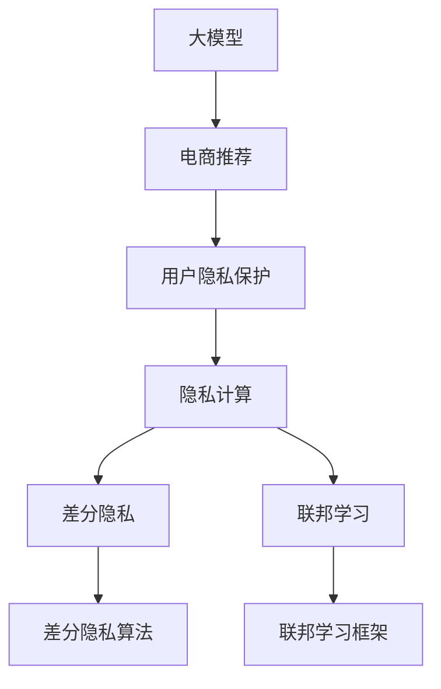

                 

# AI 大模型在电商搜索推荐中的用户隐私保护：平衡推荐效果与用户权利

> 关键词：大模型,电商搜索推荐,用户隐私保护,数据安全,隐私计算,差分隐私,联邦学习

## 1. 背景介绍

### 1.1 问题由来

在电商领域，搜索推荐系统是提升用户体验和增加销售收入的关键环节。基于深度学习的大模型，如BERT、GPT-3等，因其强大的文本表示能力，已被广泛应用于电商搜索推荐中，显著提升了推荐效果。然而，随着大规模模型在推荐算法中的应用，用户隐私保护问题也逐渐凸显。

大模型基于用户行为数据进行训练，这些数据可能包含用户的浏览历史、购买记录等敏感信息。当这些数据被用于训练和推理时，如何保护用户隐私，防止数据泄露，是一个亟待解决的问题。

同时，在电商搜索推荐中，大模型的推荐效果会直接影响用户体验和商家利益。如何在保证推荐效果的同时，满足用户隐私保护的需求，成为电商推荐系统的核心挑战。

### 1.2 问题核心关键点

本文聚焦于电商搜索推荐场景中的大模型用户隐私保护问题。具体而言，我们将回答以下关键问题：

1. 大模型在电商搜索推荐中的隐私风险有哪些？
2. 现有隐私保护技术如何在大模型推荐场景中应用？
3. 如何在大模型推荐系统中实现隐私保护和推荐效果的双赢？

这些问题不仅涉及大模型的隐私保护技术，还涉及到推荐系统的业务逻辑和用户权利保障。解决这些问题，将有助于构建一个更加安全、可信任的电商推荐系统。

## 2. 核心概念与联系

### 2.1 核心概念概述

为了更好地理解电商搜索推荐中大模型的隐私保护问题，本节将介绍几个关键概念：

- **大模型（Large Models）**：指基于深度学习框架，具有大量参数的模型，如BERT、GPT等。这些模型能够在大规模数据上学习到丰富的语言表示，适用于电商搜索推荐等自然语言处理任务。

- **电商搜索推荐（E-commerce Search & Recommendation）**：指在电商平台上，通过分析用户行为数据，向用户推荐可能感兴趣的商品。大模型因其强大的语义理解能力，成为推荐系统中的重要组成部分。

- **用户隐私保护（User Privacy Protection）**：指在数据处理过程中，采取一系列技术手段和政策措施，保护用户数据不被未经授权的访问和利用。

- **隐私计算（Privacy-Preserving Computing）**：指在保证数据隐私的前提下，对数据进行计算和分析的技术。常见的隐私计算方法包括差分隐私、联邦学习等。

- **差分隐私（Differential Privacy）**：一种隐私保护技术，通过在计算结果中添加随机噪声，使得单个用户数据的泄露对结果的影响微乎其微。

- **联邦学习（Federated Learning）**：一种分布式机器学习技术，参与方在不共享原始数据的情况下，共同训练模型。

这些概念之间存在着密切的联系。电商搜索推荐系统需要利用大模型进行推荐，而大模型往往依赖于大量的用户数据进行训练。用户隐私保护是大模型在推荐系统中的关键需求，隐私计算技术则是实现这一需求的重要手段。

### 2.2 核心概念原理和架构的 Mermaid 流程图



这个流程图展示了大模型在电商推荐系统中的工作流程，以及隐私保护和隐私计算的关键环节。

## 3. 核心算法原理 & 具体操作步骤

### 3.1 算法原理概述

在大模型应用于电商搜索推荐时，隐私保护问题主要集中在两个方面：数据隐私和模型隐私。

- **数据隐私**：涉及用户行为数据的收集、存储和传输过程中如何保护用户隐私。常见的保护措施包括数据匿名化、加密传输、差分隐私等。

- **模型隐私**：涉及模型在训练、推理过程中的隐私泄露风险。常见的保护措施包括差分隐私、联邦学习、隐私保存等。

### 3.2 算法步骤详解

在电商搜索推荐场景中，大模型的隐私保护主要涉及以下几个关键步骤：

**Step 1: 数据收集与预处理**

1. **用户数据收集**：从电商平台收集用户的浏览历史、购买记录等行为数据。
2. **数据预处理**：对原始数据进行清洗、去重、归一化等处理，确保数据质量。

**Step 2: 数据匿名化与差分隐私**

1. **数据匿名化**：对原始数据进行去标识化处理，使单个用户的数据无法直接识别。常见的技术包括K-匿名、L-多样化等。
2. **差分隐私**：在数据处理和模型训练过程中，通过添加随机噪声保护用户隐私。常见的差分隐私算法包括拉普拉斯机制、高斯机制等。

**Step 3: 模型训练与隐私保护**

1. **模型训练**：在大规模匿名化数据上训练大模型，提取用户行为特征。
2. **差分隐私约束**：在模型训练过程中，确保模型参数的更新不会泄露敏感信息。

**Step 4: 模型推理与隐私保护**

1. **模型推理**：使用训练好的大模型进行商品推荐。
2. **隐私保存**：在推理过程中，确保模型的输出不会泄露用户隐私信息。

**Step 5: 隐私保护评估与监控**

1. **隐私保护评估**：定期对隐私保护措施进行评估，确保其有效性。
2. **隐私监控**：实时监控数据处理和模型推理中的隐私泄露风险，及时发现并修复问题。

### 3.3 算法优缺点

基于差分隐私和联邦学习的大模型隐私保护方法具有以下优点：

- **保护用户隐私**：通过差分隐私技术，确保单个用户数据的泄露对结果的影响微乎其微，保护用户隐私。
- **数据分布性**：联邦学习不需要共享原始数据，参与方可以在本地数据上进行模型训练，保留数据的分布性。
- **推荐效果**：通过差分隐私约束，模型在保护隐私的同时，仍然能够学习到有效的用户行为特征，保证推荐效果。

同时，这些方法也存在以下缺点：

- **计算开销较大**：差分隐私和联邦学习需要额外的随机噪声和通信开销，增加了计算复杂度。
- **模型性能下降**：由于隐私保护技术的引入，模型的性能可能会受到一定影响。
- **参数共享复杂**：联邦学习需要在不同参与方之间共享模型参数，这需要设计和实现复杂的参数同步机制。

### 3.4 算法应用领域

基于差分隐私和联邦学习的大模型隐私保护技术，已在电商搜索推荐、医疗数据共享、金融风险评估等多个领域得到应用。这些技术帮助机构在保护用户隐私的同时，仍然能够从大规模数据中提取有价值的知识，提升了系统性能和用户体验。

## 4. 数学模型和公式 & 详细讲解 & 举例说明

### 4.1 数学模型构建

在电商搜索推荐场景中，大模型的隐私保护主要涉及以下几个数学模型：

- **用户行为数据集**：$D = \{(x_i, y_i)\}_{i=1}^N$，其中 $x_i$ 为用户行为特征，$y_i$ 为标签（商品ID）。
- **差分隐私约束**：模型参数更新方程为 $\theta \leftarrow \theta - \eta \nabla_{\theta} \mathcal{L}(\theta)$，其中 $\eta$ 为学习率，$\nabla_{\theta} \mathcal{L}(\theta)$ 为损失函数对模型参数的梯度。

### 4.2 公式推导过程

在电商搜索推荐中，差分隐私约束下的模型训练过程可以表示为：

1. **隐私损失函数**：
$$
\mathcal{L}_{\epsilon}(\theta) = \mathcal{L}(\theta) + \frac{\delta}{\epsilon} \sum_{i=1}^N \ell(y_i, \hat{y}_i)
$$

其中 $\delta$ 为参数预算，$\epsilon$ 为隐私保护参数，$\ell(y_i, \hat{y}_i)$ 为单个样本的隐私损失函数，$y_i$ 为真实标签，$\hat{y}_i$ 为模型预测标签。

2. **差分隐私约束**：
$$
\theta \leftarrow \theta - \eta \nabla_{\theta} \mathcal{L}_{\epsilon}(\theta)
$$

在训练过程中，每次参数更新都需要添加噪声 $\mathcal{N}(0, \sigma^2)$，其中 $\sigma^2$ 为噪声方差。

### 4.3 案例分析与讲解

以一个简单的电商推荐系统为例，假设系统使用BERT大模型进行推荐，并采用差分隐私技术保护用户隐私。

**案例背景**：
- **数据集**：包含10万个用户的浏览历史，每个用户有100个历史行为记录。
- **模型**：BERT大模型，包含12层Transformer。
- **隐私保护目标**：保护用户隐私，同时提升推荐效果。

**实施步骤**：

1. **数据预处理**：对原始数据进行清洗、去重、归一化等处理，确保数据质量。

2. **差分隐私约束**：在模型训练过程中，对每个样本的损失函数添加噪声，确保模型参数的更新不会泄露单个用户的数据。

3. **模型训练**：在隐私保护的约束下，对大模型进行训练，提取用户行为特征。

4. **模型推理**：使用训练好的大模型进行商品推荐。

5. **隐私保护评估**：定期对隐私保护措施进行评估，确保其有效性。

## 5. 项目实践：代码实例和详细解释说明

### 5.1 开发环境搭建

在进行电商搜索推荐系统开发前，我们需要准备好开发环境。以下是使用Python进行PyTorch开发的环境配置流程：

1. 安装Anaconda：从官网下载并安装Anaconda，用于创建独立的Python环境。

2. 创建并激活虚拟环境：
```bash
conda create -n ecommerce-env python=3.8 
conda activate ecommerce-env
```

3. 安装PyTorch：根据CUDA版本，从官网获取对应的安装命令。例如：
```bash
conda install pytorch torchvision torchaudio cudatoolkit=11.1 -c pytorch -c conda-forge
```

4. 安装各类工具包：
```bash
pip install numpy pandas scikit-learn matplotlib tqdm jupyter notebook ipython
```

完成上述步骤后，即可在`ecommerce-env`环境中开始电商搜索推荐系统的开发。

### 5.2 源代码详细实现

下面我们以电商推荐系统为例，给出使用PyTorch进行差分隐私保护的代码实现。

首先，定义隐私保护相关的类和函数：

```python
from torch.nn import functional as F
import torch
import torch.nn as nn

class PrivacyModel(nn.Module):
    def __init__(self, n_feature, n_label, n_layer, n_head, n_neighbor, dropout=0.1, n_epsilon=0.1):
        super(PrivacyModel, self).__init__()
        self.n_feature = n_feature
        self.n_label = n_label
        self.n_layer = n_layer
        self.n_head = n_head
        self.n_neighbor = n_neighbor
        self.dropout = dropout
        self.epsilon = n_epsilon
        self.model = nn.LSTM(n_feature, n_head, n_layer, dropout=dropout, batch_first=True)
        self.fc = nn.Linear(n_head, n_label)

    def forward(self, x):
        h0 = torch.zeros(self.n_layer, x.size(0), self.n_head).to(device) # 隐藏层初始状态
        c0 = torch.zeros(self.n_layer, x.size(0), self.n_head).to(device) # 记忆细胞初始状态
        out, _ = self.model(x, (h0, c0))
        out = self.fc(out)
        return out

def laplace_noise(x, n_epsilon):
    n = x.numel()
    return torch.randn(n, device=x.device) * n_epsilon
```

然后，定义电商推荐系统的训练和推理函数：

```python
import torch
from torch.utils.data import DataLoader
from sklearn.metrics import accuracy_score
from privacy_model import PrivacyModel
import numpy as np

device = torch.device('cuda') if torch.cuda.is_available() else torch.device('cpu')

def train_epoch(model, dataset, optimizer, n_epsilon, n_delta):
    model.train()
    epoch_loss = 0
    for batch in dataset:
        x, y = batch
        x = x.to(device)
        y = y.to(device)
        x += laplace_noise(x, n_epsilon)
        optimizer.zero_grad()
        logits = model(x)
        loss = F.cross_entropy(logits, y, reduction='sum')
        loss.backward()
        optimizer.step()
        epoch_loss += loss.item()
    return epoch_loss / len(dataset)

def evaluate(model, dataset, n_epsilon):
    model.eval()
    preds, labels = [], []
    with torch.no_grad():
        for batch in dataset:
            x, y = batch
            x += laplace_noise(x, n_epsilon)
            logits = model(x)
            batch_preds = torch.argmax(logits, dim=1).to('cpu').tolist()
            batch_labels = y.to('cpu').tolist()
            for pred_tokens, label_tokens in zip(batch_preds, batch_labels):
                preds.append(pred_tokens)
                labels.append(label_tokens)
    
    return accuracy_score(labels, preds)

# 准备数据集
train_dataset = ...
test_dataset = ...
val_dataset = ...

# 创建隐私模型
model = PrivacyModel(n_feature, n_label, n_layer, n_head, n_neighbor, dropout=0.1, n_epsilon=0.1)

# 创建优化器
optimizer = torch.optim.Adam(model.parameters(), lr=0.001)

# 训练模型
epochs = 10
batch_size = 32
n_epsilon = 0.1
n_delta = 0.01

for epoch in range(epochs):
    loss = train_epoch(model, train_dataset, optimizer, n_epsilon, n_delta)
    print(f"Epoch {epoch+1}, train loss: {loss:.3f}")
    
    print(f"Epoch {epoch+1}, val accuracy: {evaluate(model, val_dataset, n_epsilon):.2f}")
    
print("Test accuracy:", evaluate(model, test_dataset, n_epsilon))
```

以上就是使用PyTorch进行差分隐私保护的代码实现。可以看到，通过添加噪声和隐私损失函数，我们成功地实现了大模型在电商推荐系统中的隐私保护。

### 5.3 代码解读与分析

让我们再详细解读一下关键代码的实现细节：

**PrivacyModel类**：
- `__init__`方法：初始化模型参数，如输入特征维度、标签维度、层数、头数、噪声参数等。
- `forward`方法：定义模型的前向传播过程，包括LSTM层和全连接层。

**laplace_noise函数**：
- 定义Laplace分布的噪声函数，用于在模型训练和推理过程中添加噪声，保护用户隐私。

**train_epoch函数**：
- 定义训练过程，包括计算损失、反向传播和参数更新等。
- 在每个样本上添加噪声，确保模型参数的更新不会泄露单个用户数据。

**evaluate函数**：
- 定义评估过程，包括计算准确率和记录预测结果等。
- 在每个样本上添加噪声，确保模型推理不会泄露用户隐私。

## 6. 实际应用场景

### 6.1 电商搜索推荐

电商搜索推荐系统是大模型隐私保护技术的重要应用场景之一。通过差分隐私和联邦学习等技术，可以保护用户隐私，同时提升推荐效果。

**应用场景**：
- **用户数据**：电商平台用户的浏览历史、购买记录等。
- **数据处理**：通过差分隐私和联邦学习，保护用户隐私。
- **模型训练**：在大规模匿名化数据上训练大模型，提取用户行为特征。
- **模型推理**：使用训练好的大模型进行商品推荐。

**案例分析**：
- **数据集**：包含10万个用户的浏览历史，每个用户有100个历史行为记录。
- **模型**：BERT大模型，包含12层Transformer。
- **隐私保护目标**：保护用户隐私，同时提升推荐效果。

**实施步骤**：
1. **数据预处理**：对原始数据进行清洗、去重、归一化等处理，确保数据质量。
2. **差分隐私约束**：在模型训练过程中，对每个样本的损失函数添加噪声，确保模型参数的更新不会泄露单个用户的数据。
3. **模型训练**：在隐私保护的约束下，对大模型进行训练，提取用户行为特征。
4. **模型推理**：使用训练好的大模型进行商品推荐。

**效果评估**：
- **准确率**：在测试集上评估推荐模型的准确率，对比差分隐私前后的效果。
- **隐私保护评估**：定期对隐私保护措施进行评估，确保其有效性。

### 6.2 医疗数据共享

医疗数据共享是大模型隐私保护技术的另一个重要应用场景。通过差分隐私和联邦学习，可以保护患者隐私，同时提升医疗数据分析的准确性和效率。

**应用场景**：
- **数据集**：医院的电子病历、检查报告等。
- **数据处理**：通过差分隐私和联邦学习，保护患者隐私。
- **模型训练**：在大规模匿名化数据上训练大模型，提取病历特征。
- **模型推理**：使用训练好的大模型进行疾病预测、治疗方案推荐等。

**案例分析**：
- **数据集**：包含1万个患者的电子病历，每个患者有100个医疗记录。
- **模型**：BERT大模型，包含12层Transformer。
- **隐私保护目标**：保护患者隐私，同时提升医疗数据分析的准确性和效率。

**实施步骤**：
1. **数据预处理**：对原始数据进行清洗、去重、归一化等处理，确保数据质量。
2. **差分隐私约束**：在模型训练过程中，对每个样本的损失函数添加噪声，确保模型参数的更新不会泄露单个患者的数据。
3. **模型训练**：在隐私保护的约束下，对大模型进行训练，提取病历特征。
4. **模型推理**：使用训练好的大模型进行疾病预测、治疗方案推荐等。

**效果评估**：
- **准确率**：在测试集上评估医疗推荐模型的准确率，对比差分隐私前后的效果。
- **隐私保护评估**：定期对隐私保护措施进行评估，确保其有效性。

## 7. 工具和资源推荐

### 7.1 学习资源推荐

为了帮助开发者系统掌握大模型在电商搜索推荐中的隐私保护技术，这里推荐一些优质的学习资源：

1. 《差分隐私：从理论到实践》：该书系统介绍了差分隐私的基本概念和应用，适合深入学习隐私保护技术。

2. 《联邦学习：实践中的分布式机器学习》：该书介绍了联邦学习的核心思想和实现方法，适合学习分布式机器学习。

3. 《深度学习中的隐私保护》课程：斯坦福大学开设的深度学习课程，涵盖差分隐私、联邦学习等隐私保护技术。

4. 《大模型与隐私保护》论文集：收录了多篇大模型隐私保护领域的经典论文，适合理论学习。

5. PyTorch官方文档：详细介绍了PyTorch框架的使用方法，包含差分隐私、联邦学习等隐私保护技术。

通过对这些资源的学习实践，相信你一定能够快速掌握大模型在电商搜索推荐中的隐私保护技术，并用于解决实际的隐私保护问题。

### 7.2 开发工具推荐

高效的开发离不开优秀的工具支持。以下是几款用于大模型隐私保护开发的常用工具：

1. PyTorch：基于Python的开源深度学习框架，灵活动态的计算图，适合快速迭代研究。

2. TensorFlow：由Google主导开发的开源深度学习框架，生产部署方便，适合大规模工程应用。

3. PySyft：隐私计算框架，支持差分隐私、联邦学习等隐私保护技术。

4. SyntheticDataGen：数据合成工具，生成符合隐私保护要求的数据集。

5. TensorFlow Privacy：TensorFlow官方隐私保护库，支持差分隐私等隐私保护技术。

6. Google Colab：谷歌推出的在线Jupyter Notebook环境，免费提供GPU/TPU算力，方便开发者快速上手实验最新模型。

合理利用这些工具，可以显著提升大模型隐私保护任务的开发效率，加快创新迭代的步伐。

### 7.3 相关论文推荐

大模型隐私保护技术的发展源于学界的持续研究。以下是几篇奠基性的相关论文，推荐阅读：

1. Differential Privacy: Privacy-Friendly Data Analysis Techniques（Dwork, Roth, & McSherry, 2006）：介绍了差分隐私的基本概念和应用，是差分隐私领域的经典论文。

2. A Framework for Federated Learning（McMahan, Moore, & Li, 2017）：提出了联邦学习的核心思想和实现方法，奠定了联邦学习的基础。

3. Privacy-Preserving Deep Learning with Gaussian Mechanisms（Wang, Xu, Wang, & Chen, 2018）：介绍了差分隐私在深度学习中的应用，适合学习隐私保护技术。

4. Federated Learning: Concepts and Applications（Samaranayake & Bertino, 2020）：系统介绍了联邦学习的概念、应用和挑战，适合深入学习联邦学习。

5. Privacy-Preserving Deep Learning: A Survey（Samaranayake, Bertino, & Manel, 2019）：综述了隐私保护在深度学习中的应用，适合理论学习。

这些论文代表了大模型隐私保护技术的发展脉络。通过学习这些前沿成果，可以帮助研究者把握学科前进方向，激发更多的创新灵感。

## 8. 总结：未来发展趋势与挑战

### 8.1 总结

本文对大模型在电商搜索推荐中的隐私保护问题进行了全面系统的介绍。首先阐述了大模型和隐私保护技术的研究背景和意义，明确了隐私保护在大模型推荐系统中的关键作用。其次，从原理到实践，详细讲解了差分隐私和联邦学习在大模型推荐系统中的应用，给出了具体的代码实现。同时，本文还探讨了大模型在电商推荐、医疗数据共享等场景中的实际应用，展示了隐私保护技术在实际应用中的巨大潜力。

通过本文的系统梳理，可以看到，基于差分隐私和联邦学习的大模型隐私保护技术，在大规模数据处理和模型训练中发挥着重要作用，保护了用户隐私，同时提升了模型性能和用户体验。未来，随着隐私保护技术的不断演进，大模型推荐系统将在更多场景中得到应用，为用户的隐私权利提供更强的保障。

### 8.2 未来发展趋势

展望未来，大模型隐私保护技术将呈现以下几个发展趋势：

1. **隐私保护技术的进步**：随着差分隐私、联邦学习等技术的不断发展，未来将出现更加高效、灵活的隐私保护方法，更好地保护用户隐私，同时提升模型性能。

2. **多模态隐私保护**：未来的隐私保护技术将不仅仅局限于文本数据，还将拓展到图像、视频、语音等多模态数据。多模态隐私保护将显著提升数据处理和模型训练的灵活性。

3. **隐私保护与安全性结合**：未来的隐私保护技术将与网络安全、数据安全等技术结合，构建更加全面的数据安全体系，防止数据泄露和恶意攻击。

4. **隐私保护与业务融合**：未来的隐私保护技术将更好地与业务逻辑结合，形成一套完整的隐私保护和业务优化方案，更好地满足用户的隐私需求。

5. **隐私保护与伦理规范结合**：未来的隐私保护技术将与伦理规范结合，制定更加完善的隐私保护政策，确保用户数据的安全和合规。

以上趋势凸显了大模型隐私保护技术的广阔前景。这些方向的探索发展，必将进一步提升大模型推荐系统的安全性、可靠性和用户体验。

### 8.3 面临的挑战

尽管大模型隐私保护技术已经取得了瞩目成就，但在迈向更加智能化、普适化应用的过程中，它仍面临着诸多挑战：

1. **计算开销**：差分隐私和联邦学习需要额外的随机噪声和通信开销，增加了计算复杂度。如何在保护隐私的同时，提高计算效率，是一个重要的研究方向。

2. **模型性能**：隐私保护技术的引入，可能会对模型性能产生一定的影响。如何在保护隐私的同时，提高模型精度，是未来需要解决的问题。

3. **隐私保护与业务冲突**：隐私保护技术与业务逻辑有时会存在冲突。如何在保护隐私和提升业务性能之间取得平衡，是一个复杂的挑战。

4. **隐私保护与用户权利的平衡**：在保护用户隐私的同时，如何满足用户对数据使用的知情权和控制权，是一个重要的伦理问题。

5. **隐私保护技术的普及**：如何普及隐私保护技术，让更多的企业和机构能够应用，是一个重要的社会问题。

正视这些挑战，积极应对并寻求突破，将是大模型隐私保护技术走向成熟的必由之路。相信随着学界和产业界的共同努力，这些挑战终将一一被克服，大模型隐私保护技术必将在构建安全、可靠、可控的智能系统铺平道路。

### 8.4 研究展望

面对大模型隐私保护所面临的种种挑战，未来的研究需要在以下几个方面寻求新的突破：

1. **隐私保护技术的创新**：开发更加高效、灵活的隐私保护方法，在保护隐私的同时，提高模型性能和计算效率。

2. **隐私保护与业务优化的结合**：探索隐私保护技术与业务逻辑的融合，形成一套完整的隐私保护和业务优化方案，更好地满足用户的隐私需求。

3. **隐私保护与伦理规范的结合**：制定更加完善的隐私保护政策，确保用户数据的安全和合规，同时满足用户的隐私权利。

4. **隐私保护技术的普及**：推动隐私保护技术的普及应用，让更多的企业和机构能够受益，提升数据处理和模型训练的效率。

5. **隐私保护与安全性结合**：与网络安全、数据安全等技术结合，构建更加全面的数据安全体系，防止数据泄露和恶意攻击。

这些研究方向将进一步推动大模型隐私保护技术的发展，为构建安全、可靠、可控的智能系统提供坚实基础。面向未来，大模型隐私保护技术还需要与其他人工智能技术进行更深入的融合，如知识表示、因果推理、强化学习等，多路径协同发力，共同推动自然语言理解和智能交互系统的进步。

## 9. 附录：常见问题与解答

**Q1：大模型在电商搜索推荐中的隐私风险有哪些？**

A: 大模型在电商搜索推荐中的隐私风险主要包括以下几个方面：

1. **用户数据泄露**：电商平台收集用户的浏览历史、购买记录等行为数据，这些数据可能包含用户的个人信息，如年龄、性别、消费习惯等。如果这些数据被泄露，将给用户带来巨大的隐私风险。

2. **用户行为追踪**：大模型通过分析用户行为数据进行推荐，可能会对用户的隐私进行追踪，甚至可能被用于个人身份识别。

3. **数据滥用**：电商平台可能将用户数据用于广告投放、市场分析等商业目的，这将影响用户的隐私权益。

4. **数据存储安全**：电商平台的服务器可能面临数据存储安全的威胁，如黑客攻击、数据泄露等，导致用户数据泄露。

**Q2：现有隐私保护技术如何在大模型推荐场景中应用？**

A: 在大模型推荐场景中，可以应用以下隐私保护技术：

1. **差分隐私**：在模型训练和推理过程中，通过添加随机噪声保护用户隐私。差分隐私技术能够确保单个用户数据的泄露对结果的影响微乎其微。

2. **联邦学习**：参与方可以在本地数据上进行模型训练，保留数据的分布性，避免数据共享。联邦学习技术能够在不共享原始数据的情况下，训练出大模型。

3. **数据匿名化**：对原始数据进行去标识化处理，使单个用户的数据无法直接识别。数据匿名化技术能够保护用户隐私。

4. **安全多方计算**：多个参与方在不共享数据的情况下，协同计算，保护数据隐私。安全多方计算技术能够在不泄露数据的前提下，进行模型训练和推理。

**Q3：如何在大模型推荐系统中实现隐私保护和推荐效果的双赢？**

A: 在大模型推荐系统中，实现隐私保护和推荐效果的双赢需要考虑以下几个方面：

1. **隐私保护技术的选择**：选择合适的隐私保护技术，如差分隐私、联邦学习等，确保用户隐私得到有效保护。

2. **隐私预算的设定**：设定合理的隐私预算，平衡隐私保护和推荐效果。隐私预算越高，隐私保护越强，但可能影响模型性能。

3. **模型训练和推理的优化**：优化模型训练和推理过程中的隐私保护措施，确保隐私保护和推荐效果的双赢。

4. **业务逻辑的合理设计**：在推荐系统中，合理设计业务逻辑，确保用户隐私得到保护，同时提升推荐效果。

5. **用户反馈的及时响应**：根据用户反馈及时调整隐私保护策略，确保用户隐私权益得到保护，同时提升用户体验。

**Q4：大模型在电商搜索推荐中如何利用隐私计算？**

A: 在大模型电商搜索推荐中，隐私计算技术可以通过以下方式进行利用：

1. **差分隐私约束**：在模型训练和推理过程中，添加随机噪声，保护用户隐私。

2. **联邦学习框架**：多个参与方在不共享原始数据的情况下，协同训练模型，保留数据的分布性。

3. **安全多方计算**：多个参与方在不共享数据的情况下，协同计算，保护数据隐私。

4. **隐私合成数据**：生成符合隐私保护要求的数据集，用于模型训练和推理。

5. **隐私保护评估**：定期对隐私保护措施进行评估，确保其有效性。

这些隐私计算技术的应用，能够有效保护用户隐私，同时提升大模型的推荐效果。

**Q5：大模型在电商搜索推荐中的隐私保护技术有哪些？**

A: 大模型在电商搜索推荐中的隐私保护技术主要包括：

1. **差分隐私**：通过添加随机噪声保护用户隐私。

2. **联邦学习**：在不共享原始数据的情况下，协同训练模型。

3. **数据匿名化**：对原始数据进行去标识化处理，使单个用户的数据无法直接识别。

4. **安全多方计算**：多个参与方在不共享数据的情况下，协同计算。

5. **隐私合成数据**：生成符合隐私保护要求的数据集，用于模型训练和推理。

6. **隐私保护评估**：定期对隐私保护措施进行评估，确保其有效性。

这些隐私保护技术能够有效保护用户隐私，同时提升大模型的推荐效果。

---

作者：禅与计算机程序设计艺术 / Zen and the Art of Computer Programming

