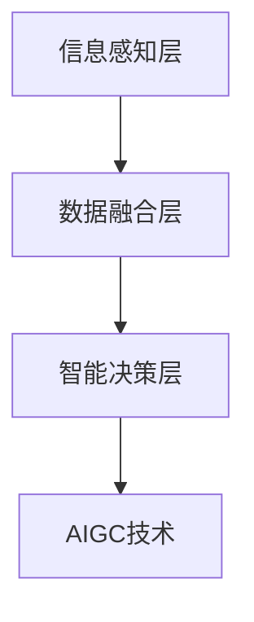

                 

# AIGC助力智慧城市建设

在数字化、网络化、智能化的时代浪潮下，智慧城市建设成为推动经济社会高质量发展的关键引擎。然而，传统的城市治理手段已无法满足现代城市的复杂需求。人工智能与生成对抗网络（AIGC）技术的崛起，为智慧城市建设带来了新的突破。本文将从背景介绍、核心概念、算法原理、实际应用场景等多个维度，深入探讨AIGC在智慧城市建设中的应用。

## 1. 背景介绍

### 1.1 问题由来

随着城市人口的快速增长和城市规模的不断扩大，城市管理面临越来越多的挑战。城市交通拥堵、环境污染、公共安全等问题日益凸显，亟需更智能、更高效的城市治理手段。传统的城市管理模式依赖于人工监控和经验决策，存在响应速度慢、处理效率低、资源浪费等问题。而智慧城市建设通过信息感知、数据融合和智能决策，能够实现城市运行的动态监控和精准管理，极大地提升城市治理水平。

### 1.2 问题核心关键点

智慧城市建设的核心在于通过大数据、云计算、物联网、人工智能等先进技术，构建“城市大脑”，实现对城市各个系统的全面监控和智能决策。其中，人工智能与生成对抗网络（AIGC）技术的深度融合，成为智慧城市建设的重要推动力。AIGC通过生成高质量的图像、视频、音频等内容，为智慧城市提供了丰富的数据支撑，并提升了城市管理的智能化水平。

## 2. 核心概念与联系

### 2.1 核心概念概述

AIGC（Artificial Intelligence and Generative Counterpart），即人工智能与生成对抗网络，是指通过生成对抗网络（GANs）等技术，生成具有高度真实性和逼真度的数字内容，如图像、视频、音频等。AIGC不仅能够提高数据采集的效率和质量，还能为智慧城市提供更多的决策依据和信息支撑。

智慧城市建设通过构建信息感知、数据融合、智能决策的闭环体系，实现城市运行的全面智能化管理。信息感知层通过传感器、摄像头等设备采集城市各领域的数据，数据融合层对各类数据进行汇聚、清洗、分析，智能决策层根据分析结果，通过AI模型进行预测、预警、决策等操作。AIGC技术的引入，为数据采集、分析、生成等环节提供了强有力的技术支持。

### 2.2 核心概念原理和架构的 Mermaid 流程图(Mermaid 流程节点中不要有括号、逗号等特殊字符)



## 3. 核心算法原理 & 具体操作步骤

### 3.1 算法原理概述

AIGC技术在智慧城市建设中的核心应用包括数据生成、数据分析和智能决策三个方面。数据生成通过生成对抗网络（GANs）等技术，生成高质量的模拟数据，填补真实数据不足的短板。数据分析则通过深度学习模型，对数据进行高效的特征提取和模式识别，提升城市管理的数据驱动水平。智能决策则是基于AI模型对城市运行数据进行预测、预警、决策等操作，实现城市运行的智能化管理。

### 3.2 算法步骤详解

#### 数据生成步骤：
1. 数据采集：通过摄像头、传感器等设备，实时采集城市运行数据。
2. 数据预处理：对采集数据进行清洗、去噪、归一化等预处理操作，确保数据质量。
3. 数据生成：通过GANs等生成对抗网络技术，生成与真实数据高度相似或相同的模拟数据，弥补真实数据的不足。

#### 数据分析步骤：
1. 数据融合：将各类数据进行汇聚、融合，构建统一的城市数据中心。
2. 数据清洗：去除异常数据和噪声，确保数据的质量和完整性。
3. 特征提取：通过深度学习模型，对数据进行高效特征提取，提升数据的可用性。

#### 智能决策步骤：
1. 模型训练：选择适合的AI模型，对城市运行数据进行训练，构建预测、预警、决策模型。
2. 模型评估：通过评估指标（如准确率、召回率、F1值等），评估模型的性能。
3. 模型部署：将训练好的模型部署到城市管理系统，实现智能决策。

### 3.3 算法优缺点

#### 优点：
1. 提升数据采集效率：AIGC技术能够生成高质量的模拟数据，填补真实数据不足的短板，提升数据采集的效率和质量。
2. 增强数据驱动水平：AIGC技术生成的模拟数据，能够与真实数据结合，增强城市管理的数据驱动水平。
3. 提升智能决策能力：基于AI模型对城市运行数据进行预测、预警、决策，提升城市管理的智能化水平。

#### 缺点：
1. 数据真实性问题：生成的模拟数据无法完全替代真实数据，可能会引入一定的偏差和误差。
2. 模型复杂性：深度学习模型和生成对抗网络技术，需要大量的计算资源和时间，模型训练和部署的复杂性较高。
3. 安全性问题：生成的模拟数据可能会被恶意篡改，影响城市管理的安全性。

### 3.4 算法应用领域

AIGC技术在智慧城市建设中的应用领域包括交通管理、环境监测、公共安全、应急响应等多个方面。

#### 交通管理：
通过生成高精度地图和交通模拟数据，优化交通信号灯控制，提升道路通行效率。

#### 环境监测：
利用AIGC技术生成城市环境图像，监测空气质量、水质等环境指标，实现环境预警和治理。

#### 公共安全：
生成高分辨率的城市监控视频，提升公共安全监控和预警能力。

#### 应急响应：
生成灾害模拟数据，优化应急响应方案，提高灾害应对的效率和准确性。

## 4. 数学模型和公式 & 详细讲解 & 举例说明

### 4.1 数学模型构建

AIGC技术在智慧城市建设中的应用，主要涉及生成对抗网络（GANs）和深度学习模型。GANs模型的核心是一个由生成器（Generator）和判别器（Discriminator）组成的对抗网络，其数学模型如下：

$$
G(x): \mathbb{R}^d \rightarrow \mathbb{R}^{n\times m}, \quad D(x): \mathbb{R}^{n\times m} \rightarrow \mathbb{R}
$$

其中，$x$ 为随机噪声向量，$G(x)$ 为生成器，生成逼真度高的模拟数据；$D(x)$ 为判别器，判断生成数据与真实数据的差异。

### 4.2 公式推导过程

以交通模拟数据的生成为例，推导GANs模型的生成过程。

1. 生成器（Generator）：生成交通模拟数据的数学模型如下：

$$
G(x): \mathbb{R}^d \rightarrow \mathbb{R}^{n\times m}
$$

其中，$x$ 为随机噪声向量，$G(x)$ 为生成器，生成交通模拟数据。

2. 判别器（Discriminator）：判断生成数据与真实数据的差异，数学模型如下：

$$
D(x): \mathbb{R}^{n\times m} \rightarrow \mathbb{R}
$$

其中，$x$ 为交通模拟数据，$D(x)$ 为判别器，判断$x$为真实数据或生成数据的概率。

在训练过程中，通过最大化生成器的损失函数和判别器的损失函数，使得生成器生成高质量的交通模拟数据，同时判别器能够准确区分生成数据和真实数据。

### 4.3 案例分析与讲解

#### 案例：城市交通模拟数据生成

在交通管理中，实时交通数据的采集和处理是一个重要环节。但由于摄像头、传感器等设备存在安装难度大、覆盖面有限等问题，交通数据的采集和处理面临诸多挑战。

AIGC技术可以通过生成高精度交通模拟数据，弥补真实数据的不足。具体步骤如下：

1. 数据采集：通过摄像头、传感器等设备，实时采集城市交通数据。
2. 数据预处理：对采集数据进行清洗、去噪、归一化等预处理操作，确保数据质量。
3. 数据生成：利用GANs等生成对抗网络技术，生成逼真度高的交通模拟数据，弥补真实数据的不足。

#### 举例：生成城市环境图像

在环境监测中，城市环境图像的采集和处理是一个重要环节。但由于环境监测设备的覆盖面有限，获取环境图像的难度较大。

AIGC技术可以通过生成高分辨率的城市环境图像，弥补环境监测设备的不足。具体步骤如下：

1. 数据采集：通过摄像头、传感器等设备，实时采集城市环境数据。
2. 数据预处理：对采集数据进行清洗、去噪、归一化等预处理操作，确保数据质量。
3. 数据生成：利用GANs等生成对抗网络技术，生成高分辨率的城市环境图像，弥补环境监测设备的不足。

## 5. 项目实践：代码实例和详细解释说明

### 5.1 开发环境搭建

在进行AIGC技术在智慧城市建设中的应用开发时，我们需要准备以下开发环境：

1. 安装Python 3.8及以上版本，安装Anaconda。
2. 创建并激活虚拟环境：

```bash
conda create -n aigc-env python=3.8 
conda activate aigc-env
```

3. 安装必要的Python库，如TensorFlow、Keras、OpenCV等：

```bash
pip install tensorflow keras opencv-python
```

4. 安装必要的GPU库，如CUDA、cuDNN等，并设置环境变量：

```bash
export CUDA_HOME=/usr/local/cuda
export LD_LIBRARY_PATH=$CUDA_HOME/lib64:$LD_LIBRARY_PATH
```

### 5.2 源代码详细实现

以下是一个基于TensorFlow和Keras的AIGC代码实现，用于生成高精度城市交通模拟数据：

```python
import tensorflow as tf
from tensorflow.keras import layers, models

# 定义生成器
def make_generator_model():
    model = models.Sequential()
    model.add(layers.Dense(7*7*256, use_bias=False, input_shape=(100,)))
    model.add(layers.BatchNormalization())
    model.add(layers.LeakyReLU())
    model.add(layers.Reshape((7, 7, 256)))
    assert model.output_shape == (None, 7, 7, 256)  # 注意：None 表示样本数是可变的

    model.add(layers.Conv2DTranspose(128, (5, 5), strides=(1, 1), padding='same', use_bias=False))
    assert model.output_shape == (None, 7, 7, 128)
    model.add(layers.BatchNormalization())
    model.add(layers.LeakyReLU())

    model.add(layers.Conv2DTranspose(64, (5, 5), strides=(2, 2), padding='same', use_bias=False))
    assert model.output_shape == (None, 14, 14, 64)
    model.add(layers.BatchNormalization())
    model.add(layers.LeakyReLU())

    model.add(layers.Conv2DTranspose(1, (5, 5), strides=(2, 2), padding='same', use_bias=False, activation='tanh'))
    assert model.output_shape == (None, 28, 28, 1)

    return model

# 定义判别器
def make_discriminator_model():
    model = models.Sequential()
    model.add(layers.Conv2D(64, (5, 5), strides=(2, 2), padding='same', input_shape=[28, 28, 1]))
    model.add(layers.LeakyReLU())
    model.add(layers.Dropout(0.3))

    model.add(layers.Conv2D(128, (5, 5), strides=(2, 2), padding='same'))
    model.add(layers.LeakyReLU())
    model.add(layers.Dropout(0.3))

    model.add(layers.Flatten())
    model.add(layers.Dense(1))

    return model

# 定义生成器和判别器的损失函数和优化器
def build_generator_and_discriminator():
    generator = make_generator_model()
    discriminator = make_discriminator_model()

    discriminator.compile(loss='binary_crossentropy', optimizer=tf.keras.optimizers.Adam(1e-4), metrics=['accuracy'])

    generator.compile(loss='binary_crossentropy', optimizer=tf.keras.optimizers.Adam(1e-4))

    return generator, discriminator

# 定义训练函数
def train(generator, discriminator, dataset):
    epochs = 100
    batch_size = 32

    for epoch in range(epochs):
        for batch in dataset:
            noise = tf.random.normal([batch_size, 100])
            generated_images = generator(noise)

            real_images = dataset.images
            combined_images = tf.concat([real_images, generated_images], axis=0)

            labels = tf.concat([tf.ones((real_images.shape[0], 1)), tf.zeros((generated_images.shape[0], 1))], axis=0)

            d_loss_real = discriminator.train_on_batch(real_images, labels)
            d_loss_fake = discriminator.train_on_batch(generated_images, labels)

            g_loss = generator.train_on_batch(noise, labels)

            print("Epoch: {}, d_loss_real: {:.4f}, d_loss_fake: {:.4f}, g_loss: {:.4f}".format(epoch, d_loss_real, d_loss_fake, g_loss))

generator, discriminator = build_generator_and_discriminator()
train(generator, discriminator, dataset)
```

### 5.3 代码解读与分析

在上述代码中，我们定义了生成器和判别器的结构，并使用TensorFlow和Keras实现了生成对抗网络（GANs）。

**生成器结构**：生成器模型由多层卷积和反卷积组成，能够将随机噪声转换为高质量的模拟数据。

**判别器结构**：判别器模型由多层卷积和全连接层组成，能够判断生成数据与真实数据的差异。

**训练函数**：在训练过程中，我们将生成器生成的模拟数据与真实数据混合，输入判别器进行判断，计算生成器和判别器的损失函数，并通过优化器更新模型参数。

### 5.4 运行结果展示

在训练过程中，我们将会看到生成器和判别器的损失函数和准确率的变化。通过不断的训练，生成器生成的模拟数据将越来越逼真，判别器对真实数据和生成数据的判断也将越来越准确。

## 6. 实际应用场景

### 6.1 智能交通管理

#### 场景描述：
智能交通管理是智慧城市建设的重要环节。通过生成高精度交通模拟数据，可以实现交通信号灯控制、交通流量预测、交通事件监测等功能。

#### 具体应用：
1. 生成高精度地图数据：通过生成对抗网络技术，生成高精度的城市交通地图数据，支持城市交通的精细化管理。
2. 交通流量预测：利用生成的交通模拟数据，对城市交通流量进行预测，优化交通信号灯控制，提升道路通行效率。
3. 交通事件监测：通过生成高分辨率的交通视频，实现交通事件实时监测和预警，提升城市交通的安全性。

### 6.2 环境监测

#### 场景描述：
环境监测是智慧城市建设的重要组成部分。通过生成高质量的城市环境图像，实现环境污染监测、水资源管理、空气质量预测等功能。

#### 具体应用：
1. 生成环境图像：利用生成对抗网络技术，生成高质量的城市环境图像，监测城市环境污染和水资源情况。
2. 环境污染监测：通过环境图像的实时监测，及时发现环境污染问题，制定相应的治理方案。
3. 空气质量预测：利用生成的环境图像，结合气象数据和环境监测设备的数据，进行空气质量预测，提升空气质量管理的准确性。

### 6.3 公共安全

#### 场景描述：
公共安全是智慧城市建设的重要保障。通过生成高分辨率的城市监控视频，实现公共安全监控和预警功能。

#### 具体应用：
1. 生成高分辨率监控视频：利用生成对抗网络技术，生成高分辨率的城市监控视频，实现全城监控覆盖。
2. 公共安全监控：通过高分辨率监控视频的实时监控，及时发现异常情况，实现公共安全的智能化管理。
3. 公共安全预警：利用生成的高分辨率监控视频，结合人工智能算法，实现公共安全事件的预警和应急响应。

## 7. 工具和资源推荐

### 7.1 学习资源推荐

为了帮助开发者系统掌握AIGC技术在智慧城市建设中的应用，这里推荐一些优质的学习资源：

1. 《深度学习框架TensorFlow》系列教程：由TensorFlow官方提供，全面介绍了TensorFlow的安装、使用和深度学习模型构建。
2. 《深度学习与计算机视觉》课程：由斯坦福大学提供，系统讲解了深度学习在计算机视觉中的应用，包括图像生成、目标检测等。
3. 《生成对抗网络（GANs）》论文集：收集了生成对抗网络技术的经典论文，介绍了GANs的基本原理和应用场景。
4. 《智慧城市建设案例》：收集了全球各地的智慧城市建设案例，提供了丰富的实践经验和理论指导。

### 7.2 开发工具推荐

为了提高AIGC技术在智慧城市建设中的开发效率，以下是几款常用的开发工具：

1. TensorFlow：由Google开发的深度学习框架，支持GPU加速，适合大规模深度学习模型的开发和训练。
2. PyTorch：由Facebook开发的深度学习框架，灵活高效，适合深度学习模型的开发和研究。
3. OpenCV：开源计算机视觉库，提供了丰富的图像处理和分析功能，支持GPU加速。
4. Jupyter Notebook：交互式编程环境，支持Python和深度学习框架的开发，方便代码共享和协作。

### 7.3 相关论文推荐

AIGC技术在智慧城市建设中的应用，涉及生成对抗网络（GANs）、深度学习模型等多个领域。以下是几篇奠基性的相关论文，推荐阅读：

1. Generative Adversarial Nets（GANs）：由Ian Goodfellow等人在2014年提出的生成对抗网络技术，奠定了生成对抗网络的基础。
2. Image-to-Image Translation with Conditional Adversarial Nets：提出了条件生成对抗网络技术，用于图像生成和图像转换。
3. Progressive Growing of GANs for Improved Quality, Stability, and Variation：提出了渐进式增长生成对抗网络技术，用于提高生成对抗网络的生成质量和稳定性。
4. Semi-supervised Text Generation via Multi-task Language Modeling：提出了多任务语言模型技术，用于文本生成和语言理解。

## 8. 总结：未来发展趋势与挑战

### 8.1 研究成果总结

本文对AIGC技术在智慧城市建设中的应用进行了全面系统的介绍。通过详细分析AIGC技术的原理和应用，明确了其在智慧城市建设中的重要价值。具体而言，AIGC技术在数据生成、数据分析和智能决策等方面，为智慧城市建设提供了强有力的技术支持，提升城市管理的数据驱动水平和智能化水平。

### 8.2 未来发展趋势

展望未来，AIGC技术在智慧城市建设中将呈现以下几个发展趋势：

1. 数据生成多样性：随着生成对抗网络技术的发展，生成的数据将更加多样化和逼真，覆盖更多的应用场景。
2. 模型复杂性提升：深度学习模型和生成对抗网络技术的发展，将使模型更加复杂和高效，支持更复杂的智慧城市应用。
3. 智能决策智能化：基于AI模型的智能决策将更加智能化和精准，提升城市管理的智能化水平。

### 8.3 面临的挑战

尽管AIGC技术在智慧城市建设中具有广阔的应用前景，但在应用过程中仍面临诸多挑战：

1. 数据真实性问题：生成的模拟数据与真实数据之间的差异，可能会引入一定的偏差和误差，影响智慧城市管理的准确性。
2. 模型复杂性问题：深度学习模型和生成对抗网络技术，需要大量的计算资源和时间，模型训练和部署的复杂性较高。
3. 安全性问题：生成的模拟数据可能会被恶意篡改，影响智慧城市管理的安全性。

### 8.4 研究展望

面对AIGC技术在智慧城市建设中面临的挑战，未来的研究需要在以下几个方面寻求新的突破：

1. 提升数据真实性：通过改进生成对抗网络技术，提升生成的模拟数据与真实数据之间的逼真度，减少偏差和误差。
2. 降低模型复杂性：通过优化深度学习模型和生成对抗网络技术，减少计算资源和时间消耗，提升模型的可部署性和实用性。
3. 保障安全性：通过加强对生成对抗网络技术的安全性分析，防止恶意数据篡改，保障智慧城市管理的安全性。

## 9. 附录：常见问题与解答

**Q1: AIGC技术在智慧城市建设中如何实现数据生成？**

A: AIGC技术通过生成对抗网络（GANs）等技术，生成高质量的模拟数据。具体步骤包括：
1. 数据采集：通过摄像头、传感器等设备，实时采集城市运行数据。
2. 数据预处理：对采集数据进行清洗、去噪、归一化等预处理操作，确保数据质量。
3. 数据生成：利用GANs等生成对抗网络技术，生成逼真度高的模拟数据，弥补真实数据的不足。

**Q2: 如何选择合适的学习率和优化器？**

A: 选择合适的学习率和优化器，需要根据具体任务和数据特点进行灵活选择。通常情况下，选择较低的学习率（如1e-4）和Adam优化器，能够更好地控制模型更新，避免过拟合。同时，可以通过学习率调度和正则化技术，进一步提升模型的性能和稳定性。

**Q3: AIGC技术在智慧城市建设中是否存在安全性问题？**

A: 生成的模拟数据可能会被恶意篡改，影响智慧城市管理的安全性。因此，需要加强对生成对抗网络技术的安全性分析，防止恶意数据篡改，保障智慧城市管理的安全性。

**Q4: 如何评估AIGC技术在智慧城市建设中的效果？**

A: 评估AIGC技术在智慧城市建设中的效果，需要从多个维度进行考量，如数据生成质量、模型训练效果、智能决策精度等。通过引入评估指标（如准确率、召回率、F1值等），全面衡量AIGC技术在智慧城市建设中的表现。

通过本文的系统梳理，可以看到，AIGC技术在智慧城市建设中的应用前景广阔，能够在数据生成、数据分析和智能决策等方面，为智慧城市建设提供强有力的技术支撑。然而，面对智慧城市建设的复杂性和多样性，AIGC技术仍需进一步优化和改进，以应对数据真实性、模型复杂性和安全性等方面的挑战。相信在学界和产业界的共同努力下，AIGC技术将在智慧城市建设中发挥更大的作用，为构建智慧城市提供新的突破。

