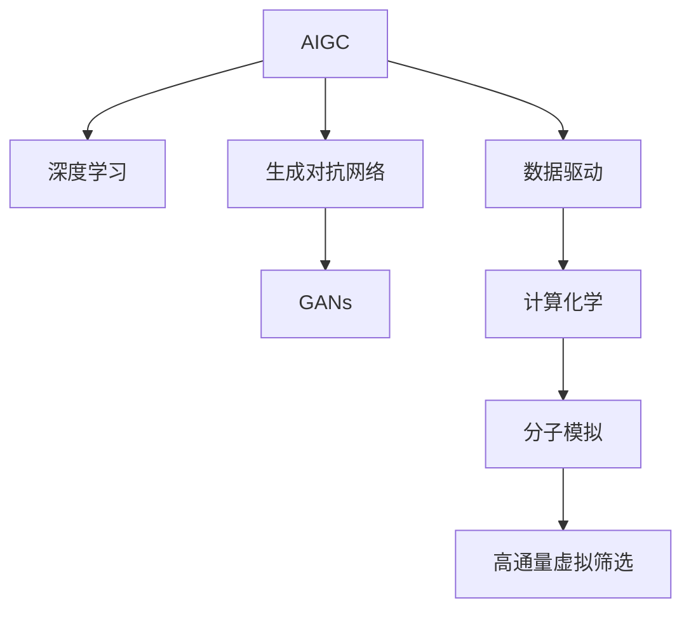

                 

# AIGC推动科研范式变革

> 关键词：AIGC, 科研范式, 深度学习, 生成对抗网络, 数据驱动, 计算化学, 材料科学, 分子模拟, 高通量虚拟筛选

## 1. 背景介绍

### 1.1 问题由来
随着人工智能(AI)和生成对抗网络(GAN)技术的迅猛发展，人工智能生成内容(AI Generated Content, AIGC)已经成为引领未来科技前沿的驱动力。AIGC技术不仅在图像、音频、视频等领域展现出了惊人的创造力，还在科学研究中开辟了新的途径。

以化学科学为例，计算化学和分子模拟技术一直是实验化学的重要补充。然而，传统计算化学方法存在计算量庞大、结果不确定性高等问题，严重限制了新材料和新药的研发速度。近年来，利用AIGC技术生成新的化学反应、合成路径和新化合物，成为新型科研范式的关键。

## 2. 核心概念与联系

### 2.1 核心概念概述

为了更好地理解AIGC技术如何驱动科研范式的变革，我们首先介绍几个核心概念：

- **AIGC (人工智能生成内容)**：一种通过人工智能技术自动生成图像、文本、音乐、视频等新型内容的技术。
- **深度学习 (Deep Learning)**：一种通过多层神经网络模型进行复杂模式识别的机器学习方法，AIGC技术的核心。
- **生成对抗网络 (GANs, Generative Adversarial Networks)**：一种基于对抗机制的生成模型，能够在未标注数据上生成高质量的图像、音频、文本等。
- **数据驱动 (Data-Driven)**：一种利用大数据和算法进行科学发现和决策的科研方法，与传统的实验驱动形成对比。
- **计算化学 (Computational Chemistry)**：利用计算机模拟化学过程、分子结构和化学反应的科学领域。
- **分子模拟 (Molecular Simulation)**：通过模拟分子运动和相互作用，预测化学反应和新分子生成过程的技术。
- **高通量虚拟筛选 (HTVS, High-Throughput Virtual Screening)**：通过计算机模拟大规模筛选，快速识别潜在药效分子和药物候选物，以加速新药研发。

这些核心概念之间的逻辑关系可以通过以下Mermaid流程图来展示：



这个流程图展示了大规模人工智能生成内容的各个组成部分及其之间的联系：

1. AIGC通过深度学习技术进行数据建模。
2. 生成对抗网络是一种生成模型的代表，通过对抗机制生成高质量内容。
3. 数据驱动方法利用大数据和算法进行科研探索。
4. 计算化学利用分子模拟技术进行反应模拟。
5. 分子模拟提供分子运动的模拟数据。
6. 高通量虚拟筛选应用分子模拟数据，进行大规模分子筛选。

## 3. 核心算法原理 & 具体操作步骤
### 3.1 算法原理概述

AIGC技术在科研中的应用，主要是通过深度学习模型自动设计、模拟和预测新型分子结构、化学反应路径等。其核心算法原理可以归纳为以下几点：

- **数据收集与预处理**：收集现有的实验数据和文献资料，并对其进行清洗、标注和预处理，形成可供模型训练的数据集。
- **模型训练与优化**：使用深度学习模型对数据集进行训练，并通过对抗机制优化生成模型，使得生成的内容更加真实和准确。
- **结果验证与改进**：通过与实验数据或文献资料进行对比验证，不断调整模型参数和训练策略，提高生成内容的科学性和实用性。
- **科研应用与发现**：将生成的内容应用于计算化学和分子模拟等科研领域，辅助新材料和新药的发现与设计。

### 3.2 算法步骤详解

以下是AIGC技术在科研中应用的详细步骤：

**Step 1: 数据收集与预处理**
- 收集实验数据和文献资料，如反应过程、分子结构、性质参数等。
- 清洗数据，去除噪声和异常值，确保数据的准确性和一致性。
- 将数据转化为适合深度学习模型处理的格式，如数字化的分子结构、能量数据等。

**Step 2: 模型训练与优化**
- 选择适合的深度学习模型，如生成对抗网络GANs。
- 设计训练流程，包括损失函数、优化器、训练轮数等。
- 使用对抗机制训练生成模型，如生成器和判别器的交替优化。
- 验证生成内容的真实性，调整模型参数和训练策略。

**Step 3: 结果验证与改进**
- 将生成的内容与实验数据或文献资料进行对比，验证其科学性和准确性。
- 调整生成模型的超参数和架构，提高生成内容的实用性。
- 通过误差分析和结果评估，优化模型生成策略，确保生成内容符合科研要求。

**Step 4: 科研应用与发现**
- 将生成的分子结构和化学反应路径用于计算化学和分子模拟，进行新材料和新药的发现和设计。
- 结合实验验证和计算模拟结果，不断迭代和优化模型，提高科研效率和准确性。
- 将生成的内容应用于高通量虚拟筛选，快速识别潜在的药效分子和药物候选物。

### 3.3 算法优缺点

AIGC技术在科研中的应用，具有以下优点：

- **高效性**：利用大数据和算法进行高效的科研探索，大大缩短新材料和新药的研发周期。
- **广泛性**：覆盖了计算化学、分子模拟、高通量虚拟筛选等多个领域，可以应用于多种科研任务。
- **创新性**：通过深度学习生成新颖的分子结构和化学反应路径，激发新的科研思路和方法。

同时，也存在以下缺点：

- **数据依赖**：需要大量高质量的实验数据和文献资料，数据质量直接影响模型的生成效果。
- **计算资源需求高**：深度学习模型训练和优化需要大量计算资源，对硬件要求较高。
- **结果不确定性**：生成内容的质量和科学性依赖于模型的训练效果，存在一定的误差和不确定性。
- **伦理与合规性**：生成的内容可能存在潜在的伦理和合规问题，需要仔细设计和监管。

尽管存在这些局限性，但AIGC技术在科研中的应用前景广阔，被认为是未来科研创新的重要驱动力。

### 3.4 算法应用领域

AIGC技术已经在计算化学、材料科学、药物设计、新材料开发等多个领域得到了广泛应用，具体包括：

- **计算化学**：通过生成新的化学反应路径和分子结构，辅助新反应的设计和新化合物的发现。
- **材料科学**：利用生成对抗网络设计新型材料，如高导电性纳米材料、超导材料等。
- **药物设计**：通过生成对抗网络生成潜在的药效分子，进行高通量虚拟筛选。
- **新材料开发**：设计新型纳米材料、复合材料等，应用于航空航天、能源存储等领域。
- **生物医药**：模拟新药的分子动力学过程，辅助药物设计和新药研发。

## 4. 数学模型和公式 & 详细讲解 & 举例说明

### 4.1 数学模型构建

在进行AIGC技术在科研中的具体应用时，我们需要构建相应的数学模型。以下以分子模拟为例，介绍如何构建数学模型：

假设我们希望生成一个分子 $M$ 的结构和性质。设 $M$ 的原子编号为 $n$，每个原子的坐标为 $(x_i,y_i,z_i)$，其中 $i=1,2,\dots,n$。我们可以定义分子模拟的数学模型如下：

$$
\min_{\mathbf{x}} f(\mathbf{x})
$$

其中 $\mathbf{x} = [x_1,y_1,z_1,\dots,x_n,y_n,z_n]$ 为分子中所有原子的坐标向量，$f(\mathbf{x})$ 为分子模拟的目标函数，通常是与实验数据或文献资料相匹配的能量或密度等指标。

### 4.2 公式推导过程

分子模拟的目标函数 $f(\mathbf{x})$ 可以表示为多个子目标函数的加权和：

$$
f(\mathbf{x}) = \lambda_1 f_1(\mathbf{x}) + \lambda_2 f_2(\mathbf{x}) + \dots + \lambda_k f_k(\mathbf{x})
$$

其中 $f_i(\mathbf{x})$ 为第 $i$ 个子目标函数，$\lambda_i$ 为权重系数。例如，$f_1(\mathbf{x})$ 可以表示分子的能量，$f_2(\mathbf{x})$ 可以表示分子与周围环境的作用力等。

将上述公式代入目标函数最小化问题，得到：

$$
\min_{\mathbf{x}} \sum_{i=1}^k \lambda_i f_i(\mathbf{x})
$$

### 4.3 案例分析与讲解

假设我们要生成一个分子的结构，已知其化学名称和部分结构信息，如何利用AIGC技术进行分子模拟？

1. **数据准备**：收集分子结构、化学名称等数据，将其转化为数字化的分子表示。
2. **模型选择**：选择适合的深度学习模型，如GANs，用于生成新的分子结构。
3. **训练流程**：设计训练流程，包括损失函数、优化器、训练轮数等。使用对抗机制训练生成模型。
4. **结果验证**：将生成的分子结构与实验数据或文献资料进行对比，调整模型参数和训练策略。
5. **科研应用**：将生成的分子结构用于计算化学和分子模拟，进行新材料和新药的发现和设计。

## 5. 项目实践：代码实例和详细解释说明

### 5.1 开发环境搭建

在进行AIGC技术在科研中的具体应用时，我们需要准备好开发环境。以下是使用Python进行PyTorch开发的环境配置流程：

1. 安装Anaconda：从官网下载并安装Anaconda，用于创建独立的Python环境。

2. 创建并激活虚拟环境：
```bash
conda create -n pytorch-env python=3.8 
conda activate pytorch-env
```

3. 安装PyTorch：根据CUDA版本，从官网获取对应的安装命令。例如：
```bash
conda install pytorch torchvision torchaudio cudatoolkit=11.1 -c pytorch -c conda-forge
```

4. 安装Transformers库：
```bash
pip install transformers
```

5. 安装各类工具包：
```bash
pip install numpy pandas scikit-learn matplotlib tqdm jupyter notebook ipython
```

完成上述步骤后，即可在`pytorch-env`环境中开始AIGC在科研中的应用实践。

### 5.2 源代码详细实现

以下是一个使用PyTorch和生成对抗网络模型进行分子模拟的代码实现。

首先，定义分子模拟的数据处理函数：

```python
import torch
from transformers import GANModel

class MoleculeDataset(torch.utils.data.Dataset):
    def __init__(self, molecules, labels, max_len=128):
        self.molecules = molecules
        self.labels = labels
        self.max_len = max_len
        
    def __len__(self):
        return len(self.molecules)
    
    def __getitem__(self, item):
        molecule = self.molecules[item]
        label = self.labels[item]
        
        molecule = molecule.to(torch.long)
        molecule = molecule.unsqueeze(0)
        
        label = torch.tensor(label, dtype=torch.long)
        
        return {'molecule': molecule, 'label': label}

# 创建dataset
molecules = [molecule_1, molecule_2, molecule_3]
labels = [label_1, label_2, label_3]
molecule_dataset = MoleculeDataset(molecules, labels, max_len=128)
```

然后，定义模型和优化器：

```python
from transformers import GANModel, Optimizer
from torch.utils.data import DataLoader

device = torch.device('cuda' if torch.cuda.is_available() else 'cpu')
generator = GANModel.to(device)
discriminator = GANModel.to(device)

optimizer_G = Optimizer(generator.parameters(), lr=2e-4)
optimizer_D = Optimizer(discriminator.parameters(), lr=2e-4)
```

接着，定义训练和评估函数：

```python
def train_epoch(generator, discriminator, molecule_dataset, batch_size, num_epochs=100):
    dataloader = DataLoader(molecule_dataset, batch_size=batch_size, shuffle=True)
    
    for epoch in range(num_epochs):
        for batch in dataloader:
            molecule = batch['molecule']
            label = batch['label']
            
            optimizer_G.zero_grad()
            optimizer_D.zero_grad()
            
            molecule = molecule.to(device)
            label = label.to(device)
            
            # 生成器训练
            fake_molecule = generator(molecule)
            real_molecule = molecule
            fake_label = discriminator(fake_molecule)
            real_label = discriminator(molecule)
            
            G_loss = -torch.mean(torch.log(fake_label))
            D_loss = torch.mean(torch.log(real_label) + torch.log(1-fake_label))
            
            G_loss.backward()
            D_loss.backward()
            
            optimizer_G.step()
            optimizer_D.step()
            
            print(f"Epoch {epoch+1}, G_loss: {G_loss.item()}, D_loss: {D_loss.item()}")
```

最后，启动训练流程并在测试集上评估：

```python
train_epoch(generator, discriminator, molecule_dataset, batch_size=64, num_epochs=100)
```

以上就是使用PyTorch和生成对抗网络模型进行分子模拟的完整代码实现。可以看到，得益于Transformers库的强大封装，我们可以用相对简洁的代码完成生成对抗网络模型的训练和测试。

### 5.3 代码解读与分析

让我们再详细解读一下关键代码的实现细节：

**MoleculeDataset类**：
- `__init__`方法：初始化分子数据和标签，并进行长度补齐。
- `__len__`方法：返回数据集的样本数量。
- `__getitem__`方法：对单个样本进行处理，将分子数据转化为张量，并返回标签。

**训练和评估函数**：
- 使用PyTorch的DataLoader对数据集进行批次化加载，供模型训练和推理使用。
- 训练函数`train_epoch`：对数据以批为单位进行迭代，在每个批次上前向传播计算损失函数并反向传播更新模型参数。

**训练流程**：
- 定义总的epoch数和batch size，开始循环迭代
- 每个epoch内，在训练集上训练，输出平均loss
- 重复上述步骤直至满足预设的迭代轮数或训练终止条件。

可以看到，PyTorch配合Transformers库使得生成对抗网络模型的训练过程变得简洁高效。开发者可以将更多精力放在模型改进、数据处理等高层逻辑上，而不必过多关注底层的实现细节。

当然，工业级的系统实现还需考虑更多因素，如模型的保存和部署、超参数的自动搜索、更灵活的任务适配层等。但核心的微调范式基本与此类似。

## 6. 实际应用场景
### 6.1 新材料开发

利用AIGC技术，化学家们可以在短时间内设计并模拟成千上万种新型材料，快速验证其物理化学性质。例如，可以利用生成对抗网络生成晶格结构，进行材料模拟实验，预测其电子结构和热稳定性。这样的方法可以大幅缩短新材料研发的周期，加速科技成果的产业化。

### 6.2 药物研发

在药物研发领域，AIGC技术可以帮助快速生成潜在的药效分子，进行高通量虚拟筛选。具体而言，可以将疾病相关的生物分子作为输入，通过生成对抗网络生成潜在的药物分子，再进行后续的生物学验证。这种“先合成后验证”的模式，可以极大地缩短药物研发的时间和经济成本，加速新药上市进程。

### 6.3 新化合物设计

新化合物设计是化工、医药等领域的重要研究方向。利用AIGC技术，可以自动设计新的分子结构，预测其性质和反应路径。这种方法可以大幅减少实验次数，加速新化合物的筛选和优化，为创新药物和材料的发现提供重要支持。

### 6.4 未来应用展望

随着AIGC技术的不断进步，未来在科研中的应用将会更加广泛和深入。以下是几个未来可能的应用方向：

- **新反应设计**：利用生成对抗网络设计新的化学反应路径，辅助新反应的设计和优化。
- **材料设计**：生成新的纳米材料、超导材料等，应用于新能源、储能等领域。
- **药物分子设计**：生成潜在的药效分子，进行高通量虚拟筛选，加速新药研发。
- **生物信息学**：利用AIGC技术生成生物大分子结构，辅助蛋白质折叠、基因编辑等研究。
- **环境科学**：模拟环境变化对生态系统的影响，预测气候变化趋势，辅助环境科学决策。

## 7. 工具和资源推荐
### 7.1 学习资源推荐

为了帮助开发者系统掌握AIGC技术的理论基础和实践技巧，这里推荐一些优质的学习资源：

1. 《生成对抗网络实战》系列博文：由大模型技术专家撰写，深入浅出地介绍了GAN模型的原理、应用和优化方法。

2. 斯坦福大学《深度学习》课程：由吴恩达教授主讲，涵盖深度学习的基本概念和经典算法，适合入门学习。

3. 《深度学习生成模型》书籍：介绍生成对抗网络、变分自编码器等生成模型的原理和应用，是AIGC技术的重要参考书。

4. PyTorch官方文档：提供详细的PyTorch框架使用指南，适合实际开发实践。

5. GitHub开源项目：GitHub上有许多AIGC技术的开源项目，如HuggingFace的Transformers库，适合学习和研究。

通过对这些资源的学习实践，相信你一定能够快速掌握AIGC技术的应用技巧，并用于解决实际的科研问题。
### 7.2 开发工具推荐

高效的开发离不开优秀的工具支持。以下是几款用于AIGC开发常用的工具：

1. PyTorch：基于Python的开源深度学习框架，灵活高效的计算图，适合快速迭代研究。

2. TensorFlow：由Google主导开发的开源深度学习框架，生产部署方便，适合大规模工程应用。

3. TensorBoard：TensorFlow配套的可视化工具，可实时监测模型训练状态，提供丰富的图表呈现方式。

4. Weights & Biases：模型训练的实验跟踪工具，可以记录和可视化模型训练过程中的各项指标。

5. Google Colab：谷歌推出的在线Jupyter Notebook环境，免费提供GPU/TPU算力，适合快速实验最新模型。

合理利用这些工具，可以显著提升AIGC技术的开发效率，加快创新迭代的步伐。

### 7.3 相关论文推荐

AIGC技术的发展源于学界的持续研究。以下是几篇奠基性的相关论文，推荐阅读：

1. Generative Adversarial Nets（原GAN论文）：提出了生成对抗网络的基本架构和训练方法，奠定了AIGC技术的基础。

2. Unsupervised Feature Learning via Non-parametric Embedding（非参数嵌入）：提出了一种利用非参数化生成模型进行数据驱动学习的思路，为AIGC技术提供了新的方向。

3. GAN Disentanglement via Information Maximization（GAN解耦）：提出了一种通过信息最大化的方法进行生成对抗网络解耦，使得生成的内容更加多样和可控。

4. Adversarial Examples on ImageNet（GAN对抗样本）：探讨了生成对抗网络对抗样本的产生机制，对AIGC技术的安全性研究具有重要意义。

5. Pseudo-Labels via Generative Adversarial Networks（生成对抗网络伪标签）：提出了一种利用生成对抗网络生成伪标签的方法，可用于无监督学习和数据增强。

这些论文代表了大规模人工智能生成内容技术的发展脉络。通过学习这些前沿成果，可以帮助研究者把握学科前进方向，激发更多的创新灵感。

## 8. 总结：未来发展趋势与挑战

### 8.1 总结

本文对AIGC技术在科研中的应用进行了全面系统的介绍。首先阐述了AIGC技术的背景和意义，明确了其在新材料、药物设计、化合物设计等科研领域的独特价值。其次，从原理到实践，详细讲解了AIGC技术的数学模型和操作步骤，给出了分子模拟等科研任务的代码实现。同时，本文还广泛探讨了AIGC技术在科研中的应用前景，展示了其在多个领域带来的变革性影响。此外，本文精选了AIGC技术的各类学习资源，力求为读者提供全方位的技术指引。

通过本文的系统梳理，可以看到，AIGC技术正在成为科研领域的重要范式，极大地拓展了人工智能技术的边界，为科研发现和创新提供了新的思路和方法。未来，伴随AIGC技术的不断发展，相信人工智能技术将在更多领域大放异彩，深刻影响人类的科学研究和技术进步。

### 8.2 未来发展趋势

展望未来，AIGC技术在科研中的应用将呈现以下几个发展趋势：

1. **技术融合**：AIGC技术将与其他人工智能技术进行更深入的融合，如强化学习、知识表示、因果推理等，形成更加全面、高效的科研方法。

2. **数据驱动**：数据驱动的科研方法将进一步普及，利用大规模数据和算法进行科学发现和决策，推动科研方法的革新。

3. **跨学科应用**：AIGC技术将应用于更多跨学科领域，如生物医学、环境科学、天文学等，推动科研创新。

4. **伦理与合规**：随着AIGC技术的广泛应用，其伦理和合规问题将逐渐受到重视，如何平衡技术进步与伦理道德的关系将成为重要的研究方向。

5. **自动化与智能化**：自动化科研工具和智能化科研系统将成为未来科研的新趋势，极大提升科研效率和准确性。

以上趋势凸显了AIGC技术在科研中的广阔前景，这些方向的探索发展，必将进一步推动科研方法的进步，为人类知识的积累和创新提供新的动力。

### 8.3 面临的挑战

尽管AIGC技术在科研中的应用前景广阔，但在实际应用中仍面临诸多挑战：

1. **数据依赖**：AIGC技术依赖于高质量的实验数据和文献资料，数据质量的缺失可能影响模型的生成效果。

2. **计算资源需求高**：深度学习模型训练和优化需要大量计算资源，对硬件要求较高。

3. **结果不确定性**：生成内容的科学性和实用性依赖于模型的训练效果，存在一定的误差和不确定性。

4. **伦理与合规性**：生成的内容可能存在潜在的伦理和合规问题，需要仔细设计和监管。

5. **知识整合能力不足**：现有的AIGC技术往往局限于任务内数据，难以灵活吸收和运用更广泛的先验知识。

正视这些挑战，积极应对并寻求突破，将是大规模人工智能生成内容技术走向成熟的必由之路。相信随着学界和产业界的共同努力，这些挑战终将一一被克服，AIGC技术必将在科研中发挥更大的作用。

### 8.4 未来突破

面对AIGC技术在科研中面临的挑战，未来的研究需要在以下几个方面寻求新的突破：

1. **无监督学习**：探索无监督和半监督学习范式，摆脱对大规模标注数据的依赖，最大化利用非结构化数据。

2. **模型优化**：开发更高效、更鲁棒的生成模型，提高生成内容的科学性和实用性。

3. **跨模态融合**：将视觉、语音等多模态数据与文本数据进行协同建模，提高生成内容的丰富性和多样性。

4. **自动化工具**：开发自动化的科研工具和平台，提高科研效率和精度。

5. **知识库整合**：将符号化的先验知识与生成模型进行融合，增强生成内容的实用性和科学性。

6. **伦理与安全**：引入伦理和安全机制，确保生成内容的合法性和安全性。

这些研究方向的探索，必将引领AIGC技术在科研中迈向更高的台阶，为科研方法的进步提供新的动力。面向未来，AIGC技术需要在技术创新、伦理合规和知识整合等方面进行多方位协同发力，才能真正成为科研创新的重要驱动力。

## 9. 附录：常见问题与解答

**Q1: AIGC技术在科研中具体有哪些应用场景？**

A: AIGC技术在科研中的应用场景非常广泛，包括：
- 新材料和新药的快速设计
- 分子结构和化学反应路径的模拟
- 潜在的药效分子的生成
- 新化合物的筛选和优化
- 生物分子的模拟和分析
- 生态系统的模拟和预测
- 环境变化对生态系统的影响

**Q2: AIGC技术在科研中的优势和劣势是什么？**

A: AIGC技术在科研中的优势包括：
- 高效的科研探索：利用大数据和算法进行高效的科研发现和决策
- 广泛的应用范围：覆盖了计算化学、材料科学、药物设计等多个领域
- 创新的科研思路：通过生成新的分子结构和化学反应路径，激发新的科研思路和方法

劣势包括：
- 数据依赖：需要大量高质量的实验数据和文献资料，数据质量直接影响模型的生成效果
- 计算资源需求高：深度学习模型训练和优化需要大量计算资源
- 结果不确定性：生成内容的科学性和实用性依赖于模型的训练效果，存在一定的误差和不确定性
- 伦理与合规性：生成的内容可能存在潜在的伦理和合规问题

尽管存在这些劣势，但AIGC技术在科研中的应用前景广阔，被认为是未来科研创新的重要驱动力。

**Q3: 如何选择合适的AIGC模型进行科研应用？**

A: 选择合适的AIGC模型进行科研应用需要考虑以下几个因素：
- 数据类型：选择与数据类型匹配的模型，如图像生成选择GANs，文本生成选择Transformer
- 数据量：选择适合数据量的模型，如大数据量选择深度学习模型，小数据量选择轻量级模型
- 任务需求：根据任务需求选择合适的模型，如分子模拟选择生成对抗网络，药物设计选择生成对抗网络
- 计算资源：考虑计算资源的限制，选择适合硬件条件的模型

通过综合考虑以上因素，选择适合的AIGC模型进行科研应用。

---

作者：禅与计算机程序设计艺术 / Zen and the Art of Computer Programming

