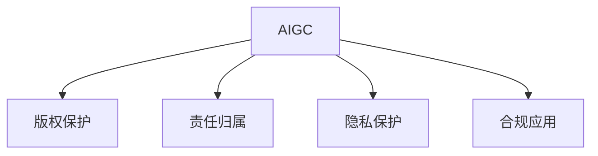

                 

# AIGC时代的法律与伦理挑战

随着人工智能生成内容（AIGC）技术日益成熟，其在艺术创作、新闻报道、法律文书生成、医学影像诊断等领域的应用，正在逐步改变传统生产方式，带来前所未有的变革。然而，AIGC技术在带来便利和效率的同时，也引发了一系列法律与伦理问题，亟需深入探讨和应对。本文将系统分析AIGC技术在法律与伦理领域面临的挑战，并提出相应的解决策略。

## 1. 背景介绍

### 1.1 问题由来

AIGC技术，基于深度学习、生成对抗网络（GAN）、Transformer模型等，能够自动生成高质量的内容。例如，GPT-3、DALL-E、DeepFace等模型已经在文本、图像、视频等领域展现出强大的生成能力。这些技术的应用，极大地提高了内容生产的效率和质量，但也引发了诸多法律与伦理问题。

例如，生成内容的使用权归属问题、生成内容的责任归属问题、生成内容造成的侵权问题等，都是AIGC时代亟需解决的重要议题。此外，AIGC技术的滥用可能带来虚假信息、隐私泄露等社会问题，如何确保AIGC技术的安全应用，也是值得关注的焦点。

### 1.2 问题核心关键点

AIGC技术面临的法律与伦理问题主要集中在以下几个方面：
- 生成内容的使用权归属
- 生成内容的责任归属
- 生成内容的版权保护
- 生成内容的隐私保护
- AIGC技术的合规应用

这些核心问题贯穿于AIGC技术的各个应用环节，需要从法律、伦理、技术等多个层面进行综合分析和应对。

## 2. 核心概念与联系

### 2.1 核心概念概述

为更好地理解AIGC技术在法律与伦理领域的挑战，本节将介绍几个关键概念：

- 人工智能生成内容（AIGC）：基于深度学习等技术，自动生成的文本、图像、音频、视频等内容。
- 版权保护：涉及作品的使用权、发表权、署名权、修改权、保护期限等法律问题。
- 责任归属：在使用AIGC技术生成内容时，需要明确其法律责任，包括技术提供者、内容使用者等。
- 隐私保护：涉及生成内容中可能包含的个人隐私信息，如何保护个人信息不被滥用。
- 合规应用：AIGC技术在实际应用中需要遵守相关法律法规，如数据隐私保护法、知识产权法等。

这些核心概念之间的逻辑关系可以通过以下Mermaid流程图来展示：



这个流程图展示了大语言模型在法律与伦理领域的关键概念及其关系：

1. AIGC技术涉及的版权、责任归属、隐私保护、合规应用等法律与伦理问题。
2. 版权保护关乎内容的生成、使用、传播等环节。
3. 责任归属涉及到生成内容的使用方和提供方。
4. 隐私保护涉及内容中可能包含的个人隐私信息。
5. 合规应用涉及AIGC技术在实际应用中需遵守的法律法规。

这些概念共同构成了AIGC技术的法律与伦理框架，需要从多角度综合考虑，以确保技术的健康应用。

## 3. 核心算法原理 & 具体操作步骤
### 3.1 算法原理概述

AIGC技术的生成过程，本质上是基于大规模数据集进行有监督或无监督学习，从而生成符合特定样式或语义的内容。其中，有监督学习通常需要标注数据进行训练，而无监督学习则通过自监督任务或对抗生成网络进行训练。无论哪种方式，AIGC技术的生成过程都涉及到对数据隐私的保护、版权的归属、责任的分配等法律与伦理问题。

以下以文本生成为例，介绍AIGC技术的生成原理及涉及的法律与伦理问题。

假设我们有一个文本生成任务，希望生成关于某一主题的短文。可以采用以下步骤：
1. 收集关于该主题的大量文本数据，进行预处理和标注。
2. 使用预训练模型如GPT-3，在标注数据上进行微调。
3. 使用微调后的模型，根据给定主题生成新的文本。

在这个过程中，涉及以下法律与伦理问题：

- 文本数据的收集和处理需遵守数据隐私保护法，确保数据来源合法，处理方式合规。
- 微调过程需要明确标注数据的使用权归属，如版权归属、数据所有权等。
- 生成的文本内容需明确使用权、传播权、发表权等，避免版权纠纷。
- 需明确微调模型的开发者和使用者的法律责任，如内容生成错误或侵权时的责任划分。

### 3.2 算法步骤详解

AIGC技术的生成算法可以分为以下几个关键步骤：

**Step 1: 数据收集与预处理**
- 收集与生成任务相关的文本数据，确保数据来源合法，避免侵犯他人版权。
- 进行数据清洗和预处理，去除噪声和无关内容，保留有效信息。

**Step 2: 数据标注与标注数据生成**
- 对收集的数据进行标注，如主题分类、情感分析等，生成标注数据集。
- 利用标注数据集，训练生成模型，如GPT-3、BERT等。

**Step 3: 模型微调与生成**
- 选择适合的预训练模型，在标注数据集上进行微调，生成符合特定样式的文本。
- 生成文本需遵守版权法，明确版权归属和使用限制。

**Step 4: 文本发布与使用**
- 发布生成的文本内容，需遵守相关法律法规，如版权法、隐私保护法等。
- 使用者需明确使用文本的法律责任，避免侵权和不正当使用。

**Step 5: 数据管理与隐私保护**
- 对生成文本中涉及的个人信息进行脱敏处理，确保隐私安全。
- 对生成的文本数据进行管理，确保数据安全和合规使用。

### 3.3 算法优缺点

AIGC技术的生成算法具有以下优点：
1. 生成内容具有高效率、高质量。
2. 应用场景广泛，可以用于多种文本生成任务。
3. 技术进步迅速，生成效果持续提升。

同时，该算法也存在以下缺点：
1. 涉及的版权、责任归属问题复杂，难以明确。
2. 可能存在隐私泄露风险，需注意数据保护。
3. 技术滥用可能带来虚假信息，需加强监管。
4. 法律与伦理问题复杂，需多方面综合考虑。

尽管存在这些局限性，但AIGC技术在内容生成领域的巨大潜力和应用前景，仍使其成为推动社会进步的重要工具。未来相关研究将更注重解决法律与伦理问题，促进AIGC技术的健康发展。

### 3.4 算法应用领域

AIGC技术在多个领域均有广泛应用，如：

- 新闻报道：生成新闻摘要、标题、导语等。
- 文学创作：生成小说、诗歌、戏剧等作品。
- 法律文书：生成合同、协议、判决书等。
- 医学影像：生成医学图像、病历、诊断报告等。
- 艺术设计：生成绘画、音乐、电影等艺术作品。

除了这些主流应用外，AIGC技术还在广告设计、游戏开发、金融分析等领域得到应用，为各行各业带来了革命性的变化。

## 4. 数学模型和公式 & 详细讲解 & 举例说明
### 4.1 数学模型构建

为了更好地理解AIGC技术的生成过程，本节将使用数学语言对生成算法进行详细描述。

记AIGC技术生成的文本内容为 $x$，其生成过程可表示为：

$$
x = f(\theta, D)
$$

其中 $f$ 为生成函数，$\theta$ 为模型参数，$D$ 为训练数据集。

假设 $D$ 中的每个样本 $(x_i, y_i)$ 由文本内容 $x_i$ 和其标注 $y_i$ 组成。则生成模型 $f$ 可以表示为：

$$
f(\theta, D) = \sum_{i=1}^N \frac{y_i}{p(x_i|y_i,\theta)} p(y_i|D)
$$

其中 $p(x_i|y_i,\theta)$ 为生成模型在给定标注 $y_i$ 下的条件概率，$p(y_i|D)$ 为标注 $y_i$ 在数据集 $D$ 上的先验概率。

### 4.2 公式推导过程

以下我们以文本生成为例，推导生成函数 $f(\theta, D)$ 的计算公式。

假设生成任务为生成关于某一主题 $t$ 的短文，收集到 $N$ 篇关于 $t$ 的文本数据 $D=\{(x_i, y_i)\}_{i=1}^N$，其中 $y_i$ 为文本 $x_i$ 的主题。

记生成模型为 $M$，其参数为 $\theta$，生成的文本为 $x$，则生成函数可以表示为：

$$
p(x|M,\theta) = \prod_{i=1}^N p(x_i|M,\theta)
$$

其中 $p(x_i|M,\theta)$ 为模型在给定文本 $x_i$ 和参数 $\theta$ 下的条件概率，可表示为：

$$
p(x_i|M,\theta) = \frac{\exp(\mathcal{L}(M,\theta,x_i))}{\sum_{x \in V} \exp(\mathcal{L}(M,\theta,x))}
$$

其中 $\mathcal{L}(M,\theta,x)$ 为模型在文本 $x$ 和参数 $\theta$ 下的损失函数，通常采用交叉熵损失。

### 4.3 案例分析与讲解

以DALL-E为例，分析其在图像生成中的生成过程和法律与伦理问题。

DALL-E通过在大规模文本-图像数据集上进行预训练，学习到文本-图像的对应关系。在生成图像时，用户输入一段描述性文本，DALL-E将文本转化为像素级别的概率分布，从而生成对应的图像。

例如，用户输入 "一张夜晚的巴黎照片"，DALL-E将其转化为像素级别分布，并生成一张逼真的巴黎夜景图片。

在这个过程中，涉及以下法律与伦理问题：

- 描述性文本的版权归属。用户输入的文本可能包含他人创作的内容，需明确版权归属。
- 生成图像的使用权归属。生成的图像可能被商业化使用，需明确使用权归属。
- 数据隐私保护。用户输入的文本可能包含个人信息，需注意隐私保护。
- 版权纠纷。生成的图像可能与他人已有的图片相似，可能引起版权纠纷。

## 5. 项目实践：代码实例和详细解释说明
### 5.1 开发环境搭建

在进行AIGC技术实践前，我们需要准备好开发环境。以下是使用Python进行PyTorch开发的环境配置流程：

1. 安装Anaconda：从官网下载并安装Anaconda，用于创建独立的Python环境。

2. 创建并激活虚拟环境：
```bash
conda create -n pytorch-env python=3.8 
conda activate pytorch-env
```

3. 安装PyTorch：根据CUDA版本，从官网获取对应的安装命令。例如：
```bash
conda install pytorch torchvision torchaudio cudatoolkit=11.1 -c pytorch -c conda-forge
```

4. 安装transformers库：
```bash
pip install transformers
```

5. 安装各类工具包：
```bash
pip install numpy pandas scikit-learn matplotlib tqdm jupyter notebook ipython
```

完成上述步骤后，即可在`pytorch-env`环境中开始AIGC技术实践。

### 5.2 源代码详细实现

这里我们以文本生成任务为例，给出使用Transformers库对GPT-3进行文本生成训练的PyTorch代码实现。

首先，定义文本生成任务的数据处理函数：

```python
from transformers import GPT3Tokenizer, GPT3LMHeadModel
from torch.utils.data import Dataset
import torch

class TextDataset(Dataset):
    def __init__(self, texts, tokenizer):
        self.texts = texts
        self.tokenizer = tokenizer
        
    def __len__(self):
        return len(self.texts)
    
    def __getitem__(self, item):
        text = self.texts[item]
        encoding = self.tokenizer(text, return_tensors='pt', max_length=512, padding='max_length', truncation=True)
        input_ids = encoding['input_ids'][0]
        attention_mask = encoding['attention_mask'][0]
        return {'input_ids': input_ids, 'attention_mask': attention_mask}

# 创建dataset
tokenizer = GPT3Tokenizer.from_pretrained('gpt3')
train_dataset = TextDataset(train_texts, tokenizer)
```

然后，定义模型和优化器：

```python
from transformers import AdamW

model = GPT3LMHeadModel.from_pretrained('gpt3', config_file='config.json')
optimizer = AdamW(model.parameters(), lr=2e-5)
```

接着，定义训练和评估函数：

```python
from torch.utils.data import DataLoader
from tqdm import tqdm

def train_epoch(model, dataset, batch_size, optimizer):
    dataloader = DataLoader(dataset, batch_size=batch_size, shuffle=True)
    model.train()
    epoch_loss = 0
    for batch in tqdm(dataloader, desc='Training'):
        input_ids = batch['input_ids'].to(device)
        attention_mask = batch['attention_mask'].to(device)
        model.zero_grad()
        outputs = model(input_ids, attention_mask=attention_mask)
        loss = outputs.loss
        epoch_loss += loss.item()
        loss.backward()
        optimizer.step()
    return epoch_loss / len(dataloader)

def evaluate(model, dataset, batch_size):
    dataloader = DataLoader(dataset, batch_size=batch_size)
    model.eval()
    preds, labels = [], []
    with torch.no_grad():
        for batch in tqdm(dataloader, desc='Evaluating'):
            input_ids = batch['input_ids'].to(device)
            attention_mask = batch['attention_mask'].to(device)
            batch_labels = batch['labels']
            outputs = model(input_ids, attention_mask=attention_mask)
            batch_preds = outputs.logits.argmax(dim=2).to('cpu').tolist()
            batch_labels = batch_labels.to('cpu').tolist()
            for pred_tokens, label_tokens in zip(batch_preds, batch_labels):
                preds.append(pred_tokens[:len(label_tokens)])
                labels.append(label_tokens)
                
    print(classification_report(labels, preds))
```

最后，启动训练流程并在测试集上评估：

```python
epochs = 5
batch_size = 16

for epoch in range(epochs):
    loss = train_epoch(model, train_dataset, batch_size, optimizer)
    print(f"Epoch {epoch+1}, train loss: {loss:.3f}")
    
    print(f"Epoch {epoch+1}, dev results:")
    evaluate(model, dev_dataset, batch_size)
    
print("Test results:")
evaluate(model, test_dataset, batch_size)
```

以上就是使用PyTorch对GPT-3进行文本生成任务微调的完整代码实现。可以看到，得益于Transformers库的强大封装，我们可以用相对简洁的代码完成GPT-3模型的加载和微调。

### 5.3 代码解读与分析

让我们再详细解读一下关键代码的实现细节：

**TextDataset类**：
- `__init__`方法：初始化文本和分词器等关键组件。
- `__len__`方法：返回数据集的样本数量。
- `__getitem__`方法：对单个样本进行处理，将文本输入编码为token ids，最终返回模型所需的输入。

**model定义**：
- 使用GPT3LMHeadModel从预训练模型和配置文件中加载模型，设定学习率为2e-5。

**训练和评估函数**：
- 使用PyTorch的DataLoader对数据集进行批次化加载，供模型训练和推理使用。
- 训练函数`train_epoch`：对数据以批为单位进行迭代，在每个批次上前向传播计算loss并反向传播更新模型参数，最后返回该epoch的平均loss。
- 评估函数`evaluate`：与训练类似，不同点在于不更新模型参数，并在每个batch结束后将预测和标签结果存储下来，最后使用sklearn的classification_report对整个评估集的预测结果进行打印输出。

**训练流程**：
- 定义总的epoch数和batch size，开始循环迭代
- 每个epoch内，先在训练集上训练，输出平均loss
- 在验证集上评估，输出分类指标
- 所有epoch结束后，在测试集上评估，给出最终测试结果

可以看到，PyTorch配合Transformers库使得GPT-3微调的代码实现变得简洁高效。开发者可以将更多精力放在数据处理、模型改进等高层逻辑上，而不必过多关注底层的实现细节。

当然，工业级的系统实现还需考虑更多因素，如模型的保存和部署、超参数的自动搜索、更灵活的任务适配层等。但核心的微调范式基本与此类似。

## 6. 实际应用场景
### 6.1 智能合约生成

智能合约是区块链技术的重要应用之一，其生成过程可以通过AIGC技术进行自动化。例如，用户可以根据特定的业务需求，输入智能合约的相关条款，由AIGC技术自动生成符合规范的智能合约代码。

例如，甲方乙方可以根据需求描述，输入智能合约的条款、执行条件、执行规则等，AIGC技术将其转化为代码，自动生成智能合约。

在这个过程中，涉及以下法律与伦理问题：
- 输入描述的版权归属。用户输入的描述可能包含他人创作的内容，需明确版权归属。
- 生成代码的使用权归属。生成的智能合约可能被商业化使用，需明确使用权归属。
- 数据隐私保护。用户输入的描述可能包含个人信息，需注意隐私保护。
- 版权纠纷。生成的智能合约可能与他人已有的智能合约相似，可能引起版权纠纷。

### 6.2 法律文书生成

法律文书生成是AIGC技术的典型应用之一，可以自动化生成各种法律文件，如合同、协议、判决书等。

例如，律师可以根据用户输入的案件描述、证据材料等，输入法律文书的相关信息，由AIGC技术自动生成符合规范的法律文书。

在这个过程中，涉及以下法律与伦理问题：
- 输入信息的版权归属。用户输入的信息可能包含他人创作的内容，需明确版权归属。
- 生成文书的法律效力。生成的文书需符合法律法规，避免法律风险。
- 数据隐私保护。用户输入的信息可能包含个人信息，需注意隐私保护。
- 版权纠纷。生成的文书可能与他人已有的文书相似，可能引起版权纠纷。

### 6.3 医学影像诊断

医学影像诊断是AIGC技术的另一个重要应用领域。例如，医生可以根据患者影像，输入影像描述，由AIGC技术自动生成医学诊断报告。

在这个过程中，涉及以下法律与伦理问题：
- 影像数据的版权归属。患者影像可能涉及患者隐私，需明确版权归属。
- 生成报告的准确性。生成的诊断报告需经过医生的审核，确保准确性。
- 数据隐私保护。患者影像可能包含个人信息，需注意隐私保护。
- 版权纠纷。生成的诊断报告可能与他人已有的报告相似，可能引起版权纠纷。

### 6.4 未来应用展望

随着AIGC技术的不断进步，其在法律与伦理领域的应用前景广阔。未来可能的应用场景包括：

- 合同生成：自动生成合同条款，提高合同生成效率和准确性。
- 法律咨询服务：自动生成法律咨询意见，提供初步法律建议。
- 医学诊断：自动生成医学诊断报告，辅助医生诊断和治疗。
- 内容生成：自动生成新闻报道、广告文案、产品描述等内容，提高内容创作效率。

除了这些现有应用外，AIGC技术还可能在司法审判、金融分析、知识产权保护等领域得到应用，为各行各业带来新的变革。

## 7. 工具和资源推荐
### 7.1 学习资源推荐

为了帮助开发者系统掌握AIGC技术的法律与伦理问题，这里推荐一些优质的学习资源：

1. 《AIGC技术与应用》系列博文：由AIGC领域专家撰写，深入浅出地介绍了AIGC技术的基本原理、应用场景和法律伦理问题。

2. 《深度学习与人工智能》课程：斯坦福大学开设的深度学习经典课程，全面介绍了深度学习的基本原理和应用，包括AIGC技术。

3. 《人工智能生成内容法律与伦理问题》书籍：系统介绍了AIGC技术的法律与伦理问题，包括版权、隐私、责任归属等。

4. AI法律与伦理研究机构网站：提供最新的AIGC技术法律与伦理研究成果，并设有相关讨论区，便于开发者交流和学习。

5. GitHub上的AIGC项目：许多开源AIGC项目都包含详细的代码实现和应用说明，是学习和实践AIGC技术的宝贵资源。

通过对这些资源的学习实践，相信你一定能够系统掌握AIGC技术，并应对其带来的法律与伦理问题。

### 7.2 开发工具推荐

高效的开发离不开优秀的工具支持。以下是几款用于AIGC技术开发和实践的工具：

1. PyTorch：基于Python的开源深度学习框架，灵活动态的计算图，适合快速迭代研究。

2. TensorFlow：由Google主导开发的开源深度学习框架，生产部署方便，适合大规模工程应用。

3. HuggingFace Transformers库：提供了大量的预训练模型和微调样例代码，是进行AIGC技术开发的利器。

4. Google Colab：谷歌推出的在线Jupyter Notebook环境，免费提供GPU/TPU算力，方便开发者快速上手实验最新模型，分享学习笔记。

5. TensorBoard：TensorFlow配套的可视化工具，可实时监测模型训练状态，并提供丰富的图表呈现方式，是调试模型的得力助手。

6. Weights & Biases：模型训练的实验跟踪工具，可以记录和可视化模型训练过程中的各项指标，方便对比和调优。

合理利用这些工具，可以显著提升AIGC技术的开发效率，加快创新迭代的步伐。

### 7.3 相关论文推荐

AIGC技术的发展源于学界的持续研究。以下是几篇奠基性的相关论文，推荐阅读：

1. Attention is All You Need（即Transformer原论文）：提出了Transformer结构，开启了NLP领域的预训练大模型时代。

2. GPT-3: Language Models are Unsupervised Multitask Learners：提出GPT-3模型，展示了大规模语言模型的强大zero-shot学习能力。

3. DALL-E: Learning Natural Language Descriptions of Real Images：提出DALL-E模型，能够生成逼真的图像。

4. GPT-3在医学影像诊断中的应用：提出GPT-3在医学影像中的生成和诊断能力。

5. GPT-3在智能合约生成中的应用：提出GPT-3在智能合约生成中的自动化能力。

这些论文代表了大语言模型在法律与伦理领域的发展脉络。通过学习这些前沿成果，可以帮助研究者把握学科前进方向，激发更多的创新灵感。

## 8. 总结：未来发展趋势与挑战
### 8.1 研究成果总结

本文系统分析了AIGC技术在法律与伦理领域面临的挑战，包括生成内容的使用权归属、责任归属、版权保护、隐私保护、合规应用等。通过对比AIGC技术与传统内容生成方式的不同，探讨了AIGC技术在实际应用中需要考虑的法律与伦理问题。

### 8.2 未来发展趋势

展望未来，AIGC技术在法律与伦理领域的应用前景广阔。主要发展趋势包括：

1. 生成内容版权保护：明确生成内容的版权归属和使用限制，避免版权纠纷。
2. 数据隐私保护：加强对用户输入和生成的数据隐私保护，避免数据滥用。
3. 责任归属明确：明确AIGC技术的责任归属，确保生成内容的法律责任。
4. 法律与伦理协同：建立法律与伦理协同的AIGC技术框架，确保技术的健康应用。
5. 多领域应用拓展：拓展AIGC技术在更多领域的应用，提升各行业的数字化水平。

### 8.3 面临的挑战

尽管AIGC技术在内容生成领域展现出巨大潜力，但其在法律与伦理领域仍面临诸多挑战：

1. 版权归属问题复杂：生成内容的版权归属难以明确，可能涉及多重权益。
2. 数据隐私风险高：用户输入和生成的数据可能包含隐私信息，需加强保护。
3. 法律责任难以界定：生成内容的责任归属难以明确，可能涉及技术提供者、内容使用者等。
4. 伦理问题多：生成内容可能包含虚假信息、有害信息，需加强监管。
5. 法律与伦理冲突：生成内容可能与现有法律法规冲突，需进行合法性审查。

尽管面临诸多挑战，但AIGC技术的应用前景广阔，需要多方协同合作，共同推动AIGC技术的健康发展。

### 8.4 研究展望

未来研究需要在以下几个方面寻求新的突破：

1. 建立法律与伦理协同框架：建立法律与伦理协同的AIGC技术框架，确保技术的健康应用。
2. 明确版权归属和使用权：明确生成内容的版权归属和使用限制，避免版权纠纷。
3. 加强数据隐私保护：加强对用户输入和生成的数据隐私保护，避免数据滥用。
4. 研究责任归属问题：研究AIGC技术的责任归属问题，确保生成内容的法律责任。
5. 探索伦理问题解决机制：探索AIGC技术的伦理问题解决机制，避免虚假信息和有害信息的传播。

这些研究方向的探索，必将引领AIGC技术迈向更高的台阶，为构建安全、可靠、可解释、可控的智能系统铺平道路。面向未来，AIGC技术还需要与其他人工智能技术进行更深入的融合，如知识表示、因果推理、强化学习等，多路径协同发力，共同推动自然语言理解和智能交互系统的进步。只有勇于创新、敢于突破，才能不断拓展AIGC技术的边界，让智能技术更好地造福人类社会。

## 9. 附录：常见问题与解答

**Q1：AIGC技术生成的内容是否具有法律效力？**

A: 目前，AIGC技术生成的内容在法律效力上还存在较大争议。一些国家和地区已明确规定，使用AIGC技术生成的内容需经过人工审核才能作为法律依据。因此，在实际应用中，需确保生成内容的法律效力，避免法律风险。

**Q2：AIGC技术生成的内容是否侵犯他人版权？**

A: AIGC技术生成的内容可能涉及侵犯他人版权的风险。如果输入的描述包含他人创作的内容，需明确版权归属和使用权。建议在使用AIGC技术时，进行版权审核，确保生成内容不侵犯他人权利。

**Q3：AIGC技术生成的内容是否侵犯他人隐私？**

A: AIGC技术生成的内容可能涉及侵犯他人隐私的风险。如果输入的描述包含他人个人信息，需注意隐私保护。建议在使用AIGC技术时，进行隐私审核，确保生成内容不侵犯他人隐私。

**Q4：AIGC技术生成的内容是否符合法律法规？**

A: AIGC技术生成的内容需符合法律法规。建议在使用AIGC技术时，进行合法性审查，确保生成内容不违反法律法规。

**Q5：AIGC技术生成的内容是否具有道德伦理问题？**

A: AIGC技术生成的内容可能存在道德伦理问题，如虚假信息、有害信息等。建议在使用AIGC技术时，进行伦理审核，确保生成内容符合道德伦理标准。

这些问题的解答，希望能帮助开发者在使用AIGC技术时，更好地理解和应对法律与伦理挑战。

---

作者：禅与计算机程序设计艺术 / Zen and the Art of Computer Programming

