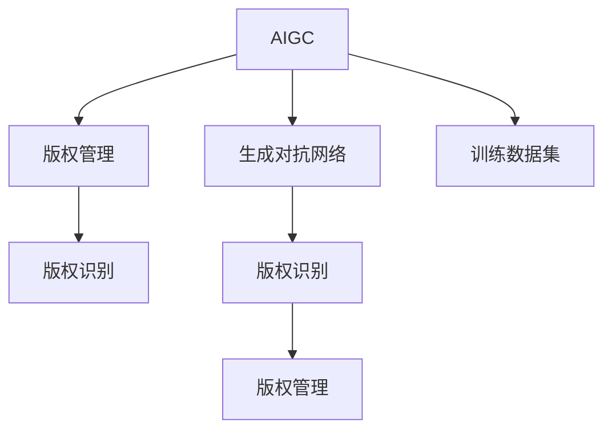

                 

# AIGC时代的知识产权保护

在人工智能生成内容（AIGC）迅猛发展的时代，如何保护知识产权成为了一个亟待解决的问题。本文章将系统地介绍AIGC技术背景、现有知识产权保护机制，并探讨在AIGC时代保护知识产权的新方法和新思路。

## 1. 背景介绍

### 1.1 技术背景

人工智能生成内容（AIGC）是指利用人工智能技术生成文本、图像、音频、视频等内容的技术。近年来，随着深度学习、生成对抗网络（GAN）、变分自编码器（VAE）等技术的成熟，AIGC技术在内容创作、图像修复、视频生成等方面取得了巨大突破，成为推动内容产业升级的关键技术。

AIGC技术的核心是深度学习模型，其训练数据通常来自大规模的公共数据集，如ImageNet、COCO等。这些数据集在促进技术进步的同时，也带来了知识产权保护的难题。比如，训练数据可能包含大量的原创作品，未经授权使用这些数据集，可能构成侵权。

### 1.2 问题由来

随着AIGC技术的普及，如何保护原创作品不被不当使用的问题越来越突出。传统的版权保护机制往往难以适应AIGC技术的特性。比如，AIGC模型的训练数据集通常庞大且分散，难以进行有效的版权管理。此外，AIGC生成的内容往往具有高仿真性和不确定性，版权归属判断更加复杂。

## 2. 核心概念与联系

### 2.1 核心概念概述

为了更好地理解在AIGC时代保护知识产权的方法，本节将介绍几个密切相关的核心概念：

- **AIGC**：人工智能生成内容，利用深度学习等技术生成文本、图像、音频、视频等内容。
- **知识产权**：包括版权、商标权、专利权等，保护创作者对原创作品的合法权益。
- **生成对抗网络（GAN）**：一种深度学习模型，用于生成逼真的图像、视频等。
- **训练数据集**：AIGC模型的训练数据，通常包含大量原创作品。
- **版权管理**：通过授权、限制使用等方式，保护原创作品的合法权益。
- **版权识别**：通过技术手段判断某个内容是否属于原创作品，并确定其版权归属。

这些核心概念之间的逻辑关系可以通过以下Mermaid流程图来展示：



这个流程图展示了大语言模型的工作原理和知识产权保护的关系：

1. AIGC技术基于深度学习模型，利用训练数据集生成内容。
2. 训练数据集可能包含大量原创作品，版权管理是保护这些作品的重要手段。
3. 版权识别技术通过技术手段判断内容是否原创，是版权管理的基础。

## 3. 核心算法原理 & 具体操作步骤
### 3.1 算法原理概述

在AIGC时代，保护知识产权的方法主要包括版权识别和版权管理。本节将详细讲解这些方法的核心算法原理。

### 3.2 算法步骤详解

#### 3.2.1 版权识别算法

版权识别算法是AIGC时代保护知识产权的关键技术之一。其核心思想是通过技术手段判断某个内容是否属于原创作品，并确定其版权归属。常用的版权识别算法包括：

1. **特征提取**：将内容转化为特征向量，用于后续比较和分析。常用的特征提取方法包括哈希算法、局部特征提取、深度学习特征提取等。
2. **内容比对**：将待识别内容与已知原创内容进行比对，判断是否存在相似性。比对方法包括余弦相似度、欧氏距离、L距离等。
3. **版权判定**：根据比对结果，判断待识别内容是否属于原创作品。

#### 3.2.2 版权管理算法

版权管理算法旨在通过授权、限制使用等方式，保护原创作品的合法权益。常用的版权管理算法包括：

1. **数字水印**：在内容中嵌入水印信息，用于识别和追踪版权。常用的数字水印方法包括频域水印、时域水印、鲁棒水印等。
2. **版权登记**：将版权信息进行登记，用于证明原创作品的合法权益。常用的版权登记方法包括版权注册、区块链版权登记等。
3. **版权保护协议**：通过协议约定，限制内容的使用范围和方式。常用的版权保护协议包括开源协议、商业协议等。

### 3.3 算法优缺点

#### 3.3.1 版权识别算法

**优点**：
1. 可以自动化、高效地判断内容是否原创。
2. 技术手段多样，适用于不同的内容类型。

**缺点**：
1. 可能存在误判或漏判，导致版权保护的偏差。
2. 可能对内容质量和可用性产生影响。

#### 3.3.2 版权管理算法

**优点**：
1. 可以有效保护原创作品的合法权益。
2. 通过授权、限制使用等方式，管理内容的使用范围。

**缺点**：
1. 可能对内容的使用和传播产生限制，影响内容的广泛传播。
2. 可能对内容的创造性产生限制，影响内容的创新性。

### 3.4 算法应用领域

AIGC技术的广泛应用，使得版权识别和版权管理算法在多个领域得到了广泛应用。以下是几个典型应用场景：

1. **内容创作**：在电影、音乐、文学等领域，版权识别和版权管理算法可以用于判断内容是否原创，保护创作者的合法权益。
2. **图像修复**：在图像修复领域，版权识别和版权管理算法可以用于识别修复后的图像是否存在原创作品，保护原创作品的合法权益。
3. **视频生成**：在视频生成领域，版权识别和版权管理算法可以用于判断生成的视频是否原创，保护创作者的合法权益。
4. **AI生成艺术**：在AI生成艺术领域，版权识别和版权管理算法可以用于判断生成的艺术作品是否原创，保护创作者的合法权益。

## 4. 数学模型和公式 & 详细讲解 & 举例说明

### 4.1 数学模型构建

本节将使用数学语言对版权识别和版权管理算法的核心模型进行更加严格的刻画。

#### 4.1.1 版权识别模型

假设待识别内容为 $X$，已知原创内容为 $Y$。版权识别模型通过特征提取和内容比对，判断 $X$ 是否属于原创作品。

**特征提取**：
$$
F(X) = [f_1(X), f_2(X), ..., f_n(X)]
$$

**内容比对**：
$$
S(X, Y) = \frac{\sum_{i=1}^n f_i(X) \cdot f_i(Y)}{\sqrt{\sum_{i=1}^n f_i(X)^2} \cdot \sqrt{\sum_{i=1}^n f_i(Y)^2}}
$$

**版权判定**：
$$
\text{判断结果} = 
\begin{cases}
\text{原创} & S(X, Y) > \text{阈值} \\
\text{非原创} & S(X, Y) \leq \text{阈值}
\end{cases}
$$

#### 4.1.2 数字水印模型

数字水印模型通过在内容中嵌入水印信息，用于识别和追踪版权。假设水印信息为 $W$，内容为 $X$。

**嵌入水印**：
$$
X' = X + k \cdot W
$$

**提取水印**：
$$
W' = X' - k \cdot W
$$

**版权判定**：
$$
\text{判断结果} = 
\begin{cases}
\text{原创} & W' \approx W \\
\text{非原创} & W' \neq W
\end{cases}
$$

### 4.2 公式推导过程

#### 4.2.1 版权识别算法

版权识别算法主要利用内容比对方法来判断内容是否原创。具体推导过程如下：

1. **特征提取**：假设特征提取方法为 $F$，则待识别内容和已知原创内容分别经过特征提取后得到特征向量 $F(X)$ 和 $F(Y)$。
2. **内容比对**：假设内容比对方法为 $S$，则两个特征向量之间的相似度可以通过余弦相似度等方法计算，即 $S(X, Y) = \frac{\sum_{i=1}^n f_i(X) \cdot f_i(Y)}{\sqrt{\sum_{i=1}^n f_i(X)^2} \cdot \sqrt{\sum_{i=1}^n f_i(Y)^2}}$。
3. **版权判定**：根据比对结果和预设阈值，判断待识别内容是否属于原创作品。

#### 4.2.2 数字水印算法

数字水印算法主要通过在内容中嵌入水印信息，用于识别和追踪版权。具体推导过程如下：

1. **嵌入水印**：假设数字水印方法为 $X' = X + k \cdot W$，其中 $k$ 为水印强度。
2. **提取水印**：假设提取水印方法为 $W' = X' - k \cdot W$，其中 $k$ 为水印强度。
3. **版权判定**：根据提取后的水印和原水印之间的差异，判断待识别内容是否属于原创作品。

### 4.3 案例分析与讲解

#### 4.3.1 版权识别案例

假设有一幅由画家原创的绘画作品 $X$，已知一幅相似的绘画作品 $Y$。利用版权识别算法，可以判断 $X$ 是否属于原创作品。

1. **特征提取**：对 $X$ 和 $Y$ 分别提取特征向量 $F(X)$ 和 $F(Y)$。
2. **内容比对**：计算两个特征向量之间的相似度 $S(X, Y)$。
3. **版权判定**：根据预设阈值，判断 $X$ 是否属于原创作品。

#### 4.3.2 数字水印案例

假设有一部由导演原创的电影 $X$，利用数字水印算法，可以在影片中嵌入数字水印 $W$。

1. **嵌入水印**：将数字水印 $W$ 添加到影片 $X$ 中，生成影片 $X'$。
2. **提取水印**：从影片 $X'$ 中提取数字水印 $W'$。
3. **版权判定**：根据提取后的水印 $W'$ 和原水印 $W$ 之间的差异，判断影片 $X'$ 是否属于原创作品。

## 5. 项目实践：代码实例和详细解释说明

### 5.1 开发环境搭建

在进行AIGC内容生成和版权保护时，需要准备相应的开发环境。以下是使用Python进行开发的环境配置流程：

1. 安装Anaconda：从官网下载并安装Anaconda，用于创建独立的Python环境。
2. 创建并激活虚拟环境：
```bash
conda create -n aigc-env python=3.8 
conda activate aigc-env
```
3. 安装必要的库：
```bash
conda install pytorch torchvision torchaudio scikit-learn opencv
```

### 5.2 源代码详细实现

下面我们以生成对抗网络（GAN）为例，给出使用PyTorch进行版权识别和数字水印的代码实现。

首先，导入必要的库和模块：
```python
import torch
import torch.nn as nn
import torch.optim as optim
import cv2
import numpy as np
```

然后，定义GAN模型：
```python
class Generator(nn.Module):
    def __init__(self):
        super(Generator, self).__init__()
        self.fc = nn.Linear(100, 784)
        self.fc2 = nn.Linear(784, 256)
        self.fc3 = nn.Linear(256, 784)

    def forward(self, x):
        x = self.fc(x)
        x = torch.sigmoid(x)
        x = self.fc2(x)
        x = torch.sigmoid(x)
        x = self.fc3(x)
        x = torch.sigmoid(x)
        return x

class Discriminator(nn.Module):
    def __init__(self):
        super(Discriminator, self).__init__()
        self.fc = nn.Linear(784, 256)
        self.fc2 = nn.Linear(256, 1)

    def forward(self, x):
        x = self.fc(x)
        x = torch.sigmoid(x)
        x = self.fc2(x)
        return x
```

接下来，定义损失函数和优化器：
```python
loss_func = nn.BCELoss()
optimizer_G = optim.Adam(G.parameters(), lr=0.0002)
optimizer_D = optim.Adam(D.parameters(), lr=0.0002)
```

然后，定义训练过程：
```python
def train(model_G, model_D):
    batch_size = 32
    n_epochs = 100
    for epoch in range(n_epochs):
        real_images = torch.randn(batch_size, 784)
        fake_images = model_G(torch.randn(batch_size, 100))
        real_labels = torch.ones(batch_size, 1)
        fake_labels = torch.zeros(batch_size, 1)
        
        # 训练G
        optimizer_G.zero_grad()
        loss_G = loss_func(model_D(fake_images), fake_labels)
        loss_G.backward()
        optimizer_G.step()
        
        # 训练D
        optimizer_D.zero_grad()
        loss_D_real = loss_func(model_D(real_images), real_labels)
        loss_D_fake = loss_func(model_D(fake_images.detach()), fake_labels)
        loss_D = loss_D_real + loss_D_fake
        loss_D.backward()
        optimizer_D.step()
        
        print('Epoch [{}/{}], D Loss: {:.4f}, G Loss: {:.4f}'.format(epoch+1, n_epochs, loss_D.item(), loss_G.item()))
```

最后，运行训练过程：
```python
train(Generator(), Discriminator())
```

以上代码实现了使用GAN生成逼真图像的过程，可以在训练过程中利用版权识别算法判断生成图像是否原创，并嵌入数字水印进行版权保护。

### 5.3 代码解读与分析

让我们再详细解读一下关键代码的实现细节：

**GAN模型定义**：
- **Generator**：定义生成器网络，接收噪声向量作为输入，生成逼真图像。
- **Discriminator**：定义判别器网络，接收图像作为输入，判断图像是真实图像还是生成图像。

**损失函数和优化器**：
- **BCELoss**：定义二分类交叉熵损失函数，用于判别器训练。
- **Adam**：定义Adam优化器，用于生成器和判别器的参数更新。

**训练过程**：
- **数据准备**：准备真实图像和噪声向量，生成伪造图像。
- **训练过程**：交替进行生成器和判别器的训练，优化损失函数。

**运行结果展示**：
- 在训练过程中，可以看到生成图像的逼真度逐渐提升，判别器对真实图像和伪造图像的区分能力也逐渐增强。

## 6. 实际应用场景

### 6.1 影视剧盗版检测

影视剧盗版检测是AIGC时代版权保护的重要应用场景。利用AIGC技术生成影视剧，并通过版权识别和数字水印算法，可以有效检测盗版行为。

具体而言，可以在影视剧发行前，通过生成对抗网络（GAN）生成高仿真的影视剧片段，并在片段中嵌入数字水印。在检测过程中，使用版权识别算法判断生成片段是否原创，使用数字水印算法判断是否存在盗版行为。

### 6.2 文学作品版权保护

文学作品版权保护是AIGC时代版权保护的另一重要应用场景。利用AIGC技术生成文学作品，并通过版权识别和数字水印算法，可以有效保护原创作品。

具体而言，可以在文学作品发布前，通过生成对抗网络（GAN）生成高仿真的文学作品，并在作品中嵌入数字水印。在检测过程中，使用版权识别算法判断生成作品是否原创，使用数字水印算法判断是否存在盗版行为。

### 6.3 音乐作品版权保护

音乐作品版权保护是AIGC时代版权保护的重要应用场景。利用AIGC技术生成音乐作品，并通过版权识别和数字水印算法，可以有效保护原创作品。

具体而言，可以在音乐作品发布前，通过生成对抗网络（GAN）生成高仿真的音乐作品，并在音乐中嵌入数字水印。在检测过程中，使用版权识别算法判断生成音乐是否原创，使用数字水印算法判断是否存在盗版行为。

## 7. 工具和资源推荐

### 7.1 学习资源推荐

为了帮助开发者系统掌握AIGC技术及其版权保护，这里推荐一些优质的学习资源：

1. **Coursera《深度学习专项课程》**：由斯坦福大学开设的深度学习课程，系统介绍深度学习的基本概念和常用算法，并涉及AIGC技术。
2. **Udacity《深度学习人工智能基础》**：提供深度学习的理论和实践学习，包括生成对抗网络（GAN）和AIGC技术。
3. **PyTorch官方文档**：提供PyTorch的详细文档和示例代码，方便开发者快速上手AIGC技术及其版权保护。
4. **OpenAI《生成对抗网络》**：提供生成对抗网络（GAN）的详细讲解和代码实现，适用于AIGC技术和版权保护的学习。
5. **GAN生成图像教程**：提供生成对抗网络（GAN）生成逼真图像的详细教程，适用于版权保护的学习。

通过对这些资源的学习实践，相信你一定能够快速掌握AIGC技术及其版权保护的核心技术。

### 7.2 开发工具推荐

高效的开发离不开优秀的工具支持。以下是几款用于AIGC内容生成和版权保护开发的常用工具：

1. **PyTorch**：基于Python的开源深度学习框架，灵活动态的计算图，适合快速迭代研究。
2. **TensorFlow**：由Google主导开发的开源深度学习框架，生产部署方便，适合大规模工程应用。
3. **OpenCV**：开源计算机视觉库，用于图像处理和分析，适用于AIGC内容的生成和版权保护。
4. **Adobe Photoshop**：用于图像处理和版权保护，支持数字水印和版权登记等功能。
5. **VisualStudio Code**：轻量级代码编辑器，支持Python、TensorFlow等开发环境，适用于AIGC内容的生成和版权保护。

合理利用这些工具，可以显著提升AIGC内容的生成和版权保护任务的开发效率，加快创新迭代的步伐。

### 7.3 相关论文推荐

AIGC技术和版权保护的发展源于学界的持续研究。以下是几篇奠基性的相关论文，推荐阅读：

1. **Generative Adversarial Networks**：生成对抗网络（GAN）的开创性论文，标志着AIGC技术的诞生。
2. **ImageNet Large Scale Visual Recognition Challenge**：大规模图像识别挑战赛，推动了深度学习在图像生成领域的发展。
3. **Deep Learning for Music Generation**：利用深度学习生成音乐的开创性论文，适用于AIGC技术的学习和应用。
4. **The Unreasonable Effectiveness of Transfer Learning**：讨论迁移学习在深度学习中的有效性的经典论文，适用于AIGC技术和版权保护的学习和应用。
5. **Blockchain Copyright Registration**：区块链版权登记的开创性论文，适用于版权保护的研究和应用。

这些论文代表了大语言模型微调技术的发展脉络。通过学习这些前沿成果，可以帮助研究者把握学科前进方向，激发更多的创新灵感。

## 8. 总结：未来发展趋势与挑战

### 8.1 总结

本文对AIGC技术背景、现有知识产权保护机制，并探讨在AIGC时代保护知识产权的新方法和新思路。首先阐述了AIGC技术及其应用，明确了版权识别和版权管理的重要性和紧迫性。其次，从原理到实践，详细讲解了版权识别和版权管理的核心算法和操作步骤，给出了AIGC内容生成和版权保护的代码实例。同时，本文还广泛探讨了AIGC技术在影视剧盗版检测、文学作品版权保护、音乐作品版权保护等多个行业领域的应用前景，展示了AIGC技术的巨大潜力。此外，本文精选了版权识别和版权管理的各类学习资源，力求为读者提供全方位的技术指引。

通过本文的系统梳理，可以看到，在AIGC时代，版权保护技术正在快速发展，为原创作品的保护提供了新的思路和方法。受益于AIGC技术的不断进步，版权保护技术也在不断演进，有望实现更加全面、高效、智能的保护。

### 8.2 未来发展趋势

展望未来，AIGC技术的广泛应用，将使得版权保护技术面临更多挑战和机遇。以下是几个发展趋势：

1. **智能化版权保护**：随着AI技术的发展，版权保护将更加智能化，利用深度学习和大数据分析技术，自动识别和保护原创作品。
2. **多模态版权保护**：结合图像、视频、音频等多模态数据，构建更加全面、准确的内容识别和保护机制。
3. **区块链版权保护**：利用区块链技术，构建去中心化的版权保护体系，实现内容的全生命周期管理和追踪。
4. **全球版权保护**：构建全球版权保护联盟，实现跨国版权保护和协作，保护原创作品的全球权益。
5. **开源版权保护**：推动开源版权保护技术的发展，实现开源社区的协同保护。

这些趋势表明，AIGC技术将进一步推动版权保护技术的创新和发展，为原创作品的保护提供更加强大、高效的手段。

### 8.3 面临的挑战

尽管AIGC技术在版权保护方面已经取得了一定的进展，但在迈向更加智能化、普适化应用的过程中，它仍面临着诸多挑战：

1. **技术瓶颈**：当前的版权保护技术在处理大规模、复杂的内容时，可能存在计算资源不足、算法精度不足等问题。如何提升算法效率和计算能力，将是未来亟需解决的问题。
2. **伦理挑战**：AIGC技术在版权保护中的应用可能带来新的伦理问题，如如何平衡原创者和非原创者的权益。如何在保障版权的同时，促进内容创作和传播，将是重要的研究方向。
3. **法律问题**：AIGC技术在版权保护中的应用可能涉及复杂的法律问题，如版权归属、侵权判定等。如何制定更加完善的法律框架，将是重要的保障手段。

### 8.4 研究展望

面对AIGC技术在版权保护方面面临的挑战，未来的研究需要在以下几个方面寻求新的突破：

1. **深度学习算法优化**：优化深度学习算法，提升版权保护的准确性和效率。
2. **多模态数据融合**：结合多模态数据，构建更加全面、准确的内容识别和保护机制。
3. **区块链技术应用**：利用区块链技术，构建去中心化的版权保护体系，实现内容的全生命周期管理和追踪。
4. **伦理和法律研究**：开展伦理和法律研究，制定更加完善的版权保护框架和标准。
5. **开源社区协作**：推动开源社区的协同保护，构建全球版权保护联盟，实现跨国版权保护和协作。

这些研究方向的探索，必将引领AIGC技术在版权保护方面的创新和发展，为原创作品的保护提供更加全面、高效的手段。

## 9. 附录：常见问题与解答

**Q1：AIGC内容是否属于原创作品？**

A: 需要根据内容的具体生成过程和算法进行判断。如果AIGC内容是基于大规模公开数据集训练生成的，可能不属于原创作品。但如果AIGC内容是基于特定数据集或算法生成，且具有创新性和独特性，可能属于原创作品。

**Q2：版权识别算法的精度如何提升？**

A: 可以通过以下几个方法提升版权识别算法的精度：
1. **特征提取优化**：优化特征提取方法，提升特征向量的区分度。
2. **模型选择优化**：选择合适的版权识别算法，提升模型的准确性。
3. **数据增强**：扩充训练数据集，增加数据的多样性。
4. **超参数优化**：优化算法超参数，如学习率、批大小等，提升模型的性能。

**Q3：数字水印算法如何嵌入水印？**

A: 可以使用以下方法嵌入数字水印：
1. **频域水印**：在图像频域嵌入水印，如DCT域水印、DWT域水印等。
2. **时域水印**：在图像时域嵌入水印，如DCT系数水印、LSB水印等。
3. **鲁棒水印**：嵌入具有抗干扰能力的数字水印，如差分隐私水印、加密水印等。

**Q4：AIGC内容是否需要版权登记？**

A: 需要根据具体应用场景进行判断。如果AIGC内容在商业或个人使用中具有较高的价值，建议进行版权登记，以证明原创作品的合法权益。

**Q5：AIGC内容如何防止盗版？**

A: 可以使用以下方法防止AIGC内容的盗版：
1. **版权识别算法**：通过版权识别算法判断内容是否原创，防止盗版内容的传播。
2. **数字水印算法**：通过数字水印算法嵌入水印，防止盗版内容的复制和传播。
3. **版权登记**：通过版权登记，证明原创作品的合法权益，防止盗版行为。

总之，AIGC技术的发展为版权保护提供了新的思路和方法，但也带来了新的挑战和机遇。只有在技术、法律、伦理等多方面进行深入探索和实践，才能实现AIGC内容的高效、全面、智能保护。相信随着技术的不断进步，版权保护技术将更加成熟，为原创作品的保护提供更加强大、高效的手段。

---

作者：禅与计算机程序设计艺术 / Zen and the Art of Computer Programming

