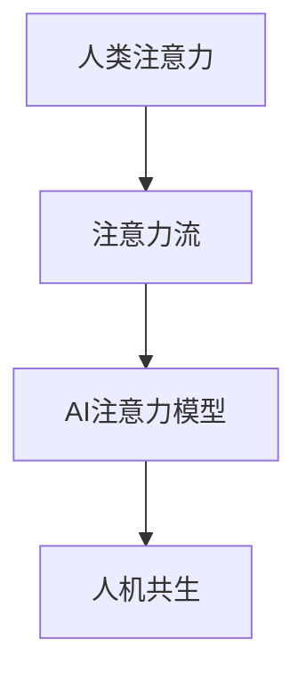

                 

# AI与人类注意力流：打造人机共存的社会

> 关键词：人工智能,人类注意力,社会融合,技术伦理,数据隐私,人机共生

## 1. 背景介绍

### 1.1 问题由来
随着人工智能技术的迅猛发展，AI系统在各行各业中的应用越来越广泛。从工业制造到医疗卫生，从交通运输到教育培训，AI正逐步渗透到人类社会的方方面面。然而，AI系统在提升效率、降低成本的同时，也带来了新的挑战和伦理困境。特别是随着AI与人类社会交互的深入，如何合理利用AI技术，改善人机关系，构建和谐的人机共生社会，成为当前亟需解决的重要课题。

AI与人类注意力流（Attention Flow）的概念，正是在这一背景下提出的。它旨在通过AI技术，更好地理解和模拟人类注意力流动的过程，从而实现人机之间更加自然、高效的交互。这一概念强调了在人工智能应用中，应充分考虑人类心理和生理特征，以确保技术创新与社会伦理的和谐共存。

### 1.2 问题核心关键点
AI与人类注意力流的研究核心在于：
1. **理解人类注意力**：通过心理学和认知科学的最新研究，深入理解人类注意力流动的生理和心理机制。
2. **模拟注意力模型**：开发能够模拟人类注意力行为的AI模型，使其具备对人类注意力流动的预测和引导能力。
3. **改善人机交互**：通过优化AI系统的设计和应用，提高其对人类注意力的响应速度和准确度，增强人机之间的互动性和满意度。
4. **维护伦理安全**：确保AI系统在应用过程中，尊重用户隐私，不侵犯用户权益，建立透明、可解释的AI决策机制。

### 1.3 问题研究意义
研究AI与人类注意力流，对于构建和谐的人机共存社会具有重要意义：

1. **提升用户体验**：通过精准模拟人类注意力流，AI系统能够更好地理解和响应用户需求，提供更加个性化、自然的服务。
2. **改善工作效率**：AI系统在优化注意力流控制方面具备优势，能够帮助用户集中注意力，提高学习和工作效率。
3. **促进社会融合**：AI技术的应用能够促进不同领域、不同背景的人之间的沟通和协作，构建更加包容、多元的社会环境。
4. **加强伦理意识**：关注人类注意力流的研究，有助于在AI技术开发和应用过程中，树立伦理意识，避免技术滥用带来的负面影响。

## 2. 核心概念与联系

### 2.1 核心概念概述

为更好地理解AI与人类注意力流的相关概念，本节将介绍几个核心概念：

- **人类注意力（Human Attention）**：指人类在处理信息时，对特定内容的聚焦和集中。注意力可以用于学习、记忆、决策等各类认知过程。
- **注意力流（Attention Flow）**：指人类注意力在不同时间、不同情境下的动态变化过程。注意力流的研究有助于理解人类认知机制。
- **AI注意力模型（AI Attention Model）**：通过模拟人类注意力机制，AI模型能够识别和响应人类注意力的变化，实现对人类注意力的引导和控制。
- **人机共生（Human-Machine Coexistence）**：通过AI技术改善人类注意力流，使AI系统成为人类认知和行动的辅助工具，实现人机之间的和谐共存。

这些概念之间的逻辑关系可以通过以下Mermaid流程图来展示：



这个流程图展示了人类注意力流、AI注意力模型与人机共生之间的内在联系。人类注意力流的研究是AI注意力模型开发的基础，而AI注意力模型的应用则旨在实现人机共生，构建和谐的社会环境。

## 3. 核心算法原理 & 具体操作步骤
### 3.1 算法原理概述

AI与人类注意力流的核心算法主要围绕以下几个关键步骤展开：

1. **注意力模拟**：通过心理学和认知科学的理论和方法，模拟人类注意力流动的过程。
2. **数据收集与处理**：收集人类在完成任务过程中的注意力数据，包括眼球追踪数据、脑电图数据、反应时间数据等。
3. **模型训练**：利用收集到的数据训练AI注意力模型，使其能够预测和引导人类注意力流。
4. **应用优化**：将训练好的AI注意力模型应用于具体场景，如人机交互、学习辅助等，优化用户体验，提升工作效率。

这些步骤构成了一个完整的AI与人类注意力流的研究和应用流程。

### 3.2 算法步骤详解

**Step 1: 注意力模拟**
- **理论框架**：基于心理学和认知科学的最新研究成果，构建人类注意力流动的理论模型。常见模型包括Brunswik的双重过滤模型、Posner的过滤突现模型等。
- **参数设置**：根据具体应用场景，选择合适的模型参数。例如，在任务导向的注意力模型中，需要考虑任务难度、时间限制等因素。

**Step 2: 数据收集与处理**
- **数据来源**：从实验或真实环境中收集人类注意力数据。例如，通过眼球追踪设备记录用户在屏幕上的注视点、注视时间和注视区域。
- **数据清洗**：对收集到的原始数据进行预处理和清洗，去除噪声和异常值，保证数据质量。
- **特征提取**：提取关键特征，如注视持续时间、注视点位置、眼动轨迹等。这些特征将作为模型的输入数据。

**Step 3: 模型训练**
- **算法选择**：选择适合的机器学习算法，如支持向量机(SVM)、决策树、随机森林等，用于训练AI注意力模型。
- **模型优化**：利用交叉验证、网格搜索等方法，优化模型参数，提高模型性能。
- **模型评估**：在测试集上评估模型性能，利用准确率、召回率、F1分数等指标评估模型效果。

**Step 4: 应用优化**
- **场景设计**：根据具体应用场景，设计AI注意力模型的工作流程。例如，在智能客服系统中，可以通过监控用户注视点，及时调整客服界面，提升用户满意度。
- **用户反馈**：收集用户反馈，不断调整和优化AI注意力模型。例如，通过A/B测试，比较不同模型对用户注意力的引导效果。
- **持续改进**：随着数据和模型的不断积累，持续改进AI注意力模型，提升其准确度和响应速度。

### 3.3 算法优缺点

AI与人类注意力流的研究具有以下优点：
1. **提高人机交互质量**：通过模拟人类注意力流，AI系统能够更好地理解和响应用户需求，提供更加个性化、自然的服务。
2. **优化用户注意力**：AI技术能够帮助用户集中注意力，减少干扰，提高学习和工作效率。
3. **促进社会融合**：AI系统的应用能够促进不同领域、不同背景的人之间的沟通和协作，构建更加包容、多元的社会环境。

同时，该方法也存在一定的局限性：
1. **数据依赖性强**：AI注意力模型的训练和优化依赖于大量的人类注意力数据，数据获取和处理成本较高。
2. **模型复杂度高**：AI注意力模型需要复杂的训练和优化过程，模型的可解释性和透明度较低。
3. **伦理风险**：AI系统在应用过程中可能侵犯用户隐私，引发伦理争议。

尽管存在这些局限性，但就目前而言，AI与人类注意力流的研究和应用仍是大数据时代人机交互研究的重要方向。未来相关研究的重点在于如何进一步降低数据获取成本，提高模型透明度，加强伦理保护，确保AI技术的安全、可靠应用。

### 3.4 算法应用领域

AI与人类注意力流的研究已经在多个领域得到了应用，覆盖了从工业制造到教育培训的广泛场景，具体包括：

- **智能教育**：通过模拟学生注意力流，AI系统能够识别学生的学习状态，提供个性化的学习建议和资源。
- **医疗诊断**：AI系统能够监控患者的注意力变化，及时发现注意力分散的情况，提供个性化的诊疗方案。
- **智能客服**：AI系统能够通过监控客户注视点，调整界面布局，提升客户满意度。
- **人机协作**：AI系统能够与人类协作完成任务，如设计、编程等，提升工作效率和质量。
- **增强现实**：通过模拟用户注意力流，AR系统能够提供更加自然、流畅的沉浸式体验。

除了这些具体应用外，AI与人类注意力流的研究还为AI技术在其他领域的拓展提供了新的思路和方法。未来，随着研究的深入和技术的发展，AI与人类注意力流的应用前景将更加广阔。

## 4. 数学模型和公式 & 详细讲解 & 举例说明

### 4.1 数学模型构建

在AI与人类注意力流的研究中，常用的数学模型包括线性回归模型、决策树模型、随机森林模型等。这里以线性回归模型为例，说明其构建过程。

设注意力数据集为 $\{(x_i,y_i)\}_{i=1}^N$，其中 $x_i$ 为注意力特征向量，$y_i$ 为注意力值。线性回归模型的目标是最小化预测值与真实值之间的误差，即：

$$
\min_{\beta} \sum_{i=1}^N (y_i - \beta^T x_i)^2
$$

其中 $\beta$ 为模型参数。

### 4.2 公式推导过程

根据最小二乘法的原理，求解线性回归模型的参数 $\beta$：

$$
\beta = \left(\sum_{i=1}^N x_i x_i^T\right)^{-1} \sum_{i=1}^N x_i y_i
$$

将训练好的模型应用于测试集，得到预测值 $\hat{y}_i = \beta^T x_i$，计算预测误差：

$$
e_i = y_i - \hat{y}_i = y_i - \beta^T x_i
$$

利用均方误差（MSE）作为模型的性能评估指标：

$$
MSE = \frac{1}{N} \sum_{i=1}^N e_i^2
$$

在实践中，可以通过梯度下降算法来求解上述最小化问题，优化模型参数 $\beta$。

### 4.3 案例分析与讲解

假设我们在一个智能教育平台上收集了学生的注意力数据，包括注视点位置、注视时间等特征。我们希望构建一个预测模型，预测学生的学习状态（如专注、分心）。

**Step 1: 数据预处理**
- 收集学生注意力数据，记录每个注视点的持续时间、位置和方向。
- 对数据进行清洗和预处理，去除异常值和噪声。

**Step 2: 特征提取**
- 提取关键特征，如注视点位置、注视持续时间、眼动轨迹等。
- 对特征进行归一化和标准化处理，便于模型训练。

**Step 3: 模型训练**
- 选择线性回归模型作为注意力预测模型，利用训练集数据训练模型。
- 利用交叉验证和网格搜索优化模型参数，选择最佳模型。

**Step 4: 模型评估**
- 在测试集上评估模型性能，计算均方误差（MSE）和准确率（Accuracy）。
- 根据评估结果调整模型参数，进一步优化模型性能。

**Step 5: 模型应用**
- 在智能教育平台上部署训练好的模型，实时监控学生的注意力状态。
- 根据学生的注意力状态，动态调整学习内容和难度，提供个性化的学习建议。

## 5. 项目实践：代码实例和详细解释说明

### 5.1 开发环境搭建

在进行AI与人类注意力流的研究和应用前，我们需要准备好开发环境。以下是使用Python进行机器学习开发的常见环境配置流程：

1. 安装Python：从官网下载并安装Python，建议选择最新版本。
2. 安装Pip：在命令行中输入 `python -m ensurepip --default-pip` 命令，安装Pip包管理器。
3. 安装必要的科学计算包：例如NumPy、SciPy、Pandas等。
4. 安装机器学习库：例如Scikit-learn、TensorFlow、PyTorch等。
5. 安装数据处理工具：例如Matplotlib、Seaborn、Jupyter Notebook等。

完成上述步骤后，即可在Python环境下开始AI与人类注意力流的研究和应用实践。

### 5.2 源代码详细实现

下面我们以学生注意力状态预测为例，给出使用Scikit-learn库对注意力数据进行线性回归建模的Python代码实现。

```python
import numpy as np
from sklearn.linear_model import LinearRegression
from sklearn.metrics import mean_squared_error

# 数据预处理
data = np.loadtxt('attention_data.txt', delimiter=',')
X = data[:, 1:]  # 特征数据
y = data[:, 0]    # 注意力状态

# 模型训练
model = LinearRegression()
model.fit(X, y)

# 模型评估
test_data = np.loadtxt('test_data.txt', delimiter=',')
X_test = test_data[:, 1:]
y_test = test_data[:, 0]
y_pred = model.predict(X_test)
mse = mean_squared_error(y_test, y_pred)

# 输出结果
print('Mean Squared Error:', mse)
```

### 5.3 代码解读与分析

让我们再详细解读一下关键代码的实现细节：

**数据预处理**：
- `data = np.loadtxt('attention_data.txt', delimiter=',')`：从文件中读取数据，使用逗号作为字段分隔符。
- `X = data[:, 1:]`：获取特征数据，即去掉第一列（目标变量）。
- `y = data[:, 0]`：获取目标变量，即注意力状态。

**模型训练**：
- `model = LinearRegression()`：创建线性回归模型对象。
- `model.fit(X, y)`：使用训练数据训练模型。

**模型评估**：
- `test_data = np.loadtxt('test_data.txt', delimiter=',')`：从测试文件中读取数据。
- `X_test = test_data[:, 1:]`：获取测试特征数据。
- `y_test = test_data[:, 0]`：获取测试目标变量。
- `y_pred = model.predict(X_test)`：对测试数据进行预测。
- `mse = mean_squared_error(y_test, y_pred)`：计算均方误差。

**结果输出**：
- `print('Mean Squared Error:', mse)`：输出均方误差。

通过上述代码，我们可以看到，使用Scikit-learn库进行线性回归建模是相对简单的。数据预处理、模型训练、模型评估和结果输出等步骤都得到了良好的支持。

## 6. 实际应用场景

### 6.1 智能教育

AI与人类注意力流在智能教育中的应用，能够显著提升教学效果和学习效率。通过实时监控学生的注意力状态，AI系统能够及时发现学生注意力分散的情况，提供个性化的学习建议和资源，帮助学生更好地集中注意力，提高学习效果。

**实际案例**：在智能课堂上，AI系统能够通过摄像头和眼球追踪设备实时监控学生的注意力状态。当发现学生注意力分散时，系统会自动调整教学内容和难度，推送相关的学习资源，帮助学生集中注意力。例如，在讲解复杂概念时，系统会自动推送相关的视频、动画和图解，帮助学生更好地理解。

### 6.2 医疗诊断

在医疗诊断中，AI系统能够通过监控患者的注意力状态，及时发现注意力分散的情况，提供个性化的诊疗方案。例如，在手术过程中，AI系统能够实时监控患者的注意力状态，发现注意力分散的情况，及时调整手术方案，提高手术成功率。

**实际案例**：在手术室内，AI系统通过监控患者的注意力状态，及时发现注意力分散的情况。例如，在执行精细操作时，系统会自动调整手术环境，减少干扰，帮助医生集中注意力，提高手术成功率。此外，AI系统还能够根据患者的注意力状态，推荐合适的手术步骤和方案，提高手术效率和安全性。

### 6.3 智能客服

在智能客服系统中，AI系统能够通过监控客户注视点，调整界面布局，提升客户满意度。例如，在客户咨询复杂问题时，系统会自动调整界面布局，增加重要的操作按钮和信息提示，帮助客户快速找到相关信息。

**实际案例**：在智能客服系统中，AI系统通过监控客户注视点，自动调整界面布局。例如，在客户咨询复杂问题时，系统会自动增加操作按钮和信息提示，帮助客户快速找到相关信息。此外，AI系统还能够根据客户的注意力状态，推荐相关的解决方案和知识库，提高客户满意度。

### 6.4 未来应用展望

随着AI与人类注意力流的研究和应用的不断深入，未来的应用前景将更加广阔。以下是一些可能的未来应用方向：

1. **增强现实**：通过模拟用户注意力流，AR系统能够提供更加自然、流畅的沉浸式体验。例如，在虚拟会议中，系统能够实时监控用户的注意力状态，自动调整虚拟场景的布局和内容，提升用户的沉浸感和参与度。

2. **人机协作**：在协作任务中，AI系统能够通过监控用户注意力流，优化任务分配和协作流程。例如，在团队协作项目中，系统能够实时监控团队成员的注意力状态，自动调整任务分配和协作流程，提高团队协作效率。

3. **智能家居**：在智能家居系统中，AI系统能够通过监控用户的注意力流，自动调整家居设备的运行状态。例如，在用户观看电视时，系统能够自动调整电视音量和亮度，减少干扰，提升用户的注意力集中度。

4. **增强学习**：在增强学习中，AI系统能够通过监控学习者的注意力状态，优化学习策略和内容。例如，在学习过程中，系统能够实时监控学习者的注意力状态，自动调整学习内容和难度，提高学习效果。

5. **智能导航**：在智能导航系统中，AI系统能够通过监控用户的注意力状态，优化导航路线和信息提示。例如，在用户导航过程中，系统能够实时监控用户的注意力状态，自动调整导航路线和信息提示，提升用户导航效率。

未来，随着AI与人类注意力流研究的深入，其应用领域将更加广泛，技术手段也将更加先进，为人类社会的智能化转型提供更加有力的支持。

## 7. 工具和资源推荐

### 7.1 学习资源推荐

为了帮助开发者系统掌握AI与人类注意力流的理论基础和实践技巧，这里推荐一些优质的学习资源：

1. **《注意力机制导论》**：一本关于注意力机制的经典书籍，详细介绍了注意力机制的理论背景、计算方法和实际应用。
2. **《深度学习理论与实践》**：一本全面的深度学习教材，涵盖深度学习基础、神经网络、优化算法等多个方面，非常适合初学者和进阶者。
3. **《Python机器学习》**：一本实践导向的机器学习教材，详细介绍了Python在机器学习中的应用，包括数据预处理、模型训练和模型评估等。
4. **Coursera《机器学习》课程**：由斯坦福大学开设的机器学习课程，提供丰富的视频讲义和编程作业，帮助初学者系统掌握机器学习的基本概念和算法。
5. **Kaggle竞赛平台**：一个数据科学竞赛平台，提供大量数据集和竞赛任务，帮助开发者实践机器学习算法，提升实战能力。

通过对这些资源的学习实践，相信你一定能够快速掌握AI与人类注意力流的精髓，并用于解决实际的AI问题。

### 7.2 开发工具推荐

高效的开发离不开优秀的工具支持。以下是几款用于AI与人类注意力流开发的常用工具：

1. **Python**：一种高效、灵活的编程语言，支持各种数据科学和机器学习库。
2. **Jupyter Notebook**：一种交互式编程环境，支持代码编写、数据可视化和结果展示，非常适合数据科学和机器学习开发。
3. **TensorFlow**：一个开源的机器学习框架，支持深度学习和强化学习等任务。
4. **Scikit-learn**：一个基于Python的机器学习库，支持各种分类、回归和聚类任务。
5. **Matplotlib**：一个绘图库，支持绘制各种类型的图形和图表。

合理利用这些工具，可以显著提升AI与人类注意力流的研究和开发效率，加快创新迭代的步伐。

### 7.3 相关论文推荐

AI与人类注意力流的研究源于学界的持续研究。以下是几篇奠基性的相关论文，推荐阅读：

1. **《人类注意力的神经基础》**：一篇综述性论文，详细介绍了人类注意力的神经机制和认知基础。
2. **《注意力机制在深度学习中的应用》**：一篇关于注意力机制的论文，介绍了注意力机制在计算机视觉、自然语言处理等领域的应用。
3. **《基于注意力机制的图像分类》**：一篇关于基于注意力机制的图像分类的论文，介绍了注意力机制在图像分类任务中的应用。
4. **《注意力的心理学和认知科学基础》**：一篇综述性论文，详细介绍了注意力的心理学和认知科学基础，为AI与人类注意力流的研究提供了理论支持。

这些论文代表了大语言模型微调技术的发展脉络。通过学习这些前沿成果，可以帮助研究者把握学科前进方向，激发更多的创新灵感。

## 8. 总结：未来发展趋势与挑战

### 8.1 总结

本文对AI与人类注意力流进行了全面系统的介绍。首先阐述了AI与人类注意力流的相关概念和研究背景，明确了其在改善人机交互、提升用户体验方面的独特价值。其次，从原理到实践，详细讲解了AI与人类注意力流的数学模型和关键步骤，给出了具体案例和代码实现。最后，本文还探讨了AI与人类注意力流的未来应用方向和面临的挑战，为未来研究提供了方向。

通过本文的系统梳理，可以看到，AI与人类注意力流的研究正逐步成为人机交互研究的重要方向，为AI技术在社会融合、用户体验优化等方面提供了新的思路和方法。随着研究的深入和技术的发展，AI与人类注意力流的应用前景将更加广阔。

### 8.2 未来发展趋势

展望未来，AI与人类注意力流的研究将呈现以下几个发展趋势：

1. **深度融合**：随着AI技术的不断发展，AI与人类注意力流将与更多领域的技术进行深度融合，如脑机接口、认知神经科学等，进一步提升AI系统的智能水平。
2. **广泛应用**：随着AI与人类注意力流研究的深入，其应用领域将不断扩大，涉及教育、医疗、工业等多个领域，为社会进步提供新动力。
3. **个性化定制**：未来的AI系统将更加注重个性化需求，通过模拟人类注意力流，提供更加自然、高效的个性化服务。
4. **数据驱动**：随着数据量的不断增加，AI系统将更加依赖数据驱动的方法，通过大规模数据分析，提升注意力模拟和引导的准确性。
5. **伦理保障**：随着AI技术的广泛应用，伦理问题将愈发凸显，AI与人类注意力流的研究将更加注重伦理保障，确保技术应用的透明性和可解释性。

以上趋势凸显了AI与人类注意力流的研究和应用前景。这些方向的探索发展，必将进一步提升AI技术在人类社会中的作用，推动智能社会的构建。

### 8.3 面临的挑战

尽管AI与人类注意力流的研究已经取得了一定进展，但在迈向更加智能化、普适化应用的过程中，仍面临诸多挑战：

1. **数据获取难度大**：高质量、大规模的人类注意力数据获取成本较高，需要投入大量人力和物力资源。
2. **模型复杂度高**：人类注意力流的模拟和引导需要复杂的算法和模型，模型的可解释性和透明度较低。
3. **隐私保护问题**：AI系统在应用过程中需要收集大量的人类注意力数据，可能侵犯用户隐私，引发伦理争议。
4. **技术普及度低**：当前的AI与人类注意力流技术仍需要较高的技术门槛，推广应用难度较大。
5. **伦理监管缺失**：目前对AI与人类注意力流的伦理监管尚不完善，可能引发技术滥用等负面影响。

面对这些挑战，未来的研究需要在数据获取、模型优化、隐私保护、技术普及和伦理监管等方面进行全面的探索和改进。只有从多维度协同发力，才能实现AI与人类注意力流的稳健发展，确保其安全、可靠、高效地应用。

### 8.4 研究展望

未来，AI与人类注意力流的研究需要在以下几个方面进行突破：

1. **数据获取优化**：探索更高效、更经济的数据获取方法，如利用众包平台、线上实验等，降低数据获取成本。
2. **模型简化优化**：开发更加简单、易解释的AI注意力模型，提升模型的透明度和可解释性。
3. **隐私保护机制**：构建隐私保护机制，确保在数据收集和处理过程中，充分保护用户隐私。
4. **技术普及推广**：加强AI与人类注意力流技术的普及和推广，降低技术应用门槛，促进技术落地。
5. **伦理监管体系**：建立完善的伦理监管体系，确保AI技术应用的透明性和可解释性，规避伦理风险。

这些研究方向的探索，必将引领AI与人类注意力流技术迈向更高的台阶，为构建安全、可靠、可解释、可控的智能系统铺平道路。面向未来，AI与人类注意力流技术还需要与其他人工智能技术进行更深入的融合，如知识表示、因果推理、强化学习等，多路径协同发力，共同推动自然语言理解和智能交互系统的进步。只有勇于创新、敢于突破，才能不断拓展AI技术的应用边界，让智能技术更好地造福人类社会。

## 9. 附录：常见问题与解答

**Q1：AI与人类注意力流是否适用于所有应用场景？**

A: AI与人类注意力流的研究和应用具有一定适用范围，主要适用于需要监控和引导用户注意力流的应用场景。例如，在智能教育、医疗诊断、智能客服等领域，AI系统通过监控用户注意力状态，能够提供更加个性化、自然的服务，提升用户体验。但对于一些不需要注意力监控的应用场景，如机械自动化、物质生产等，AI与人类注意力流的应用效果可能不明显。

**Q2：在应用AI与人类注意力流时，如何确保用户隐私保护？**

A: 在应用AI与人类注意力流时，确保用户隐私保护至关重要。以下是一些常用的隐私保护措施：
1. 数据匿名化：对用户的注意力数据进行匿名化处理，去除敏感信息。
2. 数据加密：在数据传输和存储过程中，采用加密技术保护数据安全。
3. 用户同意：在使用AI系统前，充分告知用户数据采集和应用的目的，获取用户同意。
4. 透明性：在使用AI系统过程中，确保数据的采集、处理和应用过程透明，允许用户查询和监控数据使用情况。
5. 数据去中心化：采用去中心化的数据存储和处理方式，减少对单一数据中心的依赖，降低隐私泄露风险。

通过以上措施，可以在AI与人类注意力流应用中，有效保护用户隐私，避免伦理风险。

**Q3：AI与人类注意力流的研究难点有哪些？**

A: AI与人类注意力流的研究难点主要包括以下几个方面：
1. 数据获取难度大：高质量、大规模的人类注意力数据获取成本较高，需要投入大量人力和物力资源。
2. 模型复杂度高：人类注意力流的模拟和引导需要复杂的算法和模型，模型的可解释性和透明度较低。
3. 隐私保护问题：AI系统在应用过程中需要收集大量的人类注意力数据，可能侵犯用户隐私，引发伦理争议。
4. 技术普及度低：当前的AI与人类注意力流技术仍需要较高的技术门槛，推广应用难度较大。
5. 伦理监管缺失：目前对AI与人类注意力流的伦理监管尚不完善，可能引发技术滥用等负面影响。

这些难点需要通过多方面的努力才能逐步解决，确保AI与人类注意力流技术的稳健发展。

**Q4：AI与人类注意力流如何应用于智能教育？**

A: AI与人类注意力流在智能教育中的应用，主要体现在以下几个方面：
1. 学习监控：通过实时监控学生的注意力状态，AI系统能够及时发现学生注意力分散的情况，提供个性化的学习建议和资源。
2. 课程调整：根据学生的注意力状态，AI系统能够动态调整课程内容和难度，提供更加适合的学习路径。
3. 学习辅助：AI系统能够提供个性化的学习建议和资源，帮助学生更好地集中注意力，提高学习效果。

例如，在智能课堂上，AI系统通过摄像头和眼球追踪设备实时监控学生的注意力状态。当发现学生注意力分散时，系统会自动调整教学内容和难度，推送相关的学习资源，帮助学生集中注意力。此外，AI系统还能够根据学生的注意力状态，推荐合适的学习内容和方法，提高学习效率。

通过AI与人类注意力流的应用，智能教育能够更加个性化、自然地满足学生的需求，提升教学效果和学习效率。

**Q5：AI与人类注意力流在医疗诊断中的应用前景如何？**

A: AI与人类注意力流在医疗诊断中的应用前景广阔。通过实时监控患者的注意力状态，AI系统能够及时发现注意力分散的情况，提供个性化的诊疗方案。具体应用包括以下几个方面：

1. 手术支持：在手术过程中，AI系统能够实时监控患者的注意力状态，发现注意力分散的情况，及时调整手术方案，提高手术成功率。例如，在执行精细操作时，系统会自动调整手术环境，减少干扰，帮助医生集中注意力，提高手术效率和安全性。
2. 诊疗建议：AI系统能够根据患者的注意力状态，推荐合适的诊疗方案和用药方案，提高诊疗效果。例如，在诊断复杂疾病时，系统能够根据患者的注意力状态，推荐合适的检查方法和诊疗路径，减少误诊和漏诊的风险。
3. 康复指导：AI系统能够通过监控患者的注意力状态，提供个性化的康复指导和训练方案，帮助患者更好地恢复健康。例如，在康复训练过程中，系统能够实时监控患者的注意力状态，调整训练内容和难度，提高康复效果。

总之，AI与人类注意力流在医疗诊断中的应用，能够显著提升诊疗效果和康复效率，为患者带来更好的医疗体验。

---

作者：禅与计算机程序设计艺术 / Zen and the Art of Computer Programming

