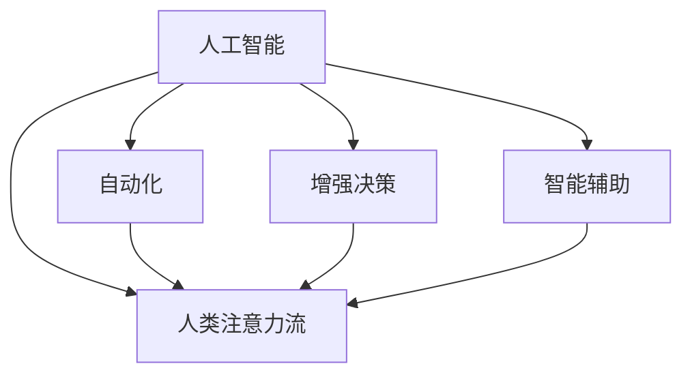

                 

# AI与人类注意力流：未来的工作和道德

## 1. 背景介绍

在过去的几年里，人工智能(AI)技术快速发展，逐步渗透到各行各业，带来了前所未有的机遇和挑战。AI不仅仅是一种技术工具，更是深刻影响着人类社会、经济和文化的一股力量。特别是在工作场所，AI正在与人类进行“协同工作”，重塑传统的工作模式和劳动关系。

### 1.1 背景概述

AI与人类“协作”的形式多种多样，如自动化、增强决策、智能辅助等。自动化技术可以将重复性、高风险的任务交由机器处理，提高工作效率和安全性。增强决策能力通过提供数据驱动的洞察，帮助人类做出更优决策。智能辅助则通过自然语言处理、图像识别等技术，支持人类的信息收集、分析和决策制定。

然而，这些AI技术的广泛应用，也引发了诸多伦理、道德和安全问题，如工作岗位流失、隐私泄露、算法歧视等。这些问题不仅涉及技术本身，更关乎人机交互的平衡和未来社会的可持续发展。本文将从人类注意力流和AI交互的角度出发，探讨这些问题的解决之道，并为未来的工作模式和道德规范提出建议。

## 2. 核心概念与联系

### 2.1 核心概念概述

为深入理解AI与人类工作的道德问题，我们首先介绍几个核心概念及其联系：

- **人工智能(AI)**：通过算法、模型、数据等技术手段模拟、扩展人类智能的技术体系。
- **自动化**：利用机器取代人类进行重复性任务的技术手段。
- **增强决策**：利用AI提供数据支持，辅助人类进行更优决策的技术手段。
- **智能辅助**：通过自然语言处理、计算机视觉等技术，辅助人类处理复杂信息的技术手段。
- **人类注意力流**：指人类在工作中对信息的注意力分布和处理模式，是工作表现和满意度的重要影响因素。
- **人机协同**：AI与人类协作完成工作任务，最大化双方优势，提升工作效率和满意度。

### 2.2 核心概念联系（注：必须给出核心概念原理和架构的 Mermaid 流程图）



此图展示了核心概念之间的联系：AI技术通过自动化、增强决策、智能辅助等方式影响人类的工作模式和注意力流，从而改变人类与机器的协同方式。

## 3. 核心算法原理 & 具体操作步骤

### 3.1 算法原理概述

AI与人类注意力流的交互，核心在于如何平衡技术和人文因素，实现高效且道德的工作环境。我们通过研究人类注意力流模型，探索如何在AI助力下优化工作流程，并保证决策的公平性和透明性。

**注意力流模型**：假设人类工作任务由多个子任务组成，注意力流模型通过分析人类在不同任务间的注意力分布，预测任务完成情况和工作满意度。

**决策树模型**：通过构建基于AI的决策树，利用历史数据训练模型，预测不同决策路径下的工作效果和满意度，从而辅助人类做出最优选择。

**强化学习**：在动态环境中，通过与环境交互，优化人类工作流程，提高工作效率和满意度。

### 3.2 算法步骤详解

#### 3.2.1 注意力流模型的建立

1. **数据收集**：收集人类工作过程中的时间戳、任务切换、注意力分布等数据，构建注意力流图。
2. **特征提取**：将注意力流图转换为特征向量，提取关键特征，如任务持续时间、任务切换频率等。
3. **模型训练**：使用机器学习算法，如随机森林、支持向量机等，训练注意力流模型。
4. **模型评估**：使用交叉验证等方法评估模型效果，优化模型参数。

#### 3.2.2 决策树模型的构建

1. **数据收集**：收集历史决策数据，包括决策结果、工作效果和满意度。
2. **特征提取**：提取关键特征，如决策时间、决策依据、决策影响等。
3. **模型构建**：使用决策树算法，如C4.5、随机森林等，构建决策树模型。
4. **模型评估**：使用测试集评估模型效果，优化模型结构。

#### 3.2.3 强化学习的应用

1. **环境设计**：定义工作环境，包括任务、工具、资源等。
2. **模型训练**：使用强化学习算法，如Q-learning、SARSA等，训练强化学习模型。
3. **模型应用**：在实际工作环境中，应用强化学习模型，优化工作流程，提高工作效率和满意度。
4. **模型评估**：评估强化学习模型的效果，根据反馈不断优化。

### 3.3 算法优缺点

**注意力流模型**：
- 优点：
  - 帮助识别工作中的注意力瓶颈，优化任务安排。
  - 提升任务完成效率和工作满意度。
- 缺点：
  - 数据收集难度大，且可能存在隐私问题。
  - 模型训练复杂，计算资源消耗大。

**决策树模型**：
- 优点：
  - 简单易用，可解释性强。
  - 辅助决策，提高决策效率。
- 缺点：
  - 对噪声数据敏感，容易过拟合。
  - 难以处理高维数据和复杂关系。

**强化学习模型**：
- 优点：
  - 自适应性强，适用于动态环境。
  - 通过试错优化工作流程。
- 缺点：
  - 需要大量数据，训练时间较长。
  - 模型不稳定，容易陷入局部最优。

### 3.4 算法应用领域

这些算法广泛应用于以下领域：

- **企业人力资源管理**：分析员工的工作流数据，优化任务安排，提升工作效率。
- **工业自动化**：通过AI和自动化技术优化生产流程，提高生产效率。
- **医疗健康**：利用AI和智能辅助技术，优化医疗决策，提升患者满意度。
- **教育培训**：通过智能辅助技术，提供个性化学习建议，提升学习效果。
- **金融服务**：使用决策树和强化学习模型，优化投资决策，提高收益。

## 4. 数学模型和公式 & 详细讲解 & 举例说明

### 4.1 数学模型构建

#### 4.1.1 注意力流模型的数学模型

设工作任务集为 $T=\{t_1,t_2,\dots,t_n\}$，人类注意力分布为 $A=\{a_1,a_2,\dots,a_n\}$，其中 $a_i$ 表示人类在任务 $t_i$ 上的注意力分配比例。注意力流模型 $M$ 可以表示为：

$$
M = (A, \Omega)
$$

其中 $\Omega$ 为注意力流图的结构参数。

注意力流模型的损失函数 $L$ 可以表示为：

$$
L(M) = \frac{1}{N}\sum_{i=1}^N \|a_i - \hat{a}_i\|^2
$$

其中 $\hat{a}_i$ 为模型预测的注意力分配比例。

#### 4.1.2 决策树模型的数学模型

决策树模型 $T$ 可以表示为：

$$
T = \bigcup_{k=1}^K T_k
$$

其中 $T_k$ 为第 $k$ 层决策树，包含节点集 $N_k$ 和边集 $E_k$。

决策树的损失函数 $L$ 可以表示为：

$$
L(T) = \sum_{x \in X} \|y - f(T,x)\|^2
$$

其中 $y$ 为实际决策结果，$f(T,x)$ 为决策树模型预测的决策结果。

### 4.2 公式推导过程

#### 4.2.1 注意力流模型的推导

注意力流模型的推导基于信息论和图论的知识。设注意力流图的边集为 $E=\{e_1,e_2,\dots,e_m\}$，边权重为 $w_e$。注意力流模型的目标是最小化注意力分配误差：

$$
\min_{A,\Omega} \sum_{e \in E} (a_{e} - w_e)^2
$$

其中 $a_{e}$ 为通过边 $e$ 的注意力分配比例。

#### 4.2.2 决策树模型的推导

决策树模型的推导基于统计学和信息论的知识。设决策树模型的参数为 $\theta$，训练数据集为 $D=\{(x_i,y_i)\}_{i=1}^N$，损失函数 $L$ 为交叉熵损失。决策树模型的目标是最小化交叉熵损失：

$$
\min_{\theta} \frac{1}{N}\sum_{i=1}^N -y_i\log f(T,x_i) - (1-y_i)\log (1-f(T,x_i))
$$

其中 $f(T,x_i)$ 为决策树模型对样本 $x_i$ 的预测结果。

### 4.3 案例分析与讲解

#### 4.3.1 注意力流模型的案例分析

**案例一**：企业项目经理优化团队任务分配

某企业项目经理负责多个项目的协调工作，通过收集员工在不同项目上的注意力分布，使用注意力流模型分析任务切换频率和持续时间，优化任务安排，提升项目完成效率。

**步骤**：
1. 收集员工在不同项目上的时间戳和任务切换数据。
2. 构建注意力流图，提取任务持续时间、任务切换频率等特征。
3. 使用随机森林算法训练注意力流模型，优化任务安排。
4. 评估模型效果，不断调整任务分配。

#### 4.3.2 决策树模型的案例分析

**案例二**：金融分析师优化投资决策

某金融分析师负责多个股票的投资决策，通过历史数据训练决策树模型，辅助分析师选择最优投资策略，提高收益。

**步骤**：
1. 收集历史投资数据，包括决策结果、股票涨跌幅等。
2. 提取关键特征，如决策时间、决策依据、股票涨跌幅等。
3. 使用C4.5算法构建决策树模型，优化投资策略。
4. 评估模型效果，根据市场变化不断调整投资决策。

## 5. 项目实践：代码实例和详细解释说明

### 5.1 开发环境搭建

在进行实践前，需要搭建开发环境。以下是Python环境搭建的步骤：

1. 安装Python：从官网下载Python安装程序，并按照提示进行安装。
2. 安装相关库：使用pip安装所需库，如NumPy、Pandas、Scikit-learn等。
3. 设置环境：使用虚拟环境，如Anaconda，创建独立的工作空间。

### 5.2 源代码详细实现

#### 5.2.1 注意力流模型实现

```python
import numpy as np
from sklearn.ensemble import RandomForestRegressor

# 数据收集和处理
# 构建注意力流图
# 提取特征
# 训练模型

def attention_flow_model(data):
    features = extract_features(data)
    model = RandomForestRegressor()
    model.fit(features, labels)
    return model

# 注意力流模型评估和优化
def evaluate_attention_flow(model, data):
    predictions = model.predict(features)
    error = np.mean((predictions - labels) ** 2)
    return error

# 应用注意力流模型优化任务安排
def optimize_tasks(model, tasks):
    # 根据模型预测调整任务安排
    return optimized_tasks
```

#### 5.2.2 决策树模型实现

```python
import pandas as pd
from sklearn.tree import DecisionTreeClassifier

# 数据收集和处理
# 提取特征
# 训练模型

def decision_tree_model(data):
    features = extract_features(data)
    model = DecisionTreeClassifier()
    model.fit(features, labels)
    return model

# 决策树模型评估和优化
def evaluate_decision_tree(model, data):
    predictions = model.predict(features)
    error = np.mean((predictions - labels) ** 2)
    return error

# 应用决策树模型优化投资策略
def optimize_investment(model, stocks):
    # 根据模型预测调整投资策略
    return optimized_stocks
```

### 5.3 代码解读与分析

#### 5.3.1 注意力流模型代码解读

注意力流模型的代码主要包括以下步骤：

1. **数据收集和处理**：收集员工在不同项目上的时间戳和任务切换数据，构建注意力流图。
2. **特征提取**：提取任务持续时间、任务切换频率等特征。
3. **模型训练**：使用随机森林算法训练注意力流模型。
4. **模型评估和优化**：评估模型效果，根据预测误差不断调整任务安排。

#### 5.3.2 决策树模型代码解读

决策树模型的代码主要包括以下步骤：

1. **数据收集和处理**：收集历史投资数据，提取关键特征。
2. **模型训练**：使用决策树算法训练模型。
3. **模型评估和优化**：评估模型效果，根据市场变化不断调整投资策略。

### 5.4 运行结果展示

#### 5.4.1 注意力流模型结果展示

**案例一**：企业项目经理优化团队任务安排

- **输入数据**：员工在不同项目上的注意力分布和时间戳数据。
- **模型预测**：基于注意力流模型，优化任务安排，缩短任务切换时间。
- **结果分析**：优化后的任务安排提高了项目完成效率，减少了任务切换带来的生产力损失。

#### 5.4.2 决策树模型结果展示

**案例二**：金融分析师优化投资策略

- **输入数据**：历史投资数据，包括决策结果和股票涨跌幅。
- **模型预测**：基于决策树模型，选择最优投资策略。
- **结果分析**：优化后的投资策略提高了收益，减少了决策失误带来的损失。

## 6. 实际应用场景

### 6.1 智能客服系统

智能客服系统通过AI与人类协同工作，提升客服效率和客户满意度。注意力流模型和决策树模型可以帮助客服中心优化任务安排和客户沟通策略，提升客户问题解决速度和质量。

**实际应用**：
1. 收集客户对话数据，提取关键信息。
2. 使用注意力流模型分析客户对话中的注意力分布。
3. 应用决策树模型选择最优回答策略。
4. 持续收集客户反馈，优化模型和回答策略。

### 6.2 智能交通系统

智能交通系统通过AI与人类协同工作，优化交通管理和车辆调度。强化学习模型可以帮助交通管理中心优化交通流量，提高道路通行效率。

**实际应用**：
1. 收集交通流量数据，提取关键特征。
2. 构建强化学习模型，优化交通流量调控策略。
3. 评估模型效果，根据实际交通情况调整策略。
4. 持续优化模型，提高交通管理效率。

## 7. 工具和资源推荐

### 7.1 学习资源推荐

#### 7.1.1 书籍推荐

1. **《人工智能导论》**：全面介绍AI技术的基础知识和应用场景，适合初学者入门。
2. **《深度学习》**：深入讲解深度学习算法和模型，适合进阶学习。
3. **《机器学习实战》**：实践导向，通过实例讲解机器学习技术的应用。

#### 7.1.2 在线课程推荐

1. **Coursera《机器学习》**：斯坦福大学的经典课程，由Andrew Ng主讲，涵盖机器学习基础和算法。
2. **edX《深度学习基础》**：麻省理工学院的课程，涵盖深度学习的基础理论和实践技能。
3. **Udacity《人工智能工程师纳米学位》**：综合涵盖AI的多个领域，包括机器学习、自然语言处理、计算机视觉等。

### 7.2 开发工具推荐

#### 7.2.1 Python编程工具

1. **Jupyter Notebook**：支持Python编程和数据可视化，方便代码编写和结果展示。
2. **PyCharm**：全功能的Python IDE，提供代码编辑、调试、测试等功能。
3. **Visual Studio Code**：轻量级的代码编辑器，支持多种编程语言和插件扩展。

#### 7.2.2 数据处理和分析工具

1. **Pandas**：数据处理和分析工具，支持数据清洗、合并、统计等操作。
2. **NumPy**：数值计算工具，支持高效的矩阵运算和科学计算。
3. **Scikit-learn**：机器学习库，提供多种算法和工具，支持数据预处理、模型训练、评估等操作。

### 7.3 相关论文推荐

#### 7.3.1 注意力流模型相关论文

1. **Attention is All You Need**：提出Transformer结构，学习注意力流，推动注意力流模型的发展。
2. **Human-in-the-loop Attention Model**：结合人类注意力流，优化机器学习模型，提升决策效果。

#### 7.3.2 决策树模型相关论文

1. **Decision Tree Pruning**：通过剪枝算法优化决策树模型，提高泛化能力和模型解释性。
2. **Ensemble Methods for Decision Trees**：通过集成算法提升决策树模型的性能和鲁棒性。

## 8. 总结：未来发展趋势与挑战

### 8.1 研究成果总结

本文系统地介绍了AI与人类注意力流的交互原理和操作步骤，重点探讨了注意力流模型、决策树模型和强化学习模型在优化工作流程和提升决策效率中的应用。通过实际案例和算法推导，展示了AI技术的广泛应用和潜在问题。

### 8.2 未来发展趋势

未来，AI与人类注意力流的交互将更加深入，主要趋势包括：

1. **多模态交互**：结合视觉、听觉等多模态数据，优化人机协同效果。
2. **个性化定制**：根据用户偏好和行为数据，提供个性化的工作建议和决策支持。
3. **动态优化**：实时感知环境变化，动态调整工作流程和决策策略。

### 8.3 面临的挑战

AI与人类注意力流的交互仍面临诸多挑战，包括：

1. **隐私和安全问题**：数据收集和处理过程中可能存在隐私泄露和数据滥用问题。
2. **公平性和透明性**：AI决策过程可能存在偏见和不可解释性，影响公平性和可信度。
3. **资源消耗**：大规模数据处理和模型训练需要大量计算资源，带来时间和成本的挑战。

### 8.4 研究展望

未来的研究需要在以下几个方面进行深入探索：

1. **隐私保护技术**：研究隐私保护算法，如差分隐私、联邦学习等，保护用户数据隐私。
2. **模型可解释性**：研究模型解释性技术，如LIME、SHAP等，提高AI决策的透明性和可解释性。
3. **智能辅助技术**：结合专家知识库和规则库，优化智能辅助系统，提升AI决策的准确性和鲁棒性。
4. **多模态融合**：研究多模态数据融合算法，提升人机协同效果。

## 9. 附录：常见问题与解答

### 9.1 常见问题

**Q1：AI与人类注意力流的关系是什么？**

A: AI与人类注意力流的交互主要体现在两个方面：
1. AI通过数据分析和建模，优化人类注意力流，提高工作效率和满意度。
2. 人类通过反馈和交互，调整AI策略，使其更好地适应工作环境。

**Q2：注意力流模型和决策树模型如何结合？**

A: 注意力流模型和决策树模型可以结合使用，共同优化工作流程和决策策略。具体方法包括：
1. 使用注意力流模型分析人类注意力分布，识别任务瓶颈。
2. 使用决策树模型根据任务瓶颈选择最优决策路径。
3. 持续优化模型，提升工作效果和满意度。

**Q3：强化学习模型在实际应用中需要注意什么？**

A: 强化学习模型在实际应用中需要注意以下几点：
1. 数据收集和环境设计：收集高质量的数据，定义清晰的环境和目标。
2. 模型训练和优化：选择合适的算法，优化模型参数，避免过拟合。
3. 模型评估和部署：评估模型效果，部署到实际环境中，进行持续优化。

---

作者：禅与计算机程序设计艺术 / Zen and the Art of Computer Programming

