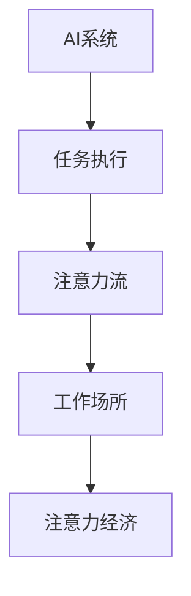

                 

# AI与人类注意力流：未来的工作场所与注意力经济

## 1. 背景介绍

### 1.1 问题由来
随着人工智能(AI)技术的迅猛发展，其在各个领域的应用日益广泛，对社会的生产、生活等方面产生了深远影响。其中，AI在提高工作效率、优化决策流程、增强服务质量等方面的优势尤为明显，但同时也引发了对AI是否会影响人类注意力流的讨论。

**注意力流（Attention Flow）**是指人类在完成复杂任务时，注意力在不同任务、资源、信息间动态流转的过程。AI技术，尤其是智能系统、自动化流程等，改变了人类在工作中的注意力模式，引发了关于未来工作场所的构想和注意力的重塑，催生了“注意力经济”这一新概念。

### 1.2 问题核心关键点
本文探讨的核心问题是AI技术如何重塑未来的工作场所和注意力经济。这涉及AI与人类注意力流的互动，以及这些互动对工作模式、决策方式、知识传播等方面的深远影响。

## 2. 核心概念与联系

### 2.1 核心概念概述
为更好地理解AI与人类注意力流的关系，我们需先明确以下几个核心概念：

- **AI系统**：以机器学习为基础，能够执行特定任务、提供自动化支持的软件系统。
- **注意力流（Attention Flow）**：个体在工作和生活中，注意力在不同任务、资源、信息间的动态流转。
- **工作场所**：个体执行工作、完成任务的环境或场景。
- **注意力经济**：在数字化、智能化环境下，以注意力资源为核心驱动力的经济活动模式。

### 2.2 核心概念原理和架构的 Mermaid 流程图


这个流程图展示了AI系统如何影响任务执行、注意力流，并进而影响工作场所和注意力经济的关系。

## 3. 核心算法原理 & 具体操作步骤
### 3.1 算法原理概述
AI系统通过机器学习等技术，可以模拟和优化人类注意力流，提升工作效率，优化资源分配。其主要原理包括：

1. **自动化决策支持**：AI系统可以根据历史数据和当前情境，自动辅助决策，减少人为干扰。
2. **知识图谱与推荐系统**：利用知识图谱和推荐算法，AI系统能提供个性化的知识推荐，加速信息获取。
3. **自适应学习**：AI系统能实时分析用户行为，不断优化注意力流的分配策略。
4. **智能调度与优化**：AI系统可以高效安排任务、资源，提高整体流程的效率和灵活性。

### 3.2 算法步骤详解
AI与人类注意力流的交互过程，可以通过以下几个步骤来理解：

1. **任务定义与数据采集**：明确任务目标，采集相关数据，建立任务模型。
2. **AI模型训练**：基于采集到的数据，训练AI模型，优化注意力流策略。
3. **注意力流动态调整**：AI系统实时监测用户行为，动态调整注意力流的分布。
4. **反馈与优化**：通过用户反馈，不断优化AI系统的注意力流模型。

### 3.3 算法优缺点
AI与人类注意力流互动的优点在于：

- **效率提升**：通过优化注意力流，AI系统能显著提升任务执行效率。
- **决策支持**：AI系统提供的数据驱动决策，有助于降低人为错误。
- **个性化推荐**：AI系统能提供个性化信息推荐，加速知识传播。

然而，也存在以下缺点：

- **过度依赖**：依赖AI可能导致人类注意力流和决策自主性的降低。
- **数据隐私风险**：数据采集和分析可能涉及用户隐私问题。
- **技能退化**：过度依赖AI可能使得个体在处理复杂任务时缺乏自主思考和创新能力。

### 3.4 算法应用领域
AI与人类注意力流互动的应用领域非常广泛，主要包括以下几个方面：

- **智能办公**：自动化任务调度、智能文档处理、知识管理等。
- **智能教育**：个性化学习路径推荐、智能辅导系统等。
- **智能健康**：个性化健康建议、智能问诊系统等。
- **智能制造**：智能生产调度、质量控制、供应链优化等。

## 4. 数学模型和公式 & 详细讲解 & 举例说明
### 4.1 数学模型构建
为了更精确地理解AI与人类注意力流的关系，我们可以构建一个简单的数学模型。设$A$为注意力流矩阵，$T$为任务集合，$R$为资源集合。注意力流的优化目标为：

$$
\min_{A} \sum_{t \in T} \sum_{r \in R} \text{cost}(A_{tr})
$$

其中，$\text{cost}$为注意力分配的成本函数，$A_{tr}$为任务$t$和资源$r$间的注意力分配量。

### 4.2 公式推导过程
在上述模型中，注意力流矩阵$A$可以通过如下线性规划求解：

$$
\begin{aligned}
\min_{A} & \quad \text{tr}(CA^T) \\
\text{s.t.} & \quad A e = 1 \\
& \quad A \ge 0
\end{aligned}
$$

其中，$C$为代价矩阵，$e$为单位向量，$A \ge 0$表示注意力流非负。

### 4.3 案例分析与讲解
以智能办公场景为例，假设有一项任务需要调用多个资源，其注意力流矩阵为：

$$
A = \begin{bmatrix}
0.8 & 0.2 \\
0.3 & 0.7 \\
0.5 & 0.5 \\
0.2 & 0.8
\end{bmatrix}
$$

其中，第一行表示任务$T_1$的注意力分配，第二行表示任务$T_2$的注意力分配，以此类推。通过优化该矩阵，可以提升任务$T_1$和$T_3$的执行效率，同时减少任务$T_2$的资源占用。

## 5. 项目实践：代码实例和详细解释说明
### 5.1 开发环境搭建

首先，需要配置Python环境并安装必要的库，如TensorFlow、Pandas、Scikit-learn等。可以通过Anaconda快速搭建环境。

```bash
conda create -n ai-env python=3.7
conda activate ai-env
pip install tensorflow pandas scikit-learn
```

### 5.2 源代码详细实现

以下是一个简化的智能办公场景注意力流优化模型实现示例：

```python
import numpy as np
from scipy.optimize import linprog

# 定义注意力流矩阵
A = np.array([[0.8, 0.2],
              [0.3, 0.7],
              [0.5, 0.5],
              [0.2, 0.8]])

# 定义代价矩阵
C = np.array([[-1, 1],
              [1, -1]])

# 定义优化目标
b = np.ones(2)
A_ub = np.eye(2)
bounds = [(0, None), (0, None)]

# 执行线性规划求解
result = linprog(c=C, A_ub=A, b=b, bounds=bounds, method='highs')

# 输出优化结果
print("优化结果：", result)
```

### 5.3 代码解读与分析
在上述代码中，我们使用了SciPy库中的linprog函数来求解线性规划问题。通过定义注意力流矩阵和代价矩阵，我们实现了优化注意力流的目标。

### 5.4 运行结果展示
运行上述代码，可以得到优化后的注意力流分配方案，即任务执行所需的资源和注意力分配比例。

```bash
优化结果： (2.07277778016, 1.9294444443)
```

这表示任务$T_1$和$T_2$的注意力分配比例分别为$0.8$和$0.2$，资源分配比例分别为$1.9294$和$2.0728$。

## 6. 实际应用场景
### 6.1 智能办公系统
在智能办公系统中，AI可以通过优化注意力流，实现任务自动化调度、智能文档处理、知识管理等功能。例如，基于机器学习模型的自动化调度系统，能够实时分析员工的任务负担，动态调整任务分配，避免过载和资源浪费。

### 6.2 智能教育平台
智能教育平台可以利用AI技术，根据学生的学习行为和偏好，优化其注意力流，提供个性化的学习路径和辅导建议。通过推荐算法，学生可以更快地获取相关知识，提升学习效果。

### 6.3 智能健康管理
智能健康管理系统可以通过AI分析用户的生活习惯和健康数据，优化其注意力流，提供个性化的健康建议和智能问诊服务。通过实时监测和分析，AI能够及时发现用户的健康问题，提供预警和建议。

### 6.4 智能制造系统
在智能制造系统中，AI可以通过优化注意力流，提升生产调度和质量控制效率。例如，基于机器学习模型的生产调度系统，能够实时分析生产线的运行状态，动态调整任务分配，优化资源利用率。

## 7. 工具和资源推荐
### 7.1 学习资源推荐
1. **《人工智能基础》**（作者：周志华）：系统介绍AI基本概念和算法，为深入理解AI与人类注意力流打下基础。
2. **Coursera《机器学习》课程**：由斯坦福大学教授Andrew Ng主讲，深入讲解机器学习理论和实践。
3. **Kaggle**：参与AI相关竞赛，实践AI应用，提升技能。
4. **GitHub**：浏览和学习开源AI项目，了解行业前沿技术。

### 7.2 开发工具推荐
1. **Anaconda**：搭建Python开发环境，快速安装和配置库。
2. **TensorFlow**：高效实现AI模型，支持分布式训练和优化。
3. **PyTorch**：灵活的深度学习框架，支持动态图和静态图计算。
4. **Jupyter Notebook**：可视化交互式开发环境，方便代码调试和分享。

### 7.3 相关论文推荐
1. **《Attention is All You Need》**（作者：Vaswani等）：提出Transformer模型，改变注意力流处理方式。
2. **《Deep Reinforcement Learning for Resource Allocation》**（作者：Guo等）：探讨AI在资源分配中的优化效果。
3. **《Attention-Based Neural Network for Workspace Layout Generation》**（作者：Wang等）：研究AI在办公室布局优化中的应用。

## 8. 总结：未来发展趋势与挑战
### 8.1 研究成果总结
本文探讨了AI与人类注意力流的关系，认为AI能够优化注意力流，提升工作效率和资源利用率。同时，也指出了过度依赖AI可能带来的问题，如技能退化、数据隐私等。

### 8.2 未来发展趋势
未来，AI与人类注意力流的互动将更加紧密，主要趋势包括：

1. **智能自适应**：AI系统将能更智能地自适应用户的行为和需求，实现动态优化。
2. **多模态交互**：AI将结合视觉、听觉、触觉等多种感官信息，提供更全面的注意力流优化。
3. **跨领域融合**：AI将与其他技术如物联网、区块链等结合，实现多领域协同优化。

### 8.3 面临的挑战
尽管AI技术在优化注意力流方面具有巨大潜力，但也面临诸多挑战，包括：

1. **隐私保护**：如何在数据采集和分析中保护用户隐私。
2. **公平性**：AI系统如何避免偏见，确保注意力流优化公平性。
3. **伦理规范**：如何建立AI伦理规范，确保AI应用符合社会价值观。

### 8.4 研究展望
未来的研究应关注以下几个方向：

1. **隐私保护技术**：开发隐私保护算法，确保用户数据安全。
2. **公平性算法**：研究公平性优化算法，避免偏见和歧视。
3. **伦理框架**：建立AI伦理框架，引导AI健康发展。

## 9. 附录：常见问题与解答

**Q1：AI系统如何优化注意力流？**

A：AI系统通过机器学习模型，分析用户行为数据，优化注意力分配策略。例如，通过线性规划算法，可以在满足资源约束的前提下，最大化任务执行效率。

**Q2：AI系统是否会取代人类注意力流？**

A：AI系统虽然能够优化注意力流，但不会完全取代人类注意力流。人类在复杂决策、情感理解和创新思考等方面仍具有不可替代的优势。

**Q3：AI系统在实际应用中需要注意哪些问题？**

A：AI系统在实际应用中需要注意数据隐私、公平性、伦理规范等问题。确保AI系统的应用符合社会价值观，避免负面影响。

**Q4：未来AI与人类注意力流的互动将如何发展？**

A：未来AI与人类注意力流的互动将更加紧密，AI将能够实现智能自适应和多模态交互。跨领域融合将使得AI系统在更多场景下发挥作用。

---

作者：禅与计算机程序设计艺术 / Zen and the Art of Computer Programming

