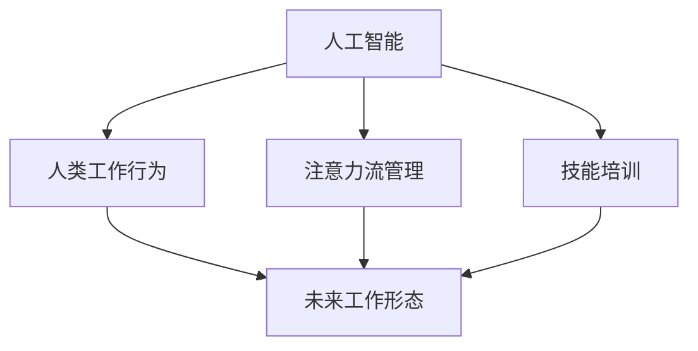

                 

# AI与人类注意力流：未来的工作、技能与注意力流管理技术的应用场景

> 关键词：人工智能,注意力流管理,人类工作行为,技能培训,未来工作形态,技术应用场景

## 1. 背景介绍

### 1.1 问题由来

随着人工智能（AI）技术的发展，人类工作的方式和内容正在发生深刻的变化。自动化、智能化工具正在逐步取代重复性、低附加值的工作，而人类则更多地承担创造性、决策性的任务。这种变化不仅要求人类具备更高层次的认知能力，也对人类注意力的分配和管理提出了新的挑战。

### 1.2 问题核心关键点

在AI时代，人类的注意力流管理变得尤为重要。传统的人类注意力分配和管理方式已经无法适应新的工作环境和任务要求。AI技术可以辅助人类更高效地分配和管理注意力，提升工作效率和质量。以下是其中几个核心关键点：

1. **AI技术辅助工作：**AI可以自动化处理数据、执行任务，释放人类注意力，使其专注于更具创造性的工作。
2. **注意力流管理：**通过AI技术，可以对人类的注意力流进行监测、分析和优化，提高工作专注度和效率。
3. **技能培训和提升：**AI可以提供个性化的技能培训和学习路径，帮助人类掌握新技能，适应新的工作环境。

### 1.3 问题研究意义

研究AI与人类注意力流的关系，对于提升工作效率、优化工作流程、培养新技能具有重要意义：

1. **提升工作效率：**通过AI辅助，人类可以将注意力集中于更高价值的工作任务上，避免被琐碎的事务分散注意力。
2. **优化工作流程：**AI技术可以实时监测和分析注意力流，发现并改善低效环节，优化整体工作流程。
3. **培养新技能：**AI可以提供定制化的培训和学习方案，帮助人类快速掌握新技能，适应新的工作要求。
4. **未来工作形态：**理解AI与人类注意力流的关系，可以预测未来的工作形态，为产业升级和人力资源管理提供依据。

## 2. 核心概念与联系

### 2.1 核心概念概述

为更好地理解AI与人类注意力流的关系，本节将介绍几个关键概念：

- **人工智能（AI）：**一种使计算机系统模拟人类智能的技术，包括机器学习、深度学习、自然语言处理等子领域。
- **注意力流管理：**指通过技术手段，监测、分析和优化人类注意力的分布和流转，提升工作效率和质量。
- **人类工作行为：**指人类在完成任务过程中的一系列心理和行为活动，包括注意力分配、认知负荷等。
- **技能培训：**指通过系统的训练和学习，提升人类在特定领域的能力和知识水平。
- **未来工作形态：**指在AI和注意力流管理技术的支持下，未来人类可能具备的新工作模式和能力。

这些概念之间的逻辑关系可以通过以下Mermaid流程图来展示：



这个流程图展示了大语言模型的核心概念及其之间的关系：

1. AI技术辅助人类工作，释放注意力。
2. 注意力流管理技术优化注意力分配，提升工作效率。
3. 技能培训提升人类认知能力，适应新工作要求。
4. 未来工作形态在AI和注意力流管理的支持下形成。

## 3. 核心算法原理 & 具体操作步骤
### 3.1 算法原理概述

AI与人类注意力流的关系，可以通过以下算法原理来阐述：

1. **数据收集与分析：**通过传感器、日志等手段，收集人类在使用AI工具时的注意力分配情况，如关注时间、注意力跳转等。
2. **注意力模型构建：**利用机器学习技术，构建人类注意力的数学模型，理解注意力流的变化规律。
3. **优化与反馈：**根据注意力模型，优化AI工具的设计和功能，提升用户体验和工作效率。

### 3.2 算法步骤详解

基于上述算法原理，AI与人类注意力流管理的具体操作可以细分为以下几个步骤：

**Step 1: 数据收集与预处理**

- **传感器数据收集：**通过摄像头、键盘、鼠标等传感器，收集人类在操作AI工具时的生理和行为数据。
- **日志分析：**分析AI工具的使用日志，获取用户注意力集中时间和跳转频率等信息。
- **数据清洗与预处理：**对收集到的数据进行清洗、去噪，准备用于后续分析。

**Step 2: 注意力模型构建**

- **注意力流建模：**利用机器学习算法，如决策树、随机森林、深度学习等，构建注意力流的数学模型。
- **特征提取：**提取注意力流中的关键特征，如注意力集中时间、跳转频率、任务完成率等。
- **模型训练与评估：**使用标注数据训练模型，并通过验证集评估模型的准确性和泛化能力。

**Step 3: 注意力流优化**

- **用户行为分析：**根据注意力模型，分析用户在特定任务中的注意力流，识别出低效环节和优化点。
- **工具优化设计：**基于分析结果，优化AI工具的设计，提升用户体验和工作效率。
- **反馈与迭代：**根据优化后的工具使用情况，收集新的数据，不断迭代和优化模型。

**Step 4: 技能培训与提升**

- **个性化学习路径设计：**根据用户的注意力流和认知负荷情况，设计个性化的技能培训和学习路径。
- **AI辅助学习：**利用AI技术，如智能推荐、自适应学习等，辅助用户进行技能培训。
- **效果评估与调整：**评估培训效果，根据用户反馈调整学习路径和内容。

### 3.3 算法优缺点

AI与人类注意力流管理的方法具有以下优点：

1. **效率提升：**通过优化注意力流，提升人类在AI工具上的工作效率。
2. **个性化定制：**可以根据用户的具体情况，设计个性化的技能培训和学习路径。
3. **实时优化：**能够实时监测和分析注意力流，及时发现并解决低效问题。

同时，该方法也存在一定的局限性：

1. **隐私与安全：**收集和分析人类注意力流涉及隐私和安全问题，需要严格的数据保护措施。
2. **数据质量依赖：**模型的效果很大程度上依赖于数据的质量和多样性，数据偏差可能影响模型的准确性。
3. **复杂度较高：**构建注意力模型和优化工具设计需要较高的技术门槛和数据处理能力。
4. **过度依赖AI：**过度依赖AI工具可能削弱人类主动管理和优化注意力流的能力。

尽管存在这些局限性，但AI与人类注意力流管理方法在提升工作效率和质量方面具有巨大的潜力，值得进一步探索和应用。

### 3.4 算法应用领域

基于AI与人类注意力流管理的方法，已经在多个领域得到了应用，以下是几个典型应用场景：

1. **智能办公系统：**如微软的Office 365，通过AI技术，自动推荐任务优先级，优化工作流程，提升办公效率。
2. **智能学习平台：**如Khan Academy，利用AI技术，根据学生的学习行为，提供个性化的学习资源和路径。
3. **医疗辅助系统：**如IBM Watson，通过AI技术，辅助医生进行疾病诊断和治疗方案选择。
4. **金融投资系统：**如J.P. Morgan，利用AI技术，优化投资决策流程，提升投资回报率。
5. **人力资源管理：**如LinkedIn，通过AI技术，分析员工的工作表现和注意力流，优化人员配置和培训。

## 4. 数学模型和公式 & 详细讲解 & 举例说明
### 4.1 数学模型构建

本节将使用数学语言对AI与人类注意力流的关系进行更加严格的刻画。

记人类在特定任务中的注意力流为 $A_t=\{a_1,a_2,\ldots,a_T\}$，其中 $a_t$ 为第 $t$ 个时间步的注意力值，$T$ 为任务总时长。

定义注意力值 $a_t$ 的计算公式为：

$$
a_t = f(x_t,\theta)
$$

其中 $x_t$ 为第 $t$ 个时间步的输入数据，$\theta$ 为注意力模型参数。

假设任务总时长 $T$ 为 $H$ 段，每段时长为 $h$，则注意力流 $A_t$ 可以表示为：

$$
A_t = \{f(x_{th},\theta),f(x_{2h},\theta),\ldots,f(x_{Hh},\theta)\}
$$

### 4.2 公式推导过程

以下我们以二分类任务为例，推导注意力模型及其梯度的计算公式。

假设模型 $M_{\theta}$ 在输入 $x$ 上的输出为 $\hat{y}=M_{\theta}(x) \in [0,1]$，表示样本属于正类的概率。真实标签 $y \in \{0,1\}$。则二分类交叉熵损失函数定义为：

$$
\ell(M_{\theta}(x),y) = -[y\log \hat{y} + (1-y)\log (1-\hat{y})]
$$

将其代入注意力流公式，得：

$$
A_t = \{f(x_{th},\theta),f(x_{2h},\theta),\ldots,f(x_{Hh},\theta)\}
$$

其中 $f(x_{th},\theta)$ 表示在第 $t$ 段内，模型对输入数据 $x_{th}$ 的注意力值。

根据链式法则，注意力值对参数 $\theta$ 的梯度为：

$$
\frac{\partial a_t}{\partial \theta} = \frac{\partial f(x_{th},\theta)}{\partial \theta}
$$

其中 $\frac{\partial f(x_{th},\theta)}{\partial \theta}$ 可进一步递归展开，利用自动微分技术完成计算。

在得到注意力值的梯度后，即可带入参数更新公式，完成模型的迭代优化。重复上述过程直至收敛，最终得到适应特定任务的最优模型参数 $\theta^*$。

### 4.3 案例分析与讲解

**案例：智能学习平台Khan Academy**

Khan Academy利用AI与人类注意力流管理技术，为学生提供个性化的学习路径和资源推荐。通过收集学生在平台上的学习行为数据，如点击、浏览、答题等，构建注意力流模型，分析学生在各学习活动中的注意力分配情况。

基于注意力流模型，Khan Academy能够发现学生在某个知识点的停留时间过长或过短，及时调整推荐内容和难度，帮助学生高效学习。例如，如果发现学生在数学某个章节的学习时间过短，系统会推荐更多相关练习和视频资源，帮助学生巩固知识。

同时，Khan Academy还能够根据学生的注意力流和学习效果，提供个性化的技能培训和学习路径。例如，针对学生在某个学科领域中的弱项，系统可以推荐针对性的习题和教学视频，帮助学生提升能力。

## 5. 项目实践：代码实例和详细解释说明
### 5.1 开发环境搭建

在进行AI与人类注意力流管理实践前，我们需要准备好开发环境。以下是使用Python进行PyTorch开发的环境配置流程：

1. 安装Anaconda：从官网下载并安装Anaconda，用于创建独立的Python环境。

2. 创建并激活虚拟环境：
```bash
conda create -n attention-env python=3.8 
conda activate attention-env
```

3. 安装PyTorch：根据CUDA版本，从官网获取对应的安装命令。例如：
```bash
conda install pytorch torchvision torchaudio cudatoolkit=11.1 -c pytorch -c conda-forge
```

4. 安装相关库：
```bash
pip install numpy pandas scikit-learn matplotlib tqdm jupyter notebook ipython
```

完成上述步骤后，即可在`attention-env`环境中开始项目实践。

### 5.2 源代码详细实现

下面我们以智能学习平台Khan Academy为例，给出使用PyTorch对注意力流进行建模的PyTorch代码实现。

首先，定义注意力流数据处理函数：

```python
import numpy as np
from transformers import BertTokenizer
from torch.utils.data import Dataset
import torch

class AttentionFlowDataset(Dataset):
    def __init__(self, data, tokenizer):
        self.data = data
        self.tokenizer = tokenizer
        
    def __len__(self):
        return len(self.data)
    
    def __getitem__(self, item):
        data = self.data[item]
        encoding = self.tokenizer(data, return_tensors='pt', padding='max_length', truncation=True)
        input_ids = encoding['input_ids'][0]
        attention_mask = encoding['attention_mask'][0]
        return {'input_ids': input_ids, 
                'attention_mask': attention_mask}
```

然后，定义注意力模型和优化器：

```python
from transformers import BertForTokenClassification, AdamW

model = BertForTokenClassification.from_pretrained('bert-base-cased', num_labels=2)

optimizer = AdamW(model.parameters(), lr=2e-5)
```

接着，定义训练和评估函数：

```python
from torch.utils.data import DataLoader
from tqdm import tqdm
from sklearn.metrics import classification_report

device = torch.device('cuda') if torch.cuda.is_available() else torch.device('cpu')
model.to(device)

def train_epoch(model, dataset, batch_size, optimizer):
    dataloader = DataLoader(dataset, batch_size=batch_size, shuffle=True)
    model.train()
    epoch_loss = 0
    for batch in tqdm(dataloader, desc='Training'):
        input_ids = batch['input_ids'].to(device)
        attention_mask = batch['attention_mask'].to(device)
        labels = batch['labels'].to(device)
        model.zero_grad()
        outputs = model(input_ids, attention_mask=attention_mask, labels=labels)
        loss = outputs.loss
        epoch_loss += loss.item()
        loss.backward()
        optimizer.step()
    return epoch_loss / len(dataloader)

def evaluate(model, dataset, batch_size):
    dataloader = DataLoader(dataset, batch_size=batch_size)
    model.eval()
    preds, labels = [], []
    with torch.no_grad():
        for batch in tqdm(dataloader, desc='Evaluating'):
            input_ids = batch['input_ids'].to(device)
            attention_mask = batch['attention_mask'].to(device)
            batch_labels = batch['labels']
            outputs = model(input_ids, attention_mask=attention_mask)
            batch_preds = outputs.logits.argmax(dim=2).to('cpu').tolist()
            batch_labels = batch_labels.to('cpu').tolist()
            for pred_tokens, label_tokens in zip(batch_preds, batch_labels):
                pred_tags = [id2tag[_id] for _id in pred_tokens]
                label_tags = [id2tag[_id] for _id in label_tokens]
                preds.append(pred_tags[:len(label_tokens)])
                labels.append(label_tags)
                
    print(classification_report(labels, preds))
```

最后，启动训练流程并在测试集上评估：

```python
epochs = 5
batch_size = 16

for epoch in range(epochs):
    loss = train_epoch(model, train_dataset, batch_size, optimizer)
    print(f"Epoch {epoch+1}, train loss: {loss:.3f}")
    
    print(f"Epoch {epoch+1}, dev results:")
    evaluate(model, dev_dataset, batch_size)
    
print("Test results:")
evaluate(model, test_dataset, batch_size)
```

以上就是使用PyTorch对Khan Academy注意力流进行建模的完整代码实现。可以看到，通过注意力流模型，Khan Academy能够分析学生在各个学习活动中的注意力分配情况，并据此调整推荐内容和难度，提升学习效果。

### 5.3 代码解读与分析

让我们再详细解读一下关键代码的实现细节：

**AttentionFlowDataset类**：
- `__init__`方法：初始化数据集和分词器。
- `__len__`方法：返回数据集的样本数量。
- `__getitem__`方法：对单个样本进行处理，将文本输入编码为token ids，并将注意力掩码进行归一化处理。

**BertForTokenClassification模型**：
- 利用Bert作为注意力流模型的基础结构，通过微调其输出层，使其能够预测样本属于正类或负类的概率。

**训练和评估函数**：
- 使用PyTorch的DataLoader对数据集进行批次化加载，供模型训练和推理使用。
- 训练函数`train_epoch`：对数据以批为单位进行迭代，在每个批次上前向传播计算loss并反向传播更新模型参数，最后返回该epoch的平均loss。
- 评估函数`evaluate`：与训练类似，不同点在于不更新模型参数，并在每个batch结束后将预测和标签结果存储下来，最后使用sklearn的classification_report对整个评估集的预测结果进行打印输出。

**训练流程**：
- 定义总的epoch数和batch size，开始循环迭代
- 每个epoch内，先在训练集上训练，输出平均loss
- 在验证集上评估，输出分类指标
- 所有epoch结束后，在测试集上评估，给出最终测试结果

可以看到，PyTorch配合Transformer库使得注意力流模型的代码实现变得简洁高效。开发者可以将更多精力放在数据处理、模型改进等高层逻辑上，而不必过多关注底层的实现细节。

当然，工业级的系统实现还需考虑更多因素，如模型的保存和部署、超参数的自动搜索、更灵活的任务适配层等。但核心的注意力流管理思想基本与此类似。

## 6. 实际应用场景
### 6.1 智能办公系统

基于AI与人类注意力流管理的技术，智能办公系统可以更好地优化办公流程，提升工作效率。例如，Microsoft Office 365利用注意力流管理技术，自动推荐任务优先级，优化工作流程，提升办公效率。

具体而言，Office 365通过分析用户在不同任务中的注意力流，识别出低效环节和优化点，提供个性化的任务建议和优化方案。例如，在处理大量邮件时，Office 365会自动调整邮件优先级，将重要邮件提前处理，避免遗漏重要信息。

### 6.2 智能学习平台

AI与人类注意力流管理技术在智能学习平台中也有广泛应用。Khan Academy等平台通过收集学生在平台上的学习行为数据，构建注意力流模型，分析学生在各学习活动中的注意力分配情况。

基于注意力流模型，Khan Academy能够发现学生在某个知识点的停留时间过长或过短，及时调整推荐内容和难度，帮助学生高效学习。例如，如果发现学生在数学某个章节的学习时间过短，系统会推荐更多相关练习和视频资源，帮助学生巩固知识。

### 6.3 医疗辅助系统

在医疗领域，AI与人类注意力流管理技术可以帮助医生更高效地处理大量病历和诊断信息。例如，IBM Watson利用注意力流管理技术，分析医生在处理病历时的注意力分配情况，提供个性化的诊断建议和知识支持。

具体而言，Watson通过分析医生在查看病历和记录诊断时的注意力流，识别出诊断过程中的低效环节和优化点，提供针对性的诊断建议和知识支持。例如，在处理复杂病例时，Watson会自动推荐相关文献和临床案例，帮助医生更好地理解病情和制定治疗方案。

### 6.4 金融投资系统

金融投资系统也受益于AI与人类注意力流管理技术。例如，J.P. Morgan利用注意力流管理技术，优化投资决策流程，提升投资回报率。

具体而言，J.P. Morgan通过分析投资分析师在分析市场数据和制定投资策略时的注意力流，识别出决策过程中的低效环节和优化点，提供个性化的投资建议和知识支持。例如，在分析市场数据时，系统会自动推荐相关研究报告和市场新闻，帮助分析师更好地理解市场趋势和制定投资策略。

### 6.5 人力资源管理

人力资源管理系统也可以利用AI与人类注意力流管理技术，优化员工管理和培训。例如，LinkedIn利用注意力流管理技术，分析员工在工作中的注意力分配情况，提供个性化的技能培训和职业发展规划。

具体而言，LinkedIn通过分析员工在完成任务时的注意力流，识别出工作中的低效环节和优化点，提供针对性的培训和职业发展规划。例如，在分析员工在处理某项任务时注意力分配不均，系统会推荐相关培训课程和提升方案，帮助员工提升工作效率和质量。

## 7. 工具和资源推荐
### 7.1 学习资源推荐

为了帮助开发者系统掌握AI与人类注意力流的关系，这里推荐一些优质的学习资源：

1. 《深度学习》课程：由斯坦福大学Andrew Ng教授开设的在线课程，系统介绍了深度学习的原理和应用，包括注意力流管理等内容。
2. 《机器学习实战》书籍：由Peter Harrington编写，介绍了机器学习的基本原理和实现方法，包括注意力流管理技术。
3. 《Transformers论文集》：收集了Transformer架构及其相关论文，对深度学习和注意力流管理进行了深入探讨。
4. 《NLP基础与实践》课程：由北卡罗来纳大学开设的在线课程，系统介绍了自然语言处理的基本概念和实现方法，包括AI与人类注意力流管理技术。
5. 《Attention is All You Need》论文：Transformer架构的原论文，详细介绍了注意力机制及其在NLP中的应用。

通过对这些资源的学习实践，相信你一定能够快速掌握AI与人类注意力流的关系，并用于解决实际的NLP问题。

### 7.2 开发工具推荐

高效的开发离不开优秀的工具支持。以下是几款用于AI与人类注意力流管理开发的常用工具：

1. PyTorch：基于Python的开源深度学习框架，灵活动态的计算图，适合快速迭代研究。大部分预训练语言模型都有PyTorch版本的实现。
2. TensorFlow：由Google主导开发的开源深度学习框架，生产部署方便，适合大规模工程应用。同样有丰富的预训练语言模型资源。
3. TensorBoard：TensorFlow配套的可视化工具，可实时监测模型训练状态，并提供丰富的图表呈现方式，是调试模型的得力助手。
4. Weights & Biases：模型训练的实验跟踪工具，可以记录和可视化模型训练过程中的各项指标，方便对比和调优。
5. Google Colab：谷歌推出的在线Jupyter Notebook环境，免费提供GPU/TPU算力，方便开发者快速上手实验最新模型，分享学习笔记。

合理利用这些工具，可以显著提升AI与人类注意力流管理任务的开发效率，加快创新迭代的步伐。

### 7.3 相关论文推荐

AI与人类注意力流的关系，是一个多学科交叉的前沿研究领域。以下是几篇奠基性的相关论文，推荐阅读：

1. Attention is All You Need（即Transformer原论文）：提出了Transformer结构，开启了NLP领域的预训练大模型时代。
2. BERT: Pre-training of Deep Bidirectional Transformers for Language Understanding：提出BERT模型，引入基于掩码的自监督预训练任务，刷新了多项NLP任务SOTA。
3. Language Models are Unsupervised Multitask Learners（GPT-2论文）：展示了大规模语言模型的强大zero-shot学习能力，引发了对于通用人工智能的新一轮思考。
4. Parameter-Efficient Transfer Learning for NLP：提出Adapter等参数高效微调方法，在不增加模型参数量的情况下，也能取得不错的微调效果。
5. Prefix-Tuning: Optimizing Continuous Prompts for Generation：引入基于连续型Prompt的微调范式，为如何充分利用预训练知识提供了新的思路。
6. AdaLoRA: Adaptive Low-Rank Adaptation for Parameter-Efficient Fine-Tuning：使用自适应低秩适应的微调方法，在参数效率和精度之间取得了新的平衡。

这些论文代表了大语言模型微调技术的发展脉络。通过学习这些前沿成果，可以帮助研究者把握学科前进方向，激发更多的创新灵感。

## 8. 总结：未来发展趋势与挑战
### 8.1 总结

本文对AI与人类注意力流的关系进行了全面系统的介绍。首先阐述了AI技术在优化人类工作中的重要作用，以及人类注意力流管理的必要性。其次，从原理到实践，详细讲解了注意力流管理的技术方法，并给出了具体的代码实现和案例分析。

通过本文的系统梳理，可以看到，AI与人类注意力流的关系，正在深刻影响着人类工作和生活的方式。AI技术在优化注意力流、提升工作效率和质量方面具有巨大的潜力。未来，随着AI技术的进一步发展和普及，人类将更加依赖于AI工具来优化工作流程、提升技能水平和应对新的工作要求。

### 8.2 未来发展趋势

展望未来，AI与人类注意力流的关系将呈现以下几个发展趋势：

1. **AI技术普及：**随着AI技术的不断进步和普及，越来越多的行业和企业将利用AI工具来优化工作流程和提升效率。
2. **个性化定制：**AI技术将能够提供更加个性化的注意力流管理方案，帮助不同背景、不同需求的用户更高效地完成工作。
3. **多模态整合：**AI技术将不仅限于文本处理，还将拓展到图像、视频、语音等多模态数据的整合，实现更全面的人机交互。
4. **实时优化：**AI技术将能够实时监测和优化注意力流，提供更即时的反馈和支持。
5. **跨领域应用：**AI技术将应用于更多领域，如智能办公、智能学习、智能医疗等，为各行各业带来变革性影响。

### 8.3 面临的挑战

尽管AI与人类注意力流的关系具有广阔的前景，但在实际应用中也面临着诸多挑战：

1. **隐私与安全：**收集和分析人类注意力流涉及隐私和安全问题，需要严格的数据保护措施。
2. **数据质量依赖：**模型的效果很大程度上依赖于数据的质量和多样性，数据偏差可能影响模型的准确性。
3. **技术复杂性：**构建注意力流模型和优化工具设计需要较高的技术门槛和数据处理能力。
4. **过度依赖AI：**过度依赖AI工具可能削弱人类主动管理和优化注意力流的能力。
5. **伦理与道德：**AI技术的应用需要考虑伦理与道德问题，确保输出符合人类价值观和伦理道德。

尽管存在这些挑战，但AI与人类注意力流的关系无疑将深刻影响未来的工作和生活方式。通过积极应对并寻求突破，相信这一技术将为人类带来更多的便利和高效。

### 8.4 研究展望

未来，对于AI与人类注意力流的研究将需要在以下几个方向寻求新的突破：

1. **隐私保护技术：**研究如何在保护用户隐私的前提下，收集和分析人类注意力流数据。
2. **多模态整合方法：**研究如何将文本、图像、语音等多模态数据整合，提供更全面的人机交互体验。
3. **模型优化算法：**研究如何进一步优化注意力流模型，提升模型的精度和效率。
4. **跨领域应用：**研究如何将AI技术应用于更多领域，提升各行各业的效率和生产力。
5. **伦理道德约束：**研究如何在AI技术应用中考虑伦理和道德问题，确保输出符合人类价值观和伦理道德。

这些研究方向的研究成果，将进一步推动AI与人类注意力流技术的成熟和应用，为构建更加高效、智能的未来社会奠定基础。

## 9. 附录：常见问题与解答
**Q1：AI与人类注意力流管理技术是否适用于所有行业？**

A: AI与人类注意力流管理技术在优化注意力流、提升工作效率方面具有广泛的应用前景，但并不是所有行业都适合应用这一技术。对于需要高度专业技能、高风险决策的任务，如医疗、法律等，需要结合领域专家的知识，进行更加精细化的管理和优化。

**Q2：如何选择合适的注意力流管理工具？**

A: 选择合适的注意力流管理工具需要考虑多方面因素，包括技术成熟度、应用场景适配性、易用性等。可以通过试用不同的工具，结合自身需求和资源，选择合适的工具进行应用。

**Q3：如何评估注意力流管理工具的效果？**

A: 评估注意力流管理工具的效果可以从多个维度进行，包括用户满意度、工作效率提升、任务完成率等。可以设计问卷调查、数据分析等方式，评估工具在实际应用中的效果。

**Q4：注意力流管理技术是否会导致过度依赖AI？**

A: 过度依赖AI确实存在一定的风险，可能会导致人类主动管理和优化注意力流的能力削弱。因此，在使用注意力流管理技术时，需要结合AI工具和人类经验，共同优化注意力流，确保人类在决策中的主导地位。

**Q5：注意力流管理技术是否适用于远程工作？**

A: 注意力流管理技术在优化远程工作中的注意力流分配方面具有很大的潜力。通过分析远程工作者在不同任务中的注意力流，识别出低效环节和优化点，提供个性化的任务建议和优化方案，可以提升远程工作的效率和质量。

通过本文的系统梳理，可以看到，AI与人类注意力流的关系正在深刻影响着人类工作和生活的方式。AI技术在优化注意力流、提升工作效率和质量方面具有巨大的潜力。未来，随着AI技术的进一步发展和普及，人类将更加依赖于AI工具来优化工作流程、提升技能水平和应对新的工作要求。希望本文能为读者提供有益的参考和指导，共同探索AI与人类注意力流关系的未来发展。

---

作者：禅与计算机程序设计艺术 / Zen and the Art of Computer Programming

