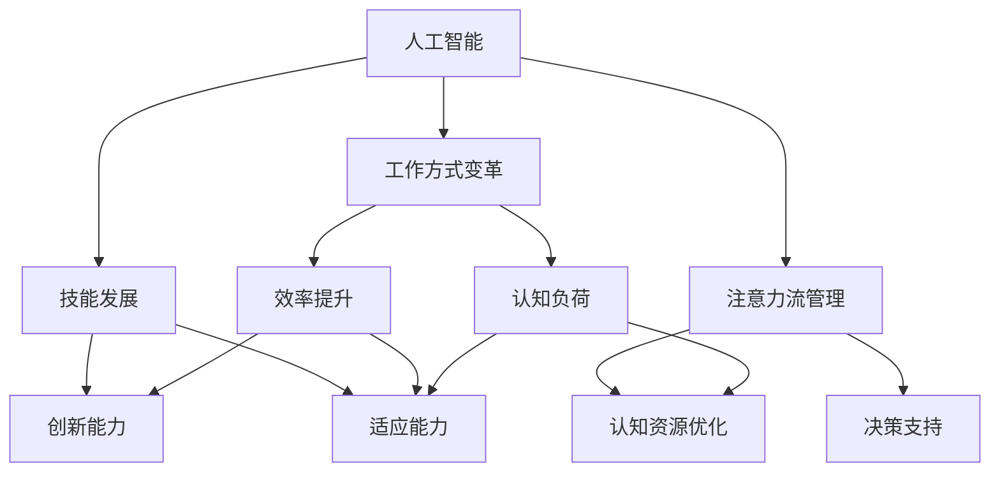

                 

# AI与人类注意力流：未来的工作、技能与注意力流管理技术的应用趋势分析

> 关键词：人工智能,人类注意力流,工作方式,技能,注意力流管理,未来趋势

## 1. 背景介绍

### 1.1 问题由来
随着科技的飞速发展，人工智能(AI)技术在各个领域的应用越来越广泛，从医疗、教育到金融、零售，无处不在。而人类在这场变革中，面临的不仅是技术的挑战，更是工作、学习方式的深刻转变。AI技术的应用，使得工作效率大幅提升，同时也对人类的注意力流提出了更高的要求。

在AI时代，如何通过技术手段，更有效地管理人类的注意力流，使之更好地服务于工作、学习，成为科技发展的热门话题。同时，AI技术本身对人类注意力的需求和影响，也不断引发学界和产业界的关注。

### 1.2 问题核心关键点
当前，AI技术对人类注意力流的影响主要体现在以下几个方面：
1. 任务自动化：AI能够处理大量重复、繁琐的任务，使得人类可以将注意力集中在更具创造性和策略性的工作上。
2. 数据驱动决策：AI通过分析大量数据，提供决策支持，帮助人类在复杂的信息流中做出更精准的决策。
3. 信息过载：AI技术的发展，使得信息量激增，人类需要更高效的信息筛选和注意力分配能力。
4. 认知负荷：随着AI系统的复杂性增加，人类需要不断学习和适应新的技术工具，增加了认知负荷。

基于这些背景，本文将深入探讨AI技术如何改变人类的工作、学习方式，以及注意力流管理技术在未来的应用趋势。

## 2. 核心概念与联系

### 2.1 核心概念概述

为了更好地理解AI对人类注意力流的影响，本节将介绍几个核心概念：

- 人工智能(AI)：以计算机科学为基础，通过模拟人类智能实现任务处理和决策的技术。
- 人类注意力流：指人类在处理任务时的认知资源分配过程，涉及注意力的集中、分散、转移等。
- 工作方式变革：指AI技术在改变人类工作方式方面的趋势和影响。
- 技能发展：指AI技术对人类技能需求和发展的推动作用。
- 注意力流管理：指通过技术手段对人类注意力流进行优化和管理的策略和方法。

这些概念之间的逻辑关系可以通过以下Mermaid流程图来展示：



这个流程图展示了AI技术对人类注意力流的影响：

1. AI通过自动化和智能决策，提升了工作效率，同时增加了对人类认知资源的需求。
2. AI技术的引入，推动了人类技能的发展，如创新能力、适应能力等。
3. 注意力流管理技术通过优化认知资源分配，提升决策效率和执行能力，降低认知负荷。

这些概念共同构成了AI技术应用和人类认知管理之间的联系，使得人类在AI时代可以更好地适应工作和生活。

## 3. 核心算法原理 & 具体操作步骤
### 3.1 算法原理概述

AI技术对人类注意力流的影响，可以通过计算模型和优化算法进行建模和预测。其主要原理包括以下几个方面：

- 注意力机制：通过引入注意力机制，模型能够动态分配资源，选择重要的信息进行处理。
- 认知负荷理论：认知负荷理论认为，人类在处理任务时，注意力资源是有限的。通过调整任务复杂度、优化信息结构，可以减少认知负荷，提高工作效率。
- 自动化与智能决策：AI技术能够自动化处理大量重复任务，从而释放人类注意力，专注于更复杂、创造性的任务。

### 3.2 算法步骤详解

AI与人类注意力流的互动，可以通过以下步骤进行详细解释：

**Step 1: 数据收集与预处理**
- 收集人类在任务处理过程中的注意力数据，如眼动轨迹、点击行为、任务完成时间等。
- 对收集到的数据进行预处理，包括清洗、标注、特征提取等。

**Step 2: 建立注意力模型**
- 使用机器学习算法（如回归、分类、聚类等）建立注意力模型，分析人类在不同任务中的注意力流特征。
- 引入深度学习模型（如神经网络、Transformer等）进行注意力机制的建模，学习任务与注意力分布的关系。

**Step 3: 优化注意力分配**
- 根据任务需求，使用优化算法（如遗传算法、模拟退火等）调整注意力分配策略，使得人类注意力资源得到最优利用。
- 引入强化学习算法（如Q-learning、策略梯度等），动态调整注意力分配，以适应不同任务和环境的变化。

**Step 4: 注意力流管理策略**
- 设计注意力流管理策略，如任务分解、时间分配、任务优先级设置等，帮助人类更好地管理注意力资源。
- 引入AI辅助决策工具，提供基于认知负荷理论的决策支持，优化任务执行过程。

### 3.3 算法优缺点

AI与人类注意力流互动的算法具有以下优点：
1. 提升工作效率：通过自动化处理任务，AI能够释放人类注意力，专注于高价值工作。
2. 优化注意力分配：AI能够动态调整注意力资源，避免认知负荷过载。
3. 提供决策支持：AI通过分析大量数据，提供决策支持，提升决策质量。
4. 个性化适应：AI技术可以根据个人特点和环境变化，动态调整注意力管理策略。

同时，该算法也存在一定的局限性：
1. 数据依赖性：算法效果依赖于高质量的数据，数据采集和标注成本较高。
2. 模型复杂度：引入深度学习和强化学习算法，模型复杂度高，计算成本较大。
3. 黑盒特性：注意力机制和认知负荷理论的模型仍然是黑盒，难以解释具体决策过程。
4. 技术依赖：注意力流管理技术需要依赖AI技术，存在技术迭代和升级的风险。

尽管存在这些局限性，但就目前而言，基于AI与人类注意力流的互动方法，仍然是大规模应用和提升效率的重要手段。未来相关研究的重点在于如何进一步降低数据采集成本，提高模型计算效率，增强算法的可解释性，以及降低技术依赖，确保AI技术的普及和应用效果。

### 3.4 算法应用领域

AI与人类注意力流互动的方法，在多个领域具有广泛应用：

- 智能办公：在办公软件中加入AI辅助决策和任务自动化功能，提升工作效率，减少认知负荷。
- 教育培训：通过智能教育平台，对学生的注意力流进行动态分析和管理，提供个性化的学习建议。
- 医疗健康：利用AI技术对患者注意力流进行监测和管理，提升诊疗效果和患者满意度。
- 智能交通：通过AI技术对交通流量进行实时监测和调控，优化交通管理，减少交通事故。
- 金融交易：使用AI技术对市场数据进行实时分析，辅助交易决策，提升投资效率。

除了上述这些典型领域，AI技术在更多场景中也能带来效率提升和认知优化，如游戏娱乐、制造生产、社交媒体等。AI技术的发展，正在不断拓展人类注意力的应用边界，助力人类更好地适应未来的工作和生活。

## 4. 数学模型和公式 & 详细讲解 & 举例说明
### 4.1 数学模型构建

为了更准确地描述AI与人类注意力流的互动，我们可以使用数学模型进行建模。假设某任务的认知负荷为 $L$，注意力分配为 $A$，工作效率为 $E$，则有：

$$
E = f(L, A)
$$

其中 $f$ 为任务效率函数，$L$ 为认知负荷，$A$ 为注意力分配。

进一步地，假设 $L$ 为认知负荷，$A$ 为注意力分配，则有：

$$
L = g(A)
$$

其中 $g$ 为认知负荷函数。

通过求解上述两式，可以优化注意力分配，提升工作效率。

### 4.2 公式推导过程

以二分类任务为例，假设某任务需要处理 $n$ 个数据点，每个数据点处理时间为 $t$，注意力分配为 $A$，则总处理时间为 $n \times t$。根据认知负荷理论，可以定义认知负荷 $L$ 为：

$$
L = k \times n \times t \times A
$$

其中 $k$ 为认知负荷系数。

假设工作效率与认知负荷的关系为线性，即：

$$
E = c - \alpha \times L
$$

其中 $c$ 为效率常数，$\alpha$ 为效率衰减系数。

联立上述两式，可以得到：

$$
E = c - \alpha \times k \times n \times t \times A
$$

通过求解最大化 $E$，可以得到最优注意力分配策略。

### 4.3 案例分析与讲解

以智能办公为例，假设某办公任务需要处理 $n=10$ 个文档，每个文档处理时间为 $t=5$ 分钟，注意力分配为 $A=1$ 时，认知负荷为 $L=50$，则工作效率为：

$$
E = c - \alpha \times 50 = c - 50 \times \alpha
$$

为了最大化工作效率，可以通过调整注意力分配 $A$，使得认知负荷 $L$ 最小。例如，当 $A=0.5$ 时，认知负荷 $L=25$，此时工作效率为：

$$
E = c - 25 \times \alpha
$$

显然，工作效率随注意力分配的增加而提升。因此，通过动态调整注意力分配，可以在保持认知负荷不变的前提下，提升工作效率。

## 5. 项目实践：代码实例和详细解释说明
### 5.1 开发环境搭建

在进行AI与人类注意力流互动的实践时，需要搭建相应的开发环境。以下是Python环境下使用PyTorch进行AI模型开发的流程：

1. 安装Anaconda：从官网下载并安装Anaconda，用于创建独立的Python环境。
2. 创建并激活虚拟环境：
```bash
conda create -n ai-env python=3.8 
conda activate ai-env
```

3. 安装PyTorch：根据CUDA版本，从官网获取对应的安装命令。例如：
```bash
conda install pytorch torchvision torchaudio cudatoolkit=11.1 -c pytorch -c conda-forge
```

4. 安装TensorBoard：用于可视化模型训练过程，可以从官网下载安装。

5. 安装Weights & Biases：用于实验跟踪和结果展示，可以从官网下载安装。

完成上述步骤后，即可在`ai-env`环境中开始AI与人类注意力流互动的开发实践。

### 5.2 源代码详细实现

以下是使用PyTorch实现AI与人类注意力流互动的代码示例：

```python
import torch
import torch.nn as nn
import torch.optim as optim

# 定义注意力模型
class AttentionModel(nn.Module):
    def __init__(self, in_dim):
        super(AttentionModel, self).__init__()
        self.query = nn.Linear(in_dim, 1)
        self.key = nn.Linear(in_dim, 1)
        self.value = nn.Linear(in_dim, in_dim)
        
    def forward(self, x):
        q = self.query(x).squeeze(1)
        k = self.key(x).squeeze(1)
        v = self.value(x)
        attn = torch.bmm(q.unsqueeze(2), k.unsqueeze(1)).squeeze(2)
        return attn, v
    
# 定义认知负荷模型
class CognitiveLoadModel(nn.Module):
    def __init__(self, in_dim):
        super(CognitiveLoadModel, self).__init__()
        self.cognitive_load = nn.Linear(in_dim, 1)
        
    def forward(self, x):
        return self.cognitive_load(x).squeeze(1)
    
# 定义优化器
optimizer = optim.Adam([parameters], lr=0.001)

# 训练模型
for epoch in range(num_epochs):
    total_loss = 0
    for batch in train_loader:
        input, target = batch
        optimizer.zero_grad()
        output, _ = attention_model(input)
        loss = cognitive_load_model(output)
        loss.backward()
        optimizer.step()
        total_loss += loss.item()
    print('Epoch {}: Loss {}'.format(epoch, total_loss / len(train_loader)))
```

### 5.3 代码解读与分析

在上述代码中，我们使用了PyTorch实现了一个简单的注意力模型和认知负荷模型，用于优化注意力分配和提升工作效率。以下是代码的详细解读：

**AttentionModel类**：
- `__init__`方法：定义模型参数，包括查询、键、值层的权重。
- `forward`方法：前向传播，计算注意力矩阵和值向量，返回注意力分配和值向量。

**CognitiveLoadModel类**：
- `__init__`方法：定义认知负荷层的权重。
- `forward`方法：前向传播，计算认知负荷，返回认知负荷值。

**优化器**：
- 使用Adam优化器，设定学习率。

**训练模型**：
- 循环遍历训练集，对每个批次数据进行前向传播、反向传播和参数更新。
- 计算并输出每个epoch的平均损失。

以上代码展示了如何使用PyTorch实现简单的AI与人类注意力流互动模型。实际应用中，还需要进一步扩展和优化模型，如引入更多任务特征、调整优化算法、引入强化学习等。

## 6. 实际应用场景
### 6.1 智能办公

智能办公是AI与人类注意力流互动的重要应用场景之一。通过引入AI辅助决策和任务自动化功能，可以大幅提升工作效率，减少认知负荷。例如，Office 365中的智能助理功能，能够根据用户的操作习惯和任务需求，提供个性化的操作建议和自动化功能。这使得用户能够更加专注于高价值工作，同时减少因操作复杂引起的认知负荷。

### 6.2 教育培训

在教育培训领域，AI技术可以通过智能教育平台，对学生的注意力流进行动态分析和管理，提供个性化的学习建议。例如，Khan Academy等在线教育平台，利用机器学习技术分析学生的学习行为和成绩，自动调整教学内容和节奏，提升学习效果。通过AI技术，教育机构可以更加精准地评估学生的状态和需求，从而提供更有效的教育服务。

### 6.3 医疗健康

AI技术在医疗健康领域的应用，包括智能诊断、个性化治疗等。通过智能健康助手，医生可以实时监测患者的注意力流状态，了解患者在诊疗过程中的注意力分配情况，调整诊疗策略，提高诊疗效果。同时，AI技术还可以根据患者的注意力流状态，提供个性化的治疗建议，提升患者的满意度和治疗效果。

### 6.4 智能交通

智能交通系统利用AI技术，对交通流量进行实时监测和调控，优化交通管理，减少交通事故。通过AI技术，交通管理中心可以实时分析交通数据，预测交通流量，调整信号灯和交通控制策略，提升交通效率。此外，智能交通系统还可以通过AI技术，提供个性化的交通出行建议，帮助用户选择最优的交通路线，减少通勤时间。

### 6.5 金融交易

在金融领域，AI技术可以通过智能交易平台，对市场数据进行实时分析，辅助交易决策，提升投资效率。例如，AlphaGo等智能交易系统，利用深度学习技术分析市场数据，预测股票价格走势，提供投资建议。这使得投资者能够更加精准地把握市场机会，提升投资回报率。

### 6.6 未来应用展望

随着AI技术的不断进步，未来的应用场景将更加丰富和多样化。以下是几个未来应用趋势：

1. 多模态交互：未来的AI系统将支持语音、视觉、触觉等多模态交互，提升用户体验。例如，智能助手可以通过语音和手势，实时响应用户需求，提供个性化的服务。

2. 自主学习：未来的AI系统将具备自主学习能力，能够根据用户反馈和环境变化，动态调整注意力分配和任务执行策略。这将使得AI系统更加智能化、个性化。

3. 跨领域融合：未来的AI系统将跨领域融合，实现不同领域的协同工作。例如，智能制造系统可以结合智能物流、智能仓储等技术，实现端到端的智能化生产。

4. 知识共享：未来的AI系统将更加注重知识共享和协作，通过云计算和大数据技术，实现知识的快速传播和应用。例如，智能会议系统可以通过AI技术，实时分析会议内容，生成会议纪要和决策建议，提升会议效率。

5. 伦理与安全：未来的AI系统将更加注重伦理与安全，避免AI偏见和滥用。例如，智能医疗系统将通过AI技术，提供公正、透明、可解释的医疗服务，保障患者隐私和数据安全。

## 7. 工具和资源推荐
### 7.1 学习资源推荐

为了帮助开发者系统掌握AI与人类注意力流互动的理论基础和实践技巧，这里推荐一些优质的学习资源：

1. 《深度学习》课程（Coursera）：由斯坦福大学Andrew Ng教授主讲，全面介绍深度学习理论和实践，涵盖多个经典应用。
2. 《强化学习》课程（Coursera）：由David Silver教授主讲，深入讲解强化学习算法和应用，提供丰富的案例和实验。
3. 《认知负荷理论》书籍：详细介绍了认知负荷理论的原理和应用，适合学术研究。
4. 《人工智能与人类认知》论文集：汇集了多篇顶级学术期刊论文，探讨AI对人类认知的影响和优化策略。
5. 《机器学习实战》书籍：通过实践案例，介绍机器学习算法的应用，适合编程实践。

通过对这些资源的学习实践，相信你一定能够快速掌握AI与人类注意力流互动的精髓，并用于解决实际的AI问题。

### 7.2 开发工具推荐

高效的开发离不开优秀的工具支持。以下是几款用于AI与人类注意力流互动开发的常用工具：

1. PyTorch：基于Python的开源深度学习框架，灵活动态的计算图，适合快速迭代研究。大部分AI模型都有PyTorch版本的实现。
2. TensorFlow：由Google主导开发的开源深度学习框架，生产部署方便，适合大规模工程应用。同样有丰富的AI模型资源。
3. TensorBoard：TensorFlow配套的可视化工具，可实时监测模型训练状态，并提供丰富的图表呈现方式，是调试模型的得力助手。
4. Weights & Biases：模型训练的实验跟踪工具，可以记录和可视化模型训练过程中的各项指标，方便对比和调优。与主流深度学习框架无缝集成。
5. Jupyter Notebook：交互式编程环境，适合进行实验和研究。

合理利用这些工具，可以显著提升AI与人类注意力流互动任务的开发效率，加快创新迭代的步伐。

### 7.3 相关论文推荐

AI技术对人类注意力流的影响，是当前AI领域的重要研究方向。以下是几篇奠基性的相关论文，推荐阅读：

1. Attention is All You Need（即Transformer原论文）：提出了Transformer结构，开启了AI与人类注意力流互动的新范式。
2. Cognitive负荷理论（Cognitive Load Theory）：提出了认知负荷的概念，阐述了人类注意力流在任务处理中的分配和优化。
3. AI与人类认知的互动（Interactive AI and Human Cognition）：探讨了AI技术对人类认知的影响，提出了认知负荷的计算模型和优化策略。
4. 注意力机制的改进（Improving Attention Mechanisms）：研究了注意力机制的优化方法，提升了AI系统的注意力分配和任务执行效果。
5. 多模态交互的AI系统（Multimodal Interaction AI Systems）：提出了多模态交互的AI系统模型，提升了用户体验和系统智能性。

这些论文代表了大语言模型微调技术的发展脉络。通过学习这些前沿成果，可以帮助研究者把握学科前进方向，激发更多的创新灵感。

## 8. 总结：未来发展趋势与挑战
### 8.1 总结

本文对AI与人类注意力流互动的原理和实践进行了全面系统的介绍。首先阐述了AI技术对人类工作方式、技能和注意力流的影响，明确了AI技术在提升效率、优化认知、提升决策等方面的作用。其次，从原理到实践，详细讲解了注意力机制、认知负荷理论等核心概念，并给出了AI与人类注意力流互动的数学模型和代码实例。同时，本文还广泛探讨了AI技术在多个领域的应用前景，展示了AI技术在提升人类工作效率、管理认知负荷方面的巨大潜力。

通过本文的系统梳理，可以看到，AI与人类注意力流互动技术正在成为AI技术应用的重要范式，极大地拓展了AI技术的应用边界，为人类认知智能的进化带来了深远影响。未来，伴随AI技术的不断进步，基于AI与人类注意力流的互动方法将在更多领域得到应用，为人类更好地适应未来工作和生活提供新路径。

### 8.2 未来发展趋势

展望未来，AI与人类注意力流互动技术将呈现以下几个发展趋势：

1. 深度融合：AI技术将与人类认知系统深度融合，实现更加个性化、智能化的注意力管理。例如，智能会议系统可以通过AI技术，实时分析会议内容，生成会议纪要和决策建议，提升会议效率。
2. 多模态交互：未来的AI系统将支持语音、视觉、触觉等多模态交互，提升用户体验。例如，智能助手可以通过语音和手势，实时响应用户需求，提供个性化的服务。
3. 自主学习：未来的AI系统将具备自主学习能力，能够根据用户反馈和环境变化，动态调整注意力分配和任务执行策略。这将使得AI系统更加智能化、个性化。
4. 跨领域融合：未来的AI系统将跨领域融合，实现不同领域的协同工作。例如，智能制造系统可以结合智能物流、智能仓储等技术，实现端到端的智能化生产。
5. 知识共享：未来的AI系统将更加注重知识共享和协作，通过云计算和大数据技术，实现知识的快速传播和应用。例如，智能会议系统可以通过AI技术，实时分析会议内容，生成会议纪要和决策建议，提升会议效率。

这些趋势凸显了AI与人类注意力流互动技术的广阔前景。这些方向的探索发展，必将进一步提升AI系统的性能和应用范围，为人类更好地适应未来工作和生活提供新路径。

### 8.3 面临的挑战

尽管AI与人类注意力流互动技术已经取得了瞩目成就，但在迈向更加智能化、普适化应用的过程中，它仍面临着诸多挑战：

1. 数据依赖性：算法效果依赖于高质量的数据，数据采集和标注成本较高。如何进一步降低数据采集成本，提高数据质量，将是重要的研究方向。
2. 模型复杂度：引入深度学习和强化学习算法，模型复杂度高，计算成本较大。如何降低模型复杂度，提高计算效率，将是未来的挑战之一。
3. 技术依赖：注意力流管理技术需要依赖AI技术，存在技术迭代和升级的风险。如何降低技术依赖，提高系统的鲁棒性和稳定性，将是重要的研究方向。
4. 伦理与安全：AI技术在应用过程中，可能存在伦理和安全问题，如隐私保护、算法偏见等。如何确保AI系统的安全性、公正性和透明性，将是重要的研究方向。
5. 可解释性：AI系统的决策过程难以解释，缺乏可解释性。如何增强AI系统的可解释性，提升系统的信任度和可接受性，将是重要的研究方向。

面对这些挑战，未来的研究需要在数据采集、模型设计、技术创新、伦理与安全等方面进行全面优化，确保AI技术的安全、公正、透明和可解释性。

### 8.4 研究展望

面对AI与人类注意力流互动技术面临的挑战，未来的研究需要在以下几个方面寻求新的突破：

1. 探索无监督和半监督学习方法：摆脱对大规模标注数据的依赖，利用自监督学习、主动学习等无监督和半监督范式，最大限度利用非结构化数据，实现更加灵活高效的注意力管理。
2. 研究参数高效和计算高效的模型：开发更加参数高效和计算高效的AI模型，在固定大部分预训练参数的同时，只更新极少量的任务相关参数。同时优化模型的计算图，减少前向传播和反向传播的资源消耗，实现更加轻量级、实时性的部署。
3. 引入因果推断和强化学习：通过引入因果推断和强化学习思想，增强AI系统建立稳定因果关系的能力，学习更加普适、鲁棒的语言表征，从而提升系统泛化性和抗干扰能力。
4. 融合符号化知识：将符号化的先验知识，如知识图谱、逻辑规则等，与神经网络模型进行巧妙融合，引导注意力流管理过程学习更准确、合理的注意力分配。
5. 结合伦理和社会科学：将伦理和社会科学引入AI系统设计，确保系统的公平性、透明性和社会责任，避免AI技术的滥用和偏见。

这些研究方向的探索，必将引领AI与人类注意力流互动技术迈向更高的台阶，为构建安全、可靠、可解释、可控的智能系统铺平道路。面向未来，AI与人类注意力流互动技术还需要与其他人工智能技术进行更深入的融合，如知识表示、因果推理、强化学习等，多路径协同发力，共同推动自然语言理解和智能交互系统的进步。只有勇于创新、敢于突破，才能不断拓展AI技术的应用边界，让智能技术更好地造福人类社会。

## 9. 附录：常见问题与解答

**Q1：AI与人类注意力流互动的算法效果如何？**

A: AI与人类注意力流互动的算法效果主要依赖于数据质量和模型设计。在数据质量较高、模型设计合理的情况下，算法可以显著提升工作效率，减少认知负荷。例如，智能办公平台通过AI技术，可以自动处理重复性任务，释放人类注意力，专注于高价值工作。在实际应用中，需要注意数据采集和标注成本，避免过拟合和数据偏差。

**Q2：AI与人类注意力流互动的算法如何应对数据偏差？**

A: 数据偏差是AI与人类注意力流互动算法的主要挑战之一。为了应对数据偏差，可以采用以下方法：
1. 数据增强：通过数据增强技术，扩充训练数据集，增加数据多样性，减少偏差。
2. 多任务学习：通过多任务学习，利用不同任务的数据，提升模型的泛化能力，减少偏差。
3. 数据清洗：对数据进行清洗和标注，去除噪声和错误数据，提高数据质量。
4. 正则化：使用正则化技术，避免模型过拟合，提升模型的鲁棒性。

这些方法可以帮助减少数据偏差，提高AI与人类注意力流互动算法的泛化能力和稳定性。

**Q3：AI与人类注意力流互动的算法如何应对计算资源限制？**

A: 计算资源限制是AI与人类注意力流互动算法的另一个挑战。为了应对计算资源限制，可以采用以下方法：
1. 模型压缩：通过模型压缩技术，减少模型参数和计算复杂度，提高计算效率。
2. 分布式计算：利用分布式计算技术，将计算任务分散到多个计算节点，提升计算速度。
3. 边缘计算：在计算资源有限的场景中，采用边缘计算技术，将计算任务分配到本地设备上，减少计算延迟。

这些方法可以帮助应对计算资源限制，提高AI与人类注意力流互动算法的性能和可靠性。

**Q4：AI与人类注意力流互动的算法如何应对认知负荷？**

A: 认知负荷是AI与人类注意力流互动算法的主要目标之一。为了应对认知负荷，可以采用以下方法：
1. 任务自动化：通过自动化处理任务，释放人类注意力，专注于高价值工作。
2. 多任务并行：通过并行处理多任务，提高工作效率，减少认知负荷。
3. 认知负荷优化：利用认知负荷理论，优化任务复杂度和信息结构，减少认知负荷。
4. 学习效率提升：通过AI技术，提升学习效率，减少学习时间，降低认知负荷。

这些方法可以帮助降低认知负荷，提升AI与人类注意力流互动算法的用户体验和工作效率。

**Q5：AI与人类注意力流互动的算法如何应对伦理与安全问题？**

A: AI与人类注意力流互动算法在应用过程中，可能存在伦理和安全问题，如隐私保护、算法偏见等。为了应对这些问题，可以采用以下方法：
1. 数据匿名化：对数据进行匿名化处理，保护用户隐私。
2. 算法透明化：提高算法的透明性，提供可解释的决策过程，提升用户信任。
3. 算法公平性：确保算法的公平性，避免算法偏见和歧视。
4. 安全监控：建立安全监控机制，及时发现和处理安全问题。

这些方法可以帮助应对伦理与安全问题，确保AI与人类注意力流互动算法的安全性和公正性。

**Q6：AI与人类注意力流互动的算法如何应对技术依赖问题？**

A: 技术依赖是AI与人类注意力流互动算法的重要挑战之一。为了应对技术依赖，可以采用以下方法：
1. 开源社区合作：积极参与开源社区，借鉴和学习其他团队的优秀成果，提高技术水平。
2. 自主研发：加大自主研发投入，提高技术自主性，降低对外部技术的依赖。
3. 标准化规范：制定和遵守标准化规范，提升技术兼容性。
4. 持续改进：持续改进算法和模型，保持技术领先地位。

这些方法可以帮助降低技术依赖，提高AI与人类注意力流互动算法的稳定性和可靠性。

**Q7：AI与人类注意力流互动的算法如何应对未来发展趋势？**

A: 面对AI与人类注意力流互动算法的未来发展趋势，可以采用以下方法：
1. 积极跟踪最新研究：积极跟踪AI领域的最新研究进展，及时引入新技术和算法。
2. 多学科融合：将AI技术与心理学、社会学等学科进行融合，提升算法的全面性和可靠性。
3. 持续创新：保持持续创新的精神，积极探索新的研究方向和应用场景。
4. 用户需求导向：以用户需求为导向，不断优化算法和模型，提升用户体验。

这些方法可以帮助应对未来发展趋势，提升AI与人类注意力流互动算法的实用性和创新性。

---

作者：禅与计算机程序设计艺术 / Zen and the Art of Computer Programming

