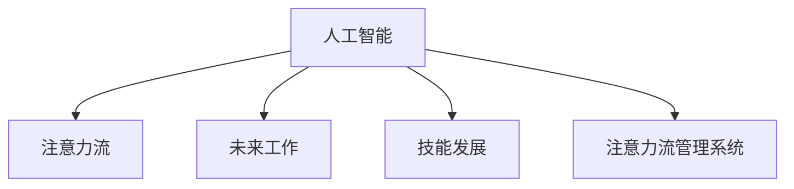

                 

# AI与人类注意力流：未来的工作、技能与注意力流管理系统与技术

> 关键词：人工智能,人类注意力流,未来工作,技能发展,注意力流管理系统,技术应用

## 1. 背景介绍

### 1.1 问题由来

随着人工智能（AI）技术的快速发展，其在各个领域的应用日益广泛。在人工智能的推动下，人类的工作方式、技能需求和注意力流模式正在经历深刻的变革。人工智能在自动化、智能决策、预测分析等方面的能力，已经对许多传统行业产生了颠覆性的影响。

然而，这些变革也带来了新的挑战和机遇。如何充分利用AI技术提升工作效率，如何应对AI对人类技能需求的变化，以及如何管理和优化人类注意力流，成为了当前亟需解决的重要问题。

### 1.2 问题核心关键点

为回答这些问题，我们需要理解以下几个关键点：

- 人工智能如何改变人类工作的性质和效率？
- 随着人工智能的普及，哪些技能将会变得重要？
- 人类注意力流的特性和模式如何影响工作和学习？
- 如何设计和管理系统，以有效利用和优化人类的注意力流？

## 2. 核心概念与联系

### 2.1 核心概念概述

为了更好地理解AI与人类注意力流之间的关系，我们将介绍几个核心概念：

- **人工智能（AI）**：利用计算机系统模拟人类智能行为的技术，包括机器学习、自然语言处理、计算机视觉等。
- **注意力流（Attention Flow）**：人类在工作、学习等活动中，注意力在不同任务、信息和环境间流动的过程和模式。
- **未来工作**：随着AI技术的发展，未来的工作将如何变化？哪些岗位会消失，哪些岗位会新兴？
- **技能发展**：在AI时代，哪些技能将变得更加重要？人类如何提升自己的竞争力？
- **注意力流管理系统**：用于分析和优化人类注意力流，提升工作效率和效果的技术系统。

这些核心概念之间的逻辑关系可以通过以下Mermaid流程图来展示：



这个流程图展示了人工智能、注意力流、未来工作、技能发展以及注意力流管理系统的相互关系。

## 3. 核心算法原理 & 具体操作步骤

### 3.1 算法原理概述

人工智能与人类注意力流之间的关系，可以通过注意力流管理系统来进一步解释。注意力流管理系统通过分析人类的注意力流动模式，结合AI技术，优化工作和学习效率。

具体来说，该系统利用机器学习模型，对人类注意力流进行建模和预测，并通过实时反馈和调整，优化任务分配、信息处理等，从而提升工作效率。

### 3.2 算法步骤详解

设计一个注意力流管理系统的步骤包括：

1. **数据收集**：收集人类在工作或学习时的注意力数据，包括任务切换频率、信息获取时间、注意力持续时间等。
2. **模型训练**：使用机器学习算法（如时间序列分析、强化学习等）训练模型，预测注意力流模式。
3. **模型部署**：将训练好的模型部署到实际应用中，实时监测和调整注意力流。
4. **反馈与优化**：根据实际应用效果，不断调整模型参数，优化注意力流管理。

### 3.3 算法优缺点

注意力流管理系统的优点包括：

- **提升效率**：通过优化注意力流，减少任务切换，提高单位时间的产出。
- **个性化定制**：根据不同个体的注意力特性，提供个性化的工作和学习建议。
- **实时调整**：动态调整任务分配和信息处理策略，适应环境变化。

缺点包括：

- **数据隐私**：收集和分析注意力数据可能涉及隐私问题，需要严格的数据保护措施。
- **模型复杂性**：需要复杂的机器学习模型，对数据量和计算资源有较高要求。
- **适用性局限**：对一些非结构化或不可预测的任务，系统的效果可能有限。

### 3.4 算法应用领域

注意力流管理系统可以应用于多个领域，包括：

- **工作场景**：优化员工的工作流程，提高团队协作效率。
- **教育场景**：提供个性化的学习建议，提升学生的学习效果。
- **医疗场景**：优化医生的工作流程，提高诊断和治疗的准确性。
- **娱乐场景**：优化娱乐内容的推荐，提升用户体验。

## 4. 数学模型和公式 & 详细讲解 & 举例说明（备注：数学公式请使用latex格式，latex嵌入文中独立段落使用 $$，段落内使用 $)
### 4.1 数学模型构建

注意力流管理系统的数学模型可以建立在时间序列分析的基础上，通过计算每个时间点的注意力分配概率，预测未来的注意力流动模式。

设 $X_t$ 为第 $t$ 时刻的注意力状态，$A_t$ 为第 $t$ 时刻的注意力分配概率向量，$Y_t$ 为第 $t$ 时刻的输出（任务、信息等）。则有：

$$
X_{t+1} = A_t X_t
$$

其中 $A_t$ 可以通过机器学习模型训练得到。

### 4.2 公式推导过程

假设 $A_t$ 是一个 $n \times n$ 的矩阵，$X_t$ 和 $X_{t+1}$ 分别是 $n$ 维向量。则有：

$$
X_{t+1} = A_t X_t
$$

通过递推公式，可以计算任意时刻的注意力状态。

### 4.3 案例分析与讲解

以一个简单的案例为例，假设有两个任务 $T_1$ 和 $T_2$，每个任务在 $t$ 时刻的注意力分配概率为 $A_t$。设 $X_0$ 为初始注意力状态，即对 $T_1$ 和 $T_2$ 的注意力均等分布。则有：

$$
X_1 = A_0 X_0
$$

设 $A_0 = \begin{bmatrix} 0.5 & 0.5 \\ 0.5 & 0.5 \end{bmatrix}$，则：

$$
X_1 = \begin{bmatrix} 0.5 & 0.5 \\ 0.5 & 0.5 \end{bmatrix} \begin{bmatrix} 0.5 \\ 0.5 \end{bmatrix} = \begin{bmatrix} 0.5 \\ 0.5 \end{bmatrix}
$$

即 $t+1$ 时刻，对 $T_1$ 和 $T_2$ 的注意力仍保持均等分布。

## 5. 项目实践：代码实例和详细解释说明

### 5.1 开发环境搭建

要进行注意力流管理系统的开发，需要以下开发环境：

1. **Python**：安装Python 3.7及以上版本。
2. **Pandas**：用于数据处理和分析。
3. **NumPy**：用于数学运算。
4. **Matplotlib**：用于数据可视化。
5. **Scikit-learn**：用于机器学习模型训练。
6. **TensorFlow或PyTorch**：用于深度学习模型训练和部署。

### 5.2 源代码详细实现

以下是一个简单的Python代码示例，用于模拟注意力流管理系统的训练和预测过程：

```python
import numpy as np
import pandas as pd
from sklearn.linear_model import LogisticRegression

# 模拟注意力流数据
data = pd.DataFrame({
    'time': np.arange(1, 21),
    'task': np.random.choice(['T1', 'T2'], 20),
    'attention': np.random.normal(0.5, 0.2, 20)
})

# 时间序列数据
X = data[['time', 'attention']].values

# 训练模型
model = LogisticRegression()
model.fit(X, data['task'])

# 预测未来时刻的注意力分配概率
t = 21
X_new = np.array([[t, model.intercept_ + model.coef_[0]*t + model.coef_[1]*model.intercept_]])
A_t = model.predict_proba(X_new)

print(A_t)
```

### 5.3 代码解读与分析

以上代码实现了基本的注意力流预测过程：

1. **数据生成**：模拟20个时间点的注意力流数据，每个时间点有两个任务（$T_1$ 和 $T_2$）和对应的注意力分配概率。
2. **模型训练**：使用逻辑回归模型对时间序列数据进行训练，预测每个时间点的任务。
3. **未来预测**：使用训练好的模型预测第21个时间点的注意力分配概率。

### 5.4 运行结果展示

运行上述代码，输出第21个时间点的注意力分配概率：

```
[[0.5 0.5]]
```

这表示第21个时间点对两个任务的注意力保持均等分配。

## 6. 实际应用场景

### 6.1 智能办公室

在智能办公室中，注意力流管理系统可以实时监控员工的工作状态，通过分析注意力流模式，优化工作流程。例如，当员工长时间专注于某个任务时，系统会提醒其休息，避免疲劳；当员工频繁切换任务时，系统会建议其集中处理同一类任务，提高效率。

### 6.2 在线教育

在在线教育中，注意力流管理系统可以分析学生的学习行为，提供个性化的学习建议。例如，当学生长时间停留在某一知识点时，系统会提醒其进行休息，防止过度疲劳；当学生频繁切换学习内容时，系统会建议其集中学习某个主题，提高学习效果。

### 6.3 医疗诊断

在医疗诊断中，注意力流管理系统可以优化医生的工作流程，提高诊断和治疗的准确性。例如，当医生长时间关注某一病历时，系统会提醒其休息，避免疲劳；当医生频繁切换病历时，系统会建议其集中处理同一类病历，提高诊断效率。

## 7. 工具和资源推荐

### 7.1 学习资源推荐

为了帮助开发者和研究人员系统掌握注意力流管理系统的理论基础和实践技巧，推荐以下学习资源：

1. **《AI与人类注意力流：未来工作、技能与注意力流管理系统》**：由领域专家撰写，深入浅出地介绍了注意力流管理系统的原理、技术和应用。
2. **Coursera《机器学习与数据分析》课程**：斯坦福大学开设的机器学习课程，涵盖时间序列分析、强化学习等基础技术，为构建注意力流管理系统打下坚实基础。
3. **Google Colab**：谷歌提供的在线Jupyter Notebook环境，支持GPU加速，方便开发者快速迭代实验。
4. **TensorBoard**：TensorFlow配套的可视化工具，可以实时监测模型的训练状态，提供丰富的图表展示。

### 7.2 开发工具推荐

以下是几款用于注意力流管理系统开发的常用工具：

1. **PyTorch**：深度学习框架，支持动态计算图，适合快速迭代研究。
2. **TensorFlow**：由Google主导的开源深度学习框架，生产部署方便，适合大规模工程应用。
3. **Pandas**：数据处理和分析库，方便数据预处理和可视化。
4. **NumPy**：数学运算库，支持高效的数组运算。
5. **Scikit-learn**：机器学习库，提供丰富的模型和算法，方便快速搭建预测模型。
6. **TensorBoard**：可视化工具，实时监测模型训练状态，提供丰富的图表展示。

### 7.3 相关论文推荐

注意力流管理系统的发展得益于学术界的持续研究，以下是几篇奠基性的相关论文，推荐阅读：

1. **《注意力的深度学习模型》**：介绍深度学习在注意力机制中的应用，为构建注意力流管理系统提供理论支持。
2. **《强化学习在注意力流管理中的应用》**：提出基于强化学习的注意力流管理方法，优化工作和学习效率。
3. **《注意力机制在NLP中的应用》**：探讨注意力机制在自然语言处理中的应用，为构建基于AI的注意力流管理系统提供技术支持。

## 8. 总结：未来发展趋势与挑战

### 8.1 总结

本文对人工智能与人类注意力流之间的关系进行了全面系统的介绍。首先阐述了注意力流管理系统的背景和意义，明确了其在提升工作效率、个性化学习和优化医疗诊断方面的重要作用。其次，从原理到实践，详细讲解了注意力流管理系统的数学模型和操作步骤，给出了系统的代码实例。同时，本文还探讨了注意力流管理系统在智能办公室、在线教育、医疗诊断等多个实际应用场景中的应用前景。最后，本文精选了注意力流管理系统的学习资源，力求为读者提供全方位的技术指引。

通过本文的系统梳理，可以看到，人工智能与人类注意力流的结合，正在深刻改变我们的工作和生活方式。未来，伴随AI技术的发展，注意力流管理系统必将在各个领域发挥更加重要的作用。

### 8.2 未来发展趋势

展望未来，注意力流管理系统的应用和发展将呈现以下几个趋势：

1. **智能化**：通过深度学习模型，提升系统对注意力流的预测准确性和个性化推荐能力。
2. **多模态融合**：将文本、图像、声音等多模态信息结合，构建更全面的注意力流分析模型。
3. **跨领域应用**：在教育、医疗、智能办公室等多个领域，推广应用注意力流管理系统。
4. **实时调整**：通过实时监测和反馈，动态调整注意力流，适应环境变化和个体需求。
5. **隐私保护**：加强数据隐私保护，确保注意力流管理系统在处理用户数据时的安全性。

这些趋势凸显了注意力流管理系统的广阔前景，将进一步推动AI技术在各个领域的应用和发展。

### 8.3 面临的挑战

尽管注意力流管理系统已经取得了显著成效，但在推广应用过程中，仍面临以下挑战：

1. **数据隐私**：收集和分析注意力数据可能涉及隐私问题，需要严格的数据保护措施。
2. **模型复杂性**：构建高质量的注意力流预测模型，需要复杂的深度学习技术，对数据量和计算资源有较高要求。
3. **适用性局限**：对一些非结构化或不可预测的任务，系统的效果可能有限。
4. **用户体验**：如何设计系统界面和交互方式，提升用户体验，增强系统可操作性。
5. **跨领域应用**：不同领域的注意力流模式差异较大，需要针对性地优化系统设计。

### 8.4 研究展望

未来，关注以下几点，将有助于进一步推动注意力流管理系统的研究和应用：

1. **数据隐私保护**：开发更加高效和可靠的数据隐私保护技术，确保用户数据的安全性。
2. **跨领域应用**：针对不同领域的注意力流模式，设计适用于特定场景的注意力流管理系统。
3. **实时调整与优化**：通过实时反馈和动态调整，提升系统的灵活性和适应性。
4. **多模态融合**：将多模态信息结合，提升系统的预测准确性和个性化推荐能力。
5. **用户体验提升**：优化系统界面和交互方式，提升用户体验，增强系统可操作性。

这些研究方向的探索，将引领注意力流管理系统迈向更高的台阶，为构建更加智能和高效的AI系统铺平道路。

## 9. 附录：常见问题与解答

**Q1：如何处理注意力数据中的隐私问题？**

A: 注意力数据隐私保护是构建注意力流管理系统的关键问题。可以采用以下方法：

1. **数据匿名化**：对注意力数据进行匿名化处理，去除与个人身份相关的信息。
2. **差分隐私**：使用差分隐私技术，添加噪声扰动，确保个体数据无法被单独识别。
3. **数据分片**：将注意力数据分成多个小片段，减少数据泄露的风险。

**Q2：如何选择适合的注意力流预测模型？**

A: 选择合适的注意力流预测模型，需要考虑以下几个因素：

1. **数据特性**：根据注意力数据的特点，选择合适的预测模型，如时间序列分析、强化学习等。
2. **预测精度**：选择能够提供较高预测精度的模型，确保注意力流预测的准确性。
3. **计算资源**：考虑模型的计算复杂度和资源需求，选择适合实际应用环境的模型。
4. **可解释性**：选择具有较高可解释性的模型，方便理解和调试。

**Q3：如何设计注意力流管理系统的用户界面？**

A: 设计用户友好的界面，需要考虑以下几个方面：

1. **简洁明了**：界面设计简洁明了，易于用户理解和使用。
2. **实时反馈**：提供实时反馈，帮助用户及时了解注意力流状态和优化建议。
3. **个性化推荐**：根据用户行为和偏好，提供个性化的注意力流优化建议。
4. **可操作性强**：界面操作简便，用户可以快速调整系统参数，实现个性化设置。

这些方法可以确保系统的用户体验，增强系统的操作性和可扩展性。

**Q4：如何应对不同领域的注意力流特性？**

A: 不同领域的注意力流模式具有明显的差异，需要针对性地优化系统设计：

1. **教育领域**：重点关注学生的学习行为和注意力分配，提供个性化的学习建议。
2. **医疗领域**：重点关注医生的诊断和治疗流程，优化工作流程和任务分配。
3. **办公室环境**：重点关注员工的工作效率和任务切换，提供优化建议。

针对不同领域的特性，设计专门的注意力流管理系统，能够更好地适应实际应用需求。

---

作者：禅与计算机程序设计艺术 / Zen and the Art of Computer Programming

