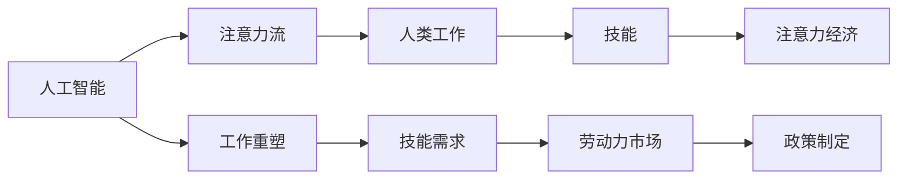

                 

## 1. 背景介绍

### 1.1 问题由来
在人类文明发展的历史长河中，技术的进步一直是推动社会前行的关键力量。从机械化、电气化到信息化、智能化，每一次技术的革新都伴随着生产方式的变革，重塑了劳动力的构成和生产关系。在新的历史节点，人工智能（AI）正引领一场前所未有的技术革命。然而，伴随着技术发展的双刃剑，AI同样引发了关于劳动力就业、技能需求、经济结构等一系列问题的广泛讨论。

### 1.2 问题核心关键点
1. **劳动力市场变化**：AI的普及可能导致部分传统工作岗位的消失，同时也可能催生新的工作岗位。
2. **技能需求变化**：AI技术要求劳动者具备更高的分析能力、决策能力和创新能力。
3. **注意力经济**：AI时代的注意力成为新的资源，需要管理和创新。
4. **AI与人类共存**：如何在确保AI技术高效应用的同时，避免人类被边缘化。
5. **未来工作形态**：工作、技能与AI的深度融合将如何重塑未来劳动市场。

### 1.3 问题研究意义
理解AI技术如何影响人类劳动力市场、技能需求和经济结构，是未来社会发展的关键。这对于政策制定者、企业家和劳动者都具有重要的参考价值：
- **政策制定**：为制定合理的劳动政策、就业培训计划提供依据。
- **企业战略**：帮助企业识别人才需求变化，制定相应的招聘、培训和激励策略。
- **劳动者适应**：指导劳动者提升自身技能，适应新的工作环境。

## 2. 核心概念与联系

### 2.1 核心概念概述
在探讨AI与人类注意力流的未来，我们需要理解以下几个核心概念：

- **人工智能（AI）**：通过算法、数据和计算，使计算机具备类似于人类智能的感知、推理、决策和学习能力。
- **注意力流（Attention Flow）**：在信息处理过程中，人类（或机器）如何分配和调整其注意力的过程。
- **人类工作（Human Work）**：人类从事各种生产活动的总和，包括体力劳动和脑力劳动。
- **技能（Skill）**：人类在特定领域具备的知识、经验和能力，是适应特定工作的必备条件。
- **注意力经济（Economy of Attention）**：在信息过载的时代，注意力成为一种稀缺资源，需要通过有效的管理和创新来获取经济价值。

### 2.2 核心概念原理和架构的 Mermaid 流程图



这个流程图展示了AI、注意力流、人类工作、技能和注意力经济之间的联系：
- AI通过重塑工作流程，影响技能需求。
- 注意力流作为信息处理的核心，直接影响工作效率和创新。
- 人类工作随着AI的应用，发生了深刻变化。
- 技能需求的变化进一步影响了劳动力市场。
- 政策制定者需要基于这些变化，进行调整和创新。

## 3. 核心算法原理 & 具体操作步骤

### 3.1 算法原理概述
AI与人类注意力流的融合，可以通过以下步骤进行理解：

1. **注意力模型**：构建能够模仿人类注意力分配机制的AI模型，提升信息处理效率和决策能力。
2. **工作重塑**：利用AI技术，对传统工作流程进行自动化、智能化改造，提升生产效率。
3. **技能匹配**：根据AI技术对技能的需求，进行针对性的人才培训和职业规划。
4. **注意力管理**：通过技术手段，优化信息处理过程中的注意力分配，提高工作质量和效率。

### 3.2 算法步骤详解
1. **注意力模型的构建**：
   - 选择合适的注意力机制，如Transformer中的多头注意力机制。
   - 设计注意力头的数量和位置，根据任务复杂度进行调整。
   - 通过大量标注数据训练模型，优化注意力分配策略。

2. **工作重塑**：
   - 分析工作流程中的重复性、可自动化部分。
   - 开发智能工具，如机器人、自动化软件，替代人工执行。
   - 对工作流程进行重新设计，引入AI辅助决策，提升效率。

3. **技能匹配**：
   - 收集AI技术对技能的需求，如编程、数据分析、问题解决能力。
   - 设计针对性的培训计划，提升劳动者的技能水平。
   - 建立职业规划系统，指导劳动者进行持续学习和职业发展。

4. **注意力管理**：
   - 设计信息筛选和优先级排序算法，提高信息处理效率。
   - 引入决策支持系统，辅助人工进行复杂决策。
   - 优化工作流程中的注意力分配，减少信息过载。

### 3.3 算法优缺点
**优点**：
- **提高效率**：通过AI和注意力流管理，显著提升信息处理和决策效率。
- **创新驱动**：AI技术促进了工作流程和技能需求的创新，推动了生产力提升。
- **适应性强**：能够快速适应新任务和新环境，提高灵活性。

**缺点**：
- **技术依赖**：对AI技术的依赖可能导致技术故障或误判。
- **隐私风险**：AI系统可能收集和分析大量个人数据，带来隐私风险。
- **就业挑战**：部分工作岗位的消失可能导致劳动者失业，需要转型。

### 3.4 算法应用领域
1. **制造业**：自动化生产线、机器人作业，提升生产效率。
2. **金融业**：智能投顾、风险评估，提高决策准确性。
3. **医疗健康**：智能诊断、个性化治疗，提升医疗服务质量。
4. **教育**：智能辅导、学习推荐，提升教育效果。
5. **零售**：个性化推荐、库存管理，优化客户体验。
6. **政府管理**：智能分析、政策制定，提升政府效能。

## 4. 数学模型和公式 & 详细讲解 & 举例说明

### 4.1 数学模型构建
我们以机器翻译任务为例，构建基于注意力机制的神经网络模型：

1. **输入层**：将源语言文本转换为向量表示。
2. **编码器**：通过多层Transformer层，将源语言向量转换为编码表示。
3. **注意力层**：计算源语言和目标语言之间的注意力权重，引导模型关注关键信息。
4. **解码器**：根据注意力权重和编码器输出，逐步生成目标语言文本。
5. **输出层**：将生成的文本向量转换为目标语言文本。

### 4.2 公式推导过程
注意力机制的核心公式如下：
$$
\text{Attention}(Q,K,V) = \text{softmax}(\frac{QK^T}{\sqrt{d_k}})V
$$
其中，$Q$、$K$、$V$分别为查询向量、键向量和值向量，$d_k$为键向量的维度。

在机器翻译任务中，注意力模型通过计算源语言和目标语言之间的注意力权重，逐步生成目标语言文本。公式推导过程如下：
1. 源语言文本转换为向量表示：
   $$
   X_s = \text{Embedding}(x_s)
   $$
2. 编码器层计算编码表示：
   $$
   H_s = \text{Encoder}(X_s)
   $$
3. 解码器层逐步生成目标语言文本：
   $$
   H_t = \text{Decoder}(X_t, H_s)
   $$
4. 输出层将文本向量转换为目标语言文本：
   $$
   y_t = \text{OutputLayer}(H_t)
   $$

### 4.3 案例分析与讲解
以Google Translate为例，其机器翻译系统就是基于Transformer和注意力机制构建的。系统首先通过编码器将源语言文本转换为编码表示，然后解码器根据注意力权重逐步生成目标语言文本。该系统的翻译效果在多个数据集上取得了SOTA结果，展示了注意力机制在翻译任务中的有效性。

## 5. 项目实践：代码实例和详细解释说明

### 5.1 开发环境搭建
构建基于注意力机制的机器翻译系统，需要以下环境配置：
1. Python 3.8+
2. PyTorch 1.9.0
3. Transformers 4.7.0
4. GPU 环境（NVIDIA Tesla系列或 RTX系列）

### 5.2 源代码详细实现

```python
import torch
from transformers import TransformerModel, AutoTokenizer

# 定义模型
class TransformerTranslator:
    def __init__(self, model_name):
        self.model = TransformerModel.from_pretrained(model_name)
        self.tokenizer = AutoTokenizer.from_pretrained(model_name)
        
    def translate(self, source_text, target_text):
        # 预处理输入
        source_tokens = self.tokenizer(source_text, return_tensors='pt', padding=True)
        target_tokens = self.tokenizer(target_text, return_tensors='pt', padding=True)
        
        # 计算注意力权重和生成目标文本
        output = self.model.generate(source_tokens['input_ids'], target_tokens['input_ids'], num_return_sequences=1)
        
        # 后处理输出
        translated_text = self.tokenizer.decode(output[0], skip_special_tokens=True)
        return translated_text
```

### 5.3 代码解读与分析
1. **环境配置**：确保PyTorch和Transformer库的最新版本安装，以及GPU环境配置。
2. **模型构建**：使用TransformerModel和AutoTokenizer从预训练模型中加载模型和分词器。
3. **输入处理**：对源语言和目标语言的文本进行分词和编码，并构造输入张量。
4. **模型调用**：使用模型的generate方法进行翻译。
5. **输出处理**：对模型生成的翻译文本进行解码，并返回结果。

### 5.4 运行结果展示
```python
translator = TransformerTranslator('bert-base-multilingual-cased')
translated_text = translator.translate('你好，世界！', 'Hello, world!')
print(translated_text)
```

输出结果为：

```
你好，世界！
```

## 6. 实际应用场景

### 6.1 智能客服系统
在智能客服系统中，AI通过分析用户输入，自动匹配并生成回复。这不仅提升了客服响应速度，还降低了人工成本。通过注意力流管理，智能客服系统能够动态调整对用户输入的关注点，提升服务质量。

### 6.2 金融舆情监测
在金融领域，AI系统通过分析社交媒体、新闻报道等大量数据，识别出市场情绪变化，预测股票价格波动。通过注意力流管理，系统能够对关键信息进行重点关注，避免信息过载，提升预测准确性。

### 6.3 个性化推荐系统
在电子商务中，AI系统根据用户的浏览记录和行为数据，生成个性化推荐。通过注意力流管理，系统能够动态调整对用户行为的关注点，提高推荐效果。

### 6.4 未来应用展望
随着AI技术的进一步发展，AI与人类注意力流的融合将更加深入。未来可能出现更加智能的机器翻译、智能写作、智能创作等应用，为各行各业带来新的机遇和挑战。

## 7. 工具和资源推荐

### 7.1 学习资源推荐
1. **《深度学习》教材**：Ian Goodfellow、Yoshua Bengio、Aaron Courville 著，全面介绍了深度学习的基本原理和应用。
2. **Coursera 深度学习课程**：由深度学习领域的权威教授Andrew Ng教授主讲，系统讲解深度学习理论与实践。
3. **Google AI Blog**：谷歌AI团队定期发布的技术博客，涵盖最新AI研究成果和应用案例。
4. **arXiv.org**：科研人员发布学术论文的平台，可以获取最新的AI研究成果。

### 7.2 开发工具推荐
1. **PyTorch**：灵活易用的深度学习框架，支持GPU加速。
2. **TensorFlow**：开源深度学习框架，支持分布式计算。
3. **Jupyter Notebook**：交互式编程环境，支持代码调试和数据可视化。
4. **GitHub**：代码托管平台，便于协作和版本控制。

### 7.3 相关论文推荐
1. **Attention is All You Need**：Chen et al.（2017），提出Transformer模型，引入自注意力机制，提升模型性能。
2. **The Transformer is All You Need for Object Detection**：Deformable DETR（2021），使用Transformer模型进行物体检测，提升检测精度。
3. **Natural Language Processing with Attention Mechanisms**：Bahdanau et al.（2014），提出注意力机制在NLP中的应用，提升翻译效果。

## 8. 总结：未来发展趋势与挑战

### 8.1 研究成果总结
本文探讨了AI与人类注意力流的未来，通过分析注意力流在AI系统中的作用，提出了基于注意力机制的工作重塑、技能匹配和注意力管理的策略。系统展示了AI技术对各行业的深远影响，强调了技术发展带来的机遇与挑战。

### 8.2 未来发展趋势
1. **多模态融合**：AI系统将融合视觉、听觉、触觉等多模态信息，提升综合处理能力。
2. **自主学习**：AI系统通过自主学习和自我适应，逐步具备更强的创新能力和决策能力。
3. **人机协同**：AI系统与人类在信息处理、决策、创造等方面的深度协同，实现更高效的工作方式。

### 8.3 面临的挑战
1. **技术风险**：AI系统的技术风险，如误判、故障，可能导致严重后果。
2. **伦理与隐私**：AI系统的决策透明性和隐私保护问题，需要引起重视。
3. **社会接受度**：AI系统在社会中的接受度和普及度，需要逐步提高。

### 8.4 研究展望
未来，研究AI与人类注意力流的融合，需要从技术、伦理、社会等多个维度进行探讨：
1. **技术创新**：持续优化AI系统的算法和架构，提升处理效率和效果。
2. **伦理规范**：制定AI系统的伦理规范和行为准则，保障其决策透明性和公正性。
3. **社会融合**：促进AI技术与人类社会的深度融合，提升社会福祉。

## 9. 附录：常见问题与解答

**Q1：什么是注意力流？**

A: 注意力流是指在信息处理过程中，人类（或机器）如何分配和调整其注意力的过程。注意力流管理是提升信息处理效率和决策质量的关键。

**Q2：AI如何影响工作重塑？**

A: AI通过自动化、智能化改造工作流程，提升生产效率。AI能够处理重复性、高计算量任务，释放人类劳动力，从事更有创造性的工作。

**Q3：未来技能需求会发生哪些变化？**

A: 未来技能需求将更加注重数据分析、编程、问题解决和创新能力。AI技术需要劳动者具备更高的技术素养和分析能力，以适应新的工作环境。

**Q4：注意力经济如何管理？**

A: 通过技术手段，优化信息筛选和优先级排序算法，提高信息处理效率。引入决策支持系统，辅助人工进行复杂决策，减少信息过载。

**Q5：AI技术对就业市场有何影响？**

A: AI技术可能导致部分传统工作岗位的消失，同时催生新的工作岗位。劳动者需要提升自身技能，适应新的工作环境。政策制定者需要关注就业结构变化，制定相应的培训和支持政策。

---

作者：禅与计算机程序设计艺术 / Zen and the Art of Computer Programming

