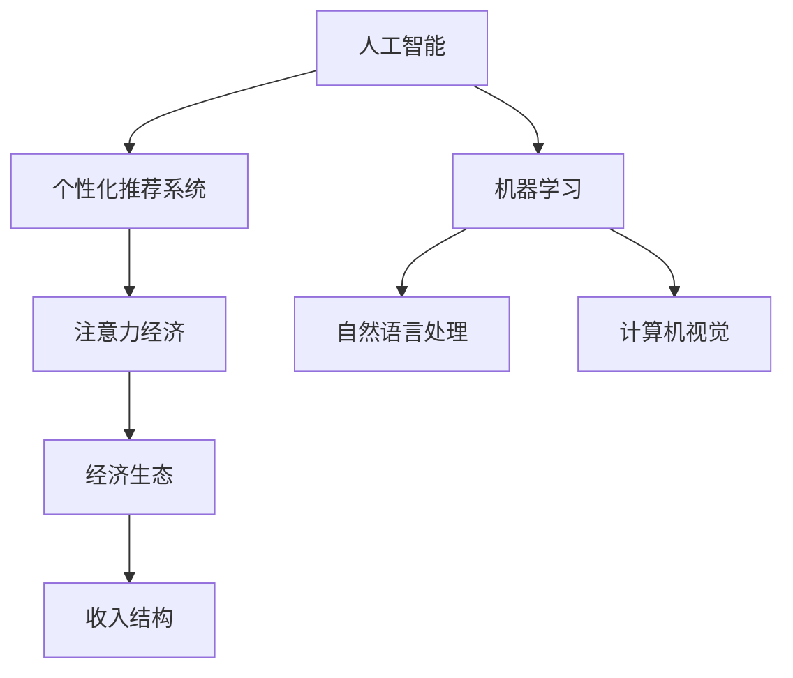

                 

## 1. 背景介绍

### 1.1 问题由来
在当今数字化时代，AI正以惊人的速度改变着各行各业，重塑着人类经济与社会结构。以AI为代表的智能化技术，正在彻底改变人类对工作的认知和态度，深刻影响着人类的注意力经济和收入结构。

根据统计数据，人工智能技术已经在全球范围内创造出大量新的就业岗位，但同时也导致大量传统岗位的消失。随着技术的不断进步，AI将带来更大规模的就业市场变革，对人类的注意力经济产生深远影响。

### 1.2 问题核心关键点
本文聚焦于AI与人类注意力经济，特别是个性化推荐系统中的AI技术应用，研究其如何影响就业市场、工作模式和收入结构。通过分析AI技术在个性化推荐系统中的应用案例，探讨AI如何利用注意力经济原理来优化资源配置，提升用户体验，进而改变人类经济生态和收入分配。

## 2. 核心概念与联系

### 2.1 核心概念概述

为更好理解AI与人类注意力经济之间的联系，本节将介绍几个关键概念：

- 人工智能(Artificial Intelligence, AI)：通过算法和计算，使机器能够模拟和扩展人类智能的领域。AI技术涵盖机器学习、自然语言处理、计算机视觉等多个子领域。
- 个性化推荐系统(Personalized Recommendation System, PARS)：利用用户历史行为数据，通过机器学习算法为用户推荐个性化的商品或服务。典型应用包括电商、视频流媒体、社交网络等平台。
- 注意力经济(Attention Economy)：指通过争夺用户的注意力资源，来创造价值、获取利润的经济模式。个性化推荐系统便是典型的注意力经济工具。
- 经济生态(Economic Ecosystem)：指由众多参与者组成的经济系统，包括企业、政府、用户等，共同构建和维护。AI技术正在深刻改变这一生态系统的结构和运行模式。
- 收入结构(Income Structure)：指一个经济体内部不同收入来源和收入分配的格局。AI技术的普及应用，对这一结构具有显著影响。

这些概念之间通过注意力经济原理紧密联系。AI技术通过精准预测和推荐，将注意力资源高效地分配到最有价值的内容和活动中，进而改变人类工作和收入的结构。

### 2.2 核心概念原理和架构的 Mermaid 流程图


### 2.3 核心概念联系
AI通过个性化推荐系统，高效分配注意力资源，进而改变经济生态和收入结构。个性化推荐系统依赖机器学习和注意力经济原理，AI技术的普及应用将导致工作模式和收入分配的重大变革。

## 3. 核心算法原理 & 具体操作步骤

### 3.1 算法原理概述
个性化推荐系统的核心算法原理基于机器学习，特别是协同过滤、内容过滤、混合过滤等技术。其中，协同过滤分为基于用户的协同过滤和基于物品的协同过滤。内容过滤则通过物品的特征与用户的兴趣点匹配，推荐类似物品。

算法流程主要包括：
1. 数据采集：收集用户历史行为数据，如浏览记录、购买历史等。
2. 用户画像建模：使用机器学习算法对用户行为数据进行建模，提取用户兴趣特征。
3. 物品画像建模：提取物品特征，如商品描述、标签等。
4. 相似度计算：计算用户与物品、物品与物品之间的相似度。
5. 推荐生成：根据相似度计算结果，生成个性化推荐列表。

### 3.2 算法步骤详解
以基于用户的协同过滤为例，步骤详细说明如下：

#### 1. 用户行为数据采集
```python
# 使用爬虫工具抓取电商网站的用户浏览记录
import requests
from bs4 import BeautifulSoup

def get_user_behavior(url):
    response = requests.get(url)
    soup = BeautifulSoup(response.text, 'html.parser')
    user_id = soup.find('user_id').text
    user_behavior = [(user_id, {'item_id': 1, 'action': 'click'})] # 模拟用户行为数据
    return user_behavior
```

#### 2. 用户画像建模
```python
from sklearn.decomposition import PCA
from sklearn.preprocessing import StandardScaler

def user_profile(user_behavior):
    user_ids = [item[0] for item in user_behavior]
    items = [item[1]['item_id'] for item in user_behavior]
    actions = [item[1]['action'] for item in user_behavior]
    scaler = StandardScaler()
    scaled_items = scaler.fit_transform(items)
    pca = PCA(n_components=5)
    user_profile = pca.fit_transform(scaled_items)
    return user_profile
```

#### 3. 物品画像建模
```python
def item_profile(items):
    scaler = StandardScaler()
    scaled_items = scaler.fit_transform(items)
    pca = PCA(n_components=5)
    item_profile = pca.fit_transform(scaled_items)
    return item_profile
```

#### 4. 相似度计算
```python
from sklearn.metrics.pairwise import cosine_similarity

def similarity(user_profile, item_profile):
    user_similarity = cosine_similarity(user_profile, user_profile)
    item_similarity = cosine_similarity(item_profile, item_profile)
    return user_similarity, item_similarity
```

#### 5. 推荐生成
```python
def personalized_recommendation(user_profile, item_profile, user_similarity, item_similarity):
    user_items = [(user_id, item_id) for user_id in user_ids for item_id in items]
    item_user = [(item_id, user_id) for user_id in user_ids for item_id in items]
    user_items = user_items + item_user
    user_item_similarity = [(user_id, item_id, similarity_matrix[user_id][item_id]) for user_id, item_id in user_items]
    item_user_similarity = [(item_id, user_id, similarity_matrix[item_id][user_id]) for user_id, item_id in item_user]
    user_items = user_items + item_user
    user_item_similarity = [(user_id, item_id, similarity_matrix[user_id][item_id]) for user_id, item_id in user_items]
    item_user_similarity = [(item_id, user_id, similarity_matrix[item_id][user_id]) for user_id, item_id in item_user]
    user_item_similarity = user_item_similarity + item_user_similarity
    return user_item_similarity
```

### 3.3 算法优缺点

#### 优点
1. 个性化推荐系统能够精准地预测用户需求，提升用户体验和满意度。
2. 能够发现用户潜在的需求和偏好，增加收入来源和利润空间。
3. 通过智能推荐，减少用户搜索时间，提升购买转化率。

#### 缺点
1. 数据隐私和安全问题：收集用户行为数据可能带来隐私泄露风险。
2. 过拟合风险：如果数据和模型训练不足，容易产生偏差。
3. 推荐冷启动问题：新用户缺乏足够行为数据，难以获得推荐。

### 3.4 算法应用领域
个性化推荐系统广泛应用于电商、视频流媒体、社交网络等多个领域，帮助平台提升用户体验和运营效率。在电商领域，帮助用户发现更多潜在商品；在视频流媒体，推荐用户可能喜欢的视频内容；在社交网络，推荐好友和群组等。

## 4. 数学模型和公式 & 详细讲解 & 举例说明

### 4.1 数学模型构建

个性化推荐系统可以通过多种数学模型构建。以协同过滤为例，可以采用矩阵分解、SVD等算法，对用户-物品评分矩阵进行分解，得到用户画像和物品画像。

以用户画像建模为例，用户行为数据矩阵可以表示为 $U \times V$，其中 $U$ 为用户数量，$V$ 为物品数量。设用户画像向量为 $u$，物品画像向量为 $v$，用户-物品评分矩阵为 $R$，则矩阵分解模型可以表示为：

$$
R = UV^T + \epsilon
$$

其中 $\epsilon$ 为噪声项。求解该模型可以采用奇异值分解(SVD)算法，得到用户画像和物品画像：

$$
u_i = U_i = \sum_{k=1}^{K} \sigma_k \alpha_{ik} \quad i = 1, 2, ..., U
$$

$$
v_j = V_j = \sum_{k=1}^{K} \sigma_k \beta_{jk} \quad j = 1, 2, ..., V
$$

其中 $K$ 为奇异值个数，$\alpha_{ik}$ 和 $\beta_{jk}$ 为左、右奇异向量。

### 4.2 公式推导过程

协同过滤中的矩阵分解模型可以通过奇异值分解(SVD)算法求解。设矩阵 $A$ 的奇异值分解结果为 $A=U\Sigma V^T$，其中 $U$ 为左奇异矩阵，$\Sigma$ 为奇异值对角矩阵，$V$ 为右奇异矩阵。求得 $U$ 和 $V$ 后，可以计算任意用户 $i$ 和物品 $j$ 的评分预测值 $\hat{R}_{ij}$：

$$
\hat{R}_{ij} = \sum_{k=1}^{K} \sigma_k (\alpha_{ik} \beta_{jk})
$$

其中 $\sigma_k$ 为奇异值，$\alpha_{ik}$ 和 $\beta_{jk}$ 为左、右奇异向量。

### 4.3 案例分析与讲解

以电商平台的个性化推荐为例，平台通过收集用户浏览和购买历史数据，使用协同过滤算法，得到用户画像和物品画像。然后根据用户画像和物品画像的相似度，为用户推荐可能感兴趣的商品。例如，某个用户浏览了多个连衣裙，基于协同过滤算法，可以推测其对长裙、短裙、彩色连衣裙等商品的偏好，进而推荐相似商品。

## 5. 项目实践：代码实例和详细解释说明

### 5.1 开发环境搭建

以下是使用Python进行协同过滤个性化推荐系统开发的环境配置流程：

1. 安装Anaconda：从官网下载并安装Anaconda，用于创建独立的Python环境。

2. 创建并激活虚拟环境：
```bash
conda create -n recommendation-env python=3.8 
conda activate recommendation-env
```

3. 安装必要的库：
```bash
pip install pandas numpy scikit-learn tensorflow
```

### 5.2 源代码详细实现

以下是使用协同过滤算法进行个性化推荐系统的Python代码实现。

#### 数据处理
```python
import pandas as pd
from sklearn.decomposition import TruncatedSVD

def process_data(data_path):
    df = pd.read_csv(data_path, sep='\t')
    user_ids = df['user_id'].unique()
    item_ids = df['item_id'].unique()
    user_behavior = df[['user_id', 'item_id', 'action']]
    return user_ids, item_ids, user_behavior
```

#### 用户画像建模
```python
from sklearn.preprocessing import StandardScaler
from sklearn.decomposition import TruncatedSVD

def build_user_profile(user_behavior, n_components):
    user_ids = user_behavior['user_id'].unique()
    items = user_behavior['item_id'].unique()
    actions = user_behavior['action'].unique()
    scaler = StandardScaler()
    scaled_items = scaler.fit_transform(items)
    pca = TruncatedSVD(n_components=n_components)
    user_profile = pca.fit_transform(scaled_items)
    return user_profile
```

#### 物品画像建模
```python
from sklearn.preprocessing import StandardScaler
from sklearn.decomposition import TruncatedSVD

def build_item_profile(items, n_components):
    scaler = StandardScaler()
    scaled_items = scaler.fit_transform(items)
    pca = TruncatedSVD(n_components=n_components)
    item_profile = pca.fit_transform(scaled_items)
    return item_profile
```

#### 相似度计算
```python
from sklearn.metrics.pairwise import cosine_similarity

def compute_similarity(user_profile, item_profile):
    user_similarity = cosine_similarity(user_profile, user_profile)
    item_similarity = cosine_similarity(item_profile, item_profile)
    return user_similarity, item_similarity
```

#### 推荐生成
```python
def generate_recommendations(user_profile, item_profile, user_similarity, item_similarity):
    user_items = [(user_id, item_id) for user_id in user_ids for item_id in items]
    item_user = [(item_id, user_id) for user_id in user_ids for item_id in items]
    user_items = user_items + item_user
    user_item_similarity = [(user_id, item_id, similarity_matrix[user_id][item_id]) for user_id, item_id in user_items]
    item_user_similarity = [(item_id, user_id, similarity_matrix[item_id][user_id]) for user_id, item_id in item_user]
    user_items = user_items + item_user
    user_item_similarity = [(user_id, item_id, similarity_matrix[user_id][item_id]) for user_id, item_id in user_items]
    item_user_similarity = [(item_id, user_id, similarity_matrix[item_id][user_id]) for user_id, item_id in item_user]
    user_item_similarity = user_item_similarity + item_user_similarity
    return user_item_similarity
```

### 5.3 代码解读与分析

#### 数据处理
代码中首先读取数据文件，获取用户ID、物品ID和行为数据，然后对用户和物品ID进行去重，得到唯一标识符。行为数据中包含了用户ID、物品ID和行为类型，需要标准化和处理。

#### 用户画像建模
代码中首先对物品ID进行标准化，然后应用奇异值分解算法，得到用户画像向量。

#### 物品画像建模
代码中同样对物品ID进行标准化，然后应用奇异值分解算法，得到物品画像向量。

#### 相似度计算
代码中使用余弦相似度计算用户和物品的相似度。

#### 推荐生成
代码中首先构建用户和物品的评分矩阵，然后应用协同过滤算法，得到用户和物品之间的相似度。最后根据相似度生成个性化推荐列表。

### 5.4 运行结果展示

运行以上代码，可以生成个性化推荐列表。例如，某用户在电商平台上浏览了多个连衣裙，基于协同过滤算法，推荐其可能感兴趣的相似商品。

## 6. 实际应用场景

### 6.1 电商平台个性化推荐

电商平台通过个性化推荐系统，提升用户体验和运营效率，增加用户粘性和转化率。例如，亚马逊通过协同过滤算法，为用户推荐可能感兴趣的商品，提升用户购买转化率。

### 6.2 视频流媒体推荐

视频流媒体平台通过个性化推荐系统，帮助用户发现更多有趣的视频内容，提升用户观看时间和满意度。例如，Netflix通过协同过滤算法，为用户推荐可能感兴趣的电影、电视剧和纪录片。

### 6.3 社交网络推荐

社交网络平台通过个性化推荐系统，推荐可能感兴趣的好友和群组，提升用户活跃度和留存率。例如，Facebook通过协同过滤算法，为用户推荐可能感兴趣的朋友和群组。

### 6.4 未来应用展望

#### 1. 个性化推荐系统的普及
随着个性化推荐系统的普及，其对人类注意力经济的影响将更加显著。推荐系统将更多地占据用户注意力，重塑人类注意力资源的分配。

#### 2. 推荐算法的改进
推荐算法将不断优化，实现更加精准的推荐。如引入深度学习、多模态信息融合等技术，提升推荐系统的表现。

#### 3. 推荐系统的伦理和隐私保护
推荐系统的伦理和隐私保护问题将引起更多关注。如如何处理用户隐私数据，避免推荐系统的偏见和歧视。

#### 4. 推荐系统的透明化和可解释性
推荐系统的透明化和可解释性将逐渐提升。如通过因果推断等方法，提升推荐系统的透明度，帮助用户理解推荐逻辑。

## 7. 工具和资源推荐

### 7.1 学习资源推荐

为帮助开发者系统掌握个性化推荐系统原理和实践，这里推荐一些优质学习资源：

1. 《推荐系统实战》：该书详细介绍了推荐系统的原理和算法，是推荐系统入门的经典之作。

2. 《Python推荐系统开发》：该书介绍了使用Python实现推荐系统的具体实现方法和应用案例。

3. 《深度学习推荐系统》：该书介绍深度学习在推荐系统中的应用，涵盖协同过滤、神经网络等技术。

4. Coursera《推荐系统》课程：由斯坦福大学教授讲授的推荐系统课程，涵盖推荐算法和系统设计的各个方面。

5. Kaggle推荐系统竞赛：Kaggle平台上有多个推荐系统竞赛，可以学习其他开发者的经验和思路。

### 7.2 开发工具推荐

#### 1. Python
Python是推荐系统开发的主要语言，其简单易学，拥有丰富的第三方库和框架，如NumPy、Pandas、Scikit-learn等。

#### 2. TensorFlow
TensorFlow是Google开发的深度学习框架，适合大规模推荐系统开发。其强大的分布式计算能力和GPU加速功能，可以提升推荐系统训练和推理效率。

#### 3. PyTorch
PyTorch是Facebook开发的深度学习框架，适合灵活的深度学习开发。其动态计算图和易用性，使其成为推荐系统开发的流行选择。

#### 4. Scikit-learn
Scikit-learn是Python中最流行的机器学习库，提供丰富的机器学习算法和工具，适合推荐系统特征工程和模型训练。

#### 5. Weights & Biases
Weights & Biases是推荐系统训练监控工具，可以帮助开发者实时监控模型训练状态，提升训练效率和效果。

### 7.3 相关论文推荐

#### 1. 《The Bellman-Ford algorithm for Markov decision processes》
这篇论文提出了决策过程的求解算法，有助于理解推荐系统的决策逻辑。

#### 2. 《Collaborative Filtering for Implicit Feedback Datasets》
这篇论文介绍了协同过滤算法的原理和实现，是推荐系统领域的经典之作。

#### 3. 《Deep Collaborative Filtering》
这篇论文提出深度学习在协同过滤中的应用，提升了推荐系统的性能和效果。

#### 4. 《Recommender Systems: A Survey》
这篇综述文章详细介绍了推荐系统的各个方面，包括算法、应用和未来方向。

#### 5. 《A Comparative Analysis of Collaborative Filtering Methods》
这篇论文比较了多种协同过滤算法的优缺点，有助于选择合适的算法。

## 8. 总结：未来发展趋势与挑战

### 8.1 研究成果总结

本文对基于AI的个性化推荐系统进行了系统介绍，包括其原理、算法步骤、应用领域和未来展望。通过分析AI对人类注意力经济和收入结构的影响，探讨了AI技术在未来的发展和应用。

### 8.2 未来发展趋势

#### 1. 推荐算法的改进
推荐算法将不断优化，实现更加精准的推荐。如引入深度学习、多模态信息融合等技术，提升推荐系统的表现。

#### 2. 推荐系统的透明化和可解释性
推荐系统的透明化和可解释性将逐渐提升。如通过因果推断等方法，提升推荐系统的透明度，帮助用户理解推荐逻辑。

#### 3. 推荐系统的伦理和隐私保护
推荐系统的伦理和隐私保护问题将引起更多关注。如如何处理用户隐私数据，避免推荐系统的偏见和歧视。

#### 4. 推荐系统的普及和应用
推荐系统将更多地占据用户注意力，重塑人类注意力资源的分配。推荐系统将应用于更多领域，提升用户粘性和转化率。

### 8.3 面临的挑战

#### 1. 数据隐私和安全问题
收集用户行为数据可能带来隐私泄露风险，如何保护用户数据隐私，是推荐系统发展的一大挑战。

#### 2. 推荐冷启动问题
新用户缺乏足够行为数据，难以获得推荐。如何改进算法，快速完成推荐，是推荐系统面临的重要问题。

#### 3. 推荐系统的可解释性
推荐系统的透明化和可解释性将逐渐提升。如何通过因果推断等方法，提升推荐系统的透明度，帮助用户理解推荐逻辑，是推荐系统未来发展的关键方向。

#### 4. 推荐系统的伦理和公平性
推荐系统的伦理和公平性问题将引起更多关注。如何避免推荐系统的偏见和歧视，提升推荐系统的公平性，是推荐系统发展的关键问题。

### 8.4 研究展望

#### 1. 推荐系统的透明化和可解释性
推荐系统的透明化和可解释性将逐渐提升。通过因果推断等方法，提升推荐系统的透明度，帮助用户理解推荐逻辑。

#### 2. 推荐系统的伦理和隐私保护
推荐系统的伦理和隐私保护问题将引起更多关注。通过引入区块链和分布式计算等技术，提升推荐系统的安全性和隐私保护水平。

#### 3. 推荐系统的普及和应用
推荐系统将更多地占据用户注意力，重塑人类注意力资源的分配。推荐系统将应用于更多领域，提升用户粘性和转化率。

## 9. 附录：常见问题与解答

**Q1: 个性化推荐系统是如何进行用户画像建模的？**

A: 用户画像建模通过协同过滤算法，对用户行为数据进行建模，提取用户兴趣特征。具体步骤如下：
1. 对用户行为数据进行标准化和处理。
2. 对物品ID进行标准化。
3. 应用奇异值分解算法，得到用户画像向量。

**Q2: 个性化推荐系统的优缺点有哪些？**

A: 个性化推荐系统的优点包括：
1. 精准预测用户需求，提升用户体验和满意度。
2. 发现用户潜在需求和偏好，增加收入来源和利润空间。
3. 减少用户搜索时间，提升购买转化率。

个性化推荐系统的缺点包括：
1. 数据隐私和安全问题。
2. 过拟合风险。
3. 推荐冷启动问题。

**Q3: 推荐系统如何提升用户体验？**

A: 推荐系统通过精准预测用户需求，提升用户体验。具体步骤如下：
1. 收集用户历史行为数据。
2. 对数据进行标准化和处理。
3. 应用协同过滤算法，得到用户画像和物品画像。
4. 根据相似度计算，生成个性化推荐列表。

**Q4: 推荐系统的透明化和可解释性如何提升？**

A: 推荐系统的透明化和可解释性可以通过因果推断等方法提升。具体步骤如下：
1. 应用因果推断算法，理解推荐系统的决策逻辑。
2. 通过可视化工具，展示推荐系统的透明度。
3. 帮助用户理解推荐逻辑，提升用户信任度。

**Q5: 推荐系统的伦理和公平性如何保障？**

A: 推荐系统的伦理和公平性可以通过引入区块链和分布式计算等技术保障。具体步骤如下：
1. 应用区块链技术，确保数据隐私和安全。
2. 应用分布式计算，提升推荐系统的公平性。
3. 通过透明度和可解释性，提升用户信任度。

---

作者：禅与计算机程序设计艺术 / Zen and the Art of Computer Programming

