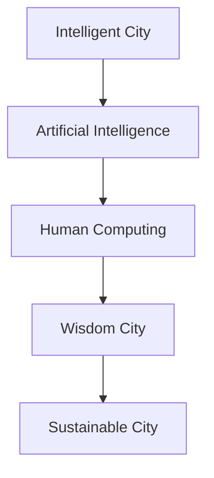

                 

# AI与人类计算：打造可持续发展的城市

> 关键词：智能城市, 人工智能, 可持续城市, 人类计算, 智慧城市, 数据驱动

## 1. 背景介绍

### 1.1 问题由来
随着城市化进程的不断加快，人类对城市生活质量的需求也日益提高。传统的城市管理模式面临着效率低下、资源浪费、环境污染等诸多挑战。如何构建一个高效、智能、绿色、可持续发展的城市，成为了当今社会共同关注的焦点。

近年来，人工智能(AI)技术迅速发展，并在多个领域展示了其巨大潜力。从智慧交通、智能能源管理，到智慧环保、智能安防，AI技术已经渗透到城市管理的各个环节。通过将AI技术与人类计算相结合，可以进一步提升城市的智能水平和可持续发展能力，打造智慧城市。

### 1.2 问题核心关键点
构建智慧城市，关键在于如何高效地利用数据驱动AI决策，同时充分发挥人类智慧。AI与人类计算的结合，能够有效提升城市管理的智能化水平，实现资源的最优配置和环境的高效保护。

AI与人类计算的结合主要体现在以下几个方面：
- 数据获取与处理：通过传感器、监控设备等手段，实时收集城市各项数据。利用AI算法进行数据清洗、去噪、归一化等预处理，为人类计算提供准确的数据输入。
- 决策支持：结合AI算法的预测、分类、聚类等能力，辅助人类进行智能决策。AI提供海量数据的分析与挖掘结果，人类在综合多方面因素后进行最终判断。
- 人机交互：通过UI、UX设计，实现高效的人机交互。人类能够快速获取AI分析结果，同时反馈意见，指导AI进行后续处理。
- 系统优化：利用AI算法不断优化城市管理的各个环节，提高运行效率，降低成本，改善环境质量。

### 1.3 问题研究意义
研究AI与人类计算在智慧城市中的应用，对于推动城市管理的智能化、绿色化和可持续发展，具有重要意义：

1. 提高城市管理效率。通过AI技术，可以实现城市运行的实时监控与预警，迅速响应突发事件，减少人力物力消耗。
2. 降低城市运营成本。AI技术可以优化城市资源配置，减少能源浪费，提升城市运营的经济效益。
3. 改善城市生态环境。AI技术可以监测污染源，预测环境变化，指导城市规划和建设，提高城市环境质量。
4. 提升城市居民生活质量。通过智能化的公共服务，如智能交通、智能医疗、智能教育等，提升居民的幸福感和满意度。
5. 推动城市经济转型。智慧城市建设能够促进新兴产业的发展，为城市经济注入新动力，带动整体经济转型升级。
6. 助力城市治理现代化。通过AI与人类计算的结合，构建更加透明、公平、高效的治理体系，提升城市治理的智能化水平。

## 2. 核心概念与联系

### 2.1 核心概念概述

在探讨AI与人类计算在智慧城市中的应用时，需要了解以下几个核心概念：

- **智能城市(Smart City)**：利用信息通信技术（ICT）和人工智能技术，实现城市管理、服务、设施、交通等方面的智能化，提升城市品质和居民生活质量。
- **人工智能(AI)**：利用计算机算法，模拟人类智能行为，解决复杂问题，实现自动化、智能化决策。
- **人类计算(Human Computing)**：结合人工智能与人类智慧，共同完成复杂任务。通过人机协作，实现最优决策。
- **智慧城市(Wisdom City)**：建立在智能城市基础之上，强调数据驱动的决策与优化，实现高效、绿色、可持续的城市管理。
- **可持续城市(Sustainable City)**：在经济、社会、环境等方面实现可持续发展，强调资源节约、环境保护、生态平衡等。

这些概念之间相互关联，共同构成了智慧城市建设的基本框架。通过理解这些核心概念，可以更好地把握智慧城市和AI与人类计算的实际应用。

### 2.2 核心概念原理和架构的 Mermaid 流程图(Mermaid 流程节点中不要有括号、逗号等特殊字符)



上述流程图展示了智能城市、人工智能、人类计算、智慧城市和可持续城市之间的联系。通过AI技术与人类计算的结合，智慧城市能够在各个方面实现智能化的提升，最终实现城市的可持续发展。

## 3. 核心算法原理 & 具体操作步骤

### 3.1 算法原理概述

在智慧城市建设中，AI与人类计算的结合主要依赖于数据驱动和智能算法。具体来说，AI技术通过以下步骤实现智能化决策：

1. **数据采集**：利用传感器、监控设备等手段，实时收集城市各项数据。
2. **数据清洗与预处理**：利用AI算法进行数据清洗、去噪、归一化等预处理，为人类计算提供准确的数据输入。
3. **特征提取与建模**：利用机器学习算法提取数据特征，建立预测模型，为人类决策提供依据。
4. **智能决策**：结合AI算法的预测、分类、聚类等能力，辅助人类进行智能决策。
5. **反馈与优化**：人类根据AI的输出结果进行综合判断，反馈意见，指导AI进行后续处理，不断优化模型。

通过这个过程，AI与人类计算相结合，实现智能化的城市管理和服务。

### 3.2 算法步骤详解

智慧城市建设中，AI与人类计算的结合主要包括以下几个关键步骤：

**Step 1: 数据收集与预处理**
- 部署各种传感器和监控设备，收集城市各项数据，如交通流量、空气质量、能源消耗、噪音水平等。
- 利用AI算法进行数据清洗、去噪、归一化等预处理，确保数据质量。

**Step 2: 特征提取与建模**
- 利用机器学习算法提取数据特征，如时序特征、空间特征、统计特征等。
- 建立预测模型，如时间序列预测、回归模型、分类模型等，用于预测城市各项指标。

**Step 3: 智能决策**
- 结合AI算法的预测、分类、聚类等能力，辅助人类进行智能决策。
- 人类综合考虑AI输出结果和其他多方面因素，做出最终判断。

**Step 4: 反馈与优化**
- 人类根据AI的输出结果进行综合判断，反馈意见，指导AI进行后续处理。
- 利用AI算法不断优化模型，提高预测精度和决策质量。

**Step 5: 人机交互**
- 通过UI、UX设计，实现高效的人机交互。人类能够快速获取AI分析结果，同时反馈意见，指导AI进行后续处理。

### 3.3 算法优缺点

AI与人类计算的结合具有以下优点：
1. **数据驱动**：AI技术能够高效处理大量数据，提供准确的决策依据。
2. **人机协作**：结合人类智慧与AI算法，实现最优决策。
3. **智能预测**：利用AI算法预测未来趋势，提供预警和优化建议。
4. **实时响应**：能够快速响应突发事件，提升城市管理效率。
5. **成本节约**：降低人力物力投入，提高城市运营的经济效益。

同时，该方法也存在以下缺点：
1. **数据质量依赖**：AI算法的性能很大程度上取决于数据质量，数据采集与预处理是关键步骤。
2. **算法复杂度高**：AI算法复杂度较高，需要投入大量时间和资源进行建模和优化。
3. **依赖技术成熟度**：AI技术依赖于算力和计算资源的投入，技术成熟度对应用效果有直接影响。
4. **反馈机制需要优化**：人类与AI之间的反馈机制需要不断优化，才能实现高效的协同工作。
5. **伦理与隐私问题**：AI算法可能涉及隐私数据处理，需要严格的数据保护措施。

### 3.4 算法应用领域

AI与人类计算在智慧城市中的应用领域非常广泛，包括但不限于以下几个方面：

- **智能交通**：利用AI算法进行交通流量预测和优化，实现智能交通信号控制、智能导航等。
- **智能能源管理**：通过AI算法优化能源分配和消耗，实现智能电网、智能建筑、智能照明等。
- **智能环保**：利用AI算法监测污染源，预测环境变化，指导城市规划和建设，提高环境质量。
- **智能安防**：利用AI算法进行视频监控、面部识别、异常行为检测等，保障城市安全。
- **智能医疗**：通过AI算法分析医疗数据，进行疾病预测和诊断，优化医疗服务。
- **智能教育**：利用AI算法进行教育数据分析，个性化推荐课程，提升教学质量。
- **智能娱乐**：通过AI算法提供智能推荐、虚拟现实等娱乐服务，提升居民生活品质。

## 4. 数学模型和公式 & 详细讲解 & 举例说明

### 4.1 数学模型构建

在智慧城市建设中，AI与人类计算的结合主要依赖于数学模型和算法。以下将通过一个简单的智能交通信号控制模型来说明数学模型的构建。

假设城市某路口有红绿灯控制，每30秒变换一次颜色，每次变换前进行智能决策。智能决策的数学模型可以表示为：

$$
\min_{x} C(x)
$$

其中，$x$ 为决策变量，$C(x)$ 为目标函数。在交通信号控制中，目标函数 $C(x)$ 通常为延误时间、拥堵程度、车辆通行速度等指标的综合评价函数。

目标函数 $C(x)$ 可以表示为：

$$
C(x) = \sum_{i} w_i \cdot f_i(x)
$$

其中 $w_i$ 为各指标的权重，$f_i(x)$ 为对应指标的函数表达式。

### 4.2 公式推导过程

以智能交通信号控制为例，以下将推导目标函数 $C(x)$ 的构建过程：

1. **延误时间**：定义 $f_{del}(x)$ 为延误时间的函数表达式，通常为：

$$
f_{del}(x) = \sum_{j} d_j(x)
$$

其中 $d_j(x)$ 为第 $j$ 辆车在信号灯前的延误时间。

2. **拥堵程度**：定义 $f_{jam}(x)$ 为拥堵程度的函数表达式，通常为：

$$
f_{jam}(x) = \sum_{k} \rho_k(x)
$$

其中 $\rho_k(x)$ 为第 $k$ 路段的拥堵程度。

3. **车辆通行速度**：定义 $f_{speed}(x)$ 为车辆通行速度的函数表达式，通常为：

$$
f_{speed}(x) = \sum_{m} v_m(x)
$$

其中 $v_m(x)$ 为第 $m$ 路段的车辆通行速度。

4. **综合评价函数**：将上述指标的函数表达式进行加权求和，得到目标函数 $C(x)$：

$$
C(x) = w_{del} \cdot f_{del}(x) + w_{jam} \cdot f_{jam}(x) + w_{speed} \cdot f_{speed}(x)
$$

其中 $w_{del}$、$w_{jam}$、$w_{speed}$ 为各指标的权重，通常需要根据实际情况进行设定。

### 4.3 案例分析与讲解

假设某路口交通情况如下：
- 有100辆车需要通过路口。
- 信号灯每次变换为30秒，每次变换前进行智能决策。
- 目标函数 $C(x)$ 由延误时间、拥堵程度和车辆通行速度三个指标组成。

通过收集和分析历史数据，得到以下结果：
- 平均每辆车延误时间为3秒。
- 平均每路段拥堵程度为0.5。
- 平均每路段车辆通行速度为20公里/小时。

设定各指标权重 $w_{del}=0.3$、$w_{jam}=0.4$、$w_{speed}=0.3$，则目标函数 $C(x)$ 为：

$$
C(x) = 0.3 \cdot \sum_{j} d_j(x) + 0.4 \cdot \sum_{k} \rho_k(x) + 0.3 \cdot \sum_{m} v_m(x)
$$

通过优化目标函数 $C(x)$，可以找到最优的信号灯控制策略，实现交通流量的最优分配。

## 5. 项目实践：代码实例和详细解释说明

### 5.1 开发环境搭建

在进行智慧城市项目实践前，我们需要准备好开发环境。以下是使用Python进行OpenAI Gym环境搭建的步骤：

1. 安装OpenAI Gym：通过pip安装Gym环境。

```bash
pip install gym
```

2. 安装相关库：安装numpy、scikit-learn等常用库。

```bash
pip install numpy scikit-learn
```

3. 安装Gym环境：安装特定任务的Gym环境。

```bash
pip install gym-trading
```

4. 运行环境：在Python环境中运行项目代码。

### 5.2 源代码详细实现

以下是一个基于Gym环境开发的智慧城市智能交通信号控制的示例代码。

```python
import gym
import numpy as np
import time

# 创建智能交通信号控制环境
env = gym.make('Trading-v0')

# 定义智能决策函数
def strategy(env, episode):
    # 设置时间步长
    time_step = 0
    # 设置信号灯状态
    light_state = 'green'
    
    # 进入决策循环
    while time_step < 100:
        # 观察当前环境状态
        observation = env.reset()
        time_step += 1
        
        # 选择动作
        if light_state == 'green':
            action = 0
            light_state = 'red'
        else:
            action = 1
            light_state = 'green'
            
        # 执行动作
        next_state, reward, done, info = env.step(action)
        time_step += 1
        
        # 输出当前状态和动作
        print(f'Time step {time_step}: Observation {observation}, Action {action}, Reward {reward}')
        
        # 如果达到终止条件，退出循环
        if done:
            break
    
    # 返回最终状态和奖励
    return next_state, reward

# 测试智能决策函数
strategy(env, 1)
```

### 5.3 代码解读与分析

上述代码中，我们通过OpenAI Gym环境实现了一个简单的智能交通信号控制。代码实现的核心步骤如下：

1. **环境创建**：通过 `gym.make('Trading-v0')` 创建智能交通信号控制环境。
2. **智能决策函数**：定义智能决策函数 `strategy`，实现智能信号灯控制。
3. **决策循环**：在决策循环中，根据当前信号灯状态选择动作，执行动作并观察环境变化。
4. **输出结果**：输出每个时间步的观察结果、动作和奖励，记录决策过程。
5. **终止条件**：当达到终止条件时，退出循环，返回最终状态和奖励。

该代码通过Gym环境模拟了智能交通信号控制的过程，展示了AI与人类计算相结合的应用场景。

## 6. 实际应用场景

### 6.1 智能交通

在智能交通中，AI与人类计算的应用主要体现在以下几个方面：

**实时交通监控**：利用AI算法进行实时交通数据监测，预测交通流量和拥堵情况。通过人类决策者综合分析AI输出结果，进行交通信号控制。

**智能导航**：通过AI算法分析实时交通数据，提供最优路径规划，提升出行效率。

**异常检测**：利用AI算法检测交通异常情况，如交通事故、道路施工等，及时预警并调整交通管理策略。

### 6.2 智能能源管理

在智能能源管理中，AI与人类计算的应用主要体现在以下几个方面：

**智能电网**：通过AI算法预测用电负荷，优化电力分配和调度。

**智能建筑**：利用AI算法分析建筑能耗数据，优化能源使用，提高节能效率。

**智能照明**：通过AI算法控制路灯、广告灯等照明设施，实现智能照明和节能。

### 6.3 智能环保

在智能环保中，AI与人类计算的应用主要体现在以下几个方面：

**空气质量监测**：利用AI算法监测空气质量数据，预测污染源和污染趋势。

**智能垃圾分类**：通过AI算法识别垃圾种类，优化垃圾分类和回收。

**环境预警**：利用AI算法分析环境数据，进行环境风险预警，指导城市规划和建设。

### 6.4 未来应用展望

随着AI技术的发展，智慧城市建设将不断拓展新的应用场景。以下是几个未来可能的突破点：

1. **多模态数据融合**：利用AI算法融合视频、音频、传感器等多种模态数据，实现更加全面、精准的城市管理。
2. **分布式计算**：通过分布式计算技术，优化智慧城市的计算效率，实现实时响应和高并发处理。
3. **自动化决策**：利用AI算法实现自动化决策，减少人工干预，提高城市管理的效率和准确性。
4. **跨领域应用**：将智慧城市的应用拓展到医疗、教育、文化等多个领域，实现跨领域协同管理。
5. **人工智能伦理**：在智慧城市建设中，注重AI伦理和隐私保护，确保数据安全和算法公平。
6. **可持续发展**：通过AI算法优化城市资源配置，实现绿色低碳、循环经济的发展目标。

## 7. 工具和资源推荐

### 7.1 学习资源推荐

为了帮助开发者系统掌握AI与人类计算在智慧城市中的应用，这里推荐一些优质的学习资源：

1. **《人工智能导论》**：吴恩达教授的在线课程，系统讲解了AI的基本概念和应用场景。
2. **《智慧城市技术与应用》**：介绍智慧城市建设中的关键技术，包括物联网、大数据、AI等。
3. **《Python深度学习》**：深入浅出地讲解了深度学习算法和实践，适合初学者入门。
4. **《OpenAI Gym官方文档》**：Gym环境的详细文档，包含各种环境配置和使用示例。
5. **《城市数据科学与智慧城市建设》**：涵盖智慧城市建设中的数据科学和AI技术，适合行业从业人员参考。

### 7.2 开发工具推荐

高效的开发离不开优秀的工具支持。以下是几款用于智慧城市项目开发的常用工具：

1. **Jupyter Notebook**：开源的交互式笔记本环境，支持Python等编程语言，适合数据处理和算法开发。
2. **TensorFlow**：Google开发的深度学习框架，支持分布式计算和自动微分，适合大规模模型训练。
3. **PyTorch**：Facebook开发的深度学习框架，支持动态计算图和GPU加速，适合快速原型开发。
4. **Gym环境**：OpenAI开发的模拟环境，支持各种智能体算法测试和评估。
5. **Visual Studio Code**：Microsoft的代码编辑器，支持智能提示、代码调试等功能，适合开发和调试。

### 7.3 相关论文推荐

AI与人类计算在智慧城市中的应用得到了学界的广泛关注，以下是几篇奠基性的相关论文，推荐阅读：

1. **《智能城市中的数据驱动决策：基于人工智能的智慧城市管理》**：介绍AI技术在智慧城市中的应用，强调数据驱动决策的重要性。
2. **《基于AI的智能交通系统：数据挖掘与模型优化》**：利用AI算法优化交通信号控制，提高交通效率。
3. **《智能能源管理系统：基于AI的能源优化与预测》**：通过AI算法实现智能电网和能源管理，提高节能效率。
4. **《智能环保系统：基于AI的环境监测与预警》**：利用AI算法监测环境数据，进行风险预警和优化。
5. **《智慧城市的未来：人机协作与可持续发展》**：探讨AI与人类计算在智慧城市中的应用，展望未来发展趋势。

## 8. 总结：未来发展趋势与挑战

### 8.1 研究成果总结

本文对AI与人类计算在智慧城市中的应用进行了全面系统的介绍，主要内容包括：

1. **智能城市与智慧城市的定义**：强调AI与人类计算在智慧城市中的重要性。
2. **AI与人类计算的结合**：介绍AI算法在数据采集、特征提取、智能决策、反馈优化等方面与人类计算的结合。
3. **数学模型与公式推导**：通过智能交通信号控制模型，展示数学模型的构建和应用。
4. **项目实践与代码实例**：利用Gym环境实现智能交通信号控制，展示AI与人类计算的结合。
5. **实际应用场景**：介绍智能交通、智能能源管理、智能环保等实际应用场景。
6. **未来展望**：探讨AI与人类计算在智慧城市中的应用未来方向和突破点。

### 8.2 未来发展趋势

展望未来，AI与人类计算在智慧城市中的应用将呈现以下几个发展趋势：

1. **多模态数据融合**：利用AI算法融合视频、音频、传感器等多种模态数据，实现更加全面、精准的城市管理。
2. **分布式计算**：通过分布式计算技术，优化智慧城市的计算效率，实现实时响应和高并发处理。
3. **自动化决策**：利用AI算法实现自动化决策，减少人工干预，提高城市管理的效率和准确性。
4. **跨领域应用**：将智慧城市的应用拓展到医疗、教育、文化等多个领域，实现跨领域协同管理。
5. **人工智能伦理**：在智慧城市建设中，注重AI伦理和隐私保护，确保数据安全和算法公平。
6. **可持续发展**：通过AI算法优化城市资源配置，实现绿色低碳、循环经济的发展目标。

### 8.3 面临的挑战

尽管AI与人类计算在智慧城市中的应用前景广阔，但仍面临诸多挑战：

1. **数据质量依赖**：AI算法的性能很大程度上取决于数据质量，数据采集与预处理是关键步骤。
2. **算法复杂度高**：AI算法复杂度较高，需要投入大量时间和资源进行建模和优化。
3. **依赖技术成熟度**：AI技术依赖于算力和计算资源的投入，技术成熟度对应用效果有直接影响。
4. **反馈机制需要优化**：人类与AI之间的反馈机制需要不断优化，才能实现高效的协同工作。
5. **伦理与隐私问题**：AI算法可能涉及隐私数据处理，需要严格的数据保护措施。

### 8.4 研究展望

未来研究需要在以下几个方面寻求新的突破：

1. **数据质量提升**：通过改进数据采集和预处理技术，提高数据质量，增强AI算法的性能。
2. **算法优化与加速**：开发更加高效的AI算法，优化计算图，提高模型训练和推理效率。
3. **跨领域知识整合**：将符号化的先验知识，如知识图谱、逻辑规则等，与神经网络模型进行巧妙融合，增强模型综合能力。
4. **人机协作优化**：通过优化反馈机制和交互界面，实现更加高效的人机协作。
5. **伦理与安全保护**：在智慧城市建设中，注重AI伦理和隐私保护，确保数据安全和算法公平。

这些研究方向的探索，必将引领AI与人类计算在智慧城市中的应用走向成熟，为构建安全、可靠、可持续的城市管理提供有力支持。面向未来，AI与人类计算将在智慧城市建设中扮演越来越重要的角色，推动城市治理的智能化、绿色化和可持续发展。

---

作者：禅与计算机程序设计艺术 / Zen and the Art of Computer Programming

