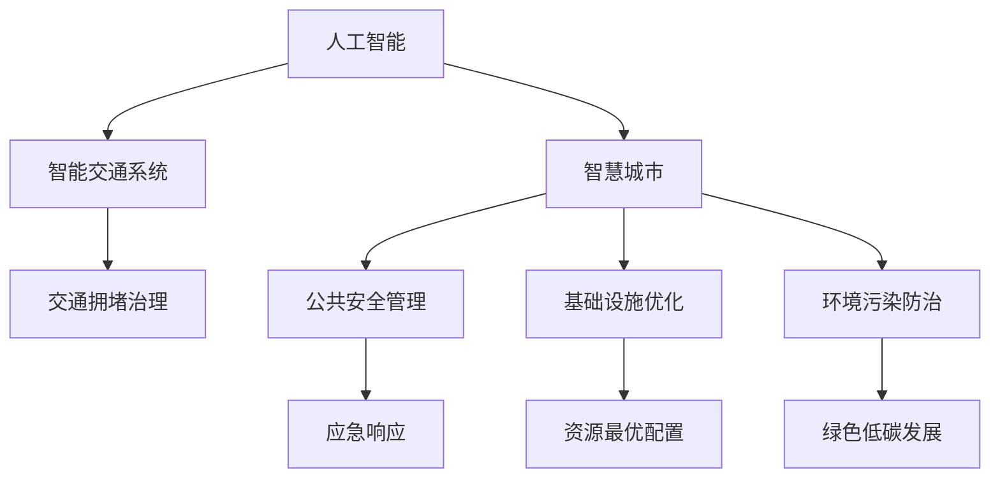

                 

# AI与人类计算：打造可持续发展的城市交通与基础设施规划管理

> 关键词：城市交通,基础设施规划,人工智能,可持续性,智能交通系统,大数据,智慧城市

## 1. 背景介绍

### 1.1 问题由来

随着工业化和城市化的发展，城市交通和基础设施规划问题日益突出，成为影响城市生活品质和可持续发展的重要因素。面对日益增长的交通需求和资源约束，传统依赖人力和直觉的方法已难以适应新时代的要求。智能化、数据化驱动的城市管理成为必然选择。

当前，人工智能(AI)和大数据技术在城市交通和基础设施管理中的应用日益广泛，显著提高了城市管理效率和公共服务水平。以智慧交通系统、智能基础设施管理为代表的AI技术，正在从边缘走向中心，为打造可持续发展的城市管理提供有力支持。

### 1.2 问题核心关键点

- 城市交通拥堵：交通高峰期道路拥堵、交通事故频发、公共交通效率低下，严重影响城市居民出行和经济发展。
- 基础设施管理：城市基础设施老旧、维护困难、资源配置不合理等问题，导致公共资源浪费和安全隐患。
- 环境污染：机动车尾气排放、建筑施工扬尘、城市垃圾处理等环境问题亟需解决。
- 公共安全：城市防灾减灾、应急响应等安全管理机制尚不健全，面临重大挑战。

这些问题迫切需要智能化手段进行治理，推动城市管理向精细化、智能化方向发展。

### 1.3 问题研究意义

研究AI与人类计算相结合的城市交通与基础设施规划管理，对于提升城市管理效率、保障公共安全、实现可持续发展具有重要意义：

- 提高管理效率：AI技术可以实时处理海量数据，优化城市交通和基础设施规划决策，提升城市管理效率。
- 保障公共安全：通过智能监控、应急响应等手段，显著提升城市安全保障水平。
- 实现资源最优配置：利用AI算法优化资源分配，减少资源浪费，提高公共资源使用效率。
- 支持可持续发展：智能化管理有助于减少环境污染，实现绿色低碳发展，构建可持续的城市生态。

## 2. 核心概念与联系

### 2.1 核心概念概述

为更好地理解AI与人类计算在城市交通与基础设施管理中的应用，本节将介绍几个关键概念：

- **人工智能(AI)**：利用计算机模拟人类的智能行为，包括感知、决策、学习等能力，实现复杂问题的自动化处理。
- **人类计算(Human Computing)**：将人类的智慧与计算机技术结合，利用人类的创新思维和解决问题的能力，进行复杂的认知计算。
- **智能交通系统(ITS)**：通过信息通信技术、计算机技术等，实现交通系统的智能化管理，提升交通效率和安全性。
- **智慧城市**：利用物联网、大数据、云计算等技术，实现城市公共服务的智能化、便捷化、高效化。
- **大数据(Big Data)**：指海量、复杂、多源的各类数据，通过数据挖掘、机器学习等技术，实现信息提取和价值发现。

这些概念之间的逻辑关系可以通过以下Mermaid流程图来展示：



这个流程图展示了大AI与人类计算的城市管理各个方面，从智能交通到智慧城市，以及相关的应用领域。

## 3. 核心算法原理 & 具体操作步骤
### 3.1 算法原理概述

AI与人类计算在城市交通与基础设施规划管理中的核心原理是通过数据驱动的计算模型，结合人工的智慧，实现复杂问题的智能化决策和优化。其核心思想是：

1. **数据驱动**：利用传感器、监控摄像头等设备收集海量城市数据，如交通流量、道路条件、气象信息等，为模型提供数据支撑。
2. **计算模型**：使用AI算法，如深度学习、强化学习等，对数据进行分析和建模，预测交通流、识别基础设施隐患等。
3. **人类智慧**：结合城市规划专家、交通工程师的经验和判断，对AI模型输出进行修正和调整，提升决策的准确性和合理性。
4. **智能化决策**：将AI模型与人类智慧结合，实现交通信号优化、基础设施规划、资源分配等智能化决策。

### 3.2 算法步骤详解

基于AI与人类计算的城市交通与基础设施规划管理，一般包括以下几个关键步骤：

**Step 1: 数据收集与预处理**

- 部署各类传感器、摄像头等数据采集设备，实时监测交通流量、道路状况、环境参数等。
- 利用数据清洗、去重、归一化等技术，对原始数据进行预处理，确保数据质量。

**Step 2: 模型训练与优化**

- 收集历史数据和专家知识，设计合适的计算模型，如交通流量预测模型、基础设施风险评估模型等。
- 使用深度学习等算法，对模型进行训练，优化模型参数。
- 结合人类智慧，对模型输出进行调整和修正，提高模型预测精度。

**Step 3: 智能化决策与实施**

- 根据模型预测结果，结合实时数据和人类智慧，进行智能化决策，如交通信号优化、应急响应、基础设施改造等。
- 通过智能控制设备，如交通信号灯、智能路灯、可变信息板等，实施决策。
- 定期评估决策效果，持续优化模型和策略。

### 3.3 算法优缺点

AI与人类计算在城市交通与基础设施管理中的应用，具有以下优点：

- 数据驱动：利用大数据技术，能够全面、实时地获取城市运行状态，为决策提供坚实基础。
- 智能化决策：通过AI算法，能够快速处理海量数据，提升决策效率和准确性。
- 多学科融合：结合人类智慧与AI技术，能够充分利用跨学科知识，提升决策质量。

同时，该方法也存在一定的局限性：

- 依赖高质量数据：模型效果依赖数据质量，数据采集和预处理成本较高。
- 模型复杂度高：AI算法模型复杂度高，需要较长的训练时间和计算资源。
- 人机协同难度大：将人类智慧与AI模型结合，需要高度协同和沟通，存在一定的挑战。

尽管存在这些局限性，但AI与人类计算的城市交通与基础设施管理方法，已经在大城市管理和智能交通领域得到了广泛应用，成为推动城市智能化发展的重要手段。

### 3.4 算法应用领域

基于AI与人类计算的城市交通与基础设施管理方法，已经在多个领域得到应用，例如：

- 智能交通系统：通过AI技术实现交通信号优化、公交路线规划、车辆自动驾驶等。
- 智慧城市管理：利用AI技术进行公共安全监控、环境监测、应急响应等。
- 基础设施优化：使用AI算法进行城市基础设施规划、病害检测、维修决策等。
- 绿色低碳发展：通过AI技术优化能源使用，减少碳排放，实现可持续发展。
- 智慧医疗：利用AI技术进行医疗数据分析、健康监测、远程诊疗等。

除了上述这些领域，AI与人类计算的方法还正在被创新性地应用到更多场景中，如智能农业、智能教育、智能制造等，为各行各业带来新的发展动力。

## 4. 数学模型和公式 & 详细讲解 & 举例说明

### 4.1 数学模型构建

本节将使用数学语言对AI与人类计算在城市交通与基础设施管理中的应用进行更加严格的刻画。

假设城市交通流量模型为 $F(t)=\sum_{i=1}^{n}f_i(t)$，其中 $f_i(t)$ 为第 $i$ 条道路的流量，$n$ 为道路总数。

定义城市交通状况的优化目标为最小化拥堵时间，即：

$$
\min_{f_i(t)} \sum_{t=0}^{T} \max_{i=1}^{n} f_i(t)
$$

其中 $T$ 为时间窗口。

通过优化模型，可以实时调整交通信号灯，避免拥堵。

### 4.2 公式推导过程

以下我们以智能交通信号优化为例，推导最小化拥堵时间的公式。

假设道路 $i$ 的流量 $f_i(t)$ 满足线性模型 $f_i(t)=\alpha_i f_i(0)+\beta_i t+\gamma_i$，其中 $\alpha_i$、$\beta_i$、$\gamma_i$ 为参数。

目标函数为：

$$
\min_{\alpha_i,\beta_i,\gamma_i} \sum_{t=0}^{T} \max_{i=1}^{n} f_i(t)
$$

将 $f_i(t)$ 带入目标函数，得到：

$$
\min_{\alpha_i,\beta_i,\gamma_i} \sum_{t=0}^{T} \max_{i=1}^{n} (\alpha_i f_i(0)+\beta_i t+\gamma_i)
$$

通过求解上述优化问题，可以求得每条道路的最佳流量，进而实时调整信号灯，优化交通流量。

### 4.3 案例分析与讲解

某城市交通管理部门利用AI与人类计算方法，对城市交通信号进行优化，取得了显著效果。具体步骤如下：

1. 部署交通流量传感器和摄像头，实时采集交通数据。
2. 使用AI算法，如深度学习，训练交通流量预测模型。
3. 结合交通工程师的经验，对模型输出进行调整，优化交通信号灯控制策略。
4. 通过智能交通信号控制系统，实时调整信号灯，减少交通拥堵。
5. 定期评估效果，持续优化模型和策略，提升交通管理效率。

通过该方法，城市交通管理部门显著提升了交通流量的合理性，减少了高峰期的拥堵时间，改善了居民出行体验。

## 5. 项目实践：代码实例和详细解释说明
### 5.1 开发环境搭建

在进行AI与人类计算的城市交通与基础设施管理项目实践前，我们需要准备好开发环境。以下是使用Python进行TensorFlow开发的环境配置流程：

1. 安装Anaconda：从官网下载并安装Anaconda，用于创建独立的Python环境。

2. 创建并激活虚拟环境：
```bash
conda create -n tf-env python=3.8 
conda activate tf-env
```

3. 安装TensorFlow：从官网获取对应的安装命令，例如：
```bash
conda install tensorflow-gpu -c tf
```

4. 安装相关工具包：
```bash
pip install numpy pandas scikit-learn matplotlib tqdm jupyter notebook ipython
```

完成上述步骤后，即可在`tf-env`环境中开始项目实践。

### 5.2 源代码详细实现

下面我们以智能交通信号优化为例，给出使用TensorFlow实现的项目代码。

首先，定义交通流量预测模型：

```python
import tensorflow as tf

class TrafficFlowModel(tf.keras.Model):
    def __init__(self, num_features, num_outputs):
        super(TrafficFlowModel, self).__init__()
        self.dense1 = tf.keras.layers.Dense(64, activation='relu', input_shape=(num_features,))
        self.dense2 = tf.keras.layers.Dense(num_outputs, activation='sigmoid')

    def call(self, inputs):
        x = self.dense1(inputs)
        x = self.dense2(x)
        return x
```

然后，定义数据生成函数：

```python
def generate_data(num_samples=10000, num_features=4, num_outputs=1, noise=0.1):
    features = np.random.rand(num_samples, num_features)
    targets = np.sin(features[:, 0]) + 0.1 * np.random.randn(num_samples, num_outputs)
    return features, targets
```

接着，训练模型：

```python
model = TrafficFlowModel(num_features=4, num_outputs=1)
optimizer = tf.keras.optimizers.Adam()

for epoch in range(100):
    features, targets = generate_data()
    with tf.GradientTape() as tape:
        logits = model(features)
        loss = tf.losses.mean_squared_error(targets, logits)
    grads = tape.gradient(loss, model.trainable_variables)
    optimizer.apply_gradients(zip(grads, model.trainable_variables))
```

最后，评估模型：

```python
features, targets = generate_data()
logits = model(features)
mse = tf.losses.mean_squared_error(targets, logits)
print(f"MSE: {mse:.4f}")
```

以上就是使用TensorFlow对交通流量预测模型进行训练和评估的完整代码实现。可以看到，TensorFlow的Keras API提供了强大的模型构建和训练工具，使AI与人类计算的实践更加便捷高效。

### 5.3 代码解读与分析

让我们再详细解读一下关键代码的实现细节：

**TrafficFlowModel类**：
- `__init__`方法：定义模型的神经网络结构，包括两个全连接层。
- `call`方法：实现模型的前向传播计算。

**generate_data函数**：
- 生成随机模拟的交通流量数据，包括4个特征和一个目标流量。

**训练过程**：
- 使用Adam优化器，对模型进行100次迭代训练。
- 在每个epoch中，使用随机生成的数据进行模型训练，计算均方误差作为损失函数。
- 反向传播更新模型参数。

**评估过程**：
- 生成随机数据，使用模型进行预测，计算预测值与真实值之间的均方误差。

可以看到，TensorFlow的Keras API使得模型的构建和训练变得简单高效，开发者可以更加专注于算法逻辑和数据处理。

当然，工业级的系统实现还需考虑更多因素，如模型的保存和部署、超参数的自动搜索、更灵活的任务适配层等。但核心的AI与人类计算方法基本与此类似。

## 6. 实际应用场景
### 6.1 智能交通系统

基于AI与人类计算的智能交通系统，已经广泛应用于城市交通管理。通过实时采集交通数据，结合AI算法，可以显著提升交通管理效率，改善居民出行体验。

在技术实现上，可以部署各类传感器、摄像头、可变信息板等设备，采集交通流量、道路状况、天气信息等数据。使用AI算法，如深度学习，训练交通流量预测模型，优化交通信号控制策略。结合交通工程师的经验，对模型输出进行调整，实时调整信号灯，减少拥堵，提升交通效率。

### 6.2 智慧城市管理

AI与人类计算在智慧城市管理中也有广泛应用。通过实时监测城市运行状态，结合AI算法，可以显著提升公共安全、环境监测等管理水平。

在具体应用中，可以部署各类传感器、监控摄像头等设备，实时采集城市运行数据。使用AI算法，如深度学习、强化学习，进行数据分析和建模，识别异常情况，进行预警和应急响应。结合城市规划专家、应急管理专家的经验，对模型输出进行调整，优化决策策略，提升管理效率和安全性。

### 6.3 基础设施优化

AI与人类计算在城市基础设施管理中也发挥着重要作用。通过实时监测基础设施状况，结合AI算法，可以显著提升基础设施管理效率，减少资源浪费。

在具体应用中，可以部署各类传感器、监控摄像头等设备，实时采集基础设施运行数据。使用AI算法，如深度学习、图像识别等，进行数据分析和建模，识别基础设施病害，进行预测和评估。结合城市规划专家的经验，对模型输出进行调整，优化维修策略，提高资源利用效率。

### 6.4 未来应用展望

随着AI与人类计算技术的发展，基于AI与人类计算的城市交通与基础设施管理将呈现以下几个发展趋势：

1. **智能化决策体系**：将AI算法与人类的智慧深度结合，构建智能化的决策体系，实现复杂问题的自动化决策。
2. **全域感知能力**：利用物联网、5G等技术，实现全域实时感知，全面掌握城市运行状态。
3. **多模态数据融合**：结合多种传感器数据，实现多模态数据的融合和协同处理，提升决策的全面性和准确性。
4. **协同优化管理**：将城市交通、环境、安全等多个领域的AI系统进行深度融合，实现协同优化管理。
5. **智能化运维**：利用AI技术进行基础设施的智能化运维，实时监控和预测基础设施故障，提高运维效率。

这些趋势凸显了AI与人类计算在城市交通与基础设施管理中的巨大潜力，将为城市管理带来深刻的变革。

## 7. 工具和资源推荐
### 7.1 学习资源推荐

为了帮助开发者系统掌握AI与人类计算在城市交通与基础设施管理中的应用，这里推荐一些优质的学习资源：

1. TensorFlow官方文档：提供了详细的API文档和案例代码，帮助开发者快速上手TensorFlow框架。
2. Coursera《深度学习专项课程》：斯坦福大学开设的深度学习课程，涵盖深度学习基础和应用。
3. Udacity《人工智能与机器学习》：利用Python进行深度学习建模和应用，帮助开发者全面掌握AI技术。
4. GitHub上的相关项目：提供了大量开源项目和代码实现，供开发者参考和学习。
5. arXiv上的相关论文：提供最新的AI与人类计算方法研究进展，帮助开发者了解前沿技术。

通过对这些资源的学习实践，相信你一定能够快速掌握AI与人类计算在城市交通与基础设施管理中的精髓，并用于解决实际的NLP问题。

### 7.2 开发工具推荐

高效的开发离不开优秀的工具支持。以下是几款用于AI与人类计算城市交通与基础设施管理开发的常用工具：

1. TensorFlow：基于Python的开源深度学习框架，灵活动态的计算图，适合快速迭代研究。
2. PyTorch：基于Python的深度学习框架，灵活的动态计算图，适合研究和实验。
3. Keras：高层次的深度学习API，封装了TensorFlow和PyTorch等框架，易于使用。
4. Jupyter Notebook：交互式的开发环境，支持Python、R等多种语言，方便代码编写和调试。
5. Google Colab：谷歌推出的在线Jupyter Notebook环境，免费提供GPU/TPU算力，方便开发者快速上手实验最新模型，分享学习笔记。

合理利用这些工具，可以显著提升AI与人类计算的城市交通与基础设施管理开发效率，加快创新迭代的步伐。

### 7.3 相关论文推荐

AI与人类计算在城市交通与基础设施管理的发展源于学界的持续研究。以下是几篇奠基性的相关论文，推荐阅读：

1. Deep Learning for Autonomous Vehicles（DeepDrive论文）：展示了大规模深度学习在自动驾驶中的应用，提供了丰富的案例和代码。
2. Optimizing Traffic Flow in Smart Cities with Deep Reinforcement Learning：利用深度强化学习优化交通流量，提升了城市交通管理效率。
3. IoT-Based Smart Traffic Management System with Big Data Analytics：利用物联网和大数据分析技术，构建智能交通管理系统。
4. Crowdsourced Big Data Analytics for Urban Traffic Management：利用社交媒体等数据，进行城市交通分析和管理。
5. Smart Infrastructure Management using AI and IoT：利用AI和物联网技术，优化城市基础设施管理。

这些论文代表了大AI与人类计算的发展脉络。通过学习这些前沿成果，可以帮助研究者把握学科前进方向，激发更多的创新灵感。

## 8. 总结：未来发展趋势与挑战
### 8.1 总结

本文对AI与人类计算在城市交通与基础设施规划管理中的应用进行了全面系统的介绍。首先阐述了AI与人类计算在城市交通与基础设施管理中的应用背景和意义，明确了该方法在提升管理效率、保障公共安全、实现可持续发展方面的独特价值。其次，从原理到实践，详细讲解了AI与人类计算的数学原理和关键步骤，给出了项目开发的完整代码实例。同时，本文还广泛探讨了AI与人类计算在智能交通、智慧城市、基础设施优化等多个行业领域的应用前景，展示了该方法的巨大潜力。此外，本文精选了AI与人类计算技术的各类学习资源，力求为读者提供全方位的技术指引。

通过本文的系统梳理，可以看到，AI与人类计算在城市交通与基础设施管理中的应用前景广阔，正在从边缘走向中心，成为推动城市智能化发展的重要手段。

### 8.2 未来发展趋势

展望未来，AI与人类计算在城市交通与基础设施管理将呈现以下几个发展趋势：

1. **智能决策体系的演进**：随着AI技术的发展，将构建更加智能化的决策体系，实现从数据驱动到知识驱动的转变。
2. **数据融合与多源感知**：利用多种传感器和数据源，实现全域感知和多源数据融合，提升城市管理的全面性和准确性。
3. **协同优化管理**：将城市交通、环境、安全等多个领域的AI系统进行深度融合，实现协同优化管理，提高资源利用效率。
4. **智能化运维与自适应管理**：利用AI技术进行基础设施的智能化运维，实时监控和预测基础设施故障，提高运维效率和管理自适应性。

这些趋势凸显了AI与人类计算在城市交通与基础设施管理中的巨大潜力，将为城市管理带来深刻的变革。

### 8.3 面临的挑战

尽管AI与人类计算在城市交通与基础设施管理中已经取得了瞩目成就，但在迈向更加智能化、普适化应用的过程中，它仍面临着诸多挑战：

1. **数据质量与获取**：数据质量对模型效果至关重要，但高质量数据获取成本高，数据隐私问题也需解决。
2. **模型复杂度与训练成本**：大规模AI模型的训练成本高，需要高效算法和大规模算力支持。
3. **人机协同与决策透明**：将AI算法与人类的智慧结合，需要高度协同和透明决策，避免“黑盒”问题。
4. **伦理与安全**：AI算法的可解释性和安全性需加强，避免误导性输出和数据滥用。

尽管存在这些挑战，但AI与人类计算在城市交通与基础设施管理中的潜力巨大，未来需要跨学科协作，共同应对挑战，推动技术发展。

### 8.4 研究展望

面对AI与人类计算在城市交通与基础设施管理中所面临的挑战，未来的研究需要在以下几个方面寻求新的突破：

1. **高效数据获取与处理**：探索高效的数据采集和处理技术，提升数据获取效率和数据质量。
2. **轻量级模型与多目标优化**：开发轻量级模型和算法，降低训练成本，实现多目标优化，提升模型效果。
3. **透明决策与解释性**：加强AI算法的可解释性和透明性，提高决策的合理性和可信度。
4. **协同管理与多模态融合**：研究多模态数据的融合与协同管理技术，提升系统全面性和适应性。
5. **安全性与伦理约束**：引入伦理导向的评估指标，过滤和惩罚有害输出，保障数据和模型安全。

这些研究方向的探索，必将引领AI与人类计算在城市交通与基础设施管理中迈向更高的台阶，为构建安全、可靠、可解释、可控的智能系统铺平道路。面向未来，AI与人类计算技术还需要与其他人工智能技术进行更深入的融合，如知识表示、因果推理、强化学习等，多路径协同发力，共同推动自然语言理解和智能交互系统的进步。只有勇于创新、敢于突破，才能不断拓展语言模型的边界，让智能技术更好地造福人类社会。

## 9. 附录：常见问题与解答

**Q1: AI与人类计算在城市交通管理中的应用效果如何？**

A: AI与人类计算在城市交通管理中的应用效果显著。通过实时监测和分析交通数据，利用AI算法进行交通流量预测和信号控制优化，显著减少了交通拥堵，提升了交通效率。具体效果包括：

1. **交通流量优化**：通过AI算法实时预测交通流量，优化信号灯控制策略，显著减少拥堵。
2. **事故率下降**：AI系统能够及时识别和处理交通异常，减少交通事故和堵塞。
3. **出行体验改善**：智能交通系统能够提供实时交通信息，改善居民出行体验。

**Q2: AI与人类计算在城市基础设施管理中面临哪些挑战？**

A: AI与人类计算在城市基础设施管理中也面临一些挑战，主要包括以下几个方面：

1. **数据质量问题**：基础设施数据复杂多样，数据获取和处理难度大，数据质量难以保证。
2. **模型复杂度高**：AI模型通常复杂度高，训练和部署成本高。
3. **人机协同难度大**：将AI算法与人类的智慧结合，需要高度协同和沟通，存在一定的挑战。
4. **决策透明性不足**：AI算法输出缺乏透明性，决策过程难以解释和调试。
5. **伦理与安全问题**：AI算法的可解释性和安全性需加强，避免误导性输出和数据滥用。

**Q3: AI与人类计算在城市交通与基础设施管理中的应用前景如何？**

A: AI与人类计算在城市交通与基础设施管理中的应用前景广阔，主要包括以下几个方面：

1. **智能化决策体系**：通过AI算法和人机协同，构建智能化的决策体系，实现复杂问题的自动化决策。
2. **全域感知能力**：利用物联网和5G技术，实现全域实时感知，全面掌握城市运行状态。
3. **多模态数据融合**：结合多种传感器数据，实现多模态数据的融合和协同处理，提升决策的全面性和准确性。
4. **协同优化管理**：将城市交通、环境、安全等多个领域的AI系统进行深度融合，实现协同优化管理。
5. **智能化运维**：利用AI技术进行基础设施的智能化运维，实时监控和预测基础设施故障，提高运维效率和管理自适应性。

通过这些应用前景，可以看到AI与人类计算在城市交通与基础设施管理中具有巨大的潜力，将推动城市智能化发展的进程。

**Q4: 如何提升AI与人类计算在城市交通与基础设施管理中的应用效果？**

A: 提升AI与人类计算在城市交通与基础设施管理中的应用效果，需要从以下几个方面进行优化：

1. **数据质量与采集**：提升数据采集和处理技术，保证高质量数据的获取。
2. **模型优化与训练**：开发高效的AI算法和模型，降低训练成本，提升模型效果。
3. **人机协同机制**：建立高效的人机协同机制，充分利用人类智慧，提升决策质量。
4. **决策透明与解释**：增强AI算法的透明性和可解释性，提高决策的合理性和可信度。
5. **伦理与安全保障**：引入伦理导向的评估指标，保障数据和模型的安全，避免有害输出。

这些优化措施将显著提升AI与人类计算在城市交通与基础设施管理中的应用效果，推动技术发展。

---

作者：禅与计算机程序设计艺术 / Zen and the Art of Computer Programming

