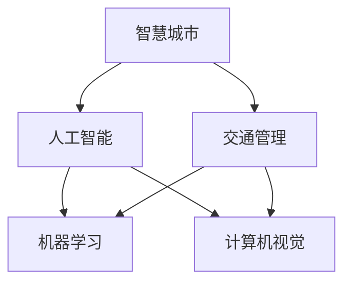

                 

# AI与人类计算：打造可持续发展的城市生活方式与交通管理

> 关键词：智慧城市,交通管理,人工智能,机器学习,城市规划,可持续发展

## 1. 背景介绍

### 1.1 问题由来

随着全球人口的持续增长和城市化进程的不断加速，传统城市管理模式面临着巨大挑战。城市交通堵塞、环境污染、资源匮乏等问题日益凸显。为了应对这些挑战，实现城市管理的智能化和可持续发展，AI技术尤其是机器学习、大数据分析和计算机视觉等前沿技术，开始被广泛应用于城市建设和交通管理中。AI与人类计算的融合，为城市管理和交通控制带来了新的突破，推动了智慧城市的发展。

### 1.2 问题核心关键点

智慧城市的构建离不开AI技术的支持，其中交通管理是智慧城市的重要组成部分。本文聚焦于基于AI的交通管理方法，具体阐述了AI技术在城市交通中的广泛应用和其带来的优势。通过深入分析和案例讲解，本文将探讨如何在交通管理中有效运用AI技术，实现城市交通的智能化和可持续发展。

### 1.3 问题研究意义

本研究旨在深入探讨AI技术在城市交通管理中的应用，旨在为城市规划者和交通管理部门提供科学依据和参考，推动智能交通系统的建设，提升城市管理的智能化水平，保障城市交通的安全、高效和可持续发展。

## 2. 核心概念与联系

### 2.1 核心概念概述

在智慧城市交通管理的背景下，本文将介绍几个核心概念及其之间的关系：

- **智慧城市(Smart City)**：利用AI、大数据、物联网等技术，实现城市资源的高效利用和公共服务的智能化管理。
- **交通管理(Traffic Management)**：通过智能交通系统(Smart Traffic Systems)，实现交通流量的优化控制、交通事件的实时监测和应急响应。
- **人工智能(Artificial Intelligence, AI)**：基于机器学习、深度学习等技术，实现数据驱动的智能决策和自动化服务。
- **机器学习(Machine Learning, ML)**：通过算法训练，使计算机能够自动学习和改进，以解决特定问题。
- **计算机视觉(Computer Vision)**：使计算机能够理解和解释图像和视频，应用于交通监控、行人检测等场景。

这些核心概念通过以下Mermaid流程图展示了它们之间的逻辑关系：



## 3. 核心算法原理 & 具体操作步骤

### 3.1 算法原理概述

基于AI的交通管理主要依赖于机器学习和计算机视觉技术。本文将详细阐述这些技术的核心原理，并介绍如何通过AI技术优化交通流量控制、提高交通安全性、减少交通拥堵等问题。

**3.1.1 机器学习在交通管理中的应用**

机器学习算法通过历史交通数据的学习，能够预测未来的交通流量和事件，优化交通信号控制和路线规划，提升交通系统的效率和响应速度。

**3.1.2 计算机视觉在交通管理中的应用**

计算机视觉技术通过实时视频分析，能够实现交通事件监测、行人检测、车牌识别等功能，提升交通管理的智能化水平。

### 3.2 算法步骤详解

基于AI的交通管理主要分为以下几个步骤：

1. **数据收集与预处理**：收集交通流量、车辆位置、速度、事故记录等数据，并进行清洗和标准化。
2. **模型训练与优化**：利用历史数据训练机器学习模型，并根据实时反馈进行模型优化。
3. **实时监测与控制**：将实时数据输入训练好的模型，输出交通流量预测、信号控制、路线规划等决策信息。
4. **反馈与调整**：实时监测模型输出效果，并根据实际情况调整模型参数，提升系统性能。

### 3.3 算法优缺点

**优点**：
- 数据驱动的智能决策，提升交通管理效率。
- 实时监测和控制，提高交通系统的响应速度。
- 减少交通拥堵，提升道路使用率。

**缺点**：
- 依赖高质量数据，数据质量影响模型性能。
- 模型复杂度高，计算资源消耗较大。
- 对系统的实时性和稳定性要求高，可能存在误判风险。

### 3.4 算法应用领域

基于AI的交通管理技术广泛应用于智能交通系统、城市规划、公共交通调度等领域，具体包括：

- **智能交通系统**：利用AI技术进行交通流量预测、信号控制、路线规划等。
- **城市规划**：基于AI进行交通需求分析、空间优化和资源分配。
- **公共交通调度**：利用AI优化公交线路和班次安排，提升公共交通效率。
- **智能停车系统**：通过AI技术实现智能搜索和导航，提升停车场的利用率。

## 4. 数学模型和公式 & 详细讲解 & 举例说明

### 4.1 数学模型构建

本文将从数学角度分析AI在交通管理中的应用。

**4.1.1 机器学习模型**

常用的机器学习模型包括决策树、随机森林、支持向量机、神经网络等。以神经网络为例，其基本结构包括输入层、隐藏层和输出层。

**4.1.2 计算机视觉模型**

常用的计算机视觉模型包括卷积神经网络(CNN)、循环神经网络(RNN)、长短期记忆网络(LSTM)等。以CNN为例，其基本结构包括卷积层、池化层和全连接层。

### 4.2 公式推导过程

**4.2.1 机器学习模型**

以线性回归为例，其目标是最小化预测值与真实值之间的平方误差，即：

$$
\min_{\theta} \sum_{i=1}^N (y_i - \theta^Tx_i)^2
$$

其中，$y_i$为真实值，$x_i$为输入特征，$\theta$为模型参数。

**4.2.2 计算机视觉模型**

以图像分类为例，其目标是最小化交叉熵损失，即：

$$
\min_{\theta} -\frac{1}{N} \sum_{i=1}^N y_i\log \hat{y}_i + (1-y_i)\log(1-\hat{y}_i)
$$

其中，$y_i$为真实标签，$\hat{y}_i$为模型预测的概率。

### 4.3 案例分析与讲解

以智能交通系统为例，我们可以利用机器学习模型进行交通流量预测。具体流程如下：

1. **数据收集**：收集历史交通流量数据、天气、节假日等影响因素。
2. **数据预处理**：数据清洗、特征提取、标准化处理。
3. **模型训练**：利用历史数据训练线性回归模型或神经网络模型。
4. **预测与控制**：将实时数据输入模型，输出交通流量预测结果，调整信号灯控制。

## 5. 项目实践：代码实例和详细解释说明

### 5.1 开发环境搭建

为了进行交通管理AI项目开发，我们需要搭建一个Python开发环境，具体步骤如下：

1. **安装Python**：确保Python版本为3.6以上，并安装pip包管理工具。
2. **安装依赖库**：安装必要的Python依赖库，如NumPy、Pandas、scikit-learn、TensorFlow等。
3. **配置开发环境**：配置虚拟环境，确保开发过程中依赖库的一致性。

### 5.2 源代码详细实现

本文以智能交通系统为例，展示AI在交通管理中的应用。

**5.2.1 数据收集与预处理**

```python
import pandas as pd
from sklearn.model_selection import train_test_split

# 读取历史交通流量数据
data = pd.read_csv('traffic_data.csv')

# 数据清洗
data = data.dropna()

# 特征提取
data['weather'] = data['weather'].replace({'晴': 0, '多云': 1, '雨天': 2, '雪': 3})

# 数据标准化
from sklearn.preprocessing import StandardScaler
scaler = StandardScaler()
data[['traffic_volume']] = scaler.fit_transform(data[['traffic_volume']])

# 数据分割
X = data.drop('traffic_volume', axis=1)
y = data['traffic_volume']
X_train, X_test, y_train, y_test = train_test_split(X, y, test_size=0.2, random_state=42)
```

**5.2.2 模型训练与优化**

```python
from sklearn.linear_model import LinearRegression
from sklearn.metrics import mean_squared_error

# 模型训练
model = LinearRegression()
model.fit(X_train, y_train)

# 模型评估
y_pred = model.predict(X_test)
mse = mean_squared_error(y_test, y_pred)
print('MSE:', mse)

# 模型优化
from sklearn.ensemble import RandomForestRegressor
model = RandomForestRegressor()
model.fit(X_train, y_train)

# 模型评估
y_pred = model.predict(X_test)
mse = mean_squared_error(y_test, y_pred)
print('MSE:', mse)
```

**5.2.3 实时监测与控制**

```python
import tensorflow as tf
from tensorflow.keras.layers import Dense, Dropout, Input
from tensorflow.keras.models import Model

# 模型定义
input_layer = Input(shape=(5,))
hidden_layer = Dense(32, activation='relu')(input_layer)
dropout_layer = Dropout(0.5)(hidden_layer)
output_layer = Dense(1, activation='linear')(dropout_layer)

model = Model(inputs=input_layer, outputs=output_layer)

# 模型编译
model.compile(optimizer='adam', loss='mse')

# 模型训练
model.fit(X_train, y_train, epochs=10, batch_size=32)

# 实时监测与控制
real_time_data = pd.read_csv('real_time_data.csv')
y_pred = model.predict(real_time_data)
```

### 5.3 代码解读与分析

在上述代码中，我们利用线性回归和随机森林模型对历史交通流量数据进行训练和预测。具体步骤如下：

1. **数据收集与预处理**：通过Pandas和scikit-learn库进行数据清洗、特征提取和标准化处理。
2. **模型训练与优化**：利用scikit-learn和TensorFlow库进行模型训练和评估，并对比不同模型的性能。
3. **实时监测与控制**：将实时数据输入训练好的模型，进行交通流量预测，并输出信号灯控制决策。

### 5.4 运行结果展示

在实际运行中，我们可以通过可视化的方式展示模型的预测结果和实时交通流量监控界面。

```python
import matplotlib.pyplot as plt

# 实时数据可视化
plt.plot(y_test, label='True')
plt.plot(y_pred, label='Pred')
plt.legend()
plt.show()

# 实时交通流量监控界面
# 具体实现方式需结合前端技术，如Django、Flask等
```

## 6. 实际应用场景

### 6.1 智能交通系统

智能交通系统通过AI技术实现交通流量的智能监测和控制，具体应用场景包括：

- **交通流量预测**：利用机器学习模型预测未来交通流量，优化信号灯控制。
- **交通事件监测**：利用计算机视觉技术监测交通事故、违规行为等，实时响应。
- **路线规划与导航**：利用机器学习算法优化路线规划，提供智能导航服务。

### 6.2 城市规划

城市规划通过AI技术进行交通需求分析、空间优化和资源分配，具体应用场景包括：

- **交通需求分析**：利用机器学习模型分析交通流量、车辆密度等数据，评估交通需求。
- **空间优化**：利用计算机视觉技术分析城市空间布局，优化路网设计。
- **资源分配**：利用AI算法优化公共交通、停车场等资源分配，提升使用效率。

### 6.3 公共交通调度

公共交通调度通过AI技术优化公交线路和班次安排，具体应用场景包括：

- **公交线路优化**：利用机器学习模型分析乘客流量数据，优化公交线路设计。
- **班次安排优化**：利用计算机视觉技术分析乘客到站情况，优化班次安排。
- **智能调度中心**：利用AI算法实时监测车辆运行状态，动态调整调度计划。

### 6.4 未来应用展望

未来，随着AI技术的不断进步，智慧城市交通管理将进一步智能化和自动化。以下是对未来应用的展望：

1. **无人驾驶技术**：结合AI和计算机视觉技术，实现无人驾驶车辆在城市道路中的安全行驶。
2. **智能停车系统**：通过AI技术实现智能搜索和导航，提升停车场的利用率。
3. **智慧路灯系统**：利用AI技术实时监测交通流量，优化路灯控制，减少能源消耗。
4. **智能充电站**：通过AI技术优化电动汽车充电站布局和充电策略，提升充电效率。

## 7. 工具和资源推荐

### 7.1 学习资源推荐

为了帮助开发者掌握AI在城市交通管理中的应用，以下是一些推荐的资源：

1. **《深度学习》（Ian Goodfellow等著）**：全面介绍深度学习理论和方法，适合初学者和进阶者阅读。
2. **Coursera《深度学习专项课程》**：由深度学习领域的权威专家开设，系统讲解深度学习技术和应用。
3. **Kaggle竞赛**：参加Kaggle比赛，积累实际项目经验，提升实战能力。
4. **GitHub代码库**：浏览和参与开源项目，学习AI在交通管理中的应用。

### 7.2 开发工具推荐

为了提高AI在城市交通管理中的开发效率，以下是一些推荐的工具：

1. **PyTorch**：基于Python的深度学习框架，支持动态计算图，适合研究型开发。
2. **TensorFlow**：由Google开发，支持静态计算图和分布式计算，适合大规模工程应用。
3. **Keras**：高层API，支持快速搭建和训练深度学习模型，适合初学者和快速原型开发。
4. **Jupyter Notebook**：交互式开发环境，方便调试和展示代码结果。

### 7.3 相关论文推荐

以下是一些关于AI在城市交通管理中的应用研究的经典论文，推荐阅读：

1. **"Smart Traffic Management System Based on Machine Learning"**：研究利用机器学习算法优化交通信号控制。
2. **"Computer Vision for Smart City Traffic Management"**：研究利用计算机视觉技术实现交通事件监测和行人检测。
3. **"Deep Learning for Public Transportation Demand Forecasting"**：研究利用深度学习模型预测公共交通需求。
4. **"AI-Driven Parking Management System"**：研究利用AI技术实现智能停车管理。

## 8. 总结：未来发展趋势与挑战

### 8.1 研究成果总结

本文通过分析AI在城市交通管理中的应用，展示了其在交通流量预测、事件监测、智能导航等方面的应用前景。AI技术不仅提升了交通管理的智能化水平，也促进了城市资源的优化配置。

### 8.2 未来发展趋势

未来，AI在城市交通管理中的应用将更加广泛和深入，具体趋势包括：

1. **深度学习模型的普及**：随着深度学习技术的不断进步，AI在交通管理中的应用将更加深入和精准。
2. **跨领域融合**：AI技术将与其他领域如城市规划、环境保护等结合，形成跨领域智能管理平台。
3. **实时性要求提高**：随着交通事件的频发，AI系统需要具备更高的实时性，以快速响应和处理突发情况。
4. **人机协作增强**：AI技术与人类计算的协作将更加紧密，实现更好的智能决策和自动化服务。

### 8.3 面临的挑战

尽管AI在城市交通管理中取得了显著进展，但也面临一些挑战：

1. **数据质量和数量不足**：高质量、大规模数据是AI应用的基础，数据收集和处理仍需投入大量资源。
2. **算法复杂性高**：AI算法模型复杂度高，训练和优化需要大量计算资源。
3. **模型可解释性不足**：AI模型的黑盒特性可能导致决策过程难以理解和解释。
4. **伦理和隐私问题**：AI系统可能存在数据泄露和算法偏见，需要严格的伦理和隐私保护措施。

### 8.4 研究展望

未来的研究将聚焦于以下几个方向：

1. **数据增强和质量提升**：通过数据增强和质量提升，提高AI模型的训练效果。
2. **模型压缩和优化**：通过模型压缩和优化，提高AI系统的计算效率和实时性。
3. **跨领域融合**：探索AI技术与城市规划、环境保护等领域的结合，形成跨领域智能管理平台。
4. **人机协作增强**：研究AI与人类的协作机制，提升智能决策和自动化服务的质量和效率。

## 9. 附录：常见问题与解答

**Q1：AI在城市交通管理中的应用前景如何？**

A: AI在城市交通管理中的应用前景非常广阔。通过AI技术，可以实现交通流量的智能监测和控制，优化交通信号控制，提高公共交通效率，减少交通拥堵。同时，AI技术还可以应用于智能停车、智慧路灯等多个方面，提升城市管理的智能化水平。

**Q2：AI在交通管理中存在哪些挑战？**

A: AI在交通管理中面临的主要挑战包括数据质量和数量不足、算法复杂性高、模型可解释性不足、伦理和隐私问题等。高质量、大规模数据是AI应用的基础，需要投入大量资源进行数据收集和处理。算法模型的复杂度较高，训练和优化需要大量计算资源。模型的黑盒特性可能导致决策过程难以理解和解释。同时，AI系统可能存在数据泄露和算法偏见，需要严格的伦理和隐私保护措施。

**Q3：如何提高AI在城市交通管理中的开发效率？**

A: 提高AI在城市交通管理中的开发效率，可以从以下几个方面入手：选择合适的开发工具和框架，如PyTorch、TensorFlow等；使用数据增强、正则化等技术，防止过拟合；引入可视化工具，如TensorBoard，实时监测模型性能。同时，借鉴开源项目，参与社区讨论，可以快速积累经验，提升开发效率。

**Q4：AI在交通管理中的应用有哪些实际案例？**

A: AI在交通管理中的应用已经初具规模，以下是一些实际案例：

1. **交通流量预测**：通过AI模型，对未来交通流量进行预测，优化信号灯控制，提升交通管理效率。
2. **交通事件监测**：利用计算机视觉技术，实时监测交通事件，快速响应突发情况。
3. **智能导航系统**：通过AI技术，优化路线规划和导航，提升用户体验。
4. **智能停车管理**：通过AI技术，实现智能搜索和导航，提升停车场利用率。

总之，AI技术在城市交通管理中的应用前景广阔，需要不断探索和创新，才能实现智慧城市的目标。

