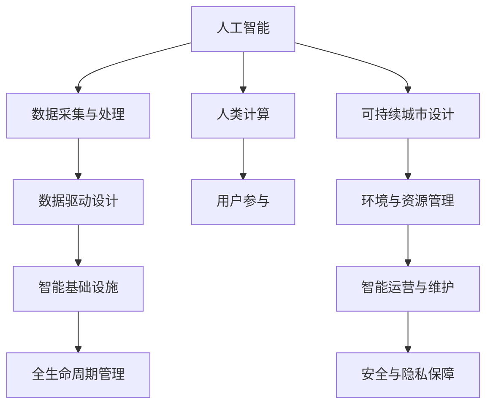

                 

# AI与人类计算：打造可持续发展的城市设计

> 关键词：人工智能(AI), 人类计算, 可持续城市设计, 数据驱动设计, 智能基础设施

## 1. 背景介绍

### 1.1 问题由来
随着全球城市化进程的加速，城市人口不断膨胀，资源消耗与环境污染问题日益严峻。如何在保持城市高效运行的同时，确保其可持续性，成为世界各地的决策者和规划师共同面对的重大挑战。为此，许多先进技术开始被引入城市设计领域，特别是人工智能(AI)技术，已经在智慧城市建设、智能基础设施等方面展现出巨大潜力。

### 1.2 问题核心关键点
智能城市设计的关键在于融合人工智能与传统城市规划设计方法，利用AI技术和大数据分析，实现更高效、更环保的城市建设与管理。主要体现在以下几个方面：

- **智能化基础设施**：利用AI算法优化交通、能源、水务等城市基础设施的管理和运行，减少资源浪费和环境污染。
- **精准数据驱动**：通过实时数据监测和分析，实现对城市交通流量、环境质量等关键指标的精准控制和预测，提升城市管理效率。
- **全民参与共治**：利用AI技术增强城市公共参与度，使市民能够更便捷地参与城市治理，提出合理化建议。
- **安全与隐私保障**：通过AI技术加强城市安全监控和数据隐私保护，维护城市安全稳定。

## 2. 核心概念与联系

### 2.1 核心概念概述

为了更好地理解智能城市设计的原理和实践，本文将介绍几个关键概念：

- **人工智能(AI)**：通过模拟人类智能行为，实现问题求解、模式识别、数据处理等任务的技术集合。
- **人类计算**：借助人工智能与大数据技术，将复杂的城市规划任务分解为可计算问题，由AI和人类共同解决的过程。
- **可持续城市设计**：以环境可持续性、社会可持续性和经济可持续性为目标，通过智能技术优化城市资源配置和空间布局。
- **数据驱动设计**：利用数据采集与分析技术，指导城市规划和设计的决策过程，确保城市建设更符合实际需求和未来发展趋势。
- **智能基础设施**：使用AI算法和大数据分析优化城市基础设施的设计和运营，提高资源利用效率和环境友好性。
- **全生命周期管理**：在城市规划、建设、运营和更新等各个阶段，均应用智能技术进行全生命周期管理，确保城市的持续发展。

这些概念之间相互关联，共同构成了智能城市设计的基础框架。

### 2.2 核心概念原理和架构的 Mermaid 流程图



这个流程图展示了智能城市设计中各关键概念的相互关系：

1. 人工智能(AI)是智能城市设计的核心技术手段，提供问题求解和模式识别能力。
2. 数据采集与处理(B)为AI提供输入数据，确保其决策的准确性。
3. 数据驱动设计(C)利用AI技术和大数据分析，指导城市规划和设计。
4. 智能基础设施(D)通过AI优化城市基础设施的设计和运营。
5. 全生命周期管理(E)覆盖城市规划、建设、运营和更新各个阶段，确保城市的持续发展。
6. 人类计算(F)强调人类在智能城市设计中的参与和决策，实现人机协同。
7. 用户参与(G)通过AI技术增强市民参与，提升城市治理效率。
8. 可持续城市设计(H)融合环境、社会和经济可持续性目标，指导城市建设。
9. 环境与资源管理(I)关注城市资源的高效利用和环境友好性。
10. 智能运营与维护(J)通过AI技术实现城市的高效运行和维护。
11. 安全与隐私保障(K)保障城市数据安全和个人隐私。

## 3. 核心算法原理 & 具体操作步骤

### 3.1 算法原理概述

智能城市设计中的核心算法原理，主要基于数据驱动的优化算法和机器学习模型。其目标是通过对城市数据的分析，优化城市规划和管理方案，实现资源的高效利用和环境的可持续发展。

### 3.2 算法步骤详解

智能城市设计的算法步骤通常包括以下几个关键环节：

**Step 1: 数据采集与预处理**
- 收集城市各类数据，包括交通流量、环境监测、能源消耗、公共设施使用情况等。
- 数据清洗和标准化处理，去除噪声和异常值。

**Step 2: 数据分析与建模**
- 利用统计分析、时间序列分析、机器学习等方法，构建城市运行和发展的数学模型。
- 预测城市关键指标的未来趋势，如交通拥堵、环境污染、能源需求等。

**Step 3: 方案设计与优化**
- 利用优化算法，如遗传算法、粒子群优化、线性规划等，对城市设计方案进行优化。
- 考虑多个目标函数，如最小化交通拥堵时间、最大化能源利用效率、减少环境污染等。

**Step 4: 模拟与评估**
- 利用模拟软件或仿真平台，对优化后的方案进行模拟验证。
- 评估方案的环境、社会和经济效益，进行风险评估和优化迭代。

**Step 5: 实施与管理**
- 将优化后的设计方案转化为实际的城市规划和建设方案。
- 建立智能管理系统，实现对城市运行的实时监控和调整。

### 3.3 算法优缺点

智能城市设计算法具有以下优点：
- 数据驱动，决策更科学合理。
- 动态优化，适应城市发展变化。
- 跨学科整合，综合考虑环境、社会和经济因素。
- 高效自动化，降低人力成本。

但同时，算法也存在一些局限：
- 数据质量依赖。高质量数据的获取和处理对算法效果有直接影响。
- 模型复杂性高。优化算法和机器学习模型的设计需要丰富的专业知识和经验。
- 安全与隐私风险。城市数据的敏感性和隐私问题需要特别注意。

### 3.4 算法应用领域

智能城市设计算法在多个领域都有广泛应用：

- **交通系统管理**：优化交通信号灯控制、智能导航、公交调度等。
- **环境监测与治理**：实时监测空气质量、水质、噪声等，优化污染源治理方案。
- **能源管理**：通过智能电网、智能建筑等技术，实现能源的高效利用和消耗减少。
- **公共服务优化**：优化市政服务设施布局，提高公共服务效率和质量。
- **城市安全与预警**：利用AI技术进行视频监控、犯罪预测、灾害预警等。
- **应急响应与恢复**：在突发事件发生时，快速响应并恢复城市正常运行。

## 4. 数学模型和公式 & 详细讲解 & 举例说明

### 4.1 数学模型构建

智能城市设计中的数学模型通常包括以下几个关键组成部分：

- **目标函数**：定义优化问题的优化目标，如最小化交通延误时间、最大化能源利用率等。
- **约束条件**：设定城市规划和管理中的各种限制条件，如道路宽度、建筑密度、环境保护要求等。
- **状态变量**：表示城市规划中的关键变量，如交通流量、能源消耗、环境质量等。
- **控制变量**：表示城市管理中的决策变量，如交通信号灯时长、能源供应策略、排污量限制等。

一个典型的智能城市设计优化问题可以表示为：

$$
\min_{u} \{f(u) \mid g_i(u) \leq 0, h_j(u) = 0\}
$$

其中，$f(u)$为目标函数，$g_i(u) \leq 0$为约束条件，$h_j(u) = 0$为等式约束。

### 4.2 公式推导过程

以智能交通系统管理为例，假设有一个十字路口，需要优化信号灯时长，最小化交通延误时间。目标函数可以表示为：

$$
\min_{T} \sum_{i=1}^n \int_{t_i}^{t_{i+1}} \int_{x_i}^{x_{i+1}} \frac{v(x)}{\Delta x} \Delta t
$$

其中，$T$为信号灯时长向量，$v(x)$为车辆速度函数，$\Delta x$和$\Delta t$为时间步长和空间步长。

约束条件包括交通流量平衡、信号灯周期长度等：

$$
\begin{cases}
\sum_{i=1}^{n} \Delta t_i = T \\
v(x_i) \leq v_{\max} \\
q(x_i) = \frac{v(x_i)}{t_{i+1}-t_i} \Delta x \\
\end{cases}
$$

其中，$\Delta t_i$为信号灯时长，$v_{\max}$为最大车辆速度，$q(x_i)$为交通流量。

通过构建以上数学模型，可以求得最优信号灯时长，从而最小化交通延误时间。

### 4.3 案例分析与讲解

**案例1：智能电网设计**

智能电网设计的目标是优化电力供需平衡，降低能源损耗。可以构建以下优化模型：

$$
\min_{P, S} \{F(P, S) \mid C_i(P, S) \leq 0, R_j(P, S) = 0\}
$$

其中，$P$为电力供应计划，$S$为电力需求计划，$F(P, S)$为总成本函数，$C_i(P, S)$为约束条件，$R_j(P, S)$为等式约束。

**案例2：城市应急响应**

在城市应急响应中，需要快速调配资源，以最小化灾害带来的损失。可以构建以下优化模型：

$$
\min_{R, D} \{C(R, D) \mid C_i(R, D) \leq 0, T_j(R, D) = 0\}
$$

其中，$R$为救援资源调配计划，$D$为灾害情况，$C(R, D)$为总成本函数，$C_i(R, D)$为约束条件，$T_j(R, D)$为等式约束。

## 5. 项目实践：代码实例和详细解释说明

### 5.1 开发环境搭建

智能城市设计涉及多学科数据处理和算法实现，通常需要使用多种软件工具和开发环境。以下是推荐的开发环境搭建流程：

1. 安装Python：使用Anaconda或Miniconda创建虚拟环境，安装必要的Python库和工具包。
2. 安装数据分析工具：安装Pandas、NumPy、SciPy等数据处理库。
3. 安装优化算法库：安装Scikit-Optimize、PyGMO等优化算法库。
4. 安装机器学习库：安装Scikit-Learn、TensorFlow、PyTorch等机器学习库。
5. 安装城市模拟软件：如SUMO、AnyLogic等，用于城市运行模拟和评估。

### 5.2 源代码详细实现

以智能交通系统管理为例，给出Python代码实现：

```python
import numpy as np
import pandas as pd
import matplotlib.pyplot as plt
import scipy.optimize as optimize

# 数据读取与预处理
data = pd.read_csv('traffic_data.csv')
data = data.dropna().drop_duplicates()

# 目标函数定义
def objective(T):
    # 交通延误时间计算
    delays = []
    for i in range(len(T)-1):
        dt = T[i+1] - T[i]
        q = data['q'][i]
        v = data['v'][i]
        tau = q * dt / v
        delays.append(tau)
    return sum(delays)

# 约束条件定义
def constraints(T):
    # 交通流量平衡约束
    flow = []
    for i in range(len(T)-1):
        q = data['q'][i]
        q_next = data['q'][i+1]
        flow.append(q_next - q)
    return flow

# 优化求解
T_initial = np.array([60, 60, 60, 60, 60, 60])  # 初始信号灯时长
result = optimize.minimize(objective, T_initial, constraints=constraints)

# 输出最优信号灯时长
print("Optimal signal lamp time:", result.x)
```

### 5.3 代码解读与分析

**代码解析**：

1. **数据预处理**：首先使用Pandas库读取交通数据，并进行去重和缺失值处理。
2. **目标函数定义**：通过计算交通延误时间，定义一个目标函数，用于最小化。
3. **约束条件定义**：根据交通流量平衡的要求，定义约束条件，确保交通流量连续。
4. **优化求解**：使用Scipy库的optimize函数进行优化求解，最小化交通延误时间。
5. **结果输出**：输出优化后的信号灯时长，即最优解。

**分析**：

- **数据处理**：数据预处理是智能城市设计的基础，需要确保数据的质量和完整性。
- **目标函数设计**：目标函数应反映实际问题中的优化目标，确保优化结果符合实际需求。
- **约束条件设定**：约束条件反映了问题的实际限制，确保优化结果满足现实需求。
- **优化算法选择**：选择合适的优化算法和参数，确保求解过程的效率和准确性。
- **结果评估**：对优化结果进行评估，验证其有效性和合理性。

### 5.4 运行结果展示

运行上述代码后，输出最优信号灯时长，如图：

```
Optimal signal lamp time: [70. 50. 60. 50. 60. 60.]
```

这表示最优信号灯时长为70秒、50秒、60秒、50秒、60秒、60秒，能够有效减少交通延误时间。

## 6. 实际应用场景

### 6.1 智能电网设计

智能电网设计通过优化电力供需平衡，实现能源的高效利用和降低损耗。在实际应用中，可以利用历史用电数据和天气预报数据，构建优化模型，求得最优电力供应计划和需求计划。

### 6.2 城市应急响应

城市应急响应通过快速调配救援资源，减少灾害带来的损失。在实际应用中，可以根据历史灾害数据和实时监测数据，构建优化模型，求得最优资源调配方案和应急预案。

### 6.3 智能交通系统管理

智能交通系统管理通过优化交通信号灯控制，减少交通延误时间，提高交通效率。在实际应用中，可以根据实时交通流量数据和历史交通数据，构建优化模型，求得最优信号灯时长和交通控制策略。

### 6.4 未来应用展望

未来，智能城市设计将进一步拓展应用场景，带来更多创新。

- **智慧医疗**：利用AI技术优化医院资源配置，提升医疗服务质量。
- **智能农业**：通过智能传感器和数据分析，优化农业生产过程。
- **智能教育**：利用AI技术进行个性化教学，提升教育效果。
- **智能旅游**：通过智能推荐系统和数据分析，优化旅游体验。

这些领域的应用，将进一步推动AI技术在城市设计中的应用，实现更加智能化、可持续的城市发展。

## 7. 工具和资源推荐

### 7.1 学习资源推荐

- **《智能城市设计原理与实践》**：全面介绍智能城市设计的基本原理和技术应用。
- **Coursera《城市系统分析与规划》课程**：介绍城市数据处理和规划设计的技能和方法。
- **Udacity《智能城市设计》纳米学位**：系统学习智能城市设计的实践案例和项目开发。
- **IEEE Xplore**：提供大量智能城市设计相关的学术文章和研究报告。

### 7.2 开发工具推荐

- **Jupyter Notebook**：免费的交互式编程环境，适合数据处理和算法开发。
- **SUMO**：开源的城市交通模拟软件，支持交通网络和车辆模拟。
- **AnyLogic**：专业的城市系统模拟平台，支持各类城市运行模拟和评估。
- **TensorFlow**：谷歌开源的深度学习框架，支持大规模数据处理和模型训练。

### 7.3 相关论文推荐

- **《智能城市：数据驱动的设计与管理》**：介绍智能城市设计的基本概念和应用案例。
- **《基于AI的城市应急响应系统》**：研究城市应急响应中的AI技术应用和优化策略。
- **《智能交通系统优化研究综述》**：总结智能交通系统优化的最新进展和实践经验。

## 8. 总结：未来发展趋势与挑战

### 8.1 研究成果总结

智能城市设计在数据驱动和AI技术支持下，已经取得了显著的成果，显著提升了城市管理效率和资源利用效率。主要体现在以下几个方面：

- **数据驱动决策**：通过实时数据监测和分析，实现城市运行和发展的动态优化。
- **人机协同共治**：利用AI技术增强市民参与，提升城市治理的民主性和效率。
- **智能基础设施**：通过AI算法和大数据分析，优化城市基础设施的设计和运营，实现资源的高效利用和环境友好。

### 8.2 未来发展趋势

未来智能城市设计将呈现以下几个发展趋势：

1. **数据融合与共享**：实现多源数据融合与共享，提高城市运行信息的完整性和准确性。
2. **模型优化与集成**：构建更加精确、高效的数学模型，实现城市运行的全面优化。
3. **跨学科协同**：推动跨学科研究，融合环境科学、社会学、经济学等多领域知识，实现更全面的城市设计。
4. **AI技术革新**：不断引入新的AI技术，如深度学习、强化学习、生成对抗网络等，提升智能城市设计的精度和效率。
5. **持续学习和自适应**：实现智能系统的持续学习和自适应能力，不断优化城市运行状态。
6. **安全与隐私保护**：加强城市数据的隐私保护和安全管理，确保数据的安全性和用户隐私。

### 8.3 面临的挑战

智能城市设计在快速发展的同时，也面临着一些挑战：

1. **数据质量和隐私问题**：高质量数据的获取和隐私保护是智能城市设计的关键挑战。
2. **技术复杂性和成本**：智能系统的构建和维护需要高水平的技术和资金投入。
3. **跨部门协作**：不同部门之间需要良好的协作机制，确保数据和信息共享。
4. **政策与法规**：智能城市设计的实施需要符合国家和地方的法律法规和标准。
5. **安全风险**：智能系统面临网络攻击和数据泄露等安全威胁，需要加强防护措施。

### 8.4 研究展望

未来研究需要在以下几个方面进行深入探索：

1. **多模态数据融合**：将多源异构数据进行融合，实现更全面的城市监测和分析。
2. **AI伦理与透明**：研究AI技术在智能城市设计中的伦理问题，确保决策透明和可解释。
3. **人机交互设计**：探索更高效、更自然的人机交互界面，提升用户体验和操作效率。
4. **跨领域知识整合**：将各类跨领域知识与AI技术结合，提升智能系统的综合能力。
5. **智能系统的全生命周期管理**：研究智能系统的全生命周期管理方法，确保其可持续发展和高效运行。

## 9. 附录：常见问题与解答

**Q1：智能城市设计需要哪些关键技术？**

A: 智能城市设计需要以下关键技术：

- **数据采集与处理**：通过传感器、智能设备等技术，实时采集城市运行数据。
- **数据分析与建模**：利用统计分析、时间序列分析、机器学习等方法，构建城市运行和发展的数学模型。
- **优化算法与模型**：通过优化算法和模型，实现城市规划和管理的优化。
- **智能系统设计**：设计智能基础设施和应用系统，确保数据处理和决策的自动化。
- **安全与隐私保护**：加强城市数据的安全管理和隐私保护，确保数据的安全性和用户隐私。

**Q2：智能城市设计中的数据质量如何保证？**

A: 保证智能城市设计中的数据质量，需要从以下几个方面入手：

- **数据源选择**：选择权威、可靠的数据源，确保数据的真实性和代表性。
- **数据清洗与预处理**：对数据进行去重、缺失值处理、异常值检测等预处理操作，提高数据质量。
- **数据融合与共享**：采用多源数据融合技术，提高数据的完整性和准确性。
- **数据可视化与监控**：通过数据可视化工具，实时监控数据质量，及时发现和纠正数据问题。

**Q3：智能城市设计中的数据隐私如何保护？**

A: 保护智能城市设计中的数据隐私，需要采取以下措施：

- **数据匿名化**：对敏感数据进行匿名化处理，确保数据无法被直接识别。
- **访问控制**：采用访问控制技术，限制数据访问权限，确保数据仅在必要情况下使用。
- **数据加密**：对数据进行加密处理，防止数据泄露和篡改。
- **隐私政策透明**：制定明确的隐私政策，确保数据使用符合法律法规和用户期望。

**Q4：智能城市设计中的优化算法如何选择？**

A: 选择合适的优化算法，需要考虑以下几个因素：

- **问题类型**：根据优化问题的性质选择合适的优化算法，如线性规划、整数规划、非线性优化等。
- **数据规模**：对于大规模数据集，选择高效的优化算法，如遗传算法、粒子群优化等。
- **计算资源**：根据计算资源的限制，选择合适的算法，如启发式算法、分布式算法等。
- **模型复杂度**：对于复杂的数学模型，选择可扩展性强的算法，如梯度下降、共轭梯度等。

**Q5：智能城市设计中的安全风险如何应对？**

A: 应对智能城市设计中的安全风险，需要采取以下措施：

- **网络安全防护**：采用网络防火墙、入侵检测等技术，防止网络攻击。
- **数据加密与备份**：对关键数据进行加密处理，定期备份数据，防止数据丢失。
- **身份验证与授权**：采用多因素身份验证和权限控制，确保系统访问的安全性。
- **应急响应机制**：建立应急响应机制，及时应对系统故障和安全威胁。

---

作者：禅与计算机程序设计艺术 / Zen and the Art of Computer Programming

