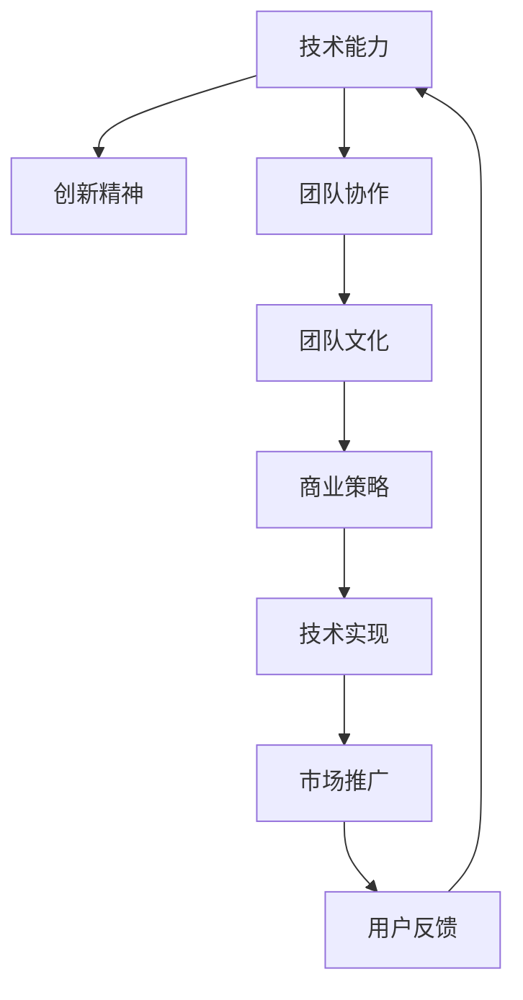

                 

# AI创业的团队文化：Lepton AI的人才理念

> 关键词：AI创业、团队文化、人才理念、Lepton AI

## 1. 背景介绍

### 1.1 问题由来
在当今这个数据驱动、技术为王的时代，人工智能（AI）已经逐渐从实验室走向实际应用，AI创业公司也如雨后春笋般涌现。然而，AI创业并非只是技术上的突破，更是团队文化和管理理念的不断演进。优秀的团队文化和管理理念，往往能够帮助企业快速积累人才，培养创新思维，构建可持续发展的商业模式。Lepton AI作为一家致力于人工智能领域的创业公司，其人才理念和团队文化在业界广受赞誉，本文将深入探讨Lepton AI的人才理念及其背后的逻辑。

### 1.2 问题核心关键点
Lepton AI的人才理念强调三个核心点：技术能力、创新精神和团队协作。技术能力是基础，创新精神是驱动，团队协作则是实现目标的关键。这三个要素相互交织，共同构成了Lepton AI的人才理念。

1. **技术能力**：团队成员需要具备强大的技术背景和问题解决能力，这是支撑Lepton AI技术创新的根本。
2. **创新精神**：鼓励团队成员敢于打破常规，不断探索新的技术路径和解决方案，推动Lepton AI产品和技术走在行业前列。
3. **团队协作**：重视团队成员之间的沟通和协作，通过跨部门协作，整合多领域知识，共同推动Lepton AI项目的成功实施。

## 2. 核心概念与联系

### 2.1 核心概念概述

Lepton AI的人才理念由三个关键概念组成：

- **技术能力**：指团队成员在人工智能、机器学习、数据科学等领域具备的专业知识和技能。
- **创新精神**：指团队成员敢于提出新想法，勇于尝试新技术，持续改进和优化产品的能力。
- **团队协作**：指团队成员之间的沟通、合作和共享，共同解决问题，实现目标。

### 2.2 核心概念原理和架构的 Mermaid 流程图(Mermaid 流程节点中不要有括号、逗号等特殊字符)

这个流程图展示了Lepton AI的人才理念如何通过技术能力、创新精神和团队协作三个核心要素，共同塑造公司文化，推动商业策略和技术实现的协同发展。

## 3. 核心算法原理 & 具体操作步骤

### 3.1 算法原理概述

Lepton AI的人才理念并不是一种算法或技术，而是一种企业文化和管理策略。其核心在于通过技术能力、创新精神和团队协作三个维度的协同，构建一个有利于人才成长和业务发展的环境。

### 3.2 算法步骤详解

Lepton AI的人才理念主要通过以下几个步骤来实现：

**Step 1: 评估技术能力**

- 制定技术评估标准，包括编程能力、算法理解、项目经验等。
- 通过面试、笔试、项目评审等多种方式评估候选人的技术水平。

**Step 2: 培养创新精神**

- 设立创新奖励机制，对提出新想法、解决复杂问题的团队成员给予奖励。
- 组织定期的创新分享会，鼓励团队成员分享自己的创新成果和心得。

**Step 3: 促进团队协作**

- 设立跨部门项目组，促进不同领域的知识共享和协作。
- 定期组织团队建设活动，增强团队凝聚力和合作意识。

### 3.3 算法优缺点

Lepton AI的人才理念具有以下优点：

- **提升技术水平**：通过严格的技术评估，确保团队成员具备强大的技术能力。
- **激发创新活力**：鼓励创新，激发团队成员的创造力，推动技术进步。
- **增强团队凝聚力**：通过团队建设和文化引导，增强团队成员的归属感和协作精神。

同时，这种理念也存在一些缺点：

- **高要求**：对团队成员的技术水平和创新能力要求较高，可能难以吸引和留住基础能力不足的人才。
- **文化压力**：高强度的工作压力和创新要求，可能对某些团队成员造成较大心理负担。

### 3.4 算法应用领域

Lepton AI的人才理念不仅适用于AI创业公司，也可以应用于任何需要高技术水平、创新能力和团队协作的组织。其核心在于通过企业文化和管理策略，构建一个有利于人才成长和业务发展的环境。

## 4. 数学模型和公式 & 详细讲解 & 举例说明

由于Lepton AI的人才理念是一种管理策略，而不是数学模型，因此本节不涉及数学公式的推导和讲解。然而，我们可以使用类比的方式，通过一个简单的数学模型来类比解释这种理念。

假设一个团队由多个成员组成，每个成员的技术能力、创新精神和团队协作能力可以用三个数值表示。设技术能力为$A$，创新精神为$B$，团队协作为$C$。假设$A$、$B$、$C$的取值范围均为0到1，且$A$、$B$、$C$的值越高，代表团队成员在该领域的水平越高。

Lepton AI的人才理念可以表示为：

$$
\text{团队表现} = A \times B \times C
$$

其中$\times$表示乘积，因为Lepton AI认为这三个核心要素是相互补充的，只有三者共同发挥作用，才能实现最佳团队表现。

## 5. 项目实践：代码实例和详细解释说明

由于Lepton AI的人才理念是一种管理策略，而不是具体的技术实现，因此本节不涉及代码实例。然而，我们可以设想一些类比示例来说明如何应用这种理念。

假设Lepton AI正在开发一个新的AI产品，团队成员来自不同的部门，包括数据科学家、算法工程师和软件工程师。团队领导者可以通过以下方式实现Lepton AI的人才理念：

1. **技术评估**：
   - 在项目初期，进行技术评估，确保每个团队成员具备相应的技术背景。
   - 使用在线测试和项目评审，评估成员的编程能力、算法理解等。

2. **创新奖励**：
   - 设立创新奖励机制，鼓励成员提出新的解决方案。
   - 定期组织创新分享会，分享新想法和成功案例。

3. **团队协作**：
   - 组建跨部门项目组，促进数据科学家、算法工程师和软件工程师的协作。
   - 定期组织团队建设活动，增强团队凝聚力。

## 6. 实际应用场景

### 6.1 智能客服系统

Lepton AI的人才理念在智能客服系统的构建中得到了广泛应用。智能客服系统需要处理大量的用户咨询，并快速响应用户需求。通过团队成员的技术能力、创新精神和团队协作，Lepton AI能够构建一个高效、准确的智能客服系统。

**应用实例**：

- **技术能力**：数据科学家通过自然语言处理技术，提取用户咨询中的关键信息。
- **创新精神**：算法工程师不断优化算法模型，提高系统响应速度和准确率。
- **团队协作**：客服团队成员密切配合，确保知识库的及时更新和问题解答的准确性。

### 6.2 金融舆情监测

金融舆情监测需要实时分析大量新闻、评论等文本数据，快速识别市场动向，为金融机构提供决策支持。Lepton AI通过其人才理念，构建了一个高效、准确的金融舆情监测系统。

**应用实例**：

- **技术能力**：数据科学家通过机器学习算法，提取舆情文本中的关键信息。
- **创新精神**：算法工程师不断改进算法模型，提高舆情监测的实时性和准确性。
- **团队协作**：分析师和工程师紧密合作，确保舆情监测结果的及时性和可靠性。

### 6.3 个性化推荐系统

个性化推荐系统需要根据用户的历史行为和兴趣，推荐最符合用户需求的产品或服务。Lepton AI通过其人才理念，构建了一个高效、个性化的推荐系统。

**应用实例**：

- **技术能力**：算法工程师通过深度学习模型，分析用户行为数据，提取用户兴趣特征。
- **创新精神**：数据科学家不断改进算法模型，提高推荐系统的个性化程度。
- **团队协作**：产品团队和工程师紧密合作，确保推荐系统能够持续优化和升级。

### 6.4 未来应用展望

随着AI技术的不断进步，Lepton AI的人才理念将应用于更多领域，为各行各业带来新的创新和变革。

- **医疗领域**：通过AI技术辅助医生诊断和治疗，提高医疗服务的效率和质量。
- **教育领域**：通过个性化推荐系统，提升在线教育的效果和用户体验。
- **智能制造**：通过AI技术优化生产流程，提高制造业的自动化和智能化水平。

## 7. 工具和资源推荐

### 7.1 学习资源推荐

1. **Lepton AI官方博客**：Lepton AI定期在官方博客上分享最新的技术进展、团队文化和业务动态，值得关注和学习。
2. **AI创业论坛**：如GitHub、Stack Overflow等平台，可以了解AI创业公司的人才招聘、团队建设和管理经验。
3. **《AI创业指南》书籍**：由Lepton AI团队成员编写，详细介绍AI创业公司的管理经验和技术实践，非常实用。

### 7.2 开发工具推荐

1. **GitHub**：Lepton AI的代码托管平台，可以了解Lepton AI的技术栈和项目实践。
2. **Jupyter Notebook**：Lepton AI常用的开发工具，支持代码编写、运行和分享。
3. **Google Colab**：Lepton AI常用的在线开发环境，支持GPU加速，方便快速迭代实验。

### 7.3 相关论文推荐

1. **《AI创业公司的团队建设与管理》**：详细探讨了AI创业公司的团队建设和管理策略，包括Lepton AI的人才理念。
2. **《人工智能创业的商业模式》**：分析了AI创业公司的商业模式和市场策略，对Lepton AI的发展有借鉴意义。
3. **《人工智能创业公司的人才招聘与培养》**：介绍了AI创业公司的人才招聘和培养经验，对Lepton AI的人才管理有参考价值。

## 8. 总结：未来发展趋势与挑战

### 8.1 研究成果总结

Lepton AI的人才理念通过技术能力、创新精神和团队协作三个核心要素，构建了一个有利于人才成长和业务发展的环境。这种理念帮助Lepton AI在AI创业竞争中占据了领先地位，成为业界的标杆。

### 8.2 未来发展趋势

未来，Lepton AI的人才理念将在更多领域得到应用，推动AI技术的创新和发展。

- **多领域应用**：Lepton AI的人才理念将拓展到医疗、教育、智能制造等多个领域，促进各行各业的数字化转型。
- **技术融合**：Lepton AI的人才理念将与其他AI技术（如自然语言处理、机器视觉等）深度融合，推动AI技术的全面发展。
- **人才引进**：Lepton AI将继续引进和培养更多优秀人才，构建更具竞争力的技术团队。

### 8.3 面临的挑战

尽管Lepton AI的人才理念在实践中取得了显著成效，但在不断发展的过程中，也面临着一些挑战。

- **技术壁垒**：AI技术的快速发展，对Lepton AI的人才引进和培养提出了更高要求。
- **市场竞争**：随着AI创业公司的增多，市场竞争日益激烈，Lepton AI需要不断创新和优化管理策略。
- **团队管理**：如何平衡团队成员的工作压力和创新激情，保持团队的活力和凝聚力，是Lepton AI需要持续关注的重点。

### 8.4 研究展望

未来，Lepton AI将继续深化其人才理念，探索更多AI创业公司的管理经验和最佳实践，推动AI技术在更多领域的落地应用。

- **跨领域合作**：Lepton AI将加强与科研机构、企业的合作，推动AI技术的跨领域应用和创新。
- **人才引进策略**：通过更灵活的人才引进策略，吸引和留住更多的优秀人才。
- **企业文化建设**：构建更加包容、开放的企业文化，促进团队成员的创新和协作。

## 9. 附录：常见问题与解答

**Q1: Lepton AI的人才理念具体包括哪些方面？**

A: Lepton AI的人才理念主要包括以下三个方面：
1. **技术能力**：强调团队成员在人工智能、机器学习等领域具备的专业知识和技能。
2. **创新精神**：鼓励团队成员敢于提出新想法，勇于尝试新技术。
3. **团队协作**：重视团队成员之间的沟通和协作，促进跨部门合作。

**Q2: Lepton AI的人才理念对AI创业公司的管理有什么启示？**

A: Lepton AI的人才理念对AI创业公司的管理有以下几点启示：
1. **重视技术能力**：确保团队成员具备强大的技术背景和问题解决能力。
2. **鼓励创新精神**：通过设立创新奖励机制，激发团队成员的创造力。
3. **促进团队协作**：通过跨部门项目组和团队建设活动，增强团队凝聚力。

**Q3: Lepton AI的人才理念如何影响公司的业务发展？**

A: Lepton AI的人才理念通过提升技术能力、激发创新精神和增强团队协作，推动公司业务的持续发展和创新。具体影响如下：
1. **提升技术水平**：通过技术评估和培训，确保团队成员具备强大的技术能力。
2. **激发创新活力**：鼓励创新，推动产品和技术走在行业前列。
3. **增强团队凝聚力**：通过团队建设和文化引导，增强团队成员的归属感和协作精神。

**Q4: Lepton AI的人才理念如何适应不同领域的应用？**

A: Lepton AI的人才理念不仅适用于AI创业公司，还可以应用于其他需要高技术水平、创新能力和团队协作的领域。具体适应方法如下：
1. **技术能力评估**：根据不同领域的技术要求，进行相应的技术评估和培训。
2. **创新激励机制**：设立不同的创新奖励机制，鼓励不同领域的创新。
3. **跨部门协作**：促进不同领域团队之间的沟通和协作，实现知识共享和创新。

---

作者：禅与计算机程序设计艺术 / Zen and the Art of Computer Programming

