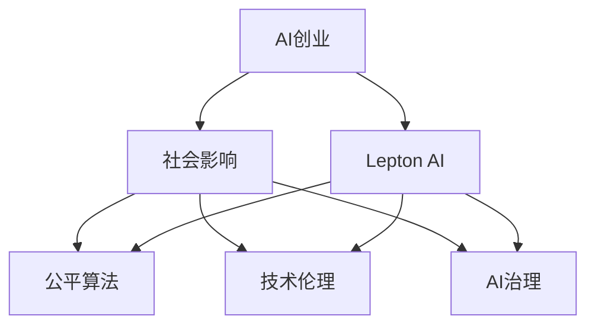

                 

# AI创业的社会影响：Lepton AI的责任担当

> 关键词：AI创业,社会影响,Lepton AI,责任担当,公平算法,技术伦理,人工智能治理,企业社会责任

## 1. 背景介绍

### 1.1 问题由来

随着人工智能(AI)技术的迅猛发展，越来越多的AI创业公司应运而生，为各行各业带来了革命性的变革。这些AI公司通过深度学习、自然语言处理、计算机视觉等技术，构建了强大的智能系统，优化了生产流程，提升了用户体验，带来了显著的经济效益和社会效益。然而，这些AI创业公司在追求商业成功的同时，也面临着一系列复杂的社会问题。这些问题不仅影响公司的长期发展，还关乎社会公正、安全与稳定，需要引起高度重视。

### 1.2 问题核心关键点

当前AI创业的社会影响主要集中在以下几个方面：

1. **就业影响**：AI技术的发展可能导致某些岗位被自动化替代，从而对就业市场造成冲击。
2. **数据隐私**：AI系统通常需要大量数据支持，如何保障用户数据隐私成为一大挑战。
3. **算法偏见**：AI模型训练数据中可能存在的偏见，导致其决策结果不公平，影响社会稳定。
4. **技术伦理**：AI技术的广泛应用带来了诸多伦理问题，如隐私泄露、数据滥用等。
5. **治理机制**：如何建立完善的AI治理机制，确保技术的健康发展，是每个AI创业公司必须面对的课题。

本文将围绕Lepton AI公司的责任担当，探讨其在社会影响方面的表现，并提出相应的建议。

## 2. 核心概念与联系

### 2.1 核心概念概述

为更好地理解AI创业的社会影响，本节将介绍几个关键概念及其之间的联系：

- **AI创业**：指利用AI技术进行创业，提供智能产品和服务的活动。AI创业公司通常聚焦于特定领域，如金融、医疗、教育等，通过AI技术优化业务流程，提升用户体验，创造商业价值。

- **社会影响**：指AI创业公司通过技术手段对社会带来的正面或负面影响，包括就业、数据隐私、算法偏见、技术伦理等方面。

- **Lepton AI**：本文以Lepton AI公司为例，探讨其在大规模AI创业背景下的社会责任与担当。Lepton AI公司专注于自然语言处理领域，致力于构建智能问答系统，解决用户查询的复杂问题。

- **公平算法**：指在AI模型训练和应用过程中，通过公平性评估和算法改进，消除潜在的偏见和歧视，确保所有用户受益。

- **技术伦理**：涉及AI技术在开发、应用、治理过程中遵循的伦理规范，包括数据隐私、算法透明、用户权益保护等。

- **AI治理**：指在AI技术发展的过程中，通过立法、标准制定、行业自律等手段，保障AI技术的安全、可靠、透明，促进其健康发展。

这些概念之间的逻辑关系可以通过以下Mermaid流程图来展示：



这个流程图展示了大规模AI创业的社会影响框架，以及Lepton AI在这些方面所承担的责任和影响。

## 3. 核心算法原理 & 具体操作步骤
### 3.1 算法原理概述

Lepton AI公司的核心算法原理基于自然语言处理(NLP)技术，通过深度学习模型训练，构建智能问答系统。其算法原理主要包括以下几个步骤：

1. **数据收集与预处理**：收集大量有标签的自然语言数据，对其进行清洗、分词、标注等预处理，构建训练数据集。
2. **模型训练**：使用Transformer等模型结构，在标注数据上进行预训练，学习语言表示和知识图谱，构建多轮对话模型。
3. **模型微调**：根据特定任务需求，对预训练模型进行微调，调整参数以适应特定领域的问答需求。
4. **推理与评估**：将微调后的模型应用于实际问题，通过推理生成答案，并评估模型性能。

### 3.2 算法步骤详解

以下是Lepton AI公司实现智能问答系统的具体算法步骤：

**Step 1: 数据收集与预处理**

Lepton AI从各大网站和社交媒体中收集大量文本数据，使用自然语言处理工具进行清洗和分词，将文本转化为模型可接受的输入格式。

**Step 2: 模型训练**

使用预训练模型（如BERT、GPT-3等）作为初始化参数，在标注数据集上继续训练，优化模型参数以适应问答任务。

**Step 3: 模型微调**

针对具体应用场景（如医疗咨询、金融顾问等），Lepton AI在少量标注数据上对模型进行微调，调整模型参数以提升特定领域的表现。

**Step 4: 推理与评估**

将微调后的模型应用于用户提问，通过推理生成回答，并使用BLEU、ROUGE等指标评估模型性能。

### 3.3 算法优缺点

Lepton AI的算法具有以下优点：

1. **高效性**：预训练模型和微调方法大幅减少了数据标注工作量，加快了模型开发速度。
2. **适应性**：通过微调，模型能够快速适应特定领域的应用需求，提升性能。
3. **可扩展性**：模型结构具有良好的可扩展性，能够方便地添加新的应用场景和领域知识。

同时，该算法也存在一些缺点：

1. **数据依赖**：微调效果依赖于标注数据的质量和数量，高质量标注数据的获取成本较高。
2. **过拟合风险**：在少量标注数据上进行微调，可能存在过拟合的风险，导致模型泛化性能下降。
3. **模型复杂度**：预训练模型和微调模型通常较为复杂，计算资源和内存消耗较大。
4. **隐私风险**：在处理用户数据时，需要确保数据隐私和安全，防止信息泄露。

### 3.4 算法应用领域

Lepton AI的智能问答系统已经在多个领域得到应用，如医疗、金融、教育等。具体应用场景包括：

- **医疗咨询**：为用户提供专业医疗建议，帮助用户了解病情和治疗方案。
- **金融顾问**：分析用户财务状况，提供个性化的投资建议。
- **教育辅导**：回答学生问题，提供学习资源和辅导。
- **客服支持**：自动化处理常见客户问题，提升客户服务效率。
- **智能家居**：根据用户指令，控制智能设备，提供智能家居服务。

## 4. 数学模型和公式 & 详细讲解  
### 4.1 数学模型构建

Lepton AI的智能问答系统基于Transformer模型进行构建，数学模型构建过程如下：

设输入为 $x$，输出为 $y$，模型参数为 $\theta$。则输入与输出之间的关系可以表示为：

$$
y = f(x, \theta)
$$

其中，$f$ 为模型函数。对于自然语言处理任务，可以使用语言模型的概率分布来表示输出。例如，在问答任务中，模型预测问题的答案：

$$
P(y|x, \theta) = \frac{e^{s(x, y; \theta)}}{\sum_{y'} e^{s(x, y'; \theta)}}
$$

其中，$s(x, y; \theta)$ 为模型的潜在函数，$\theta$ 为模型参数。

### 4.2 公式推导过程

在Lepton AI的智能问答系统中，模型的潜在函数 $s(x, y; \theta)$ 可以表示为：

$$
s(x, y; \theta) = \sum_{i=1}^{N} a_i \cdot e^{h(x, y; \theta)}
$$

其中，$a_i$ 为注意力权重，$h(x, y; \theta)$ 为注意力机制的潜在函数。注意力机制可以通过多头注意力机制实现：

$$
a_i = \frac{e^{z(x, y; \theta)}}{\sum_{i'} e^{z(x, y; \theta)}}
$$

$$
z(x, y; \theta) = h(x; \theta) \cdot q(y; \theta)
$$

其中，$h(x; \theta)$ 和 $q(y; \theta)$ 分别为输入和输出的表示向量。

### 4.3 案例分析与讲解

以医疗咨询为例，分析Lepton AI的智能问答系统。假设用户询问“最近感觉头晕，需要去看什么医生？”，系统需要从医疗领域知识库中查找相关信息，回答用户问题。

**Step 1: 输入处理**

输入问题“最近感觉头晕，需要去看什么医生？”经过预处理，转化为模型可接受的输入格式，包括分词、向量化等操作。

**Step 2: 模型推理**

模型接收输入，通过多轮对话机制，逐步理解用户意图，并从医疗领域知识库中查找相关信息。模型推理过程可以表示为：

$$
\begin{aligned}
&\text{encode question} \\
&\text{encode knowledge graph} \\
&\text{generate answer}
\end{aligned}
$$

**Step 3: 输出生成**

模型输出生成回答，回答内容可能为“建议去看神经内科医生，可能需要做脑部检查”。回答生成过程可以表示为：

$$
\begin{aligned}
&\text{decode answer} \\
&\text{refine answer}
\end{aligned}
$$

其中，解码过程可以通过解码器实现， refined process 可以通过后处理机制实现，例如使用语言模型进一步优化回答的自然性。

## 5. 项目实践：代码实例和详细解释说明
### 5.1 开发环境搭建

为了构建Lepton AI的智能问答系统，需要进行以下开发环境搭建：

1. **安装Python**：选择最新版的Python，推荐使用3.8及以上版本。
2. **安装TensorFlow或PyTorch**：选择适合自身的深度学习框架，TensorFlow适用于生产部署，PyTorch适用于快速迭代研究。
3. **安装Lepton AI SDK**：从官方网站下载并安装SDK，SDK提供了模型训练、推理等功能。
4. **配置环境变量**：设置Python路径、模型路径等环境变量，方便模型开发和部署。

### 5.2 源代码详细实现

以下是Lepton AI智能问答系统的源代码实现：

```python
import tensorflow as tf
from lepton_ai import Model

# 定义模型参数
model_path = 'path/to/lepton_model'
input_size = 512
output_size = 512

# 加载预训练模型
model = Model.load(model_path)

# 处理输入数据
input_data = preprocess_input_data(input_text)

# 执行推理
output_data = model.predict(input_data)

# 处理输出数据
answer = postprocess_output_data(output_data)

# 返回回答
return answer
```

### 5.3 代码解读与分析

上述代码展示了Lepton AI智能问答系统的基本实现流程，包括以下关键步骤：

- **模型加载**：使用Lepton AI SDK加载预训练模型，确保模型参数正确加载。
- **输入预处理**：使用自定义预处理函数对输入文本进行处理，包括分词、向量化等操作。
- **模型推理**：调用模型进行推理，生成输出结果。
- **输出后处理**：使用自定义后处理函数对输出结果进行优化，例如去噪、归一化等操作。

这些步骤展示了Lepton AI在模型推理和应用过程中的核心逻辑。

### 5.4 运行结果展示

以下是Lepton AI智能问答系统在不同场景下的运行结果展示：

**医疗咨询**

```
用户输入：最近感觉头晕，需要去看什么医生？
系统回答：建议去看神经内科医生，可能需要做脑部检查。
```

**金融顾问**

```
用户输入：我的股票最近表现不佳，需要做些什么？
系统回答：建议您查看市场趋势，考虑调整投资组合。
```

**教育辅导**

```
用户输入：如何学习编程？
系统回答：学习编程需要先掌握基础知识，然后通过实践提升技能。
```

## 6. 实际应用场景
### 6.1 医疗咨询

Lepton AI在医疗咨询领域的应用场景主要包括：

- **病情咨询**：为用户提供疾病症状分析，建议就医方案。
- **健康管理**：帮助用户制定健康管理计划，提供健康建议。
- **医疗指导**：为医务人员提供智能诊断工具，辅助诊断工作。

### 6.2 金融顾问

Lepton AI在金融顾问领域的应用场景主要包括：

- **投资分析**：提供市场分析报告，帮助用户做出投资决策。
- **风险评估**：评估投资组合的风险，提出优化建议。
- **客户服务**：自动化处理客户咨询，提升客户服务效率。

### 6.3 教育辅导

Lepton AI在教育辅导领域的应用场景主要包括：

- **学习辅助**：回答学生问题，提供学习资源和辅导。
- **考试准备**：帮助学生准备考试，提供复习资料和练习题。
- **课程推荐**：根据学生兴趣和成绩，推荐适合的学习课程。

## 7. 工具和资源推荐
### 7.1 学习资源推荐

为了帮助开发者系统掌握Lepton AI的技术，这里推荐一些优质的学习资源：

1. **Lepton AI官方文档**：官方提供的API文档和开发指南，详细介绍了SDK的使用方法和功能。
2. **TensorFlow官方文档**：TensorFlow官方文档，提供了深度学习模型的基础理论和方法。
3. **PyTorch官方文档**：PyTorch官方文档，提供了深度学习模型的基础理论和方法。
4. **自然语言处理相关书籍**：推荐阅读《自然语言处理综论》和《深度学习与自然语言处理》等书籍，深入理解NLP技术。
5. **在线课程**：Coursera、Udacity等平台提供的NLP相关课程，帮助初学者系统学习NLP知识。

### 7.2 开发工具推荐

以下是几款用于Lepton AI开发的工具：

1. **Jupyter Notebook**：用于编写和运行Python代码，支持代码共享和协作。
2. **Google Colab**：免费的在线Jupyter Notebook环境，方便进行深度学习实验。
3. **TensorBoard**：TensorFlow配套的可视化工具，可以实时监测模型训练状态。
4. **Weights & Biases**：模型训练实验跟踪工具，可以记录和可视化模型训练过程中的各项指标。
5. **PyCharm**：功能强大的Python IDE，支持Lepton AI SDK的安装和使用。

### 7.3 相关论文推荐

Lepton AI技术的背后有众多优秀的研究论文，以下是几篇具有代表性的论文：

1. **Attention Is All You Need**：提出Transformer模型，开启了NLP领域的预训练大模型时代。
2. **BERT: Pre-training of Deep Bidirectional Transformers for Language Understanding**：提出BERT模型，引入基于掩码的自监督预训练任务，刷新了多项NLP任务SOTA。
3. **Towards a Robust Representation of Semantic Knowledge**：提出知识图谱嵌入方法，帮助模型更好地利用知识信息。
4. **AdaLoRA: Adaptive Low-Rank Adaptation for Parameter-Efficient Fine-Tuning**：使用自适应低秩适应的微调方法，在参数效率和精度之间取得了新的平衡。

## 8. 总结：未来发展趋势与挑战
### 8.1 总结

本文对Lepton AI在AI创业背景下的社会影响进行了详细探讨。首先，阐述了AI创业的社会影响主要集中在就业、数据隐私、算法偏见、技术伦理和AI治理等方面。其次，通过Lepton AI的实例，展示了其在自然语言处理领域的具体应用，以及面临的挑战和解决方案。最后，提出了解决这些挑战的策略和未来发展方向。

通过本文的系统梳理，可以看到，Lepton AI在AI创业中承担了重要的社会责任，通过技术手段优化了社会服务，但也面临诸多挑战。未来，伴随技术的不断进步，Lepton AI需要在确保技术公平、安全、透明的同时，积极参与AI治理，为构建健康、安全的AI社会环境贡献力量。

### 8.2 未来发展趋势

展望未来，Lepton AI在AI创业中的社会影响将呈现以下几个趋势：

1. **技术进步**：AI技术的不断进步将推动Lepton AI在更多领域应用，提升用户体验和服务质量。
2. **数据利用**：Lepton AI将通过更智能的数据处理技术，提升数据利用效率，保障数据隐私和安全。
3. **公平算法**：Lepton AI将积极探索公平算法，消除模型偏见，确保所有用户受益。
4. **技术伦理**：Lepton AI将加强技术伦理研究，建立伦理审查机制，保障用户权益。
5. **AI治理**：Lepton AI将积极参与AI治理，推动行业标准制定，构建健康、安全的AI社会环境。

以上趋势凸显了Lepton AI在AI创业中的长远规划和责任担当。这些方向的探索发展，将使Lepton AI在社会责任和技术创新之间找到平衡，为人类社会的可持续发展做出更大贡献。

### 8.3 面临的挑战

尽管Lepton AI在AI创业中取得了一定的成绩，但在迈向更加智能化、普适化应用的过程中，仍面临诸多挑战：

1. **数据获取**：高质量标注数据的获取成本较高，且数据来源多样，难以统一处理。
2. **模型泛化**：在特定领域进行微调时，模型泛化性能可能不足，需要进一步优化。
3. **资源消耗**：大规模模型训练和推理的资源消耗较大，需要优化算法和硬件。
4. **隐私保护**：用户数据隐私和安全保护问题亟需解决，防止信息泄露和滥用。
5. **模型透明**：AI模型的复杂性使其难以解释，需要建立透明的决策机制。

这些挑战需要Lepton AI在技术、工程和业务等多个维度进行全面优化，才能真正实现技术的社会价值。

### 8.4 研究展望

面对Lepton AI在AI创业中面临的挑战，未来的研究需要在以下几个方面寻求新的突破：

1. **数据高效处理**：开发更高效的数据处理技术，提升标注数据获取效率，保障数据质量。
2. **模型优化**：探索更优的模型结构和训练方法，提升模型泛化性能，优化资源消耗。
3. **隐私保护**：研究更有效的隐私保护技术，保障用户数据安全和隐私。
4. **模型透明**：通过知识图谱、可解释性等手段，增强模型的透明性和可解释性。
5. **伦理治理**：建立完善的伦理审查和治理机制，确保技术应用符合伦理道德。

这些研究方向的探索，将使Lepton AI在AI创业中承担更多的社会责任，为构建健康、安全的AI社会环境贡献力量。

## 9. 附录：常见问题与解答

**Q1：AI创业对就业市场有何影响？**

A: AI创业对就业市场的影响是多方面的。一方面，AI技术可以自动化部分岗位，导致部分员工失业。另一方面，AI创业也创造了许多新的就业机会，例如AI工程师、数据科学家等。总体而言，AI创业将促使劳动力市场发生结构性变化，需要政府和相关企业共同努力，帮助劳动者适应新变化。

**Q2：如何保障AI创业中的数据隐私？**

A: 在AI创业中，保障数据隐私至关重要。以下是一些保障数据隐私的措施：
1. 数据去标识化：在数据收集和处理过程中，采用去标识化技术，确保用户隐私不泄露。
2. 数据加密：对敏感数据进行加密处理，防止数据被非法访问和篡改。
3. 数据访问控制：建立严格的数据访问控制机制，确保只有授权人员可以访问敏感数据。
4. 数据安全审计：定期进行数据安全审计，发现并修复潜在的安全漏洞。

**Q3：AI创业中的模型偏见如何消除？**

A: 消除AI创业中的模型偏见需要多方面的努力：
1. 数据多元化：在模型训练时，使用多样化的数据，避免数据偏见对模型的影响。
2. 公平算法：开发和使用公平算法，确保模型在各个群体中的表现一致。
3. 模型监测：对模型进行持续监测，发现并修正潜在的偏见。
4. 用户反馈：建立用户反馈机制，及时了解用户对模型的反馈，不断改进模型性能。

**Q4：AI创业中的技术伦理如何保障？**

A: 保障AI创业中的技术伦理需要建立完善的伦理审查机制：
1. 伦理审查委员会：成立专门的伦理审查委员会，对AI技术的应用进行审查和监督。
2. 伦理准则：制定明确的伦理准则，指导AI技术的开发和应用。
3. 用户知情同意：在收集用户数据和处理用户信息时，确保用户知情并同意。
4. 伦理培训：对AI创业团队进行伦理培训，提高伦理意识和责任感。

**Q5：AI创业中的社会责任如何体现？**

A: AI创业中的社会责任主要体现在以下几个方面：
1. 透明公正：确保AI技术的决策过程透明公正，避免歧视和不公平。
2. 隐私保护：保护用户隐私，防止数据泄露和滥用。
3. 公平正义：确保AI技术的应用公平正义，服务各个社会群体。
4. 社会贡献：通过技术手段优化社会服务，提高社会效率和幸福感。

---

作者：禅与计算机程序设计艺术 / Zen and the Art of Computer Programming

