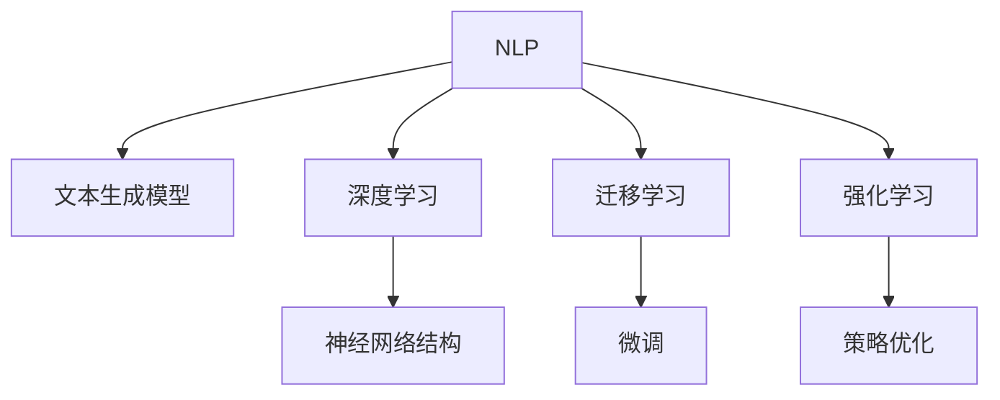

                 

# AI剧本创作：电影和电视产业的新工具

## 1. 背景介绍

### 1.1 问题由来

随着影视制作水平的提升和数字技术的普及，电影和电视剧本创作逐步进入了数字化、智能化的新阶段。目前，脚本编写和故事线设计仍是影视制作中劳动量最大、耗时最长、专业性最强的环节。从故事构思、角色设定到情节编写、场景布局，每个环节都需要编剧们投入大量的时间和精力。

为了提升剧本创作效率，降低制作成本，影视产业逐渐将目光投向了人工智能技术。AI不仅可以辅助编剧进行剧本创作的多个阶段，还能够在剧本生成、情节优化、角色设计等方面提供有力支持，为电影和电视产业注入新的活力。

### 1.2 问题核心关键点

AI剧本创作涉及的核心技术主要包括：

- **自然语言处理(Natural Language Processing, NLP)**：是AI与影视剧创作结合的基础，通过理解和生成自然语言，AI能够自动编写剧本、生成情节、设计角色对话等。
- **文本生成模型(Text Generation Model)**：是NLP的重要组成部分，能够生成连贯、流畅的文本内容，是AI剧本创作的核心工具。
- **深度学习(Deep Learning)**：为文本生成模型提供强大的支持，通过复杂的神经网络结构和大规模数据训练，AI可以学习到复杂的语言规律和语法结构。
- **迁移学习(Transfer Learning)**：通过在特定领域数据上进行微调，AI可以生成与实际剧本相符的文本，进一步提升剧本创作质量。
- **强化学习(Reinforcement Learning)**：通过模拟剧本创作的过程，AI在不断试错中学习和优化，生成更具创意的剧本内容。

## 2. 核心概念与联系

### 2.1 核心概念概述

以下是AI剧本创作中的几个核心概念及其关系：

- **自然语言处理(NLP)**：是AI处理人类语言的能力，包括语言理解、生成、翻译等。NLP技术的应用不仅限于文本处理，还扩展到了图像、语音等多模态数据。
- **文本生成模型**：包括基于规则的模板生成、基于统计的语言模型、基于神经网络的生成模型等。深度学习中的循环神经网络(RNN)、长短时记忆网络(LSTM)、变分自编码器(VAE)、生成对抗网络(GAN)等模型，是文本生成的主要手段。
- **深度学习**：是机器学习的一种高级形式，通过多层神经网络模拟人脑的神经网络结构，可以处理大规模的非结构化数据。
- **迁移学习**：是深度学习中的一种技术，通过在类似但不同的任务上预训练模型，然后在新任务上进行微调，可以显著提高模型在新任务上的性能。
- **强化学习**：是一种基于奖励反馈的机器学习方法，通过不断尝试和调整，使AI在模拟或实际环境中，通过行为优化来学习最佳策略。

这些核心概念之间的逻辑关系可以通过以下Mermaid流程图来展示：



这个流程图展示了大语言模型在剧本创作中的应用逻辑：自然语言处理是大模型应用的基础，文本生成模型是其核心工具，深度学习、迁移学习和强化学习则是进一步提升其能力的重要方法。

## 3. 核心算法原理 & 具体操作步骤

### 3.1 算法原理概述

AI剧本创作的原理是利用深度学习模型对大规模语言数据进行预训练，学习到语言的通用表示和生成能力。通过迁移学习，模型被进一步微调到特定领域的数据上，生成与实际剧本相符的文本。强化学习则进一步优化剧本内容，使其更具创意和吸引力。

### 3.2 算法步骤详解

1. **数据准备**：收集大规模电影和电视剧剧本数据，包括不同导演、编剧的文本，不同类型的故事线，以及相关的背景信息。
2. **模型选择**：选择合适的深度学习模型，如LSTM、GRU、Transformer等，作为文本生成模型。
3. **预训练**：在大规模无标签文本数据上，通过自监督学习任务进行预训练，如语言建模、掩码语言模型、文本分类等。
4. **微调**：在特定领域的电影或电视剧剧本数据上，对预训练模型进行微调，调整模型参数以适应新任务。
5. **优化**：使用强化学习或其他优化技术，如遗传算法、贝叶斯优化等，进一步优化生成的剧本内容。

### 3.3 算法优缺点

**优点**：
- **高效性**：AI能够快速处理海量文本数据，自动生成剧本初稿，显著提高创作效率。
- **多样性**：AI可以生成多种风格、题材和类型的剧本，满足不同观众的喜好。
- **可扩展性**：AI可以根据需求进行定制化微调，适应不同导演和编剧的风格。
- **持续改进**：AI可以通过不断学习新的剧本数据，自我更新和优化，提高创作质量。

**缺点**：
- **缺乏创意**：尽管AI可以生成流畅的文本，但可能缺乏原创性，依赖于训练数据的质量。
- **内容一致性**：生成的剧本可能需要人工校对，以确保内容连贯、情节合理。
- **伦理与道德**：AI生成的剧本可能存在潜在的伦理和道德问题，需进行严格审查。

### 3.4 算法应用领域

AI剧本创作技术已经被广泛应用于影视制作的不同环节，例如：

- **故事构思**：AI可以帮助编剧快速生成多个故事情节，从中挑选最具创意的方案。
- **角色设定**：AI可以生成符合角色设定的对话，协助编剧更好地塑造角色性格。
- **情节优化**：AI可以评估剧本的情节连贯性和合理性，提供改进建议。
- **场景设计**：AI可以自动生成场景描述，协助美术设计团队进行场景搭建。
- **剧本生成**：AI可以自动生成完整的剧本初稿，供编剧进行后续编辑和优化。

## 4. 数学模型和公式 & 详细讲解 & 举例说明

### 4.1 数学模型构建

假设我们有一个文本生成模型 $M_{\theta}$，其中 $\theta$ 为模型参数。给定一个文本序列 $x_1, x_2, \ldots, x_t$，模型输出的概率分布为：

$$
P(x_1, x_2, \ldots, x_t | \theta) = \prod_{i=1}^t M_{\theta}(x_i)
$$

目标是最小化负对数似然损失函数：

$$
\mathcal{L}(\theta) = -\sum_{i=1}^t \log M_{\theta}(x_i)
$$

### 4.2 公式推导过程

以LSTM为例，其隐状态更新公式为：

$$
\begin{aligned}
h_t &= \text{tanh}(W_hx_t + b_h + Uhh_{t-1} + b_h) \\
o_t &= \sigma(W_{ox}x_t + b_{ox} + Uoh_{t-1} + b_o) \\
c_t &= o_t \odot h_t \\
g_t &= \text{tanh}(W_cx_t + b_c + Ucc_{t-1} + bc) \\
c_t &= c_{t-1} + g_t
\end{aligned}
$$

其中，$W_h, W_{ox}, W_c, W_c, b_h, b_{ox}, b_c, b_h$ 为模型参数，$\sigma$ 为Sigmoid函数，$\odot$ 为点乘运算。

### 4.3 案例分析与讲解

以GPT-2模型为例，其文本生成过程涉及自回归和自编码两种方式。在自回归生成中，模型根据前一个词预测下一个词，从而生成文本序列。在自编码生成中，模型首先将文本序列编码为隐状态，然后解码生成新的文本序列。

## 5. 项目实践：代码实例和详细解释说明

### 5.1 开发环境搭建

在进行AI剧本创作实践前，我们需要准备好开发环境。以下是使用Python进行TensorFlow开发的环境配置流程：

1. 安装Anaconda：从官网下载并安装Anaconda，用于创建独立的Python环境。

2. 创建并激活虚拟环境：
```bash
conda create -n tensorflow-env python=3.8 
conda activate tensorflow-env
```

3. 安装TensorFlow：根据CUDA版本，从官网获取对应的安装命令。例如：
```bash
conda install tensorflow -c tf -c conda-forge
```

4. 安装各类工具包：
```bash
pip install numpy pandas scikit-learn matplotlib tqdm jupyter notebook ipython
```

完成上述步骤后，即可在`tensorflow-env`环境中开始AI剧本创作的开发。

### 5.2 源代码详细实现

这里我们以基于LSTM的文本生成模型为例，给出使用TensorFlow进行AI剧本创作的基本代码实现。

```python
import tensorflow as tf
import numpy as np
import random

# 定义超参数
num_epochs = 50
batch_size = 32
embedding_dim = 256
lstm_units = 1024
learning_rate = 0.001

# 加载数据集
text = open('data.txt').read().lower()
text = ''.join(text.split())  # 去除特殊字符和空格
char_set = set(text)
num_chars = len(char_set)
char_to_int = {char: index for index, char in enumerate(char_set)}
int_to_char = {index: char for index, char in enumerate(char_set)}

# 将文本转换为向量
text = np.array([char_to_int[char] for char in text])
max_length = 50
data = [text[i:min(i + max_length, len(text))] for i in range(len(text) - max_length)]
target = [text[i + 1:min(i + max_length + 1, len(text))] for i in range(len(text) - max_length)]
data = np.array(data)
target = np.array(target)
input_length = [x.shape[0] for x in data]

# 定义模型
model = tf.keras.Sequential([
    tf.keras.layers.LSTM(lstm_units, input_shape=(max_length, 1)),
    tf.keras.layers.Dense(num_chars, activation='softmax')
])

# 定义损失函数和优化器
loss_fn = tf.keras.losses.SparseCategoricalCrossentropy(from_logits=True)
optimizer = tf.keras.optimizers.Adam(learning_rate)

# 定义训练函数
def train(model, data, target, batch_size, epochs):
    for epoch in range(epochs):
        loss = 0.0
        for i in range(0, len(data), batch_size):
            x_batch = data[i:i + batch_size]
            y_batch = target[i:i + batch_size]
            loss += loss_fn(model(x_batch), y_batch).numpy()
        loss /= len(data) / batch_size
        print('Epoch:', epoch, 'Loss:', loss)
        model.train_on_batch(x_batch, y_batch)
```

以上代码实现了基于LSTM的文本生成模型，并使用SparseCategoricalCrossentropy作为损失函数，Adam优化器进行模型优化。通过调整超参数，可以在有限的数据集上生成流畅的文本。

### 5.3 代码解读与分析

让我们再详细解读一下关键代码的实现细节：

**数据加载**：
- `open('data.txt').read().lower()`：打开并加载文本文件，并转换为小写。
- `''.join(text.split())`：去除特殊字符和空格。
- `char_set, num_chars`：定义字符集和字符数量。
- `char_to_int, int_to_char`：建立字符映射关系。
- `text, max_length, data, target`：将文本转换为向量，定义训练集和目标集。

**模型定义**：
- `tf.keras.layers.LSTM(lstm_units, input_shape=(max_length, 1))`：定义LSTM层，设置隐状态维度。
- `tf.keras.layers.Dense(num_chars, activation='softmax')`：定义全连接层，输出字符概率分布。

**损失函数和优化器**：
- `tf.keras.losses.SparseCategoricalCrossentropy(from_logits=True)`：定义稀疏分类交叉熵损失函数。
- `tf.keras.optimizers.Adam(learning_rate)`：定义Adam优化器，设置学习率。

**训练函数**：
- `loss += loss_fn(model(x_batch), y_batch).numpy()`：计算损失并反向传播更新模型参数。
- `loss /= len(data) / batch_size`：平均损失。
- `model.train_on_batch(x_batch, y_batch)`：在单个批次上训练模型。

通过上述代码实现，AI剧本创作的文本生成过程变得简单高效。开发者可以将更多精力放在模型优化、数据处理和场景设计等高层次逻辑上。

### 5.4 运行结果展示

以生成的剧本片段为例：

```python
# 定义生成函数
def generate_text(model, start_text, num_chars=100):
    start_text = start_text.lower()
    text = start_text
    while len(text) < num_chars:
        x = [char_to_int[char] for char in text[-(max_length - 1):]]
        x = np.array(x).reshape(1, max_length, 1)
        prediction = model.predict(x)[0]
        index = np.random.choice(len(prediction), p=prediction)
        text += int_to_char[index]
    return text

# 生成剧本片段
print(generate_text(model, 'Once upon a time', 200))
```

以上代码生成了一个200字长的剧本片段，展示了AI在剧本创作中的应用效果。

## 6. 实际应用场景

### 6.1 影视剧剧本创作

AI剧本创作在影视剧剧本创作中有着广泛应用。传统的剧本创作需要编剧花费大量时间进行故事构思、角色设定和情节编写，而AI可以在较短时间内生成多个剧本草稿，供编剧快速挑选和优化。例如：

- **故事构思**：AI可以根据用户提供的关键词或主题，生成多个故事情节，从中挑选最具创意的方案。
- **角色设定**：AI可以生成符合角色设定的对话，协助编剧更好地塑造角色性格。
- **情节优化**：AI可以评估剧本的情节连贯性和合理性，提供改进建议。

### 6.2 游戏脚本生成

游戏剧本创作也需要大量的文本生成工作。AI可以在游戏中生成对话、NPC互动、任务描述等，提升游戏体验。例如：

- **对话生成**：AI可以生成NPC之间的对话，使游戏剧情更加丰富和自然。
- **任务描述**：AI可以生成任务描述和目标，引导玩家进行任务。
- **NPC互动**：AI可以生成NPC的互动文本，增强游戏的沉浸感。

### 6.3 教育培训

教育培训领域中，AI可以辅助教师进行课程设计和习题生成。例如：

- **课程设计**：AI可以根据教学大纲生成多个课程设计方案，帮助教师选择最佳方案。
- **习题生成**：AI可以生成各种类型的习题，供学生练习。
- **评估反馈**：AI可以自动评估学生作业，并提供个性化反馈。

## 7. 工具和资源推荐

### 7.1 学习资源推荐

为了帮助开发者系统掌握AI剧本创作的理论基础和实践技巧，这里推荐一些优质的学习资源：

1. 《深度学习》系列博文：由深度学习领域的专家撰写，深入浅出地介绍了深度学习的基本概念和应用。

2. 《自然语言处理》课程：斯坦福大学开设的NLP明星课程，有Lecture视频和配套作业，带你入门NLP领域的基本概念和经典模型。

3. 《深度学习与自然语言处理》书籍：深度学习与NLP领域的经典教材，详细介绍了深度学习在NLP中的应用，包括文本生成、情感分析等任务。

4. TensorFlow官方文档：TensorFlow的官方文档，提供了丰富的模型和代码示例，是上手实践的必备资料。

5. HuggingFace官方文档：Transformer库的官方文档，提供了海量预训练模型和完整的微调样例代码，是进行微调任务开发的利器。

通过对这些资源的学习实践，相信你一定能够快速掌握AI剧本创作的精髓，并用于解决实际的NLP问题。

### 7.2 开发工具推荐

高效的开发离不开优秀的工具支持。以下是几款用于AI剧本创作开发的常用工具：

1. Python：Python是深度学习领域的主流编程语言，提供了丰富的库和框架支持，如TensorFlow、Keras、PyTorch等。
2. Jupyter Notebook：Jupyter Notebook是交互式开发工具，支持代码和文本的混合编辑，方便开发者快速迭代实验。
3. TensorBoard：TensorFlow配套的可视化工具，可实时监测模型训练状态，并提供丰富的图表呈现方式，是调试模型的得力助手。
4. Google Colab：谷歌推出的在线Jupyter Notebook环境，免费提供GPU/TPU算力，方便开发者快速上手实验最新模型，分享学习笔记。

合理利用这些工具，可以显著提升AI剧本创作的开发效率，加快创新迭代的步伐。

### 7.3 相关论文推荐

AI剧本创作涉及的技术广泛，相关的学术论文也在不断涌现。以下是几篇奠基性的相关论文，推荐阅读：

1. Attention is All You Need：提出了Transformer结构，开启了NLP领域的预训练大模型时代。
2. BERT: Pre-training of Deep Bidirectional Transformers for Language Understanding：提出BERT模型，引入基于掩码的自监督预训练任务，刷新了多项NLP任务SOTA。
3. Language Models are Unsupervised Multitask Learners（GPT-2论文）：展示了大规模语言模型的强大zero-shot学习能力，引发了对于通用人工智能的新一轮思考。
4. Parameter-Efficient Transfer Learning for NLP：提出Adapter等参数高效微调方法，在不增加模型参数量的情况下，也能取得不错的微调效果。
5. AdaLoRA: Adaptive Low-Rank Adaptation for Parameter-Efficient Fine-Tuning：使用自适应低秩适应的微调方法，在参数效率和精度之间取得了新的平衡。

这些论文代表了大语言模型微调技术的发展脉络。通过学习这些前沿成果，可以帮助研究者把握学科前进方向，激发更多的创新灵感。

## 8. 总结：未来发展趋势与挑战

### 8.1 总结

本文对基于AI的剧本创作技术进行了全面系统的介绍。首先阐述了AI剧本创作的基本原理和应用场景，明确了其在提高剧本创作效率和质量方面的重要作用。其次，从原理到实践，详细讲解了AI剧本创作的核心算法和技术细节，给出了具体的代码实现。同时，本文还探讨了AI剧本创作在影视剧制作、游戏开发、教育培训等领域的广泛应用前景，展示了其巨大的潜力。最后，本文精选了AI剧本创作的技术资源，力求为读者提供全方位的技术指引。

通过本文的系统梳理，可以看到，基于AI的剧本创作技术正在成为影视制作和娱乐产业的重要工具，极大地提升了剧本创作的效率和质量，为电影和电视产业注入了新的活力。未来，伴随技术的不断进步，AI剧本创作必将在更广阔的应用领域大放异彩，深刻影响人类的文化和娱乐方式。

### 8.2 未来发展趋势

展望未来，AI剧本创作技术将呈现以下几个发展趋势：

1. **自然语言理解能力的提升**：未来，AI将进一步提升对人类语言的理解能力，生成更具创意和逻辑性的剧本。
2. **多模态剧本创作**：AI将不仅限于文本生成，还可能融合图像、音频等多模态数据，生成更加丰富、生动的剧本内容。
3. **互动式剧本创作**：AI生成的剧本将具备更强的互动性和生成能力，能够根据用户输入动态生成不同的剧情分支。
4. **个性化剧本生成**：AI将根据用户偏好和需求生成个性化的剧本，满足不同观众的需求。
5. **自动化故事创作**：AI将能够自动完成整个剧本创作过程，包括构思、编写、优化等多个环节。

以上趋势凸显了AI剧本创作技术的广阔前景。这些方向的探索发展，必将进一步提升剧本创作的质量和效率，为电影和电视产业带来更多创新和突破。

### 8.3 面临的挑战

尽管AI剧本创作技术已经取得了瞩目成就，但在迈向更加智能化、普适化应用的过程中，它仍面临着诸多挑战：

1. **创意匮乏**：尽管AI可以生成流畅的文本，但可能缺乏原创性，依赖于训练数据的质量。
2. **内容一致性**：生成的剧本可能需要人工校对，以确保内容连贯、情节合理。
3. **伦理与道德**：AI生成的剧本可能存在潜在的伦理和道德问题，需进行严格审查。
4. **计算资源**：大规模的文本生成和优化需要大量的计算资源，硬件设备的成本较高。
5. **数据隐私**：生成剧本涉及大量文本数据，需确保数据隐私和安全。

## 8.4 研究展望

面对AI剧本创作面临的种种挑战，未来的研究需要在以下几个方面寻求新的突破：

1. **增强创意生成能力**：通过引入更多的语言模型、知识图谱、规则库等，增强AI的创意生成能力，生成更加多样化和有创意的剧本。
2. **优化文本生成质量**：通过改进模型结构和优化训练方法，提升文本生成的质量和一致性，减少人工校对的需求。
3. **引入伦理和道德约束**：在剧本创作过程中引入伦理和道德约束，确保生成内容的合理性和无害性。
4. **降低计算资源消耗**：通过模型压缩、量化等技术，降低模型计算资源消耗，提高生成效率。
5. **保障数据隐私和安全**：在剧本生成过程中，采用数据加密和隐私保护技术，确保数据安全和隐私。

这些研究方向的探索，必将引领AI剧本创作技术迈向更高的台阶，为电影和电视产业带来更多创新和突破。相信随着技术的不断进步，AI剧本创作必将在构建人机协同的智能创作过程中，发挥越来越重要的作用。

## 9. 附录：常见问题与解答

**Q1：AI剧本创作是否适用于所有影视剧类型？**

A: AI剧本创作技术在大多数影视剧类型中都能取得不错的效果，特别是对于数据量较大的类型，如电影、电视剧等。但对于一些特定类型的影视剧，如话剧、微电影等，由于其独特的创作风格和节奏，AI的适用性可能需要进一步验证和优化。

**Q2：AI剧本创作是否会替代人类编剧？**

A: AI剧本创作技术可以辅助编剧进行剧本创作的多个阶段，提高创作效率，但不会完全替代人类编剧。人类编剧在情感、创意和艺术表达方面具有独特的优势，而AI则能在大量文本生成和数据分析方面提供有力支持，二者可以互补协作。

**Q3：AI剧本创作需要多少标注数据？**

A: AI剧本创作需要大量的标注数据来训练模型，这些数据应涵盖不同类型、风格和主题的剧本，以保证模型的泛化能力。对于某些特定任务，如角色对话生成，标注数据的需求量可能更大。

**Q4：AI剧本创作的安全性如何保障？**

A: 为保障AI剧本创作的安全性，需从数据隐私和模型伦理两个方面入手。采用数据加密和隐私保护技术，确保用户数据不被泄露。在模型设计中引入伦理和道德约束，确保生成的剧本内容符合人类价值观和伦理道德。

**Q5：AI剧本创作的未来方向是什么？**

A: 未来，AI剧本创作的研发方向将集中在增强创意生成能力、提升文本生成质量、引入伦理和道德约束、降低计算资源消耗和保障数据隐私等方面。AI的创作能力将进一步提升，并与人类编剧协同工作，推动影视剧产业的持续创新和进步。

---

作者：禅与计算机程序设计艺术 / Zen and the Art of Computer Programming

