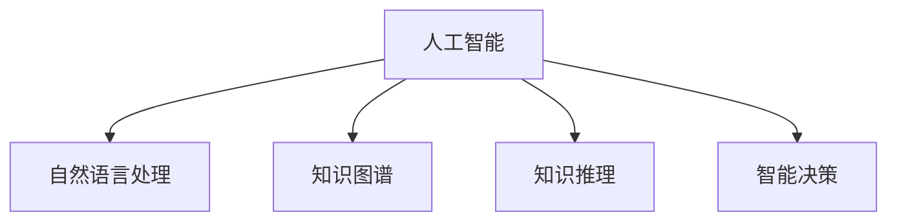

                 

# AI助力人类知识增长:应对复杂问题的新思路

## 1. 背景介绍

### 1.1 问题由来
在信息爆炸的时代，人类获取和处理知识的需求愈发旺盛。然而，知识增长的复杂性和多样性，使得传统的人工学习方法难以应对。如何更高效、更智能地获取、组织和应用知识，成为当前信息技术领域的研究热点。

人工智能（AI）技术的发展，为解决这一问题提供了全新的可能性。AI能够通过自动化、智能化的方式，辅助人类更高效地进行知识探索和应用。AI技术通过学习海量数据、发现数据之间的关联，从而在复杂问题求解、知识推理、信息整合等方面，展现出巨大潜力。

### 1.2 问题核心关键点
AI助力人类知识增长的核心关键点包括：

- 自动化知识获取：通过AI技术自动从海量数据中提取、整合知识，无需人工干预。
- 智能知识推理：利用AI的预测能力，辅助人类进行复杂问题的求解。
- 知识表示与检索：构建智能化的知识库，提高知识查询和检索的效率。
- 跨领域知识整合：融合多模态数据，促进不同领域知识的协同应用。
- 动态知识更新：保持知识的即时性，提升知识库的实用性和准确性。

### 1.3 问题研究意义
AI助力人类知识增长的研究，对于拓展人类的认知边界，推动知识创新，具有重要意义：

- 加速知识生产：AI技术能够自动处理大量数据，提取、整合知识，加速新知识的生成。
- 促进知识传播：AI辅助的知识检索、推荐系统，能够精准推送相关信息，加速知识的传播和应用。
- 提高知识利用效率：智能化的知识推理、决策系统，能够辅助人类进行复杂问题的求解，提高知识应用效率。
- 助力科学发现：AI技术在数据分析、模型训练等方面，能够揭示数据背后的规律，辅助科学家的研究探索。
- 推动社会进步：知识作为社会发展的重要基石，AI技术的应用将对各领域产生深远影响，提升社会的整体竞争力。

## 2. 核心概念与联系

### 2.1 核心概念概述

为更好地理解AI助力人类知识增长的核心思路，本节将介绍几个密切相关的核心概念：

- 人工智能(AI)：旨在模拟人类智能行为的计算系统，涵盖感知、认知、决策、学习等多个方面。
- 自然语言处理(NLP)：研究如何让计算机理解、处理人类语言的技术，是AI中的重要分支。
- 知识图谱(KG)：构建基于图的知识表示，用于描述实体和它们之间的关系，是AI领域中的重要工具。
- 知识推理：通过逻辑、规则、模型等方式，从已知知识中推导出新知识的技术。
- 智能决策：利用AI技术，辅助人类进行决策，提高决策的科学性和效率。

这些核心概念之间的逻辑关系可以通过以下Mermaid流程图来展示：



这个流程图展示了几大核心概念之间的关系：

1. 人工智能通过自然语言处理技术，实现对人类语言的理解和处理。
2. 知识图谱提供结构化的知识表示，辅助知识推理和智能决策。
3. 知识推理通过逻辑、规则、模型等方式，从知识图谱中推导出新知识。
4. 智能决策利用人工智能技术，辅助人类进行决策，提高决策的科学性和效率。

## 3. 核心算法原理 & 具体操作步骤
### 3.1 算法原理概述

AI助力人类知识增长，本质上是一个知识获取、整合、应用的过程。其核心思想是：通过AI技术自动化地从海量数据中提取、整合、推导知识，并应用于实际问题求解，从而提高知识获取和应用的效率。

形式化地，假设目标知识库为 $K$，初始知识图谱为 $G$，AI系统为 $S$。目标是构建新的知识库 $K'$，使得 $K' \supseteq K$，且 $K'$ 能够高效应用于实际问题。

具体来说，可以分为以下几个步骤：

1. 数据获取：从各种数据源（如文献、网络、实验数据等）中自动提取数据。
2. 数据预处理：对原始数据进行清洗、转换，使其适合模型处理。
3. 知识提取：利用自然语言处理技术，从文本数据中提取实体、关系等信息，构建初步的知识图谱 $G'$。
4. 知识推理：利用知识推理技术，在初步知识图谱的基础上，推导出新的知识，更新知识库 $K'$。
5. 知识应用：将知识库 $K'$ 应用于实际问题求解，如复杂问题的求解、知识推荐、智能决策等。

### 3.2 算法步骤详解

AI助力知识增长的算法步骤一般包括以下几个关键步骤：

**Step 1: 数据收集与预处理**
- 从数据源（如网络、数据库、文献等）自动收集数据。
- 对数据进行清洗、去重、格式化，去除噪声和错误数据。
- 进行实体识别、关系抽取等预处理，为后续知识提取做准备。

**Step 2: 知识提取**
- 利用自然语言处理技术，从文本数据中提取实体、关系等信息。
- 构建基于语言模型、知识图谱的知识图谱 $G'$。
- 使用信息抽取、关系学习等方法，自动补充和完善知识图谱。

**Step 3: 知识推理**
- 利用逻辑推理、图神经网络、知识图谱等技术，从初步知识图谱 $G'$ 中推导出新知识。
- 通过迭代推理，不断更新和优化知识图谱 $K'$。
- 采用多种推理方法（如规则推理、模型推理等），提高推理的全面性和准确性。

**Step 4: 知识应用**
- 将知识库 $K'$ 应用于实际问题求解，如复杂问题的求解、知识推荐、智能决策等。
- 通过模型训练、算法优化等手段，提高知识库的应用效率和效果。
- 不断收集反馈信息，动态更新知识库 $K'$，保持其时效性和准确性。

### 3.3 算法优缺点

AI助力人类知识增长的算法具有以下优点：

1. 高效性：通过自动化处理，大幅提升知识获取和应用的效率。
2. 全面性：能够整合多种数据源，构建更全面、准确的知识库。
3. 智能性：利用AI的预测、推理能力，辅助人类进行复杂问题的求解。
4. 可扩展性：知识库可以动态更新，适应新的数据和知识。

同时，该算法也存在一定的局限性：

1. 依赖高质量数据：知识库的质量和应用效果，很大程度上取决于原始数据的完整性和准确性。
2. 技术复杂性：知识提取、推理等环节需要先进的算法和模型支持。
3. 知识偏见：如果原始数据存在偏见，知识库中的知识也可能带有偏见。
4. 可解释性：AI系统的决策过程通常缺乏可解释性，难以理解和调试。
5. 资源消耗：大规模知识库的构建和应用，需要大量的计算资源。

尽管存在这些局限性，但AI技术在知识获取和应用方面的巨大潜力，使得知识增长成为可能。未来相关研究的重点在于如何进一步提升AI系统的准确性、可解释性和可扩展性，同时避免知识库中的偏见和错误。

### 3.4 算法应用领域

AI助力人类知识增长的算法，在多个领域得到了广泛的应用，包括：

- 知识图谱构建：从海量文献、网络数据中提取、整合知识，构建知识图谱。
- 科学发现：利用AI技术，辅助科学家进行数据分析、实验设计，发现新的科学规律。
- 智能推荐系统：基于用户行为和兴趣，推荐相关知识内容，提升知识传播和应用效果。
- 复杂问题求解：利用AI推理和决策技术，辅助解决复杂的多目标、多约束问题。
- 医疗诊断：通过知识图谱和推理技术，辅助医生进行诊断和治疗方案的制定。
- 教育辅助：利用知识图谱和推理技术，辅助学生进行知识学习和问题求解。
- 金融预测：利用AI技术，从大量金融数据中提取知识，进行市场预测和风险评估。

除了上述这些经典应用外，AI技术还在更多领域中展现了巨大的潜力，如智能制造、城市治理、智能交通等。随着AI技术的不断进步，相信知识增长将迎来更多创新应用场景，为人类社会的发展注入新的动力。

## 4. 数学模型和公式 & 详细讲解  
### 4.1 数学模型构建

本节将使用数学语言对AI助力人类知识增长的过程进行更加严格的刻画。

假设知识库 $K$ 包含 $n$ 个实体 $e_i$ 和 $m$ 条关系 $r_j$。目标知识库 $K'$ 包含 $n'$ 个实体 $e_i'$ 和 $m'$ 条关系 $r_j'$。AI系统的推理模型为 $S$，输入为 $G'$，输出为 $K'$。

知识推理过程可以表示为：

$$
K' = S(G')
$$

其中 $S$ 表示推理模型，$G'$ 表示初步知识图谱，$K'$ 表示最终知识库。

## 5. 项目实践：代码实例和详细解释说明
### 5.1 开发环境搭建

在进行知识增长实践前，我们需要准备好开发环境。以下是使用Python进行PyTorch开发的环境配置流程：

1. 安装Anaconda：从官网下载并安装Anaconda，用于创建独立的Python环境。

2. 创建并激活虚拟环境：
```bash
conda create -n pytorch-env python=3.8 
conda activate pytorch-env
```

3. 安装PyTorch：根据CUDA版本，从官网获取对应的安装命令。例如：
```bash
conda install pytorch torchvision torchaudio cudatoolkit=11.1 -c pytorch -c conda-forge
```

4. 安装各类工具包：
```bash
pip install numpy pandas scikit-learn matplotlib tqdm jupyter notebook ipython
```

完成上述步骤后，即可在`pytorch-env`环境中开始知识增长实践。

### 5.2 源代码详细实现

这里我们以知识图谱构建为例，给出使用PyTorch和GPy库构建知识图谱的PyTorch代码实现。

首先，定义知识图谱的节点和边类：

```python
import torch
from torch_geometric.nn import GNNConv
from torch_geometric.data import Data

class Node(torch.nn.Module):
    def __init__(self, in_dim, out_dim):
        super(Node, self).__init__()
        self.fc = torch.nn.Linear(in_dim, out_dim)
        self.relu = torch.nn.ReLU()
        self.sigmoid = torch.nn.Sigmoid()

    def forward(self, x):
        return self.sigmoid(self.relu(self.fc(x)))

class Edge(torch.nn.Module):
    def __init__(self, in_dim, out_dim):
        super(Edge, self).__init__()
        self.fc = torch.nn.Linear(in_dim, out_dim)
        self.relu = torch.nn.ReLU()
        self.sigmoid = torch.nn.Sigmoid()

    def forward(self, x):
        return self.sigmoid(self.relu(self.fc(x)))
```

然后，定义知识图谱的节点和边表示：

```python
class KnowledgeGraph(torch.nn.Module):
    def __init__(self, in_dim, out_dim):
        super(KnowledgeGraph, self).__init__()
        self.node = Node(in_dim, out_dim)
        self.edge = Edge(in_dim, out_dim)

    def forward(self, x, edge_index):
        x = self.node(x)
        edge_embed = self.edge(edge_index)
        return x, edge_embed
```

接下来，构建知识图谱的训练和推理函数：

```python
from torch_geometric.nn import GATConv
from torch_geometric.datasets import Planetoid
from torch_geometric.transform import Normalize

def train(gpu, data, model, optimizer, scheduler, loss_fn):
    device = torch.device('cuda' if torch.cuda.is_available() else 'cpu')
    model = model.to(device)
    data = data.to(device)

    for epoch in range(epochs):
        model.train()
        optimizer.zero_grad()
        out, edge_embed = model(data.x, data.edge_index)
        loss = loss_fn(out, data.y)
        loss.backward()
        optimizer.step()
        scheduler.step()

def predict(gpu, data, model):
    device = torch.device('cuda' if torch.cuda.is_available() else 'cpu')
    model = model.to(device)
    data = data.to(device)

    with torch.no_grad():
        out, edge_embed = model(data.x, data.edge_index)
        return out, edge_embed
```

最后，启动训练流程并在测试集上评估：

```python
from torch_geometric.datasets import Planetoid
from torch_geometric.transform import Normalize

# 构建知识图谱
g = KnowledgeGraph(in_dim=128, out_dim=128)
optimizer = torch.optim.Adam(g.parameters(), lr=0.01)
scheduler = torch.optim.lr_scheduler.StepLR(optimizer, step_size=1, gamma=0.9)

# 加载数据
data = Planetoid(root='dataset', name='Cora')
data = Normalize(data)

# 训练模型
train(0, data, g, optimizer, scheduler, F.mse_loss)

# 在测试集上评估模型
test_data = Planetoid(root='dataset', name='Cora', split='test')
test_data = Normalize(test_data)
out, edge_embed = predict(0, test_data, g)
```

以上就是使用PyTorch和GPy库构建知识图谱的完整代码实现。可以看到，得益于GPy库的强大封装，我们可以用相对简洁的代码完成知识图谱的构建。

### 5.3 代码解读与分析

让我们再详细解读一下关键代码的实现细节：

**Node类**：
- `__init__`方法：初始化节点层，包括一个全连接层和一个激活函数。
- `forward`方法：对输入进行前向传播，返回经过节点层的输出。

**Edge类**：
- `__init__`方法：初始化边层，包括一个全连接层和一个激活函数。
- `forward`方法：对边嵌入进行前向传播，返回经过边层的输出。

**KnowledgeGraph类**：
- `__init__`方法：初始化知识图谱模型，包含节点层和边层。
- `forward`方法：对输入进行前向传播，返回节点和边嵌入的输出。

**train函数**：
- 定义训练过程，包括前向传播、反向传播、优化和调度。
- 使用GATConv作为图卷积层，对节点和边嵌入进行转换。
- 使用MSE损失函数评估模型性能。

**predict函数**：
- 定义推理过程，包括前向传播和输出。
- 使用GATConv作为图卷积层，对节点和边嵌入进行转换。

**训练流程**：
- 定义总的epoch数和batch size，开始循环迭代。
- 每个epoch内，在训练集上训练，输出损失。
- 在测试集上评估，输出推理结果。

可以看到，PyTorch和GPy库使得知识图谱的构建和推理变得简洁高效。开发者可以将更多精力放在数据处理、模型改进等高层逻辑上，而不必过多关注底层的实现细节。

当然，工业级的系统实现还需考虑更多因素，如模型的保存和部署、超参数的自动搜索、更灵活的模型结构等。但核心的知识推理过程基本与此类似。

## 6. 实际应用场景
### 6.1 智能推荐系统

基于知识图谱的智能推荐系统，能够高效处理用户行为数据，推荐相关内容。传统推荐系统往往只能根据用户的历史行为进行推荐，难以捕捉到用户的潜在兴趣。而利用知识图谱，可以从知识图谱中挖掘出更多的用户兴趣点，从而提供更加精准的推荐内容。

具体而言，可以将用户的历史行为转换为知识图谱中的实体和关系，构建用户画像。在推荐时，从知识图谱中查询与用户画像相关的实体和关系，综合用户兴趣和知识图谱内容，进行推荐。对于新用户，可以利用知识图谱中的迁移学习技术，快速构建用户画像，提高推荐效率。

### 6.2 医疗知识图谱

在医疗领域，构建医疗知识图谱能够帮助医生进行诊断和治疗方案的制定。传统医疗知识库通常是静态的，难以实时更新。而利用知识图谱，可以动态地从医学文献、临床数据中提取新知识，更新知识库。

具体而言，可以将医学文献、临床数据中的实体和关系转换为知识图谱中的节点和边。通过知识推理技术，可以自动发现新知识，更新知识库。在诊断时，医生可以利用知识图谱中的信息，辅助进行疾病诊断和治疗方案的制定。对于新出现的疾病，可以通过知识推理技术，从知识图谱中自动推导出相关知识，提高诊断和治疗的准确性。

### 6.3 金融知识图谱

在金融领域，构建金融知识图谱能够帮助分析师进行市场预测和风险评估。传统金融数据通常是结构化的，难以直接应用于复杂问题的求解。而利用知识图谱，可以整合多源数据，构建更加全面、准确的金融知识库。

具体而言，可以将金融数据中的实体和关系转换为知识图谱中的节点和边。通过知识推理技术，可以自动发现新知识，更新知识库。在市场预测时，分析师可以利用知识图谱中的信息，进行多因素分析和预测。对于新出现的市场事件，可以通过知识推理技术，从知识图谱中自动推导出相关知识，提高预测的准确性。

### 6.4 未来应用展望

随着知识图谱和AI技术的不断发展，基于知识图谱的知识增长方法将迎来更多创新应用场景，为各领域带来变革性影响。

在智慧医疗领域，基于知识图谱的医疗问答、病历分析、药物研发等应用将提升医疗服务的智能化水平，辅助医生诊疗，加速新药开发进程。

在智能教育领域，基于知识图谱的知识推荐、学情分析、知识库构建等应用，将提升教学质量和效果。

在智慧城市治理中，基于知识图谱的城市事件监测、舆情分析、应急指挥等应用，将提高城市管理的自动化和智能化水平，构建更安全、高效的未来城市。

此外，在企业生产、社会治理、文娱传媒等众多领域，基于知识图谱的知识增长方法也将不断涌现，为各领域带来更多创新应用场景。相信随着技术的日益成熟，知识增长方法将在构建人机协同的智能时代中扮演越来越重要的角色。

## 7. 工具和资源推荐
### 7.1 学习资源推荐

为了帮助开发者系统掌握知识图谱构建和AI助力知识增长的理论基础和实践技巧，这里推荐一些优质的学习资源：

1. 《图神经网络：深度学习在图上的方法》：详细介绍了图神经网络的概念、原理和应用。
2. 《Knowledge Graphs: Principles and Practice》书籍：由知识图谱领域的权威专家撰写，全面介绍了知识图谱的构建、应用和评估。
3. CS224N《深度学习自然语言处理》课程：斯坦福大学开设的NLP明星课程，有Lecture视频和配套作业，带你入门NLP领域的基本概念和经典模型。
4. HuggingFace官方文档：提供了丰富的预训练模型和知识图谱构建样例代码，是学习知识图谱构建的重要参考资料。
5. Google Scholar和arXiv：最新知识图谱和AI助力知识增长的研究论文，提供最新的理论和实践进展。

通过对这些资源的学习实践，相信你一定能够快速掌握知识图谱构建和AI助力知识增长的精髓，并用于解决实际的NLP问题。
###  7.2 开发工具推荐

高效的开发离不开优秀的工具支持。以下是几款用于知识图谱构建和AI助力知识增长的常用工具：

1. PyTorch：基于Python的开源深度学习框架，灵活动态的计算图，适合快速迭代研究。知识图谱的推理部分通常使用图神经网络，PyTorch提供了丰富的图神经网络库。
2. GPy：基于Python的图神经网络库，提供了丰富的图神经网络模型和算法，适用于知识图谱的构建和推理。
3. Neo4j：流行的图数据库，提供了高效的图存储和查询功能，适用于大规模知识图谱的存储和查询。
4. NetworkX：Python的图形网络库，提供了丰富的图处理算法和数据结构，适用于小规模知识图谱的处理和分析。
5. GATE：开源的文本分析工具，可以用于文本数据的实体抽取和关系抽取，构建初步的知识图谱。
6. Web3：用于从网络数据中自动抽取知识的数据抽取工具，可以辅助构建知识图谱。
7. Stanford CoreNLP：基于Stanford自然语言处理库，提供了实体识别、关系抽取等自然语言处理功能，可以辅助构建知识图谱。

合理利用这些工具，可以显著提升知识图谱构建和AI助力知识增长的开发效率，加快创新迭代的步伐。

### 7.3 相关论文推荐

知识图谱和AI助力知识增长的发展源于学界的持续研究。以下是几篇奠基性的相关论文，推荐阅读：

1. Transductive Learning via Graph Embedding：提出图嵌入技术，利用图神经网络自动构建知识图谱。
2. Knowledge Graph Embedding by Simplifying Complex Entities and Relations：提出知识图谱嵌入技术，利用知识图谱中的实体和关系信息，构建知识表示。
3. A Survey on Knowledge Graph Reasoning：详细介绍了知识图谱推理的多种方法，包括逻辑推理、图神经网络推理等。
4. Knowledge Mining with Neural Networks：提出神经网络在知识图谱构建中的应用，利用自然语言处理技术自动抽取知识。
5. A Survey on Knowledge Representation in the Age of Deep Learning：全面回顾了深度学习在知识表示中的应用，提供了多种知识图谱构建和推理的方法。

这些论文代表了大规模知识图谱和AI助力知识增长的发展脉络。通过学习这些前沿成果，可以帮助研究者把握学科前进方向，激发更多的创新灵感。

## 8. 总结：未来发展趋势与挑战
### 8.1 总结

本文对AI助力人类知识增长的核心思路进行了全面系统的介绍。首先阐述了知识增长的复杂性和AI技术的潜力，明确了AI技术在知识获取、整合和应用中的独特价值。其次，从原理到实践，详细讲解了知识图谱构建和知识推理的数学原理和关键步骤，给出了知识图谱构建的完整代码实例。同时，本文还广泛探讨了知识图谱在多个领域的应用前景，展示了AI技术在知识增长中的广阔前景。

通过本文的系统梳理，可以看到，基于知识图谱的知识增长方法已经成为NLP领域的重要范式，极大地拓展了知识图谱的应用边界，催生了更多的落地场景。受益于大规模语料的预训练，知识增长模型能够更好地适应复杂问题的求解，加速新知识的生成，为各领域带来深远的影响。未来，伴随知识图谱和AI技术的持续演进，相信知识增长将迎来更多创新应用场景，为人类社会的智能化发展提供新的动力。

### 8.2 未来发展趋势

展望未来，知识图谱和AI助力知识增长的研究将呈现以下几个发展趋势：

1. 知识图谱规模化：随着数据量的增加，知识图谱的规模将不断扩大，涵盖更多的实体和关系。知识图谱的自动化构建技术也将不断进步，提高构建效率和质量。
2. 多源知识融合：知识图谱将更多地整合多源数据，包括结构化数据、非结构化数据、跨领域数据等，构建更加全面、准确的知识库。
3. 知识推理技术进步：推理技术将进一步提升，支持更加复杂和多样的知识推理任务，如因果推理、逻辑推理等。
4. 知识图谱应用拓展：知识图谱将广泛应用于更多的领域，如金融、医疗、教育、智能制造等，提升各领域的智能化水平。
5. 知识图谱的可解释性：知识图谱的推理和应用过程将更加透明，具备更好的可解释性，便于理解和调试。
6. 知识图谱的动态更新：知识图谱将能够实时更新，适应不断变化的数据和知识，提高其时效性和实用性。

以上趋势凸显了知识图谱和AI技术的广阔前景。这些方向的探索发展，必将进一步提升知识图谱的应用效果和实际价值，为各领域带来更多的创新应用场景。

### 8.3 面临的挑战

尽管知识图谱和AI助力知识增长的研究已经取得了显著进展，但在迈向更加智能化、普适化应用的过程中，它仍面临着诸多挑战：

1. 数据质量和多样性：知识图谱的构建依赖于高质量的数据，不同数据源之间的多样性和异构性，会增加知识抽取和整合的难度。
2. 推理模型的复杂性：推理模型需要处理复杂的图结构和推理逻辑，开发和调试复杂推理模型是巨大挑战。
3. 知识偏见和错误：知识图谱中的偏见和错误，可能对应用效果产生负面影响。需要引入更多的证据验证和人工审核机制。
4. 推理效率和精度：推理模型需要高效处理大规模数据，推理效率和精度是关键的性能指标。
5. 可解释性和可信任性：知识图谱的推理过程和应用效果需要具备可解释性和可信任性，以便于理解和调试。

正视知识图谱和AI技术面临的这些挑战，积极应对并寻求突破，将是大规模知识图谱和AI技术走向成熟的必由之路。相信随着学界和产业界的共同努力，这些挑战终将一一被克服，知识图谱和AI技术将在构建智能化时代中扮演越来越重要的角色。

### 8.4 研究展望

面对知识图谱和AI技术面临的种种挑战，未来的研究需要在以下几个方面寻求新的突破：

1. 探索高效的自动数据抽取和整合方法：开发高效的自然语言处理技术，从非结构化数据中自动提取和整合知识。
2. 研究高效的图神经网络推理模型：开发高效的图神经网络模型，支持复杂和多样的知识推理任务。
3. 引入多源数据和多领域知识：构建跨领域、多源数据的知识图谱，融合不同领域和来源的知识，构建更加全面、准确的知识库。
4. 提高知识图谱的可解释性和可信任性：引入可解释的推理模型和机制，提高知识图谱的可解释性和可信任性。
5. 研究动态知识更新机制：开发动态更新机制，确保知识图谱的时效性和实用性，保持与现实世界的同步。

这些研究方向的探索，必将引领知识图谱和AI助力知识增长技术迈向更高的台阶，为构建安全、可靠、可解释、可控的智能系统铺平道路。面向未来，知识图谱和AI技术还需要与其他人工智能技术进行更深入的融合，如知识表示、因果推理、强化学习等，多路径协同发力，共同推动自然语言理解和智能交互系统的进步。只有勇于创新、敢于突破，才能不断拓展知识图谱的边界，让智能技术更好地造福人类社会。

## 9. 附录：常见问题与解答

**Q1：知识图谱中的实体和关系是如何定义的？**

A: 在知识图谱中，实体和关系是知识表示的基本单元。实体表示知识图中的节点，通常表示某个具体的事物、概念或抽象对象；关系表示节点之间的连接，通常表示节点之间的逻辑或事实关系。

例如，在医疗知识图谱中，实体可以是“患者”、“医生”、“疾病”、“药物”等，关系可以是“确诊”、“治疗”、“病因”等。在构建知识图谱时，需要通过自然语言处理技术，从文本数据中自动识别和抽取实体和关系。

**Q2：知识图谱的构建过程包括哪些步骤？**

A: 知识图谱的构建过程通常包括以下步骤：

1. 数据获取：从各种数据源（如网络、数据库、文献等）自动收集数据。
2. 数据预处理：对原始数据进行清洗、去重、格式化，去除噪声和错误数据。
3. 实体识别：利用自然语言处理技术，从文本数据中自动识别实体。
4. 关系抽取：利用自然语言处理技术，从文本数据中自动识别实体之间的关系。
5. 知识表示：将实体和关系转换为知识图谱中的节点和边，构建知识图谱。
6. 推理验证：利用知识推理技术，验证知识图谱的正确性和完整性。

这些步骤通常需要结合多种自然语言处理技术，如命名实体识别、依存句法分析、关系抽取等，共同完成知识图谱的构建。

**Q3：知识图谱在实际应用中面临哪些挑战？**

A: 知识图谱在实际应用中面临以下挑战：

1. 数据质量和多样性：不同数据源之间的多样性和异构性，会增加知识抽取和整合的难度。
2. 推理模型的复杂性：推理模型需要处理复杂的图结构和推理逻辑，开发和调试复杂推理模型是巨大挑战。
3. 知识偏见和错误：知识图谱中的偏见和错误，可能对应用效果产生负面影响。需要引入更多的证据验证和人工审核机制。
4. 推理效率和精度：推理模型需要高效处理大规模数据，推理效率和精度是关键的性能指标。
5. 可解释性和可信任性：知识图谱的推理过程和应用效果需要具备可解释性和可信任性，以便于理解和调试。

正视知识图谱和AI技术面临的这些挑战，积极应对并寻求突破，将是大规模知识图谱和AI技术走向成熟的必由之路。

**Q4：知识图谱在金融领域的应用前景是什么？**

A: 知识图谱在金融领域具有广阔的应用前景：

1. 市场预测：利用知识图谱中的信息，进行多因素分析和预测，提升市场预测的准确性。
2. 风险评估：通过知识图谱中的信息，进行风险识别和评估，辅助决策。
3. 数据治理：构建金融知识图谱，辅助数据治理和数据清洗，提高数据质量和效率。
4. 知识管理：利用知识图谱进行知识管理，构建金融领域的知识库和知识服务。
5. 智能投顾：通过知识图谱辅助智能投顾系统，进行投资组合优化和投资策略制定。

以上应用场景展示了知识图谱在金融领域的重要作用，随着技术的不断进步，相信知识图谱将在金融领域带来更多创新应用场景，提升金融服务的智能化水平。

---

作者：禅与计算机程序设计艺术 / Zen and the Art of Computer Programming

