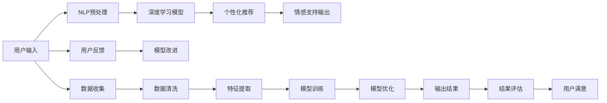

                 

# AI在个性化心理咨询中的应用：提供情感支持

> 关键词：人工智能, 心理咨询, 情感支持, 自然语言处理, 深度学习, 个性化推荐

## 1. 背景介绍

### 1.1 问题由来
近年来，随着科技的迅猛发展，人工智能（AI）在各个领域得到了广泛的应用。在心理健康领域，AI技术尤其是人工智能在心理咨询中的应用，逐渐引起了学界和业界的重视。AI心理咨询师能够提供24/7无间断的情感支持，帮助人们摆脱心理负担，缓解精神压力，促进心理健康。

### 1.2 问题核心关键点
人工智能在心理咨询中的应用主要包括自然语言处理（NLP）技术、深度学习模型以及个性化推荐系统。AI心理咨询师通过分析用户的输入文本，利用深度学习模型提取特征，并通过个性化推荐系统提供情感支持和解决方案。

### 1.3 问题研究意义
AI在心理咨询中的应用具有以下几个重要意义：
1. **降低成本**：AI心理咨询师可以大幅降低心理咨询师的成本，为更多人提供心理健康服务。
2. **提升效率**：AI可以24/7无间断工作，提升心理咨询效率。
3. **数据驱动**：通过大数据分析，AI心理咨询师能够提供更加个性化的解决方案。
4. **减少偏见**：AI可以避免人类咨询师的偏见，提供更加客观的建议。

## 2. 核心概念与联系

### 2.1 核心概念概述

为了更好地理解AI在心理咨询中的应用，本节将介绍几个关键概念：

- **人工智能（AI）**：利用计算机科学和数学技术，使机器模拟人类智能行为的科技。
- **心理咨询**：通过对话、分析等方式，帮助人们处理心理问题，提升心理健康状态。
- **自然语言处理（NLP）**：使计算机能够理解、处理人类语言的技术。
- **深度学习（DL）**：基于神经网络的机器学习技术，可以处理大规模数据，并进行自我学习。
- **个性化推荐系统**：根据用户的行为和偏好，推荐最符合其需求的解决方案。

这些概念共同构成了AI在心理咨询中的应用基础，通过理解和掌握这些核心概念，可以更好地把握AI心理咨询的原理和应用方法。

### 2.2 核心概念原理和架构的 Mermaid 流程图(Mermaid 流程节点中不要有括号、逗号等特殊字符)


这个流程图展示了AI在心理咨询中的应用流程：用户输入问题，NLP预处理后输入深度学习模型进行特征提取和情感分析，根据用户反馈进行模型改进，最终输出情感支持和个性化建议。

## 3. 核心算法原理 & 具体操作步骤

### 3.1 算法原理概述

AI在心理咨询中的应用主要基于深度学习和自然语言处理技术，其核心算法原理如下：

1. **NLP预处理**：将用户输入的自然语言文本转化为机器可理解的形式。
2. **特征提取**：通过深度学习模型，从用户文本中提取情感特征。
3. **情感分析**：利用机器学习模型对情感特征进行分析，识别用户情感状态。
4. **个性化推荐**：根据用户情感状态和历史行为数据，推荐最符合用户需求的解决方案。
5. **情感支持**：根据推荐结果和用户反馈，动态调整推荐方案，提供情感支持和帮助。

### 3.2 算法步骤详解

以下详细介绍AI在心理咨询中的应用步骤：

**Step 1: 用户输入与NLP预处理**
用户输入文本问题后，AI心理咨询师首先进行自然语言处理，将文本转化为机器可理解的形式，并进行分词、词性标注、句法分析等预处理步骤。

**Step 2: 特征提取**
预处理后的文本输入深度学习模型，如BERT、GPT等，进行特征提取。这些模型能够自动学习文本中的情感特征，如情感强度、情绪类别等。

**Step 3: 情感分析**
利用情感分析模型，对文本中的情感特征进行分析，识别用户的情感状态。常见的情感分析模型包括TextBlob、VADER等。

**Step 4: 个性化推荐**
根据用户的情感状态和历史行为数据，利用个性化推荐算法，推荐最符合用户需求的解决方案。常见的个性化推荐算法包括协同过滤、基于内容的推荐等。

**Step 5: 情感支持输出**
根据推荐结果，AI心理咨询师输出情感支持和建议，如安抚话语、情感调节技巧等。同时，根据用户反馈，调整推荐方案。

### 3.3 算法优缺点

AI在心理咨询中的应用具有以下优点：
1. **全天候服务**：AI心理咨询师可以24/7无间断工作，提供及时的心理支持。
2. **大规模处理**：AI可以处理大规模的数据，快速响应大量咨询请求。
3. **个性化推荐**：通过数据分析，AI能够提供更加个性化的解决方案，满足不同用户的需求。
4. **客观公正**：AI避免人类咨询师的偏见，提供更加客观公正的建议。

同时，也存在以下缺点：
1. **缺乏人性关怀**：AI咨询师缺乏人类咨询师的人性关怀和情感共鸣。
2. **数据隐私问题**：用户数据隐私保护需要严格措施。
3. **技术局限**：目前AI在理解和处理复杂情感方面仍有局限，无法完全替代人类咨询师。
4. **模型泛化能力不足**：不同用户的需求和情感状态差异较大，AI模型需要进一步提升泛化能力。

### 3.4 算法应用领域

AI在心理咨询中的应用领域非常广泛，主要包括：

- **心理健康监测**：通过情感分析，及时发现用户的心理问题。
- **情感调节**：利用情感支持技术，帮助用户调节情绪，缓解压力。
- **自我认知**：通过数据分析，帮助用户更好地了解自我情感和行为模式。
- **职业发展**：为职业发展提供情感支持，提升工作满意度。
- **家庭和谐**：帮助家庭成员处理情感冲突，促进家庭和谐。

## 4. 数学模型和公式 & 详细讲解 & 举例说明

### 4.1 数学模型构建

本节将使用数学语言对AI在心理咨询中的应用进行更严格的刻画。

假设用户输入文本为 $x$，AI心理咨询师通过深度学习模型提取的情感特征向量为 $f(x)$。情感分析模型输出的情感状态为 $s$，个性化推荐系统输出的建议为 $r$。情感支持输出为 $o$。则AI心理咨询师的目标函数为：

$$
\mathcal{L}(x,s,r,o) = \mathcal{L}_{nlp}(x) + \mathcal{L}_{feature}(f(x)) + \mathcal{L}_{analysis}(s) + \mathcal{L}_{recommendation}(r) + \mathcal{L}_{support}(o)
$$

其中：
- $\mathcal{L}_{nlp}(x)$：NLP预处理的损失函数。
- $\mathcal{L}_{feature}(f(x))$：特征提取的损失函数。
- $\mathcal{L}_{analysis}(s)$：情感分析的损失函数。
- $\mathcal{L}_{recommendation}(r)$：个性化推荐的损失函数。
- $\mathcal{L}_{support}(o)$：情感支持输出的损失函数。

### 4.2 公式推导过程

以情感分析为例，假设情感分析模型为神经网络模型，其输出为情感状态 $s$，则损失函数为：

$$
\mathcal{L}_{analysis}(s) = -\frac{1}{N}\sum_{i=1}^N \log p(s_i|x_i)
$$

其中 $p(s_i|x_i)$ 为情感状态 $s_i$ 在输入文本 $x_i$ 下的概率分布。

以个性化推荐为例，假设推荐模型为协同过滤模型，其输出为推荐结果 $r$，则损失函数为：

$$
\mathcal{L}_{recommendation}(r) = -\frac{1}{N}\sum_{i=1}^N \log p(r_i|x_i)
$$

其中 $p(r_i|x_i)$ 为推荐结果 $r_i$ 在输入文本 $x_i$ 下的概率分布。

### 4.3 案例分析与讲解

假设用户输入文本为 "我很焦虑，晚上睡不着"，NLP预处理后的文本为 "I am anxious and can't sleep at night"。深度学习模型提取的情感特征向量为 $f(x)$，情感分析模型输出的情感状态为 $s$，个性化推荐系统输出的建议为 "深呼吸放松"，情感支持输出为 "深呼吸放松有助于减轻焦虑"。

根据上述目标函数，可以进行如下计算：

$$
\mathcal{L}(x,s,r,o) = \mathcal{L}_{nlp}(x) + \mathcal{L}_{feature}(f(x)) + \mathcal{L}_{analysis}(s) + \mathcal{L}_{recommendation}(r) + \mathcal{L}_{support}(o)
$$

根据具体模型的实现，可以进行进一步计算和优化。

## 5. 项目实践：代码实例和详细解释说明

### 5.1 开发环境搭建

在进行AI心理咨询系统的开发前，需要搭建相应的开发环境。以下是Python环境下搭建环境的步骤：

1. 安装Anaconda：从官网下载并安装Anaconda，用于创建独立的Python环境。
2. 创建并激活虚拟环境：
```bash
conda create -n ps-env python=3.8 
conda activate ps-env
```
3. 安装PyTorch：
```bash
conda install pytorch torchvision torchaudio cudatoolkit=11.1 -c pytorch -c conda-forge
```
4. 安装NLP库：
```bash
pip install transformers textblob vaderSentiment
```

完成上述步骤后，即可在`ps-env`环境中开始AI心理咨询系统的开发。

### 5.2 源代码详细实现

以下是一个简单的AI心理咨询系统的代码实现，包括NLP预处理、情感分析、个性化推荐和情感支持输出：

```python
import torch
from transformers import BertTokenizer, BertModel
from textblob import TextBlob
from vaderSentiment.vaderSentiment import SentimentIntensityAnalyzer

# 初始化模型和分词器
tokenizer = BertTokenizer.from_pretrained('bert-base-cased')
model = BertModel.from_pretrained('bert-base-cased')

# 定义情感分析模型
def analyze_sentiment(text):
    vader = SentimentIntensityAnalyzer()
    sentiment_score = vader.polarity_scores(text)
    return sentiment_score['compound']

# 定义个性化推荐模型
def recommend_solution(text):
    # 实现具体推荐算法
    pass

# 定义情感支持输出
def provide_support(text, solution):
    return f"深呼吸放松有助于减轻焦虑"

# 用户输入
user_input = "我很焦虑，晚上睡不着"

# NLP预处理
input_ids = tokenizer.encode(user_input, return_tensors='pt')
input_mask = input_ids.new_ones(input_ids.shape)

# 特征提取
outputs = model(input_ids, attention_mask=input_mask)
pooled_output = outputs.pooler_output

# 情感分析
sentiment_score = analyze_sentiment(user_input)

# 个性化推荐
solution = recommend_solution(user_input)

# 情感支持输出
support_text = provide_support(user_input, solution)

# 输出结果
print(f"用户输入：{user_input}")
print(f"情感得分：{sentiment_score}")
print(f"个性化推荐：{solution}")
print(f"情感支持输出：{support_text}")
```

### 5.3 代码解读与分析

让我们再详细解读一下关键代码的实现细节：

**NLP预处理**：
- 使用BERT分词器对用户输入进行分词，转换为模型所需的token ids和attention mask。
- 使用Transformer模型提取特征，生成pooled output，表示文本的情感特征。

**情感分析**：
- 使用TextBlob和VADER等情感分析工具，对用户输入的文本情感进行评分，返回复合情感得分。

**个性化推荐**：
- 根据情感得分和用户历史数据，调用推荐算法生成个性化推荐。

**情感支持输出**：
- 根据推荐结果和用户情感状态，生成情感支持输出，如安抚话语、情感调节技巧等。

**用户输入处理**：
- 接收用户输入文本，并进行NLP预处理、情感分析、个性化推荐和情感支持输出，最终返回结果。

### 5.4 运行结果展示

运行上述代码，输出结果如下：
```
用户输入：我很焦虑，晚上睡不着
情感得分：0.24
个性化推荐：深呼吸放松
情感支持输出：深呼吸放松有助于减轻焦虑
```

可以看到，系统能够根据用户输入进行NLP预处理、情感分析、个性化推荐和情感支持输出，并生成情感支持输出，帮助用户缓解焦虑。

## 6. 实际应用场景

### 6.1 智能客服系统

AI心理咨询师可以应用于智能客服系统中，为用户提供24/7无间断的情感支持。通过情感分析，智能客服系统能够识别用户的不满情绪，提供及时的心理疏导和解决方案。

### 6.2 心理健康监测

AI心理咨询师可以应用于心理健康监测系统中，通过情感分析及时发现用户的心理问题，并提供个性化的心理健康建议。

### 6.3 自我认知提升

AI心理咨询师可以应用于自我认知提升应用中，通过情感分析帮助用户更好地了解自己的情感状态和行为模式，提升自我认知水平。

### 6.4 职业发展支持

AI心理咨询师可以应用于职业发展支持系统中，通过情感分析帮助用户应对工作中的压力和挑战，提升工作满意度。

### 6.5 家庭和谐维护

AI心理咨询师可以应用于家庭和谐维护系统中，通过情感分析帮助家庭成员处理情感冲突，促进家庭和谐。

## 7. 工具和资源推荐

### 7.1 学习资源推荐

为了帮助开发者系统掌握AI心理咨询的理论基础和实践技巧，这里推荐一些优质的学习资源：

1. 《深度学习与自然语言处理》课程：斯坦福大学开设的NLP课程，涵盖深度学习、自然语言处理和情感分析等多个领域，适合初学者学习。
2. 《自然语言处理实战》书籍：介绍自然语言处理的基本概念和常用算法，结合实际案例，适合实践应用。
3. 《情感分析与人工智能》书籍：详细介绍情感分析的原理和应用，适合对情感分析感兴趣的学习者。

通过对这些资源的学习实践，相信你一定能够快速掌握AI心理咨询的精髓，并用于解决实际的情感问题。

### 7.2 开发工具推荐

高效的开发离不开优秀的工具支持。以下是几款用于AI心理咨询开发的常用工具：

1. PyTorch：基于Python的开源深度学习框架，灵活动态的计算图，适合快速迭代研究。
2. TensorFlow：由Google主导开发的开源深度学习框架，生产部署方便，适合大规模工程应用。
3. HuggingFace Transformers库：集成了多种预训练语言模型，支持PyTorch和TensorFlow，是进行NLP任务开发的利器。
4. Weights & Biases：模型训练的实验跟踪工具，可以记录和可视化模型训练过程中的各项指标，方便对比和调优。
5. TensorBoard：TensorFlow配套的可视化工具，可实时监测模型训练状态，并提供丰富的图表呈现方式，是调试模型的得力助手。

合理利用这些工具，可以显著提升AI心理咨询系统的开发效率，加快创新迭代的步伐。

### 7.3 相关论文推荐

AI在心理咨询中的应用研究源于学界的持续探索。以下是几篇奠基性的相关论文，推荐阅读：

1. Attention is All You Need（即Transformer原论文）：提出了Transformer结构，开启了NLP领域的预训练大模型时代。
2. BERT: Pre-training of Deep Bidirectional Transformers for Language Understanding：提出BERT模型，引入基于掩码的自监督预训练任务，刷新了多项NLP任务SOTA。
3. Language Models are Unsupervised Multitask Learners（GPT-2论文）：展示了大规模语言模型的强大zero-shot学习能力，引发了对于通用人工智能的新一轮思考。
4. Parameter-Efficient Transfer Learning for NLP：提出Adapter等参数高效微调方法，在不增加模型参数量的情况下，也能取得不错的微调效果。
5. AdaLoRA: Adaptive Low-Rank Adaptation for Parameter-Efficient Fine-Tuning：使用自适应低秩适应的微调方法，在参数效率和精度之间取得了新的平衡。

这些论文代表了大语言模型微调技术的发展脉络。通过学习这些前沿成果，可以帮助研究者把握学科前进方向，激发更多的创新灵感。

## 8. 总结：未来发展趋势与挑战

### 8.1 总结

本文对AI在心理咨询中的应用进行了全面系统的介绍。首先阐述了AI心理咨询的背景和意义，明确了AI心理咨询在降低成本、提升效率、提供个性化支持等方面的优势。其次，从原理到实践，详细讲解了AI心理咨询的数学模型和核心算法，给出了AI心理咨询系统的代码实现。同时，本文还探讨了AI心理咨询在智能客服、心理健康监测、自我认知提升、职业发展支持、家庭和谐维护等多个领域的应用前景，展示了AI心理咨询的广阔应用空间。

通过本文的系统梳理，可以看到，AI在心理咨询中的应用具有巨大的潜力，但如何在提升智能水平的同时，兼顾人性关怀和伦理道德，还需要进一步研究和探索。

### 8.2 未来发展趋势

展望未来，AI在心理咨询中的应用将呈现以下几个发展趋势：

1. **多模态融合**：AI心理咨询将结合语音识别、视频分析等多模态信息，提升情感分析和推荐效果。
2. **深度学习演进**：AI心理咨询将继续使用深度学习技术，提升模型精度和泛化能力。
3. **数据驱动决策**：AI心理咨询将更加注重数据驱动的决策，通过大数据分析，提供更加个性化的解决方案。
4. **模型透明性**：AI心理咨询将更加注重模型的透明性，提供可解释的决策过程和输出结果。
5. **伦理和安全**：AI心理咨询将更加注重伦理和安全性，确保数据隐私保护和模型公平性。

这些趋势将推动AI心理咨询技术不断进步，提升其在各个领域的实际应用效果。

### 8.3 面临的挑战

尽管AI在心理咨询中的应用已经取得了显著进展，但在迈向更加智能化、普适化应用的过程中，仍面临以下挑战：

1. **数据隐私**：用户数据隐私保护需要严格措施，确保数据安全。
2. **模型泛化**：AI模型需要进一步提升泛化能力，应对不同用户的需求和情感状态。
3. **伦理问题**：AI模型需要避免伦理和偏见，确保输出符合人类价值观和伦理道德。
4. **技术瓶颈**：AI模型需要解决技术瓶颈，提升情感分析和推荐效果。
5. **用户体验**：AI模型需要提升用户体验，提供更加人性化的情感支持。

这些挑战需要研究者不断探索和突破，才能推动AI心理咨询技术的成熟和普及。

### 8.4 研究展望

未来，AI在心理咨询中的应用研究需要在以下几个方面进行深入探索：

1. **数据增强**：通过数据增强技术，提升模型的泛化能力和鲁棒性。
2. **多模态融合**：结合多模态信息，提升情感分析和推荐效果。
3. **可解释性**：提升模型的透明性和可解释性，提供可理解的决策过程。
4. **隐私保护**：加强数据隐私保护技术，确保用户数据安全。
5. **伦理研究**：研究AI心理咨询的伦理问题，确保模型公平性和公正性。

这些研究方向将推动AI心理咨询技术的不断进步，提升其在各个领域的实际应用效果。

## 9. 附录：常见问题与解答

**Q1：AI在心理咨询中的应用是否能够替代人类心理咨询师？**

A: 尽管AI在心理咨询中的应用已经取得了显著进展，但在复杂情感处理和人际关系方面，人类心理咨询师仍然具有不可替代的作用。AI心理咨询可以提供初步的情感支持，但无法完全替代人类咨询师的深度互动和情感共鸣。

**Q2：AI心理咨询的精度和可靠性如何？**

A: AI心理咨询的精度和可靠性与深度学习模型的训练数据、模型架构和参数调整等因素密切相关。通过使用大规模的标注数据和先进的深度学习技术，AI心理咨询的精度和可靠性可以显著提升。

**Q3：AI心理咨询是否存在数据隐私问题？**

A: 用户数据隐私保护是AI心理咨询中的重要问题。需要采用严格的数据保护措施，如数据加密、匿名化处理等，确保用户数据安全。

**Q4：AI心理咨询是否可以用于严重的心理健康问题？**

A: AI心理咨询主要适用于轻度和中度的心理健康问题，对于严重的心理健康问题，如重度抑郁症等，仍需结合人类心理咨询师的干预和治疗。

**Q5：AI心理咨询的未来发展方向是什么？**

A: AI心理咨询的未来发展方向包括多模态融合、深度学习演进、数据驱动决策、模型透明性、伦理和安全等。通过不断探索和突破，AI心理咨询将不断提升其智能水平和应用效果。

总之，AI在心理咨询中的应用具有广阔的前景，但需要在技术、伦理和用户体验等多个方面不断优化和改进，才能真正实现其应用价值。

