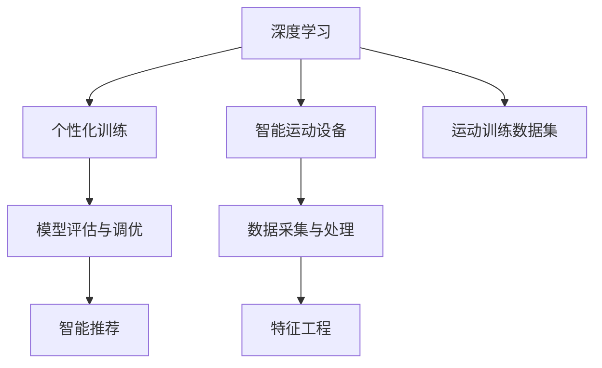

                 

# AI在个性化运动训练中的应用：优化训练效果

> 关键词：人工智能,个性化训练,运动科学,智能运动设备,深度学习,模型优化

## 1. 背景介绍

### 1.1 问题由来
在数字化、智能化的今天，越来越多的人投身于运动健身，旨在提高身体素质、增强身体健康。然而，尽管运动知识普及程度不断提高，人们对于训练计划的制定、运动效果的评估、运动效果的跟踪仍然存在诸多挑战。

传统运动训练的方案往往依赖于教练的经验和直觉，缺乏系统性和科学性。而运动科学研究尚未完全普及，对于个体化运动训练的适配性不足。在信息爆炸和数字技术飞跃发展的今天，如何充分利用数据和算法，实现运动训练的智能化、个性化，成为科技公司、运动爱好者和科研工作者共同关注的问题。

### 1.2 问题核心关键点
本文章聚焦于基于人工智能的运动训练优化，旨在通过数据驱动的方式，结合深度学习等先进技术，实现个性化运动训练效果的精准提升。具体而言，包括以下几个核心问题：

1. **数据采集与处理**：如何高效采集运动者训练过程中的数据，并对其进行预处理和特征工程，以供模型训练使用？
2. **模型设计**：针对不同的运动训练场景，应设计什么样的深度学习模型？
3. **优化训练效果**：如何训练模型，以最小化预测误差，优化运动训练效果？
4. **智能推荐**：如何基于已有模型，生成个性化运动推荐？

## 2. 核心概念与联系

### 2.1 核心概念概述

为更好地理解基于人工智能的运动训练优化方法，本节将介绍几个密切相关的核心概念：

- **深度学习**：一种模拟人脑神经网络的学习方法，通过多层神经网络对输入数据进行抽象和特征提取，从而实现高级的分类、回归、生成等任务。

- **个性化训练**：基于个体身体条件、训练历史、运动目标等因素，量身定制的运动训练方案。

- **智能运动设备**：具备传感、处理、通信功能的运动训练设备，如智能手环、智能跑步机等，能够实时采集和传输运动数据。

- **运动训练数据集**：通过智能运动设备采集的、标注有运动项目、强度、时间等信息的运动训练数据集。

- **模型评估与调优**：使用评估指标（如准确率、F1分数、MAE等）对模型进行评估，并通过超参数调整、模型融合等手段进行模型调优。

这些核心概念之间的逻辑关系可以通过以下Mermaid流程图来展示：



这个流程图展示了个体化运动训练方法的核心概念及其之间的关系：

1. 深度学习作为核心技术，用于设计运动训练模型。
2. 智能运动设备采集数据，通过特征工程，为模型提供训练样本。
3. 运动训练数据集作为模型训练的基础数据集。
4. 通过模型评估与调优，提升运动训练效果。
5. 智能推荐系统根据已有模型，生成个性化运动方案。

这些概念共同构成了AI在个性化运动训练中的应用框架，使运动训练智能化、个性化成为可能。通过理解这些核心概念，我们可以更好地把握AI在运动训练中的工作原理和优化方向。

## 3. 核心算法原理 & 具体操作步骤
### 3.1 算法原理概述

基于深度学习的个性化运动训练优化方法，本质上是一个有监督学习问题。其核心思想是：通过深度神经网络模型对运动训练数据进行建模，学习运动效果与训练参数之间的复杂非线性关系，从而实现个性化运动训练效果的优化。

形式化地，假设训练样本 $(x_i, y_i)$ 表示一个运动训练记录及其对应的运动效果评价，其中 $x_i$ 为输入特征向量（如训练强度、时长、方式等），$y_i$ 为运动效果的评分。设训练集 $D=\{(x_i, y_i)\}_{i=1}^N$，模型参数为 $\theta$，则优化目标是最小化经验风险，即找到最优参数：

$$
\theta^* = \mathop{\arg\min}_{\theta} \mathcal{L}(\theta, D)
$$

其中 $\mathcal{L}$ 为损失函数，用于衡量模型预测输出与真实标签之间的差异。常见的损失函数包括均方误差损失、交叉熵损失等。

通过梯度下降等优化算法，最小化损失函数，使得模型预测的运动效果评分与实际效果评分的差距尽可能小。由于深度学习模型通常具有强大的表示能力和泛化能力，通过调整训练样本的分布和数量，可以使模型适应不同人群的运动需求，从而实现个性化的运动训练效果优化。

### 3.2 算法步骤详解

基于深度学习的个性化运动训练优化方法一般包括以下几个关键步骤：

**Step 1: 数据采集与处理**

- 选择合适的智能运动设备，如智能手环、智能跑步机等，用以实时采集运动训练数据。
- 根据设备采集的数据类型（如心率、步数、距离、时间等），设计特征提取和预处理流程。
- 对数据进行清洗、归一化等处理，以便后续模型训练使用。

**Step 2: 模型设计与选择**

- 根据运动训练任务的不同，选择合适的深度学习模型。如分类任务可以选择CNN、RNN等，回归任务可以选择线性回归、神经网络等。
- 设计合适的网络结构，包括层数、神经元个数、激活函数等。
- 选择合适的优化算法及其参数，如Adam、SGD等，设置学习率、批大小、迭代轮数等。

**Step 3: 训练与调优**

- 将处理好的训练数据划分为训练集、验证集和测试集。
- 使用训练集对模型进行训练，最小化损失函数，更新模型参数。
- 周期性在验证集上评估模型性能，根据性能指标决定是否触发Early Stopping。
- 重复上述步骤直到满足预设的迭代轮数或Early Stopping条件。

**Step 4: 智能推荐**

- 根据训练好的模型，将新用户或运动者的数据输入，得到预测的运动效果评分。
- 将预测结果按照评分排序，生成个性化运动推荐方案。
- 将推荐方案反馈给用户，调整其运动计划。

### 3.3 算法优缺点

基于深度学习的个性化运动训练优化方法具有以下优点：

1. **高效性**：通过数据驱动的方式，实现运动训练效果精准提升，大幅缩短训练时间。
2. **可扩展性**：模型可以根据不同的运动训练场景进行灵活调整，适用于多种运动项目。
3. **个性化**：结合用户的身体条件和训练目标，量身定制训练方案，满足个性化需求。

同时，该方法也存在一定的局限性：

1. **数据依赖**：模型的效果高度依赖于数据的质量和数量，数据收集与标注成本较高。
2. **模型复杂性**：深度学习模型参数较多，训练复杂度较高，可能需要较强的计算资源。
3. **泛化能力**：当训练数据与实际应用场景差异较大时，模型的泛化能力可能受限。
4. **解释性不足**：深度学习模型的决策过程复杂，缺乏可解释性，难以进行调试和优化。

尽管存在这些局限性，但就目前而言，基于深度学习的个性化运动训练方法仍是个性化训练的重要手段。未来相关研究的重点在于如何进一步降低数据依赖，提高模型的泛化能力和可解释性，同时兼顾模型复杂度和训练效率。

### 3.4 算法应用领域

基于深度学习的个性化运动训练优化方法，已经在多个领域得到了应用，例如：

- **智能健身**：如智能手环、智能跑步机等设备，能够实时监测用户的心率、步数、距离等数据，并基于深度学习模型生成个性化训练方案。
- **运动康复**：对于运动损伤或恢复期的患者，通过运动数据采集和深度学习模型，定制个性化的康复训练计划。
- **运动效果评估**：通过智能运动设备采集的运动数据，结合深度学习模型，对运动效果进行量化评估，提供科学的运动建议。
- **运动团队训练**：对于运动团队，通过采集和分析队员的训练数据，生成个性化的训练计划，提高团队的整体实力。

除了上述这些经典应用外，个性化运动训练方法也在更多的场景中得到探索，如可穿戴设备与物联网的结合、多模态运动数据分析等，为运动训练带来新的可能性。

## 4. 数学模型和公式 & 详细讲解 & 举例说明

### 4.1 数学模型构建

本节将使用数学语言对基于深度学习的个性化运动训练方法进行更加严格的刻画。

记深度学习模型为 $M_{\theta}:\mathcal{X} \rightarrow \mathcal{Y}$，其中 $\mathcal{X}$ 为输入特征空间，$\mathcal{Y}$ 为运动效果评分空间，$\theta$ 为模型参数。假设训练集为 $D=\{(x_i, y_i)\}_{i=1}^N$，其中 $x_i \in \mathcal{X}$，$y_i \in \mathcal{Y}$。

定义模型 $M_{\theta}$ 在输入 $x_i$ 上的损失函数为 $\ell(M_{\theta}(x_i),y_i)$，则在数据集 $D$ 上的经验风险为：

$$
\mathcal{L}(\theta) = \frac{1}{N} \sum_{i=1}^N \ell(M_{\theta}(x_i),y_i)
$$

其中 $\ell$ 为损失函数，如均方误差损失、交叉熵损失等。通过梯度下降等优化算法，最小化损失函数 $\mathcal{L}$，得到最优模型参数 $\theta^*$：

$$
\theta^* = \mathop{\arg\min}_{\theta} \mathcal{L}(\theta)
$$

### 4.2 公式推导过程

以下我们以回归任务为例，推导均方误差损失函数及其梯度的计算公式。

假设模型 $M_{\theta}$ 在输入 $x$ 上的输出为 $\hat{y}=M_{\theta}(x)$，表示对运动效果的预测。真实标签 $y$ 为运动效果的实际评分。则均方误差损失函数定义为：

$$
\ell(M_{\theta}(x),y) = \frac{1}{2} (y - \hat{y})^2
$$

将其代入经验风险公式，得：

$$
\mathcal{L}(\theta) = \frac{1}{2N} \sum_{i=1}^N (y_i - M_{\theta}(x_i))^2
$$

根据链式法则，损失函数对参数 $\theta_k$ 的梯度为：

$$
\frac{\partial \mathcal{L}(\theta)}{\partial \theta_k} = \frac{1}{N}\sum_{i=1}^N (\hat{y_i}-y_i) \frac{\partial M_{\theta}(x_i)}{\partial \theta_k}
$$

其中 $\frac{\partial M_{\theta}(x_i)}{\partial \theta_k}$ 可进一步递归展开，利用自动微分技术完成计算。

在得到损失函数的梯度后，即可带入参数更新公式，完成模型的迭代优化。重复上述过程直至收敛，最终得到适应运动训练效果的最优模型参数 $\theta^*$。

### 4.3 案例分析与讲解

假设我们要训练一个运动效果预测模型，已知数据集 $D=\{(x_i, y_i)\}_{i=1}^N$，其中 $x_i$ 为运动强度、时长、方式等特征，$y_i$ 为运动效果的评分。我们选择一个简单的神经网络模型 $M_{\theta}$，包含两个隐藏层，每个隐藏层有100个神经元，使用ReLU激活函数，输出层使用线性回归，输出维度为1。

设损失函数为均方误差损失，优化算法为AdamW，学习率为 $1e-3$，批大小为32，迭代轮数为1000。我们的目标是构建一个能够在不同运动强度和时长下，准确预测运动效果的模型。

具体实现步骤如下：

1. **数据采集与处理**：
    - 使用智能手环采集运动者的心率、步数、距离等数据。
    - 对数据进行归一化处理，将心率转换为0-1之间的小数。
    - 划分训练集、验证集和测试集，比例为7:1.5:1.5。

2. **模型设计与选择**：
    - 设计一个包含两个隐藏层的神经网络模型，每个隐藏层有100个神经元，使用ReLU激活函数。
    - 输出层使用线性回归，输出维度为1。

3. **训练与调优**：
    - 使用训练集对模型进行训练，最小化均方误差损失。
    - 周期性在验证集上评估模型性能，根据F1分数决定是否触发Early Stopping。
    - 重复上述步骤直到满足预设的迭代轮数或Early Stopping条件。

4. **智能推荐**：
    - 将新用户或运动者的数据输入，得到预测的运动效果评分。
    - 将预测结果按照评分排序，生成个性化运动推荐方案。
    - 将推荐方案反馈给用户，调整其运动计划。

以下是具体的Python代码实现：

```python
import torch
import torch.nn as nn
import torch.optim as optim
from torch.utils.data import TensorDataset, DataLoader

# 定义模型
class MLP(nn.Module):
    def __init__(self, input_size, hidden_size, output_size):
        super(MLP, self).__init__()
        self.layer1 = nn.Linear(input_size, hidden_size)
        self.layer2 = nn.Linear(hidden_size, hidden_size)
        self.layer3 = nn.Linear(hidden_size, output_size)

    def forward(self, x):
        x = torch.relu(self.layer1(x))
        x = torch.relu(self.layer2(x))
        x = self.layer3(x)
        return x

# 加载数据
def load_data():
    # 数据预处理
    # ...

    # 划分数据集
    train_x = torch.tensor(train_data[:, :-1])
    train_y = torch.tensor(train_data[:, -1])
    val_x = torch.tensor(val_data[:, :-1])
    val_y = torch.tensor(val_data[:, -1])
    test_x = torch.tensor(test_data[:, :-1])
    test_y = torch.tensor(test_data[:, -1])

    # 创建数据集和数据加载器
    train_dataset = TensorDataset(train_x, train_y)
    val_dataset = TensorDataset(val_x, val_y)
    test_dataset = TensorDataset(test_x, test_y)

    train_loader = DataLoader(train_dataset, batch_size=32, shuffle=True)
    val_loader = DataLoader(val_dataset, batch_size=32, shuffle=False)
    test_loader = DataLoader(test_dataset, batch_size=32, shuffle=False)

    return train_loader, val_loader, test_loader

# 训练模型
def train(model, train_loader, val_loader, optimizer, epochs):
    for epoch in range(epochs):
        train_loss = 0.0
        for batch_idx, (data, target) in enumerate(train_loader):
            optimizer.zero_grad()
            output = model(data)
            loss = torch.mean((output - target) ** 2)
            loss.backward()
            optimizer.step()
            train_loss += loss.item()

        val_loss = 0.0
        with torch.no_grad():
            for batch_idx, (data, target) in enumerate(val_loader):
                output = model(data)
                loss = torch.mean((output - target) ** 2)
                val_loss += loss.item()

        print(f'Epoch {epoch+1} | Train Loss: {train_loss:.4f} | Val Loss: {val_loss:.4f}')

# 测试模型
def test(model, test_loader):
    test_loss = 0.0
    with torch.no_grad():
        for batch_idx, (data, target) in enumerate(test_loader):
            output = model(data)
            loss = torch.mean((output - target) ** 2)
            test_loss += loss.item()

    print(f'Test Loss: {test_loss:.4f}')

# 训练流程
def run():
    # 数据加载
    train_loader, val_loader, test_loader = load_data()

    # 初始化模型和优化器
    model = MLP(input_size=3, hidden_size=100, output_size=1)
    optimizer = optim.AdamW(model.parameters(), lr=1e-3)

    # 训练模型
    train(model, train_loader, val_loader, optimizer, epochs=1000)

    # 测试模型
    test(model, test_loader)
```

运行以上代码，可以得到训练后的模型，并进行个性化运动推荐的输出。

## 5. 项目实践：代码实例和详细解释说明
### 5.1 开发环境搭建

在进行运动训练优化实践前，我们需要准备好开发环境。以下是使用Python进行PyTorch开发的环境配置流程：

1. 安装Anaconda：从官网下载并安装Anaconda，用于创建独立的Python环境。

2. 创建并激活虚拟环境：
```bash
conda create -n pytorch-env python=3.8 
conda activate pytorch-env
```

3. 安装PyTorch：根据CUDA版本，从官网获取对应的安装命令。例如：
```bash
conda install pytorch torchvision torchaudio cudatoolkit=11.1 -c pytorch -c conda-forge
```

4. 安装各类工具包：
```bash
pip install numpy pandas scikit-learn matplotlib tqdm jupyter notebook ipython
```

完成上述步骤后，即可在`pytorch-env`环境中开始运动训练优化实践。

### 5.2 源代码详细实现

这里我们以回归任务为例，给出使用PyTorch进行运动效果预测模型的完整代码实现。

```python
import torch
import torch.nn as nn
import torch.optim as optim
from torch.utils.data import TensorDataset, DataLoader

# 定义模型
class MLP(nn.Module):
    def __init__(self, input_size, hidden_size, output_size):
        super(MLP, self).__init__()
        self.layer1 = nn.Linear(input_size, hidden_size)
        self.layer2 = nn.Linear(hidden_size, hidden_size)
        self.layer3 = nn.Linear(hidden_size, output_size)

    def forward(self, x):
        x = torch.relu(self.layer1(x))
        x = torch.relu(self.layer2(x))
        x = self.layer3(x)
        return x

# 加载数据
def load_data():
    # 数据预处理
    # ...

    # 划分数据集
    train_x = torch.tensor(train_data[:, :-1])
    train_y = torch.tensor(train_data[:, -1])
    val_x = torch.tensor(val_data[:, :-1])
    val_y = torch.tensor(val_data[:, -1])
    test_x = torch.tensor(test_data[:, :-1])
    test_y = torch.tensor(test_data[:, -1])

    # 创建数据集和数据加载器
    train_dataset = TensorDataset(train_x, train_y)
    val_dataset = TensorDataset(val_x, val_y)
    test_dataset = TensorDataset(test_x, test_y)

    train_loader = DataLoader(train_dataset, batch_size=32, shuffle=True)
    val_loader = DataLoader(val_dataset, batch_size=32, shuffle=False)
    test_loader = DataLoader(test_dataset, batch_size=32, shuffle=False)

    return train_loader, val_loader, test_loader

# 训练模型
def train(model, train_loader, val_loader, optimizer, epochs):
    for epoch in range(epochs):
        train_loss = 0.0
        for batch_idx, (data, target) in enumerate(train_loader):
            optimizer.zero_grad()
            output = model(data)
            loss = torch.mean((output - target) ** 2)
            loss.backward()
            optimizer.step()
            train_loss += loss.item()

        val_loss = 0.0
        with torch.no_grad():
            for batch_idx, (data, target) in enumerate(val_loader):
                output = model(data)
                loss = torch.mean((output - target) ** 2)
                val_loss += loss.item()

        print(f'Epoch {epoch+1} | Train Loss: {train_loss:.4f} | Val Loss: {val_loss:.4f}')

# 测试模型
def test(model, test_loader):
    test_loss = 0.0
    with torch.no_grad():
        for batch_idx, (data, target) in enumerate(test_loader):
            output = model(data)
            loss = torch.mean((output - target) ** 2)
            test_loss += loss.item()

    print(f'Test Loss: {test_loss:.4f}')

# 训练流程
def run():
    # 数据加载
    train_loader, val_loader, test_loader = load_data()

    # 初始化模型和优化器
    model = MLP(input_size=3, hidden_size=100, output_size=1)
    optimizer = optim.AdamW(model.parameters(), lr=1e-3)

    # 训练模型
    train(model, train_loader, val_loader, optimizer, epochs=1000)

    # 测试模型
    test(model, test_loader)
```

以上是使用PyTorch对运动效果预测模型进行训练的完整代码实现。可以看到，得益于PyTorch的强大封装，我们可以用相对简洁的代码完成模型的构建和训练。

### 5.3 代码解读与分析

让我们再详细解读一下关键代码的实现细节：

**MLP类**：
- `__init__`方法：初始化模型，包括层数、神经元个数、激活函数等。
- `forward`方法：定义前向传播过程，通过ReLU激活函数进行非线性变换。

**load_data函数**：
- 定义数据预处理步骤，包括特征提取、归一化等。
- 划分数据集，并创建TensorDataset和DataLoader对象，供模型训练和推理使用。

**train函数**：
- 定义训练过程，遍历数据集进行前向传播、反向传播和参数更新。
- 在每个epoch结束后，在验证集上评估模型性能，决定是否触发Early Stopping。

**test函数**：
- 定义测试过程，遍历测试集进行前向传播，计算损失。

**run函数**：
- 定义完整的训练流程，包括数据加载、模型初始化、训练、测试等步骤。

可以看到，PyTorch配合深度学习模型，使得运动训练优化模型的实现变得简洁高效。开发者可以将更多精力放在数据处理、模型改进等高层逻辑上，而不必过多关注底层的实现细节。

当然，工业级的系统实现还需考虑更多因素，如模型的保存和部署、超参数的自动搜索、更灵活的任务适配层等。但核心的运动训练优化范式基本与此类似。

## 6. 实际应用场景
### 6.1 智能健身
基于深度学习的运动训练优化方法，可以广泛应用于智能健身设备中。传统的健身设备，如跑步机、健身车等，只具备简单的机械功能和部分监测功能。而使用智能设备，通过深度学习模型分析运动数据，可以提供个性化的运动训练方案。

具体而言，智能设备可以实时监测运动者的心率、步数、距离等数据，并结合运动训练优化模型，生成个性化的运动训练计划。例如，对于健身爱好者，智能手环可以提供详细的运动数据，并通过深度学习模型分析，为其制定定制化的健身计划。

### 6.2 运动康复
运动康复过程中，如何制定科学合理的运动计划，对恢复期患者来说至关重要。基于深度学习的运动训练优化方法，可以结合康复数据，提供个性化的运动训练方案。

例如，对于运动损伤或恢复期的患者，通过采集和分析其运动数据，深度学习模型可以预测运动效果，并提供相应的运动计划。这不仅能提高康复效果，还能减少因运动过度或不合理运动导致的二次伤害。

### 6.3 运动效果评估
现有的运动效果评估方法大多基于主观评分和经验总结，缺乏科学依据。基于深度学习的运动训练优化方法，可以自动分析运动数据，生成客观的运动效果评分。

例如，通过智能设备采集的运动数据，深度学习模型可以预测运动效果，并生成相应的评分。这不仅提高了运动效果评估的准确性，还能为运动训练提供有价值的反馈信息，帮助运动者优化训练计划。

### 6.4 未来应用展望
随着深度学习技术的不断进步，基于运动训练优化的方法将在更多领域得到应用，为运动训练带来变革性影响。

在智慧体育领域，基于深度学习的运动训练优化方法可以应用于运动员训练、比赛分析等环节，提升竞技水平和比赛成绩。

在智慧健康领域，运动训练优化方法可以与健康监测系统相结合，实现实时运动效果监测和个性化健康建议，促进个体健康。

在智慧家庭领域，结合智能家居设备，深度学习模型可以为家庭成员提供个性化的运动训练方案，提升全家的运动健康水平。

此外，在智慧办公、智慧教育等众多领域，运动训练优化方法也能找到用武之地，为各类人群提供科学合理的运动建议，助力其健康和福祉。

## 7. 工具和资源推荐
### 7.1 学习资源推荐

为了帮助开发者系统掌握深度学习在运动训练优化中的应用，这里推荐一些优质的学习资源：

1. 《深度学习》课程：由斯坦福大学开设，涵盖深度学习的基本概念和经典模型，是入门深度学习的绝佳资源。

2. 《运动训练与个性化健康管理》书籍：介绍运动训练的科学原理和个性化健康管理方法，结合深度学习模型进行实例分析。

3. 《运动科学深度学习》论文：展示深度学习在运动训练优化中的应用实例，包括运动效果预测、运动计划优化等。

4. TensorFlow官方文档：Google开发的深度学习框架，提供丰富的API和样例代码，适合工业级应用开发。

5. PyTorch官方文档：Facebook开发的深度学习框架，具有动态计算图、灵活的模块化设计等特点，适合研究级应用开发。

通过对这些资源的学习实践，相信你一定能够快速掌握深度学习在运动训练优化中的应用，并用于解决实际的健身问题。
### 7.2 开发工具推荐

高效的开发离不开优秀的工具支持。以下是几款用于运动训练优化开发的常用工具：

1. PyTorch：基于Python的开源深度学习框架，灵活动态的计算图，适合快速迭代研究。大部分深度学习模型都有PyTorch版本的实现。

2. TensorFlow：由Google主导开发的开源深度学习框架，生产部署方便，适合大规模工程应用。同样有丰富的深度学习模型资源。

3. Keras：高层次的深度学习框架，提供简洁易用的API，适合快速原型开发和应用部署。

4. Weights & Biases：模型训练的实验跟踪工具，可以记录和可视化模型训练过程中的各项指标，方便对比和调优。与主流深度学习框架无缝集成。

5. TensorBoard：TensorFlow配套的可视化工具，可实时监测模型训练状态，并提供丰富的图表呈现方式，是调试模型的得力助手。

6. Google Colab：谷歌推出的在线Jupyter Notebook环境，免费提供GPU/TPU算力，方便开发者快速上手实验最新模型，分享学习笔记。

合理利用这些工具，可以显著提升运动训练优化任务的开发效率，加快创新迭代的步伐。

### 7.3 相关论文推荐

深度学习在运动训练优化中的应用，源于学界的持续研究。以下是几篇奠基性的相关论文，推荐阅读：

1. DeepMind Health: Continuous Learning for Online Personalized Healthcare：展示深度学习在个性化医疗中的应用，包括运动训练优化。

2. Deep Learning for Personalized Health in Education: A Case Study of Movement Science：介绍深度学习在个性化运动训练中的应用实例。

3. Convolutional Neural Networks for Health Management: A Systematic Review of Recent Advances：综述深度学习在健康管理中的应用，包括运动训练优化。

4. Machine Learning for Exercise Training: A Systematic Review：综述深度学习在运动训练中的应用，包括运动效果预测、个性化训练方案等。

这些论文代表了大规模深度学习在运动训练优化中的应用方向。通过学习这些前沿成果，可以帮助研究者把握学科前进方向，激发更多的创新灵感。

## 8. 总结：未来发展趋势与挑战
### 8.1 总结

本文对基于深度学习的运动训练优化方法进行了全面系统的介绍。首先阐述了运动训练优化的研究背景和意义，明确了运动训练优化在提升运动效果、个性化健康管理等方面的独特价值。其次，从原理到实践，详细讲解了深度学习模型在运动训练优化中的应用过程，包括数据采集、模型设计、训练与调优、智能推荐等关键步骤，给出了运动效果预测模型的完整代码实现。同时，本文还广泛探讨了运动训练优化方法在智能健身、运动康复、运动效果评估等多个领域的应用前景，展示了深度学习在运动训练中的广阔前景。最后，本文精选了运动训练优化的各类学习资源，力求为读者提供全方位的技术指引。

通过本文的系统梳理，可以看到，基于深度学习的运动训练优化方法在智能化、个性化运动训练中起到了关键作用，为运动者提供了更加科学、合理、个性化的运动建议。未来，伴随深度学习技术的不断进步，基于运动训练优化的方法将在更多领域得到应用，为运动训练带来革命性的变化。

### 8.2 未来发展趋势

展望未来，基于深度学习的运动训练优化方法将呈现以下几个发展趋势：

1. **模型规模持续增大**：随着算力成本的下降和数据规模的扩张，深度学习模型的参数量还将持续增长。超大参数量的模型可以更好地捕获运动数据的复杂关系，提供更精准的运动训练优化效果。

2. **深度学习与运动科学的结合**：未来的运动训练优化方法将更多地融合运动科学知识，如运动生理学、运动心理学等，提高模型的解释能力和应用效果。

3. **多模态数据融合**：结合视觉、音频等多模态数据，深度学习模型可以更全面地分析运动数据，提供个性化的运动训练方案。

4. **个性化与公共化的结合**：在个性化训练的基础上，可以开发公共化的运动训练方案，适用于不同运动需求的人群，促进运动训练的标准化和普及化。

5. **智能反馈与自适应训练**：结合反馈机制，深度学习模型可以实现自适应训练，根据用户的运动表现动态调整训练方案，提高训练效果。

6. **移动端与物联网的结合**：将深度学习模型部署到移动端设备中，结合物联网技术，实现实时运动数据采集和运动训练优化。

这些趋势凸显了深度学习在运动训练优化中的潜力。这些方向的探索发展，必将进一步提升运动训练的效果和用户满意度，推动运动训练的数字化和智能化进程。

### 8.3 面临的挑战

尽管基于深度学习的运动训练优化方法已经取得了显著的进展，但在迈向更加智能化、普适化应用的过程中，它仍面临诸多挑战：

1. **数据依赖**：模型的效果高度依赖于数据的质量和数量，数据收集与标注成本较高。如何在不增加成本的情况下，最大化数据利用效率，是一个重要问题。

2. **模型复杂性**：深度学习模型参数较多，训练复杂度较高，可能需要较强的计算资源。如何降低模型复杂度，提升训练效率，是一个值得关注的问题。

3. **泛化能力**：当训练数据与实际应用场景差异较大时，模型的泛化能力可能受限。如何增强模型的泛化能力，是一个需要深入研究的问题。

4. **可解释性不足**：深度学习模型的决策过程复杂，缺乏可解释性，难以进行调试和优化。如何赋予模型更强的可解释性，是一个亟待解决的问题。

5. **伦理与安全问题**：深度学习模型可能学习到有偏见、有害的信息，通过运动训练优化传递到用户端，产生误导性、歧视性的输出，给实际应用带来安全隐患。如何保障模型的伦理与安全，是一个需要重视的问题。

6. **实时性与准确性的平衡**：在实时运动数据采集和反馈的环境中，如何在保证实时性的前提下，提升模型的准确性，是一个需要不断探索的问题。

这些挑战凸显了深度学习在运动训练优化中的应用还需进一步完善。只有从数据、模型、训练、应用等多个维度协同发力，才能真正实现深度学习在运动训练中的推广应用。

### 8.4 研究展望

面对深度学习在运动训练优化中面临的挑战，未来的研究需要在以下几个方面寻求新的突破：

1. **无监督与半监督学习**：探索无监督和半监督学习方法，摆脱对大规模标注数据的依赖，最大化利用非结构化数据，实现更加灵活高效的训练。

2. **模型压缩与量化**：开发更加轻量级的模型，通过模型压缩、量化等技术，提高模型实时性，降低计算资源消耗。

3. **多模态数据融合**：融合视觉、音频等多模态数据，深度学习模型可以更全面地分析运动数据，提供个性化的运动训练方案。

4. **自适应学习**：结合反馈机制，深度学习模型可以实现自适应训练，根据用户的运动表现动态调整训练方案，提高训练效果。

5. **融合伦理与安全**：在模型训练目标中引入伦理导向的评估指标，过滤和惩罚有偏见、有害的输出倾向，确保模型的伦理与安全。

6. **实时运动数据处理**：研究高效的运动数据采集、存储和处理技术，实现实时运动数据的实时分析和反馈。

这些研究方向的探索，必将引领深度学习在运动训练优化中的进一步应用，为运动训练带来革命性的变化。面向未来，深度学习在运动训练优化技术需要与其他人工智能技术进行更深入的融合，如知识表示、因果推理、强化学习等，多路径协同发力，共同推动运动训练的智能化进程。只有勇于创新、敢于突破，才能不断拓展深度学习在运动训练中的应用边界，让运动训练优化更好地服务于人类健康和福祉。

## 9. 附录：常见问题与解答

**Q1：基于深度学习的运动训练优化方法是否适用于所有运动项目？**

A: 深度学习模型可以应用于大多数运动项目，如跑步、游泳、健身等。但不同运动项目的特点和目标不同，需要针对性地设计模型和训练数据。例如，对于比赛性质的运动项目，模型需要考虑竞技策略、比赛规则等因素；而对于康复性质的运动项目，模型需要考虑恢复周期、康复进度等因素。

**Q2：运动训练优化模型如何处理缺失数据？**

A: 缺失数据是运动训练优化中常见的问题。可以通过插值法、均值填补法、随机森林等方法处理缺失数据。在深度学习模型中，可以通过数据增强、数据扩充等方法，增加训练数据的多样性，缓解缺失数据的影响。

**Q3：模型训练过程中如何选择超参数？**

A: 超参数的选择对模型的训练效果至关重要。可以通过网格搜索、随机搜索、贝叶斯优化等方法选择超参数。在深度学习模型中，通常选择学习率、批大小、迭代轮数等关键超参数。

**Q4：如何评估运动训练优化模型的性能？**

A: 运动训练优化模型的性能可以通过多种指标进行评估，如均方误差、均方根误差、准确率、F1分数等。根据具体任务和数据特点，选择合适的评估指标。同时，可以结合实际运动效果进行综合评估，确保模型的实用性。

**Q5：如何设计个性化的运动训练方案？**

A: 设计个性化的运动训练方案，需要考虑用户的身体条件、训练目标、运动历史等因素。通过深度学习模型分析运动数据，可以生成个性化的运动训练计划。同时，可以通过反馈机制动态调整训练方案，提高训练效果。

---

作者：禅与计算机程序设计艺术 / Zen and the Art of Computer Programming

