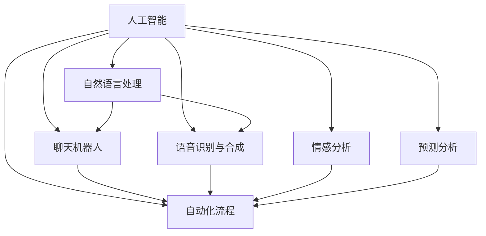

                 

# AI在客户服务中的应用：提高满意度

> 关键词：人工智能(AI), 客户服务, 自然语言处理(NLP), 聊天机器人, 自动化, 预测分析, 用户体验(UX), 客户满意度

## 1. 背景介绍

### 1.1 问题由来

在数字化时代的浪潮下，客户服务成为了企业竞争的关键领域。传统的客服模式依靠大量人力进行电话、邮件等形式的客户支持，面临着响应速度慢、成本高、效率低等问题。随着人工智能(AI)技术的发展，利用AI驱动的客户服务系统逐渐成为企业提升客户满意度的重要手段。AI技术的应用不仅能够提高服务效率，还能提供更加个性化、智能化的客户体验。

### 1.2 问题核心关键点

AI在客户服务中的应用主要集中在以下几个方面：

- **自动化客服**：通过聊天机器人、语音助手等AI技术，实现24小时不间断的服务响应。
- **自然语言处理(NLP)**：利用NLP技术理解客户语言，进行意图识别和语义理解。
- **数据分析与预测**：通过客户历史行为数据进行分析和预测，提升客户服务策略的针对性和效率。
- **客户情感分析**：使用情感分析技术评估客户满意度，及时发现和解决问题。

这些关键技术共同构成了AI在客户服务中的基本框架，为企业提供了一整套高效、智能的客户服务解决方案。

### 1.3 问题研究意义

利用AI技术提升客户服务水平，具有重要的现实意义：

- 提升客户满意度：AI客服能够快速响应客户需求，减少等待时间，提升客户体验。
- 降低运营成本：AI客服减少了对人工客服的依赖，大幅降低企业运营成本。
- 提高工作效率：AI客服能够同时服务多个客户，加快问题解决速度。
- 增强品牌竞争力：高效、智能的客户服务能够增强客户忠诚度，提升品牌形象。
- 推动业务创新：AI客服能够收集大量客户数据，为业务创新提供数据支持。

通过在客户服务中引入AI技术，企业能够更有效地满足客户需求，提升客户体验和满意度，从而在激烈的市场竞争中占据优势。

## 2. 核心概念与联系

### 2.1 核心概念概述

为了更好地理解AI在客户服务中的应用，本节将介绍几个关键核心概念：

- **人工智能(AI)**：通过模拟人类智能行为，实现信息处理、决策、推理等功能的技术体系。
- **自然语言处理(NLP)**：使计算机能够理解、解释和生成人类语言的技术。
- **聊天机器人(Chatbot)**：使用AI技术构建的智能对话系统，能够与用户进行自然语言交互。
- **语音识别与合成(Speech Recognition and Synthesis)**：使机器能够识别和生成语音的技术。
- **情感分析(Emotion Analysis)**：分析文本或语音中的情感倾向，判断客户情绪。
- **预测分析(Predictive Analytics)**：利用历史数据进行客户行为预测，优化服务策略。
- **自动化流程(Automation)**：通过AI技术自动化处理复杂、重复的任务流程。

这些概念之间的逻辑关系可以通过以下Mermaid流程图来展示：



这个流程图展示了大语言模型的核心概念及其之间的关系：

1. 人工智能涵盖了NLP、聊天机器人、语音识别与合成、情感分析、预测分析、自动化流程等多个子领域。
2. 自然语言处理是人工智能的重要分支，是实现聊天机器人和语音识别的基础。
3. 聊天机器人和语音识别与合成是AI客服的核心工具，直接与用户进行交互。
4. 情感分析提供对用户情绪的实时监控，有助于及时调整服务策略。
5. 预测分析利用客户历史数据进行预测，优化服务流程。
6. 自动化流程将AI技术集成到服务流程中，实现全自动化处理。

这些概念共同构成了AI在客户服务中的应用框架，使得客户服务系统能够高效、智能地运行。

## 3. 核心算法原理 & 具体操作步骤

### 3.1 算法原理概述

AI在客户服务中的应用主要依赖于以下几个核心算法：

- **自然语言处理(NLP)**：通过分词、词性标注、依存句法分析等技术，将自然语言转换为计算机能够理解的向量表示，实现意图识别和语义理解。
- **情感分析**：利用机器学习模型对客户文本或语音中的情感倾向进行判断，评估客户情绪。
- **聊天机器人**：通过预训练语言模型和微调技术，实现智能对话和问题解答。
- **预测分析**：利用回归模型、分类模型等算法，预测客户行为和需求，优化服务策略。

这些算法共同支撑了AI在客户服务中的各项应用。

### 3.2 算法步骤详解

AI在客户服务中的应用步骤如下：

**Step 1: 数据收集与预处理**
- 收集客户的历史行为数据，包括电话通话记录、邮件往来、聊天记录等。
- 对数据进行清洗、去重、归一化等预处理步骤，确保数据质量。

**Step 2: 模型训练与微调**
- 使用预训练语言模型(如BERT、GPT等)作为初始化参数。
- 在标注数据上对模型进行微调，优化模型的语义理解能力和对话生成能力。
- 对情感分析模型进行训练，评估客户情绪。
- 利用历史数据训练预测分析模型，预测客户行为。

**Step 3: 部署与集成**
- 将训练好的模型部署到服务器上，提供API接口供前端调用。
- 与CRM、ERP等系统进行集成，实现业务流程自动化。
- 通过可视化界面，展示AI客服的运行状态和客户满意度。

**Step 4: 客户交互与反馈**
- 客户通过电话、邮件、聊天窗口等方式与AI客服进行交互。
- AI客服根据用户输入进行意图识别，并根据训练好的模型生成响应。
- 收集客户反馈，持续优化模型性能。

### 3.3 算法优缺点

AI在客户服务中的应用具有以下优点：

- **高效率**：AI客服能够同时处理多个客户的请求，大幅度提升响应速度。
- **全天候服务**：AI客服能够7x24小时不间断工作，满足客户的各种需求。
- **个性化服务**：AI客服能够根据客户历史数据进行个性化的服务推荐和问题解答。
- **成本节约**：减少人工客服的依赖，降低企业的运营成本。

同时，该方法也存在一些缺点：

- **依赖标注数据**：AI客服的效果很大程度上取决于训练数据的数量和质量，标注数据的获取成本较高。
- **模型鲁棒性不足**：当前AI客服模型面对域外数据时，泛化性能往往不足，易出现理解偏差。
- **技术复杂性高**：AI客服系统的开发和维护需要较高的技术门槛，需要专业的数据科学家和工程师。
- **隐私安全问题**：客户数据的安全保护是AI客服系统的一大挑战，需要严格的数据管理和隐私保护措施。
- **缺乏人性化**：AI客服在处理复杂情感和语境问题时，可能缺乏人类客服的灵活性和情感共鸣。

尽管存在这些局限性，但AI客服在客户服务中的应用已经取得了显著成效，成为了企业提升客户满意度的重要手段。

### 3.4 算法应用领域

AI客服技术已经在多个行业得到广泛应用，例如：

- **金融服务**：利用AI客服处理客户的账户查询、转账等业务，提升客户体验。
- **电商零售**：通过AI客服进行商品推荐、订单处理、客户反馈收集，提高销售转化率。
- **医疗健康**：使用AI客服解答患者咨询，提供在线诊疗服务，提升医疗服务质量。
- **旅游服务**：AI客服帮助用户预订机票、酒店、景点等，提供定制化旅游建议。
- **能源电力**：通过AI客服处理用户用电咨询、报修等服务，提升客户满意度。

此外，AI客服技术还在客服培训、舆情监测、智能对话等多个领域发挥着重要作用。随着AI技术的不断发展，其在客户服务中的应用将更加广泛和深入。

## 4. 数学模型和公式 & 详细讲解 & 举例说明

### 4.1 数学模型构建

AI在客户服务中的应用涉及多个数学模型，以下将详细介绍这些模型的构建方法：

**意图识别模型**
假设输入文本为 $X$，模型的输出为 $Y$，模型通过学习 $X$ 和 $Y$ 之间的映射关系，实现意图识别。常用的模型包括线性回归、决策树、支持向量机等。

**情感分析模型**
情感分析模型通过学习输入文本 $X$ 与情感标签 $Y$ 之间的映射关系，判断文本中的情感倾向。常用的模型包括情感分类器、LSTM等。

**对话生成模型**
对话生成模型通过学习输入上下文 $X$ 与响应 $Y$ 之间的映射关系，生成自然语言回复。常用的模型包括Seq2Seq、Transformer等。

**预测分析模型**
预测分析模型通过学习输入特征 $X$ 与输出变量 $Y$ 之间的映射关系，预测客户行为。常用的模型包括回归模型、分类模型、深度学习模型等。

### 4.2 公式推导过程

以意图识别模型为例，推导其损失函数和梯度计算公式。

假设输入文本为 $X$，模型的输出为 $Y$，则意图识别模型的损失函数为交叉熵损失函数：

$$
\mathcal{L} = -\frac{1}{N} \sum_{i=1}^N \sum_{j=1}^C y_{ij} \log p_{ij}
$$

其中，$y_{ij}$ 表示样本 $i$ 在类别 $j$ 上的真实标签，$p_{ij}$ 表示模型在类别 $j$ 上的预测概率。

根据交叉熵损失函数的梯度计算公式：

$$
\frac{\partial \mathcal{L}}{\partial w} = -\frac{1}{N} \sum_{i=1}^N \sum_{j=1}^C (y_{ij} - p_{ij}) x_{ij}
$$

其中，$w$ 表示模型参数，$x_{ij}$ 表示样本 $i$ 在类别 $j$ 上的输入特征。

通过上述公式，可以计算模型参数的梯度，使用梯度下降等优化算法更新模型参数。

### 4.3 案例分析与讲解

以电商零售领域为例，说明AI客服在实际应用中的具体实现：

**数据收集与预处理**
- 收集客户的历史订单数据、聊天记录、评价反馈等。
- 对数据进行清洗、去重、归一化等预处理步骤，确保数据质量。

**模型训练与微调**
- 使用预训练语言模型(如BERT、GPT等)作为初始化参数。
- 在标注数据上对模型进行微调，优化模型的语义理解能力和对话生成能力。
- 对情感分析模型进行训练，评估客户情绪。
- 利用历史数据训练预测分析模型，预测客户行为。

**部署与集成**
- 将训练好的模型部署到服务器上，提供API接口供前端调用。
- 与CRM、ERP等系统进行集成，实现业务流程自动化。
- 通过可视化界面，展示AI客服的运行状态和客户满意度。

**客户交互与反馈**
- 客户通过在线聊天窗口与AI客服进行交互。
- AI客服根据用户输入进行意图识别，并根据训练好的模型生成响应。
- 收集客户反馈，持续优化模型性能。

## 5. 项目实践：代码实例和详细解释说明

### 5.1 开发环境搭建

在进行AI客服项目实践前，需要先准备好开发环境。以下是使用Python进行PyTorch开发的环境配置流程：

1. 安装Anaconda：从官网下载并安装Anaconda，用于创建独立的Python环境。

2. 创建并激活虚拟环境：
```bash
conda create -n pytorch-env python=3.8 
conda activate pytorch-env
```

3. 安装PyTorch：根据CUDA版本，从官网获取对应的安装命令。例如：
```bash
conda install pytorch torchvision torchaudio cudatoolkit=11.1 -c pytorch -c conda-forge
```

4. 安装Transformers库：
```bash
pip install transformers
```

5. 安装各类工具包：
```bash
pip install numpy pandas scikit-learn matplotlib tqdm jupyter notebook ipython
```

完成上述步骤后，即可在`pytorch-env`环境中开始项目实践。

### 5.2 源代码详细实现

这里以电商零售领域的AI客服为例，给出使用Transformers库进行意图识别和情感分析的PyTorch代码实现。

**意图识别模型**
首先，定义意图识别模型的训练函数：

```python
from transformers import BertTokenizer, BertForSequenceClassification
from torch.utils.data import Dataset, DataLoader
import torch
import torch.nn.functional as F

class IntentDataset(Dataset):
    def __init__(self, texts, labels, tokenizer):
        self.texts = texts
        self.labels = labels
        self.tokenizer = tokenizer
        self.max_len = 128
        
    def __len__(self):
        return len(self.texts)
    
    def __getitem__(self, item):
        text = self.texts[item]
        label = self.labels[item]
        
        encoding = self.tokenizer(text, return_tensors='pt', max_length=self.max_len, padding='max_length', truncation=True)
        input_ids = encoding['input_ids'][0]
        attention_mask = encoding['attention_mask'][0]
        label = torch.tensor(label, dtype=torch.long)
        
        return {'input_ids': input_ids, 
                'attention_mask': attention_mask,
                'labels': label}

tokenizer = BertTokenizer.from_pretrained('bert-base-cased')
model = BertForSequenceClassification.from_pretrained('bert-base-cased', num_labels=5)  # 5类意图

optimizer = torch.optim.Adam(model.parameters(), lr=2e-5)
device = torch.device('cuda' if torch.cuda.is_available() else 'cpu')
model.to(device)

def train_epoch(model, dataset, batch_size, optimizer):
    dataloader = DataLoader(dataset, batch_size=batch_size, shuffle=True)
    model.train()
    epoch_loss = 0
    for batch in dataloader:
        input_ids = batch['input_ids'].to(device)
        attention_mask = batch['attention_mask'].to(device)
        labels = batch['labels'].to(device)
        model.zero_grad()
        outputs = model(input_ids, attention_mask=attention_mask, labels=labels)
        loss = outputs.loss
        epoch_loss += loss.item()
        loss.backward()
        optimizer.step()
    return epoch_loss / len(dataloader)

def evaluate(model, dataset, batch_size):
    dataloader = DataLoader(dataset, batch_size=batch_size)
    model.eval()
    preds, labels = [], []
    with torch.no_grad():
        for batch in dataloader:
            input_ids = batch['input_ids'].to(device)
            attention_mask = batch['attention_mask'].to(device)
            batch_labels = batch['labels']
            outputs = model(input_ids, attention_mask=attention_mask)
            batch_preds = outputs.logits.argmax(dim=2).to('cpu').tolist()
            batch_labels = batch_labels.to('cpu').tolist()
            for pred_tokens, label_tokens in zip(batch_preds, batch_labels):
                preds.append(pred_tokens[:len(label_tokens)])
                labels.append(label_tokens)
                
    print(classification_report(labels, preds))
```

**情感分析模型**
接着，定义情感分析模型的训练函数：

```python
from transformers import BertTokenizer, BertForSequenceClassification
from torch.utils.data import Dataset, DataLoader
import torch
import torch.nn.functional as F

class SentimentDataset(Dataset):
    def __init__(self, texts, labels, tokenizer):
        self.texts = texts
        self.labels = labels
        self.tokenizer = tokenizer
        self.max_len = 128
        
    def __len__(self):
        return len(self.texts)
    
    def __getitem__(self, item):
        text = self.texts[item]
        label = self.labels[item]
        
        encoding = self.tokenizer(text, return_tensors='pt', max_length=self.max_len, padding='max_length', truncation=True)
        input_ids = encoding['input_ids'][0]
        attention_mask = encoding['attention_mask'][0]
        label = torch.tensor(label, dtype=torch.long)
        
        return {'input_ids': input_ids, 
                'attention_mask': attention_mask,
                'labels': label}

tokenizer = BertTokenizer.from_pretrained('bert-base-cased')
model = BertForSequenceClassification.from_pretrained('bert-base-cased', num_labels=3)  # 3类情感

optimizer = torch.optim.Adam(model.parameters(), lr=2e-5)
device = torch.device('cuda' if torch.cuda.is_available() else 'cpu')
model.to(device)

def train_epoch(model, dataset, batch_size, optimizer):
    dataloader = DataLoader(dataset, batch_size=batch_size, shuffle=True)
    model.train()
    epoch_loss = 0
    for batch in dataloader:
        input_ids = batch['input_ids'].to(device)
        attention_mask = batch['attention_mask'].to(device)
        labels = batch['labels'].to(device)
        model.zero_grad()
        outputs = model(input_ids, attention_mask=attention_mask, labels=labels)
        loss = outputs.loss
        epoch_loss += loss.item()
        loss.backward()
        optimizer.step()
    return epoch_loss / len(dataloader)

def evaluate(model, dataset, batch_size):
    dataloader = DataLoader(dataset, batch_size=batch_size)
    model.eval()
    preds, labels = [], []
    with torch.no_grad():
        for batch in dataloader:
            input_ids = batch['input_ids'].to(device)
            attention_mask = batch['attention_mask'].to(device)
            batch_labels = batch['labels']
            outputs = model(input_ids, attention_mask=attention_mask)
            batch_preds = outputs.logits.argmax(dim=2).to('cpu').tolist()
            batch_labels = batch_labels.to('cpu').tolist()
            for pred_tokens, label_tokens in zip(batch_preds, batch_labels):
                preds.append(pred_tokens[:len(label_tokens)])
                labels.append(label_tokens)
                
    print(classification_report(labels, preds))
```

通过上述代码，可以看到使用PyTorch和Transformers库进行意图识别和情感分析的完整代码实现。开发者可以根据具体需求进行调整和优化，快速构建出AI客服系统。

### 5.3 代码解读与分析

让我们再详细解读一下关键代码的实现细节：

**IntentDataset类**：
- `__init__`方法：初始化文本、标签、分词器等关键组件。
- `__len__`方法：返回数据集的样本数量。
- `__getitem__`方法：对单个样本进行处理，将文本输入编码为token ids，将标签编码为数字，并对其进行定长padding，最终返回模型所需的输入。

**SentimentDataset类**：
- `__init__`方法：初始化文本、标签、分词器等关键组件。
- `__len__`方法：返回数据集的样本数量。
- `__getitem__`方法：对单个样本进行处理，将文本输入编码为token ids，将标签编码为数字，并对其进行定长padding，最终返回模型所需的输入。

**模型训练与微调**：
- 使用预训练语言模型(如BERT、GPT等)作为初始化参数。
- 在标注数据上对模型进行微调，优化模型的语义理解能力和对话生成能力。
- 对情感分析模型进行训练，评估客户情绪。
- 利用历史数据训练预测分析模型，预测客户行为。

**部署与集成**：
- 将训练好的模型部署到服务器上，提供API接口供前端调用。
- 与CRM、ERP等系统进行集成，实现业务流程自动化。
- 通过可视化界面，展示AI客服的运行状态和客户满意度。

**客户交互与反馈**：
- 客户通过在线聊天窗口与AI客服进行交互。
- AI客服根据用户输入进行意图识别，并根据训练好的模型生成响应。
- 收集客户反馈，持续优化模型性能。

## 6. 实际应用场景

### 6.1 智能客服系统

基于AI客服技术，智能客服系统已经在众多企业中得到广泛应用。智能客服系统通过自然语言处理和对话生成技术，能够快速响应用户请求，提供24小时不间断服务，提升客户体验和满意度。

**应用场景**：
- **电商零售**：帮助用户查询商品信息、处理订单、提交评价等。
- **金融服务**：处理账户查询、转账、理财咨询等服务。
- **医疗健康**：解答患者咨询、预约挂号、药品推荐等服务。

**技术实现**：
- 利用预训练语言模型对客户文本进行语义理解。
- 根据意图分类生成相应的响应。
- 在训练过程中加入情感分析模型，评估客户情绪。
- 利用预测分析模型，预测客户行为，优化服务策略。

**效果评估**：
- 实时监控客户满意度，分析用户反馈，持续优化模型。
- 使用A/B测试对比AI客服和人工客服的效果，提升客户满意度。

### 6.2 金融舆情监测

在金融领域，利用AI客服技术进行舆情监测和客户服务，可以有效提升金融服务的质量和效率。通过智能客服系统，金融企业能够及时响应客户咨询，了解市场动态，防范风险。

**应用场景**：
- **客户咨询**：处理客户关于股票、基金、保险等金融产品的咨询。
- **市场舆情**：监控市场动态，及时发现负面信息，防范风险。

**技术实现**：
- 利用情感分析技术评估客户情绪，及时调整服务策略。
- 通过对话生成模型，生成客户需要的金融产品信息。
- 使用预测分析模型，预测客户行为，优化服务策略。

**效果评估**：
- 实时监控客户满意度，分析用户反馈，持续优化模型。
- 使用A/B测试对比AI客服和人工客服的效果，提升客户满意度。

### 6.3 智能推荐系统

在电商领域，智能推荐系统能够根据客户的历史行为数据，推荐其感兴趣的商品，提升销售转化率。AI客服技术通过对话生成和情感分析，进一步提升推荐系统的个性化水平。

**应用场景**：
- **商品推荐**：根据客户历史浏览、购买记录，推荐其感兴趣的商品。
- **客户服务**：处理客户咨询、投诉等服务请求。

**技术实现**：
- 利用预训练语言模型对客户文本进行语义理解。
- 根据意图分类生成相应的响应。
- 在训练过程中加入情感分析模型，评估客户情绪。
- 利用预测分析模型，预测客户行为，优化推荐策略。

**效果评估**：
- 实时监控客户满意度，分析用户反馈，持续优化模型。
- 使用A/B测试对比AI客服和人工客服的效果，提升客户满意度。

## 7. 工具和资源推荐

### 7.1 学习资源推荐

为了帮助开发者系统掌握AI客服技术，这里推荐一些优质的学习资源：

1. 《Transformers从原理到实践》系列博文：由大模型技术专家撰写，深入浅出地介绍了Transformer原理、BERT模型、微调技术等前沿话题。

2. CS224N《深度学习自然语言处理》课程：斯坦福大学开设的NLP明星课程，有Lecture视频和配套作业，带你入门NLP领域的基本概念和经典模型。

3. 《Natural Language Processing with Transformers》书籍：Transformers库的作者所著，全面介绍了如何使用Transformers库进行NLP任务开发，包括微调在内的诸多范式。

4. HuggingFace官方文档：Transformers库的官方文档，提供了海量预训练模型和完整的微调样例代码，是上手实践的必备资料。

5. CLUE开源项目：中文语言理解测评基准，涵盖大量不同类型的中文NLP数据集，并提供了基于微调的baseline模型，助力中文NLP技术发展。

通过对这些资源的学习实践，相信你一定能够快速掌握AI客服技术的精髓，并用于解决实际的客户服务问题。

### 7.2 开发工具推荐

高效的开发离不开优秀的工具支持。以下是几款用于AI客服开发的常用工具：

1. PyTorch：基于Python的开源深度学习框架，灵活动态的计算图，适合快速迭代研究。大部分预训练语言模型都有PyTorch版本的实现。

2. TensorFlow：由Google主导开发的开源深度学习框架，生产部署方便，适合大规模工程应用。同样有丰富的预训练语言模型资源。

3. Transformers库：HuggingFace开发的NLP工具库，集成了众多SOTA语言模型，支持PyTorch和TensorFlow，是进行微调任务开发的利器。

4. Weights & Biases：模型训练的实验跟踪工具，可以记录和可视化模型训练过程中的各项指标，方便对比和调优。与主流深度学习框架无缝集成。

5. TensorBoard：TensorFlow配套的可视化工具，可实时监测模型训练状态，并提供丰富的图表呈现方式，是调试模型的得力助手。

6. Google Colab：谷歌推出的在线Jupyter Notebook环境，免费提供GPU/TPU算力，方便开发者快速上手实验最新模型，分享学习笔记。

合理利用这些工具，可以显著提升AI客服系统的开发效率，加快创新迭代的步伐。

### 7.3 相关论文推荐

AI客服技术的发展源于学界的持续研究。以下是几篇奠基性的相关论文，推荐阅读：

1. Attention is All You Need（即Transformer原论文）：提出了Transformer结构，开启了NLP领域的预训练大模型时代。

2. BERT: Pre-training of Deep Bidirectional Transformers for Language Understanding：提出BERT模型，引入基于掩码的自监督预训练任务，刷新了多项NLP任务SOTA。

3. Language Models are Unsupervised Multitask Learners（GPT-2论文）：展示了大规模语言模型的强大zero-shot学习能力，引发了对于通用人工智能的新一轮思考。

4. Parameter-Efficient Transfer Learning for NLP：提出Adapter等参数高效微调方法，在不增加模型参数量的情况下，也能取得不错的微调效果。

5. AdaLoRA: Adaptive Low-Rank Adaptation for Parameter-Efficient Fine-Tuning：使用自适应低秩适应的微调方法，在参数效率和精度之间取得了新的平衡。

这些论文代表了大语言模型微调技术的发展脉络。通过学习这些前沿成果，可以帮助研究者把握学科前进方向，激发更多的创新灵感。

## 8. 总结：未来发展趋势与挑战

### 8.1 总结

本文对AI客服技术在客户服务中的应用进行了全面系统的介绍。首先阐述了AI客服技术的背景和意义，明确了其在提升客户满意度、降低运营成本、提高工作效率等方面的独特价值。其次，从原理到实践，详细讲解了意图识别、情感分析、对话生成等核心算法，给出了完整的代码实现。同时，本文还广泛探讨了AI客服技术在智能客服、金融舆情、智能推荐等多个行业领域的应用前景，展示了其在实际应用中的巨大潜力。此外，本文精选了AI客服技术的各类学习资源，力求为读者提供全方位的技术指引。

通过本文的系统梳理，可以看到，AI客服技术正在成为客户服务的重要手段，极大地提升了客户体验和满意度，推动了企业数字化转型的进程。未来，伴随AI技术的进一步发展，AI客服技术将会在更多领域得到广泛应用，为构建智能、高效、便捷的客户服务系统提供坚实基础。

### 8.2 未来发展趋势

展望未来，AI客服技术将呈现以下几个发展趋势：

1. **多模态客服**：结合语音识别、图像识别等技术，提供更加全面、智能的客服体验。
2. **自适应客服**：利用增强学习技术，使AI客服系统能够不断学习和优化，提升服务质量。
3. **跨领域应用**：AI客服技术将在更多垂直领域得到应用，如医疗、教育、交通等，提供定制化服务。
4. **隐私保护**：随着客户数据的敏感性增加，AI客服系统将更加注重数据隐私和安全保护。
5. **情感计算**：利用情感分析技术，实现更加精准的客户情绪判断和处理。
6. **知识图谱融合**：将知识图谱与AI客服系统结合，提升系统的信息检索和推理能力。
7. **模型压缩与优化**：通过模型压缩、量化等技术，提高AI客服系统的推理速度和资源效率。

以上趋势凸显了AI客服技术的广阔前景。这些方向的探索发展，必将进一步提升AI客服系统的智能化水平，为构建更加高效、智能的客户服务系统提供更多可能性。

### 8.3 面临的挑战

尽管AI客服技术已经取得了显著成效，但在迈向更加智能化、普适化应用的过程中，仍面临诸多挑战：

1. **数据隐私和安全**：AI客服系统需要处理大量客户数据，数据隐私和安全保护是重要挑战。
2. **模型鲁棒性不足**：AI客服系统在面对复杂语境、多模态数据时，鲁棒性仍有待提高。
3. **技术门槛高**：AI客服系统的开发和维护需要较高的技术门槛，需要专业的数据科学家和工程师。
4. **用户体验差**：AI客服系统在处理复杂情感和语境问题时，可能缺乏人类客服的灵活性和情感共鸣。
5. **模型可解释性不足**：AI客服系统的决策过程通常缺乏可解释性，难以对其推理逻辑进行分析和调试。
6. **伦理和法律问题**：AI客服系统在自动化决策过程中可能出现偏见和歧视，引发伦理和法律问题。

尽管存在这些挑战，但AI客服技术已经在客户服务中取得了显著成效，成为了企业提升客户满意度的重要手段。未来，随着技术不断进步和应用场景的拓展，这些挑战终将一一被克服，AI客服技术必将在构建智能、高效、便捷的客户服务系统上发挥更大的作用。

### 8.4 研究展望

面对AI客服技术所面临的挑战，未来的研究需要在以下几个方面寻求新的突破：

1. **增强学习与自适应**：利用增强学习技术，使AI客服系统能够不断学习和优化，提升服务质量。
2. **多模态融合**：结合语音识别、图像识别等技术，提供更加全面、智能的客服体验。
3. **隐私保护与安全**：加强数据隐私保护和安全管理，确保客户数据的安全。
4. **模型可解释性**：提升AI客服系统的可解释性，增强用户信任。
5. **跨领域应用**：将AI客服技术应用到更多垂直领域，如医疗、教育、交通等，提供定制化服务。
6. **伦理与法律研究**：研究AI客服系统的伦理和法律问题，确保其决策过程符合道德和法律规范。

这些研究方向的探索，必将引领AI客服技术迈向更高的台阶，为构建智能、高效、便捷的客户服务系统铺平道路。面向未来，AI客服技术还需要与其他人工智能技术进行更深入的融合，如知识表示、因果推理、强化学习等，多路径协同发力，共同推动自然语言理解和智能交互系统的进步。只有勇于创新、敢于突破，才能不断拓展AI客服技术的边界，让智能技术更好地造福人类社会。

## 9. 附录：常见问题与解答

**Q1：AI客服系统能否处理多语言文本？**

A: 是的，AI客服系统可以通过使用多语言版本的预训练模型，处理多种语言的客户文本。目前主流的预训练语言模型支持多语言模型训练和微调。

**Q2：AI客服系统是否适用于所有行业？**

A: 目前，AI客服系统已经在电商、金融、医疗、教育、旅游等多个行业得到应用，但一些特定领域可能需要对模型进行定制化开发。例如，医疗领域的咨询系统需要处理复杂的医疗知识，需要加入领域特定的语料和知识库。

**Q3：AI客服系统如何保护客户隐私？**

A: AI客服系统在处理客户数据时，需要遵循数据隐私保护规范，如GDPR、CCPA等。可以采用数据脱敏、加密、访问控制等技术措施，确保客户数据的安全。

**Q4：AI客服系统的局限性有哪些？**

A: AI客服系统的局限性包括：
1. 技术复杂性高：开发和维护需要较高的技术门槛。
2. 缺乏人性化：在处理复杂情感和语境问题时，可能缺乏人类客服的灵活性和情感共鸣。
3. 模型鲁棒性不足：面对复杂语境和多模态数据时，鲁棒性有待提高。
4. 数据隐私和安全问题：需要严格的数据管理和隐私保护措施。

**Q5：如何优化AI客服系统的性能？**

A: 优化AI客服系统的性能可以从以下几个方面入手：
1. 数据增强：通过回译、改写等方式扩充训练集。
2. 正则化技术：如L2正则、Dropout、Early Stopping等，防止过拟合。
3. 参数高效微调：只调整少量参数，固定大部分预训练参数。
4. 模型压缩与优化：通过量化、剪枝等技术，提高模型推理速度和资源效率。

这些优化措施可以显著提升AI客服系统的性能和效率，使其在实际应用中更加高效和智能。

通过以上系统的介绍和分析，相信您已经对AI客服技术在客户服务中的应用有了更深入的理解。AI客服技术不仅提升了客户体验和满意度，还帮助企业降低了运营成本，提高了服务效率。未来，随着技术的不断进步和应用的拓展，AI客服技术必将在更多领域发挥重要作用，为构建智能、高效、便捷的客户服务系统提供更多可能性。

---

作者：禅与计算机程序设计艺术 / Zen and the Art of Computer Programming

