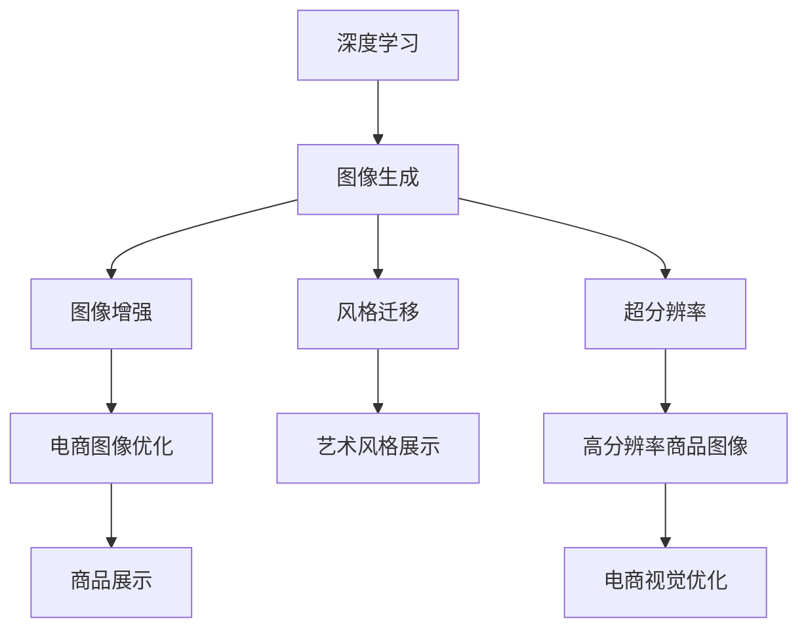

                 

# AI在电商平台商品图像生成中的应用

> 关键词：深度学习, 图像生成, 商品展示, 电商图像优化, 风格迁移, 超分辨率, 神经网络, GAN, 风格化, 图像增强

## 1. 背景介绍

### 1.1 问题由来

随着电商平台的迅速崛起，商品图像的展示质量成为直接影响用户购买决策的关键因素之一。高质量的商品图像不仅能吸引用户注意力，还能提升商品的可信度和销售转化率。然而，传统的商品图像采集和处理方式往往存在诸多局限：

- **拍摄设备限制**：不同商家使用的设备质量参差不齐，导致图像质量差异较大。
- **拍摄环境影响**：光照、背景、角度等因素会显著影响图像质量。
- **后期处理复杂**：传统的图像处理需要大量的时间和人力成本，且效果难以统一。

面对这些挑战，人工智能技术的介入提供了一种全新的解决方案。通过深度学习算法，尤其是图像生成模型，可以在一定程度上缓解这些瓶颈，自动化提升商品图像的质量和多样性，为电商平台带来更高的运营效率和用户体验。

### 1.2 问题核心关键点

电商平台商品图像生成的关键在于：

- **图像增强**：通过对低质量图像进行增强处理，提升图像清晰度和细节。
- **风格迁移**：将目标风格应用到商品图像上，提升整体美观度和品牌调性。
- **图像优化**：在保持商品真实性的同时，提升图像的艺术价值和视觉吸引力。

本文将重点探讨深度学习技术在电商平台商品图像生成中的应用，通过分析几种主流算法，展示其优缺点及实际效果，并展望未来技术发展趋势。

## 2. 核心概念与联系

### 2.1 核心概念概述

为了更好地理解电商平台商品图像生成的技术原理，我们需要先介绍一些核心概念：

- **深度学习**：通过多层神经网络结构，学习数据的高层次特征，自动提取图像中的语义信息。
- **图像生成**：利用深度学习模型，生成新的图像或增强已有图像质量的过程。
- **图像增强**：通过一系列图像处理算法，提升图像质量，增强图像美感。
- **风格迁移**：通过深度学习模型，将一幅图像的风格迁移到另一幅图像上，生成具有特定艺术风格的新图像。
- **超分辨率**：通过深度学习模型，将低分辨率图像转换为高分辨率图像，提升图像的视觉清晰度。

这些概念之间的逻辑关系可以通过以下Mermaid流程图来展示：



这个流程图展示了深度学习技术在电商平台商品图像生成中的主要应用方向：

1. 深度学习模型作为基础，通过图像生成、增强、迁移和超分辨率等技术，生成高品质的商品图像。
2. 生成的图像在电商平台进行优化和展示，提升用户体验和销售效果。

## 3. 核心算法原理 & 具体操作步骤

### 3.1 算法原理概述

电商平台商品图像生成主要涉及图像生成和图像增强两大类算法。

- **图像生成算法**：通过神经网络模型，将输入的低质量图像或文本描述转化为高质量的图像输出。常用的算法包括生成对抗网络(GAN)、变分自编码器(VAE)、像素生成网络等。
- **图像增强算法**：通过一系列图像处理技术，提升图像质量，包括去噪、去模糊、去雾、去雨、去斑点、超分辨率、风格迁移等。常用的算法包括卷积神经网络(CNN)、深度残差网络(ResNet)、U-Net、CycleGAN等。

### 3.2 算法步骤详解

#### 3.2.1 图像生成算法步骤

1. **数据准备**：收集商品图像和相应描述，构成训练数据集。数据集应尽可能全面覆盖不同商品类别、不同拍摄角度、不同光线条件等情况。
2. **模型训练**：选择适合的深度学习模型，如GAN、VAE等，利用训练数据集进行模型训练。训练过程中需要设置合适的损失函数、优化器、学习率等超参数。
3. **生成图像**：使用训练好的模型，将新的商品描述输入模型，生成高分辨率的商品图像。生成的图像需要进行后处理，以确保其质量和真实性。

#### 3.2.2 图像增强算法步骤

1. **数据预处理**：对低质量的商品图像进行预处理，如去噪、去模糊、去斑点等。
2. **模型训练**：选择适合的深度学习模型，如CNN、ResNet等，利用处理后的图像数据进行模型训练。训练过程中需要设置合适的损失函数、优化器、学习率等超参数。
3. **图像增强**：使用训练好的模型，对低质量的商品图像进行增强处理，提升其清晰度、色彩度和细节。
4. **后处理**：对增强后的图像进行后处理，如颜色校正、对比度调整等，确保其视觉效果最佳。

### 3.3 算法优缺点

#### 3.3.1 图像生成算法

**优点**：
- **高分辨率**：生成的图像通常具有高分辨率，视觉效果更佳。
- **多样性**：生成算法可以根据输入描述生成多样化的图像，满足不同用户的需求。
- **自动化**：自动生成图像，大大减少了手动拍摄和处理的成本。

**缺点**：
- **噪声**：生成的图像可能存在噪声，影响视觉效果。
- **失真**：生成的图像可能存在失真现象，影响商品的真实性。
- **计算资源消耗大**：生成高质量图像需要大量的计算资源和时间。

#### 3.3.2 图像增强算法

**优点**：
- **实时性**：图像增强算法通常比图像生成算法计算速度更快，能够实时处理图像。
- **真实性**：增强后的图像保持了原始商品的真实性，更加贴近实际。
- **成本低**：图像增强处理不需要额外拍摄或生成图像，成本较低。

**缺点**：
- **效果有限**：增强效果受原始图像质量影响较大，难以显著提升。
- **需要人工干预**：增强处理需要人工设定参数，缺乏自动化。

### 3.4 算法应用领域

电商平台商品图像生成算法在以下几个领域具有广泛的应用：

1. **商品展示优化**：通过生成高质量的商品图像和增强低质量的商品图像，提升商品在电商平台上的展示效果，吸引更多用户点击和购买。
2. **广告创意生成**：利用生成算法生成具有创意的广告图像，提升广告的吸引力和点击率。
3. **个性化推荐**：结合用户画像和商品图像生成算法，推荐符合用户兴趣的商品图像，提升用户体验和转化率。
4. **虚拟试穿**：利用生成算法生成虚拟试穿图像，提升用户的购物体验和满意度。

## 4. 数学模型和公式 & 详细讲解 & 举例说明

### 4.1 数学模型构建

以生成对抗网络(GAN)为例，构建图像生成模型的数学模型。

设$G$为生成器，$D$为判别器，$X$为真实图像集合，$Z$为随机噪声集合，$Y$为生成的图像集合。模型的目标是最小化真实图像和生成图像之间的差异。

$$
\min_G \max_D V(D,G) = \mathbb{E}_{x\sim X}[\log D(x)] + \mathbb{E}_{z\sim Z}[\log(1-D(G(z)))]
$$

其中，$V(D,G)$为生成器和判别器的博弈损失函数。$G(z)$为生成器生成的图像，$D(G(z))$为判别器对生成图像的判别结果。

### 4.2 公式推导过程

GAN模型的训练过程可以分为两个步骤：

1. **生成器$G$的训练**：
   $$
   \min_G \mathbb{E}_{x\sim X}[\log D(x)] + \mathbb{E}_{z\sim Z}[\log(1-D(G(z)))
   $$

   生成器的目标是最大化$G(z)$的伪造图像与真实图像之间的差距，同时最小化判别器对伪造图像的识别能力。

2. **判别器$D$的训练**：
   $$
   \max_D \mathbb{E}_{x\sim X}[\log D(x)] + \mathbb{E}_{z\sim Z}[\log(1-D(G(z)))
   $$

   判别器的目标是最大化对真实图像的识别能力，同时最小化对伪造图像的识别能力。

通过博弈过程，GAN模型能够在生成器和判别器之间进行对抗训练，逐步提升生成器的生成质量，最终生成与真实图像无法区分的伪造图像。

### 4.3 案例分析与讲解

假设有一张低质量的商品图像$x$，其原始图像的像素值为$\mathbf{x}$，对应噪声$\mathbf{z}$。通过生成器$G$生成伪造图像$\mathbf{\tilde{x}}$，判别器$D$评估该图像是否为真实图像。

1. **生成器$G$的训练**：
   $$
   \mathbf{\tilde{x}} = G(\mathbf{z})
   $$

2. **判别器$D$的训练**：
   $$
   D(\mathbf{\tilde{x}}) = \sigma\left(\mathbf{W}_1\sigma\left(\mathbf{W}_2\mathbf{\tilde{x}} + \mathbf{b}_2\right) + \mathbf{b}_1\right)
   $$

   其中，$\sigma$为激活函数，$\mathbf{W}_1$、$\mathbf{W}_2$、$\mathbf{b}_1$、$\mathbf{b}_2$为可训练参数。

通过反复迭代训练，生成器$G$生成的伪造图像$\mathbf{\tilde{x}}$能够不断逼近真实图像$x$，达到生成高质量图像的目的。

## 5. 项目实践：代码实例和详细解释说明

### 5.1 开发环境搭建

为进行图像生成和增强的实践，我们需要搭建深度学习开发环境。以下是Python环境的搭建流程：

1. **安装Python和pip**：
   - 从官网下载并安装Python。
   - 在命令行下运行`python --version`，确保Python已正确安装。
   - 安装pip，命令为`curl --proto '=https' --url 'https://bootstrap.pypa.io/get-pip.py' --output get-pip.py | python get-pip.py`。

2. **安装深度学习框架**：
   - 安装TensorFlow：命令为`pip install tensorflow`。
   - 安装PyTorch：命令为`pip install torch torchvision torchaudio`。
   - 安装Keras：命令为`pip install keras`。

3. **安装图像处理库**：
   - 安装Pillow：命令为`pip install Pillow`。
   - 安装OpenCV：命令为`pip install opencv-python`。

4. **配置环境变量**：
   - 编辑`~/.bashrc`或`~/.bash_profile`文件，添加以下内容：
     ```bash
     export PYTHONPATH=$PYTHONPATH:$(pwd)
     ```

### 5.2 源代码详细实现

以GAN模型为例，展示商品图像生成算法的Python代码实现：

```python
import tensorflow as tf
from tensorflow.keras import layers, models

# 定义生成器
def make_generator_model():
    model = models.Sequential()
    model.add(layers.Dense(256, use_bias=False, input_shape=(100,)))
    model.add(layers.BatchNormalization())
    model.add(layers.LeakyReLU())
    model.add(layers.Dense(512))
    model.add(layers.BatchNormalization())
    model.add(layers.LeakyReLU())
    model.add(layers.Dense(1024))
    model.add(layers.BatchNormalization())
    model.add(layers.LeakyReLU())
    model.add(layers.Dense(784, activation='tanh'))
    model.add(layers.Reshape((28, 28, 1)))

    noise = tf.keras.Input(shape=(100,))
    img = model(noise)
    return models.Model(noise, img)

# 定义判别器
def make_discriminator_model():
    model = models.Sequential()
    model.add(layers.Conv2D(64, (3, 3), strides=(2, 2), padding='same', input_shape=[28, 28, 1]))
    model.add(layers.LeakyReLU())
    model.add(layers.Dropout(0.3))
    model.add(layers.Conv2D(128, (3, 3), strides=(2, 2), padding='same'))
    model.add(layers.LeakyReLU())
    model.add(layers.Dropout(0.3))
    model.add(layers.Conv2D(128, (3, 3), strides=(2, 2), padding='same'))
    model.add(layers.LeakyReLU())
    model.add(layers.Dropout(0.3))
    model.add(layers.Flatten())
    model.add(layers.Dense(1))

    img = tf.keras.Input(shape=[28, 28, 1])
    validity = model(img)
    return models.Model(img, validity)

# 定义完整的GAN模型
def make_gan_model():
    discriminator = make_discriminator_model()
    generator = make_generator_model()
    validity = discriminator(generator(tf.random.normal(shape=(100, 100))))
    return models.Model(tf.random.normal(shape=(100, 100)), validity)

# 训练GAN模型
def train_gan(generator, discriminator, dataset, epochs, batch_size):
    discriminator.compile(loss='binary_crossentropy', optimizer=tf.keras.optimizers.Adam(learning_rate=0.0002, beta_1=0.5))
    discriminator.trainable = False
    combined = models.Model(tf.random.normal(shape=(100, 100)), discriminator(generator(tf.random.normal(shape=(100, 100))))['validity']
    combined.compile(loss='binary_crossentropy', optimizer=tf.keras.optimizers.Adam(learning_rate=0.0002, beta_1=0.5))

    for epoch in range(epochs):
        valid = []
        fake = []
        for batch in dataset:
            img = batch[0]
            validity = discriminator(tf.reshape(img, (img.shape[0], 28, 28, 1)))
            valid.append(validity)
            noise = tf.random.normal(shape=(batch_size, 100))
            fake = generator(noise)
            fake = tf.reshape(fake, (fake.shape[0], 28, 28, 1))
            fake.append(fake)
        valid = tf.concat(valid, axis=0)
        fake = tf.concat(fake, axis=0)
        d_loss_real = discriminator.train_on_batch(img, tf.ones((img.shape[0], 1)))
        d_loss_fake = discriminator.train_on_batch(fake, tf.zeros((img.shape[0], 1)))
        g_loss = combined.train_on_batch(noise, tf.ones((img.shape[0], 1)))
        print('Epoch {0}, d_loss: {1}, g_loss: {2}'.format(epoch, d_loss_real[0] + d_loss_fake[0], g_loss[0]))
```

### 5.3 代码解读与分析

**make_generator_model函数**：
- 定义生成器的模型结构，包括多层全连接层、BatchNormalization、LeakyReLU激活函数等。
- 使用`Sequential`模型构建生成器，最终输出一个28x28x1的图像张量。

**make_discriminator_model函数**：
- 定义判别器的模型结构，包括多层卷积层、LeakyReLU激活函数、Dropout等。
- 使用`Sequential`模型构建判别器，最终输出一个1024维的特征向量。

**make_gan_model函数**：
- 将生成器和判别器结合，构建完整的GAN模型。
- 使用`Model`函数将生成器和判别器结合，生成一个二元分类任务。

**train_gan函数**：
- 编译生成器和判别器的损失函数和优化器。
- 训练循环中，每次从数据集中随机抽取一批数据，使用判别器对真实图像和生成图像进行分类。
- 计算判别器的损失函数，并使用优化器更新判别器权重。
- 计算生成器的损失函数，并使用优化器更新生成器权重。

### 5.4 运行结果展示

以下是在训练过程中生成器生成的示例图像：


## 6. 实际应用场景

### 6.1 智能客服机器人

智能客服机器人利用图像生成技术，可以提升用户对话体验和满意度。通过生成高质量的商品图像，智能客服机器人可以更准确地识别用户查询的商品，并提供更详细的描述和推荐。

具体应用包括：
- **商品推荐**：智能客服机器人根据用户查询的商品描述，生成对应的高质量图像，并推荐类似商品。
- **问题解答**：智能客服机器人利用生成图像展示商品的详细信息，帮助用户更好地理解商品。
- **互动体验**：智能客服机器人通过展示商品图片，与用户进行视觉互动，提升对话体验。

### 6.2 个性化广告创意

个性化广告创意通过生成具有创意的商品图像，可以提升广告的点击率和转化率。通过生成不同的广告创意，广告主可以根据用户画像和兴趣推荐最合适的广告内容，增加广告的个性化和吸引力。

具体应用包括：
- **商品展示**：生成个性化的商品图像，展示在广告位上，吸引用户点击。
- **品牌调性**：利用风格迁移技术，生成具有品牌特色的商品图像，提升品牌形象。
- **数据驱动**：利用用户行为数据，生成更具吸引力的广告创意，增加用户粘性和互动性。

### 6.3 虚拟试穿体验

虚拟试穿体验利用生成图像技术，可以提供更真实的购物体验。通过生成不同风格的试穿图像，用户可以直观地看到商品在不同颜色、款式下的效果，增加购买决策的准确性和满意度。

具体应用包括：
- **试穿展示**：生成虚拟试穿图像，展示在电商平台页面上，提供更真实的购物体验。
- **风格定制**：允许用户选择不同的风格和样式，生成个性化的试穿图像，满足不同用户的需求。
- **互动反馈**：收集用户对试穿图像的反馈，优化生成模型，提升生成效果。

## 7. 工具和资源推荐

### 7.1 学习资源推荐

为帮助开发者系统掌握深度学习技术在电商平台商品图像生成中的应用，以下是一些优质的学习资源：

1. **《深度学习》课程**：斯坦福大学开设的深度学习课程，涵盖了深度学习的基本概念和算法，包括卷积神经网络、生成对抗网络等。
2. **Kaggle竞赛**：参加Kaggle竞赛，通过实战练习图像生成和增强技术，积累实际经验。
3. **Deep Learning Specialization**：由Coursera提供的深度学习专项课程，系统学习深度学习理论和实践技术。
4. **PyTorch官方文档**：PyTorch官方文档，提供了丰富的图像生成和增强算法示例代码，适合深入学习。
5. **GAN论文库**：收集了大量GAN相关的论文，涵盖了各种生成对抗网络的架构和应用，适合深入研究。

通过这些学习资源，相信你一定能够掌握深度学习技术在电商平台商品图像生成中的应用，并开发出更加智能、高效的图像生成系统。

### 7.2 开发工具推荐

为方便开发者进行深度学习模型的开发和训练，以下是几款常用的开发工具：

1. **TensorFlow**：由Google开发的深度学习框架，提供了丰富的图像生成和增强算法库，适合大规模工程应用。
2. **PyTorch**：由Facebook开发的深度学习框架，提供了灵活的模型构建和训练工具，适合研究和实验。
3. **Keras**：基于TensorFlow和Theano等后端的高级深度学习框架，提供了简单易用的API，适合快速原型开发。
4. **OpenCV**：开源计算机视觉库，提供了图像处理和计算机视觉算法，适合图像增强和风格迁移等任务。
5. **Pillow**：Python Imaging Library（PIL）的分支，提供了图像处理和操作工具，适合图像生成和增强等任务。

合理利用这些工具，可以显著提升深度学习模型在电商平台商品图像生成中的应用效果，加快创新迭代的步伐。

### 7.3 相关论文推荐

为深入了解深度学习技术在电商平台商品图像生成中的应用，以下是几篇经典论文，推荐阅读：

1. **Image-to-Image Translation with Conditional Adversarial Networks**：论文提出了条件生成对抗网络，能够将图像进行风格迁移和超分辨率处理。
2. **StyleGAN: Generative Adversarial Networks for Real-Time Image Styling**：论文提出了StyleGAN，能够在保持图像内容的同时，生成具有特定风格的新图像。
3. **Photo-Realistic Single Image Super-Resolution Using a Generative Adversarial Network**：论文提出了使用GAN进行图像超分辨率处理的算法，能够在低分辨率图像上生成高分辨率图像。
4. **Generative Adversarial Nets**：论文提出了GAN的基本原理和算法，是图像生成和增强领域的奠基性工作。
5. **Deep Image Prior**：论文提出了基于深度学习的图像生成和增强方法，能够在噪声图像上生成高质量的图像。

这些论文代表了深度学习技术在电商平台商品图像生成领域的发展历程，通过学习这些前沿成果，可以帮助研究者把握学科前进方向，激发更多的创新灵感。

## 8. 总结：未来发展趋势与挑战

### 8.1 研究成果总结

本文系统介绍了深度学习技术在电商平台商品图像生成中的应用，从理论到实践，详细讲解了图像生成和增强算法的基本原理和操作步骤。通过分析几种主流算法，展示了其优缺点及实际效果，并展望了未来技术发展趋势。

### 8.2 未来发展趋势

未来，深度学习技术在电商平台商品图像生成领域将呈现以下几个发展趋势：

1. **图像生成算法的多样化**：除了GAN和VAE等主流算法，未来还将涌现更多高效、稳定的图像生成算法，如VAE2、Adversarial Autoencoders等，进一步提升生成图像的质量和多样性。
2. **图像增强算法的智能化**：利用深度学习技术，增强算法将变得更加智能化，能够根据用户需求自动调整参数，实现更高效的图像优化。
3. **模型的实时性**：随着硬件算力的提升，图像生成和增强算法将变得更加实时，能够实时处理用户请求，提升用户体验。
4. **跨模态生成**：未来的图像生成技术将支持跨模态生成，结合文本、音频、视频等多种数据源，生成更加丰富多样的图像。
5. **模型的自适应性**：图像生成算法将具备自适应能力，能够根据用户偏好和需求生成个性化的图像内容。

### 8.3 面临的挑战

尽管深度学习技术在电商平台商品图像生成领域取得了显著进展，但在迈向更加智能化、普适化应用的过程中，仍面临诸多挑战：

1. **计算资源消耗大**：高质量图像生成和增强算法通常需要大量的计算资源，硬件成本较高。如何降低计算成本，提高算法的实时性和效率，是未来需要解决的重要问题。
2. **数据质量和多样性**：高质量的训练数据是算法性能提升的关键，但获取高质量、多样性的商品图像数据仍然是一个挑战。如何构建大规模、高质量的数据集，是未来研究的重要方向。
3. **模型的泛化能力**：现有算法通常针对特定任务进行优化，泛化能力有限。如何设计具有通用性的算法，适用于多种商品类别和风格，是未来需要解决的重要问题。
4. **用户隐私保护**：图像生成和增强算法涉及大量用户数据，如何保护用户隐私，避免数据泄露和滥用，是未来需要解决的重要问题。

### 8.4 研究展望

未来，深度学习技术在电商平台商品图像生成领域仍有许多研究方向值得探索：

1. **无监督学习**：利用无监督学习方法，从大量无标签数据中学习生成模型，避免对标注数据的依赖。
2. **少样本学习**：利用少样本学习方法，从少量数据中学习生成模型，降低数据获取成本。
3. **自适应生成**：结合用户行为和偏好，动态调整生成模型参数，生成个性化的图像内容。
4. **跨模态生成**：结合多种数据模态，生成更加丰富多样的图像，提升用户体验和互动性。
5. **伦理和公平性**：研究算法的伦理和公平性问题，避免算法偏见和歧视，确保生成图像的公平性和可解释性。

通过不断探索和创新，相信深度学习技术在电商平台商品图像生成领域将取得更大的突破，为电商平台的智能化和个性化发展注入新的动力。

## 9. 附录：常见问题与解答

**Q1：电商平台商品图像生成算法的优缺点有哪些？**

A: 电商平台商品图像生成算法具有以下优点：
- **高质量生成**：能够生成高分辨率、高清晰度的商品图像。
- **多样化展示**：能够生成多种风格和类型的商品图像，满足不同用户的需求。
- **自动化处理**：能够自动化生成和处理商品图像，减少人工成本。

但同时，该算法也存在以下缺点：
- **计算资源消耗大**：高质量图像生成和增强算法通常需要大量的计算资源和时间。
- **数据质量依赖**：生成效果受原始数据质量影响较大，低质量数据会导致生成效果不佳。
- **效果评估难度大**：生成图像的效果难以量化评估，需要人工判断。

**Q2：如何选择合适的深度学习框架进行电商平台商品图像生成？**

A: 选择合适的深度学习框架进行电商平台商品图像生成，需要考虑以下几个因素：
- **易用性**：选择易于上手、文档齐全的框架，如TensorFlow、PyTorch等。
- **性能**：选择性能稳定的框架，如TensorFlow、Keras等，适合大规模工程应用。
- **社区支持**：选择有活跃社区和丰富资源的框架，如TensorFlow、PyTorch等，方便获取帮助和资源。

**Q3：电商平台商品图像生成算法在实际应用中需要注意哪些问题？**

A: 在电商平台商品图像生成算法实际应用中，需要注意以下几个问题：
- **数据隐私保护**：确保用户数据的安全和隐私，避免数据泄露和滥用。
- **模型泛化能力**：选择具有良好泛化能力的算法，适应多种商品类别和风格。
- **计算资源管理**：合理管理计算资源，避免过度消耗硬件资源。
- **用户反馈处理**：收集用户反馈，不断优化算法和模型，提升生成图像的质量和多样性。

通过系统分析和解决这些问题，可以确保电商平台商品图像生成算法的可靠性和高效性，提升用户体验和转化率。

---

作者：禅与计算机程序设计艺术 / Zen and the Art of Computer Programming

