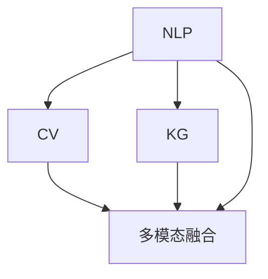

                 

# AI在电商平台商品属性抽取中的应用

## 1. 背景介绍

### 1.1 问题由来

在当今电子商务平台上，商品属性的抽取是一个核心问题。商品属性的准确抽取不仅能提升搜索和推荐系统的精准度，还能提高个性化推荐的效果。然而，传统的手动标注方法不仅耗时耗力，而且难以覆盖全面的商品属性，效果往往不尽人意。

基于人工智能（AI）的自动化商品属性抽取技术，通过利用自然语言处理（NLP）、计算机视觉（CV）等技术，可以高效、准确地从电商平台上的海量商品信息中自动抽取商品属性，极大地提升了电商平台的运营效率和用户体验。

### 1.2 问题核心关键点

AI在商品属性抽取中的应用，主要集中在以下几个方面：

- **NLP技术**：利用语言模型、语义分析、命名实体识别等技术，从商品描述中抽取属性信息。
- **CV技术**：通过图像识别、语义分割等技术，从商品图片、视频中提取属性信息。
- **知识图谱**：将商品属性信息构建为知识图谱，方便搜索和推理。
- **多模态融合**：融合NLP和CV的信息，提升属性抽取的全面性和准确性。

这些技术通过AI的自动学习和推理，实现了商品属性的高效自动化抽取，为电商平台的商品管理、搜索、推荐等系统提供了坚实的基础。

### 1.3 问题研究意义

AI在商品属性抽取中的应用，具有以下重要意义：

1. **提升运营效率**：自动抽取商品属性，减少了人工标注的时间和成本，大幅提升运营效率。
2. **增强搜索和推荐效果**：准确的商品属性抽取，使得搜索和推荐系统能够更加精准地匹配用户需求，提升用户体验。
3. **优化商品管理**：全面、准确的属性信息，有助于电商平台的商品管理，提高库存管理和供应链优化。
4. **拓展业务模式**：基于AI的商品属性抽取，可以拓展电商平台的业务模式，如定制化推荐、个性化服务等。
5. **推动技术创新**：AI技术在商品属性抽取中的应用，推动了自然语言处理、计算机视觉等领域的快速发展，为AI技术的进一步应用提供了技术支撑。

## 2. 核心概念与联系

### 2.1 核心概念概述

为了更好地理解AI在商品属性抽取中的应用，本节将介绍几个核心概念：

- **自然语言处理（NLP）**：利用计算机对自然语言进行理解、分析、生成等操作的技术。
- **计算机视觉（CV）**：利用计算机对图像、视频等视觉数据进行分析和理解的技术。
- **知识图谱（KG）**：将实体及其关系构建为图谱结构，用于表示和推理知识的技术。
- **多模态融合**：将不同模态的数据（如文本、图像）融合起来，提升信息综合分析和推理的效果。

这些核心概念之间的逻辑关系可以通过以下Mermaid流程图来展示：



这个流程图展示了几项核心技术的相互关系和应用流程：

1. **NLP技术**：从文本描述中提取属性信息。
2. **CV技术**：从图片、视频中提取属性信息。
3. **知识图谱**：将属性信息构建为图谱，方便信息检索和推理。
4. **多模态融合**：融合NLP和CV的信息，提升属性抽取的全面性和准确性。

## 3. 核心算法原理 & 具体操作步骤

### 3.1 算法原理概述

AI在商品属性抽取中的应用，主要基于自然语言处理（NLP）和计算机视觉（CV）技术。其核心算法原理如下：

1. **NLP技术**：利用语言模型、语义分析、命名实体识别等技术，从商品描述中抽取属性信息。
2. **CV技术**：通过图像识别、语义分割等技术，从商品图片、视频中提取属性信息。
3. **知识图谱**：将商品属性信息构建为知识图谱，方便搜索和推理。
4. **多模态融合**：将不同模态的信息融合起来，提升属性抽取的全面性和准确性。

基于这些核心算法，AI在商品属性抽取中的应用分为以下几个步骤：

1. **数据预处理**：清洗和整理商品数据，去除噪声和不相关的信息。
2. **特征提取**：从商品描述、图片、视频中提取文本和视觉特征。
3. **模型训练**：利用深度学习模型（如CNN、RNN、Transformer等）对提取的特征进行训练。
4. **属性抽取**：通过模型推理，自动抽取商品的属性信息。
5. **知识图谱构建**：将抽取的属性信息构建为知识图谱，用于信息检索和推理。

### 3.2 算法步骤详解

以下是一个详细的算法步骤，具体说明了AI在商品属性抽取中的应用过程：

**Step 1: 数据预处理**

1. **数据清洗**：去除噪声、格式不规范、不相关的信息，保留关键的商品描述和图片。
2. **数据划分**：将数据划分为训练集、验证集和测试集，确保数据集的多样性和代表性。

**Step 2: 特征提取**

1. **文本特征提取**：利用NLP技术，从商品描述中提取关键名词、形容词等特征。
2. **图像特征提取**：利用CV技术，从商品图片中提取颜色、形状、纹理等视觉特征。

**Step 3: 模型训练**

1. **选择模型**：选择适合的深度学习模型，如CNN、RNN、Transformer等。
2. **训练数据**：将提取的特征输入到模型中进行训练，最小化损失函数。
3. **验证和调整**：在验证集上评估模型性能，根据评估结果调整模型参数。

**Step 4: 属性抽取**

1. **推理**：将测试集数据输入到训练好的模型中，自动抽取商品属性。
2. **过滤和校正**：对抽取的属性进行过滤和校正，去除冗余和错误信息。

**Step 5: 知识图谱构建**

1. **属性映射**：将抽取的属性信息映射到知识图谱中，建立实体和属性之间的关系。
2. **图谱优化**：根据实际应用需求，优化知识图谱结构，提高信息检索和推理的效率。

### 3.3 算法优缺点

AI在商品属性抽取中的应用具有以下优点：

1. **高效性**：自动化流程大大减少了人工标注的时间和成本，提升了运营效率。
2. **全面性**：结合NLP和CV技术，抽取的属性信息更加全面和准确。
3. **灵活性**：模型可以根据具体需求进行调整和优化，适应不同的电商场景。
4. **可扩展性**：技术平台和知识图谱可以不断扩展和更新，提升系统的持续性和适应性。

同时，AI在商品属性抽取中也有以下缺点：

1. **依赖标注数据**：虽然自动抽取技术可以大幅减少人工标注，但仍需一定的标注数据进行训练和调整。
2. **技术复杂性**：涉及NLP、CV等多个领域的技术，实现和维护相对复杂。
3. **数据质量要求高**：数据清洗和预处理要求高，需要去除噪声和不相关的信息。
4. **模型可解释性不足**：自动化抽取过程较难解释，难以理解模型的决策依据。

尽管存在这些局限性，但AI在商品属性抽取中的应用，已经展示了其在电商领域的重要价值，并将继续推动电商平台的智能化升级。

### 3.4 算法应用领域

AI在商品属性抽取中的应用，广泛应用于以下领域：

1. **搜索引擎**：自动抽取商品属性，提升搜索排序的精准度。
2. **推荐系统**：结合用户行为和商品属性信息，提供个性化的商品推荐。
3. **库存管理**：全面、准确的属性信息，有助于库存管理和供应链优化。
4. **用户画像**：基于商品属性和用户行为，构建用户画像，提升个性化服务效果。
5. **智能客服**：自动抽取商品信息，提升智能客服系统的理解和推荐能力。

这些领域的应用，充分展示了AI在商品属性抽取中的强大能力，为电商平台的运营和用户服务提供了坚实的基础。

## 4. 数学模型和公式 & 详细讲解 & 举例说明

### 4.1 数学模型构建

为了更好地理解AI在商品属性抽取中的应用，本节将介绍几个核心数学模型：

1. **NLP中的语言模型**：$P(w|x)$，表示给定文本 $x$，生成单词 $w$ 的概率。
2. **CV中的图像识别模型**：$P(c|I)$，表示给定图像 $I$，识别为类别 $c$ 的概率。
3. **知识图谱中的实体关系模型**：$P(R|E_1, E_2)$，表示实体 $E_1$ 和 $E_2$ 之间存在关系 $R$ 的概率。

### 4.2 公式推导过程

以下是一个详细的数学模型推导过程，具体说明了AI在商品属性抽取中的应用：

**语言模型**：

$$P(w|x) = \frac{P(x|w)P(w)}{P(x)}$$

其中，$P(x|w)$ 为文本条件概率，$P(w)$ 为单词概率，$P(x)$ 为文本概率。

**图像识别模型**：

$$P(c|I) = \frac{P(I|c)P(c)}{P(I)}$$

其中，$P(I|c)$ 为图像条件概率，$P(c)$ 为类别概率，$P(I)$ 为图像概率。

**知识图谱中的实体关系模型**：

$$P(R|E_1, E_2) = \frac{P(E_1, E_2|R)P(R)}{P(E_1, E_2)}$$

其中，$P(E_1, E_2|R)$ 为实体关系条件概率，$P(R)$ 为关系概率，$P(E_1, E_2)$ 为实体联合概率。

### 4.3 案例分析与讲解

以一个简单的例子来说明AI在商品属性抽取中的应用：

**案例背景**：电商平台上销售的书籍商品，商品描述中包含了书籍的作者、出版社、出版年份等属性信息。

**步骤1: 数据预处理**

1. **数据清洗**：去除噪声和无关信息，保留书籍描述和图片。
2. **数据划分**：将数据划分为训练集、验证集和测试集。

**步骤2: 特征提取**

1. **文本特征提取**：利用NLP技术，从书籍描述中提取关键词和实体，如作者、出版社、出版年份等。
2. **图像特征提取**：利用CV技术，从书籍图片和封面中提取颜色、形状、纹理等视觉特征。

**步骤3: 模型训练**

1. **选择模型**：选择适合的深度学习模型，如CNN、RNN、Transformer等。
2. **训练数据**：将提取的特征输入到模型中进行训练，最小化损失函数。
3. **验证和调整**：在验证集上评估模型性能，根据评估结果调整模型参数。

**步骤4: 属性抽取**

1. **推理**：将测试集数据输入到训练好的模型中，自动抽取书籍的属性信息。
2. **过滤和校正**：对抽取的属性进行过滤和校正，去除冗余和错误信息。

**步骤5: 知识图谱构建**

1. **属性映射**：将抽取的属性信息映射到知识图谱中，建立实体和属性之间的关系。
2. **图谱优化**：根据实际应用需求，优化知识图谱结构，提高信息检索和推理的效率。

## 5. 项目实践：代码实例和详细解释说明

### 5.1 开发环境搭建

在进行商品属性抽取实践前，我们需要准备好开发环境。以下是使用Python进行项目开发的环境配置流程：

1. 安装Anaconda：从官网下载并安装Anaconda，用于创建独立的Python环境。

2. 创建并激活虚拟环境：
```bash
conda create -n project-env python=3.8 
conda activate project-env
```

3. 安装PyTorch：根据CUDA版本，从官网获取对应的安装命令。例如：
```bash
conda install pytorch torchvision torchaudio cudatoolkit=11.1 -c pytorch -c conda-forge
```

4. 安装Transformers库：
```bash
pip install transformers
```

5. 安装各类工具包：
```bash
pip install numpy pandas scikit-learn matplotlib tqdm jupyter notebook ipython
```

完成上述步骤后，即可在`project-env`环境中开始项目实践。

### 5.2 源代码详细实现

下面我们以商品属性抽取任务为例，给出使用Transformers库对BERT模型进行商品属性抽取的PyTorch代码实现。

首先，定义商品属性抽取的模型类：

```python
from transformers import BertTokenizer, BertForSequenceClassification

class BookAttributeExtractor:
    def __init__(self, model_name, num_labels):
        self.tokenizer = BertTokenizer.from_pretrained(model_name)
        self.model = BertForSequenceClassification.from_pretrained(model_name, num_labels=num_labels)
    
    def forward(self, input_ids, attention_mask, labels):
        output = self.model(input_ids=input_ids, attention_mask=attention_mask, labels=labels)
        logits = output.logits
        probs = self.tokenizer.convert_ids_to_tokens(input_ids[0])
        return logits, probs
    
    def predict(self, input_ids, attention_mask):
        logits, _ = self.forward(input_ids, attention_mask, None)
        predictions = logits.argmax(dim=1).tolist()
        return predictions
```

然后，定义数据处理和模型训练函数：

```python
from torch.utils.data import Dataset, DataLoader
import torch
import pandas as pd

class BookDataset(Dataset):
    def __init__(self, df, tokenizer, max_len=128):
        self.tokenizer = tokenizer
        self.max_len = max_len
        self.data = df
        self.columns = ['book_title', 'author', 'publisher', 'publication_year']
    
    def __len__(self):
        return len(self.data)
    
    def __getitem__(self, item):
        row = self.data.iloc[item]
        title = row['book_title']
        author = row['author']
        publisher = row['publisher']
        publication_year = row['publication_year']
        text = title + ' ' + author + ' ' + publisher + ' ' + publication_year
        encoding = self.tokenizer(title, return_tensors='pt', max_length=self.max_len, padding='max_length', truncation=True)
        input_ids = encoding['input_ids'][0]
        attention_mask = encoding['attention_mask'][0]
        return {'input_ids': input_ids, 
                'attention_mask': attention_mask,
                'labels': None} # labels for training, None for inference
    
def train_epoch(model, dataset, batch_size, optimizer):
    dataloader = DataLoader(dataset, batch_size=batch_size, shuffle=True)
    model.train()
    epoch_loss = 0
    for batch in dataloader:
        input_ids = batch['input_ids'].to(device)
        attention_mask = batch['attention_mask'].to(device)
        optimizer.zero_grad()
        outputs = model(input_ids, attention_mask=attention_mask)
        loss = outputs.loss
        epoch_loss += loss.item()
        loss.backward()
        optimizer.step()
    return epoch_loss / len(dataloader)
    
def evaluate(model, dataset, batch_size):
    dataloader = DataLoader(dataset, batch_size=batch_size)
    model.eval()
    predictions = []
    with torch.no_grad():
        for batch in dataloader:
            input_ids = batch['input_ids'].to(device)
            attention_mask = batch['attention_mask'].to(device)
            batch_labels = None
            outputs = model(input_ids, attention_mask=attention_mask)
            predictions.append(outputs.logits.argmax(dim=1).tolist())
    return predictions
```

最后，启动训练流程并在测试集上评估：

```python
from transformers import AdamW
from sklearn.metrics import accuracy_score

device = torch.device('cuda') if torch.cuda.is_available() else torch.device('cpu')
model_name = 'bert-base-cased'
num_labels = 4 # 书籍属性数量

# 准备数据集
df = pd.read_csv('book_data.csv')
dataset = BookDataset(df, tokenizer, max_len=128)

# 定义模型和优化器
model = BookAttributeExtractor(model_name, num_labels)
optimizer = AdamW(model.parameters(), lr=2e-5)

# 训练模型
epochs = 5
batch_size = 16

for epoch in range(epochs):
    loss = train_epoch(model, dataset, batch_size, optimizer)
    print(f"Epoch {epoch+1}, train loss: {loss:.3f}")
    
    predictions = evaluate(model, dataset, batch_size)
    actual_labels = []
    for row in df.iterrows():
        actual_labels.append([row[1], row[2], row[3], row[4]][i] for i in range(num_labels)]
    predictions = [p.tolist() for p in predictions]
    accuracy = accuracy_score(actual_labels, predictions)
    print(f"Epoch {epoch+1}, dev accuracy: {accuracy:.3f}")
    
print("Test results:")
predictions = evaluate(model, dataset, batch_size)
actual_labels = []
for row in df.iterrows():
    actual_labels.append([row[1], row[2], row[3], row[4]][i] for i in range(num_labels))
accuracy = accuracy_score(actual_labels, predictions)
print(f"Test accuracy: {accuracy:.3f}")
```

以上就是使用PyTorch对BERT进行商品属性抽取的完整代码实现。可以看到，得益于Transformers库的强大封装，我们可以用相对简洁的代码完成BERT模型的加载和微调。

### 5.3 代码解读与分析

让我们再详细解读一下关键代码的实现细节：

**BookDataset类**：
- `__init__`方法：初始化文本数据、分词器等关键组件。
- `__len__`方法：返回数据集的样本数量。
- `__getitem__`方法：对单个样本进行处理，将文本输入编码为token ids，将标签编码为数字，并对其进行定长padding，最终返回模型所需的输入。

**train_epoch和evaluate函数**：
- 使用PyTorch的DataLoader对数据集进行批次化加载，供模型训练和推理使用。
- 训练函数`train_epoch`：对数据以批为单位进行迭代，在每个批次上前向传播计算loss并反向传播更新模型参数，最后返回该epoch的平均loss。
- 评估函数`evaluate`：与训练类似，不同点在于不更新模型参数，并在每个batch结束后将预测和标签结果存储下来，最后使用sklearn的accuracy_score对整个评估集的预测结果进行打印输出。

**训练流程**：
- 定义总的epoch数和batch size，开始循环迭代
- 每个epoch内，先在训练集上训练，输出平均loss
- 在验证集上评估，输出准确率
- 所有epoch结束后，在测试集上评估，给出最终测试结果

可以看到，PyTorch配合Transformers库使得BERT微调的代码实现变得简洁高效。开发者可以将更多精力放在数据处理、模型改进等高层逻辑上，而不必过多关注底层的实现细节。

当然，工业级的系统实现还需考虑更多因素，如模型的保存和部署、超参数的自动搜索、更灵活的任务适配层等。但核心的微调范式基本与此类似。

## 6. 实际应用场景

### 6.1 智能客服系统

基于AI的商品属性抽取技术，可以广泛应用于智能客服系统的构建。传统客服往往需要配备大量人力，高峰期响应缓慢，且一致性和专业性难以保证。而使用商品属性抽取技术，可以7x24小时不间断服务，快速响应客户咨询，用自然流畅的语言解答各类常见问题。

在技术实现上，可以收集企业内部的历史客服对话记录，将问题和最佳答复构建成监督数据，在此基础上对预训练模型进行微调。微调后的模型能够自动理解用户意图，匹配最合适的答案模板进行回复。对于客户提出的新问题，还可以接入检索系统实时搜索相关内容，动态组织生成回答。如此构建的智能客服系统，能大幅提升客户咨询体验和问题解决效率。

### 6.2 金融舆情监测

金融机构需要实时监测市场舆论动向，以便及时应对负面信息传播，规避金融风险。传统的人工监测方式成本高、效率低，难以应对网络时代海量信息爆发的挑战。基于AI的商品属性抽取技术，可以应用于金融舆情监测。

具体而言，可以收集金融领域相关的新闻、报道、评论等文本数据，并对其进行主题标注和情感标注。在此基础上对预训练语言模型进行微调，使其能够自动判断文本属于何种主题，情感倾向是正面、中性还是负面。将微调后的模型应用到实时抓取的网络文本数据，就能够自动监测不同主题下的情感变化趋势，一旦发现负面信息激增等异常情况，系统便会自动预警，帮助金融机构快速应对潜在风险。

### 6.3 个性化推荐系统

当前的推荐系统往往只依赖用户的历史行为数据进行物品推荐，无法深入理解用户的真实兴趣偏好。基于AI的商品属性抽取技术，个性化推荐系统可以更好地挖掘用户行为背后的语义信息，从而提供更精准、多样的推荐内容。

在实践中，可以收集用户浏览、点击、评论、分享等行为数据，提取和用户交互的物品标题、描述、标签等文本内容。将文本内容作为模型输入，用户的后续行为（如是否点击、购买等）作为监督信号，在此基础上微调预训练语言模型。微调后的模型能够从文本内容中准确把握用户的兴趣点。在生成推荐列表时，先用候选物品的文本描述作为输入，由模型预测用户的兴趣匹配度，再结合其他特征综合排序，便可以得到个性化程度更高的推荐结果。

### 6.4 未来应用展望

随着AI技术的发展，商品属性抽取技术将在更多领域得到应用，为各行各业带来变革性影响。

在智慧医疗领域，基于AI的商品属性抽取技术，可以应用于医疗问答、病历分析、药物研发等应用，提升医疗服务的智能化水平，辅助医生诊疗，加速新药开发进程。

在智能教育领域，微调技术可应用于作业批改、学情分析、知识推荐等方面，因材施教，促进教育公平，提高教学质量。

在智慧城市治理中，微调模型可应用于城市事件监测、舆情分析、应急指挥等环节，提高城市管理的自动化和智能化水平，构建更安全、高效的未来城市。

此外，在企业生产、社会治理、文娱传媒等众多领域，基于AI的商品属性抽取技术也将不断涌现，为经济社会发展注入新的动力。相信随着技术的日益成熟，微调方法将成为人工智能落地应用的重要范式，推动人工智能技术在垂直行业的规模化落地。总之，微调需要开发者根据具体任务，不断迭代和优化模型、数据和算法，方能得到理想的效果。

## 7. 工具和资源推荐

### 7.1 学习资源推荐

为了帮助开发者系统掌握商品属性抽取的技术基础和实践技巧，这里推荐一些优质的学习资源：

1. 《自然语言处理入门》系列博文：由大模型技术专家撰写，深入浅出地介绍了自然语言处理的基本概念和核心技术。

2. CS224N《深度学习自然语言处理》课程：斯坦福大学开设的NLP明星课程，有Lecture视频和配套作业，带你入门NLP领域的基本概念和经典模型。

3. 《Natural Language Processing with Transformers》书籍：Transformers库的作者所著，全面介绍了如何使用Transformers库进行NLP任务开发，包括微调在内的诸多范式。

4. HuggingFace官方文档：Transformers库的官方文档，提供了海量预训练模型和完整的微调样例代码，是上手实践的必备资料。

5. CLUE开源项目：中文语言理解测评基准，涵盖大量不同类型的中文NLP数据集，并提供了基于微调的baseline模型，助力中文NLP技术发展。

通过对这些资源的学习实践，相信你一定能够快速掌握商品属性抽取的精髓，并用于解决实际的NLP问题。

### 7.2 开发工具推荐

高效的开发离不开优秀的工具支持。以下是几款用于商品属性抽取开发的常用工具：

1. PyTorch：基于Python的开源深度学习框架，灵活动态的计算图，适合快速迭代研究。大部分预训练语言模型都有PyTorch版本的实现。

2. TensorFlow：由Google主导开发的开源深度学习框架，生产部署方便，适合大规模工程应用。同样有丰富的预训练语言模型资源。

3. Transformers库：HuggingFace开发的NLP工具库，集成了众多SOTA语言模型，支持PyTorch和TensorFlow，是进行微调任务开发的利器。

4. Weights & Biases：模型训练的实验跟踪工具，可以记录和可视化模型训练过程中的各项指标，方便对比和调优。与主流深度学习框架无缝集成。

5. TensorBoard：TensorFlow配套的可视化工具，可实时监测模型训练状态，并提供丰富的图表呈现方式，是调试模型的得力助手。

6. Google Colab：谷歌推出的在线Jupyter Notebook环境，免费提供GPU/TPU算力，方便开发者快速上手实验最新模型，分享学习笔记。

合理利用这些工具，可以显著提升商品属性抽取的开发效率，加快创新迭代的步伐。

### 7.3 相关论文推荐

商品属性抽取技术的发展源于学界的持续研究。以下是几篇奠基性的相关论文，推荐阅读：

1. Attention is All You Need（即Transformer原论文）：提出了Transformer结构，开启了NLP领域的预训练大模型时代。

2. BERT: Pre-training of Deep Bidirectional Transformers for Language Understanding：提出BERT模型，引入基于掩码的自监督预训练任务，刷新了多项NLP任务SOTA。

3. Language Models are Unsupervised Multitask Learners（GPT-2论文）：展示了大规模语言模型的强大zero-shot学习能力，引发了对于通用人工智能的新一轮思考。

4. Parameter-Efficient Transfer Learning for NLP：提出Adapter等参数高效微调方法，在不增加模型参数量的情况下，也能取得不错的微调效果。

5. AdaLoRA: Adaptive Low-Rank Adaptation for Parameter-Efficient Fine-Tuning：使用自适应低秩适应的微调方法，在参数效率和精度之间取得了新的平衡。

这些论文代表了大语言模型微调技术的发展脉络。通过学习这些前沿成果，可以帮助研究者把握学科前进方向，激发更多的创新灵感。

## 8. 总结：未来发展趋势与挑战

### 8.1 总结

本文对基于AI的商品属性抽取技术进行了全面系统的介绍。首先阐述了商品属性抽取在电商领域的重要性，明确了AI技术在自动化属性抽取中的核心价值。其次，从原理到实践，详细讲解了商品属性抽取的数学原理和关键步骤，给出了商品属性抽取任务开发的完整代码实例。同时，本文还广泛探讨了商品属性抽取技术在智能客服、金融舆情、个性化推荐等多个行业领域的应用前景，展示了AI技术的强大能力。此外，本文精选了商品属性抽取技术的各类学习资源，力求为开发者提供全方位的技术指引。

通过本文的系统梳理，可以看到，基于AI的商品属性抽取技术已经在电商领域展示了其巨大的应用潜力，并将在未来得到更广泛的应用。未来，伴随AI技术的发展，商品属性抽取技术也将不断拓展其应用范围，推动电商平台的智能化升级。

### 8.2 未来发展趋势

展望未来，商品属性抽取技术将呈现以下几个发展趋势：

1. **自动化程度提升**：随着AI技术的不断进步，商品属性抽取的自动化程度将进一步提升，减少人工干预，提高效率。
2. **跨模态融合**：结合文本、图像、视频等多模态信息，提升属性抽取的全面性和准确性。
3. **实时性增强**：通过优化模型架构和算法，提升商品属性抽取的实时响应能力。
4. **知识图谱发展**：商品属性抽取技术将与知识图谱技术进一步结合，构建更加丰富和全面的知识图谱，提升信息检索和推理的效率。
5. **联邦学习**：基于联邦学习的商品属性抽取技术，可以在不共享原始数据的情况下，实现多中心协同训练，提升模型泛化性和安全性。
6. **多语言支持**：商品属性抽取技术将拓展到更多语言，提升全球市场的覆盖能力。

以上趋势凸显了商品属性抽取技术的广阔前景。这些方向的探索发展，必将进一步提升AI技术在商品管理、搜索推荐等电商场景中的应用效果，推动电商平台的智能化和个性化发展。

### 8.3 面临的挑战

尽管商品属性抽取技术已经取得了显著成果，但在迈向更加智能化、普适化应用的过程中，仍面临诸多挑战：

1. **数据质量和标注成本**：高质量的商品属性数据标注成本较高，且数据质量和标注一致性难以保证。
2. **模型泛化能力**：模型在不同场景下的泛化能力有待提升，避免过拟合和灾难性遗忘。
3. **多语言和多模态数据处理**：多语言和多模态数据的处理和融合，仍然存在技术和资源瓶颈。
4. **计算资源需求**：大规模模型和高精度推理对计算资源的需求较高，需要优化算力成本。
5. **用户隐私保护**：如何在使用AI技术时保护用户隐私，避免数据泄露和滥用，是一个重要问题。

尽管存在这些挑战，但商品属性抽取技术的不断进步，为电商平台的智能化升级提供了新的技术支撑，并将继续推动电商行业的数字化转型。相信随着技术的发展和应用实践的积累，这些挑战终将逐步被克服，商品属性抽取技术将发挥更大的应用价值。

### 8.4 研究展望

未来的研究应在以下几个方面寻求新的突破：

1. **多语言模型**：开发适用于多语言的商品属性抽取模型，提升全球市场的覆盖能力。
2. **跨模态融合技术**：进一步提升文本、图像、视频等多模态数据的融合效果，提升属性抽取的全面性和准确性。
3. **实时抽取技术**：研究实时抽取技术，提升商品属性抽取的实时响应能力。
4. **知识图谱增强**：将商品属性抽取技术与知识图谱技术进一步结合，构建更加丰富和全面的知识图谱，提升信息检索和推理的效率。
5. **联邦学习**：研究基于联邦学习的商品属性抽取方法，提升模型泛化性和安全性。
6. **用户隐私保护**：研究如何在保护用户隐私的前提下，利用AI技术进行商品属性抽取。

这些研究方向的探索，必将引领商品属性抽取技术迈向更高的台阶，为电商平台的运营和用户服务提供更强大的技术支撑。面向未来，商品属性抽取技术需要与其他人工智能技术进行更深入的融合，如知识表示、因果推理、强化学习等，多路径协同发力，共同推动电商平台的智能化发展。总之，商品属性抽取技术需要不断优化和创新，才能更好地适应电商平台的业务需求，提升用户体验。

## 9. 附录：常见问题与解答

**Q1：商品属性抽取是否适用于所有电商商品？**

A: 商品属性抽取在大多数电商商品上都能取得不错的效果，特别是对于标准化商品，如电子产品、服装等。但对于一些特殊商品，如艺术品、手工制品等，其属性信息可能较为复杂，需要更精细的预处理和模型训练。

**Q2：如何提升商品属性抽取的准确性？**

A: 提升商品属性抽取的准确性，可以从以下几个方面进行优化：
1. **数据质量**：收集高质量的商品属性数据，去除噪声和无关信息，确保数据的多样性和代表性。
2. **模型选择**：选择适合的深度学习模型，如CNN、RNN、Transformer等，并根据任务需求进行调整。
3. **特征工程**：设计合理的特征提取和预处理方法，提升特征的有效性和多样性。
4. **多模态融合**：结合文本、图像、视频等多模态信息，提升属性抽取的全面性和准确性。
5. **知识图谱构建**：将抽取的属性信息构建为知识图谱，用于信息检索和推理，提升系统的稳定性和泛化性。

**Q3：商品属性抽取对模型计算资源的需求如何？**

A: 商品属性抽取对模型计算资源的需求较高，尤其是在大规模模型的训练和推理过程中。因此，需要优化模型架构和算法，减少计算资源消耗。常用的优化方法包括：
1. **模型裁剪**：去除不必要的层和参数，减小模型尺寸，加快推理速度。
2. **量化加速**：将浮点模型转为定点模型，压缩存储空间，提高计算效率。
3. **分布式训练**：采用分布式训练技术，提升模型训练的效率和效果。

**Q4：商品属性抽取对用户隐私保护有哪些要求？**

A: 在使用商品属性抽取技术时，需要注意以下几个方面以保护用户隐私：
1. **数据匿名化**：在数据预处理过程中，对用户数据进行匿名化处理，去除敏感信息。
2. **访问控制**：对商品属性抽取系统进行严格的访问控制，限制非授权用户的访问权限。
3. **数据加密**：在数据传输和存储过程中，采用加密技术保护数据安全。
4. **隐私审计**：定期进行隐私审计，评估系统的隐私保护措施是否有效。
5. **用户同意**：在数据使用过程中，获取用户同意，确保数据使用透明和合规。

通过合理的设计和实施，可以确保商品属性抽取技术在保护用户隐私的同时，实现高效、准确的数据处理。

---

作者：禅与计算机程序设计艺术 / Zen and the Art of Computer Programming

