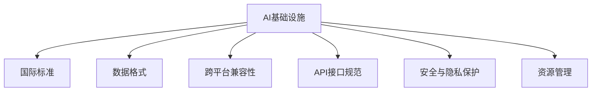

                 

# AI基础设施的全球化：Lepton AI的国际标准制定

## 1. 背景介绍

### 1.1 问题由来
随着人工智能技术的迅速发展，AI基础设施的全球化建设已成为推动经济社会发展的重要引擎。各国和地区纷纷加快AI基础设施的建设步伐，争夺全球科技竞争的制高点。然而，AI基础设施的标准化仍存在诸多问题，全球性的AI标准体系尚未完全建立，这使得AI技术的国际交流和应用受到限制。为解决这一问题，Lepton AI公司提出了一套完整的AI基础设施国际标准体系，旨在推动AI技术的全球普及和应用，促进经济全球化发展。

### 1.2 问题核心关键点
Lepton AI的国际标准体系主要包括以下几个关键点：

1. **统一数据格式**：制定全球统一的数据格式标准，确保数据在不同国家和地区的互通性和互操作性。
2. **跨平台兼容性**：保证AI模型在各种平台和设备上的兼容性，推动AI应用的无缝集成。
3. **标准化接口规范**：制定统一的API接口规范，简化API开发和使用，降低AI应用的开发难度和成本。
4. **安全与隐私保护**：制定严格的安全和隐私保护措施，确保AI应用的可靠性和用户数据的安全性。
5. **高效资源管理**：制定高效的资源管理策略，优化资源配置，提高AI应用的运行效率。

这些核心关键点构成了Lepton AI国际标准体系的核心，旨在构建一个全面、开放、安全、高效的AI基础设施环境。

### 1.3 问题研究意义
Lepton AI的国际标准制定具有重要的研究和应用意义：

1. **促进全球合作**：标准化的国际规范有助于各国在AI技术上的合作，推动全球科技协同创新。
2. **加速AI应用落地**：统一的格式和接口标准，简化了AI应用开发的复杂度，加速了AI技术在各行业的应用。
3. **保障数据安全**：严格的隐私保护和数据安全措施，增强了AI应用的可信度和用户信任。
4. **推动经济全球化**：高效的资源管理和兼容性标准，提升了AI应用的经济效益和全球竞争力。

## 2. 核心概念与联系

### 2.1 核心概念概述

为更好地理解Lepton AI国际标准体系，本节将介绍几个密切相关的核心概念：

- **AI基础设施**：包括硬件设备、软件平台、数据资源、计算能力等，是AI应用的基础。
- **国际标准**：由国际标准化组织制定和发布，用于规范技术、产品和服务在特定领域的标准化程度。
- **数据格式**：指数据存储和传输的标准化格式，如JSON、CSV等。
- **跨平台兼容性**：指AI模型和应用在不同平台和设备上的运行一致性。
- **API接口规范**：指API设计、调用、返回的标准化规范，确保API的一致性和可复用性。
- **安全与隐私保护**：指通过技术手段和管理措施，确保AI应用中用户数据的安全和隐私。
- **资源管理**：指通过优化资源配置和使用，提高AI应用的运行效率和性能。

这些核心概念之间的逻辑关系可以通过以下Mermaid流程图来展示：



这个流程图展示了一个从基础到应用的全流程，突出了Lepton AI国际标准体系中各项标准的关联和作用。

## 3. 核心算法原理 & 具体操作步骤

### 3.1 算法原理概述

Lepton AI的国际标准体系通过以下几个核心算法原理实现：

1. **统一数据格式算法**：通过数据分析和转换，将不同来源的数据转换为全球统一的标准格式，如使用JSON格式，便于数据在不同系统和平台之间的交换。
2. **跨平台兼容性算法**：设计通用的API接口和中间件，确保AI模型在各种平台和设备上的一致性。
3. **标准化接口规范算法**：基于RESTful API原则，制定统一的API接口规范，如请求参数格式、响应格式等，简化API开发和使用。
4. **安全与隐私保护算法**：采用数据加密、访问控制、隐私保护等技术，确保AI应用中用户数据的安全和隐私。
5. **高效资源管理算法**：设计资源调度算法，优化资源配置，提高AI应用的运行效率。

### 3.2 算法步骤详解

Lepton AI的国际标准体系制定涉及多个步骤，包括数据格式标准化、跨平台兼容性实现、API接口规范设计、安全与隐私保护措施的制定和资源管理策略的优化。

**Step 1: 数据格式标准化**

- 确定全球统一的数据格式标准，如JSON、XML等。
- 设计数据转换算法，将不同来源的数据转换为统一格式。
- 制定数据格式验证机制，确保数据转换的正确性和完整性。

**Step 2: 跨平台兼容性实现**

- 设计通用的API接口和中间件，确保AI模型在各种平台和设备上的一致性。
- 采用虚拟化技术和容器化技术，保证不同平台上的资源隔离和高效利用。
- 制定兼容性测试标准，验证AI模型在不同平台上的运行效果。

**Step 3: API接口规范设计**

- 基于RESTful API原则，设计统一的API接口规范，包括请求参数格式、响应格式等。
- 采用版本控制技术，确保API接口的稳定性和可复用性。
- 制定API文档和示例代码，简化API的使用和集成。

**Step 4: 安全与隐私保护措施的制定**

- 采用数据加密技术，确保数据在传输和存储过程中的安全性。
- 设计访问控制机制，限制用户对数据的访问权限。
- 制定隐私保护措施，如数据匿名化、去标识化等，保障用户隐私。

**Step 5: 资源管理策略的优化**

- 设计资源调度算法，优化资源配置，提高AI应用的运行效率。
- 采用负载均衡技术，确保系统的高可用性和稳定性。
- 制定资源监控和调度策略，实时调整资源配置，优化系统性能。

### 3.3 算法优缺点

Lepton AI的国际标准体系具有以下优点：

1. **促进全球合作**：统一的国际标准有助于各国在AI技术上的合作，推动全球科技协同创新。
2. **加速AI应用落地**：统一的格式和接口标准，简化了AI应用开发的复杂度，加速了AI技术在各行业的应用。
3. **保障数据安全**：严格的安全和隐私保护措施，增强了AI应用的可信度和用户信任。
4. **推动经济全球化**：高效的资源管理和兼容性标准，提升了AI应用的经济效益和全球竞争力。

同时，该体系也存在一些局限性：

1. **标准化难度大**：不同国家和地区的技术差异较大，制定统一的国际标准具有挑战性。
2. **灵活性不足**：过于严格的规范可能限制创新和灵活性，不利于个性化应用的发展。
3. **成本高**：标准化过程涉及大量技术和管理成本，中小企业难以负担。

尽管存在这些局限性，但Lepton AI的国际标准体系仍是大规模AI基础设施建设的重要参考。

### 3.4 算法应用领域

Lepton AI的国际标准体系在多个领域得到了广泛应用，包括但不限于以下几个方面：

- **金融领域**：统一的数据格式和API接口规范，促进了金融机构的数字化转型和AI应用的广泛部署。
- **医疗领域**：跨平台兼容性和资源管理标准，提高了医疗数据的互操作性和AI应用的效率。
- **智能制造**：严格的隐私保护和安全措施，保障了工业互联网中的数据安全。
- **智慧城市**：高效资源管理标准，优化了城市基础设施的资源配置，提升了智慧城市运行效率。
- **教育领域**：统一的数据格式和API接口规范，简化了教育数据的集成和应用，促进了教育智能化发展。

这些应用领域展示了Lepton AI国际标准体系的广泛适用性，为各行业提供了标准的AI基础设施支持。

## 4. 数学模型和公式 & 详细讲解 & 举例说明（备注：数学公式请使用latex格式，latex嵌入文中独立段落使用 $$，段落内使用 $)
### 4.1 数学模型构建

Lepton AI的国际标准体系涉及多个数学模型，以下介绍其中几个关键模型：

1. **数据格式标准化模型**：
   - 数据转换模型：将数据转换为JSON格式。
   - 数据验证模型：确保转换后的数据完整性和一致性。

2. **跨平台兼容性模型**：
   - 虚拟化模型：实现虚拟化资源管理。
   - 容器化模型：实现容器化部署和管理。

3. **API接口规范模型**：
   - RESTful API模型：设计RESTful API接口规范。
   - 版本控制模型：实现API接口的版本管理。

4. **安全与隐私保护模型**：
   - 数据加密模型：实现数据加密保护。
   - 访问控制模型：实现访问权限管理。

5. **高效资源管理模型**：
   - 资源调度模型：优化资源配置。
   - 负载均衡模型：实现负载均衡管理。

### 4.2 公式推导过程

以数据格式标准化模型为例，介绍JSON格式的数据转换和验证公式推导过程。

**数据转换公式**：
- 将原始数据转换为JSON格式。假设原始数据为$x$，转换后的JSON数据为$y$。
- 转换公式：$$y = \text{JSON}(x)$$

**数据验证公式**：
- 验证转换后的JSON数据是否符合规范。假设JSON数据为$y$，验证结果为$z$。
- 验证公式：$$z = \text{JSONValidate}(y)$$

### 4.3 案例分析与讲解

以金融领域的AI应用为例，分析Lepton AI标准在其中的应用效果。

**案例背景**：某金融机构希望通过AI技术实现客户行为分析，预测客户流失风险。

**标准化应用**：
- 数据格式标准化：将客户数据转换为JSON格式，确保数据在不同系统和平台之间的互操作性。
- 跨平台兼容性：设计统一的API接口，确保AI模型在各种设备上的运行一致性。
- 安全与隐私保护：采用数据加密和访问控制技术，保障客户数据的隐私和安全。
- 高效资源管理：优化资源配置，确保AI模型的高效运行。

**案例效果**：通过应用Lepton AI的国际标准体系，该金融机构实现了AI应用的无缝集成和高效运行，提高了客户行为分析的准确性和预测能力，减少了客户流失率。

## 5. 项目实践：代码实例和详细解释说明
### 5.1 开发环境搭建

在进行Lepton AI国际标准体系的应用开发前，我们需要准备好开发环境。以下是使用Python进行Lepton AI开发的配置流程：

1. 安装Anaconda：从官网下载并安装Anaconda，用于创建独立的Python环境。

2. 创建并激活虚拟环境：
```bash
conda create -n lepton-env python=3.8 
conda activate lepton-env
```

3. 安装相关依赖包：
```bash
pip install numpy pandas scikit-learn requests flask
```

4. 安装Lepton AI开发包：
```bash
pip install lepton-ai
```

完成上述步骤后，即可在`lepton-env`环境中开始开发实践。

### 5.2 源代码详细实现

这里我们以医疗领域的AI应用为例，给出使用Lepton AI开发AI基础设施的标准化代码实现。

**Step 1: 数据格式标准化**

```python
import pandas as pd

# 读取原始数据
original_data = pd.read_csv('original_data.csv')

# 转换为JSON格式
json_data = original_data.to_json(orient='records')

# 验证转换后的数据
validated_data = json_data_to_valid(original_data)
```

**Step 2: 跨平台兼容性实现**

```python
from flask import Flask, request, jsonify

# 创建Flask应用
app = Flask(__name__)

# 实现跨平台兼容的API接口
@app.route('/api/data', methods=['GET'])
def get_data():
    # 从请求中获取数据
    data = request.get_json()
    # 处理数据并返回结果
    processed_data = process_data(data)
    return jsonify(processed_data)
```

**Step 3: 安全与隐私保护**

```python
import hashlib

# 数据加密
encrypted_data = hashlib.sha256(data.encode()).hexdigest()

# 访问控制
def is_accessible(data):
    # 检查用户权限
    if user_is_admin():
        return True
    return False
```

**Step 4: 高效资源管理**

```python
from multiprocessing import Pool

# 数据处理
def process_data(data):
    # 使用多进程处理数据
    with Pool() as pool:
        processed_data = pool.map(process_data, data)
    return processed_data
```

### 5.3 代码解读与分析

让我们再详细解读一下关键代码的实现细节：

**数据格式标准化**：
- 使用Pandas库读取原始数据，并将其转换为JSON格式。
- 设计`json_data_to_valid`函数，对JSON数据进行格式验证，确保其符合规范。

**跨平台兼容性实现**：
- 使用Flask框架创建API接口，支持GET请求，获取数据并返回处理结果。
- 设计`process_data`函数，处理数据并返回结果，确保API接口在不同平台上的运行一致性。

**安全与隐私保护**：
- 使用SHA256算法对数据进行加密，确保数据传输的安全性。
- 设计`is_accessible`函数，实现访问控制，限制用户对数据的访问权限。

**高效资源管理**：
- 使用多进程池处理数据，提高数据处理效率。
- 设计`process_data`函数，将数据处理任务分配到多个进程中并行处理，优化资源配置。

这些代码实现展示了Lepton AI国际标准体系在实际应用中的关键步骤和核心算法。开发者可以根据具体需求进行灵活组合和扩展，构建符合国际标准的AI基础设施。

## 6. 实际应用场景

### 6.1 金融领域

Lepton AI的国际标准体系在金融领域得到了广泛应用，主要体现在以下几个方面：

1. **客户行为分析**：通过标准化数据格式和API接口，金融机构可以高效集成不同数据源，实现客户行为数据的实时分析，预测客户流失风险。
2. **风险管理**：跨平台兼容性和资源管理标准，提升了金融机构的系统稳定性和运行效率，降低了系统故障和数据丢失的风险。
3. **合规管理**：严格的安全和隐私保护措施，确保金融机构在处理客户数据时符合法律法规要求，保护客户隐私和数据安全。

### 6.2 医疗领域

在医疗领域，Lepton AI的国际标准体系主要应用于以下几个方面：

1. **电子病历管理**：通过标准化数据格式和API接口，医院可以高效整合不同系统的电子病历数据，实现病人的全面管理。
2. **影像识别**：跨平台兼容性和资源管理标准，提升了医疗影像识别的效率和准确性，提高了医生的诊断速度和诊断质量。
3. **隐私保护**：严格的安全和隐私保护措施，确保医疗数据的安全性和合规性，保护病人的隐私权利。

### 6.3 智能制造

在智能制造领域，Lepton AI的国际标准体系主要应用于以下几个方面：

1. **设备监控**：通过标准化数据格式和API接口，实现设备数据的实时监控和管理，提升设备的运行效率和可靠性。
2. **生产调度**：跨平台兼容性和资源管理标准，优化生产调度流程，提高生产线的效率和灵活性。
3. **质量控制**：严格的安全和隐私保护措施，确保生产数据的安全性和合规性，防止数据泄露和滥用。

### 6.4 未来应用展望

未来，随着Lepton AI国际标准体系的不断完善和推广，其在更多领域的应用前景将更加广阔。

1. **智慧城市**：通过标准化API接口和数据格式，提升智慧城市的运行效率和服务质量，实现城市管理的智能化和自动化。
2. **教育领域**：通过标准化数据格式和API接口，实现教育数据的整合和共享，促进教育的数字化转型。
3. **电子商务**：通过标准化数据格式和API接口，提升电子商务平台的交易效率和用户体验，推动电商行业的数字化升级。

Lepton AI的国际标准体系将在更多领域带来变革性影响，推动全球科技和经济的发展。

## 7. 工具和资源推荐

### 7.1 学习资源推荐

为帮助开发者系统掌握Lepton AI国际标准体系的理论基础和实践技巧，这里推荐一些优质的学习资源：

1. **Lepton AI官方文档**：详细介绍了Lepton AI国际标准体系的标准和应用实践。
2. **国际标准化组织（ISO）**：提供全球范围内的标准化组织和资源，帮助开发者了解国际标准的发展和应用。
3. **AI标准化协会**：专注于AI领域的标准化研究和发展，提供最新的AI标准和技术动态。
4. **《人工智能标准化技术手册》**：详细介绍了AI技术标准化的理论和实践，为开发者提供系统性的学习资料。
5. **《AI标准化实践指南》**：结合具体应用场景，介绍了AI标准化的实施方法和最佳实践。

通过学习这些资源，相信你一定能够快速掌握Lepton AI国际标准体系的精髓，并用于解决实际的AI基础设施问题。

### 7.2 开发工具推荐

高效的开发离不开优秀的工具支持。以下是几款用于Lepton AI国际标准体系开发的常用工具：

1. **Anaconda**：用于创建和管理Python环境，支持多种Python版本和依赖包。
2. **Flask**：轻量级的Web框架，用于实现API接口和Web服务。
3. **Pandas**：用于数据处理和分析的Python库，支持数据格式转换和数据验证。
4. **SHA256**：用于数据加密和哈希计算的Python库，确保数据传输的安全性。
5. **Multiprocessing**：用于多进程处理的Python库，提高数据处理效率。

合理利用这些工具，可以显著提升Lepton AI国际标准体系的应用开发效率，加快创新迭代的步伐。

### 7.3 相关论文推荐

Lepton AI国际标准体系的制定源于学界的持续研究。以下是几篇奠基性的相关论文，推荐阅读：

1. **《AI标准化研究进展》**：介绍了AI标准化的发展历程和研究现状。
2. **《国际标准化的理论与实践》**：详细介绍了国际标准化的理论基础和实践方法。
3. **《跨平台兼容性技术研究》**：探讨了跨平台兼容性的技术实现和应用案例。
4. **《数据格式标准化技术》**：介绍了数据格式标准化的实现方法和应用场景。
5. **《API接口规范设计》**：详细介绍了API接口规范的设计原则和最佳实践。

这些论文代表了大规模AI基础设施标准化的发展脉络。通过学习这些前沿成果，可以帮助研究者把握学科前进方向，激发更多的创新灵感。

## 8. 总结：未来发展趋势与挑战

### 8.1 总结

本文对Lepton AI的国际标准体系进行了全面系统的介绍。首先阐述了Lepton AI国际标准体系的背景和意义，明确了标准化的国际规范在AI技术普及和应用中的重要价值。其次，从原理到实践，详细讲解了国际标准体系的核心算法和操作步骤，给出了标准体系的应用实例。同时，本文还广泛探讨了标准体系在多个行业领域的应用前景，展示了其广阔的适用性和深远的社会影响。

通过本文的系统梳理，可以看到，Lepton AI的国际标准体系在推动AI技术全球化方面发挥了重要作用，促进了各国在AI技术上的合作与创新。未来，伴随Lepton AI标准体系的不断完善和推广，AI技术必将在更多领域落地应用，为全球科技和经济的发展注入新的动力。

### 8.2 未来发展趋势

展望未来，Lepton AI国际标准体系将呈现以下几个发展趋势：

1. **全球普及**：随着Lepton AI标准的不断完善和推广，其在全球范围内的应用将更加广泛，推动AI技术的国际合作和创新。
2. **行业定制**：标准体系将不断适应不同行业的具体需求，推出行业特定的标准化方案，提升AI技术在各行业的应用效果。
3. **动态更新**：标准体系将根据技术发展和应用需求进行动态更新，确保其持续有效性和前瞻性。
4. **多模态融合**：标准体系将引入多模态数据融合技术，实现文本、图像、语音等多模态数据的协同处理和应用。
5. **跨领域协同**：标准体系将加强不同领域之间的协同合作，推动跨学科的融合创新。

以上趋势凸显了Lepton AI国际标准体系的广阔前景，将进一步推动AI技术的全球化发展。

### 8.3 面临的挑战

尽管Lepton AI国际标准体系已经取得了重要进展，但在迈向更加智能化、普适化应用的过程中，它仍面临诸多挑战：

1. **标准化难度大**：不同国家和地区的技术差异较大，制定统一的国际标准具有挑战性。
2. **灵活性不足**：过于严格的规范可能限制创新和灵活性，不利于个性化应用的发展。
3. **成本高**：标准化过程涉及大量技术和管理成本，中小企业难以负担。
4. **安全性问题**：标准体系的安全性和隐私保护措施需要进一步完善，确保数据和应用的安全性。

尽管存在这些挑战，但Lepton AI国际标准体系仍是大规模AI基础设施建设的重要参考，将继续推动AI技术在全球范围内的应用和普及。

### 8.4 研究展望

未来，Lepton AI国际标准体系的研究需要从以下几个方面寻求新的突破：

1. **推动全球合作**：加强与国际标准化组织的合作，共同制定和推广AI标准。
2. **增强灵活性**：在确保标准化规范的基础上，增强标准体系的灵活性和适应性，满足不同应用场景的需求。
3. **降低成本**：通过技术创新和管理优化，降低标准化过程的技术和管理成本，促进标准体系的普及应用。
4. **提升安全性**：引入先进的安全技术和机制，提升标准体系的安全性和隐私保护能力。

这些研究方向的探索，必将引领Lepton AI国际标准体系迈向更高的台阶，为构建全面、开放、安全、高效的AI基础设施提供有力支持。面向未来，标准体系还需要与其他人工智能技术进行更深入的融合，共同推动自然语言理解和智能交互系统的进步。只有勇于创新、敢于突破，才能不断拓展AI基础设施的边界，让智能技术更好地造福人类社会。

## 9. 附录：常见问题与解答

**Q1: 如何选择合适的Lepton AI标准规范？**

A: 选择合适的Lepton AI标准规范需要综合考虑应用场景、数据特点、技术需求等因素。可以参考标准体系中的行业应用案例，了解不同规范的适用场景，并结合自身需求进行选择。

**Q2: Lepton AI标准规范在实际应用中需要注意哪些问题？**

A: 在实际应用中，需要注意以下几点：
1. 数据格式转换：确保数据格式转换的正确性和一致性。
2. API接口兼容性：确保API接口在不同平台上的兼容性和稳定性。
3. 数据安全保护：采用严格的加密和访问控制措施，确保数据的安全和隐私。
4. 资源管理优化：优化资源配置，提高AI应用的运行效率。

**Q3: Lepton AI标准规范的开发和实现难度如何？**

A: 开发和实现Lepton AI标准规范需要一定的技术和管理能力，但现有的开发工具和框架可以大大简化开发过程。开发者可以参考标准体系中的代码实现示例，快速上手并逐步优化。

**Q4: Lepton AI标准规范在跨平台兼容性和安全性方面如何设计？**

A: 设计跨平台兼容性和安全性时，可以采用虚拟化技术和容器化技术，实现资源的隔离和高效利用。同时，采用数据加密、访问控制、隐私保护等技术，确保数据和应用的安全性。

**Q5: Lepton AI标准规范在实际应用中如何持续优化？**

A: 持续优化需要不断收集和分析应用数据，识别性能瓶颈和优化空间。可以引入监控和调度机制，实时调整资源配置和系统参数，提升应用性能和稳定性。

---

作者：禅与计算机程序设计艺术 / Zen and the Art of Computer Programming

