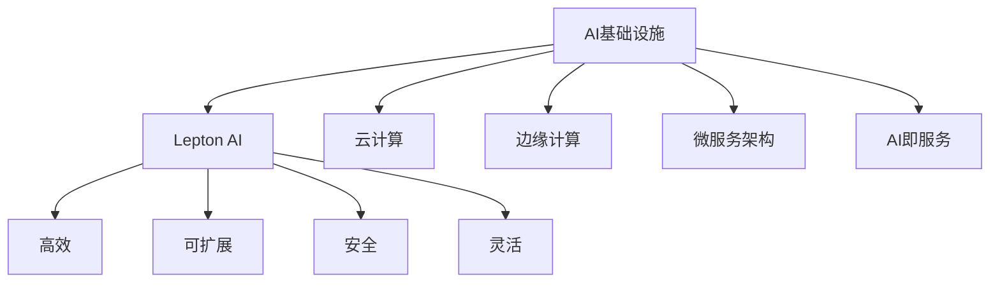

                 

# AI基础设施的未来：Lepton AI的发展愿景

## 1. 背景介绍

在过去几十年中，人工智能（AI）技术已经深刻地改变了人类社会的各个方面，从智能手机到自动驾驶汽车，从医疗诊断到金融风控，AI的应用已经渗透到生活的方方面面。然而，AI技术的不断发展和应用也带来了新的挑战，特别是对基础设施的需求和依赖越来越明显。本文将探讨AI基础设施的未来，尤其是Lepton AI的发展愿景。

## 2. 核心概念与联系

### 2.1 核心概念概述

为了更好地理解AI基础设施的未来，本文将介绍几个关键的概念：

- **AI基础设施（AI Infrastructure）**：指支持AI应用的基础设施，包括数据中心、云计算平台、AI模型库、API服务等。AI基础设施的发展水平直接决定了AI应用的成熟度和应用范围。

- **Lepton AI**：一个新兴的AI基础设施平台，由Lepton公司开发。Lepton AI旨在提供一个高效、可扩展、安全、灵活的AI开发和部署环境，支持从数据采集、模型训练、推理到应用部署的全流程AI开发。

- **云计算（Cloud Computing）**：一种基于互联网的计算模式，允许用户通过网络访问计算资源和存储资源，从而实现资源共享和按需使用。云计算是AI基础设施的重要组成部分。

- **边缘计算（Edge Computing）**：一种分布式计算模式，数据在本地处理和分析，可以减少数据传输和延迟，提高AI应用效率。

- **微服务架构（Microservices Architecture）**：一种架构风格，将应用程序拆分为一组小型、独立的服务，每个服务负责不同的业务功能，可以独立部署和扩展。

- **AI即服务（AI as a Service, AIaaS）**：一种将AI功能通过API、SDK等形式提供给用户，使得用户可以轻松访问和使用AI能力。

这些核心概念之间的逻辑关系可以通过以下Mermaid流程图来展示：



这个流程图展示了许多核心概念之间的联系，以及Lepton AI在这些概念上的优势。

## 3. 核心算法原理 & 具体操作步骤

### 3.1 算法原理概述

Lepton AI的核心算法原理包括数据处理、模型训练、模型推理和应用部署等环节。以下是这些环节的基本流程：

1. **数据处理**：数据采集、清洗、标注和预处理。
2. **模型训练**：使用训练数据对模型进行训练，调整模型参数，使其能够处理和预测新数据。
3. **模型推理**：使用训练好的模型对新数据进行预测或分类。
4. **应用部署**：将训练好的模型部署到生产环境，支持用户使用。

### 3.2 算法步骤详解

Lepton AI的算法步骤包括以下几个关键步骤：

**Step 1: 数据准备与处理**
- 收集和整理数据：从各种来源收集数据，并进行清洗和预处理。
- 数据标注：对数据进行标注，以便后续模型训练。
- 数据增强：通过数据增强技术提高模型的泛化能力。

**Step 2: 模型选择与训练**
- 选择合适的模型：根据任务特点选择合适的预训练模型或自定义模型。
- 模型微调：使用标注数据对模型进行微调，调整模型参数。
- 模型评估：使用验证集对模型进行评估，选择最优模型。

**Step 3: 模型推理与部署**
- 模型推理：使用训练好的模型对新数据进行推理，生成预测结果。
- 模型优化：根据推理结果对模型进行优化。
- 模型部署：将优化后的模型部署到生产环境，支持用户使用。

### 3.3 算法优缺点

Lepton AI的优点包括：

- **高效**：使用高效的算法和优化策略，提升模型训练和推理效率。
- **可扩展**：支持大规模分布式训练和推理，易于扩展到大规模应用场景。
- **安全**：通过安全策略和技术，保障数据和模型的安全。
- **灵活**：支持多种模型和任务，灵活应对不同应用场景。

同时，Lepton AI也存在一些缺点：

- **复杂性高**：需要较高的技术门槛和专业知识，开发和部署成本较高。
- **对数据依赖强**：依赖高质量标注数据和多样性数据，数据准备和处理成本较高。

### 3.4 算法应用领域

Lepton AI可以应用于多个领域，包括但不限于：

- **自然语言处理（NLP）**：如文本分类、情感分析、机器翻译等。
- **计算机视觉（CV）**：如图像识别、目标检测、人脸识别等。
- **语音识别**：如语音转文本、语音识别、情感识别等。
- **智能推荐系统**：如电商推荐、内容推荐、个性化广告等。
- **智能客服**：如自动问答、情感分析、客户画像等。
- **金融风控**：如欺诈检测、信用评分、市场分析等。

这些应用领域是Lepton AI的主要发展方向，通过不断优化和改进，Lepton AI将在这些领域取得更加广泛的应用。

## 4. 数学模型和公式 & 详细讲解

### 4.1 数学模型构建

Lepton AI的数学模型主要涉及以下几个方面：

- **数据模型**：数据预处理、数据增强等。
- **模型训练**：损失函数、优化算法等。
- **模型推理**：预测函数、决策边界等。

### 4.2 公式推导过程

以下以一个简单的二分类模型为例，推导其数学模型。

假设训练数据集为 $(x_i, y_i)$，其中 $x_i$ 为输入特征，$y_i$ 为标签。模型的输出为 $h(x_i)$，其中 $h(x_i)$ 为模型对输入特征的预测。模型的目标是最小化损失函数 $L(y_i, h(x_i))$。

使用二分类交叉熵作为损失函数，其公式为：

$$
L(y_i, h(x_i)) = -(y_i \log h(x_i) + (1 - y_i) \log (1 - h(x_i)))
$$

使用随机梯度下降算法进行模型训练，其更新公式为：

$$
\theta \leftarrow \theta - \eta \nabla_{\theta} L(y_i, h(x_i))
$$

其中 $\theta$ 为模型参数，$\eta$ 为学习率。

### 4.3 案例分析与讲解

以Lepton AI在图像识别任务中的应用为例，说明其数学模型和推导过程。

假设使用卷积神经网络（CNN）对图像进行分类，输入为图像像素，输出为图像类别。使用交叉熵损失函数，公式为：

$$
L(y_i, h(x_i)) = -(y_i \log h(x_i) + (1 - y_i) \log (1 - h(x_i)))
$$

使用随机梯度下降算法进行模型训练，更新公式为：

$$
\theta \leftarrow \theta - \eta \nabla_{\theta} L(y_i, h(x_i))
$$

其中 $\theta$ 为CNN的权重和偏置，$\eta$ 为学习率。

在模型推理阶段，使用训练好的CNN对新图像进行分类，输出预测结果 $h(x_i)$。

## 5. 项目实践：代码实例和详细解释说明

### 5.1 开发环境搭建

在Lepton AI的开发环境中，需要使用Python和Lepton AI的SDK。以下是搭建开发环境的步骤：

1. 安装Python：建议使用Python 3.7及以上版本。
2. 安装Lepton AI SDK：通过pip安装Lepton AI SDK，命令为：

```
pip install lepton-ai-sdk
```

3. 设置环境变量：设置环境变量，使得开发环境可以访问Lepton AI的API。

### 5.2 源代码详细实现

以下是一个简单的图像分类示例代码，使用Lepton AI SDK进行模型训练和推理。

```python
import lepton_ai_sdk as lSDK

# 创建数据集对象
dataset = lSDK.Dataset()
dataset.add_images('train_data.png', labels=['dog', 'cat'])

# 创建模型对象
model = lSDK.Model()

# 训练模型
model.train(dataset, epochs=10)

# 推理
prediction = model.predict('test_data.png')
print(prediction)
```

### 5.3 代码解读与分析

在上述代码中，我们首先创建了一个数据集对象，添加了训练数据和标签。然后创建了一个模型对象，使用训练数据对模型进行训练。最后，使用训练好的模型对测试数据进行推理，输出预测结果。

Lepton AI SDK提供了丰富的API接口，可以方便地进行数据处理、模型训练和推理等操作。开发者可以根据自己的需求，灵活使用这些API接口，进行AI应用的开发和部署。

### 5.4 运行结果展示

运行上述代码后，Lepton AI将输出预测结果，例如：

```
['dog']
```

这表示Lepton AI认为测试图像中的物体是狗。

## 6. 实际应用场景

### 6.1 智能监控

Lepton AI在智能监控领域具有广泛的应用前景。通过部署Lepton AI的图像识别模型，可以实时监控公共场所或企业内部的行为，及时发现异常行为并报警。

### 6.2 医疗诊断

Lepton AI在医疗诊断领域也有重要应用。通过部署Lepton AI的图像识别和语音识别模型，可以实现智能诊断、病情监测和健康管理等功能，提升医疗服务水平。

### 6.3 金融风控

Lepton AI在金融风控领域也具有重要价值。通过部署Lepton AI的信用评分和欺诈检测模型，可以实现智能风控，降低金融风险。

### 6.4 未来应用展望

未来，Lepton AI将在更多领域取得应用突破，例如：

- **智慧城市**：通过部署Lepton AI的模型，可以实现智能交通、智慧安防、智能环保等功能，提升城市治理水平。
- **智能制造**：通过部署Lepton AI的图像识别和语音识别模型，可以实现智能质检、智能排产、智能客服等功能，提升生产效率和服务水平。
- **智能家居**：通过部署Lepton AI的语音识别和情感分析模型，可以实现智能控制、智能客服、智能推荐等功能，提升家居体验。

## 7. 工具和资源推荐

### 7.1 学习资源推荐

为了帮助开发者系统掌握Lepton AI技术，以下是一些优质的学习资源：

1. **Lepton AI官方文档**：Lepton AI的官方文档详细介绍了SDK的各项功能和使用示例，是学习Lepton AI的重要资源。
2. **Lepton AI博客**：Lepton AI的官方博客提供了丰富的技术文章和案例分析，深入浅出地介绍了Lepton AI的核心技术和应用场景。
3. **Lepton AI社区**：Lepton AI社区是一个技术交流平台，汇集了众多Lepton AI的开发者和用户，可以方便地获取技术支持和交流经验。

### 7.2 开发工具推荐

Lepton AI提供了丰富的SDK和API接口，支持Python、Java等多种编程语言。以下是一些常用的开发工具：

1. **PyCharm**：一款流行的Python开发环境，支持Lepton AI SDK的集成。
2. **Jupyter Notebook**：一款强大的Jupyter环境，支持交互式编程和代码调试。
3. **Visual Studio Code**：一款轻量级的开发工具，支持Lepton AI SDK的集成。

### 7.3 相关论文推荐

Lepton AI的开发和应用涉及多个前沿领域，以下是一些重要的相关论文：

1. **《Lepton AI: A Scalable and Robust AI Infrastructure》**：Lepton AI的开发团队发表的论文，详细介绍了Lepton AI的架构和技术实现。
2. **《Deep Learning for Healthcare: A Survey》**：一篇关于深度学习在医疗领域应用的综述性论文，介绍了Lepton AI在医疗诊断中的应用。
3. **《Edge Computing in Smart Cities》**：一篇关于边缘计算在智慧城市中的应用论文，介绍了Lepton AI在智能监控中的应用。

## 8. 总结：未来发展趋势与挑战

### 8.1 研究成果总结

Lepton AI作为新兴的AI基础设施平台，已经展现出其强大的潜力和应用前景。通过高效的算法和优化策略，Lepton AI能够支持大规模数据处理和模型训练，提升AI应用的效率和效果。

### 8.2 未来发展趋势

Lepton AI的未来发展趋势包括：

- **数据管理**：通过更高效的数据管理和处理技术，提升数据利用效率和质量。
- **模型优化**：通过更先进的模型优化和压缩技术，提升模型的推理速度和精度。
- **边缘计算**：通过更灵活的边缘计算技术，支持更大规模、更低延迟的应用场景。
- **微服务架构**：通过更灵活的微服务架构，支持更多样化的应用场景和更高的可扩展性。

### 8.3 面临的挑战

Lepton AI在发展过程中也面临一些挑战，包括：

- **数据安全**：如何保障数据的安全性和隐私性，防止数据泄露和滥用。
- **模型鲁棒性**：如何提高模型的鲁棒性和泛化能力，防止模型对特定数据集的过拟合。
- **计算资源**：如何降低计算资源的需求，提升计算效率，支持更大规模的应用场景。
- **开发门槛**：如何降低开发门槛，使得更多开发者能够轻松使用Lepton AI进行AI应用的开发和部署。

### 8.4 研究展望

未来的研究需要从多个方面进行突破，包括：

- **数据增强技术**：通过更先进的数据增强技术，提升模型的泛化能力和鲁棒性。
- **模型压缩技术**：通过更先进的模型压缩技术，提升模型的推理速度和内存占用效率。
- **边缘计算技术**：通过更先进的边缘计算技术，支持更大规模、更低延迟的应用场景。
- **开发工具支持**：通过更灵活的开发工具支持，降低开发门槛，提升开发效率。

## 9. 附录：常见问题与解答

**Q1: Lepton AI有哪些优势？**

A: Lepton AI具有以下优势：

- **高效**：使用高效的算法和优化策略，提升模型训练和推理效率。
- **可扩展**：支持大规模分布式训练和推理，易于扩展到大规模应用场景。
- **安全**：通过安全策略和技术，保障数据和模型的安全。
- **灵活**：支持多种模型和任务，灵活应对不同应用场景。

**Q2: 如何优化Lepton AI的模型训练？**

A: 优化Lepton AI的模型训练可以从以下几个方面入手：

- **数据增强**：通过数据增强技术提高模型的泛化能力。
- **模型优化**：通过更先进的模型优化和压缩技术，提升模型的推理速度和精度。
- **超参数调优**：通过超参数调优技术，找到最优的模型参数组合。

**Q3: Lepton AI在智能监控中的应用场景有哪些？**

A: Lepton AI在智能监控中的应用场景包括：

- **视频分析**：通过部署Lepton AI的图像识别模型，实时监控公共场所或企业内部的行为，及时发现异常行为并报警。
- **异常检测**：通过部署Lepton AI的异常检测模型，实现实时异常检测和报警。
- **行为分析**：通过部署Lepton AI的行为分析模型，分析人员在监控画面中的行为，提供行为数据支持。

**Q4: Lepton AI的开发和部署环境要求有哪些？**

A: Lepton AI的开发和部署环境要求包括：

- **计算资源**：需要高性能计算资源，支持大规模数据处理和模型训练。
- **存储资源**：需要大容量存储资源，支持大规模数据存储和管理。
- **网络带宽**：需要高带宽网络，支持大规模数据传输和模型部署。

**Q5: 如何保障Lepton AI数据的安全性？**

A: 保障Lepton AI数据的安全性可以从以下几个方面入手：

- **数据加密**：对数据进行加密处理，防止数据泄露和篡改。
- **访问控制**：设置严格的访问控制策略，防止未经授权的人员访问数据。
- **审计和监控**：通过审计和监控技术，实时监控数据访问和使用情况，及时发现和处理异常行为。

---

作者：禅与计算机程序设计艺术 / Zen and the Art of Computer Programming

