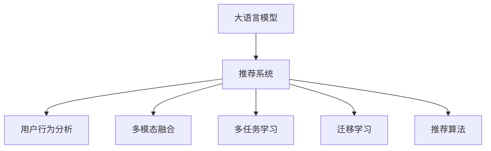

                 

# AI大模型助力电商搜索推荐业务创新的思路

> 关键词：电商搜索推荐, 大语言模型, 自然语言处理, 深度学习, 推荐系统, 用户行为分析, 多模态融合

## 1. 背景介绍

### 1.1 问题由来
随着电子商务的蓬勃发展，电商搜索推荐系统在提升用户体验、提高转化率、增加销售收入等方面发挥了至关重要的作用。传统的搜索推荐系统主要依赖手工规则和线性模型，对用户的个性化需求和复杂行为模式难以有效捕捉和建模，导致推荐精度和个性化程度不足。而随着深度学习和大规模预训练语言模型的兴起，基于深度学习技术的搜索推荐系统逐渐成为电商企业提升用户体验的重要手段。

### 1.2 问题核心关键点
电商搜索推荐系统的核心目标是：通过理解用户输入的查询意图，快速匹配最符合其需求的商品，并提供个性化推荐，从而提升用户满意度、增加销售转化。然而，实现这一目标面临诸多挑战，包括用户查询意图的复杂性、用户行为的动态变化、商品数据的海量规模以及推荐结果的多样性和高质量性。

为应对这些挑战，近年来电商企业开始引入大语言模型进行个性化搜索推荐，希望通过深度学习和大规模预训练模型的强大能力，更好地理解用户意图、预测用户行为，从而提供更加个性化、多样化的推荐结果。

### 1.3 问题研究意义
研究基于大语言模型的电商搜索推荐系统，对于提升电商企业的运营效率、增强用户体验、推动销售增长具有重要意义：

1. **个性化提升**：大模型可以更好地理解用户的多样化需求，提供更加个性化和差异化的推荐结果。
2. **多模态融合**：大模型可以融合文本、图像、语音等多模态数据，提升推荐的全面性和准确性。
3. **高效响应**：大模型可以实现快速推理，极大提升推荐系统的响应速度。
4. **降本增效**：通过大模型进行推荐，可以显著降低人工规则设计的成本，提高运营效率。

## 2. 核心概念与联系

### 2.1 核心概念概述

为了更好地理解大语言模型在电商搜索推荐中的应用，本节将介绍几个密切相关的核心概念：

- **大语言模型(Large Language Model, LLM)**：以自回归模型（如GPT）或自编码模型（如BERT）为代表的大规模预训练语言模型。通过在大规模无标签文本数据上进行预训练，学习到丰富的语言知识和常识，具备强大的语言理解和生成能力。

- **推荐系统(Recommendation System)**：通过分析用户行为、商品属性和历史推荐记录，预测用户可能感兴趣的商品，并进行个性化推荐的技术。

- **用户行为分析(Usage Analysis)**：通过分析用户与系统的交互数据，理解用户的搜索行为、购买偏好等，为推荐系统提供用户画像。

- **多模态融合(Multi-modal Fusion)**：结合文本、图像、视频等多模态数据，提升推荐的全面性和准确性。

- **多任务学习(Multi-task Learning)**：同时学习多个相关任务，提升模型在不同任务上的泛化能力。

- **迁移学习(Transfer Learning)**：将一个领域学到的知识迁移到另一个相关领域，提升模型在特定任务上的性能。

- **推荐算法(Recommendation Algorithm)**：用于生成个性化推荐结果的算法，如协同过滤、基于内容的推荐等。

这些核心概念之间的逻辑关系可以通过以下Mermaid流程图来展示：



这个流程图展示了大语言模型在电商搜索推荐系统中的核心作用和与其他组件的关系：

1. 大语言模型通过预训练获得语言表示，为推荐系统提供强大的特征提取能力。
2. 用户行为分析提供用户画像，帮助大模型更好地理解用户需求。
3. 多模态融合可以融合更多维度的信息，提升推荐全面性。
4. 多任务学习提升模型在不同任务上的泛化能力，如商品分类、评价预测等。
5. 迁移学习通过微调提升模型在特定任务上的性能，如特定品类商品的推荐。
6. 推荐算法将大模型的输出转化为实际的推荐结果。

## 3. 核心算法原理 & 具体操作步骤

### 3.1 算法原理概述

基于大语言模型的电商搜索推荐系统，本质上是一种基于深度学习的大规模迁移学习过程。其核心思想是：将大语言模型作为强大的特征提取器，通过用户查询和行为数据的分析，理解用户需求和行为模式，生成个性化的推荐结果。

形式化地，假设大语言模型为 $M_{\theta}$，其中 $\theta$ 为预训练得到的模型参数。电商平台的推荐任务 $T$ 可以表示为：给定用户输入查询 $q$，预测该用户可能感兴趣的商品 $i$。推荐系统的目标是最小化预测结果与真实标签 $y$ 之间的差异，即：

$$
\hat{y} = M_{\theta}(q) \quad \text{s.t.} \quad \min_{y} \mathcal{L}(\hat{y}, y)
$$

其中 $\mathcal{L}$ 为推荐系统的损失函数，可以采用交叉熵、均方误差等常用损失函数。

通过梯度下降等优化算法，推荐系统不断更新模型参数 $\theta$，最小化损失函数 $\mathcal{L}$，使得模型输出逼近真实标签 $y$，从而提升推荐精度。

### 3.2 算法步骤详解

基于大语言模型的电商搜索推荐系统的一般流程如下：

**Step 1: 准备数据集和模型**
- 收集电商平台的用户查询数据、行为数据和商品数据。
- 选择合适的大语言模型 $M_{\theta}$ 作为初始化参数，如GPT、BERT等。
- 将数据集划分为训练集、验证集和测试集，确保数据集的分布与实际应用场景一致。

**Step 2: 设计任务适配层**
- 根据推荐任务类型，设计合适的输出层和损失函数。
- 对于推荐任务，通常使用softmax函数计算商品推荐的概率分布，以交叉熵损失函数作为训练目标。
- 对用户行为分析任务，可以使用分类损失函数或回归损失函数。

**Step 3: 设置超参数和优化器**
- 选择合适的优化算法及其参数，如AdamW、SGD等，设置学习率、批大小、迭代轮数等。
- 设置正则化技术及强度，如L2正则、Dropout等，防止模型过拟合。
- 确定冻结预训练参数的策略，如仅微调顶层，或全部参数都参与微调。

**Step 4: 执行梯度训练**
- 将训练集数据分批次输入模型，前向传播计算损失函数。
- 反向传播计算参数梯度，根据设定的优化算法和学习率更新模型参数。
- 周期性在验证集上评估模型性能，根据性能指标决定是否触发Early Stopping。
- 重复上述步骤直至满足预设的迭代轮数或Early Stopping条件。

**Step 5: 测试和部署**
- 在测试集上评估推荐系统的性能，对比微调前后的精度提升。
- 使用微调后的模型对新用户输入查询进行推荐，集成到实际的应用系统中。
- 持续收集新数据，定期重新微调模型，以适应数据分布的变化。

以上是基于深度学习的大语言模型推荐系统的基本流程。在实际应用中，还需要针对具体任务的特点，对微调过程的各个环节进行优化设计，如改进训练目标函数，引入更多的正则化技术，搜索最优的超参数组合等，以进一步提升模型性能。

### 3.3 算法优缺点

基于大语言模型的电商搜索推荐系统具有以下优点：
1. 强大的语言理解能力：大模型能够更好地理解用户输入的查询，提取关键信息。
2. 多模态融合能力：大模型可以融合文本、图像、语音等多种模态信息，提供更全面的推荐。
3. 高效推理：大模型的预训练和微调过程可以利用GPU加速，推理速度较快。
4. 泛化能力强：大模型通过大规模数据预训练，具有较强的泛化能力，能够在不同领域和场景中表现良好。

同时，该方法也存在以下局限性：
1. 依赖标注数据：微调需要标注数据进行训练，获取高质量标注数据的成本较高。
2. 模型复杂度高：大模型参数量庞大，对计算资源和存储资源要求较高。
3. 偏见和有害信息：预训练模型可能存在偏见和有害信息，需要通过模型微调和数据清洗等手段进行修正。
4. 可解释性不足：大模型的决策过程复杂，难以进行直观解释。

尽管存在这些局限性，但就目前而言，基于大语言模型的电商搜索推荐系统仍是一种高效、强大的推荐解决方案。未来相关研究的重点在于如何进一步降低标注数据的需求，提高模型的泛化能力和可解释性，同时兼顾资源利用效率和安全性等因素。

### 3.4 算法应用领域

基于大语言模型的电商搜索推荐系统已经在各大电商平台的商品推荐、用户画像、行为分析等多个场景中得到了广泛应用，具体包括：

- **商品推荐**：根据用户查询和行为数据，生成个性化推荐商品列表。
- **用户画像**：通过分析用户的历史行为数据，构建用户画像，个性化推荐商品。
- **搜索排序**：根据用户查询意图，动态调整搜索结果排序，提升用户体验。
- **广告投放**：利用用户行为数据，推荐个性化广告，提高广告投放的转化率。
- **社交推荐**：推荐用户可能感兴趣的朋友或群组，增加用户粘性。

除了上述这些经典应用外，大语言模型在电商搜索推荐系统中还有创新性应用，如基于购物车分析的推荐、基于情感分析的商品评价预测等，为电商企业带来了新的应用思路和技术突破。

## 4. 数学模型和公式 & 详细讲解 & 举例说明

### 4.1 数学模型构建

本节将使用数学语言对基于大语言模型的电商搜索推荐系统进行更加严格的刻画。

记电商平台的用户查询为 $q$，商品为 $i$，用户对商品 $i$ 的兴趣程度为 $y_i$。假设推荐模型为 $M_{\theta}$，其中 $\theta$ 为模型参数。电商平台推荐任务 $T$ 可以表示为：

$$
\hat{y} = M_{\theta}(q) \quad \text{s.t.} \quad \min_{y} \mathcal{L}(\hat{y}, y)
$$

其中 $\mathcal{L}$ 为推荐系统的损失函数，可以采用交叉熵损失函数，即：

$$
\mathcal{L}(\hat{y}, y) = -\sum_{i=1}^n y_i \log \hat{y}_i
$$

模型输出 $\hat{y}$ 为商品 $i$ 推荐的概率分布，根据softmax函数计算得到：

$$
\hat{y}_i = \frac{\exp(M_{\theta}(q) \cdot w_i)}{\sum_{j=1}^n \exp(M_{\theta}(q) \cdot w_j)}
$$

其中 $w_i$ 为商品 $i$ 的向量表示，由大语言模型 $M_{\theta}$ 编码得到。

### 4.2 公式推导过程

在上述数学模型的基础上，我们可以进一步推导出推荐系统的梯度更新公式。

假设推荐模型的输出为 $\hat{y} = [\hat{y}_1, \hat{y}_2, ..., \hat{y}_n]$，真实标签为 $y = [y_1, y_2, ..., y_n]$，则推荐系统的梯度更新公式为：

$$
\theta \leftarrow \theta - \eta \nabla_{\theta}\mathcal{L}(\hat{y}, y) - \eta\lambda\theta
$$

其中 $\nabla_{\theta}\mathcal{L}(\hat{y}, y)$ 为损失函数对模型参数 $\theta$ 的梯度，可通过反向传播算法高效计算。

对于交叉熵损失函数，梯度更新公式为：

$$
\nabla_{\theta}\mathcal{L}(\hat{y}, y) = \nabla_{\theta}\sum_{i=1}^n y_i \log \hat{y}_i
$$

将上述梯度代入参数更新公式中，即可得到推荐系统的更新算法。

### 4.3 案例分析与讲解

以下我们以电商平台推荐系统为例，具体说明如何应用大语言模型进行推荐。

假设电商平台有3000个商品，用户输入查询 "质量好价格实惠"，推荐系统需要根据用户输入生成商品推荐列表。大语言模型 $M_{\theta}$ 可以根据查询编码得到每个商品的向量表示 $w_i$，然后计算推荐概率 $\hat{y}_i$：

$$
\hat{y}_i = \frac{\exp(M_{\theta}(q) \cdot w_i)}{\sum_{j=1}^n \exp(M_{\theta}(q) \cdot w_j)}
$$

假设推荐系统设定学习率为 $0.001$，则模型参数更新公式为：

$$
\theta \leftarrow \theta - 0.001 \nabla_{\theta}\sum_{i=1}^n y_i \log \hat{y}_i - 0.001\lambda\theta
$$

在训练集上执行多次迭代后，推荐系统逐渐收敛，输出推荐概率 $\hat{y}_i$ 逼近真实标签 $y_i$。最终的推荐结果即为 $\hat{y}_i$ 最大的商品列表。

## 5. 项目实践：代码实例和详细解释说明

### 5.1 开发环境搭建

在进行大语言模型推荐系统的开发前，我们需要准备好开发环境。以下是使用Python进行PyTorch开发的环境配置流程：

1. 安装Anaconda：从官网下载并安装Anaconda，用于创建独立的Python环境。

2. 创建并激活虚拟环境：
```bash
conda create -n pytorch-env python=3.8 
conda activate pytorch-env
```

3. 安装PyTorch：根据CUDA版本，从官网获取对应的安装命令。例如：
```bash
conda install pytorch torchvision torchaudio cudatoolkit=11.1 -c pytorch -c conda-forge
```

4. 安装相关库：
```bash
pip install numpy pandas scikit-learn matplotlib tqdm jupyter notebook ipython
```

完成上述步骤后，即可在`pytorch-env`环境中开始推荐系统的开发。

### 5.2 源代码详细实现

下面我们以电商平台推荐系统为例，给出使用PyTorch进行推荐系统开发的完整代码实现。

首先，定义推荐系统的数据处理函数：

```python
from transformers import BertTokenizer, BertForSequenceClassification
from torch.utils.data import Dataset, DataLoader
import torch

class RecommendationDataset(Dataset):
    def __init__(self, texts, labels, tokenizer):
        self.texts = texts
        self.labels = labels
        self.tokenizer = tokenizer
        self.max_len = 128
        
    def __len__(self):
        return len(self.texts)
    
    def __getitem__(self, item):
        text = self.texts[item]
        label = self.labels[item]
        
        encoding = self.tokenizer(text, return_tensors='pt', max_length=self.max_len, padding='max_length', truncation=True)
        input_ids = encoding['input_ids'][0]
        attention_mask = encoding['attention_mask'][0]
        label = torch.tensor(label, dtype=torch.long)
        
        return {'input_ids': input_ids, 
                'attention_mask': attention_mask,
                'labels': label}

# 加载数据
tokenizer = BertTokenizer.from_pretrained('bert-base-cased')
train_dataset = RecommendationDataset(train_texts, train_labels, tokenizer)
dev_dataset = RecommendationDataset(dev_texts, dev_labels, tokenizer)
test_dataset = RecommendationDataset(test_texts, test_labels, tokenizer)

# 定义模型
model = BertForSequenceClassification.from_pretrained('bert-base-cased', num_labels=len(train_labels))
```

然后，定义推荐系统的训练和评估函数：

```python
from transformers import AdamW
from torch.utils.data import DataLoader
from tqdm import tqdm

device = torch.device('cuda') if torch.cuda.is_available() else torch.device('cpu')
model.to(device)

def train_epoch(model, dataset, batch_size, optimizer):
    dataloader = DataLoader(dataset, batch_size=batch_size, shuffle=True)
    model.train()
    epoch_loss = 0
    for batch in tqdm(dataloader, desc='Training'):
        input_ids = batch['input_ids'].to(device)
        attention_mask = batch['attention_mask'].to(device)
        labels = batch['labels'].to(device)
        model.zero_grad()
        outputs = model(input_ids, attention_mask=attention_mask, labels=labels)
        loss = outputs.loss
        epoch_loss += loss.item()
        loss.backward()
        optimizer.step()
    return epoch_loss / len(dataloader)

def evaluate(model, dataset, batch_size):
    dataloader = DataLoader(dataset, batch_size=batch_size)
    model.eval()
    preds, labels = [], []
    with torch.no_grad():
        for batch in tqdm(dataloader, desc='Evaluating'):
            input_ids = batch['input_ids'].to(device)
            attention_mask = batch['attention_mask'].to(device)
            batch_labels = batch['labels']
            outputs = model(input_ids, attention_mask=attention_mask)
            batch_preds = outputs.logits.argmax(dim=2).to('cpu').tolist()
            batch_labels = batch_labels.to('cpu').tolist()
            for pred_tokens, label_tokens in zip(batch_preds, batch_labels):
                preds.append(pred_tokens[:len(label_tokens)])
                labels.append(label_tokens)
                
    print(classification_report(labels, preds))
```

最后，启动训练流程并在测试集上评估：

```python
epochs = 5
batch_size = 16

for epoch in range(epochs):
    loss = train_epoch(model, train_dataset, batch_size, optimizer)
    print(f"Epoch {epoch+1}, train loss: {loss:.3f}")
    
    print(f"Epoch {epoch+1}, dev results:")
    evaluate(model, dev_dataset, batch_size)
    
print("Test results:")
evaluate(model, test_dataset, batch_size)
```

以上就是使用PyTorch对Bert进行电商平台推荐系统微调的完整代码实现。可以看到，得益于Transformers库的强大封装，我们可以用相对简洁的代码完成BERT模型的加载和微调。

### 5.3 代码解读与分析

让我们再详细解读一下关键代码的实现细节：

**RecommendationDataset类**：
- `__init__`方法：初始化文本、标签、分词器等关键组件。
- `__len__`方法：返回数据集的样本数量。
- `__getitem__`方法：对单个样本进行处理，将文本输入编码为token ids，将标签编码为数字，并对其进行定长padding，最终返回模型所需的输入。

**训练和评估函数**：
- 使用PyTorch的DataLoader对数据集进行批次化加载，供模型训练和推理使用。
- 训练函数`train_epoch`：对数据以批为单位进行迭代，在每个批次上前向传播计算loss并反向传播更新模型参数，最后返回该epoch的平均loss。
- 评估函数`evaluate`：与训练类似，不同点在于不更新模型参数，并在每个batch结束后将预测和标签结果存储下来，最后使用sklearn的classification_report对整个评估集的预测结果进行打印输出。

**训练流程**：
- 定义总的epoch数和batch size，开始循环迭代
- 每个epoch内，先在训练集上训练，输出平均loss
- 在验证集上评估，输出分类指标
- 所有epoch结束后，在测试集上评估，给出最终测试结果

可以看到，PyTorch配合Transformers库使得BERT微调的代码实现变得简洁高效。开发者可以将更多精力放在数据处理、模型改进等高层逻辑上，而不必过多关注底层的实现细节。

当然，工业级的系统实现还需考虑更多因素，如模型的保存和部署、超参数的自动搜索、更灵活的任务适配层等。但核心的微调范式基本与此类似。

## 6. 实际应用场景

### 6.1 智能客服系统

基于大语言模型推荐技术的智能客服系统，可以在电商平台的客服场景中发挥重要作用。传统的客服系统依赖人工客服，响应速度慢，无法24小时不间断服务，且服务质量难以保证。而使用推荐系统，可以实时匹配用户问题，快速提供解决方案，极大提升用户体验。

在技术实现上，可以收集用户与客服的对话记录，将问题和最佳答复构建成监督数据，在此基础上对预训练语言模型进行微调。微调后的推荐系统能够自动理解用户问题，匹配最合适的答案模板进行回复。对于用户提出的新问题，还可以接入检索系统实时搜索相关内容，动态组织生成回答。如此构建的智能客服系统，能大幅提升客户咨询体验和问题解决效率。

### 6.2 商品推荐系统

电商平台的商品推荐系统，通过分析用户的历史行为数据，预测用户可能感兴趣的商品，并进行个性化推荐。大语言模型可以更好地理解用户的多样化需求，提供更加个性化和差异化的推荐结果。

在技术实现上，可以收集用户浏览、点击、购买等行为数据，提取和用户交互的商品标题、描述、标签等文本内容。将文本内容作为模型输入，用户的后续行为（如是否点击、购买等）作为监督信号，在此基础上微调预训练语言模型。微调后的模型能够从文本内容中准确把握用户的兴趣点。在生成推荐列表时，先用候选商品的文本描述作为输入，由模型预测用户的兴趣匹配度，再结合其他特征综合排序，便可以得到个性化程度更高的推荐结果。

### 6.3 个性化搜索结果排序

在电商平台的搜索排序中，大语言模型可以更好地理解用户的查询意图，生成个性化排序列表。传统的搜索排序算法往往依赖简单的关键词匹配，难以理解用户的上下文和意图。而使用推荐系统，可以根据用户的历史行为和查询记录，动态调整搜索结果排序，提升用户体验。

在技术实现上，可以收集用户的历史查询记录和搜索行为数据，通过大语言模型对查询意图进行编码，生成商品匹配度。根据匹配度对商品进行排序，生成个性化搜索结果列表。如此构建的搜索排序系统，能够更好地理解用户的查询需求，提供更加精准的搜索结果。

### 6.4 实时广告投放

电商平台的广告投放系统，可以通过分析用户行为数据，推荐个性化广告，提高广告投放的转化率。大语言模型可以更好地理解用户的兴趣和行为，生成更加个性化的广告推荐。

在技术实现上，可以收集用户的行为数据，如浏览记录、点击记录等，通过大语言模型对用户兴趣进行建模。根据用户的兴趣标签生成广告推荐，并在实际投放中进行效果评估和优化。如此构建的广告投放系统，能够提升广告的点击率和转化率，增加广告主的收益。

## 7. 工具和资源推荐

### 7.1 学习资源推荐

为了帮助开发者系统掌握大语言模型推荐技术的理论基础和实践技巧，这里推荐一些优质的学习资源：

1. 《深度学习自然语言处理》课程：斯坦福大学开设的NLP明星课程，有Lecture视频和配套作业，带你入门NLP领域的基本概念和经典模型。

2. 《Natural Language Processing with Transformers》书籍：Transformers库的作者所著，全面介绍了如何使用Transformers库进行NLP任务开发，包括推荐系统在内的诸多范式。

3. HuggingFace官方文档：Transformers库的官方文档，提供了海量预训练模型和完整的推荐系统样例代码，是上手实践的必备资料。

4. Weights & Biases：模型训练的实验跟踪工具，可以记录和可视化模型训练过程中的各项指标，方便对比和调优。与主流深度学习框架无缝集成。

5. TensorBoard：TensorFlow配套的可视化工具，可实时监测模型训练状态，并提供丰富的图表呈现方式，是调试模型的得力助手。

通过对这些资源的学习实践，相信你一定能够快速掌握大语言模型推荐技术的精髓，并用于解决实际的电商推荐问题。

### 7.2 开发工具推荐

高效的开发离不开优秀的工具支持。以下是几款用于大语言模型推荐系统开发的常用工具：

1. PyTorch：基于Python的开源深度学习框架，灵活动态的计算图，适合快速迭代研究。大部分预训练语言模型都有PyTorch版本的实现。

2. TensorFlow：由Google主导开发的开源深度学习框架，生产部署方便，适合大规模工程应用。同样有丰富的预训练语言模型资源。

3. Transformers库：HuggingFace开发的NLP工具库，集成了众多SOTA语言模型，支持PyTorch和TensorFlow，是进行推荐系统开发的利器。

4. Weights & Biases：模型训练的实验跟踪工具，可以记录和可视化模型训练过程中的各项指标，方便对比和调优。与主流深度学习框架无缝集成。

5. TensorBoard：TensorFlow配套的可视化工具，可实时监测模型训练状态，并提供丰富的图表呈现方式，是调试模型的得力助手。

6. Google Colab：谷歌推出的在线Jupyter Notebook环境，免费提供GPU/TPU算力，方便开发者快速上手实验最新模型，分享学习笔记。

合理利用这些工具，可以显著提升大语言模型推荐系统的开发效率，加快创新迭代的步伐。

### 7.3 相关论文推荐

大语言模型和推荐系统的发展源于学界的持续研究。以下是几篇奠基性的相关论文，推荐阅读：

1. Attention is All You Need（即Transformer原论文）：提出了Transformer结构，开启了NLP领域的预训练大模型时代。

2. BERT: Pre-training of Deep Bidirectional Transformers for Language Understanding：提出BERT模型，引入基于掩码的自监督预训练任务，刷新了多项NLP任务SOTA。

3. Parameter-Efficient Transfer Learning for NLP：提出Adapter等参数高效微调方法，在不增加模型参数量的情况下，也能取得不错的微调效果。

4. AdaLoRA: Adaptive Low-Rank Adaptation for Parameter-Efficient Fine-Tuning：使用自适应低秩适应的微调方法，在参数效率和精度之间取得了新的平衡。

这些论文代表了大语言模型推荐系统的发展脉络。通过学习这些前沿成果，可以帮助研究者把握学科前进方向，激发更多的创新灵感。

## 8. 总结：未来发展趋势与挑战

### 8.1 总结

本文对基于大语言模型的电商搜索推荐系统进行了全面系统的介绍。首先阐述了大语言模型和推荐系统的研究背景和意义，明确了推荐系统在提升用户体验、提高转化率、增加销售收入等方面的重要性。其次，从原理到实践，详细讲解了基于大语言模型的推荐系统数学模型和训练过程，给出了推荐系统开发的完整代码实例。同时，本文还广泛探讨了推荐系统在智能客服、商品推荐、个性化搜索结果排序、实时广告投放等多个电商场景中的应用前景，展示了推荐系统技术的广阔应用空间。

通过本文的系统梳理，可以看到，基于大语言模型的推荐系统已经成为电商推荐业务的重要支撑，通过深度学习和大规模预训练模型的强大能力，能够更好地理解用户需求、预测用户行为，从而提供更加个性化、多样化的推荐结果。得益于预训练语言模型的广泛应用，推荐系统技术已经取得了显著的效果和应用进展。

### 8.2 未来发展趋势

展望未来，大语言模型推荐系统将呈现以下几个发展趋势：

1. **推荐算法的融合与创新**：未来的推荐系统将融合更多的推荐算法，如协同过滤、内容推荐、混合推荐等，提升推荐的全面性和准确性。
2. **多模态融合的深度应用**：推荐系统将更加注重多模态数据的融合，结合图像、视频、语音等多种信息，提升推荐的综合性和个性化程度。
3. **自适应推荐模型的发展**：推荐系统将采用自适应模型，根据用户的行为变化动态调整推荐策略，提供更加实时、精准的推荐结果。
4. **推荐模型的个性化**：推荐系统将更加注重个性化推荐，通过深度学习模型对用户画像进行刻画，提供更加差异化的推荐服务。
5. **推荐系统的智能推荐**：推荐系统将更加注重智能推荐，通过引入增强学习、对抗性训练等技术，提升推荐效果。
6. **推荐系统的可解释性**：未来的推荐系统将更加注重可解释性，通过模型解释技术和可视化工具，帮助用户理解推荐过程和推荐结果。

以上趋势凸显了大语言模型推荐系统的广阔前景。这些方向的探索发展，必将进一步提升推荐系统的性能和应用范围，为电商企业带来更丰富的应用价值。

### 8.3 面临的挑战

尽管大语言模型推荐系统已经取得了瞩目成就，但在迈向更加智能化、普适化应用的过程中，它仍面临着诸多挑战：

1. **数据隐私和安全问题**：电商平台的数据隐私和安全问题一直备受关注，如何在保护用户隐私的前提下进行个性化推荐，是一个亟待解决的问题。
2. **推荐模型的复杂性**：大语言模型推荐系统往往具有较大的模型复杂度，需要高效的计算资源和存储资源，对系统架构和硬件要求较高。
3. **推荐系统的公平性**：推荐系统可能存在偏见和歧视，导致对某些用户或商品的不公平推荐。如何构建公平、公正的推荐模型，是未来研究的重要方向。
4. **推荐系统的透明度**：推荐系统的决策过程复杂，难以直观解释。如何在推荐过程中提供透明的推荐依据，增强用户的信任感，是一个重要挑战。
5. **推荐系统的动态性**：用户的兴趣和行为动态变化，推荐系统需要不断更新模型以适应新的变化。如何构建自适应推荐模型，是未来研究的重要方向。
6. **推荐系统的鲁棒性**：推荐系统在面对恶意攻击和噪声干扰时，需要具备鲁棒性，保证推荐结果的可靠性。

尽管存在这些挑战，但通过持续的技术创新和优化，大语言模型推荐系统必将在未来的电商推荐业务中发挥更大的作用，为电商企业带来更高的运营效率和用户满意度。

### 8.4 研究展望

面向未来，大语言模型推荐系统的研究需要在以下几个方面寻求新的突破：

1. **多模态数据融合技术**：通过引入图像、视频、语音等多模态数据，提升推荐系统的全面性和准确性。
2. **自适应推荐模型**：构建自适应推荐模型，根据用户的行为变化动态调整推荐策略，提供更加实时、精准的推荐结果。
3. **公平和透明推荐系统**：构建公平、公正、透明的推荐模型，通过引入对抗性训练、模型解释技术等手段，提升推荐系统的可信度和用户满意度。
4. **可解释和鲁棒推荐系统**：提升推荐系统的可解释性和鲁棒性，通过引入因果分析、模型解释技术等手段，增强推荐系统的透明度和鲁棒性。
5. **动态推荐系统**：构建动态推荐系统，通过引入增强学习、多任务学习等技术，提升推荐系统的灵活性和适应性。
6. **推荐系统的伦理和社会影响**：研究推荐系统的伦理和社会影响，通过引入伦理导向的评估指标和监管机制，确保推荐系统的公平性和安全性。

这些研究方向将推动大语言模型推荐系统向更高的技术层次演进，为电商推荐业务带来更多的应用价值和创新突破。通过技术创新和优化，未来的大语言模型推荐系统必将在电商推荐业务中发挥更大的作用，为电商企业带来更高的运营效率和用户满意度。

## 9. 附录：常见问题与解答

**Q1：大语言模型推荐系统是否适用于所有电商场景？**

A: 大语言模型推荐系统在大多数电商场景中都能取得不错的效果，特别是对于数据量较大、用户需求多样化的场景。但对于一些特定领域的电商应用，如医疗电商、金融电商等，由于领域特殊性，可能需要针对特定领域的预训练和微调，才能获得更好的推荐效果。

**Q2：大语言模型推荐系统如何提升个性化推荐？**

A: 大语言模型推荐系统通过理解用户的多样化需求，提取关键信息，生成个性化推荐。具体而言，可以通过以下步骤：

1. 收集用户的行为数据和历史推荐记录。
2. 使用大语言模型对用户行为进行编码，生成用户兴趣向量。
3. 对商品进行编码，生成商品特征向量。
4. 根据用户兴趣向量和商品特征向量计算相似度，生成推荐列表。
5. 根据相似度对商品进行排序，生成个性化推荐结果。

**Q3：大语言模型推荐系统面临哪些资源瓶颈？**

A: 大语言模型推荐系统面临的主要资源瓶颈包括：

1. **计算资源**：大规模语言模型的训练和推理需要大量的计算资源，需要高性能的GPU或TPU设备。
2. **存储资源**：模型参数量庞大，需要大容量存储设备进行存储。
3. **模型压缩**：模型参数量过大，需要在保证性能的前提下进行模型压缩和优化。
4. **推理效率**：大规模语言模型的推理速度较慢，需要优化推理算法，提高推理效率。

合理利用这些工具，可以显著提升大语言模型推荐系统的开发效率，加快创新迭代的步伐。

**Q4：大语言模型推荐系统如何处理数据隐私和安全问题？**

A: 大语言模型推荐系统在处理数据隐私和安全问题时，可以采用以下策略：

1. **数据匿名化**：对用户数据进行匿名化处理，去除个人敏感信息，保护用户隐私。
2. **差分隐私**：在推荐模型的训练过程中，引入差分隐私技术，限制模型对个体数据的敏感度。
3. **联邦学习**：通过分布式训练和模型聚合技术，避免在中央服务器上进行模型训练，保护用户数据的安全性。
4. **隐私保护算法**：引入隐私保护算法，如差分隐私、同态加密等，保护用户数据的隐私性。

通过这些策略，可以在保护用户隐私的前提下，实现个性化推荐。

**Q5：大语言模型推荐系统如何提升推荐系统的可解释性？**

A: 提升推荐系统的可解释性，可以采用以下策略：

1. **模型解释技术**：引入模型解释技术，如LIME、SHAP等，对推荐过程进行可视化，帮助用户理解推荐依据。
2. **用户反馈机制**：建立用户反馈机制，收集用户对推荐结果的反馈，进一步优化推荐模型。
3. **交互式推荐系统**：构建交互式推荐系统，提供推荐结果的详细解释，增强用户的信任感。

通过这些策略，可以提升推荐系统的透明度和可解释性，增强用户的满意度和信任感。

---

作者：禅与计算机程序设计艺术 / Zen and the Art of Computer Programming

