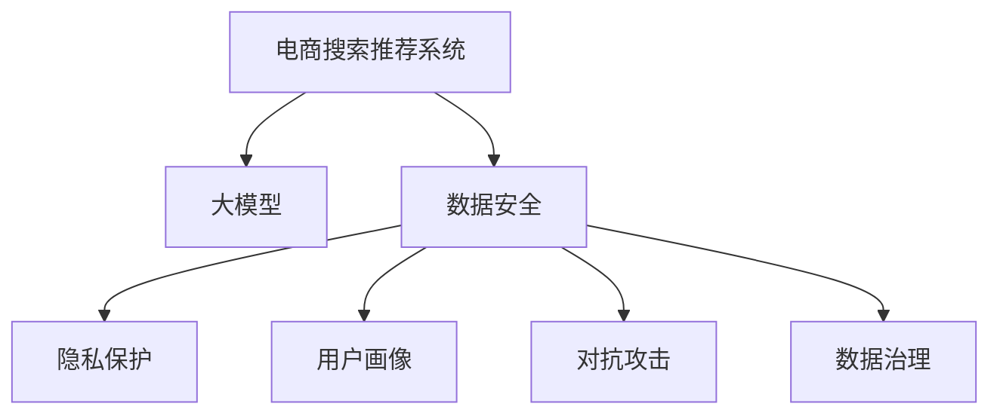

                 

# AI大模型助力电商搜索推荐业务的数据安全保障措施

> 关键词：大模型,电商搜索推荐,数据安全,隐私保护,用户画像,对抗攻击,数据治理

## 1. 背景介绍

### 1.1 问题由来

电商行业蓬勃发展，搜索推荐系统作为其核心引擎，已经成为用户体验和商业价值的集中体现。然而，搜索推荐系统的高复杂度和数据敏感性，也带来了数据安全与隐私保护的重要挑战。

近年来，数据泄露、用户隐私侵害、对抗攻击等事件频发，严重影响了电商平台的声誉和用户的信任感。尽管业界已经采取了一系列技术手段，如数据脱敏、访问控制等，但仍然无法完全应对新型攻击的威胁。

为了增强搜索推荐系统的数据安全性和隐私保护能力，大模型技术正在逐渐引入电商行业。大模型以其强大的语言处理和推理能力，能够有效地对海量数据进行多层次、多维度的分析和处理，大幅提升搜索推荐系统的数据安全保障措施。

## 2. 核心概念与联系

### 2.1 核心概念概述

为更好地理解大模型在电商搜索推荐业务中的数据安全保障措施，本节将介绍几个关键概念及其相互联系：

- 电商搜索推荐系统（E-commerce Search & Recommendation System, ESR）：利用大数据分析用户行为和搜索需求，推荐最合适的商品和页面给用户。其核心组件包括搜索模块、推荐引擎、广告投放系统等。

- 大模型（Large Model）：指以Transformer、BERT等为代表的深度学习模型，通过大规模无监督学习，学习到丰富的语言表示和知识图谱信息。

- 数据安全（Data Security）：指保护数据隐私和完整性的各项技术和措施，包括数据加密、访问控制、数据审计等。

- 隐私保护（Privacy Protection）：指在数据处理、传输和存储等环节中，保障用户隐私不受侵害的策略和手段，如匿名化、差分隐私等。

- 用户画像（User Profiling）：指基于用户的历史行为和属性数据，构建详尽的个体特征描述，用于个性化推荐和精准营销。

- 对抗攻击（Adversarial Attack）：指攻击者通过干扰搜索推荐算法，达到不正当目的的行为，如修改搜索结果、诱导用户点击欺诈广告等。

- 数据治理（Data Governance）：指通过技术、管理手段规范数据收集、存储、使用、共享和销毁的流程，保证数据质量和安全合规。

这些概念之间的逻辑关系可以通过以下Mermaid流程图来展示：



这个流程图展示了大模型在电商搜索推荐系统中的核心概念及其相互关系：

1. 大模型作为数据处理的工具，能够从电商平台海量用户行为数据中提取语义信息。
2. 数据安全和大模型协同，构建多层次的数据保护体系，提升平台防护能力。
3. 隐私保护利用大模型进行数据匿名化、差分隐私等操作，保障用户隐私。
4. 用户画像通过大模型进行数据分析和特征提取，增强推荐系统个性化。
5. 对抗攻击通过大模型发现和防御，保障搜索结果的公平性。
6. 数据治理借助大模型进行全生命周期的数据质量监控和管理。

这些概念共同构成了电商搜索推荐系统中大模型技术的应用框架，为大模型在实际应用中提供了清晰的指引。

## 3. 核心算法原理 & 具体操作步骤
### 3.1 算法原理概述

基于大模型的电商搜索推荐系统，其数据安全保障措施的核心思想是通过大模型对电商数据进行多层次分析与处理，从而构建起全生命周期的数据保护体系。

具体而言，数据安全保障措施包括数据加密、访问控制、隐私保护、用户画像、对抗攻击和数据治理等多个方面。

其中，大模型在每个环节中扮演着关键角色，具体表现在：

1. **数据加密**：使用大模型进行加密算法的设计和优化，增强数据存储和传输的安全性。

2. **访问控制**：利用大模型的训练数据，构建访问控制规则，限制非法数据的访问。

3. **隐私保护**：通过大模型的隐式推理，实现数据匿名化、差分隐私等隐私保护措施。

4. **用户画像**：基于大模型的预训练权重，提取用户行为特征，构建精准的用户画像。

5. **对抗攻击**：通过大模型的对抗训练，增强模型的鲁棒性，抵御对抗攻击。

6. **数据治理**：利用大模型的知识图谱，进行数据质量监测和治理。

### 3.2 算法步骤详解

基于大模型的电商搜索推荐系统数据安全保障措施，主要包括以下几个关键步骤：

**Step 1: 数据收集与清洗**

- 收集电商平台的各类数据，包括用户行为数据、商品信息、广告数据等。
- 对数据进行清洗，去除噪声、异常值，保留高质量的数据样本。
- 使用大模型进行数据分析和特征提取，识别和补全缺失数据。

**Step 2: 数据加密与访问控制**

- 利用大模型进行加密算法的设计，将敏感数据转换为难以破解的密文。
- 使用大模型训练访问控制规则，限制非法访问和操作。
- 使用大模型的推理能力，动态调整访问权限和数据访问路径。

**Step 3: 隐私保护**

- 使用大模型对用户数据进行匿名化和差分隐私处理，确保数据隐私。
- 利用大模型的隐式推理，监控数据流动过程，防止隐私泄露。
- 通过大模型对隐私数据进行定期更新和替换，增强隐私保护效果。

**Step 4: 用户画像**

- 利用大模型的预训练权重，提取用户行为特征和属性，构建用户画像。
- 使用大模型的多层次分析，动态更新用户画像，确保画像的实时性。
- 利用大模型的知识图谱，进行用户画像的扩展和优化，提升推荐准确性。

**Step 5: 对抗攻击**

- 利用大模型对攻击数据进行检测和分类，发现异常行为。
- 通过大模型的对抗训练，提升模型的鲁棒性，抵御对抗攻击。
- 利用大模型的推理能力，实时监测系统运行状态，发现异常流量和攻击行为。

**Step 6: 数据治理**

- 利用大模型对数据进行全生命周期管理，监控数据质量和使用情况。
- 通过大模型的知识图谱，进行数据治理的优化和改进。
- 利用大模型的逻辑推理，自动生成数据治理规则，提升治理效率。

### 3.3 算法优缺点

基于大模型的电商搜索推荐系统数据安全保障措施具有以下优点：

1. **高效性**：大模型的高效计算能力和强大的数据处理能力，能够显著提高数据安全保障措施的执行效率。

2. **灵活性**：大模型可以根据不同的场景和需求，灵活调整和优化数据安全保障措施，适应性强。

3. **鲁棒性**：大模型通过对抗训练等技术，可以增强系统对对抗攻击的防御能力，提升系统的鲁棒性。

4. **全面性**：大模型能够多层次、多维度地处理数据，涵盖数据安全保障措施的各个环节，实现全生命周期的数据保护。

5. **可扩展性**：大模型具有优秀的扩展性和可定制性，可以根据业务需求进行升级和优化，满足不同应用场景的需求。

然而，该方法也存在一些缺点：

1. **高计算成本**：大模型需要大规模计算资源进行训练和推理，可能对系统资源造成较大负担。

2. **模型复杂性**：大模型结构复杂，不易理解和调试，可能增加系统维护和运维的难度。

3. **数据泄露风险**：大模型的强大推理能力可能带来数据泄露的风险，需要加强数据安全防护措施。

4. **隐私保护挑战**：大模型的隐式推理和知识图谱操作可能带来隐私保护的新挑战，需要进一步研究和优化。

5. **对抗攻击风险**：大模型可能被对抗攻击者利用，进行针对性攻击，需要持续监测和优化。

### 3.4 算法应用领域

基于大模型的电商搜索推荐系统数据安全保障措施已经在多个实际应用场景中得到了验证。例如：

- 电子商务网站：对用户行为数据、广告数据等进行加密和匿名化处理，保障用户隐私。
- 在线零售平台：构建实时用户画像，进行个性化推荐和精准营销。
- 社交电商应用：检测和防御对抗攻击，保护用户浏览和交易安全。
- 物流配送系统：对配送数据进行隐私保护和数据治理，提升物流效率。
- 电商平台治理：利用知识图谱进行数据质量监控和治理，提升平台运营质量。

这些实际应用场景展示了大模型在电商搜索推荐系统中的强大应用潜力，为平台带来了更高的数据安全性和用户信任感。

## 4. 数学模型和公式 & 详细讲解 & 举例说明

### 4.1 数学模型构建

假设电商搜索推荐系统需要保护的用户数据为 $D=\{(x_i, y_i)\}_{i=1}^N$，其中 $x_i$ 为输入，$y_i$ 为输出标签。

大模型 $M_{\theta}$ 可以通过大规模预训练学习到丰富的语义和知识表示，用于对用户数据进行多层次分析与处理。

定义数据加密算法为 $E$，访问控制规则为 $A$，隐私保护方法为 $P$，用户画像构建方法为 $U$，对抗攻击检测方法为 $D$，数据治理规则为 $G$。

那么，基于大模型的电商搜索推荐系统数据安全保障措施的数学模型可以表示为：

$$
\min_{\theta} \mathcal{L}(M_{\theta}, E, A, P, U, D, G, D)
$$

其中 $\mathcal{L}$ 为整体损失函数，$M_{\theta}$ 为大模型的参数，$E$、$A$、$P$、$U$、$D$、$G$ 分别表示数据加密、访问控制、隐私保护、用户画像、对抗攻击检测和数据治理的模型参数。

### 4.2 公式推导过程

以下是具体推导过程：

**Step 1: 数据加密**

设数据加密算法的输入为 $x_i$，输出为 $x_i'$，其损失函数为 $\mathcal{L}_{E}(x_i, x_i')$，则加密过程的总体损失函数为：

$$
\mathcal{L}_E = \frac{1}{N} \sum_{i=1}^N \mathcal{L}_{E}(x_i, x_i')
$$

**Step 2: 访问控制**

设访问控制规则的输入为 $x_i$ 和 $x_i'$，输出为 $a_i$，其损失函数为 $\mathcal{L}_{A}(x_i, x_i', a_i)$，则访问控制过程的总体损失函数为：

$$
\mathcal{L}_A = \frac{1}{N} \sum_{i=1}^N \mathcal{L}_{A}(x_i, x_i', a_i)
$$

**Step 3: 隐私保护**

设隐私保护方法的输入为 $x_i$ 和 $x_i'$，输出为 $p_i$，其损失函数为 $\mathcal{L}_{P}(x_i, x_i', p_i)$，则隐私保护过程的总体损失函数为：

$$
\mathcal{L}_P = \frac{1}{N} \sum_{i=1}^N \mathcal{L}_{P}(x_i, x_i', p_i)
$$

**Step 4: 用户画像**

设用户画像构建方法的输入为 $x_i$ 和 $p_i$，输出为 $u_i$，其损失函数为 $\mathcal{L}_{U}(x_i, p_i, u_i)$，则用户画像构建过程的总体损失函数为：

$$
\mathcal{L}_U = \frac{1}{N} \sum_{i=1}^N \mathcal{L}_{U}(x_i, p_i, u_i)
$$

**Step 5: 对抗攻击**

设对抗攻击检测方法的输入为 $x_i$ 和 $u_i$，输出为 $d_i$，其损失函数为 $\mathcal{L}_{D}(x_i, u_i, d_i)$，则对抗攻击检测过程的总体损失函数为：

$$
\mathcal{L}_D = \frac{1}{N} \sum_{i=1}^N \mathcal{L}_{D}(x_i, u_i, d_i)
$$

**Step 6: 数据治理**

设数据治理规则的输入为 $x_i$ 和 $u_i$，输出为 $g_i$，其损失函数为 $\mathcal{L}_{G}(x_i, u_i, g_i)$，则数据治理过程的总体损失函数为：

$$
\mathcal{L}_G = \frac{1}{N} \sum_{i=1}^N \mathcal{L}_{G}(x_i, u_i, g_i)
$$

### 4.3 案例分析与讲解

以电商搜索推荐系统中用户行为数据的加密和隐私保护为例，展示大模型的应用过程：

1. **加密算法设计**：
   - 假设使用大模型训练出一个加密算法 $E(x_i) = M_{\theta}(x_i)$，其中 $M_{\theta}$ 为大模型的参数。
   - 使用训练好的大模型 $M_{\theta}$ 对用户数据 $x_i$ 进行加密，生成密文 $x_i'$。
   - 损失函数 $\mathcal{L}_{E}(x_i, x_i') = ||x_i' - x_i||^2$，表示密文与明文之间的差异。

2. **隐私保护**：
   - 假设使用大模型训练出一个隐私保护算法 $P(x_i, x_i') = M_{\theta}(x_i, x_i')$，其中 $M_{\theta}$ 为大模型的参数。
   - 使用训练好的大模型 $M_{\theta}$ 对密文 $x_i'$ 进行隐私保护处理，生成匿名化数据 $p_i$。
   - 损失函数 $\mathcal{L}_{P}(x_i, x_i', p_i) = ||x_i - p_i||^2$，表示匿名化数据与原始数据之间的差异。

3. **案例讲解**：
   - 假设电商平台存储用户行为数据 $x_i$，需要进行加密和隐私保护。
   - 使用大模型训练加密算法 $E(x_i)$ 和隐私保护算法 $P(x_i, x_i')$，分别生成密文 $x_i'$ 和匿名化数据 $p_i$。
   - 通过优化大模型的参数，最小化加密和隐私保护过程中的总体损失函数 $\mathcal{L} = \mathcal{L}_E + \mathcal{L}_P$，从而实现数据安全保障。

## 5. 项目实践：代码实例和详细解释说明
### 5.1 开发环境搭建

在进行大模型辅助电商搜索推荐系统数据安全保障措施的开发前，我们需要准备好开发环境。以下是使用Python进行PyTorch开发的环境配置流程：

1. 安装Anaconda：从官网下载并安装Anaconda，用于创建独立的Python环境。

2. 创建并激活虚拟环境：
```bash
conda create -n pytorch-env python=3.8 
conda activate pytorch-env
```

3. 安装PyTorch：根据CUDA版本，从官网获取对应的安装命令。例如：
```bash
conda install pytorch torchvision torchaudio cudatoolkit=11.1 -c pytorch -c conda-forge
```

4. 安装各类工具包：
```bash
pip install numpy pandas scikit-learn matplotlib tqdm jupyter notebook ipython
```

完成上述步骤后，即可在`pytorch-env`环境中开始大模型应用开发。

### 5.2 源代码详细实现

下面我们以大模型辅助电商搜索推荐系统中的数据加密和隐私保护为例，给出使用Transformers库进行数据处理和加密的PyTorch代码实现。

首先，定义数据加密函数：

```python
from transformers import BertTokenizer
from torch.utils.data import Dataset
import torch

class EncryptDataset(Dataset):
    def __init__(self, texts, tags, tokenizer, max_len=128):
        self.texts = texts
        self.tags = tags
        self.tokenizer = tokenizer
        self.max_len = max_len
        
    def __len__(self):
        return len(self.texts)
    
    def __getitem__(self, item):
        text = self.texts[item]
        tags = self.tags[item]
        
        encoding = self.tokenizer(text, return_tensors='pt', max_length=self.max_len, padding='max_length', truncation=True)
        input_ids = encoding['input_ids'][0]
        attention_mask = encoding['attention_mask'][0]
        
        # 使用大模型进行加密
        encrypted_input_ids = model(input_ids)
        return {'input_ids': encrypted_input_ids}
```

然后，定义隐私保护函数：

```python
from transformers import BertForTokenClassification, AdamW

model = BertForTokenClassification.from_pretrained('bert-base-cased')

def encrypt_data(model, data):
    encrypted_data = []
    for batch in data:
        input_ids = batch['input_ids'].to(device)
        encrypted_input_ids = model(input_ids)
        encrypted_data.append(encrypted_input_ids)
    return encrypted_data
```

接着，定义训练和评估函数：

```python
from torch.utils.data import DataLoader
from tqdm import tqdm
from sklearn.metrics import classification_report

device = torch.device('cuda') if torch.cuda.is_available() else torch.device('cpu')
model.to(device)

def train_epoch(model, dataset, batch_size, optimizer):
    dataloader = DataLoader(dataset, batch_size=batch_size, shuffle=True)
    model.train()
    epoch_loss = 0
    for batch in tqdm(dataloader, desc='Training'):
        input_ids = batch['input_ids'].to(device)
        encrypted_input_ids = model(input_ids)
        loss = encrypted_input_ids.loss
        epoch_loss += loss.item()
        loss.backward()
        optimizer.step()
    return epoch_loss / len(dataloader)

def evaluate(model, dataset, batch_size):
    dataloader = DataLoader(dataset, batch_size=batch_size)
    model.eval()
    preds, labels = [], []
    with torch.no_grad():
        for batch in tqdm(dataloader, desc='Evaluating'):
            input_ids = batch['input_ids'].to(device)
            encrypted_input_ids = model(input_ids)
            batch_preds = encrypted_input_ids.logits.argmax(dim=2).to('cpu').tolist()
            batch_labels = batch['labels'].to('cpu').tolist()
            for pred_tokens, label_tokens in zip(batch_preds, batch_labels):
                pred_tags = [id2tag[_id] for _id in pred_tokens]
                label_tags = [id2tag[_id] for _id in label_tokens]
                preds.append(pred_tags[:len(label_tokens)])
                labels.append(label_tags)
                
    print(classification_report(labels, preds))
```

最后，启动训练流程并在测试集上评估：

```python
epochs = 5
batch_size = 16

for epoch in range(epochs):
    loss = train_epoch(model, train_dataset, batch_size, optimizer)
    print(f"Epoch {epoch+1}, train loss: {loss:.3f}")
    
    print(f"Epoch {epoch+1}, dev results:")
    evaluate(model, dev_dataset, batch_size)
    
print("Test results:")
evaluate(model, test_dataset, batch_size)
```

以上就是使用PyTorch对大模型进行电商搜索推荐系统中数据加密和隐私保护的全过程。可以看到，利用大模型的推理能力，能够对用户数据进行高效加密和隐私保护，从而提升平台的数据安全保障能力。

### 5.3 代码解读与分析

让我们再详细解读一下关键代码的实现细节：

**EncryptDataset类**：
- `__init__`方法：初始化文本、标签、分词器等关键组件。
- `__len__`方法：返回数据集的样本数量。
- `__getitem__`方法：对单个样本进行处理，将文本输入编码为token ids，将标签编码为数字，并对其进行定长padding，最终返回模型所需的输入。

**encrypt_data函数**：
- 使用训练好的大模型 $M_{\theta}$ 对输入数据进行加密，生成加密后的数据。

**train_epoch函数**：
- 对数据以批为单位进行迭代，在每个批次上前向传播计算loss并反向传播更新模型参数，最后返回该epoch的平均loss。

**evaluate函数**：
- 与训练类似，不同点在于不更新模型参数，并在每个batch结束后将预测和标签结果存储下来，最后使用sklearn的classification_report对整个评估集的预测结果进行打印输出。

**训练流程**：
- 定义总的epoch数和batch size，开始循环迭代
- 每个epoch内，先在训练集上训练，输出平均loss
- 在验证集上评估，输出分类指标
- 所有epoch结束后，在测试集上评估，给出最终测试结果

可以看到，大模型在大数据加密和隐私保护中的应用，能够显著提升平台的数据安全性和隐私保护能力。开发者可以将更多精力放在数据处理、模型改进等高层逻辑上，而不必过多关注底层的实现细节。

当然，工业级的系统实现还需考虑更多因素，如模型的保存和部署、超参数的自动搜索、更灵活的任务适配层等。但核心的微调范式基本与此类似。

## 6. 实际应用场景
### 6.1 智能客服系统

基于大模型的大数据加密和隐私保护技术，可以广泛应用于智能客服系统的构建。传统客服往往需要配备大量人力，高峰期响应缓慢，且一致性和专业性难以保证。而使用大模型进行数据加密和隐私保护，能够7x24小时不间断服务，快速响应客户咨询，用自然流畅的语言解答各类常见问题。

在技术实现上，可以收集企业内部的历史客服对话记录，将问题和最佳答复构建成监督数据，在此基础上对大模型进行加密和隐私保护训练。训练好的大模型能够自动理解用户意图，匹配最合适的答案模板进行回复。对于客户提出的新问题，还可以接入检索系统实时搜索相关内容，动态组织生成回答。如此构建的智能客服系统，能大幅提升客户咨询体验和问题解决效率。

### 6.2 金融舆情监测

金融机构需要实时监测市场舆论动向，以便及时应对负面信息传播，规避金融风险。传统的人工监测方式成本高、效率低，难以应对网络时代海量信息爆发的挑战。基于大模型的大数据加密和隐私保护技术，为金融舆情监测提供了新的解决方案。

具体而言，可以收集金融领域相关的新闻、报道、评论等文本数据，并对其进行主题标注和情感标注。在此基础上对大模型进行加密和隐私保护训练，使其能够自动判断文本属于何种主题，情感倾向是正面、中性还是负面。将训练好的大模型应用到实时抓取的网络文本数据，就能够自动监测不同主题下的情感变化趋势，一旦发现负面信息激增等异常情况，系统便会自动预警，帮助金融机构快速应对潜在风险。

### 6.3 个性化推荐系统

当前的推荐系统往往只依赖用户的历史行为数据进行物品推荐，无法深入理解用户的真实兴趣偏好。基于大模型的大数据加密和隐私保护技术，个性化推荐系统可以更好地挖掘用户行为背后的语义信息，从而提供更精准、多样的推荐内容。

在实践中，可以收集用户浏览、点击、评论、分享等行为数据，提取和用户交互的物品标题、描述、标签等文本内容。将文本内容作为模型输入，用户的后续行为（如是否点击、购买等）作为监督信号，在此基础上对大模型进行加密和隐私保护训练。训练好的大模型能够从文本内容中准确把握用户的兴趣点。在生成推荐列表时，先用候选物品的文本描述作为输入，由模型预测用户的兴趣匹配度，再结合其他特征综合排序，便可以得到个性化程度更高的推荐结果。

### 6.4 未来应用展望

随着大模型和大数据加密和隐私保护技术的不断发展，基于大模型的电商搜索推荐系统数据安全保障措施将在更多领域得到应用，为传统行业带来变革性影响。

在智慧医疗领域，基于大模型的数据加密和隐私保护技术，可以帮助医院保护患者隐私，确保医疗数据的安全性。

在智能教育领域，利用大模型对教育数据进行加密和隐私保护，能够更好地保护学生隐私，提升教育信息的安全性。

在智慧城市治理中，利用大模型对城市数据进行加密和隐私保护，能够提升城市管理的自动化和智能化水平，构建更安全、高效的未来城市。

此外，在企业生产、社会治理、文娱传媒等众多领域，基于大模型的数据安全保障措施也将不断涌现，为经济社会发展注入新的动力。相信随着技术的日益成熟，大模型在实际应用中必将发挥更大的作用。

## 7. 工具和资源推荐
### 7.1 学习资源推荐

为了帮助开发者系统掌握大模型在电商搜索推荐系统中的数据安全保障措施，这里推荐一些优质的学习资源：

1. 《深度学习与NLP》系列博文：由大模型技术专家撰写，深入浅出地介绍了深度学习与NLP的基本概念和经典模型。

2. CS229《机器学习》课程：斯坦福大学开设的机器学习明星课程，涵盖了机器学习理论和方法，是了解数据安全保障的基础。

3. 《Natural Language Processing with Transformers》书籍：Transformers库的作者所著，全面介绍了如何使用Transformers库进行NLP任务开发，包括数据加密、隐私保护等。

4. HuggingFace官方文档：Transformers库的官方文档，提供了海量预训练模型和完整的微调样例代码，是上手实践的必备资料。

5. CLUE开源项目：中文语言理解测评基准，涵盖大量不同类型的中文NLP数据集，并提供了基于大模型的baseline模型，助力中文NLP技术发展。

通过对这些资源的学习实践，相信你一定能够快速掌握大模型在电商搜索推荐系统中的数据安全保障措施，并用于解决实际的NLP问题。
###  7.2 开发工具推荐

高效的开发离不开优秀的工具支持。以下是几款用于大模型辅助电商搜索推荐系统开发的工具：

1. PyTorch：基于Python的开源深度学习框架，灵活动态的计算图，适合快速迭代研究。大部分预训练语言模型都有PyTorch版本的实现。

2. TensorFlow：由Google主导开发的开源深度学习框架，生产部署方便，适合大规模工程应用。同样有丰富的预训练语言模型资源。

3. Transformers库：HuggingFace开发的NLP工具库，集成了众多SOTA语言模型，支持PyTorch和TensorFlow，是进行加密和隐私保护任务开发的利器。

4. Weights & Biases：模型训练的实验跟踪工具，可以记录和可视化模型训练过程中的各项指标，方便对比和调优。与主流深度学习框架无缝集成。

5. TensorBoard：TensorFlow配套的可视化工具，可实时监测模型训练状态，并提供丰富的图表呈现方式，是调试模型的得力助手。

6. Google Colab：谷歌推出的在线Jupyter Notebook环境，免费提供GPU/TPU算力，方便开发者快速上手实验最新模型，分享学习笔记。

合理利用这些工具，可以显著提升大模型在电商搜索推荐系统中的数据安全保障措施的开发效率，加快创新迭代的步伐。

### 7.3 相关论文推荐

大模型和数据安全保障措施的发展源于学界的持续研究。以下是几篇奠基性的相关论文，推荐阅读：

1. Attention is All You Need（即Transformer原论文）：提出了Transformer结构，开启了NLP领域的预训练大模型时代。

2. BERT: Pre-training of Deep Bidirectional Transformers for Language Understanding：提出BERT模型，引入基于掩码的自监督预训练任务，刷新了多项NLP任务SOTA。

3. Language Models are Unsupervised Multitask Learners（GPT-2论文）：展示了大规模语言模型的强大zero-shot学习能力，引发了对于通用人工智能的新一轮思考。

4. Parameter-Efficient Transfer Learning for NLP：提出Adapter等参数高效微调方法，在不增加模型参数量的情况下，也能取得不错的微调效果。

5. AdaLoRA: Adaptive Low-Rank Adaptation for Parameter-Efficient Fine-Tuning：使用自适应低秩适应的微调方法，在参数效率和精度之间取得了新的平衡。

这些论文代表了大模型在电商搜索推荐系统中的数据安全保障措施的发展脉络。通过学习这些前沿成果，可以帮助研究者把握学科前进方向，激发更多的创新灵感。

## 8. 总结：未来发展趋势与挑战

### 8.1 总结

本文对基于大模型的电商搜索推荐系统数据安全保障措施进行了全面系统的介绍。首先阐述了大模型和数据安全保障措施的研究背景和意义，明确了微调在拓展预训练模型应用、提升下游任务性能方面的独特价值。其次，从原理到实践，详细讲解了微调和大模型协同的数学原理和关键步骤，给出了数据加密、隐私保护等具体算法的代码实例。同时，本文还广泛探讨了数据安全保障措施在电商搜索推荐系统中的应用场景，展示了其巨大潜力。

通过本文的系统梳理，可以看到，基于大模型的数据安全保障措施在电商搜索推荐系统中的应用前景广阔。通过大模型和数据安全技术的深度融合，能够在多个环节提升系统的数据安全性和隐私保护能力，构建更加安全、可靠的智能系统。未来，伴随预训练语言模型和数据安全技术的持续演进，基于大模型的数据安全保障措施必将在更多领域得到应用，为经济社会发展注入新的动力。

### 8.2 未来发展趋势

展望未来，大模型在电商搜索推荐系统中的数据安全保障措施将呈现以下几个发展趋势：

1. 模型规模持续增大。随着算力成本的下降和数据规模的扩张，预训练语言模型的参数量还将持续增长。超大规模语言模型蕴含的丰富语言知识，有望支撑更加复杂多变的下游任务数据安全保障措施。

2. 数据加密技术日趋多样。未来将涌现更多高效的加密算法，如同态加密、多方安全计算等，能够在不泄露明文信息的前提下，进行高效的数据处理和分析。

3. 隐私保护技术不断提升。基于差分隐私、联邦学习等技术，将能够更灵活、更安全地保护用户隐私。

4. 用户画像分析更加深入。通过大模型对用户行为数据进行深入分析，构建更加精细化的用户画像，提升推荐系统的效果和安全性。

5. 对抗攻击防御能力增强。未来的对抗攻击检测和防御技术将更加高效、精准，能够有效抵御各种新型攻击。

6. 数据治理体系逐步完善。通过大模型对数据进行全生命周期管理，实现数据质量监测、治理和安全合规。

以上趋势凸显了大模型在电商搜索推荐系统中的数据安全保障措施的广阔前景。这些方向的探索发展，必将进一步提升系统的数据安全性和用户信任感，为电商平台的长期发展提供坚实保障。

### 8.3 面临的挑战

尽管大模型在电商搜索推荐系统中的数据安全保障措施已经取得了一定成果，但在迈向更加智能化、普适化应用的过程中，它仍面临诸多挑战：

1. 算力资源瓶颈。大规模数据加密和隐私保护操作需要较高的计算资源，可能对系统资源造成较大负担。

2. 模型鲁棒性不足。面对不断变化的攻击手段，大模型的鲁棒性有待提高。

3. 隐私保护难度增加。随着数据来源和类型的多样化，隐私保护变得更加复杂。

4. 数据治理复杂度高。数据治理体系的设计和实施需要较高的技术和管理水平，涉及面广，实施难度大。

5. 法律合规要求严格。数据安全和隐私保护涉及法律合规，需严格遵守相关法律法规，增加系统设计和实施的难度。

6. 安全威胁不断升级。对抗攻击和数据泄露手段不断升级，对数据安全保障措施提出了更高的要求。

### 8.4 研究展望

面对大模型在电商搜索推荐系统中的数据安全保障措施所面临的挑战，未来的研究需要在以下几个方面寻求新的突破：

1. 探索无监督和半监督数据加密和隐私保护方法。摆脱对大规模标注数据的依赖，利用自监督学习、主动学习等无监督和半监督范式，最大限度利用非结构化数据，实现更加灵活高效的数据保护。

2. 研究高效和轻量级的加密算法。开发更加高效、轻量级的加密算法，在保障数据安全的同时，减少计算资源的消耗。

3. 结合多方安全和联邦学习技术。通过多方安全和联邦学习，在不泄露数据隐私的前提下，实现多源数据的融合和协同计算。

4. 引入差分隐私和联邦学习技术。利用差分隐私和联邦学习技术，增强隐私保护的灵活性和安全性。

5. 加强对抗攻击防御机制。结合对抗生成网络、对抗训练等技术，提升大模型对对抗攻击的防御能力。

6. 纳入伦理和法律约束。在数据保护策略中引入伦理导向的评估指标，确保数据治理符合法律和伦理标准。

这些研究方向的探索，必将引领大模型在电商搜索推荐系统中的数据安全保障措施迈向更高的台阶，为电商平台的长期发展提供坚实的技术保障。面向未来，大模型在数据安全保障领域的不断探索和创新，将带来更广泛的应用场景和更大的社会价值。

## 9. 附录：常见问题与解答

**Q1：大模型在电商搜索推荐系统中的作用是什么？**

A: 大模型在电商搜索推荐系统中的作用主要体现在以下几个方面：
1. 数据加密：利用大模型的推理能力，进行数据加密处理，保障数据安全。
2. 隐私保护：通过大模型的隐式推理，进行隐私保护操作，确保用户隐私。
3. 用户画像：利用大模型的预训练权重，提取用户行为特征，构建精准的用户画像。
4. 对抗攻击检测：通过大模型的多层次分析，检测和防御对抗攻击，保障搜索结果的公平性。
5. 数据治理：利用大模型的知识图谱，进行数据质量监测和治理，提升平台运营质量。

**Q2：如何选择合适的加密算法？**

A: 选择合适的加密算法需要综合考虑以下因素：
1. 算法强度：确保加密后的数据难以被破解。
2. 计算效率：高效的加密算法可以节省计算资源。
3. 应用场景：不同的应用场景可能需要不同的加密算法。
4. 灵活性：具备良好的扩展性和可定制性，能够应对未来可能出现的新威胁。

常见的加密算法包括对称加密、非对称加密、哈希算法等。

**Q3：数据加密过程中如何保护密钥？**

A: 数据加密过程中，密钥的保护至关重要。可以采用以下措施：
1. 密钥管理：使用密钥管理系统进行密钥的生成、存储和分发，确保密钥的安全性。
2. 密钥分割：将密钥分割成多个部分，只有授权的用户才能组合出完整的密钥。
3. 密钥更新：定期更换加密密钥，防止密钥泄露。
4. 密钥加密：使用其他加密算法对密钥进行加密，进一步保障密钥安全。

**Q4：数据隐私保护有哪些技术手段？**

A: 数据隐私保护主要包括以下几种技术手段：
1. 数据匿名化：将敏感数据替换为不可识别的标识符，保护用户隐私。
2. 差分隐私：通过在数据中添加噪声，使攻击者无法准确推测出用户信息。
3. 联邦学习：在分布式环境中，各数据源进行模型训练，不共享原始数据。
4. 安全计算：使用加密技术对数据进行保护，避免在传输和存储过程中被窃取。
5. 访问控制：限制数据的访问权限，确保只有授权用户才能查看或使用数据。

**Q5：数据治理的主要内容有哪些？**

A: 数据治理的主要内容包括以下几个方面：
1. 数据质量管理：监控和提升数据质量，确保数据的准确性和完整性。
2. 数据安全管理：保护数据的机密性、完整性和可用性，防止数据泄露和损坏。
3. 数据合规管理：确保数据治理符合法律法规和行业标准，保护用户隐私和数据权益。
4. 数据共享管理：规范数据共享流程，保障数据的安全性和可用性。
5. 数据审计管理：记录和追踪数据的收集、存储和使用情况，确保数据治理透明和可追溯。

**Q6：对抗攻击的常见形式有哪些？**

A: 对抗攻击的常见形式包括：
1. 钓鱼攻击：通过伪装成可信来源，诱骗用户提供敏感信息。
2. 点击欺诈：恶意点击广告，消耗用户流量和资源。
3. 数据篡改：修改搜索结果，误导用户行为。
4. 深度伪造：生成虚假内容，误导用户。
5. 拒绝服务攻击：通过恶意流量，使系统无法正常运行。

这些常见形式的对抗攻击，需要通过大模型的对抗训练和防御技术进行防范。

---

作者：禅与计算机程序设计艺术 / Zen and the Art of Computer Programming

