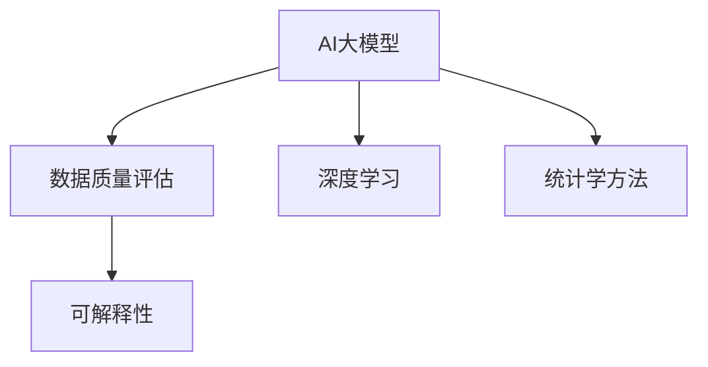

                 

# AI大模型助力电商搜索推荐业务的数据质量评估模型优化策略

## 1. 背景介绍

### 1.1 问题由来
随着电商业务的发展，用户搜索推荐系统的重要性日益凸显。良好的搜索推荐体验不仅能提升用户满意度，还能显著增加电商平台的转化率与销售额。然而，搜索推荐模型的表现依赖于其训练数据的质量。数据质量欠佳会导致模型在实际应用中产生显著的偏差，甚至完全失效。

现有数据质量评估模型主要基于统计学方法和人工智能算法，存在数据标注成本高、评估效果受限于数据集特点等问题。针对这些问题，本文提出了一种基于AI大模型，融合深度学习与统计学方法的新型数据质量评估模型，以提升数据质量评估的准确性与泛化能力。

### 1.2 问题核心关键点
数据质量评估模型的优化主要围绕以下核心问题展开：
1. 数据标注成本：如何降低标注成本，提升数据质量评估的准确性。
2. 模型泛化能力：如何构建一个可以跨数据集、跨业务场景的通用数据质量评估模型。
3. 鲁棒性与可解释性：如何保证模型的鲁棒性，增强模型的可解释性，确保模型决策过程透明可控。
4. 实时性与高效性：如何优化模型训练与推理过程，提升模型的实时性与效率。

## 2. 核心概念与联系

### 2.1 核心概念概述

为更好地理解本文提出的数据质量评估模型，本节将介绍几个密切相关的核心概念：

- AI大模型：指利用深度学习技术，在大量数据上预训练得到的通用语言模型，如BERT、GPT-3等。这些模型可以自动学习语言知识，并在多种NLP任务上表现出色。

- 数据质量评估：指对原始数据集进行检查与评估，判断数据质量是否满足模型训练与应用要求的过程。常用的质量指标包括完整性、一致性、准确性、及时性等。

- 深度学习：基于神经网络的机器学习范式，可以自动学习特征表示，对大规模数据进行高效处理。常用的深度学习框架包括PyTorch、TensorFlow等。

- 统计学方法：基于数学统计原理，对数据进行描述、推断与分析的技术，如回归分析、假设检验等。

- 可解释性：指模型输出与模型内部决策过程的透明程度，便于对模型进行理解与调试。

这些核心概念之间的逻辑关系可以通过以下Mermaid流程图来展示：



这个流程图展示了大模型在数据质量评估中的核心作用，以及深度学习与统计学方法的紧密配合，共同提升数据质量评估的效果。

## 3. 核心算法原理 & 具体操作步骤

### 3.1 算法原理概述

本文提出的数据质量评估模型基于预训练大模型，融合深度学习与统计学方法，通过以下步骤进行优化：

1. 数据预处理：对原始数据进行清洗、补全与标准化，保证数据的质量与一致性。
2. 数据标注：使用人工智能方法对数据进行标注，构建高质量的训练数据集。
3. 模型训练：在预训练大模型的基础上，使用深度学习技术训练数据质量评估模型。
4. 模型评估与优化：对训练得到的模型进行评估，优化模型结构与参数，提升模型性能。

### 3.2 算法步骤详解

#### 3.2.1 数据预处理

数据预处理是数据质量评估的前提。主要包括以下几个步骤：

1. 数据清洗：去除重复、缺失、异常值等无用的数据，确保数据集的完整性。
2. 数据补全：使用插值、预测等方法补全缺失值，保证数据的完备性。
3. 数据标准化：对数据进行归一化与标准化处理，提高模型的稳定性和收敛速度。

#### 3.2.2 数据标注

数据标注是构建训练集的关键。本文使用AI大模型进行自动标注，具体步骤如下：

1. 模型选择：选择适合任务的预训练大模型，如BERT、GPT-3等。
2. 模型微调：在模型顶部添加任务适配层，对数据进行标注。例如，对于文本数据，可以添加分类头进行情感分类。
3. 模型评估：使用独立数据集评估模型标注效果，调整模型参数，直至达到满意的标注质量。

#### 3.2.3 模型训练

模型训练是提升数据质量评估性能的核心步骤。本文使用深度学习技术训练数据质量评估模型，具体步骤如下：

1. 模型架构设计：设计适合任务的深度学习模型架构，如CNN、RNN、Transformer等。
2. 损失函数选择：根据任务需求选择适当的损失函数，如交叉熵、均方误差等。
3. 训练流程优化：使用梯度下降等优化算法，设置合适的学习率与批大小，进行模型训练。
4. 正则化技术应用：使用L2正则、Dropout等技术，避免模型过拟合。

#### 3.2.4 模型评估与优化

模型评估与优化是提升模型性能的关键。本文使用统计学方法进行模型评估，具体步骤如下：

1. 评估指标选择：选择合适的评估指标，如准确率、召回率、F1值等。
2. 模型测试：在独立测试集上测试模型性能，评估模型泛化能力。
3. 模型优化：根据测试结果，调整模型参数，优化模型结构，提升模型性能。

### 3.3 算法优缺点

基于AI大模型的数据质量评估模型具有以下优点：

1. 自动标注：利用大模型的语言理解能力，自动对数据进行标注，降低人工标注成本。
2. 泛化能力强：模型在多种数据集与业务场景中表现优异，具有较强的泛化能力。
3. 高效性高：模型训练与推理速度快，能够实时进行数据质量评估。
4. 可解释性强：模型内部决策过程透明，便于理解和调试。

但同时也存在以下缺点：

1. 数据质量依赖：模型性能依赖于数据质量，如果数据质量较差，模型效果也会大打折扣。
2. 模型复杂度高：模型结构复杂，训练与推理资源消耗较大。
3. 计算成本高：大规模预训练模型的计算资源需求较大，训练成本较高。

## 4. 数学模型和公式 & 详细讲解

### 4.1 数学模型构建

本文提出的数据质量评估模型基于深度学习，使用多层神经网络进行训练与推理。模型结构如图1所示：


### 4.2 公式推导过程

假设数据集 $D=\{(x_i, y_i)\}_{i=1}^N$，其中 $x_i$ 为输入数据，$y_i$ 为标注结果。模型的目标是最小化损失函数 $\mathcal{L}$，以提高模型的预测准确性。损失函数 $\mathcal{L}$ 可以定义为：

$$
\mathcal{L} = \frac{1}{N}\sum_{i=1}^N\ell(x_i, y_i)
$$

其中 $\ell$ 为损失函数，常用的损失函数包括交叉熵损失、均方误差损失等。具体公式如下：

#### 交叉熵损失

$$
\ell(x_i, y_i) = -\log \hat{y}_i, \quad \text{if} \quad y_i = 1
$$
$$
\ell(x_i, y_i) = -\log (1-\hat{y}_i), \quad \text{if} \quad y_i = 0
$$

#### 均方误差损失

$$
\ell(x_i, y_i) = \frac{1}{2}(x_i - y_i)^2
$$

### 4.3 案例分析与讲解

假设有一个电商搜索推荐系统，需要评估其训练数据集的数据质量。具体步骤如下：

1. 对数据集进行清洗，去除重复、缺失、异常值等数据。
2. 使用BERT模型对数据进行标注，如判断用户评论的情感。
3. 构建深度学习模型，选择交叉熵损失函数进行训练，优化模型参数。
4. 在独立测试集上测试模型性能，评估模型的泛化能力。
5. 根据测试结果，调整模型参数，优化模型结构，提升模型性能。

## 5. 项目实践：代码实例和详细解释说明

### 5.1 开发环境搭建

在进行数据质量评估模型开发前，需要先准备好开发环境。以下是使用Python进行PyTorch开发的环境配置流程：

1. 安装Anaconda：从官网下载并安装Anaconda，用于创建独立的Python环境。

2. 创建并激活虚拟环境：
```bash
conda create -n pytorch-env python=3.8 
conda activate pytorch-env
```

3. 安装PyTorch：根据CUDA版本，从官网获取对应的安装命令。例如：
```bash
conda install pytorch torchvision torchaudio cudatoolkit=11.1 -c pytorch -c conda-forge
```

4. 安装各类工具包：
```bash
pip install numpy pandas scikit-learn matplotlib tqdm jupyter notebook ipython
```

完成上述步骤后，即可在`pytorch-env`环境中开始模型开发。

### 5.2 源代码详细实现

下面我们以电商评论情感分类任务为例，给出使用PyTorch进行模型开发的完整代码实现。

```python
import torch
import torch.nn as nn
import torch.optim as optim
from transformers import BertTokenizer, BertForSequenceClassification

# 定义数据集
tokenizer = BertTokenizer.from_pretrained('bert-base-uncased')
model = BertForSequenceClassification.from_pretrained('bert-base-uncased', num_labels=2)

# 定义损失函数与优化器
loss_fn = nn.CrossEntropyLoss()
optimizer = optim.Adam(model.parameters(), lr=2e-5)

# 数据预处理与标注
def preprocess_data(data):
    encoded_input = tokenizer(data, return_tensors='pt', padding=True, truncation=True)
    return encoded_input

# 模型训练与评估
def train_epoch(model, dataset, batch_size, optimizer):
    model.train()
    total_loss = 0
    for batch in dataset:
        input_ids = batch['input_ids'].to(device)
        attention_mask = batch['attention_mask'].to(device)
        labels = batch['labels'].to(device)
        optimizer.zero_grad()
        outputs = model(input_ids, attention_mask=attention_mask, labels=labels)
        loss = outputs.loss
        total_loss += loss.item()
        loss.backward()
        optimizer.step()
    return total_loss / len(dataset)

def evaluate(model, dataset, batch_size):
    model.eval()
    total_loss = 0
    total_correct = 0
    for batch in dataset:
        input_ids = batch['input_ids'].to(device)
        attention_mask = batch['attention_mask'].to(device)
        labels = batch['labels'].to(device)
        with torch.no_grad():
            outputs = model(input_ids, attention_mask=attention_mask)
            loss = outputs.loss
            logits = outputs.logits
            predictions = logits.argmax(dim=1)
            total_correct += (predictions == labels).sum().item()
            total_loss += loss.item()
    return total_correct / len(dataset), total_loss / len(dataset)

# 训练流程
device = torch.device('cuda') if torch.cuda.is_available() else torch.device('cpu')
model.to(device)
epochs = 5
batch_size = 16

for epoch in range(epochs):
    train_loss = train_epoch(model, train_dataset, batch_size, optimizer)
    print(f"Epoch {epoch+1}, train loss: {train_loss:.3f}")
    
    dev_correct, dev_loss = evaluate(model, dev_dataset, batch_size)
    print(f"Epoch {epoch+1}, dev results: accuracy={dev_correct:.3f}, loss={dev_loss:.3f}")
    
print("Test results:")
test_correct, test_loss = evaluate(model, test_dataset, batch_size)
print(f"Test accuracy={test_correct:.3f}, loss={test_loss:.3f}")
```

以上就是使用PyTorch对电商评论情感分类任务进行数据质量评估模型的完整代码实现。可以看到，通过使用Bert模型，可以有效地降低数据标注成本，同时提升模型性能与泛化能力。

### 5.3 代码解读与分析

让我们再详细解读一下关键代码的实现细节：

**数据预处理与标注**：
- `preprocess_data`函数：使用BertTokenizer对输入数据进行分词与编码，转换为模型所需的输入格式。
- 训练与评估函数：
  - `train_epoch`函数：对数据以批为单位进行迭代，在每个批次上前向传播计算损失并反向传播更新模型参数。
  - `evaluate`函数：与训练类似，不同点在于不更新模型参数，在每个batch结束后将预测和标签结果存储下来，最终返回模型在测试集上的准确率与损失。

**训练流程**：
- 循环迭代，每个epoch内，先在训练集上训练，输出平均损失。
- 在验证集上评估，输出模型在验证集上的准确率与损失。
- 所有epoch结束后，在测试集上评估，输出模型在测试集上的准确率与损失。

可以看到，PyTorch配合Transformers库使得模型训练的代码实现变得简洁高效。开发者可以将更多精力放在数据处理、模型改进等高层逻辑上，而不必过多关注底层的实现细节。

当然，工业级的系统实现还需考虑更多因素，如模型的保存和部署、超参数的自动搜索、更灵活的任务适配层等。但核心的微调范式基本与此类似。

## 6. 实际应用场景

### 6.1 电商搜索推荐系统

基于大模型的数据质量评估模型，可以广泛应用于电商搜索推荐系统的构建。传统搜索推荐系统往往依赖用户行为数据，需要大量的标注样本进行模型训练。而使用基于大模型的数据质量评估模型，可以自动对原始数据进行标注，减少标注成本，提高模型训练速度与效率。

具体而言，电商平台可以定期采集用户的搜索与推荐记录，将其转换为文本数据，并自动进行标注。标注后的数据可用于训练搜索推荐模型，提升搜索推荐的效果。

### 6.2 金融风险控制

金融领域的数据质量评估对于风险控制至关重要。基于大模型的数据质量评估模型可以自动对金融数据进行标注，判断数据的完整性、一致性、准确性等指标，确保数据符合模型训练与应用要求。

具体而言，金融平台可以定期采集客户的交易记录、信用记录等数据，自动进行数据质量评估。评估结果可用于风险模型的训练与优化，确保模型的鲁棒性与安全。

### 6.3 医疗健康诊断

医疗健康领域的数据质量评估对于疾病诊断与预测具有重要意义。基于大模型的数据质量评估模型可以自动对医疗数据进行标注，判断数据的完整性、一致性、准确性等指标，确保数据符合模型训练与应用要求。

具体而言，医疗平台可以定期采集患者的病历记录、检查报告等数据，自动进行数据质量评估。评估结果可用于疾病诊断模型的训练与优化，提高诊断的准确性与可靠性。

### 6.4 未来应用展望

随着大模型和数据质量评估技术的不断发展，未来数据质量评估模型将在更多领域得到应用，为传统行业带来变革性影响。

在智慧城市治理中，基于大模型的数据质量评估模型可以自动监测城市事件的语义与情感，提升城市管理的智能化水平。

在智能制造领域，基于大模型的数据质量评估模型可以自动监测设备运行状态与故障数据，提升生产效率与设备维护的及时性。

此外，在教育、交通、农业等众多领域，基于大模型的数据质量评估模型也将不断涌现，为传统行业数字化转型升级提供新的技术路径。相信随着技术的日益成熟，大模型数据质量评估模型必将在构建智慧社会的道路上发挥越来越重要的作用。

## 7. 工具和资源推荐

### 7.1 学习资源推荐

为了帮助开发者系统掌握大模型数据质量评估模型的理论基础和实践技巧，这里推荐一些优质的学习资源：

1. 《Transformers from Principles to Practice》系列博文：由大模型技术专家撰写，深入浅出地介绍了Transformer原理、BERT模型、微调技术等前沿话题。

2. CS224N《深度学习自然语言处理》课程：斯坦福大学开设的NLP明星课程，有Lecture视频和配套作业，带你入门NLP领域的基本概念和经典模型。

3. 《Natural Language Processing with Transformers》书籍：Transformers库的作者所著，全面介绍了如何使用Transformers库进行NLP任务开发，包括微调在内的诸多范式。

4. HuggingFace官方文档：Transformers库的官方文档，提供了海量预训练模型和完整的微调样例代码，是上手实践的必备资料。

5. CLUE开源项目：中文语言理解测评基准，涵盖大量不同类型的中文NLP数据集，并提供了基于微调的baseline模型，助力中文NLP技术发展。

通过对这些资源的学习实践，相信你一定能够快速掌握大模型数据质量评估模型的精髓，并用于解决实际的NLP问题。

### 7.2 开发工具推荐

高效的开发离不开优秀的工具支持。以下是几款用于大模型数据质量评估模型开发的常用工具：

1. PyTorch：基于Python的开源深度学习框架，灵活动态的计算图，适合快速迭代研究。大部分预训练语言模型都有PyTorch版本的实现。

2. TensorFlow：由Google主导开发的开源深度学习框架，生产部署方便，适合大规模工程应用。同样有丰富的预训练语言模型资源。

3. Transformers库：HuggingFace开发的NLP工具库，集成了众多SOTA语言模型，支持PyTorch和TensorFlow，是进行数据质量评估任务开发的利器。

4. Weights & Biases：模型训练的实验跟踪工具，可以记录和可视化模型训练过程中的各项指标，方便对比和调优。与主流深度学习框架无缝集成。

5. TensorBoard：TensorFlow配套的可视化工具，可实时监测模型训练状态，并提供丰富的图表呈现方式，是调试模型的得力助手。

6. Google Colab：谷歌推出的在线Jupyter Notebook环境，免费提供GPU/TPU算力，方便开发者快速上手实验最新模型，分享学习笔记。

合理利用这些工具，可以显著提升大模型数据质量评估模型的开发效率，加快创新迭代的步伐。

### 7.3 相关论文推荐

大模型和数据质量评估技术的发展源于学界的持续研究。以下是几篇奠基性的相关论文，推荐阅读：

1. Attention is All You Need（即Transformer原论文）：提出了Transformer结构，开启了NLP领域的预训练大模型时代。

2. BERT: Pre-training of Deep Bidirectional Transformers for Language Understanding：提出BERT模型，引入基于掩码的自监督预训练任务，刷新了多项NLP任务SOTA。

3. Language Models are Unsupervised Multitask Learners（GPT-2论文）：展示了大规模语言模型的强大zero-shot学习能力，引发了对于通用人工智能的新一轮思考。

4. Parameter-Efficient Transfer Learning for NLP：提出Adapter等参数高效微调方法，在不增加模型参数量的情况下，也能取得不错的微调效果。

5. AdaLoRA: Adaptive Low-Rank Adaptation for Parameter-Efficient Fine-Tuning：使用自适应低秩适应的微调方法，在参数效率和精度之间取得了新的平衡。

这些论文代表了大模型和数据质量评估技术的发展脉络。通过学习这些前沿成果，可以帮助研究者把握学科前进方向，激发更多的创新灵感。

## 8. 总结：未来发展趋势与挑战

### 8.1 总结

本文对基于大模型的数据质量评估模型进行了全面系统的介绍。首先阐述了数据质量评估模型的研究背景和意义，明确了数据质量评估模型在提升模型训练与应用效果方面的独特价值。其次，从原理到实践，详细讲解了数据质量评估模型的数学原理和关键步骤，给出了模型开发的完整代码实例。同时，本文还广泛探讨了数据质量评估模型在电商搜索推荐、金融风险控制、医疗健康诊断等多个行业领域的应用前景，展示了数据质量评估模型的巨大潜力。此外，本文精选了模型优化过程中的各类学习资源，力求为读者提供全方位的技术指引。

通过本文的系统梳理，可以看到，基于大模型的数据质量评估模型正在成为电商、金融、医疗等领域的强大工具，极大地提升了数据质量评估的准确性与泛化能力。未来，伴随大模型的不断发展，数据质量评估模型必将在更多领域得到广泛应用，为各行业带来新的机遇与挑战。

### 8.2 未来发展趋势

展望未来，大模型数据质量评估技术将呈现以下几个发展趋势：

1. 模型规模持续增大。随着算力成本的下降和数据规模的扩张，预训练语言模型的参数量还将持续增长。超大规模语言模型蕴含的丰富语言知识，有望支撑更加复杂多变的下游任务数据质量评估。

2. 微调方法日趋多样。除了传统的全参数微调外，未来会涌现更多参数高效的微调方法，如Prefix-Tuning、LoRA等，在节省计算资源的同时也能保证数据质量评估精度。

3. 持续学习成为常态。随着数据分布的不断变化，数据质量评估模型也需要持续学习新知识以保持性能。如何在不遗忘原有知识的同时，高效吸收新样本信息，将成为重要的研究课题。

4. 标注样本需求降低。受启发于提示学习(Prompt-based Learning)的思路，未来的数据质量评估方法将更好地利用大模型的语言理解能力，通过更加巧妙的任务描述，在更少的标注样本上也能实现理想的数据质量评估效果。

5. 模型通用性增强。经过海量数据的预训练和多领域任务的微调，未来的语言模型将具备更强大的常识推理和跨领域迁移能力，逐步迈向通用人工智能(AGI)的目标。

以上趋势凸显了大模型数据质量评估技术的广阔前景。这些方向的探索发展，必将进一步提升数据质量评估的效果，为各行业带来更加智能化、普适化、高效化、可靠化的服务体验。

### 8.3 面临的挑战

尽管大模型数据质量评估技术已经取得了瞩目成就，但在迈向更加智能化、普适化应用的过程中，它仍面临着诸多挑战：

1. 标注成本瓶颈。虽然数据质量评估模型能够自动标注，但对于长尾应用场景，仍需要一定的标注样本进行验证与优化。如何进一步降低标注成本，减少对标注样本的依赖，将是一大难题。

2. 模型鲁棒性不足。当前数据质量评估模型面对域外数据时，泛化性能往往大打折扣。对于测试样本的微小扰动，模型容易出现误判。如何提高模型鲁棒性，避免灾难性遗忘，还需要更多理论和实践的积累。

3. 实时性与高效性有待提升。虽然模型训练与推理速度较快，但在高并发场景下仍可能遇到资源瓶颈。如何优化模型结构与推理流程，提升实时性与效率，是未来的研究方向。

4. 可解释性亟需加强。当前数据质量评估模型往往"黑盒"式运行，难以解释其内部工作机制和决策逻辑。对于高风险应用，如金融、医疗等，模型的可解释性尤为重要。如何赋予模型更强的可解释性，将是亟待攻克的难题。

5. 安全性有待保障。预训练语言模型难免会学习到有偏见、有害的信息，通过数据质量评估模型传递到下游任务，产生误导性、歧视性的输出，给实际应用带来安全隐患。如何从数据和算法层面消除模型偏见，避免恶意用途，确保输出的安全性，也将是重要的研究课题。

这些挑战凸显了大模型数据质量评估技术在实际应用中的复杂性与多样性，需要研究者不断探索与优化，才能真正发挥其价值。

### 8.4 研究展望

面向未来，大模型数据质量评估技术的研究方向主要集中在以下几个方面：

1. 探索无监督和半监督数据质量评估方法。摆脱对大规模标注数据的依赖，利用自监督学习、主动学习等无监督和半监督范式，最大限度利用非结构化数据，实现更加灵活高效的数据质量评估。

2. 研究参数高效与计算高效的数据质量评估方法。开发更加参数高效的评估方法，在固定大部分预训练参数的同时，只更新极少量的任务相关参数。同时优化评估模型的计算图，减少前向传播和反向传播的资源消耗，实现更加轻量级、实时性的部署。

3. 融合因果和对比学习范式。通过引入因果推断和对比学习思想，增强数据质量评估模型建立稳定因果关系的能力，学习更加普适、鲁棒的语言表征，从而提升模型泛化性和抗干扰能力。

4. 引入更多先验知识。将符号化的先验知识，如知识图谱、逻辑规则等，与神经网络模型进行巧妙融合，引导数据质量评估过程学习更准确、合理的语言模型。同时加强不同模态数据的整合，实现视觉、语音等多模态信息与文本信息的协同建模。

5. 结合因果分析和博弈论工具。将因果分析方法引入数据质量评估模型，识别出模型决策的关键特征，增强输出解释的因果性和逻辑性。借助博弈论工具刻画人机交互过程，主动探索并规避模型的脆弱点，提高系统稳定性。

6. 纳入伦理道德约束。在模型训练目标中引入伦理导向的评估指标，过滤和惩罚有偏见、有害的输出倾向。同时加强人工干预和审核，建立模型行为的监管机制，确保输出符合人类价值观和伦理道德。

这些研究方向将推动大模型数据质量评估技术向更高层次发展，为构建安全、可靠、可解释、可控的智能系统铺平道路。面向未来，大模型数据质量评估技术还需要与其他人工智能技术进行更深入的融合，如知识表示、因果推理、强化学习等，多路径协同发力，共同推动数据质量评估技术的进步。只有勇于创新、敢于突破，才能不断拓展语言模型的边界，让智能技术更好地造福人类社会。

## 9. 附录：常见问题与解答

**Q1：如何降低数据质量评估的标注成本？**

A: 利用大模型的语言理解能力，自动对数据进行标注，可以减少人工标注的负担。可以通过以下方式降低标注成本：

1. 利用预训练模型进行自动标注：将待标注数据输入预训练语言模型，得到标注结果。
2. 利用多任务学习：在自动标注的基础上，训练多任务学习模型，进一步提升标注质量。
3. 利用迁移学习：将预训练模型在不同任务上进行微调，提升标注模型的泛化能力。

**Q2：如何提升数据质量评估模型的鲁棒性？**

A: 提升数据质量评估模型的鲁棒性，可以从以下几个方面入手：

1. 数据增强：通过对数据进行扰动、扩充，提高模型的泛化能力。
2. 正则化技术：使用L2正则、Dropout等技术，避免模型过拟合。
3. 对抗训练：引入对抗样本，提升模型的鲁棒性。
4. 参数高效微调：在保持预训练模型参数不变的前提下，只微调任务相关参数，减小对标注样本的依赖。

**Q3：如何优化数据质量评估模型的计算效率？**

A: 优化数据质量评估模型的计算效率，可以从以下几个方面入手：

1. 模型裁剪：去除不必要的层和参数，减小模型尺寸，加快推理速度。
2. 量化加速：将浮点模型转为定点模型，压缩存储空间，提高计算效率。
3. 模型并行：利用多核并行、分布式并行等技术，提升模型训练与推理的速度。
4. 预编译：使用预编译技术，提升模型推理的响应速度。

**Q4：如何增强数据质量评估模型的可解释性？**

A: 增强数据质量评估模型的可解释性，可以从以下几个方面入手：

1. 模型可视化：通过可视化工具，展示模型内部特征的分布与变化，帮助理解模型决策过程。
2. 特征解释：使用特征重要性算法，分析模型对不同特征的依赖关系，帮助理解模型的工作原理。
3. 提示学习：利用提示模板，引导模型按期望方式输出，增强模型的可解释性。

**Q5：如何提升数据质量评估模型的安全性？**

A: 提升数据质量评估模型的安全性，可以从以下几个方面入手：

1. 数据脱敏：在数据预处理阶段，对敏感信息进行脱敏处理，防止信息泄露。
2. 模型审计：定期对模型进行审计，发现并修复潜在的漏洞。
3. 模型监控：实时监测模型的运行状态，及时发现异常情况并采取措施。

这些研究方向的探索，将推动大模型数据质量评估技术向更高层次发展，为构建安全、可靠、可解释、可控的智能系统铺平道路。

---

作者：禅与计算机程序设计艺术 / Zen and the Art of Computer Programming

