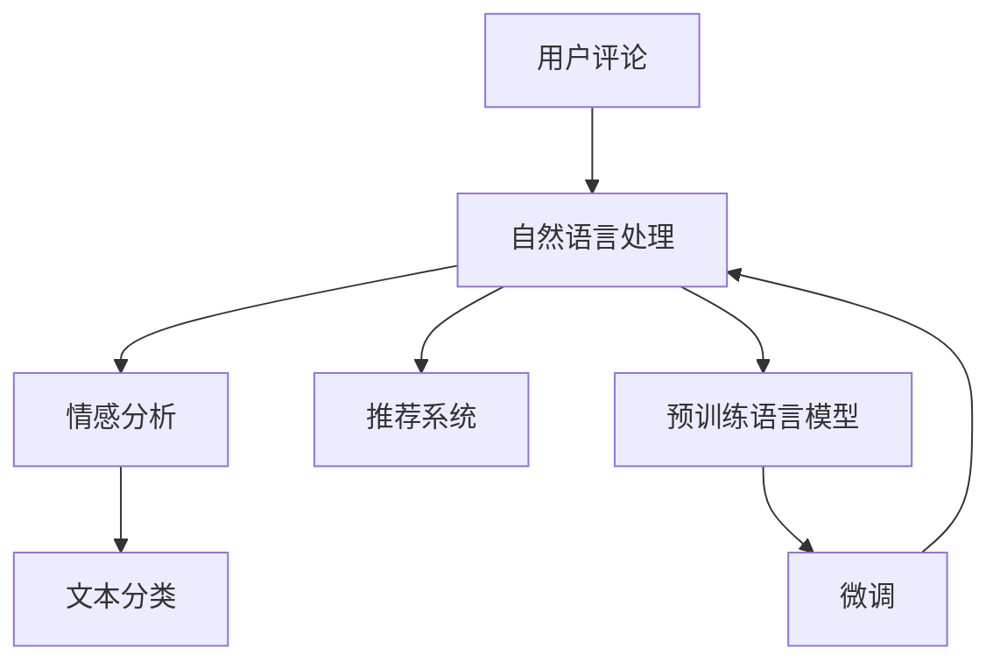

                 

# AI大模型在用户评论分析中的应用

> 关键词：用户评论分析, 大模型, 自然语言处理, 情感分析, 产品优化, 用户反馈, 文本分类, 推荐系统

## 1. 背景介绍

### 1.1 问题由来
在当今数字化时代，用户评论成为企业了解市场反馈、评估产品性能的重要来源。通过分析用户评论，企业可以发现产品短板、调整产品策略、优化用户体验。但传统的用户评论分析方法，通常依赖于人工标注、规则提取等，存在成本高、效率低、泛化能力差等缺陷。随着大语言模型和自然语言处理技术的迅猛发展，AI大模型在用户评论分析中的应用逐渐成为新的热点。

### 1.2 问题核心关键点
AI大模型在用户评论分析中主要解决以下几个问题：

1. **数据标注成本高**：传统方法需要大量人工标注，而大模型能够通过微调或自监督学习，以更低的成本获得高质量的评论分析结果。
2. **泛化能力强**：大模型通过在海量数据上的预训练，具备更强的泛化能力，能够适应不同领域、不同主题的评论数据。
3. **实时分析需求**：用户评论通常是实时的，大模型能够快速响应，及时提供分析结果。
4. **情感分析准确**：大模型能够自动识别评论中的情感倾向，帮助企业快速定位用户满意度。
5. **个性化推荐**：通过分析用户评论，企业可以优化产品推荐系统，提升用户体验和满意度。

### 1.3 问题研究意义
AI大模型在用户评论分析中的应用，对于企业提升产品质量、优化用户体验、增强市场竞争力具有重要意义：

1. **降低成本**：减少人工标注成本，提升数据处理效率。
2. **增强决策力**：基于大数据分析，辅助企业做出更科学的决策。
3. **改善用户体验**：通过实时反馈，及时调整产品和服务，提升用户满意度。
4. **拓展应用场景**：在电商、金融、医疗等多个领域，大模型可以提供更全面的评论分析服务。
5. **驱动创新**：推动AI技术在各行各业的落地应用，带来新的商业机会。

## 2. 核心概念与联系

### 2.1 核心概念概述

为了更好地理解大模型在用户评论分析中的应用，本节将介绍几个密切相关的核心概念：

- **用户评论分析**：指通过对用户评论数据的自动化分析，发现用户对产品、服务、品牌等的满意度、意见、建议等，辅助企业进行产品优化和市场决策。
- **自然语言处理(NLP)**：指通过计算机对自然语言进行处理和分析的技术，包括文本分类、情感分析、语义理解、文本生成等。
- **预训练语言模型**：指在大规模无标签文本数据上预先训练的通用语言模型，如BERT、GPT等，具备强大的语言理解和生成能力。
- **微调(Fine-Tuning)**：指在大规模预训练模型基础上，通过下游任务的有监督学习，优化模型在特定任务上的性能。
- **情感分析**：指通过分析用户评论中的情感倾向，判断用户对产品、服务等的满意程度，辅助决策。
- **文本分类**：指将文本数据分为预定义的若干类别的过程，如产品类别、用户满意度等级等。
- **推荐系统**：指根据用户历史行为和评论数据，为用户推荐相关产品或服务的技术。

这些核心概念之间的逻辑关系可以通过以下Mermaid流程图来展示：



这个流程图展示了大模型在用户评论分析中的核心概念及其之间的关系：

1. 用户评论数据经过自然语言处理，可以提取出评论的情感、分类等特征。
2. 情感分析能够识别评论中的情感倾向，文本分类可以将其归入特定类别。
3. 微调技术可以在预训练模型上进一步适应特定任务，提升分析精度。
4. 通过情感分析和文本分类，可以优化推荐系统，为用户提供个性化推荐。
5. 预训练模型和微调技术相辅相成，共同构成用户评论分析的基础。

## 3. 核心算法原理 & 具体操作步骤

### 3.1 算法原理概述

AI大模型在用户评论分析中的应用，主要基于预训练语言模型和微调技术。其核心思想是：通过在大规模无标签数据上进行预训练，学习到通用语言表示；再通过微调技术，在特定任务（如情感分析、文本分类等）上进行优化，获得更好的性能。

具体流程如下：

1. **数据准备**：收集用户评论数据，将其分为训练集、验证集和测试集。
2. **预训练模型选择**：选择如BERT、GPT等预训练语言模型作为初始化参数。
3. **微调任务定义**：定义特定的微调任务，如情感分析、文本分类等。
4. **微调模型适配**：将预训练模型作为初始化参数，通过有监督学习优化模型，以适应特定任务。
5. **性能评估**：在验证集和测试集上评估微调后模型的性能。

### 3.2 算法步骤详解

以下是AI大模型在用户评论分析中的具体操作步骤：

**Step 1: 数据准备**
- 收集用户评论数据，确保数据量充足、分布均衡。
- 将数据分为训练集、验证集和测试集，比例通常为7:1:2。
- 进行文本预处理，包括去除停用词、词干提取、分词等。

**Step 2: 模型选择**
- 选择合适的预训练语言模型，如BERT、GPT-3等。
- 下载对应的预训练模型参数，并在本地环境搭建好模型。

**Step 3: 微调任务定义**
- 确定微调任务，如情感分析、文本分类、推荐等。
- 设计微调目标，如分类准确率、情感分析精度等。
- 选择适当的损失函数，如交叉熵损失、余弦相似度损失等。

**Step 4: 微调模型适配**
- 在预训练模型的基础上，添加任务特定的输出层和损失函数。
- 将训练集数据分批次输入模型，计算损失函数。
- 反向传播计算参数梯度，根据设定的优化算法和学习率更新模型参数。
- 周期性在验证集上评估模型性能，根据性能指标决定是否触发Early Stopping。
- 重复上述步骤直至满足预设的迭代轮数或Early Stopping条件。

**Step 5: 性能评估**
- 在测试集上评估微调后模型的性能，对比微调前后的精度提升。
- 使用微调后的模型对新样本进行推理预测，集成到实际的应用系统中。

### 3.3 算法优缺点

AI大模型在用户评论分析中的应用具有以下优点：

1. **自动化程度高**：通过自动化微调，大大降低人工标注成本，提升处理效率。
2. **泛化能力强**：预训练模型通过大规模数据学习，具备更强的泛化能力，能够适应不同领域、不同主题的评论数据。
3. **实时响应**：大模型能够快速处理大量评论数据，实现实时分析。
4. **情感分析准确**：通过大模型进行情感分析，能够更准确地识别用户情感倾向。
5. **推荐系统优化**：结合情感分析和文本分类，可以优化个性化推荐，提升用户体验。

同时，该方法也存在一些局限性：

1. **数据依赖性强**：模型的性能很大程度上依赖于评论数据的质量和数量。
2. **模型复杂度高**：预训练模型和微调模型结构复杂，计算资源消耗大。
3. **结果可解释性差**：模型的决策过程缺乏可解释性，难以调试。
4. **偏见和有害信息**：预训练模型可能学习到有害信息，影响分析结果。
5. **动态变化挑战**：用户评论内容和情感倾向可能随时间变化，模型需要持续更新。

尽管存在这些局限性，但AI大模型在用户评论分析中的应用依然具有巨大的潜力和广泛的前景。

### 3.4 算法应用领域

AI大模型在用户评论分析中的应用，已经在电商、金融、医疗、旅游等多个领域得到广泛应用，具体如下：

- **电商领域**：通过分析用户评论，评估产品满意度，优化商品描述，提升用户购买体验。
- **金融领域**：分析客户评论，发现金融产品的优点和不足，优化产品设计，提升客户满意度。
- **医疗领域**：通过分析患者反馈，评估医疗服务质量，优化医院管理，提升患者满意度。
- **旅游领域**：分析游客评论，了解旅游服务短板，优化旅游体验，提升用户满意度。
- **汽车领域**：通过分析用户评论，评估汽车性能和售后服务，优化产品质量，提升用户满意度。

此外，AI大模型还可以应用于品牌声誉管理、客户行为预测、营销策略优化等多个方面，为各行各业提供智能化的解决方案。

## 4. 数学模型和公式 & 详细讲解 & 举例说明

### 4.1 数学模型构建

AI大模型在用户评论分析中的应用，可以通过以下数学模型进行建模：

假设评论数据集为 $\{(x_i, y_i)\}_{i=1}^N$，其中 $x_i$ 表示评论文本，$y_i$ 表示评论的情感标签或分类标签。模型的目标是最小化损失函数 $\mathcal{L}$，即：

$$
\mathcal{L} = \frac{1}{N}\sum_{i=1}^N \ell(M_{\theta}(x_i), y_i)
$$

其中 $\ell$ 为任务特定的损失函数，如交叉熵损失。模型 $M_{\theta}$ 为预训练语言模型，$\theta$ 为模型参数。

### 4.2 公式推导过程

以情感分析为例，假设模型 $M_{\theta}$ 在输入 $x_i$ 上的输出为 $\hat{y}=M_{\theta}(x_i) \in [0,1]$，表示样本属于正类的概率。真实标签 $y_i \in \{0,1\}$。则二分类交叉熵损失函数定义为：

$$
\ell(M_{\theta}(x_i),y_i) = -[y_i\log \hat{y} + (1-y_i)\log(1-\hat{y})]
$$

将其代入经验风险公式，得：

$$
\mathcal{L} = -\frac{1}{N}\sum_{i=1}^N [y_i\log M_{\theta}(x_i)+(1-y_i)\log(1-M_{\theta}(x_i))]
$$

根据链式法则，损失函数对参数 $\theta_k$ 的梯度为：

$$
\frac{\partial \mathcal{L}}{\partial \theta_k} = -\frac{1}{N}\sum_{i=1}^N (\frac{y_i}{M_{\theta}(x_i)}-\frac{1-y_i}{1-M_{\theta}(x_i)}) \frac{\partial M_{\theta}(x_i)}{\partial \theta_k}
$$

其中 $\frac{\partial M_{\theta}(x_i)}{\partial \theta_k}$ 可进一步递归展开，利用自动微分技术完成计算。

### 4.3 案例分析与讲解

以电商领域的情感分析为例，给出具体的微调步骤：

1. **数据准备**：收集电商平台的评论数据，包括商品的购买评价、用户反馈、评分等。
2. **模型选择**：选择BERT作为预训练模型，使用其提供的fine-tuning接口。
3. **微调任务定义**：将评论文本作为输入，将情感标签（如正面、负面）作为输出，进行二分类情感分析。
4. **微调模型适配**：在BERT的基础上，添加线性分类器和交叉熵损失函数，进行微调。
5. **模型训练**：将评论数据集划分为训练集、验证集和测试集，设定合适的学习率和迭代轮数，开始模型训练。
6. **性能评估**：在验证集和测试集上评估模型的情感分类精度，调整超参数，直到获得最佳性能。
7. **应用部署**：将微调后的模型集成到电商平台的评论分析系统中，实时处理用户评论，优化产品推荐策略。

通过上述步骤，可以构建一个基于AI大模型的电商情感分析系统，提升用户购买体验和产品满意度。

## 5. 项目实践：代码实例和详细解释说明

### 5.1 开发环境搭建

在进行用户评论分析的微调实践前，我们需要准备好开发环境。以下是使用Python进行PyTorch开发的环境配置流程：

1. 安装Anaconda：从官网下载并安装Anaconda，用于创建独立的Python环境。

2. 创建并激活虚拟环境：
```bash
conda create -n pytorch-env python=3.8 
conda activate pytorch-env
```

3. 安装PyTorch：根据CUDA版本，从官网获取对应的安装命令。例如：
```bash
conda install pytorch torchvision torchaudio cudatoolkit=11.1 -c pytorch -c conda-forge
```

4. 安装Transformers库：
```bash
pip install transformers
```

5. 安装各类工具包：
```bash
pip install numpy pandas scikit-learn matplotlib tqdm jupyter notebook ipython
```

完成上述步骤后，即可在`pytorch-env`环境中开始微调实践。

### 5.2 源代码详细实现

下面我们以情感分析为例，给出使用Transformers库对BERT模型进行微调的PyTorch代码实现。

首先，定义情感分析的数据处理函数：

```python
from transformers import BertTokenizer
from torch.utils.data import Dataset
import torch

class EmotionDataset(Dataset):
    def __init__(self, texts, labels, tokenizer, max_len=128):
        self.texts = texts
        self.labels = labels
        self.tokenizer = tokenizer
        self.max_len = max_len
        
    def __len__(self):
        return len(self.texts)
    
    def __getitem__(self, item):
        text = self.texts[item]
        label = self.labels[item]
        
        encoding = self.tokenizer(text, return_tensors='pt', max_length=self.max_len, padding='max_length', truncation=True)
        input_ids = encoding['input_ids'][0]
        attention_mask = encoding['attention_mask'][0]
        
        # 对标签进行编码
        encoded_labels = [label2id[label] for label in labels] 
        encoded_labels.extend([label2id['NEUTRAL']] * (self.max_len - len(encoded_labels)))
        labels = torch.tensor(encoded_labels, dtype=torch.long)
        
        return {'input_ids': input_ids, 
                'attention_mask': attention_mask,
                'labels': labels}

# 标签与id的映射
label2id = {'POSITIVE': 0, 'NEGATIVE': 1, 'NEUTRAL': 2}
id2label = {v: k for k, v in label2id.items()}

# 创建dataset
tokenizer = BertTokenizer.from_pretrained('bert-base-uncased')

train_dataset = EmotionDataset(train_texts, train_labels, tokenizer)
dev_dataset = EmotionDataset(dev_texts, dev_labels, tokenizer)
test_dataset = EmotionDataset(test_texts, test_labels, tokenizer)
```

然后，定义模型和优化器：

```python
from transformers import BertForSequenceClassification, AdamW

model = BertForSequenceClassification.from_pretrained('bert-base-uncased', num_labels=len(label2id))

optimizer = AdamW(model.parameters(), lr=2e-5)
```

接着，定义训练和评估函数：

```python
from torch.utils.data import DataLoader
from tqdm import tqdm
from sklearn.metrics import classification_report

device = torch.device('cuda') if torch.cuda.is_available() else torch.device('cpu')
model.to(device)

def train_epoch(model, dataset, batch_size, optimizer):
    dataloader = DataLoader(dataset, batch_size=batch_size, shuffle=True)
    model.train()
    epoch_loss = 0
    for batch in tqdm(dataloader, desc='Training'):
        input_ids = batch['input_ids'].to(device)
        attention_mask = batch['attention_mask'].to(device)
        labels = batch['labels'].to(device)
        model.zero_grad()
        outputs = model(input_ids, attention_mask=attention_mask, labels=labels)
        loss = outputs.loss
        epoch_loss += loss.item()
        loss.backward()
        optimizer.step()
    return epoch_loss / len(dataloader)

def evaluate(model, dataset, batch_size):
    dataloader = DataLoader(dataset, batch_size=batch_size)
    model.eval()
    preds, labels = [], []
    with torch.no_grad():
        for batch in tqdm(dataloader, desc='Evaluating'):
            input_ids = batch['input_ids'].to(device)
            attention_mask = batch['attention_mask'].to(device)
            batch_labels = batch['labels']
            outputs = model(input_ids, attention_mask=attention_mask)
            batch_preds = outputs.logits.argmax(dim=2).to('cpu').tolist()
            batch_labels = batch_labels.to('cpu').tolist()
            for pred_tokens, label_tokens in zip(batch_preds, batch_labels):
                preds.append(pred_tokens[:len(label_tokens)])
                labels.append(label_tokens)
                
    print(classification_report(labels, preds))
```

最后，启动训练流程并在测试集上评估：

```python
epochs = 5
batch_size = 16

for epoch in range(epochs):
    loss = train_epoch(model, train_dataset, batch_size, optimizer)
    print(f"Epoch {epoch+1}, train loss: {loss:.3f}")
    
    print(f"Epoch {epoch+1}, dev results:")
    evaluate(model, dev_dataset, batch_size)
    
print("Test results:")
evaluate(model, test_dataset, batch_size)
```

以上就是使用PyTorch对BERT进行情感分析任务微调的完整代码实现。可以看到，得益于Transformers库的强大封装，我们可以用相对简洁的代码完成BERT模型的加载和微调。

### 5.3 代码解读与分析

让我们再详细解读一下关键代码的实现细节：

**EmotionDataset类**：
- `__init__`方法：初始化文本、标签、分词器等关键组件。
- `__len__`方法：返回数据集的样本数量。
- `__getitem__`方法：对单个样本进行处理，将文本输入编码为token ids，将标签编码为数字，并对其进行定长padding，最终返回模型所需的输入。

**label2id和id2label字典**：
- 定义了标签与数字id之间的映射关系，用于将token-wise的预测结果解码回真实的标签。

**训练和评估函数**：
- 使用PyTorch的DataLoader对数据集进行批次化加载，供模型训练和推理使用。
- 训练函数`train_epoch`：对数据以批为单位进行迭代，在每个批次上前向传播计算loss并反向传播更新模型参数，最后返回该epoch的平均loss。
- 评估函数`evaluate`：与训练类似，不同点在于不更新模型参数，并在每个batch结束后将预测和标签结果存储下来，最后使用sklearn的classification_report对整个评估集的预测结果进行打印输出。

**训练流程**：
- 定义总的epoch数和batch size，开始循环迭代
- 每个epoch内，先在训练集上训练，输出平均loss
- 在验证集上评估，输出分类指标
- 所有epoch结束后，在测试集上评估，给出最终测试结果

可以看到，PyTorch配合Transformers库使得BERT微调的代码实现变得简洁高效。开发者可以将更多精力放在数据处理、模型改进等高层逻辑上，而不必过多关注底层的实现细节。

当然，工业级的系统实现还需考虑更多因素，如模型的保存和部署、超参数的自动搜索、更灵活的任务适配层等。但核心的微调范式基本与此类似。

## 6. 实际应用场景

### 6.1 电商领域

在电商领域，用户评论是衡量产品质量和服务水平的重要指标。通过分析用户评论，企业可以及时发现产品短板，优化产品质量，提升用户满意度。具体而言：

1. **情感分析**：分析用户评论中的情感倾向，评估产品满意度。
2. **文本分类**：将评论文本分为产品类别，识别常见问题和用户需求。
3. **用户画像**：通过评论分析，建立用户画像，为个性化推荐提供依据。
4. **产品改进**：根据评论反馈，优化产品设计，提升用户体验。

例如，某电商网站在用户评论分析中发现，部分用户对某款运动鞋的舒适度有较多负面评论。通过进一步分析，发现问题在于鞋垫设计。公司据此优化了鞋垫设计，并重新发布该产品，用户满意度显著提升。

### 6.2 金融领域

在金融领域，客户评论对于产品设计和优化同样重要。通过分析客户评论，金融机构可以评估金融产品的优点和不足，优化产品设计，提升客户满意度。具体而言：

1. **情感分析**：分析客户评论中的情感倾向，评估金融产品的用户体验。
2. **问题识别**：识别客户在交易、投资等方面的常见问题，优化产品流程。
3. **风险管理**：分析客户评论中的风险信息，及时发现和处理潜在风险。
4. **个性化服务**：通过分析客户评论，提供个性化的金融服务。

例如，某金融公司通过分析客户在在线交易平台上的评论，发现部分客户在交易过程中遇到了延迟问题。公司据此优化了交易系统的性能，提升了客户满意度，同时客户粘性也显著增加。

### 6.3 医疗领域

在医疗领域，患者反馈是评估医疗服务质量的重要来源。通过分析患者反馈，医院可以及时发现服务短板，优化服务流程，提升患者满意度。具体而言：

1. **情感分析**：分析患者评论中的情感倾向，评估医疗服务质量。
2. **问题识别**：识别患者在就医过程中的常见问题，优化服务流程。
3. **医疗建议**：根据患者反馈，改进医疗建议，提升治疗效果。
4. **患者管理**：通过分析患者反馈，进行患者管理，提升患者体验。

例如，某医院在患者评论分析中发现，部分患者对医生的诊疗过程不满意。通过进一步分析，发现问题在于医生的沟通方式。医院据此对医生进行了培训，优化了医生的沟通技巧，患者满意度显著提升。

### 6.4 旅游领域

在旅游领域，用户评论对于优化旅游体验同样重要。通过分析用户评论，旅游企业可以及时发现服务短板，优化服务流程，提升用户满意度。具体而言：

1. **情感分析**：分析用户评论中的情感倾向，评估旅游服务质量。
2. **问题识别**：识别用户在旅游过程中的常见问题，优化服务流程。
3. **推荐系统**：结合用户评论，优化个性化推荐，提升用户满意度。
4. **服务改进**：根据用户反馈，改进服务设施，提升用户体验。

例如，某旅游公司通过分析用户在旅游平台上的评论，发现部分用户对酒店的清洁和设施不满意。公司据此对酒店进行了改造和升级，提升了用户满意度，同时用户粘性也显著增加。

## 7. 工具和资源推荐

### 7.1 学习资源推荐

为了帮助开发者系统掌握AI大模型在用户评论分析中的应用，这里推荐一些优质的学习资源：

1. **《自然语言处理入门》**：一本详细介绍自然语言处理基础概念和技术实现的经典书籍，涵盖文本预处理、情感分析、文本分类等。
2. **《深度学习与自然语言处理》**：斯坦福大学李飞飞教授主讲的在线课程，详细讲解深度学习在自然语言处理中的应用。
3. **《Transformers》**：一本由HuggingFace团队撰写的深度学习库文档，详细介绍了Transformer模型及其在自然语言处理中的应用。
4. **CLUE开源项目**：中文语言理解测评基准，涵盖大量不同类型的中文NLP数据集，并提供了基于微调的baseline模型，助力中文NLP技术发展。
5. **Kaggle竞赛**：Kaggle网站定期举办各种NLP竞赛，提供大量高质量的NLP数据集和预训练模型，帮助开发者提升实战能力。

通过对这些资源的学习实践，相信你一定能够快速掌握AI大模型在用户评论分析中的精髓，并用于解决实际的NLP问题。

### 7.2 开发工具推荐

高效的开发离不开优秀的工具支持。以下是几款用于AI大模型在用户评论分析中的应用开发的常用工具：

1. **PyTorch**：基于Python的开源深度学习框架，灵活动态的计算图，适合快速迭代研究。大部分预训练语言模型都有PyTorch版本的实现。
2. **TensorFlow**：由Google主导开发的开源深度学习框架，生产部署方便，适合大规模工程应用。同样有丰富的预训练语言模型资源。
3. **Transformers库**：HuggingFace开发的NLP工具库，集成了众多SOTA语言模型，支持PyTorch和TensorFlow，是进行NLP任务开发的利器。
4. **Jupyter Notebook**：一个交互式的笔记本环境，支持代码编写、可视化展示、交互式操作等，非常适合科研和开发使用。
5. **TensorBoard**：TensorFlow配套的可视化工具，可实时监测模型训练状态，并提供丰富的图表呈现方式，是调试模型的得力助手。

合理利用这些工具，可以显著提升AI大模型在用户评论分析中的应用开发效率，加快创新迭代的步伐。

### 7.3 相关论文推荐

AI大模型在用户评论分析中的应用，得益于学界的持续研究。以下是几篇奠基性的相关论文，推荐阅读：

1. **Attention is All You Need**：提出了Transformer结构，开启了NLP领域的预训练大模型时代。
2. **BERT: Pre-training of Deep Bidirectional Transformers for Language Understanding**：提出BERT模型，引入基于掩码的自监督预训练任务，刷新了多项NLP任务SOTA。
3. **Large Language Models are Few-Shot Learners**：展示了大规模语言模型的强大zero-shot学习能力，引发了对于通用人工智能的新一轮思考。
4. **Prompt-based Learning for Large Pretrained Language Models**：引入基于连续型Prompt的微调范式，为如何充分利用预训练知识提供了新的思路。
5. **Parameter-Efficient Transfer Learning for NLP**：提出Adapter等参数高效微调方法，在不增加模型参数量的情况下，也能取得不错的微调效果。

这些论文代表了大语言模型在用户评论分析中的应用的发展脉络。通过学习这些前沿成果，可以帮助研究者把握学科前进方向，激发更多的创新灵感。

## 8. 总结：未来发展趋势与挑战

### 8.1 总结

本文对AI大模型在用户评论分析中的应用进行了全面系统的介绍。首先阐述了用户评论分析的背景和意义，明确了AI大模型在其中的独特价值。其次，从原理到实践，详细讲解了AI大模型在用户评论分析中的数学模型和关键步骤，给出了微调任务开发的完整代码实例。同时，本文还广泛探讨了AI大模型在电商、金融、医疗等多个领域的应用前景，展示了其在提升用户体验和优化服务流程方面的巨大潜力。最后，本文精选了AI大模型在用户评论分析中的应用的学习资源，力求为读者提供全方位的技术指引。

通过本文的系统梳理，可以看到，AI大模型在用户评论分析中具有广泛的应用前景和巨大的潜力。未来，随着预训练语言模型和微调方法的不断演进，相信AI大模型在用户评论分析中的应用将更加深入，推动NLP技术的产业化进程。

### 8.2 未来发展趋势

展望未来，AI大模型在用户评论分析中的应用将呈现以下几个发展趋势：

1. **模型规模持续增大**：伴随计算资源和数据规模的不断提升，预训练语言模型的参数量还将持续增长，模型性能将进一步提升。
2. **微调方法日趋多样化**：除了传统的全参数微调外，未来会涌现更多参数高效的微调方法，如Prompt Tuning、LoRA等，在节省计算资源的同时也能保证微调精度。
3. **实时响应成为常态**：AI大模型能够快速处理大量评论数据，实现实时分析和反馈。
4. **情感分析能力增强**：通过进一步优化情感分析模型，可以更准确地识别用户情感倾向，提升用户满意度。
5. **推荐系统优化**：结合情感分析和文本分类，可以优化个性化推荐，提升用户体验。
6. **多模态融合**：在用户评论分析中，结合文本、图像、语音等多模态信息，可以提供更加全面、准确的用户反馈。

以上趋势凸显了AI大模型在用户评论分析中的广阔前景。这些方向的探索发展，必将进一步提升AI大模型在用户评论分析中的应用效果，为各类企业和用户带来更多价值。

### 8.3 面临的挑战

尽管AI大模型在用户评论分析中的应用已经取得了显著进展，但在迈向更加智能化、普适化应用的过程中，仍面临诸多挑战：

1. **数据依赖性强**：模型的性能很大程度上依赖于评论数据的质量和数量，获取高质量标注数据的成本较高。
2. **模型鲁棒性不足**：AI大模型在处理域外数据时，泛化性能往往不足，面对噪声和异常数据容易出现错误。
3. **结果可解释性差**：AI大模型的决策过程缺乏可解释性，难以对其推理逻辑进行分析和调试。
4. **偏见和有害信息**：预训练模型可能学习到有害信息，影响分析结果。
5. **动态变化挑战**：用户评论内容和情感倾向可能随时间变化，模型需要持续更新。

尽管存在这些挑战，但AI大模型在用户评论分析中的应用仍具有巨大的潜力和广泛的前景。相信随着学界和产业界的共同努力，这些挑战终将一一被克服，AI大模型在用户评论分析中的应用将更加深入，推动NLP技术的产业化进程。

### 8.4 研究展望

面对AI大模型在用户评论分析中所面临的挑战，未来的研究需要在以下几个方面寻求新的突破：

1. **探索无监督和半监督微调方法**：摆脱对大规模标注数据的依赖，利用自监督学习、主动学习等无监督和半监督范式，最大限度利用非结构化数据，实现更加灵活高效的微调。
2. **研究参数高效和计算高效的微调范式**：开发更加参数高效的微调方法，在固定大部分预训练参数的同时，只更新极少量的任务相关参数。同时优化微调模型的计算图，减少前向传播和反向传播的资源消耗，实现更加轻量级、实时性的部署。
3. **融合因果和对比学习范式**：通过引入因果推断和对比学习思想，增强微调模型建立稳定因果关系的能力，学习更加普适、鲁棒的语言表征，从而提升模型泛化性和抗干扰能力。
4. **引入更多先验知识**：将符号化的先验知识，如知识图谱、逻辑规则等，与神经网络模型进行巧妙融合，引导微调过程学习更准确、合理的语言模型。同时加强不同模态数据的整合，实现视觉、语音等多模态信息与文本信息的协同建模。
5. **结合因果分析和博弈论工具**：将因果分析方法引入微调模型，识别出模型决策的关键特征，增强输出解释的因果性和逻辑性。借助博弈论工具刻画人机交互过程，主动探索并规避模型的脆弱点，提高系统稳定性。
6. **纳入伦理道德约束**：在模型训练目标中引入伦理导向的评估指标，过滤和惩罚有偏见、有害的输出倾向。同时加强人工干预和审核，建立模型行为的监管机制，确保输出符合人类价值观和伦理道德。

这些研究方向的探索，必将引领AI大模型在用户评论分析中的应用走向更高的台阶，为构建安全、可靠、可解释、可控的智能系统铺平道路。面向未来，AI大模型在用户评论分析中的应用还需要与其他人工智能技术进行更深入的融合，如知识表示、因果推理、强化学习等，多路径协同发力，共同推动自然语言理解和智能交互系统的进步。只有勇于创新、敢于突破，才能不断拓展AI大模型的应用边界，让智能技术更好地造福人类社会。

## 9. 附录：常见问题与解答

**Q1：AI大模型在用户评论分析中的应用是否适用于所有NLP任务？**

A: AI大模型在用户评论分析中的应用，对于文本分类、情感分析、推荐系统等任务，通常能够取得不错的效果。但对于一些特定领域的任务，如医学、法律等，仅仅依靠通用语料预训练的模型可能难以很好地适应。此时需要在特定领域语料上进一步预训练，再进行微调，才能获得理想效果。此外，对于一些需要时效性、个性化很强的任务，如对话、推荐等，微调方法也需要针对性的改进优化。

**Q2：微调过程中如何选择合适的学习率？**

A: 微调的学习率一般要比预训练时小1-2个数量级，如果使用过大的学习率，容易破坏预训练权重，导致过拟合。一般建议从1e-5开始调参，逐步减小学习率，直至收敛。也可以使用warmup策略，在开始阶段使用较小的学习率，再逐渐过渡到预设值。需要注意的是，不同的优化器(如AdamW、Adafactor等)以及不同的学习率调度策略，可能需要设置不同的学习率阈值。

**Q3：采用AI大模型微调时会面临哪些资源瓶颈？**

A: 目前主流的预训练大模型动辄以亿计的参数规模，对算力、内存、存储都提出了很高的要求。GPU/TPU等高性能设备是必不可少的，但即便如此，超大批次的训练和推理也可能遇到显存不足的问题。因此需要采用一些资源优化技术，如梯度积累、混合精度训练、模型并行等，来突破硬件瓶颈。同时，模型的存储和读取也可能占用大量时间和空间，需要采用模型压缩、稀疏化存储等方法进行优化。

**Q4：如何缓解微调过程中的过拟合问题？**

A: 过拟合是微调面临的主要挑战，尤其是在标注数据不足的情况下。常见的缓解策略包括：
1. 数据增强：通过回译、近义替换等方式扩充训练集
2. 正则化：使用L2正则、Dropout、Early Stopping等避免过拟合
3. 对抗训练：引入对抗样本，提高模型鲁棒性
4. 参数高效微调：只调整少量参数(如Adapter、Prefix等)，减小过拟合风险
5. 多模型集成：训练多个微调模型，取平均输出，抑制过拟合

这些策略往往需要根据具体任务和数据特点进行灵活组合。只有在数据、模型、训练、推理等各环节进行全面优化，才能最大限度地发挥AI大模型在用户评论分析中的应用效果。

**Q5：AI大模型在用户评论分析中的应用是否适用于所有领域？**

A: AI大模型在用户评论分析中的应用，对于电商、金融、医疗等多个领域，通常能够取得不错的效果。但对于一些特定领域的任务，如医学、法律等，仅仅依靠通用语料预训练的模型可能难以很好地适应。此时需要在特定领域语料上进一步预训练，再进行微调，才能获得理想效果。此外，对于一些需要时效性、个性化很强的任务，如对话、推荐等，微调方法也需要针对性的改进优化。

通过本文的系统梳理，可以看到，AI大模型在用户评论分析中具有广泛的应用前景和巨大的潜力。未来，随着预训练语言模型和微调方法的不断演进，相信AI大模型在用户评论分析中的应用将更加深入，推动NLP技术的产业化进程。

---

作者：禅与计算机程序设计艺术 / Zen and the Art of Computer Programming

